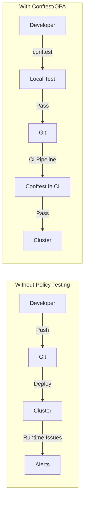

# How to Test Kubernetes Manifests with Conftest and OPA

Author: [nawazdhandala](https://www.github.com/nawazdhandala)

Tags: Kubernetes, Conftest, OPA, Open Policy Agent, Policy Testing, GitOps, DevOps

Description: Learn how to use Conftest and Open Policy Agent (OPA) to test Kubernetes manifests against security policies, best practices, and organizational standards before deployment.

---

Testing Kubernetes manifests before deployment prevents misconfigurations from reaching your clusters. Conftest and Open Policy Agent (OPA) enable policy-as-code testing that can run locally and in CI/CD pipelines.

## Why Policy Testing?



| Issue | Without Testing | With Conftest |
|-------|-----------------|---------------|
| Missing limits | Runtime OOM | Caught in CI |
| Privileged pods | Security risk | Blocked |
| Wrong registry | Image pull failure | Rejected |
| Missing labels | Chaos in production | Prevented |

## Installation

### Install Conftest

```bash
# macOS
brew install conftest

# Linux
wget https://github.com/open-policy-agent/conftest/releases/download/v0.46.0/conftest_0.46.0_Linux_x86_64.tar.gz
tar xzf conftest_0.46.0_Linux_x86_64.tar.gz
sudo mv conftest /usr/local/bin/

# Docker
docker run --rm -v $(pwd):/project openpolicyagent/conftest test deployment.yaml
```

### Project Structure

```
kubernetes/
├── manifests/
│   ├── deployment.yaml
│   ├── service.yaml
│   └── configmap.yaml
├── policy/
│   ├── deployment.rego
│   ├── security.rego
│   └── labels.rego
├── .conftest.toml
└── Makefile
```

## Writing Rego Policies

### Basic Policy Structure

```rego
# policy/deployment.rego
package main

# Deny deployments without resource limits
deny[msg] {
    input.kind == "Deployment"
    container := input.spec.template.spec.containers[_]
    not container.resources.limits
    msg := sprintf("Container '%s' in Deployment '%s' must have resource limits", [container.name, input.metadata.name])
}

# Deny deployments without resource requests
deny[msg] {
    input.kind == "Deployment"
    container := input.spec.template.spec.containers[_]
    not container.resources.requests
    msg := sprintf("Container '%s' in Deployment '%s' must have resource requests", [container.name, input.metadata.name])
}

# Require minimum replicas for production
deny[msg] {
    input.kind == "Deployment"
    input.metadata.namespace == "production"
    input.spec.replicas < 2
    msg := sprintf("Deployment '%s' in production must have at least 2 replicas", [input.metadata.name])
}
```

### Security Policies

```rego
# policy/security.rego
package main

# Deny privileged containers
deny[msg] {
    input.kind == "Deployment"
    container := input.spec.template.spec.containers[_]
    container.securityContext.privileged == true
    msg := sprintf("Container '%s' cannot be privileged", [container.name])
}

# Deny containers running as root
deny[msg] {
    input.kind == "Deployment"
    container := input.spec.template.spec.containers[_]
    not container.securityContext.runAsNonRoot
    msg := sprintf("Container '%s' must set runAsNonRoot: true", [container.name])
}

# Require read-only root filesystem
deny[msg] {
    input.kind == "Deployment"
    container := input.spec.template.spec.containers[_]
    not container.securityContext.readOnlyRootFilesystem
    msg := sprintf("Container '%s' should have readOnlyRootFilesystem: true", [container.name])
}

# Deny hostNetwork
deny[msg] {
    input.kind == "Deployment"
    input.spec.template.spec.hostNetwork == true
    msg := sprintf("Deployment '%s' cannot use hostNetwork", [input.metadata.name])
}

# Deny hostPID
deny[msg] {
    input.kind == "Deployment"
    input.spec.template.spec.hostPID == true
    msg := sprintf("Deployment '%s' cannot use hostPID", [input.metadata.name])
}

# Deny hostPath volumes
deny[msg] {
    input.kind == "Deployment"
    volume := input.spec.template.spec.volumes[_]
    volume.hostPath
    msg := sprintf("Deployment '%s' cannot use hostPath volumes", [input.metadata.name])
}

# Require security context at pod level
deny[msg] {
    input.kind == "Deployment"
    not input.spec.template.spec.securityContext
    msg := sprintf("Deployment '%s' must have a pod-level securityContext", [input.metadata.name])
}
```

### Image Policies

```rego
# policy/images.rego
package main

# Allowed image registries
allowed_registries := [
    "mycompany.azurecr.io",
    "gcr.io/myproject",
    "docker.io/library"
]

# Deny images from unapproved registries
deny[msg] {
    input.kind == "Deployment"
    container := input.spec.template.spec.containers[_]
    not image_from_allowed_registry(container.image)
    msg := sprintf("Container '%s' uses image from unapproved registry: %s", [container.name, container.image])
}

image_from_allowed_registry(image) {
    registry := allowed_registries[_]
    startswith(image, registry)
}

# Deny 'latest' tag
deny[msg] {
    input.kind == "Deployment"
    container := input.spec.template.spec.containers[_]
    endswith(container.image, ":latest")
    msg := sprintf("Container '%s' cannot use 'latest' tag", [container.name])
}

# Deny images without explicit tag
deny[msg] {
    input.kind == "Deployment"
    container := input.spec.template.spec.containers[_]
    not contains(container.image, ":")
    msg := sprintf("Container '%s' must specify an image tag", [container.name])
}
```

### Label Policies

```rego
# policy/labels.rego
package main

# Required labels for all resources
required_labels := [
    "app",
    "env",
    "team",
    "version"
]

# Deny resources missing required labels
deny[msg] {
    required_label := required_labels[_]
    not input.metadata.labels[required_label]
    msg := sprintf("%s '%s' is missing required label: %s", [input.kind, input.metadata.name, required_label])
}

# Validate environment label values
valid_environments := ["development", "staging", "production"]

deny[msg] {
    label := input.metadata.labels.env
    not label in valid_environments
    msg := sprintf("%s '%s' has invalid 'env' label value: %s (must be one of: %v)", [input.kind, input.metadata.name, label, valid_environments])
}
```

### Namespace Policies

```rego
# policy/namespace.rego
package main

# Deny resources in default namespace
deny[msg] {
    input.metadata.namespace == "default"
    msg := sprintf("%s '%s' cannot be deployed to 'default' namespace", [input.kind, input.metadata.name])
}

# No namespace specified (will default to 'default')
deny[msg] {
    not input.metadata.namespace
    input.kind != "Namespace"
    input.kind != "ClusterRole"
    input.kind != "ClusterRoleBinding"
    msg := sprintf("%s '%s' must specify a namespace", [input.kind, input.metadata.name])
}

# Protected namespaces
protected_namespaces := ["kube-system", "kube-public", "kube-node-lease"]

deny[msg] {
    namespace := input.metadata.namespace
    namespace in protected_namespaces
    not is_system_resource
    msg := sprintf("%s '%s' cannot be deployed to protected namespace: %s", [input.kind, input.metadata.name, namespace])
}

is_system_resource {
    input.metadata.labels["app.kubernetes.io/managed-by"] == "Helm"
    input.metadata.labels["app.kubernetes.io/name"] == "kube-prometheus-stack"
}
```

## Advanced Policies

### Network Policies Required

```rego
# policy/network.rego
package main

# Track which namespaces have network policies
namespaces_with_netpol[ns] {
    input.kind == "NetworkPolicy"
    ns := input.metadata.namespace
}

# Require network policy for production deployments
warn[msg] {
    input.kind == "Deployment"
    input.metadata.namespace == "production"
    # This is a warning since we can't check across files easily
    msg := sprintf("Deployment '%s' in production should have a NetworkPolicy", [input.metadata.name])
}
```

### Resource Limits Ranges

```rego
# policy/resources.rego
package main

# Maximum allowed resources
max_cpu_limit := "2"
max_memory_limit := "4Gi"

# Parse and compare resource values
deny[msg] {
    input.kind == "Deployment"
    container := input.spec.template.spec.containers[_]
    cpu_limit := container.resources.limits.cpu
    cpu_value := to_number(trim_suffix(cpu_limit, "m")) / 1000
    cpu_value > to_number(max_cpu_limit)
    msg := sprintf("Container '%s' CPU limit %s exceeds maximum %s", [container.name, cpu_limit, max_cpu_limit])
}

# Require limits to not exceed requests by more than 2x
warn[msg] {
    input.kind == "Deployment"
    container := input.spec.template.spec.containers[_]
    requests := container.resources.requests.memory
    limits := container.resources.limits.memory
    # Simplified check - in reality you'd parse the values
    msg := sprintf("Container '%s' memory limit should not exceed 2x requests", [container.name])
}
```

### Pod Disruption Budget Required

```rego
# policy/availability.rego
package main

# Production deployments with 3+ replicas should have PDB
warn[msg] {
    input.kind == "Deployment"
    input.metadata.namespace == "production"
    input.spec.replicas >= 3
    msg := sprintf("Deployment '%s' with %d replicas should have a PodDisruptionBudget", [input.metadata.name, input.spec.replicas])
}

# HPA should not set minReplicas to 1 in production
deny[msg] {
    input.kind == "HorizontalPodAutoscaler"
    input.metadata.namespace == "production"
    input.spec.minReplicas < 2
    msg := sprintf("HPA '%s' in production must have minReplicas >= 2", [input.metadata.name])
}
```

## Running Conftest

### Basic Commands

```bash
# Test a single file
conftest test deployment.yaml

# Test multiple files
conftest test *.yaml

# Test a directory
conftest test manifests/

# Use specific policy directory
conftest test deployment.yaml -p policies/

# Output in different formats
conftest test deployment.yaml -o json
conftest test deployment.yaml -o tap
conftest test deployment.yaml -o table

# Show only failures
conftest test deployment.yaml --fail-on-warn
```

### Configuration File

```toml
# .conftest.toml
# Conftest configuration

# Default policy location
policy = "policy"

# Default namespace
namespace = "main"

# Output format
output = "stdout"

# Fail on warnings
fail-on-warn = false
```

### Testing Helm Charts

```bash
# Render Helm template and test
helm template myrelease ./mychart | conftest test -

# Test with values
helm template myrelease ./mychart -f values-prod.yaml | conftest test -

# Test Helm chart directory
conftest test ./mychart/templates/
```

### Testing Kustomize

```bash
# Build and test
kustomize build overlays/production | conftest test -

# Or directly
kubectl kustomize overlays/production | conftest test -
```

## CI/CD Integration

### GitHub Actions

```yaml
# .github/workflows/policy-test.yaml
name: Policy Tests

on:
  pull_request:
    paths:
      - 'kubernetes/**'
      - 'policy/**'

jobs:
  conftest:
    runs-on: ubuntu-latest
    steps:
      - uses: actions/checkout@v4
      
      - name: Install Conftest
        run: |
          wget https://github.com/open-policy-agent/conftest/releases/download/v0.46.0/conftest_0.46.0_Linux_x86_64.tar.gz
          tar xzf conftest_0.46.0_Linux_x86_64.tar.gz
          sudo mv conftest /usr/local/bin/
      
      - name: Run Policy Tests
        run: |
          conftest test kubernetes/manifests/*.yaml -p policy/ --fail-on-warn
      
      - name: Test Helm Charts
        run: |
          helm template myapp ./charts/myapp | conftest test - -p policy/
```

### GitLab CI

```yaml
# .gitlab-ci.yml
policy-test:
  stage: test
  image: openpolicyagent/conftest:latest
  script:
    - conftest test kubernetes/*.yaml -p policy/ --fail-on-warn
  rules:
    - changes:
        - kubernetes/**
        - policy/**
```

### Pre-commit Hook

```yaml
# .pre-commit-config.yaml
repos:
  - repo: https://github.com/open-policy-agent/conftest
    rev: v0.46.0
    hooks:
      - id: conftest
        args: ["-p", "policy/"]
        files: \.ya?ml$
```

```bash
# Install pre-commit
pip install pre-commit
pre-commit install

# Manual run
pre-commit run conftest --all-files
```

## Testing Policies

### Unit Testing Rego

```rego
# policy/deployment_test.rego
package main

# Test that deployment without limits is denied
test_deployment_without_limits_denied {
    input := {
        "kind": "Deployment",
        "metadata": {"name": "test"},
        "spec": {
            "template": {
                "spec": {
                    "containers": [{
                        "name": "app",
                        "image": "nginx:1.19"
                    }]
                }
            }
        }
    }
    
    count(deny) > 0
}

# Test that deployment with limits is allowed
test_deployment_with_limits_allowed {
    input := {
        "kind": "Deployment",
        "metadata": {"name": "test"},
        "spec": {
            "template": {
                "spec": {
                    "containers": [{
                        "name": "app",
                        "image": "nginx:1.19",
                        "resources": {
                            "limits": {
                                "cpu": "100m",
                                "memory": "128Mi"
                            },
                            "requests": {
                                "cpu": "50m",
                                "memory": "64Mi"
                            }
                        }
                    }]
                }
            }
        }
    }
    
    count(deny) == 0
}
```

```bash
# Run policy tests
conftest verify -p policy/

# With verbose output
conftest verify -p policy/ --trace
```

## Makefile

```makefile
# Makefile
.PHONY: test test-policies lint

MANIFESTS_DIR := kubernetes/manifests
POLICY_DIR := policy

# Test all manifests
test:
	conftest test $(MANIFESTS_DIR)/*.yaml -p $(POLICY_DIR)/ --fail-on-warn

# Test Helm chart
test-helm:
	helm template myapp ./charts/myapp | conftest test - -p $(POLICY_DIR)/

# Verify policies (unit tests)
test-policies:
	conftest verify -p $(POLICY_DIR)/

# Format Rego files
fmt:
	opa fmt -w $(POLICY_DIR)/

# Lint Rego files
lint:
	opa check $(POLICY_DIR)/

# All checks
all: fmt lint test-policies test
```

## Summary

| Policy Type | Purpose | Example |
|-------------|---------|---------|
| Security | Prevent misconfigurations | No privileged containers |
| Best Practices | Enforce standards | Resource limits required |
| Compliance | Meet requirements | Specific registries only |
| Organizational | Custom rules | Required labels |

## Related Posts

- [How to Write Kubernetes Admission Webhooks from Scratch](https://oneuptime.com/blog/post/2026-01-19-kubernetes-admission-webhooks-scratch/view) - Runtime enforcement
- [How to Scan Kubernetes Clusters for CIS Benchmark Compliance](https://oneuptime.com/blog/post/2026-01-19-kubernetes-cis-benchmark-compliance/view) - Security scanning
- [How to Implement Pod Security Contexts Correctly](https://oneuptime.com/blog/post/2026-01-19-kubernetes-pod-security-contexts/view) - Container security
