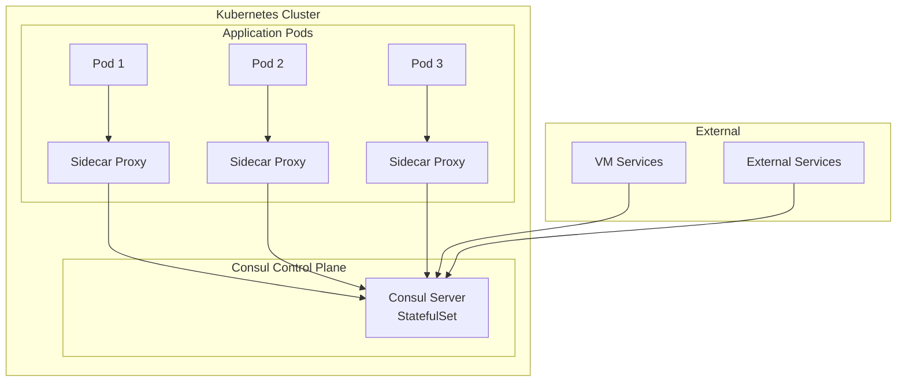

# How to Set Up Kubernetes Service Discovery with Consul

Author: [nawazdhandala](https://www.github.com/nawazdhandala)

Tags: Kubernetes, Consul, Service Discovery, Service Mesh, HashiCorp, Networking

Description: Learn how to integrate HashiCorp Consul with Kubernetes for service discovery, service mesh capabilities, and multi-platform connectivity.

---

HashiCorp Consul provides service discovery, configuration, and segmentation functionality that integrates seamlessly with Kubernetes. It's particularly useful for hybrid environments connecting Kubernetes with VMs or other platforms.

This guide covers deploying and configuring Consul for service discovery in Kubernetes.

## Consul Architecture in Kubernetes



## Installing Consul

### Using Helm

```bash
# Add HashiCorp Helm repository
helm repo add hashicorp https://helm.releases.hashicorp.com
helm repo update

# Create namespace
kubectl create namespace consul

# Install with default values
helm install consul hashicorp/consul \
  --namespace consul \
  --set global.name=consul

# Or with custom values file
helm install consul hashicorp/consul \
  --namespace consul \
  -f consul-values.yaml
```

### Production Helm Values

```yaml
# consul-values.yaml
global:
  name: consul
  datacenter: dc1
  
  # Enable gossip encryption
  gossipEncryption:
    secretName: consul-gossip-encryption-key
    secretKey: key
  
  # Enable TLS
  tls:
    enabled: true
    enableAutoEncrypt: true
    verify: true
  
  # Enable ACLs
  acls:
    manageSystemACLs: true

server:
  replicas: 3
  bootstrapExpect: 3
  
  storage: 10Gi
  storageClass: fast-ssd
  
  resources:
    requests:
      memory: "256Mi"
      cpu: "250m"
    limits:
      memory: "512Mi"
      cpu: "500m"
  
  # Anti-affinity for HA
  affinity: |
    podAntiAffinity:
      requiredDuringSchedulingIgnoredDuringExecution:
        - labelSelector:
            matchLabels:
              app: {{ template "consul.name" . }}
              release: "{{ .Release.Name }}"
              component: server
          topologyKey: kubernetes.io/hostname

client:
  enabled: true
  grpc: true
  
  resources:
    requests:
      memory: "128Mi"
      cpu: "100m"
    limits:
      memory: "256Mi"
      cpu: "250m"

# Enable Connect service mesh
connectInject:
  enabled: true
  default: false  # Opt-in for injection
  
  resources:
    requests:
      memory: "50Mi"
      cpu: "50m"
    limits:
      memory: "150Mi"
      cpu: "100m"

# Enable sync from Kubernetes to Consul
syncCatalog:
  enabled: true
  toConsul: true
  toK8S: false
  
  k8sPrefix: ""
  consulPrefix: ""
  
  # Only sync services with annotation
  k8sAllowNamespaces: ["*"]
  k8sDenyNamespaces: ["kube-system", "kube-public"]

# Enable Consul UI
ui:
  enabled: true
  service:
    type: ClusterIP
  ingress:
    enabled: true
    hosts:
      - host: consul.example.com

# Enable metrics
metrics:
  enabled: true
  enableAgentMetrics: true
  enableGatewayMetrics: true
```

### Generate Gossip Encryption Key

```bash
# Generate key
consul keygen

# Create Kubernetes secret
kubectl create secret generic consul-gossip-encryption-key \
  --namespace consul \
  --from-literal=key="<generated-key>"
```

## Service Registration

### Automatic Registration with Sync Catalog

```yaml
# Service with Consul sync annotation
apiVersion: v1
kind: Service
metadata:
  name: my-app
  namespace: production
  annotations:
    # Enable sync to Consul
    consul.hashicorp.com/service-sync: "true"
spec:
  selector:
    app: my-app
  ports:
    - port: 80
      targetPort: 8080
```

### Manual Service Registration

```yaml
# consul-service-registration.yaml
apiVersion: v1
kind: ConfigMap
metadata:
  name: consul-service-config
  namespace: production
data:
  my-app.json: |
    {
      "service": {
        "name": "my-app",
        "id": "my-app-1",
        "port": 8080,
        "tags": ["production", "api"],
        "meta": {
          "version": "1.0.0"
        },
        "checks": [
          {
            "http": "http://localhost:8080/health",
            "interval": "10s",
            "timeout": "5s"
          }
        ]
      }
    }
```

### Using Connect Sidecar Injection

```yaml
# Deployment with Consul Connect sidecar
apiVersion: apps/v1
kind: Deployment
metadata:
  name: my-app
  namespace: production
spec:
  replicas: 3
  selector:
    matchLabels:
      app: my-app
  template:
    metadata:
      labels:
        app: my-app
      annotations:
        # Enable Connect injection
        consul.hashicorp.com/connect-inject: "true"
        # Define upstream services
        consul.hashicorp.com/connect-service-upstreams: "database:5432,cache:6379"
    spec:
      containers:
        - name: app
          image: my-app:v1.0.0
          ports:
            - containerPort: 8080
          env:
            # Connect to upstreams via localhost
            - name: DATABASE_URL
              value: "postgres://localhost:5432/mydb"
            - name: REDIS_URL
              value: "redis://localhost:6379"
```

## Service Discovery

### DNS-Based Discovery

```yaml
# Query Consul DNS for services
apiVersion: v1
kind: Pod
metadata:
  name: test-dns
spec:
  containers:
    - name: test
      image: busybox
      command: ['sh', '-c', 'while true; do nslookup my-app.service.consul; sleep 10; done']
  dnsPolicy: ClusterFirst
  dnsConfig:
    nameservers:
      - 10.96.0.10  # Consul DNS service
    searches:
      - service.consul
```

### HTTP API Discovery

```python
# Python service discovery
import consul
import requests

# Create Consul client
c = consul.Consul(host='consul-server.consul.svc', port=8500)

# Discover healthy service instances
def get_service_instances(service_name):
    index, services = c.health.service(service_name, passing=True)
    instances = []
    for service in services:
        address = service['Service']['Address'] or service['Node']['Address']
        port = service['Service']['Port']
        instances.append(f"{address}:{port}")
    return instances

# Use discovered service
instances = get_service_instances('my-app')
response = requests.get(f"http://{instances[0]}/api/data")
```

### Kubernetes Service Discovery Integration

```yaml
# CoreDNS configuration for Consul integration
apiVersion: v1
kind: ConfigMap
metadata:
  name: coredns
  namespace: kube-system
data:
  Corefile: |
    .:53 {
        errors
        health
        kubernetes cluster.local in-addr.arpa ip6.arpa {
            pods insecure
            fallthrough in-addr.arpa ip6.arpa
        }
        # Forward Consul DNS queries
        consul:53 {
            forward . consul-dns.consul.svc:8600
        }
        forward . /etc/resolv.conf
        cache 30
        loop
        reload
        loadbalance
    }
```

## Consul Connect (Service Mesh)

### Intentions (Service-to-Service Authorization)

```yaml
# Allow my-app to connect to database
apiVersion: consul.hashicorp.com/v1alpha1
kind: ServiceIntentions
metadata:
  name: database
  namespace: consul
spec:
  destination:
    name: database
  sources:
    - name: my-app
      action: allow
    - name: admin-app
      action: allow
      permissions:
        - action: allow
          http:
            pathPrefix: "/admin"
            methods: ["GET", "POST"]
    # Deny all others by default
    - name: "*"
      action: deny
```

### Service Defaults

```yaml
# Default service configuration
apiVersion: consul.hashicorp.com/v1alpha1
kind: ServiceDefaults
metadata:
  name: my-app
  namespace: consul
spec:
  protocol: http
  
  # Mesh gateway mode for cross-datacenter
  meshGateway:
    mode: local
  
  # Transparent proxy settings
  transparentProxy:
    dialedDirectly: false
  
  # Upstream configuration
  upstreamConfig:
    defaults:
      connectTimeoutMs: 5000
      protocol: http
      limits:
        maxConnections: 100
        maxPendingRequests: 100
        maxConcurrentRequests: 50
```

### Proxy Defaults

```yaml
# Global proxy configuration
apiVersion: consul.hashicorp.com/v1alpha1
kind: ProxyDefaults
metadata:
  name: global
  namespace: consul
spec:
  config:
    protocol: http
    
    # Envoy settings
    envoy_prometheus_bind_addr: "0.0.0.0:9102"
    envoy_extra_static_clusters_json: |
      {
        "name": "zipkin",
        "type": "STRICT_DNS",
        "connect_timeout": "5s",
        "load_assignment": {
          "cluster_name": "zipkin",
          "endpoints": [{
            "lb_endpoints": [{
              "endpoint": {
                "address": {
                  "socket_address": {
                    "address": "zipkin.observability.svc",
                    "port_value": 9411
                  }
                }
              }
            }]
          }]
        }
      }
    
    # Tracing
    envoy_tracing_json: |
      {
        "http": {
          "name": "envoy.tracers.zipkin",
          "typedConfig": {
            "@type": "type.googleapis.com/envoy.config.trace.v3.ZipkinConfig",
            "collector_cluster": "zipkin",
            "collector_endpoint_version": "HTTP_JSON",
            "collector_endpoint": "/api/v2/spans"
          }
        }
      }
  
  # Mesh gateway defaults
  meshGateway:
    mode: local
```

## Multi-Datacenter Setup

### Mesh Gateway

```yaml
# Enable mesh gateways
meshGateway:
  enabled: true
  replicas: 2
  
  service:
    type: LoadBalancer
    annotations:
      service.beta.kubernetes.io/aws-load-balancer-type: nlb
  
  resources:
    requests:
      memory: "128Mi"
      cpu: "250m"
    limits:
      memory: "256Mi"
      cpu: "500m"
```

### WAN Federation

```yaml
# Primary datacenter configuration
global:
  datacenter: dc1
  
  federation:
    enabled: true
    createFederationSecret: true

# Secondary datacenter configuration
global:
  datacenter: dc2
  
  federation:
    enabled: true
    primaryDatacenter: dc1
    k8sAuthMethodHost: https://dc1-k8s-api-server
    primaryGateways:
      - dc1-mesh-gateway.example.com:443
```

## Health Checks

### Application Health Check

```yaml
apiVersion: apps/v1
kind: Deployment
metadata:
  name: my-app
spec:
  template:
    metadata:
      annotations:
        consul.hashicorp.com/connect-inject: "true"
        # Define health check
        consul.hashicorp.com/health-check-http: "/health"
        consul.hashicorp.com/health-check-interval: "10s"
        consul.hashicorp.com/health-check-timeout: "5s"
    spec:
      containers:
        - name: app
          image: my-app:v1.0.0
          ports:
            - containerPort: 8080
          livenessProbe:
            httpGet:
              path: /health
              port: 8080
          readinessProbe:
            httpGet:
              path: /ready
              port: 8080
```

### Custom Health Checks

```json
// Consul health check configuration
{
  "service": {
    "name": "my-app",
    "checks": [
      {
        "name": "HTTP Health",
        "http": "http://localhost:8080/health",
        "interval": "10s",
        "timeout": "5s"
      },
      {
        "name": "TCP Check",
        "tcp": "localhost:8080",
        "interval": "5s"
      },
      {
        "name": "Script Check",
        "script": "/health-check.sh",
        "interval": "30s"
      }
    ]
  }
}
```

## Monitoring Consul

### Prometheus ServiceMonitor

```yaml
apiVersion: monitoring.coreos.com/v1
kind: ServiceMonitor
metadata:
  name: consul
  namespace: monitoring
spec:
  namespaceSelector:
    matchNames:
      - consul
  selector:
    matchLabels:
      app: consul
  endpoints:
    - port: http
      path: /v1/agent/metrics
      params:
        format: ["prometheus"]
      interval: 30s
```

### Key Metrics

```promql
# Consul server health
consul_raft_state_leader

# Service instance count
consul_catalog_services

# Failed health checks
consul_health_service_status{status!="passing"}

# Connect proxy connections
envoy_cluster_upstream_cx_total

# Request latency through Connect
histogram_quantile(0.99, 
  sum(rate(envoy_cluster_upstream_rq_time_bucket[5m])) by (consul_source_service, le)
)
```

## Troubleshooting

### Common Issues

```bash
# Check Consul server status
kubectl exec -it consul-server-0 -n consul -- consul members

# Check catalog
kubectl exec -it consul-server-0 -n consul -- consul catalog services

# Check service health
kubectl exec -it consul-server-0 -n consul -- consul catalog nodes -service=my-app

# Check intentions
kubectl exec -it consul-server-0 -n consul -- consul intention list

# Debug Connect sidecar
kubectl logs my-app-pod -c consul-connect-inject-init -n production
kubectl logs my-app-pod -c envoy-sidecar -n production
```

### DNS Resolution Testing

```bash
# Test DNS resolution
kubectl run -it --rm debug --image=busybox --restart=Never -- \
  nslookup my-app.service.consul consul-dns.consul.svc:8600

# Test service connectivity
kubectl run -it --rm debug --image=curlimages/curl --restart=Never -- \
  curl -v http://my-app.service.consul:8080/health
```

## Best Practices

### 1. Use ACLs in Production

```yaml
global:
  acls:
    manageSystemACLs: true
    
# Create tokens for applications
kubectl exec -it consul-server-0 -n consul -- \
  consul acl token create -description "my-app token" \
  -service-identity "my-app"
```

### 2. Enable TLS

```yaml
global:
  tls:
    enabled: true
    enableAutoEncrypt: true
    verify: true
```

### 3. Configure Resource Limits

```yaml
server:
  resources:
    requests:
      memory: "256Mi"
      cpu: "250m"
    limits:
      memory: "512Mi"
      cpu: "500m"
```

## Conclusion

Consul provides powerful service discovery and mesh capabilities for Kubernetes. Key takeaways:

1. **Use Helm for deployment** - Simplifies configuration management
2. **Enable Connect for service mesh** - Secure service-to-service communication
3. **Configure intentions** - Control traffic between services
4. **Use DNS integration** - Seamless service discovery
5. **Monitor health** - Track service health with checks

For comprehensive service monitoring, check out [OneUptime's monitoring platform](https://oneuptime.com/product/metrics).

## Related Resources

- [How to Set Up Cross-Cluster Service Discovery](https://oneuptime.com/blog/post/2026-01-19-kubernetes-cross-cluster-service-discovery/view)
- [How to Configure Service Mesh with Istio](https://oneuptime.com/blog/post/kubernetes-istio-service-mesh/view)
- [How to Set Up Network Policies](https://oneuptime.com/blog/post/2026-01-19-kubernetes-pod-communication-across-namespaces/view)
