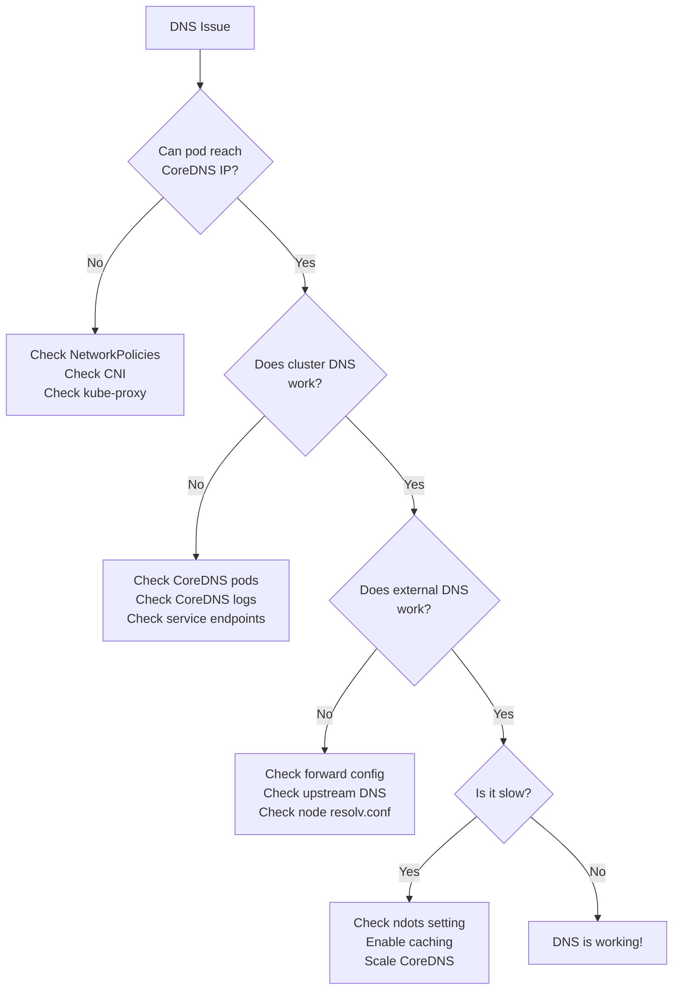

# How to Troubleshoot Kubernetes DNS Issues (CoreDNS)

Author: [nawazdhandala](https://www.github.com/nawazdhandala)

Tags: Kubernetes, DNS, CoreDNS, Troubleshooting, Networking, DevOps

Description: Common DNS problems and debugging techniques - from resolution failures to performance tuning and CoreDNS configuration.

DNS is the nervous system of Kubernetes. Every service discovery, every pod-to-pod connection, every external API call starts with a DNS query. When DNS fails, everything fails. This guide walks through systematic debugging of Kubernetes DNS issues, from simple misconfigurations to complex CoreDNS performance problems.

---

## How Kubernetes DNS Works

Before debugging, understand the DNS flow in Kubernetes.

This diagram shows how a DNS query travels from a pod to CoreDNS and potentially to upstream servers:

```mermaid
graph LR
    subgraph Pod
        App[Application]
        RC[/etc/resolv.conf]
    end
    
    subgraph Node
        NIC[Node Network]
    end
    
    subgraph kube-system
        CoreDNS[CoreDNS Pod]
        CDNS_SVC[kube-dns Service<br/>10.96.0.10]
    end
    
    subgraph External
        Upstream[Upstream DNS<br/>8.8.8.8]
    end
    
    App --> RC
    RC -->|ClusterIP| CDNS_SVC
    CDNS_SVC --> CoreDNS
    CoreDNS -->|Cluster queries| CoreDNS
    CoreDNS -->|External queries| Upstream
```

Key points:
- Pods get `/etc/resolv.conf` from the kubelet
- The nameserver points to the `kube-dns` Service (typically `10.96.0.10`)
- CoreDNS runs as a Deployment in `kube-system`
- Cluster-internal queries (`.cluster.local`) are resolved by CoreDNS
- External queries are forwarded to upstream DNS servers

## Step 1: Identify the Symptoms

DNS issues manifest in various ways:

| Symptom | Likely Cause |
|---------|--------------|
| `Name or service not known` | DNS resolution failing completely |
| `Temporary failure in name resolution` | CoreDNS unreachable or overloaded |
| Connection timeouts | Slow DNS responses |
| Random failures | DNS race conditions or intermittent issues |
| Works from node, fails in pod | Pod DNS configuration problem |

## Step 2: Basic DNS Tests

Start with simple tests to isolate the problem.

### Test from Inside a Pod

Deploy a debug pod with DNS tools:

```bash
# Create a debug pod with DNS utilities
kubectl run dns-test --rm -it --restart=Never \
  --image=busybox:1.36 -- sh
```

Inside the pod, test DNS resolution:

```bash
# Test cluster DNS (should resolve to a ClusterIP)
nslookup kubernetes.default

# Test service resolution
nslookup my-service.my-namespace.svc.cluster.local

# Test external DNS
nslookup google.com

# Check resolv.conf configuration
cat /etc/resolv.conf
```

Expected `/etc/resolv.conf`:

```
search default.svc.cluster.local svc.cluster.local cluster.local
nameserver 10.96.0.10
options ndots:5
```

### Test CoreDNS Directly

Query CoreDNS service IP directly:

```bash
# From inside a pod, query CoreDNS directly
nslookup kubernetes.default 10.96.0.10

# Use dig for more details (if available)
dig @10.96.0.10 kubernetes.default.svc.cluster.local
```

### Test from the Node

Compare resolution from the node vs pod:

```bash
# On the node, test CoreDNS service IP
nslookup kubernetes.default.svc.cluster.local 10.96.0.10

# Test upstream DNS from the node
nslookup google.com 8.8.8.8
```

## Step 3: Check CoreDNS Health

### Verify CoreDNS Pods

```bash
# Check CoreDNS pods are running
kubectl get pods -n kube-system -l k8s-app=kube-dns

# Check for restarts or crash loops
kubectl get pods -n kube-system -l k8s-app=kube-dns \
  -o custom-columns=NAME:.metadata.name,RESTARTS:.status.containerStatuses[0].restartCount,STATUS:.status.phase
```

### Check CoreDNS Logs

```bash
# View CoreDNS logs for errors
kubectl logs -n kube-system -l k8s-app=kube-dns --tail=100

# Watch logs in real-time
kubectl logs -n kube-system -l k8s-app=kube-dns -f
```

Common log errors and meanings:

| Error | Meaning |
|-------|---------|
| `SERVFAIL` | Upstream DNS failed |
| `NXDOMAIN` | Domain doesn't exist |
| `i/o timeout` | Network connectivity issue |
| `connection refused` | CoreDNS not listening or blocked |

### Check CoreDNS Service

```bash
# Verify kube-dns service exists
kubectl get svc kube-dns -n kube-system

# Check endpoints (should match CoreDNS pod IPs)
kubectl get endpoints kube-dns -n kube-system
```

If endpoints are empty, CoreDNS pods either aren't running or don't match the service selector.

## Step 4: Common Problems and Solutions

### Problem 1: Pods Can't Reach CoreDNS

**Symptoms**: All DNS fails, including cluster-internal names.

**Debug steps**:

```bash
# Test network connectivity to CoreDNS from a pod
kubectl run test --rm -it --restart=Never --image=busybox -- \
  nc -vz 10.96.0.10 53

# Check if kube-proxy is working (services need it)
kubectl get pods -n kube-system -l k8s-app=kube-proxy
```

**Solutions**:

1. **Check NetworkPolicies**:

NetworkPolicies might block DNS traffic. Ensure pods can reach kube-dns:

```yaml
# Allow DNS egress for all pods
apiVersion: networking.k8s.io/v1
kind: NetworkPolicy
metadata:
  name: allow-dns
  namespace: default
spec:
  podSelector: {}
  policyTypes:
    - Egress
  egress:
    # Allow DNS to kube-dns service
    - to:
        - namespaceSelector:
            matchLabels:
              kubernetes.io/metadata.name: kube-system
          podSelector:
            matchLabels:
              k8s-app: kube-dns
      ports:
        - protocol: UDP
          port: 53
        - protocol: TCP
          port: 53
```

2. **Check firewall rules** on nodes blocking UDP/53

3. **Verify CNI plugin** is functioning correctly

### Problem 2: External DNS Resolution Fails

**Symptoms**: Cluster-internal DNS works, external domains fail.

**Debug steps**:

```bash
# Test external DNS directly
kubectl run test --rm -it --restart=Never --image=busybox -- \
  nslookup google.com

# Check CoreDNS forward configuration
kubectl get configmap coredns -n kube-system -o yaml
```

**Solutions**:

1. **Check upstream DNS in CoreDNS config**:

The Corefile should have a forward directive pointing to working upstream servers:

```yaml
apiVersion: v1
kind: ConfigMap
metadata:
  name: coredns
  namespace: kube-system
data:
  Corefile: |
    .:53 {
        errors
        health {
           lameduck 5s
        }
        ready
        kubernetes cluster.local in-addr.arpa ip6.arpa {
           pods insecure
           fallthrough in-addr.arpa ip6.arpa
           ttl 30
        }
        prometheus :9153
        # Forward external queries to upstream DNS
        forward . /etc/resolv.conf {
           max_concurrent 1000
        }
        cache 30
        loop
        reload
        loadbalance
    }
```

2. **Check node's /etc/resolv.conf**:

CoreDNS forwards to `/etc/resolv.conf` on the node by default:

```bash
# On the node
cat /etc/resolv.conf
```

If the node's resolv.conf is wrong, fix it or specify DNS servers directly:

```yaml
# In CoreDNS ConfigMap
forward . 8.8.8.8 8.8.4.4 {
   max_concurrent 1000
}
```

### Problem 3: DNS Resolution is Slow

**Symptoms**: Applications timeout or are slow to start, DNS works but takes seconds.

**Debug steps**:

```bash
# Time DNS queries
kubectl run test --rm -it --restart=Never --image=busybox -- \
  time nslookup kubernetes.default

# Check CoreDNS latency metrics
kubectl port-forward -n kube-system svc/kube-dns 9153:9153 &
curl localhost:9153/metrics | grep coredns_dns_request_duration
```

**Solutions**:

1. **Increase CoreDNS replicas**:

```bash
# Scale CoreDNS for higher throughput
kubectl scale deployment coredns -n kube-system --replicas=3
```

2. **Enable CoreDNS caching** (usually already enabled):

```yaml
cache 60  # Cache for 60 seconds
```

3. **Check ndots setting**:

The default `ndots:5` causes many DNS queries for simple names. If your app queries external domains frequently, reduce it:

```yaml
apiVersion: v1
kind: Pod
spec:
  dnsConfig:
    options:
      - name: ndots
        value: "2"  # Reduce search iterations
```

4. **Use FQDN for external domains**:

```bash
# Slow (searches all domains in search path)
nslookup api.external.com

# Fast (no search, direct query)
nslookup api.external.com.
```

### Problem 4: Intermittent DNS Failures

**Symptoms**: DNS works most of the time but randomly fails.

**Debug steps**:

```bash
# Run repeated DNS tests
for i in $(seq 1 100); do
  kubectl run test-$i --rm -it --restart=Never --image=busybox -- \
    nslookup google.com 2>&1 | grep -E "(Address|NXDOMAIN|timeout)"
done
```

**Solutions**:

1. **DNS race condition (conntrack issue)**:

On Linux, UDP DNS packets can hit conntrack race conditions. Enable TCP fallback:

```yaml
# CoreDNS ConfigMap - enable TCP
forward . /etc/resolv.conf {
   prefer_udp
   max_concurrent 1000
}
```

Or in application pods, force TCP:

```yaml
spec:
  dnsConfig:
    options:
      - name: use-vc  # Force TCP
```

2. **Add CoreDNS pod anti-affinity**:

Spread CoreDNS pods across nodes to survive node failures:

```yaml
# CoreDNS Deployment patch
spec:
  template:
    spec:
      affinity:
        podAntiAffinity:
          preferredDuringSchedulingIgnoredDuringExecution:
            - weight: 100
              podAffinityTerm:
                labelSelector:
                  matchLabels:
                    k8s-app: kube-dns
                topologyKey: kubernetes.io/hostname
```

### Problem 5: Services Not Resolvable

**Symptoms**: `nslookup my-service` returns `NXDOMAIN`.

**Debug steps**:

```bash
# Check service exists
kubectl get svc my-service -n my-namespace

# Try full FQDN
nslookup my-service.my-namespace.svc.cluster.local

# Check if in different namespace
kubectl get svc --all-namespaces | grep my-service
```

**Solutions**:

1. **Use correct namespace**:

Services are namespace-scoped. From namespace `a`, query service in namespace `b`:

```bash
# From pod in namespace 'a', access service in 'b'
nslookup my-service.b.svc.cluster.local
```

2. **Check service has endpoints**:

```bash
kubectl get endpoints my-service -n my-namespace
```

If endpoints are empty, pods either don't exist or don't match the service selector.

3. **Verify label selectors**:

```bash
# Check service selector
kubectl get svc my-service -o yaml | grep -A5 selector

# Check pod labels
kubectl get pods -l app=my-app --show-labels
```

## Step 5: CoreDNS Configuration Tuning

### View Current Configuration

```bash
# Get the CoreDNS ConfigMap
kubectl get configmap coredns -n kube-system -o yaml
```

### Enable Debug Logging

Temporarily enable verbose logging:

```yaml
# Edit ConfigMap
kubectl edit configmap coredns -n kube-system
```

Add the `log` plugin:

```yaml
data:
  Corefile: |
    .:53 {
        log  # Add this line for verbose logging
        errors
        health
        ready
        kubernetes cluster.local in-addr.arpa ip6.arpa {
           pods insecure
           fallthrough in-addr.arpa ip6.arpa
        }
        forward . /etc/resolv.conf
        cache 30
        loop
        reload
    }
```

CoreDNS automatically reloads the config. Check logs:

```bash
kubectl logs -n kube-system -l k8s-app=kube-dns -f
```

**Important**: Remove the `log` directive after debugging - it generates significant output.

### Performance Tuning

For high-traffic clusters, tune CoreDNS:

This ConfigMap includes performance optimizations for high-query-volume clusters:

```yaml
apiVersion: v1
kind: ConfigMap
metadata:
  name: coredns
  namespace: kube-system
data:
  Corefile: |
    .:53 {
        errors
        health {
           lameduck 5s
        }
        ready
        
        kubernetes cluster.local in-addr.arpa ip6.arpa {
           pods insecure
           fallthrough in-addr.arpa ip6.arpa
           ttl 30
        }
        
        prometheus :9153
        
        # Forward with connection pooling
        forward . /etc/resolv.conf {
           max_concurrent 1000
           policy sequential  # Try servers in order
        }
        
        # Aggressive caching
        cache {
           success 9984 60    # Cache successful lookups for 60s
           denial 9984 30     # Cache NXDOMAIN for 30s
           prefetch 10 60s 25%  # Prefetch popular names
        }
        
        loop
        reload 10s  # Check for config changes every 10s
        loadbalance round_robin
    }
```

### Add Custom DNS Entries

Add static DNS entries for internal services:

```yaml
data:
  Corefile: |
    .:53 {
        # ... other plugins
        
        # Custom hosts entries
        hosts {
           10.0.0.100 legacy-db.internal
           10.0.0.101 old-api.internal
           fallthrough
        }
        
        # ... rest of config
    }
```

## Step 6: Monitoring CoreDNS

### Prometheus Metrics

CoreDNS exposes metrics on port 9153. Key metrics to monitor:

```promql
# DNS request rate
rate(coredns_dns_requests_total[5m])

# DNS request latency (p99)
histogram_quantile(0.99, 
  rate(coredns_dns_request_duration_seconds_bucket[5m])
)

# Cache hit rate
rate(coredns_cache_hits_total[5m]) / 
  (rate(coredns_cache_hits_total[5m]) + rate(coredns_cache_misses_total[5m]))

# Error rate
rate(coredns_dns_responses_total{rcode="SERVFAIL"}[5m])
```

### Alert Rules

Create alerts for DNS issues:

```yaml
apiVersion: monitoring.coreos.com/v1
kind: PrometheusRule
metadata:
  name: coredns-alerts
spec:
  groups:
    - name: coredns
      rules:
        - alert: CoreDNSDown
          expr: |
            absent(up{job="coredns"} == 1)
          for: 5m
          labels:
            severity: critical
          annotations:
            summary: "CoreDNS is down"
        
        - alert: CoreDNSHighLatency
          expr: |
            histogram_quantile(0.99, 
              rate(coredns_dns_request_duration_seconds_bucket[5m])
            ) > 0.5
          for: 5m
          labels:
            severity: warning
          annotations:
            summary: "CoreDNS p99 latency > 500ms"
        
        - alert: CoreDNSHighErrorRate
          expr: |
            rate(coredns_dns_responses_total{rcode="SERVFAIL"}[5m]) /
            rate(coredns_dns_responses_total[5m]) > 0.05
          for: 5m
          labels:
            severity: warning
          annotations:
            summary: "CoreDNS SERVFAIL rate > 5%"
```

## Debugging Flowchart

When troubleshooting, follow this decision tree:



## Quick Reference Commands

```bash
# Test DNS from a pod
kubectl run dns-test --rm -it --restart=Never --image=busybox -- nslookup kubernetes.default

# Check CoreDNS pods
kubectl get pods -n kube-system -l k8s-app=kube-dns

# View CoreDNS logs
kubectl logs -n kube-system -l k8s-app=kube-dns --tail=50

# Check CoreDNS config
kubectl get configmap coredns -n kube-system -o yaml

# Check kube-dns service
kubectl get svc kube-dns -n kube-system

# Check kube-dns endpoints
kubectl get endpoints kube-dns -n kube-system

# Test with dig (more verbose)
kubectl run dig --rm -it --restart=Never --image=tutum/dnsutils -- \
  dig @10.96.0.10 kubernetes.default.svc.cluster.local

# Scale CoreDNS
kubectl scale deployment coredns -n kube-system --replicas=3

# Restart CoreDNS (force reload)
kubectl rollout restart deployment coredns -n kube-system
```

## Related Resources

- [Learn Kubernetes Step by Step](https://oneuptime.com/blog/post/2025-11-27-learn-kubernetes-step-by-step/view) - Kubernetes fundamentals including Services
- [Monitor Kubernetes Clusters with OpenTelemetry and OneUptime](https://oneuptime.com/blog/post/2025-11-14-monitor-kubernetes-clusters-with-opentelemetry-and-oneuptime/view) - Set up comprehensive cluster monitoring
- [How to Debug Services with kubectl Port-Forward](https://oneuptime.com/blog/post/2025-11-27-port-forward-ingress-debug/view) - Debug networking issues

DNS issues are frustrating because everything depends on them. The good news: with systematic debugging, most problems trace back to a handful of root causes - NetworkPolicies, misconfigured forwarders, or resource constraints. Follow the flowchart, check the common issues, and your DNS will be reliably resolving names in no time.
