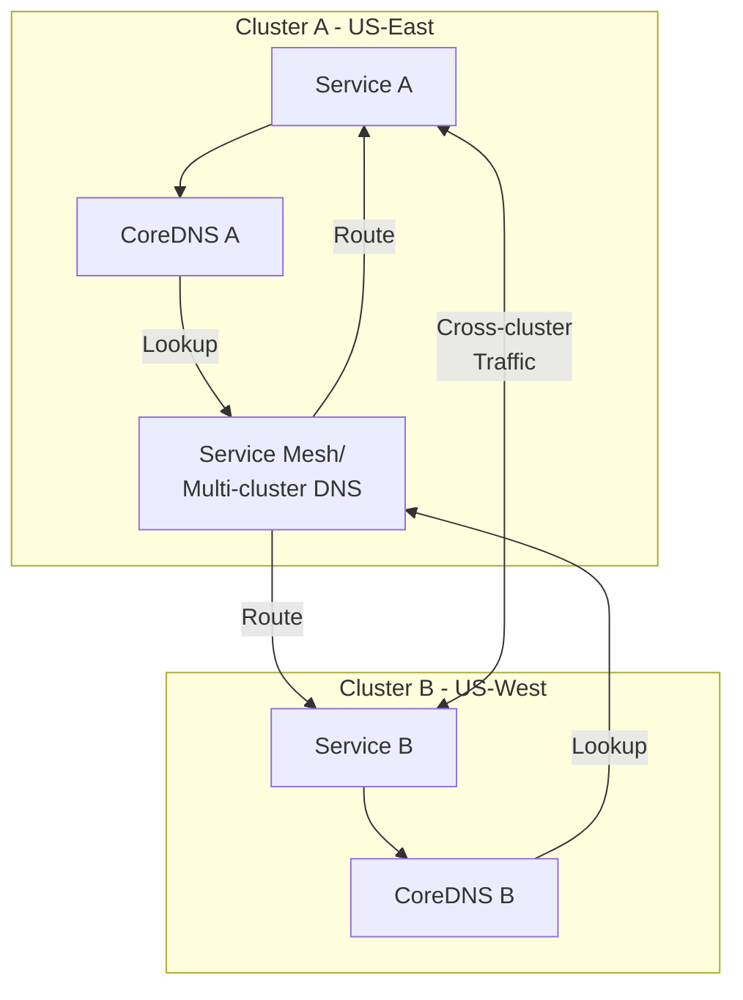

# How to Set Up Cross-Cluster Service Discovery in Kubernetes

Author: [nawazdhandala](https://www.github.com/nawazdhandala)

Tags: Kubernetes, Multi-Cluster, Service Discovery, Submariner, Service Mesh, Networking

Description: Learn how to implement cross-cluster service discovery to enable seamless communication between services running in different Kubernetes clusters.

---

As organizations scale to multiple Kubernetes clusters for high availability, compliance, or geographic distribution, enabling services to discover and communicate across cluster boundaries becomes essential.

This guide covers various approaches to cross-cluster service discovery.

## Cross-Cluster Architecture



## Solution Comparison

| Solution | Complexity | Features | Use Case |
|----------|------------|----------|----------|
| Submariner | Medium | L3 connectivity, ServiceDiscovery | Multi-cloud, hybrid |
| Istio Multi-cluster | High | Full mesh features, mTLS | Complex microservices |
| Cilium Cluster Mesh | Medium | eBPF, network policies | Performance-focused |
| Skupper | Low | Application-layer, no admin rights | Developer self-service |
| Consul | Medium | Service mesh, KV store | HashiCorp ecosystem |

## Submariner Setup

### Install Submariner

```bash
# Install subctl CLI
curl -Ls https://get.submariner.io | bash
export PATH=$PATH:~/.local/bin

# Verify subctl
subctl version

# Prerequisites check
subctl show versions
```

### Deploy Broker

```bash
# Deploy broker on a dedicated cluster or one of the member clusters
subctl deploy-broker --kubeconfig ~/.kube/config-broker

# This creates broker-info.subm file containing connection details
ls broker-info.subm
```

### Join Clusters

```bash
# Join Cluster A
subctl join --kubeconfig ~/.kube/config-cluster-a \
  broker-info.subm \
  --clusterid cluster-a \
  --cable-driver libreswan \
  --health-check-enabled \
  --pod-cidr 10.244.0.0/16 \
  --service-cidr 10.96.0.0/12

# Join Cluster B
subctl join --kubeconfig ~/.kube/config-cluster-b \
  broker-info.subm \
  --clusterid cluster-b \
  --cable-driver libreswan \
  --health-check-enabled \
  --pod-cidr 10.245.0.0/16 \
  --service-cidr 10.97.0.0/12

# Note: Pod and Service CIDRs must not overlap between clusters
```

### Verify Connectivity

```bash
# Check cluster connectivity
subctl show connections

# Check gateway status
subctl show gateways

# Diagnose issues
subctl diagnose all

# Test connectivity
subctl verify --context cluster-a --tocontext cluster-b --verbose
```

### Export Services

```yaml
# Cluster A: Export a service
# service-export.yaml
apiVersion: multicluster.x-k8s.io/v1alpha1
kind: ServiceExport
metadata:
  name: api-service
  namespace: production
```

```bash
# Apply the export
kubectl --context cluster-a apply -f service-export.yaml

# Check export status
kubectl --context cluster-a get serviceexport -n production

# The service is now discoverable as:
# api-service.production.svc.clusterset.local
```

### Consume Cross-Cluster Services

```yaml
# Cluster B: Access the exported service
# deployment.yaml
apiVersion: apps/v1
kind: Deployment
metadata:
  name: frontend
  namespace: production
spec:
  template:
    spec:
      containers:
        - name: frontend
          image: frontend:latest
          env:
            # Use clusterset.local domain for cross-cluster
            - name: API_URL
              value: "http://api-service.production.svc.clusterset.local"
            # Falls back to local service if available
```

## Istio Multi-Cluster Setup

### Primary-Remote Model

```bash
# Install Istio on primary cluster (cluster-a)
istioctl install --context=cluster-a -f - <<EOF
apiVersion: install.istio.io/v1alpha1
kind: IstioOperator
spec:
  values:
    global:
      meshID: mesh1
      multiCluster:
        clusterName: cluster-a
      network: network1
EOF

# Create cross-network gateway
kubectl --context=cluster-a apply -f samples/multicluster/expose-istiod.yaml

# Enable API server access from remote cluster
istioctl x create-remote-secret --context=cluster-a \
  --name=cluster-a | kubectl apply -f - --context=cluster-b

# Install Istio on remote cluster
istioctl install --context=cluster-b -f - <<EOF
apiVersion: install.istio.io/v1alpha1
kind: IstioOperator
spec:
  profile: remote
  values:
    global:
      meshID: mesh1
      multiCluster:
        clusterName: cluster-b
      network: network1
      remotePilotAddress: <cluster-a-istiod-ip>
EOF
```

### Multi-Primary Model

```bash
# Configure both clusters as primaries
# Cluster A
istioctl install --context=cluster-a -f - <<EOF
apiVersion: install.istio.io/v1alpha1
kind: IstioOperator
spec:
  values:
    global:
      meshID: mesh1
      multiCluster:
        clusterName: cluster-a
      network: network-a
EOF

# Cluster B
istioctl install --context=cluster-b -f - <<EOF
apiVersion: install.istio.io/v1alpha1
kind: IstioOperator
spec:
  values:
    global:
      meshID: mesh1
      multiCluster:
        clusterName: cluster-b
      network: network-b
EOF

# Exchange secrets
istioctl x create-remote-secret --context=cluster-a --name=cluster-a | \
  kubectl apply -f - --context=cluster-b
istioctl x create-remote-secret --context=cluster-b --name=cluster-b | \
  kubectl apply -f - --context=cluster-a

# Install east-west gateways
kubectl --context=cluster-a apply -f samples/multicluster/gen-eastwest-gateway.yaml
kubectl --context=cluster-b apply -f samples/multicluster/gen-eastwest-gateway.yaml

# Expose services
kubectl --context=cluster-a apply -f samples/multicluster/expose-services.yaml
kubectl --context=cluster-b apply -f samples/multicluster/expose-services.yaml
```

### Cross-Cluster Traffic Policy

```yaml
# Force traffic to stay local when possible
apiVersion: networking.istio.io/v1beta1
kind: DestinationRule
metadata:
  name: api-service
  namespace: production
spec:
  host: api-service.production.svc.cluster.local
  trafficPolicy:
    connectionPool:
      tcp:
        maxConnections: 100
    loadBalancer:
      localityLbSetting:
        enabled: true
        # Prefer local cluster
        distribute:
          - from: "cluster-a/*"
            to:
              "cluster-a/*": 80
              "cluster-b/*": 20
    outlierDetection:
      consecutive5xxErrors: 5
      interval: 30s
      baseEjectionTime: 60s
```

## Cilium Cluster Mesh

### Install Cilium with Cluster Mesh

```bash
# Install Cilium on both clusters
cilium install --cluster-name cluster-a --cluster-id 1 --context cluster-a
cilium install --cluster-name cluster-b --cluster-id 2 --context cluster-b

# Enable Cluster Mesh
cilium clustermesh enable --context cluster-a
cilium clustermesh enable --context cluster-b

# Connect clusters
cilium clustermesh connect --context cluster-a --destination-context cluster-b

# Verify connection
cilium clustermesh status --context cluster-a
```

### Global Services with Cilium

```yaml
# Create a global service accessible from both clusters
# Cluster A
apiVersion: v1
kind: Service
metadata:
  name: global-api
  namespace: production
  annotations:
    io.cilium/global-service: "true"    # Makes service global
    io.cilium/shared-service: "true"    # Load balance across clusters
spec:
  type: ClusterIP
  selector:
    app: api
  ports:
    - port: 80
      targetPort: 8080
```

### Service Affinity

```yaml
# Prefer local endpoints but fail over to remote
apiVersion: v1
kind: Service
metadata:
  name: api-service
  namespace: production
  annotations:
    io.cilium/global-service: "true"
    io.cilium/service-affinity: "local"  # Prefer local cluster
spec:
  type: ClusterIP
  selector:
    app: api
  ports:
    - port: 80
```

## Skupper (Application Layer)

### Install Skupper

```bash
# Install skupper CLI
curl https://skupper.io/install.sh | sh

# Initialize on both clusters
skupper --context cluster-a init --site-name cluster-a
skupper --context cluster-b init --site-name cluster-b

# Link clusters
skupper --context cluster-a token create ~/token.yaml
skupper --context cluster-b link create ~/token.yaml

# Check status
skupper --context cluster-a status
```

### Expose Services

```bash
# Expose a deployment
skupper --context cluster-a expose deployment/api-service --port 8080

# Or expose a specific service
skupper --context cluster-a expose service api-service --address api

# Check exposed services
skupper --context cluster-a service status
```

### Access from Other Cluster

```yaml
# Service automatically available in cluster-b
# Pods can access: api-service:8080
apiVersion: apps/v1
kind: Deployment
metadata:
  name: frontend
  namespace: default
spec:
  template:
    spec:
      containers:
        - name: frontend
          env:
            - name: API_URL
              value: "http://api:8080"  # Skupper handles routing
```

## Custom Multi-Cluster DNS

### CoreDNS Plugin

```yaml
# CoreDNS ConfigMap with multicluster plugin
apiVersion: v1
kind: ConfigMap
metadata:
  name: coredns
  namespace: kube-system
data:
  Corefile: |
    .:53 {
        errors
        health
        kubernetes cluster.local in-addr.arpa ip6.arpa {
            pods insecure
            fallthrough in-addr.arpa ip6.arpa
        }
        # Forward cross-cluster lookups
        multicluster clusterset.local {
            kubeconfig /etc/kubernetes/kubeconfig-remote
        }
        forward . /etc/resolv.conf
        cache 30
        loop
        reload
        loadbalance
    }
```

### External DNS Approach

```yaml
# Use External DNS with Route53/Cloud DNS for cross-cluster discovery
apiVersion: externaldns.k8s.io/v1alpha1
kind: DNSEndpoint
metadata:
  name: api-service
  namespace: production
spec:
  endpoints:
    - dnsName: api.internal.example.com
      recordTTL: 60
      recordType: A
      targets:
        - 10.0.1.100  # Service IP in cluster A
        - 10.0.2.100  # Service IP in cluster B
---
# Service can be accessed via: api.internal.example.com
```

## Monitoring Cross-Cluster Services

### Prometheus Multi-Cluster

```yaml
# Remote write to central Prometheus
apiVersion: v1
kind: ConfigMap
metadata:
  name: prometheus-config
data:
  prometheus.yml: |
    global:
      external_labels:
        cluster: cluster-a
    remote_write:
      - url: https://prometheus-central.example.com/api/v1/write
        basic_auth:
          username: prometheus
          password_file: /etc/prometheus/password
```

### Cross-Cluster Metrics

```promql
# Query services across clusters
sum by (cluster, service) (
  rate(http_requests_total{job="kubernetes-pods"}[5m])
)

# Cross-cluster latency
histogram_quantile(0.99,
  sum by (cluster, le) (
    rate(http_request_duration_seconds_bucket{
      service="api-service"
    }[5m])
  )
)
```

## Best Practices

### 1. Non-Overlapping CIDRs

```bash
# Plan your CIDR allocation
# Cluster A:
#   Pod CIDR: 10.244.0.0/16
#   Service CIDR: 10.96.0.0/16

# Cluster B:
#   Pod CIDR: 10.245.0.0/16
#   Service CIDR: 10.97.0.0/16

# Cluster C:
#   Pod CIDR: 10.246.0.0/16
#   Service CIDR: 10.98.0.0/16
```

### 2. Health Checks

```yaml
# Implement cross-cluster health checks
apiVersion: v1
kind: ConfigMap
metadata:
  name: health-check-script
data:
  check.sh: |
    #!/bin/bash
    ENDPOINTS=(
      "api.cluster-a.svc.clusterset.local:8080/health"
      "api.cluster-b.svc.clusterset.local:8080/health"
    )
    for ep in "${ENDPOINTS[@]}"; do
      if ! curl -sf "http://$ep"; then
        echo "Endpoint $ep unhealthy"
        exit 1
      fi
    done
```

### 3. Graceful Degradation

```yaml
# Configure timeouts and retries for cross-cluster calls
apiVersion: networking.istio.io/v1beta1
kind: VirtualService
metadata:
  name: api-service
spec:
  hosts:
    - api-service
  http:
    - timeout: 5s
      retries:
        attempts: 3
        perTryTimeout: 2s
        retryOn: connect-failure,refused-stream,503
      route:
        - destination:
            host: api-service
```

## Conclusion

Cross-cluster service discovery is essential for multi-cluster Kubernetes deployments. Key takeaways:

1. **Choose based on needs** - Submariner for L3, Istio for full mesh, Cilium for performance
2. **Plan CIDRs carefully** - Avoid overlapping ranges
3. **Implement health checks** - Monitor cross-cluster connectivity
4. **Handle failures gracefully** - Timeouts, retries, circuit breakers
5. **Secure cross-cluster traffic** - mTLS, network policies

For monitoring cross-cluster services, check out [OneUptime's multi-cluster monitoring](https://oneuptime.com/product/metrics).

## Related Resources

- [How to Set Up Kubernetes Federation](https://oneuptime.com/blog/post/kubernetes-federation-multi-cluster/view)
- [How to Configure Service Mesh with Istio](https://oneuptime.com/blog/post/kubernetes-istio-service-mesh/view)
- [How to Set Up Network Policies](https://oneuptime.com/blog/post/kubernetes-pod-communication-across-namespaces/view)
