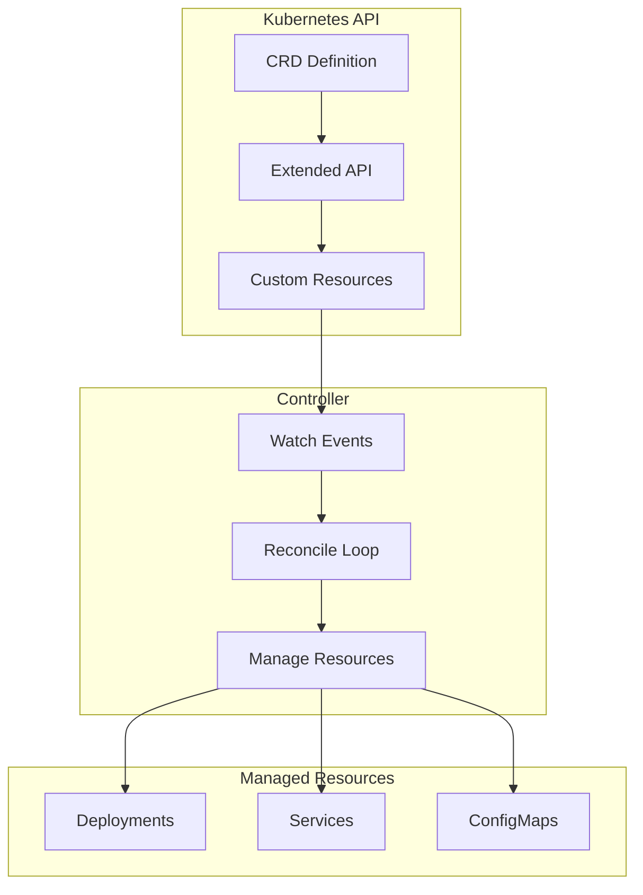

# How to Implement Custom Resource Definitions (CRDs) in Kubernetes

Author: [nawazdhandala](https://www.github.com/nawazdhandala)

Tags: Kubernetes, CRDs, Custom Resources, Controllers, Operators, Go, DevOps

Description: Learn how to create Custom Resource Definitions in Kubernetes to extend the API with your own resource types, including schema validation, versioning, and building controllers.

---

Custom Resource Definitions (CRDs) allow you to extend the Kubernetes API with your own resource types. Combined with custom controllers, they form the foundation of the Operator pattern. This guide covers creating, versioning, and managing CRDs.

## CRD Architecture



## Create a Basic CRD

### Simple CRD Definition

```yaml
# webapp-crd.yaml
apiVersion: apiextensions.k8s.io/v1
kind: CustomResourceDefinition
metadata:
  name: webapps.example.com  # <plural>.<group>
spec:
  group: example.com
  
  names:
    kind: WebApp
    listKind: WebAppList
    plural: webapps
    singular: webapp
    shortNames:
      - wa
  
  scope: Namespaced  # or Cluster
  
  versions:
    - name: v1
      served: true   # API version enabled
      storage: true  # Primary storage version
      
      schema:
        openAPIV3Schema:
          type: object
          properties:
            spec:
              type: object
              required:
                - image
                - replicas
              properties:
                image:
                  type: string
                  description: Container image
                replicas:
                  type: integer
                  minimum: 1
                  maximum: 100
                  default: 1
                port:
                  type: integer
                  default: 8080
            status:
              type: object
              properties:
                availableReplicas:
                  type: integer
                conditions:
                  type: array
                  items:
                    type: object
                    properties:
                      type:
                        type: string
                      status:
                        type: string
                      lastTransitionTime:
                        type: string
                        format: date-time
      
      # Additional printer columns for kubectl get
      additionalPrinterColumns:
        - name: Image
          type: string
          jsonPath: .spec.image
        - name: Replicas
          type: integer
          jsonPath: .spec.replicas
        - name: Available
          type: integer
          jsonPath: .status.availableReplicas
        - name: Age
          type: date
          jsonPath: .metadata.creationTimestamp
      
      # Enable status subresource
      subresources:
        status: {}
        # scale:
        #   specReplicasPath: .spec.replicas
        #   statusReplicasPath: .status.availableReplicas
```

```bash
# Apply the CRD
kubectl apply -f webapp-crd.yaml

# Verify CRD is created
kubectl get crd webapps.example.com

# Check CRD details
kubectl describe crd webapps.example.com
```

## Create Custom Resources

```yaml
# my-webapp.yaml
apiVersion: example.com/v1
kind: WebApp
metadata:
  name: my-webapp
  namespace: production
spec:
  image: nginx:1.25
  replicas: 3
  port: 80
```

```bash
# Create the custom resource
kubectl apply -f my-webapp.yaml

# List custom resources
kubectl get webapps -n production
kubectl get wa -n production  # Using short name

# Output:
# NAME        IMAGE        REPLICAS   AVAILABLE   AGE
# my-webapp   nginx:1.25   3          0           10s

# Describe custom resource
kubectl describe webapp my-webapp -n production
```

## Advanced Schema Validation

### Complex Schema with Validation

```yaml
apiVersion: apiextensions.k8s.io/v1
kind: CustomResourceDefinition
metadata:
  name: databases.example.com
spec:
  group: example.com
  names:
    kind: Database
    plural: databases
    singular: database
    shortNames:
      - db
  scope: Namespaced
  
  versions:
    - name: v1
      served: true
      storage: true
      
      schema:
        openAPIV3Schema:
          type: object
          required:
            - spec
          properties:
            spec:
              type: object
              required:
                - engine
                - version
              properties:
                engine:
                  type: string
                  enum:
                    - postgres
                    - mysql
                    - mongodb
                  description: Database engine type
                
                version:
                  type: string
                  pattern: '^\d+\.\d+(\.\d+)?$'
                  description: Version in semver format
                
                storage:
                  type: object
                  properties:
                    size:
                      type: string
                      pattern: '^\d+(Gi|Ti)$'
                      default: "10Gi"
                    storageClass:
                      type: string
                
                resources:
                  type: object
                  properties:
                    cpu:
                      type: string
                      pattern: '^\d+(m)?$'
                    memory:
                      type: string
                      pattern: '^\d+(Mi|Gi)$'
                
                backup:
                  type: object
                  properties:
                    enabled:
                      type: boolean
                      default: true
                    schedule:
                      type: string
                      pattern: '^(@(annually|yearly|monthly|weekly|daily|hourly|reboot))|(@every (\d+(ns|us|µs|ms|s|m|h))+)|((((\d+,)+\d+|(\d+(\/|-)\d+)|\d+|\*) ?){5,7})$'
                    retention:
                      type: integer
                      minimum: 1
                      maximum: 365
                      default: 7
                
                # One of - using x-kubernetes-validations
                highAvailability:
                  type: object
                  properties:
                    enabled:
                      type: boolean
                      default: false
                    replicas:
                      type: integer
                      minimum: 2
                      maximum: 7
              
              # CEL validation rules (Kubernetes 1.25+)
              x-kubernetes-validations:
                - rule: "self.engine == 'postgres' ? (self.version.startsWith('15') || self.version.startsWith('14')) : true"
                  message: "PostgreSQL only supports versions 14.x and 15.x"
                - rule: "!self.highAvailability.enabled || self.highAvailability.replicas >= 2"
                  message: "High availability requires at least 2 replicas"
            
            status:
              type: object
              properties:
                phase:
                  type: string
                  enum:
                    - Pending
                    - Creating
                    - Running
                    - Failed
                    - Terminating
                endpoint:
                  type: string
                conditions:
                  type: array
                  items:
                    type: object
                    required:
                      - type
                      - status
                    properties:
                      type:
                        type: string
                      status:
                        type: string
                        enum: ["True", "False", "Unknown"]
                      reason:
                        type: string
                      message:
                        type: string
                      lastTransitionTime:
                        type: string
                        format: date-time
      
      additionalPrinterColumns:
        - name: Engine
          type: string
          jsonPath: .spec.engine
        - name: Version
          type: string
          jsonPath: .spec.version
        - name: Phase
          type: string
          jsonPath: .status.phase
        - name: Endpoint
          type: string
          jsonPath: .status.endpoint
        - name: Age
          type: date
          jsonPath: .metadata.creationTimestamp
      
      subresources:
        status: {}
```

## CRD Versioning

### Multiple Versions with Conversion

```yaml
apiVersion: apiextensions.k8s.io/v1
kind: CustomResourceDefinition
metadata:
  name: webapps.example.com
spec:
  group: example.com
  names:
    kind: WebApp
    plural: webapps
  scope: Namespaced
  
  # Define conversion webhook
  conversion:
    strategy: Webhook
    webhook:
      conversionReviewVersions:
        - v1
      clientConfig:
        service:
          name: webapp-conversion-webhook
          namespace: system
          path: /convert
          port: 443
        caBundle: ${CA_BUNDLE}
  
  versions:
    # Old version
    - name: v1alpha1
      served: true
      storage: false
      deprecated: true
      deprecationWarning: "v1alpha1 is deprecated, migrate to v1"
      schema:
        openAPIV3Schema:
          type: object
          properties:
            spec:
              type: object
              properties:
                image:
                  type: string
                size:  # Old field name
                  type: integer
    
    # Current version
    - name: v1
      served: true
      storage: true
      schema:
        openAPIV3Schema:
          type: object
          properties:
            spec:
              type: object
              properties:
                image:
                  type: string
                replicas:  # Renamed field
                  type: integer
                resources:  # New field
                  type: object
                  properties:
                    cpu:
                      type: string
                    memory:
                      type: string
```

## Build a Controller in Go

### Controller Structure

```go
// controllers/webapp_controller.go
package controllers

import (
	"context"
	"fmt"

	appsv1 "k8s.io/api/apps/v1"
	corev1 "k8s.io/api/core/v1"
	"k8s.io/apimachinery/pkg/api/errors"
	metav1 "k8s.io/apimachinery/pkg/apis/meta/v1"
	"k8s.io/apimachinery/pkg/runtime"
	"k8s.io/apimachinery/pkg/types"
	ctrl "sigs.k8s.io/controller-runtime"
	"sigs.k8s.io/controller-runtime/pkg/client"
	"sigs.k8s.io/controller-runtime/pkg/log"

	examplev1 "github.com/example/webapp-operator/api/v1"
)

type WebAppReconciler struct {
	client.Client
	Scheme *runtime.Scheme
}

// +kubebuilder:rbac:groups=example.com,resources=webapps,verbs=get;list;watch;create;update;patch;delete
// +kubebuilder:rbac:groups=example.com,resources=webapps/status,verbs=get;update;patch
// +kubebuilder:rbac:groups=apps,resources=deployments,verbs=get;list;watch;create;update;patch;delete
// +kubebuilder:rbac:groups=core,resources=services,verbs=get;list;watch;create;update;patch;delete

func (r *WebAppReconciler) Reconcile(ctx context.Context, req ctrl.Request) (ctrl.Result, error) {
	logger := log.FromContext(ctx)

	// Fetch the WebApp instance
	webapp := &examplev1.WebApp{}
	if err := r.Get(ctx, req.NamespacedName, webapp); err != nil {
		if errors.IsNotFound(err) {
			logger.Info("WebApp not found, likely deleted")
			return ctrl.Result{}, nil
		}
		return ctrl.Result{}, err
	}

	// Create or update Deployment
	deployment := r.deploymentForWebApp(webapp)
	if err := r.createOrUpdate(ctx, deployment, webapp); err != nil {
		return ctrl.Result{}, err
	}

	// Create or update Service
	service := r.serviceForWebApp(webapp)
	if err := r.createOrUpdate(ctx, service, webapp); err != nil {
		return ctrl.Result{}, err
	}

	// Update status
	if err := r.updateStatus(ctx, webapp); err != nil {
		return ctrl.Result{}, err
	}

	return ctrl.Result{}, nil
}

func (r *WebAppReconciler) deploymentForWebApp(webapp *examplev1.WebApp) *appsv1.Deployment {
	replicas := int32(webapp.Spec.Replicas)
	labels := map[string]string{
		"app":        webapp.Name,
		"controller": "webapp-operator",
	}

	return &appsv1.Deployment{
		ObjectMeta: metav1.ObjectMeta{
			Name:      webapp.Name,
			Namespace: webapp.Namespace,
		},
		Spec: appsv1.DeploymentSpec{
			Replicas: &replicas,
			Selector: &metav1.LabelSelector{
				MatchLabels: labels,
			},
			Template: corev1.PodTemplateSpec{
				ObjectMeta: metav1.ObjectMeta{
					Labels: labels,
				},
				Spec: corev1.PodSpec{
					Containers: []corev1.Container{
						{
							Name:  "webapp",
							Image: webapp.Spec.Image,
							Ports: []corev1.ContainerPort{
								{
									ContainerPort: int32(webapp.Spec.Port),
								},
							},
						},
					},
				},
			},
		},
	}
}

func (r *WebAppReconciler) serviceForWebApp(webapp *examplev1.WebApp) *corev1.Service {
	return &corev1.Service{
		ObjectMeta: metav1.ObjectMeta{
			Name:      webapp.Name,
			Namespace: webapp.Namespace,
		},
		Spec: corev1.ServiceSpec{
			Selector: map[string]string{
				"app": webapp.Name,
			},
			Ports: []corev1.ServicePort{
				{
					Port:       80,
					TargetPort: intstr.FromInt(webapp.Spec.Port),
				},
			},
		},
	}
}

func (r *WebAppReconciler) updateStatus(ctx context.Context, webapp *examplev1.WebApp) error {
	// Get the deployment
	deployment := &appsv1.Deployment{}
	if err := r.Get(ctx, types.NamespacedName{
		Name:      webapp.Name,
		Namespace: webapp.Namespace,
	}, deployment); err != nil {
		return err
	}

	// Update WebApp status
	webapp.Status.AvailableReplicas = int(deployment.Status.AvailableReplicas)
	
	return r.Status().Update(ctx, webapp)
}

func (r *WebAppReconciler) SetupWithManager(mgr ctrl.Manager) error {
	return ctrl.NewControllerManagedBy(mgr).
		For(&examplev1.WebApp{}).
		Owns(&appsv1.Deployment{}).
		Owns(&corev1.Service{}).
		Complete(r)
}
```

### API Types Definition

```go
// api/v1/webapp_types.go
package v1

import (
	metav1 "k8s.io/apimachinery/pkg/apis/meta/v1"
)

// WebAppSpec defines the desired state of WebApp
type WebAppSpec struct {
	// Image is the container image
	// +kubebuilder:validation:Required
	Image string `json:"image"`

	// Replicas is the number of pods
	// +kubebuilder:validation:Minimum=1
	// +kubebuilder:validation:Maximum=100
	// +kubebuilder:default=1
	Replicas int `json:"replicas,omitempty"`

	// Port is the container port
	// +kubebuilder:default=8080
	Port int `json:"port,omitempty"`
}

// WebAppStatus defines the observed state of WebApp
type WebAppStatus struct {
	AvailableReplicas int               `json:"availableReplicas,omitempty"`
	Conditions        []metav1.Condition `json:"conditions,omitempty"`
}

// +kubebuilder:object:root=true
// +kubebuilder:subresource:status
// +kubebuilder:printcolumn:name="Image",type=string,JSONPath=`.spec.image`
// +kubebuilder:printcolumn:name="Replicas",type=integer,JSONPath=`.spec.replicas`
// +kubebuilder:printcolumn:name="Available",type=integer,JSONPath=`.status.availableReplicas`
// +kubebuilder:printcolumn:name="Age",type="date",JSONPath=".metadata.creationTimestamp"

// WebApp is the Schema for the webapps API
type WebApp struct {
	metav1.TypeMeta   `json:",inline"`
	metav1.ObjectMeta `json:"metadata,omitempty"`

	Spec   WebAppSpec   `json:"spec,omitempty"`
	Status WebAppStatus `json:"status,omitempty"`
}

// +kubebuilder:object:root=true

// WebAppList contains a list of WebApp
type WebAppList struct {
	metav1.TypeMeta `json:",inline"`
	metav1.ListMeta `json:"metadata,omitempty"`
	Items           []WebApp `json:"items"`
}

func init() {
	SchemeBuilder.Register(&WebApp{}, &WebAppList{})
}
```

## Finalizers for Cleanup

```go
const webappFinalizer = "example.com/finalizer"

func (r *WebAppReconciler) Reconcile(ctx context.Context, req ctrl.Request) (ctrl.Result, error) {
	webapp := &examplev1.WebApp{}
	if err := r.Get(ctx, req.NamespacedName, webapp); err != nil {
		return ctrl.Result{}, client.IgnoreNotFound(err)
	}

	// Check if being deleted
	if !webapp.DeletionTimestamp.IsZero() {
		if controllerutil.ContainsFinalizer(webapp, webappFinalizer) {
			// Run cleanup logic
			if err := r.cleanupResources(ctx, webapp); err != nil {
				return ctrl.Result{}, err
			}
			
			// Remove finalizer
			controllerutil.RemoveFinalizer(webapp, webappFinalizer)
			if err := r.Update(ctx, webapp); err != nil {
				return ctrl.Result{}, err
			}
		}
		return ctrl.Result{}, nil
	}

	// Add finalizer if not present
	if !controllerutil.ContainsFinalizer(webapp, webappFinalizer) {
		controllerutil.AddFinalizer(webapp, webappFinalizer)
		if err := r.Update(ctx, webapp); err != nil {
			return ctrl.Result{}, err
		}
	}

	// ... rest of reconciliation
}
```

## Summary

| Concept | Purpose |
|---------|---------|
| CRD | Define custom resource schema |
| Schema Validation | Enforce resource structure |
| Printer Columns | kubectl get output |
| Subresources | status/scale endpoints |
| Controller | Reconcile desired state |
| Finalizers | Cleanup on deletion |

## Related Posts

- [How to Use Kubernetes Operators from OperatorHub](https://oneuptime.com/blog/post/2026-01-19-kubernetes-operators-operatorhub/view) - Using operators
- [How to Build Kubernetes Admission Webhooks from Scratch](https://oneuptime.com/blog/post/2026-01-19-kubernetes-admission-webhooks-scratch/view) - Webhooks
- [How to Test Kubernetes YAML Configs with Conftest and OPA](https://oneuptime.com/blog/post/2026-01-19-kubernetes-conftest-opa-testing/view) - Policy testing
