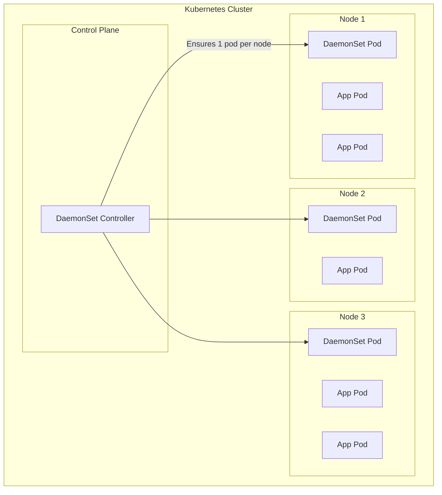

# How to Run Kubernetes DaemonSets for Node-Level Services

Author: [nawazdhandala](https://www.github.com/nawazdhandala)

Tags: Kubernetes, DaemonSets, Node Services, Logging, Monitoring, Networking, DevOps

Description: Learn how to use Kubernetes DaemonSets to deploy node-level services like log collectors, monitoring agents, network plugins, and storage drivers across all cluster nodes.

---

DaemonSets ensure that a copy of a pod runs on all (or a subset of) nodes in your cluster. They're essential for node-level operations like log collection, monitoring, networking, and storage management.

## DaemonSet Architecture



| Feature | Deployment | DaemonSet |
|---------|------------|-----------|
| Replicas | Specified count | One per node |
| Scheduling | Scheduler decides | Guaranteed per node |
| Scale | Manual/HPA | Automatic with nodes |
| Use case | Stateless apps | Node-level services |

## Common Use Cases

### 1. Log Collection (Fluentd/Fluent Bit)

```yaml
# fluentbit-daemonset.yaml
apiVersion: apps/v1
kind: DaemonSet
metadata:
  name: fluent-bit
  namespace: logging
  labels:
    app: fluent-bit
spec:
  selector:
    matchLabels:
      app: fluent-bit
  template:
    metadata:
      labels:
        app: fluent-bit
    spec:
      serviceAccountName: fluent-bit
      
      containers:
        - name: fluent-bit
          image: fluent/fluent-bit:2.2
          
          ports:
            - containerPort: 2020
              name: metrics
          
          env:
            - name: NODE_NAME
              valueFrom:
                fieldRef:
                  fieldPath: spec.nodeName
            - name: FLUENT_ELASTICSEARCH_HOST
              value: elasticsearch.logging.svc.cluster.local
            - name: FLUENT_ELASTICSEARCH_PORT
              value: "9200"
          
          resources:
            requests:
              cpu: 100m
              memory: 128Mi
            limits:
              cpu: 500m
              memory: 512Mi
          
          volumeMounts:
            - name: varlog
              mountPath: /var/log
              readOnly: true
            - name: varlibdockercontainers
              mountPath: /var/lib/docker/containers
              readOnly: true
            - name: fluent-bit-config
              mountPath: /fluent-bit/etc/
          
          livenessProbe:
            httpGet:
              path: /api/v1/health
              port: 2020
            initialDelaySeconds: 10
            periodSeconds: 10
          
          readinessProbe:
            httpGet:
              path: /api/v1/health
              port: 2020
            initialDelaySeconds: 5
            periodSeconds: 5
      
      volumes:
        - name: varlog
          hostPath:
            path: /var/log
        - name: varlibdockercontainers
          hostPath:
            path: /var/lib/docker/containers
        - name: fluent-bit-config
          configMap:
            name: fluent-bit-config
      
      tolerations:
        # Run on all nodes including control plane
        - operator: Exists
      
      # High priority to ensure logs are always collected
      priorityClassName: system-node-critical
---
apiVersion: v1
kind: ConfigMap
metadata:
  name: fluent-bit-config
  namespace: logging
data:
  fluent-bit.conf: |
    [SERVICE]
        Flush         5
        Log_Level     info
        Daemon        off
        Parsers_File  parsers.conf
        HTTP_Server   On
        HTTP_Listen   0.0.0.0
        HTTP_Port     2020

    [INPUT]
        Name              tail
        Path              /var/log/containers/*.log
        Parser            docker
        Tag               kube.*
        Refresh_Interval  5
        Mem_Buf_Limit     50MB
        Skip_Long_Lines   On

    [FILTER]
        Name                kubernetes
        Match               kube.*
        Kube_URL            https://kubernetes.default.svc:443
        Kube_CA_File        /var/run/secrets/kubernetes.io/serviceaccount/ca.crt
        Kube_Token_File     /var/run/secrets/kubernetes.io/serviceaccount/token
        Merge_Log           On
        K8S-Logging.Parser  On
        K8S-Logging.Exclude On

    [OUTPUT]
        Name            es
        Match           *
        Host            ${FLUENT_ELASTICSEARCH_HOST}
        Port            ${FLUENT_ELASTICSEARCH_PORT}
        Logstash_Format On
        Logstash_Prefix kubernetes
        Retry_Limit     False
  
  parsers.conf: |
    [PARSER]
        Name        docker
        Format      json
        Time_Key    time
        Time_Format %Y-%m-%dT%H:%M:%S.%L
        Time_Keep   On
```

### 2. Monitoring Agent (Prometheus Node Exporter)

```yaml
# node-exporter-daemonset.yaml
apiVersion: apps/v1
kind: DaemonSet
metadata:
  name: node-exporter
  namespace: monitoring
  labels:
    app: node-exporter
spec:
  selector:
    matchLabels:
      app: node-exporter
  template:
    metadata:
      labels:
        app: node-exporter
      annotations:
        prometheus.io/scrape: "true"
        prometheus.io/port: "9100"
    spec:
      hostNetwork: true
      hostPID: true
      hostIPC: true
      
      containers:
        - name: node-exporter
          image: prom/node-exporter:v1.7.0
          args:
            - --path.procfs=/host/proc
            - --path.sysfs=/host/sys
            - --path.rootfs=/host/root
            - --collector.filesystem.mount-points-exclude=^/(dev|proc|sys|var/lib/docker/.+|var/lib/kubelet/.+)($|/)
            - --collector.netclass.ignored-devices=^(veth.*|docker.*|br-.*)$
          
          ports:
            - containerPort: 9100
              hostPort: 9100
              name: metrics
          
          resources:
            requests:
              cpu: 50m
              memory: 64Mi
            limits:
              cpu: 200m
              memory: 128Mi
          
          securityContext:
            privileged: true
          
          volumeMounts:
            - name: proc
              mountPath: /host/proc
              readOnly: true
            - name: sys
              mountPath: /host/sys
              readOnly: true
            - name: root
              mountPath: /host/root
              readOnly: true
              mountPropagation: HostToContainer
      
      volumes:
        - name: proc
          hostPath:
            path: /proc
        - name: sys
          hostPath:
            path: /sys
        - name: root
          hostPath:
            path: /
      
      tolerations:
        - operator: Exists
      
      nodeSelector:
        kubernetes.io/os: linux
---
apiVersion: v1
kind: Service
metadata:
  name: node-exporter
  namespace: monitoring
  labels:
    app: node-exporter
spec:
  clusterIP: None
  ports:
    - port: 9100
      name: metrics
  selector:
    app: node-exporter
```

### 3. Network Plugin (CNI)

```yaml
# cni-plugin-daemonset.yaml
apiVersion: apps/v1
kind: DaemonSet
metadata:
  name: cni-plugin
  namespace: kube-system
  labels:
    app: cni-plugin
spec:
  selector:
    matchLabels:
      app: cni-plugin
  template:
    metadata:
      labels:
        app: cni-plugin
    spec:
      hostNetwork: true
      
      initContainers:
        # Install CNI binaries
        - name: install-cni
          image: myregistry/cni-plugin:v1.0.0
          command:
            - /bin/sh
            - -c
            - |
              cp /cni-plugins/* /opt/cni/bin/
              echo "CNI binaries installed"
          volumeMounts:
            - name: cni-bin
              mountPath: /opt/cni/bin
          securityContext:
            privileged: true
        
        # Install CNI configuration
        - name: install-config
          image: myregistry/cni-plugin:v1.0.0
          command:
            - /bin/sh
            - -c
            - |
              cat > /etc/cni/net.d/10-mynet.conflist << EOF
              {
                "cniVersion": "0.4.0",
                "name": "mynet",
                "plugins": [
                  {
                    "type": "bridge",
                    "bridge": "cni0",
                    "isGateway": true,
                    "ipMasq": true,
                    "ipam": {
                      "type": "host-local",
                      "subnet": "10.244.0.0/16",
                      "routes": [
                        { "dst": "0.0.0.0/0" }
                      ]
                    }
                  }
                ]
              }
              EOF
          volumeMounts:
            - name: cni-conf
              mountPath: /etc/cni/net.d
      
      containers:
        - name: cni-agent
          image: myregistry/cni-plugin:v1.0.0
          command: ["/cni-agent"]
          args:
            - --node-name=$(NODE_NAME)
          env:
            - name: NODE_NAME
              valueFrom:
                fieldRef:
                  fieldPath: spec.nodeName
          securityContext:
            privileged: true
          volumeMounts:
            - name: cni-bin
              mountPath: /opt/cni/bin
            - name: cni-conf
              mountPath: /etc/cni/net.d
      
      volumes:
        - name: cni-bin
          hostPath:
            path: /opt/cni/bin
            type: DirectoryOrCreate
        - name: cni-conf
          hostPath:
            path: /etc/cni/net.d
            type: DirectoryOrCreate
      
      tolerations:
        - operator: Exists
          effect: NoSchedule
        - operator: Exists
          effect: NoExecute
      
      priorityClassName: system-node-critical
```

### 4. Storage Driver (CSI Node Plugin)

```yaml
# csi-node-daemonset.yaml
apiVersion: apps/v1
kind: DaemonSet
metadata:
  name: csi-node-driver
  namespace: kube-system
spec:
  selector:
    matchLabels:
      app: csi-node-driver
  template:
    metadata:
      labels:
        app: csi-node-driver
    spec:
      hostNetwork: true
      
      containers:
        - name: csi-driver
          image: myregistry/csi-driver:v1.0.0
          args:
            - --endpoint=unix:///csi/csi.sock
            - --node-id=$(NODE_NAME)
          env:
            - name: NODE_NAME
              valueFrom:
                fieldRef:
                  fieldPath: spec.nodeName
          securityContext:
            privileged: true
          volumeMounts:
            - name: socket-dir
              mountPath: /csi
            - name: mountpoint-dir
              mountPath: /var/lib/kubelet/pods
              mountPropagation: Bidirectional
            - name: device-dir
              mountPath: /dev
        
        - name: node-driver-registrar
          image: registry.k8s.io/sig-storage/csi-node-driver-registrar:v2.9.2
          args:
            - --csi-address=/csi/csi.sock
            - --kubelet-registration-path=/var/lib/kubelet/plugins/csi.mydriver.io/csi.sock
          volumeMounts:
            - name: socket-dir
              mountPath: /csi
            - name: registration-dir
              mountPath: /registration
        
        - name: liveness-probe
          image: registry.k8s.io/sig-storage/livenessprobe:v2.11.0
          args:
            - --csi-address=/csi/csi.sock
          volumeMounts:
            - name: socket-dir
              mountPath: /csi
      
      volumes:
        - name: socket-dir
          hostPath:
            path: /var/lib/kubelet/plugins/csi.mydriver.io
            type: DirectoryOrCreate
        - name: mountpoint-dir
          hostPath:
            path: /var/lib/kubelet/pods
            type: Directory
        - name: registration-dir
          hostPath:
            path: /var/lib/kubelet/plugins_registry
            type: Directory
        - name: device-dir
          hostPath:
            path: /dev
      
      tolerations:
        - operator: Exists
```

### 5. Security Agent (Falco)

```yaml
# falco-daemonset.yaml
apiVersion: apps/v1
kind: DaemonSet
metadata:
  name: falco
  namespace: security
  labels:
    app: falco
spec:
  selector:
    matchLabels:
      app: falco
  template:
    metadata:
      labels:
        app: falco
    spec:
      serviceAccountName: falco
      
      containers:
        - name: falco
          image: falcosecurity/falco:0.37.0
          
          securityContext:
            privileged: true
          
          args:
            - /usr/bin/falco
            - -K
            - /var/run/secrets/kubernetes.io/serviceaccount/token
            - -k
            - https://kubernetes.default
            - --cri
            - /run/containerd/containerd.sock
            - -pk
          
          env:
            - name: FALCO_K8S_NODE_NAME
              valueFrom:
                fieldRef:
                  fieldPath: spec.nodeName
          
          resources:
            requests:
              cpu: 100m
              memory: 512Mi
            limits:
              cpu: 1000m
              memory: 1Gi
          
          volumeMounts:
            - name: containerd-socket
              mountPath: /run/containerd/containerd.sock
              readOnly: true
            - name: proc
              mountPath: /host/proc
              readOnly: true
            - name: dev
              mountPath: /host/dev
              readOnly: true
            - name: boot
              mountPath: /host/boot
              readOnly: true
            - name: lib-modules
              mountPath: /host/lib/modules
              readOnly: true
            - name: usr
              mountPath: /host/usr
              readOnly: true
            - name: etc
              mountPath: /host/etc
              readOnly: true
            - name: falco-config
              mountPath: /etc/falco
      
      volumes:
        - name: containerd-socket
          hostPath:
            path: /run/containerd/containerd.sock
        - name: proc
          hostPath:
            path: /proc
        - name: dev
          hostPath:
            path: /dev
        - name: boot
          hostPath:
            path: /boot
        - name: lib-modules
          hostPath:
            path: /lib/modules
        - name: usr
          hostPath:
            path: /usr
        - name: etc
          hostPath:
            path: /etc
        - name: falco-config
          configMap:
            name: falco-config
      
      tolerations:
        - operator: Exists
```

## Node Selection

### Run on Specific Nodes

```yaml
# specific-nodes-daemonset.yaml
apiVersion: apps/v1
kind: DaemonSet
metadata:
  name: gpu-monitor
  namespace: monitoring
spec:
  selector:
    matchLabels:
      app: gpu-monitor
  template:
    metadata:
      labels:
        app: gpu-monitor
    spec:
      # Only run on GPU nodes
      nodeSelector:
        accelerator: nvidia-tesla-v100
      
      containers:
        - name: gpu-monitor
          image: nvidia/dcgm-exporter:3.3.0-3.2.0-ubuntu22.04
```

### Exclude Specific Nodes

```yaml
# exclude-nodes-daemonset.yaml
apiVersion: apps/v1
kind: DaemonSet
metadata:
  name: log-collector
spec:
  template:
    spec:
      affinity:
        nodeAffinity:
          requiredDuringSchedulingIgnoredDuringExecution:
            nodeSelectorTerms:
              - matchExpressions:
                  # Don't run on nodes labeled as infrastructure-only
                  - key: node-type
                    operator: NotIn
                    values:
                      - infrastructure-only
      containers:
        - name: log-collector
          image: fluent/fluent-bit:2.2
```

### Run on Control Plane Nodes

```yaml
# control-plane-daemonset.yaml
apiVersion: apps/v1
kind: DaemonSet
metadata:
  name: control-plane-monitor
  namespace: monitoring
spec:
  selector:
    matchLabels:
      app: control-plane-monitor
  template:
    metadata:
      labels:
        app: control-plane-monitor
    spec:
      nodeSelector:
        node-role.kubernetes.io/control-plane: ""
      
      tolerations:
        - key: node-role.kubernetes.io/control-plane
          operator: Exists
          effect: NoSchedule
        - key: node-role.kubernetes.io/master
          operator: Exists
          effect: NoSchedule
      
      containers:
        - name: monitor
          image: myregistry/control-plane-monitor:v1.0.0
```

## Update Strategies

### Rolling Update

```yaml
# rolling-update-daemonset.yaml
apiVersion: apps/v1
kind: DaemonSet
metadata:
  name: log-collector
spec:
  updateStrategy:
    type: RollingUpdate
    rollingUpdate:
      maxUnavailable: 1  # Update one node at a time
      # Or use percentage
      # maxUnavailable: 25%
  selector:
    matchLabels:
      app: log-collector
  template:
    # ...
```

### OnDelete Strategy

```yaml
# ondelete-daemonset.yaml
apiVersion: apps/v1
kind: DaemonSet
metadata:
  name: critical-agent
spec:
  updateStrategy:
    type: OnDelete  # Manual control over updates
  selector:
    matchLabels:
      app: critical-agent
  template:
    # ...
```

## Monitoring DaemonSets

### Prometheus Alerts

```yaml
# daemonset-alerts.yaml
apiVersion: monitoring.coreos.com/v1
kind: PrometheusRule
metadata:
  name: daemonset-alerts
  namespace: monitoring
spec:
  groups:
    - name: daemonset
      rules:
        - alert: DaemonSetNotScheduled
          expr: |
            kube_daemonset_status_desired_number_scheduled
            !=
            kube_daemonset_status_current_number_scheduled
          for: 10m
          labels:
            severity: warning
          annotations:
            summary: "DaemonSet {{ $labels.daemonset }} not fully scheduled"
            description: "DaemonSet {{ $labels.namespace }}/{{ $labels.daemonset }} has {{ $value }} unscheduled pods"
        
        - alert: DaemonSetMisscheduled
          expr: kube_daemonset_status_number_misscheduled > 0
          for: 5m
          labels:
            severity: warning
          annotations:
            summary: "DaemonSet {{ $labels.daemonset }} has misscheduled pods"
        
        - alert: DaemonSetRolloutStuck
          expr: |
            kube_daemonset_status_number_ready
            /
            kube_daemonset_status_desired_number_scheduled
            < 1
          for: 15m
          labels:
            severity: warning
          annotations:
            summary: "DaemonSet {{ $labels.daemonset }} rollout is stuck"
```

### Check DaemonSet Status

```bash
# View DaemonSet status
kubectl get daemonset -n monitoring

# Detailed status
kubectl describe daemonset fluent-bit -n logging

# Check pods on each node
kubectl get pods -n logging -l app=fluent-bit -o wide

# View rollout status
kubectl rollout status daemonset/fluent-bit -n logging
```

## Best Practices

### 1. Always Set Resource Limits

```yaml
resources:
  requests:
    cpu: 50m
    memory: 64Mi
  limits:
    cpu: 200m
    memory: 256Mi
```

### 2. Use Appropriate Tolerations

```yaml
tolerations:
  # For system-critical DaemonSets
  - operator: Exists
  
  # For specific node conditions
  - key: node.kubernetes.io/not-ready
    effect: NoExecute
    operator: Exists
```

### 3. Set Priority Class

```yaml
# For critical node services
priorityClassName: system-node-critical

# For important but not critical
priorityClassName: system-cluster-critical
```

### 4. Use Health Checks

```yaml
livenessProbe:
  httpGet:
    path: /health
    port: 8080
  initialDelaySeconds: 10
  periodSeconds: 10

readinessProbe:
  httpGet:
    path: /ready
    port: 8080
  initialDelaySeconds: 5
  periodSeconds: 5
```

## Summary

| Use Case | Host Access | Priority |
|----------|-------------|----------|
| Log collection | hostPath /var/log | High |
| Node monitoring | hostNetwork, hostPID | High |
| Network plugins | hostNetwork, privileged | Critical |
| Storage drivers | privileged, Bidirectional mounts | Critical |
| Security agents | privileged, multiple host mounts | High |

## Related Posts

- [How to Set Up Init Containers for Pre-Flight Checks](https://oneuptime.com/blog/post/2026-01-19-kubernetes-init-containers-preflight/view) - Pod initialization
- [How to Implement Leader Election in Kubernetes Pods](https://oneuptime.com/blog/post/2026-01-19-kubernetes-leader-election-pods/view) - Single-active patterns
- [How to Set Up Prometheus and Grafana on Kubernetes](https://oneuptime.com/blog/post/2026-01-19-kubernetes-prometheus-grafana-setup/view) - Monitoring setup
