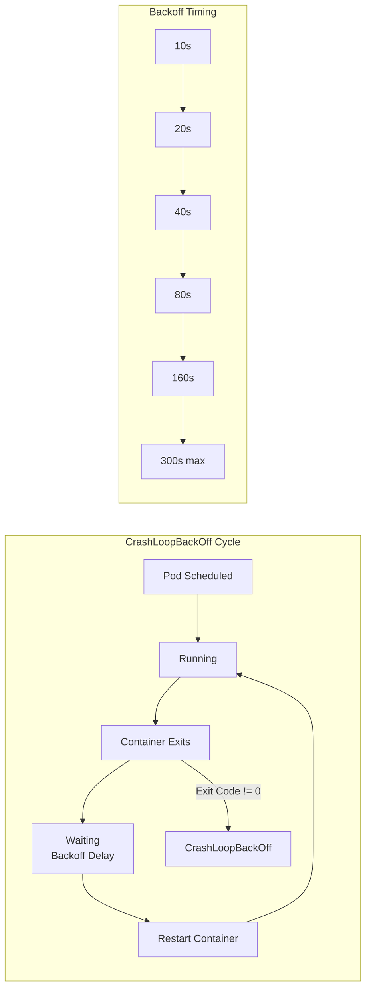
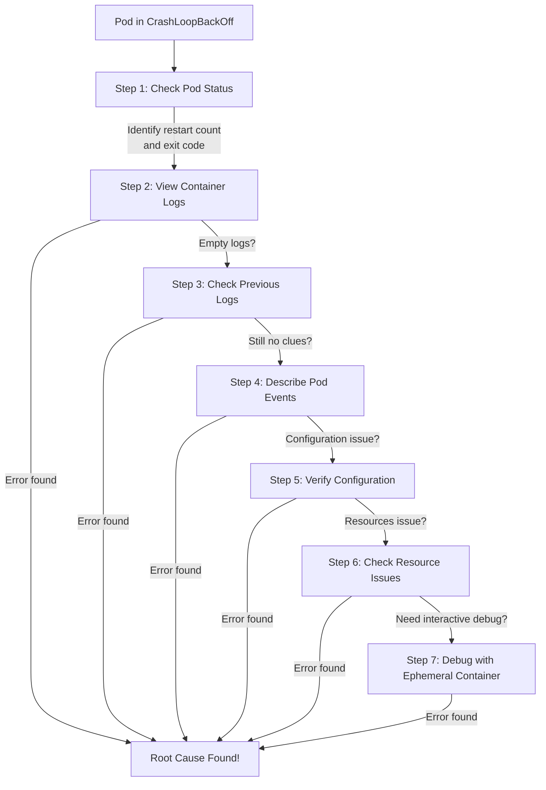

# How to Debug CrashLoopBackOff Pods in Kubernetes

Author: [nawazdhandala](https://www.github.com/nawazdhandala)

Tags: Kubernetes, CrashLoopBackOff, Debugging, Troubleshooting, Pods, Logs, kubectl

Description: CrashLoopBackOff is one of the most common issues in Kubernetes. This guide walks through a systematic approach to diagnosing and fixing pods that keep crashing.

---

You've deployed your application to Kubernetes, checked the pods, and there it is: the dreaded `CrashLoopBackOff` status. The pod starts, crashes, restarts, and crashes again—each time with a longer delay before the next attempt.

This guide provides a systematic debugging workflow that will help you identify and fix the root cause, regardless of what's causing your pods to crash.

## Understanding CrashLoopBackOff

First, let's understand what CrashLoopBackOff actually means:



**CrashLoopBackOff** is not an error itself—it's a **state** indicating that:
1. A container has crashed (exited with non-zero code)
2. Kubernetes is waiting before restarting it
3. The wait time increases exponentially (10s, 20s, 40s, 80s, 160s, capped at 5 minutes)

## The Debugging Workflow



## Step 1: Check Pod Status

Start by getting an overview of the pod's state:

```bash
# Get basic pod status
# Look for RESTARTS count and STATUS
kubectl get pods -n <namespace>

# Example output:
# NAME                    READY   STATUS             RESTARTS      AGE
# my-app-5f7b9d4c6-x2k8p  0/1     CrashLoopBackOff   5 (45s ago)   3m

# Get more details including the exit code
kubectl get pod my-app-5f7b9d4c6-x2k8p -o jsonpath='{.status.containerStatuses[*]}' | jq

# Key fields to look for:
# - lastState.terminated.exitCode - Why the container exited
# - lastState.terminated.reason - OOMKilled, Error, etc.
# - restartCount - How many times it's crashed
```

Exit codes provide valuable clues:

| Exit Code | Meaning | Common Causes |
|-----------|---------|---------------|
| 0 | Success | Container completed (shouldn't cause CrashLoop unless restartPolicy: Always) |
| 1 | General error | Application error, unhandled exception |
| 2 | Shell misuse | Invalid command arguments |
| 126 | Permission denied | Cannot execute command |
| 127 | Command not found | Missing binary, wrong PATH |
| 128+N | Signal N | 137 = SIGKILL (OOM), 143 = SIGTERM |
| 137 | OOMKilled | Container exceeded memory limit |
| 139 | Segmentation fault | Application crash, memory corruption |
| 143 | SIGTERM | Graceful shutdown (usually okay) |

## Step 2: View Container Logs

Logs are your primary debugging tool:

```bash
# Get current logs (if container is running)
kubectl logs my-app-5f7b9d4c6-x2k8p -n <namespace>

# If the pod has multiple containers, specify which one
kubectl logs my-app-5f7b9d4c6-x2k8p -c my-container

# Follow logs in real-time (useful to catch crash moment)
kubectl logs -f my-app-5f7b9d4c6-x2k8p

# Get last N lines
kubectl logs --tail=100 my-app-5f7b9d4c6-x2k8p

# Get logs with timestamps
kubectl logs --timestamps my-app-5f7b9d4c6-x2k8p
```

## Step 3: Check Previous Container Logs

If the container crashed too fast, current logs might be empty. Use `--previous` to see logs from the crashed container:

```bash
# THIS IS THE MOST IMPORTANT COMMAND FOR CRASHLOOPBACKOFF
# Shows logs from the previous (crashed) container instance
kubectl logs my-app-5f7b9d4c6-x2k8p --previous

# With container name
kubectl logs my-app-5f7b9d4c6-x2k8p -c my-container --previous

# Get last 500 lines from previous container
kubectl logs my-app-5f7b9d4c6-x2k8p --previous --tail=500
```

Common error patterns to look for:

```bash
# Connection errors
# "connection refused", "connection timed out"
# → Check if the dependency service is running

# Permission errors
# "permission denied", "EACCES"
# → Check file permissions, security context

# Missing files/modules
# "no such file or directory", "module not found"
# → Check image, volume mounts, config maps

# Out of memory
# "JavaScript heap out of memory", "OOM"
# → Increase memory limits

# Configuration errors
# "invalid configuration", "missing required field"
# → Check ConfigMaps, Secrets, environment variables
```

## Step 4: Describe Pod Events

The `describe` command shows events and detailed status:

```bash
# Get full pod description including events
kubectl describe pod my-app-5f7b9d4c6-x2k8p -n <namespace>

# Key sections to examine:
# - Events: Shows what happened and when
# - State/Last State: Current and previous container states
# - Conditions: Ready, Initialized, PodScheduled
# - Containers: Image, command, env vars, mounts
```

Example output with important fields highlighted:

```yaml
# ... (from kubectl describe pod)
Containers:
  my-app:
    Image:         my-app:latest
    State:         Waiting
      Reason:      CrashLoopBackOff
    Last State:    Terminated
      Reason:      Error         # ← Why it crashed
      Exit Code:   1             # ← The exit code
      Started:     Mon, 19 Jan 2026 10:15:00 +0000
      Finished:    Mon, 19 Jan 2026 10:15:02 +0000  # ← Crashed after 2 seconds
    Ready:         False
    Restart Count: 8             # ← Number of restarts

Events:
  Type     Reason     Age                From     Message
  ----     ------     ----               ----     -------
  Normal   Scheduled  10m                scheduler  Successfully assigned...
  Normal   Pulled     10m (x9 over 10m)  kubelet   Container image "my-app" already present
  Normal   Created    10m (x9 over 10m)  kubelet   Created container my-app
  Normal   Started    10m (x9 over 10m)  kubelet   Started container my-app
  Warning  BackOff    30s (x45 over 9m)  kubelet   Back-off restarting failed container
```

## Step 5: Verify Configuration

Many CrashLoopBackOff issues are configuration problems:

### Check Environment Variables

```bash
# View all environment variables the pod would receive
kubectl exec my-app-5f7b9d4c6-x2k8p -- env 2>/dev/null || \
  kubectl set env pod/my-app-5f7b9d4c6-x2k8p --list

# If pod won't start, check the deployment/pod spec
kubectl get pod my-app-5f7b9d4c6-x2k8p -o yaml | grep -A50 "env:"
```

### Check ConfigMaps and Secrets

```bash
# Verify ConfigMap exists and has expected data
kubectl get configmap my-config -o yaml

# Verify Secret exists
kubectl get secret my-secret -o yaml

# Check if referenced ConfigMap/Secret exists
kubectl get pod my-app-5f7b9d4c6-x2k8p -o yaml | grep -E "configMapRef|secretRef"
```

### Check Volume Mounts

```bash
# List volume mounts
kubectl get pod my-app-5f7b9d4c6-x2k8p -o jsonpath='{.spec.containers[*].volumeMounts}' | jq

# Verify PVCs are bound
kubectl get pvc -n <namespace>

# Check if the mounted path conflicts with container paths
# Common issue: mounting over /app or other critical directories
```

### Verify Command and Args

```bash
# Check the entrypoint and command
kubectl get pod my-app-5f7b9d4c6-x2k8p -o yaml | grep -A5 "command:\|args:"

# Common issues:
# - Command not found (wrong path or missing binary)
# - Syntax errors in shell commands
# - Arguments in wrong order
```

```yaml
# Example: Common command/args mistakes
spec:
  containers:
    - name: my-app
      # WRONG: Command expects array, not string
      command: "/bin/sh -c 'npm start'"
      
      # CORRECT: Command as array
      command: ["/bin/sh", "-c"]
      args: ["npm start"]
      
      # ALSO CORRECT: Just override args
      args: ["--config", "/etc/config/app.yaml"]
```

## Step 6: Check Resource Issues

### OOMKilled (Exit Code 137)

```bash
# Check if the container was killed due to memory limits
kubectl describe pod my-app-5f7b9d4c6-x2k8p | grep -A5 "Last State"

# If you see:
# Last State:  Terminated
#   Reason:    OOMKilled
#   Exit Code: 137

# Check current memory limits
kubectl get pod my-app-5f7b9d4c6-x2k8p -o jsonpath='{.spec.containers[*].resources}'
```

Fix OOMKilled:

```yaml
# Increase memory limits
spec:
  containers:
    - name: my-app
      resources:
        requests:
          memory: "256Mi"  # Minimum guaranteed
        limits:
          memory: "512Mi"  # Maximum allowed (increase this)
```

### CPU Throttling

```bash
# Check if CPU limits are too restrictive
kubectl top pod my-app-5f7b9d4c6-x2k8p

# If the application is slow/timing out, it might be CPU starved
# Consider increasing CPU limits or checking for CPU-intensive startup
```

### Liveness Probe Failures

```bash
# Check if liveness probes are killing the container
kubectl describe pod my-app-5f7b9d4c6-x2k8p | grep -A10 "Liveness"

# If you see events like:
# Warning  Unhealthy  kubelet  Liveness probe failed: ...
# Normal   Killing    kubelet  Container my-app failed liveness probe, will be restarted
```

Common liveness probe fixes:

```yaml
spec:
  containers:
    - name: my-app
      livenessProbe:
        httpGet:
          path: /health
          port: 8080
        # Increase these values for slow-starting apps
        initialDelaySeconds: 60  # Wait before first probe
        periodSeconds: 10        # Time between probes
        timeoutSeconds: 5        # Probe timeout
        failureThreshold: 3      # Failures before restart
```

## Step 7: Debug with Ephemeral Containers

When you need interactive debugging but the container keeps crashing:

```bash
# Add a debug container to the running pod
# (Requires Kubernetes 1.23+)
kubectl debug my-app-5f7b9d4c6-x2k8p -it --image=busybox --target=my-app

# Or create a copy of the pod with a different command
kubectl debug my-app-5f7b9d4c6-x2k8p -it --copy-to=my-app-debug \
  --container=my-app -- /bin/sh

# Debug with a full debugging image
kubectl debug my-app-5f7b9d4c6-x2k8p -it --image=nicolaka/netshoot --target=my-app
```

### Override Entrypoint for Debugging

```yaml
# debug-pod.yaml
# Create a copy of your pod that sleeps instead of running the app
apiVersion: v1
kind: Pod
metadata:
  name: my-app-debug
spec:
  containers:
    - name: my-app
      image: my-app:latest
      # Override command to keep container running
      command: ["/bin/sh"]
      args: ["-c", "sleep infinity"]
      # Copy all other settings from original pod
      env:
        - name: DATABASE_URL
          value: "postgres://..."
      volumeMounts:
        - name: config
          mountPath: /etc/config
  volumes:
    - name: config
      configMap:
        name: my-config
```

```bash
# Apply debug pod
kubectl apply -f debug-pod.yaml

# Exec into it
kubectl exec -it my-app-debug -- /bin/sh

# Now you can:
# - Check if files exist
# - Test network connectivity
# - Run the application manually and see the error
# - Check environment variables
```

## Common Causes and Solutions

### 1. Application Configuration Error

```bash
# Symptoms:
# - Exit code 1
# - Logs show configuration parsing errors

# Debug:
kubectl logs my-app --previous | grep -i "config\|error\|invalid"

# Check if ConfigMap/Secret has correct values
kubectl get configmap my-config -o yaml
```

```yaml
# Solution: Fix configuration
apiVersion: v1
kind: ConfigMap
metadata:
  name: my-config
data:
  # Ensure all required fields are present
  config.yaml: |
    server:
      port: 8080
    database:
      host: postgres
      port: 5432
```

### 2. Missing Dependencies

```bash
# Symptoms:
# - Exit code 1 or 127
# - Logs show "connection refused" or "could not connect"

# Debug: Check if dependency services are running
kubectl get pods -n <namespace>
kubectl get svc -n <namespace>

# Test connectivity from the pod
kubectl debug my-app -it --image=busybox -- nc -zv postgres 5432
```

```yaml
# Solution: Add init container to wait for dependencies
spec:
  initContainers:
    - name: wait-for-db
      image: busybox
      command:
        - sh
        - -c
        - |
          # Wait for PostgreSQL to be ready
          until nc -z postgres 5432; do
            echo "Waiting for database..."
            sleep 2
          done
          echo "Database is ready!"
```

### 3. Permission Denied

```bash
# Symptoms:
# - Exit code 126 or logs show "permission denied"

# Debug: Check security context
kubectl get pod my-app -o yaml | grep -A10 "securityContext"
```

```yaml
# Solution: Fix security context
spec:
  securityContext:
    # Run as non-root user
    runAsUser: 1000
    runAsGroup: 1000
    fsGroup: 1000
  containers:
    - name: my-app
      securityContext:
        # Allow specific capabilities if needed
        capabilities:
          add: ["NET_BIND_SERVICE"]
        # Don't run as root
        runAsNonRoot: true
```

### 4. Image Issues

```bash
# Symptoms:
# - Exit code 127 (command not found)
# - Different behavior than local

# Debug: Check image details
kubectl get pod my-app -o jsonpath='{.spec.containers[*].image}'

# Verify the image has the expected entrypoint
docker run --rm --entrypoint="" my-app:latest cat /proc/1/cmdline
```

```yaml
# Solution: Specify correct command
spec:
  containers:
    - name: my-app
      image: my-app:latest
      # Explicitly set the command if image entrypoint is wrong
      command: ["/usr/local/bin/node"]
      args: ["server.js"]
```

### 5. Readiness vs Liveness Probe Confusion

```yaml
# Problem: Liveness probe kills pod during startup
# Solution: Use startup probe for slow-starting apps

spec:
  containers:
    - name: my-app
      # Startup probe: Only runs until successful, then stops
      # Gives app time to start before liveness checks begin
      startupProbe:
        httpGet:
          path: /health
          port: 8080
        # Allow up to 5 minutes for startup (30 * 10s)
        failureThreshold: 30
        periodSeconds: 10
      
      # Liveness probe: Runs after startup probe succeeds
      livenessProbe:
        httpGet:
          path: /health
          port: 8080
        periodSeconds: 10
        failureThreshold: 3
      
      # Readiness probe: Controls traffic routing
      readinessProbe:
        httpGet:
          path: /ready
          port: 8080
        periodSeconds: 5
        failureThreshold: 3
```

## Quick Reference: Debugging Commands

```bash
# One-liner diagnosis script
POD=my-app-5f7b9d4c6-x2k8p
NS=default

echo "=== Pod Status ===" && \
kubectl get pod $POD -n $NS && \
echo -e "\n=== Container State ===" && \
kubectl get pod $POD -n $NS -o jsonpath='{.status.containerStatuses[0]}' | jq && \
echo -e "\n=== Previous Logs ===" && \
kubectl logs $POD -n $NS --previous --tail=50 2>/dev/null || echo "No previous logs" && \
echo -e "\n=== Events ===" && \
kubectl get events -n $NS --field-selector involvedObject.name=$POD --sort-by='.lastTimestamp'
```

## Conclusion

CrashLoopBackOff is always solvable with systematic debugging. Follow this workflow:

1. **Check status** - Get the exit code and restart count
2. **Read logs** - Use `--previous` for crashed containers
3. **Describe pod** - Look at events and configuration
4. **Verify config** - Check env vars, ConfigMaps, Secrets, volumes
5. **Check resources** - Look for OOMKilled, CPU throttling
6. **Debug interactively** - Use ephemeral containers or debug pods

Key takeaways:

- Exit codes tell you *why* the container died
- `kubectl logs --previous` is your best friend
- Most issues are configuration problems (not code bugs)
- When in doubt, override the command to `sleep infinity` and debug manually

For ongoing monitoring of your pods and early detection of crash loops, check out [OneUptime's Kubernetes monitoring](https://oneuptime.com/product/metrics).

## Related Resources

- [How to Set Up Health Checks for Kubernetes](https://oneuptime.com/blog/post/2025-01-06-python-health-checks-kubernetes/view)
- [How to Send Python Logs to OneUptime](https://oneuptime.com/blog/post/2025-01-06-python-logs-oneuptime/view)
- [How to Debug Kubernetes Memory Leaks](https://oneuptime.com/blog/post/2025-01-06-python-memory-leak-debugging/view)
