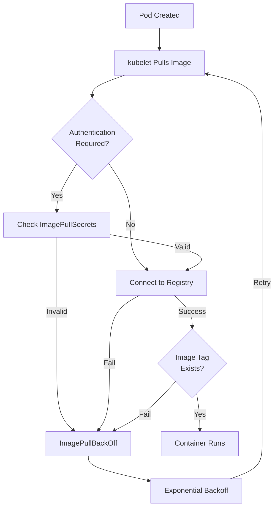

# How to Debug ImagePullBackOff Errors in Kubernetes

Author: [nawazdhandala](https://www.github.com/nawazdhandala)

Tags: Kubernetes, Troubleshooting, ImagePullBackOff, Container Registry, Docker, DevOps

Description: Learn how to diagnose and fix ImagePullBackOff errors in Kubernetes including registry authentication, image tags, and network issues.

---

ImagePullBackOff is one of the most common errors in Kubernetes. This guide provides systematic approaches to diagnose and resolve container image pull failures.

## Understanding ImagePullBackOff



## Common Causes

| Cause | Error Message |
|-------|---------------|
| Invalid image name | `ImagePullBackOff: rpc error: image not found` |
| Wrong tag | `manifest unknown` |
| Auth failure | `unauthorized: authentication required` |
| Network issue | `dial tcp: i/o timeout` |
| Rate limiting | `toomanyrequests: You have reached your pull rate limit` |

## Diagnosing the Issue

### Check Pod Status

```bash
# Get pod status
kubectl get pod <pod-name> -o wide

# Describe pod for detailed error
kubectl describe pod <pod-name>

# Look for Events section
kubectl describe pod <pod-name> | grep -A 20 "Events:"
```

### Examine Error Messages

```bash
# Common error patterns to look for:

# 1. Image not found
# Error: ImagePullBackOff
# Warning: Failed to pull image "myregistry/myimage:latest": 
#          rpc error: code = NotFound desc = failed to pull and unpack image

# 2. Authentication required
# Warning: Failed to pull image "private-registry.com/myimage": 
#          unauthorized: authentication required

# 3. Rate limited
# Warning: Failed to pull image "docker.io/library/nginx:latest": 
#          toomanyrequests: You have reached your pull rate limit

# 4. Network error
# Warning: Failed to pull image: dial tcp: lookup registry.example.com: 
#          no such host
```

## Fixing Common Issues

### 1. Invalid Image Name or Tag

```bash
# Verify image exists in registry
# Docker Hub
docker manifest inspect nginx:latest

# Private registry
docker manifest inspect myregistry.azurecr.io/myapp:v1.0.0

# Check exact image name and tag
kubectl get pod <pod-name> -o jsonpath='{.spec.containers[*].image}'
```

```yaml
# Fix: Correct image reference
apiVersion: v1
kind: Pod
metadata:
  name: myapp
spec:
  containers:
    - name: myapp
      # Use full registry path
      image: myregistry.azurecr.io/myapp:v1.0.0
      # Or for Docker Hub
      image: docker.io/library/nginx:1.25.0
```

### 2. Registry Authentication

#### Create Image Pull Secret

```bash
# For Docker Hub
kubectl create secret docker-registry dockerhub-secret \
  --docker-server=docker.io \
  --docker-username=<username> \
  --docker-password=<password> \
  --docker-email=<email>

# For AWS ECR
kubectl create secret docker-registry ecr-secret \
  --docker-server=<account>.dkr.ecr.<region>.amazonaws.com \
  --docker-username=AWS \
  --docker-password=$(aws ecr get-login-password --region <region>)

# For GCR
kubectl create secret docker-registry gcr-secret \
  --docker-server=gcr.io \
  --docker-username=_json_key \
  --docker-password="$(cat service-account.json)"

# For Azure ACR
kubectl create secret docker-registry acr-secret \
  --docker-server=<registry>.azurecr.io \
  --docker-username=<service-principal-id> \
  --docker-password=<service-principal-password>
```

#### Use Secret in Pod

```yaml
# pod-with-secret.yaml
apiVersion: v1
kind: Pod
metadata:
  name: myapp
spec:
  containers:
    - name: myapp
      image: myregistry.azurecr.io/myapp:v1.0.0
  imagePullSecrets:
    - name: acr-secret
```

#### Attach to Service Account

```yaml
# service-account-with-secret.yaml
apiVersion: v1
kind: ServiceAccount
metadata:
  name: myapp-sa
imagePullSecrets:
  - name: acr-secret
---
apiVersion: v1
kind: Pod
metadata:
  name: myapp
spec:
  serviceAccountName: myapp-sa
  containers:
    - name: myapp
      image: myregistry.azurecr.io/myapp:v1.0.0
```

### 3. Docker Hub Rate Limiting

```bash
# Check current rate limit status
TOKEN=$(curl -s "https://auth.docker.io/token?service=registry.docker.io&scope=repository:library/nginx:pull" | jq -r .token)
curl -s -H "Authorization: Bearer $TOKEN" -I https://registry-1.docker.io/v2/library/nginx/manifests/latest | grep -i ratelimit

# Output:
# ratelimit-limit: 100;w=21600
# ratelimit-remaining: 95;w=21600
```

```yaml
# Solutions:

# 1. Use authenticated pulls (higher limits)
apiVersion: v1
kind: Pod
metadata:
  name: myapp
spec:
  imagePullSecrets:
    - name: dockerhub-secret
  containers:
    - name: nginx
      image: docker.io/library/nginx:latest

# 2. Use a mirror registry
apiVersion: v1
kind: Pod
metadata:
  name: myapp
spec:
  containers:
    - name: nginx
      # Use your own registry mirror
      image: myregistry.azurecr.io/dockerhub-mirror/nginx:latest
```

### 4. Network Issues

```bash
# Test registry connectivity from node
# SSH to node, then:
curl -v https://myregistry.azurecr.io/v2/

# Test from within cluster
kubectl run test-registry --rm -it --image=curlimages/curl -- \
  curl -v https://myregistry.azurecr.io/v2/

# Check DNS resolution
kubectl run test-dns --rm -it --image=busybox -- \
  nslookup myregistry.azurecr.io
```

```yaml
# Fix: Add hostAliases if DNS issues
apiVersion: v1
kind: Pod
metadata:
  name: myapp
spec:
  hostAliases:
    - ip: "10.0.0.100"
      hostnames:
        - "myregistry.internal.com"
  containers:
    - name: myapp
      image: myregistry.internal.com/myapp:v1.0.0
```

### 5. Private Registry TLS Issues

```bash
# Check certificate issues
openssl s_client -connect myregistry.example.com:443 -showcerts

# For self-signed certificates, configure containerd
# /etc/containerd/certs.d/myregistry.example.com/hosts.toml
```

```yaml
# containerd configuration
# /etc/containerd/certs.d/myregistry.example.com/hosts.toml
server = "https://myregistry.example.com"

[host."https://myregistry.example.com"]
  ca = "/etc/containerd/certs.d/myregistry.example.com/ca.crt"
  skip_verify = false
```

## Debugging Commands

### Comprehensive Debug Script

```bash
#!/bin/bash
# debug-imagepull.sh

POD_NAME=$1
NAMESPACE=${2:-default}

echo "=== Pod Status ==="
kubectl get pod $POD_NAME -n $NAMESPACE -o wide

echo ""
echo "=== Pod Events ==="
kubectl get events -n $NAMESPACE --field-selector involvedObject.name=$POD_NAME

echo ""
echo "=== Container Image ==="
kubectl get pod $POD_NAME -n $NAMESPACE -o jsonpath='{.spec.containers[*].image}'
echo ""

echo ""
echo "=== ImagePullSecrets ==="
kubectl get pod $POD_NAME -n $NAMESPACE -o jsonpath='{.spec.imagePullSecrets[*].name}'
echo ""

echo ""
echo "=== Detailed Error ==="
kubectl describe pod $POD_NAME -n $NAMESPACE | grep -A 5 "Warning"
```

### Test Image Pull Manually

```bash
# Test pull on specific node
# SSH to the node, then:
crictl pull myregistry.azurecr.io/myapp:v1.0.0

# With authentication
crictl pull --creds username:password myregistry.azurecr.io/myapp:v1.0.0

# Check crictl logs for errors
journalctl -u containerd -n 50
```

## Prevention Strategies

### Use Image Pull Policy

```yaml
# Always pull latest
apiVersion: v1
kind: Pod
metadata:
  name: myapp
spec:
  containers:
    - name: myapp
      image: myapp:latest
      imagePullPolicy: Always  # Always pull

# Use cached if available
apiVersion: v1
kind: Pod
metadata:
  name: myapp
spec:
  containers:
    - name: myapp
      image: myapp:v1.0.0
      imagePullPolicy: IfNotPresent  # Use cached if exists
```

### Pre-pull Images with DaemonSet

```yaml
# prepull-daemonset.yaml
apiVersion: apps/v1
kind: DaemonSet
metadata:
  name: image-prepull
spec:
  selector:
    matchLabels:
      app: image-prepull
  template:
    metadata:
      labels:
        app: image-prepull
    spec:
      initContainers:
        # Pull images in init containers
        - name: pull-image-1
          image: myregistry.azurecr.io/myapp:v1.0.0
          command: ["echo", "Image pulled"]
        - name: pull-image-2
          image: myregistry.azurecr.io/myapp:v2.0.0
          command: ["echo", "Image pulled"]
      containers:
        - name: pause
          image: gcr.io/google-containers/pause:3.2
      imagePullSecrets:
        - name: registry-secret
```

### Registry Mirroring

```yaml
# Configure containerd to use mirror
# /etc/containerd/config.toml

[plugins."io.containerd.grpc.v1.cri".registry]
  [plugins."io.containerd.grpc.v1.cri".registry.mirrors]
    [plugins."io.containerd.grpc.v1.cri".registry.mirrors."docker.io"]
      endpoint = ["https://myregistry-mirror.azurecr.io"]
    [plugins."io.containerd.grpc.v1.cri".registry.mirrors."gcr.io"]
      endpoint = ["https://myregistry-mirror.azurecr.io"]
```

### Automate ECR Token Refresh

```yaml
# ecr-token-refresh.yaml
apiVersion: batch/v1
kind: CronJob
metadata:
  name: ecr-token-refresh
spec:
  schedule: "0 */6 * * *"  # Every 6 hours
  jobTemplate:
    spec:
      template:
        spec:
          serviceAccountName: ecr-refresh-sa
          containers:
            - name: ecr-refresh
              image: amazon/aws-cli:latest
              command:
                - /bin/sh
                - -c
                - |
                  TOKEN=$(aws ecr get-login-password --region us-east-1)
                  kubectl delete secret ecr-secret --ignore-not-found
                  kubectl create secret docker-registry ecr-secret \
                    --docker-server=123456789.dkr.ecr.us-east-1.amazonaws.com \
                    --docker-username=AWS \
                    --docker-password=$TOKEN
          restartPolicy: OnFailure
```

## Quick Reference

```bash
# Quick diagnosis
kubectl describe pod <pod> | grep -A 10 "Events:"

# Check image pull secrets exist
kubectl get secrets | grep docker

# Verify secret content
kubectl get secret <secret-name> -o jsonpath='{.data.\.dockerconfigjson}' | base64 -d

# Test image manually
kubectl run test --rm -it --image=<image> --restart=Never -- echo "success"

# Force re-pull
kubectl delete pod <pod-name>  # Will recreate with pull
```

## Conclusion

ImagePullBackOff errors can be resolved by checking:

1. **Image name and tag** - Verify image exists in registry
2. **Authentication** - Configure imagePullSecrets correctly
3. **Network** - Ensure registry is reachable
4. **Rate limits** - Use authenticated pulls or mirrors
5. **TLS certificates** - Configure for private registries

For monitoring your Kubernetes deployments and image issues, check out [OneUptime's container monitoring](https://oneuptime.com/product/metrics).

## Related Resources

- [How to Troubleshoot Kubernetes Networking](https://oneuptime.com/blog/post/2026-01-19-kubernetes-troubleshoot-networking/view)
- [How to Debug OOMKilled Errors](https://oneuptime.com/blog/post/2026-01-19-kubernetes-debug-oomkilled/view)
- [How to Configure Pod Security](https://oneuptime.com/blog/post/kubernetes-pod-security-standards/view)
