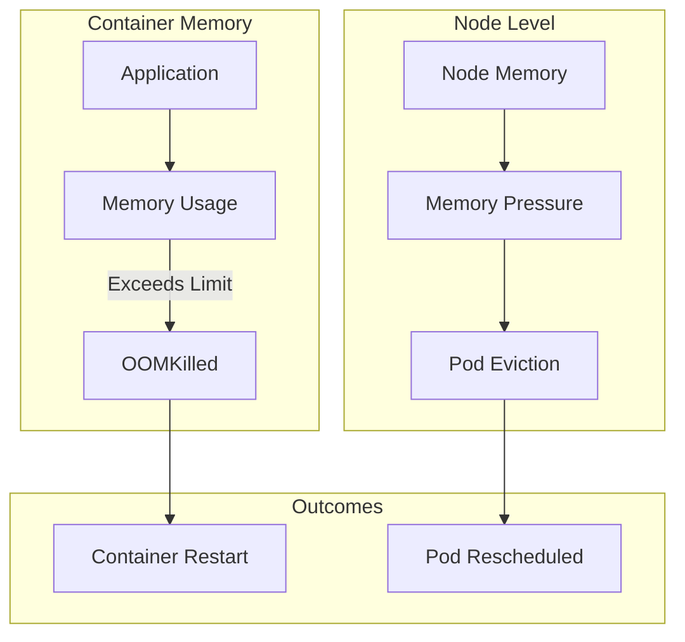

# How to Debug OOMKilled Errors in Kubernetes

Author: [nawazdhandala](https://www.github.com/nawazdhandala)

Tags: Kubernetes, Troubleshooting, OOMKilled, Memory, Resource Management, DevOps

Description: Learn how to diagnose and fix OOMKilled errors in Kubernetes by analyzing memory usage, setting appropriate limits, and implementing memory monitoring.

---

OOMKilled (Out of Memory Killed) occurs when a container exceeds its memory limit or the node runs out of memory. This guide covers diagnosing, fixing, and preventing OOM issues in Kubernetes.

## Understanding OOMKilled



| Exit Code | Meaning |
|-----------|---------|
| 137 | Container killed by SIGKILL (OOMKilled) |
| 143 | Container killed by SIGTERM (graceful) |

## Diagnosing OOMKilled

### Check Pod Status

```bash
# View pod status
kubectl get pod <pod-name> -o wide

# Check termination reason
kubectl get pod <pod-name> -o jsonpath='{.status.containerStatuses[*].lastState.terminated.reason}'

# Detailed pod information
kubectl describe pod <pod-name>

# Look for OOMKilled in events
kubectl describe pod <pod-name> | grep -A 5 "Last State"
```

### Examine Container Exit Code

```bash
# Check exit code (137 = OOMKilled)
kubectl get pod <pod-name> -o jsonpath='{.status.containerStatuses[*].lastState.terminated.exitCode}'

# Full container status
kubectl get pod <pod-name> -o yaml | grep -A 20 "containerStatuses:"
```

### Check Resource Usage

```bash
# Current memory usage
kubectl top pod <pod-name>

# Memory usage across all pods
kubectl top pods --all-namespaces --sort-by=memory

# Node memory status
kubectl top nodes

# Detailed node memory
kubectl describe node <node-name> | grep -A 10 "Allocated resources"
```

## Analyzing Memory Issues

### View Historical Metrics

```bash
# If using Prometheus
kubectl exec -it prometheus-pod -- promtool query instant \
  'container_memory_usage_bytes{pod="<pod-name>"}'

# Query for memory spikes
# container_memory_usage_bytes{pod="myapp"} / container_spec_memory_limit_bytes{pod="myapp"}
```

### Check Application Memory

```bash
# Get into container
kubectl exec -it <pod-name> -- /bin/sh

# Check memory from inside container
cat /sys/fs/cgroup/memory/memory.usage_in_bytes
cat /sys/fs/cgroup/memory/memory.limit_in_bytes

# View processes by memory
ps aux --sort=-%mem | head -20

# For Java applications
jcmd 1 VM.native_memory summary

# For Node.js
node --expose-gc -e "console.log(process.memoryUsage())"
```

### Debug with Memory Profiling

```yaml
# debug-pod.yaml
apiVersion: v1
kind: Pod
metadata:
  name: memory-debug
spec:
  containers:
    - name: app
      image: myapp:latest
      resources:
        limits:
          memory: "512Mi"
        requests:
          memory: "256Mi"
      # Enable memory debugging
      env:
        # Java heap dump on OOM
        - name: JAVA_OPTS
          value: "-XX:+HeapDumpOnOutOfMemoryError -XX:HeapDumpPath=/tmp/heapdump.hprof"
        # Node.js memory debugging
        - name: NODE_OPTIONS
          value: "--max-old-space-size=400 --expose-gc"
      volumeMounts:
        - name: debug-data
          mountPath: /tmp
  volumes:
    - name: debug-data
      emptyDir: {}
```

## Fixing OOMKilled

### 1. Increase Memory Limits

```yaml
# Properly sized resources
apiVersion: apps/v1
kind: Deployment
metadata:
  name: myapp
spec:
  replicas: 3
  selector:
    matchLabels:
      app: myapp
  template:
    metadata:
      labels:
        app: myapp
    spec:
      containers:
        - name: myapp
          image: myapp:latest
          resources:
            requests:
              memory: "256Mi"  # What app typically uses
              cpu: "100m"
            limits:
              memory: "512Mi"  # Maximum allowed (2x request is good start)
              cpu: "500m"
```

### 2. Optimize Application Memory

#### Java Applications

```yaml
# Java with proper heap settings
apiVersion: v1
kind: Pod
metadata:
  name: java-app
spec:
  containers:
    - name: java-app
      image: openjdk:17-jre
      resources:
        limits:
          memory: "1Gi"
        requests:
          memory: "512Mi"
      env:
        # Set heap to 75% of container limit
        - name: JAVA_OPTS
          value: >-
            -XX:MaxRAMPercentage=75.0
            -XX:InitialRAMPercentage=50.0
            -XX:+UseG1GC
            -XX:+ExitOnOutOfMemoryError
```

#### Node.js Applications

```yaml
# Node.js with memory settings
apiVersion: v1
kind: Pod
metadata:
  name: nodejs-app
spec:
  containers:
    - name: nodejs-app
      image: node:18-alpine
      resources:
        limits:
          memory: "512Mi"
        requests:
          memory: "256Mi"
      env:
        # Set V8 heap limit (leave room for native memory)
        - name: NODE_OPTIONS
          value: "--max-old-space-size=384"
```

#### Python Applications

```yaml
# Python with memory optimization
apiVersion: v1
kind: Pod
metadata:
  name: python-app
spec:
  containers:
    - name: python-app
      image: python:3.11-slim
      resources:
        limits:
          memory: "512Mi"
        requests:
          memory: "256Mi"
      env:
        # Optimize Python memory
        - name: PYTHONOPTIMIZE
          value: "1"
        - name: PYTHONHASHSEED
          value: "0"
```

### 3. Implement Memory-Aware Scaling

```yaml
# HPA based on memory
apiVersion: autoscaling/v2
kind: HorizontalPodAutoscaler
metadata:
  name: myapp-hpa
spec:
  scaleTargetRef:
    apiVersion: apps/v1
    kind: Deployment
    name: myapp
  minReplicas: 2
  maxReplicas: 10
  metrics:
    - type: Resource
      resource:
        name: memory
        target:
          type: Utilization
          averageUtilization: 70
    - type: Resource
      resource:
        name: cpu
        target:
          type: Utilization
          averageUtilization: 80
```

### 4. Configure QoS Classes

```yaml
# Guaranteed QoS (highest priority, won't be evicted first)
apiVersion: v1
kind: Pod
metadata:
  name: guaranteed-pod
spec:
  containers:
    - name: app
      image: myapp:latest
      resources:
        # requests = limits = Guaranteed QoS
        limits:
          memory: "512Mi"
          cpu: "500m"
        requests:
          memory: "512Mi"
          cpu: "500m"
---
# Burstable QoS
apiVersion: v1
kind: Pod
metadata:
  name: burstable-pod
spec:
  containers:
    - name: app
      image: myapp:latest
      resources:
        # requests < limits = Burstable QoS
        limits:
          memory: "512Mi"
          cpu: "500m"
        requests:
          memory: "256Mi"
          cpu: "100m"
---
# BestEffort QoS (lowest priority, evicted first)
apiVersion: v1
kind: Pod
metadata:
  name: besteffort-pod
spec:
  containers:
    - name: app
      image: myapp:latest
      # No resources = BestEffort QoS
```

## Monitoring Memory

### Prometheus Metrics

```yaml
# ServiceMonitor for memory monitoring
apiVersion: monitoring.coreos.com/v1
kind: ServiceMonitor
metadata:
  name: app-monitor
spec:
  selector:
    matchLabels:
      app: myapp
  endpoints:
    - port: metrics
      interval: 15s
```

```promql
# Container memory usage
container_memory_usage_bytes{pod=~"myapp.*"}

# Memory as percentage of limit
container_memory_usage_bytes{pod=~"myapp.*"} / 
container_spec_memory_limit_bytes{pod=~"myapp.*"} * 100

# OOMKilled events
kube_pod_container_status_last_terminated_reason{reason="OOMKilled"}

# Containers near memory limit (>80%)
(container_memory_usage_bytes / container_spec_memory_limit_bytes) > 0.8

# Memory growth rate
rate(container_memory_usage_bytes{pod=~"myapp.*"}[5m])
```

### Alert Rules

```yaml
# prometheus-rules.yaml
apiVersion: monitoring.coreos.com/v1
kind: PrometheusRule
metadata:
  name: memory-alerts
spec:
  groups:
    - name: memory
      rules:
        - alert: ContainerMemoryHigh
          expr: |
            (container_memory_usage_bytes / container_spec_memory_limit_bytes) > 0.85
          for: 5m
          labels:
            severity: warning
          annotations:
            summary: "Container memory usage high"
            description: "{{ $labels.pod }} memory usage is {{ $value | humanizePercentage }}"
        
        - alert: ContainerOOMKilled
          expr: |
            kube_pod_container_status_last_terminated_reason{reason="OOMKilled"} == 1
          labels:
            severity: critical
          annotations:
            summary: "Container was OOMKilled"
            description: "{{ $labels.pod }}/{{ $labels.container }} was OOMKilled"
        
        - alert: NodeMemoryPressure
          expr: |
            kube_node_status_condition{condition="MemoryPressure",status="true"} == 1
          labels:
            severity: critical
          annotations:
            summary: "Node has memory pressure"
            description: "Node {{ $labels.node }} is under memory pressure"
```

## Prevention Strategies

### 1. Right-Size Resources

```bash
# Analyze current usage
kubectl top pods --all-namespaces --sort-by=memory

# Use VPA recommendations
kubectl get vpa myapp-vpa -o yaml
```

```yaml
# Vertical Pod Autoscaler
apiVersion: autoscaling.k8s.io/v1
kind: VerticalPodAutoscaler
metadata:
  name: myapp-vpa
spec:
  targetRef:
    apiVersion: apps/v1
    kind: Deployment
    name: myapp
  updatePolicy:
    updateMode: "Auto"
  resourcePolicy:
    containerPolicies:
      - containerName: myapp
        minAllowed:
          memory: "128Mi"
          cpu: "50m"
        maxAllowed:
          memory: "2Gi"
          cpu: "2"
```

### 2. Resource Quotas

```yaml
# Namespace resource quota
apiVersion: v1
kind: ResourceQuota
metadata:
  name: memory-quota
  namespace: production
spec:
  hard:
    requests.memory: "10Gi"
    limits.memory: "20Gi"
```

### 3. Limit Ranges

```yaml
# Default limits for namespace
apiVersion: v1
kind: LimitRange
metadata:
  name: memory-limits
  namespace: production
spec:
  limits:
    - type: Container
      default:
        memory: "256Mi"
        cpu: "200m"
      defaultRequest:
        memory: "128Mi"
        cpu: "100m"
      max:
        memory: "2Gi"
        cpu: "2"
      min:
        memory: "64Mi"
        cpu: "50m"
```

## Debug Script

```bash
#!/bin/bash
# debug-oom.sh

POD_NAME=$1
NAMESPACE=${2:-default}

echo "=== Pod Status ==="
kubectl get pod $POD_NAME -n $NAMESPACE -o wide

echo ""
echo "=== Last Termination ==="
kubectl get pod $POD_NAME -n $NAMESPACE -o jsonpath='{.status.containerStatuses[*].lastState.terminated}'
echo ""

echo ""
echo "=== Current Memory Usage ==="
kubectl top pod $POD_NAME -n $NAMESPACE

echo ""
echo "=== Resource Limits ==="
kubectl get pod $POD_NAME -n $NAMESPACE -o jsonpath='{.spec.containers[*].resources}'
echo ""

echo ""
echo "=== Recent Events ==="
kubectl get events -n $NAMESPACE --field-selector involvedObject.name=$POD_NAME --sort-by='.lastTimestamp' | tail -10

echo ""
echo "=== Node Memory Status ==="
NODE=$(kubectl get pod $POD_NAME -n $NAMESPACE -o jsonpath='{.spec.nodeName}')
kubectl describe node $NODE | grep -A 5 "Allocated resources"
```

## Conclusion

OOMKilled errors can be resolved by:

1. **Set appropriate limits** - Based on actual usage + buffer
2. **Configure application** - Java heap, Node.js V8 settings
3. **Monitor proactively** - Alert before OOM occurs
4. **Use VPA** - Automatic right-sizing recommendations
5. **Implement QoS** - Protect critical pods from eviction

For monitoring memory usage and OOM events, check out [OneUptime's container monitoring](https://oneuptime.com/product/metrics).

## Related Resources

- [How to Manage Pod Evictions](https://oneuptime.com/blog/post/kubernetes-pod-evictions-resource-pressure/view)
- [How to Configure Resource Quotas](https://oneuptime.com/blog/post/kubernetes-resource-quotas-limit-ranges/view)
- [How to Profile CPU and Memory Usage](https://oneuptime.com/blog/post/kubernetes-profile-cpu-memory-usage/view)
