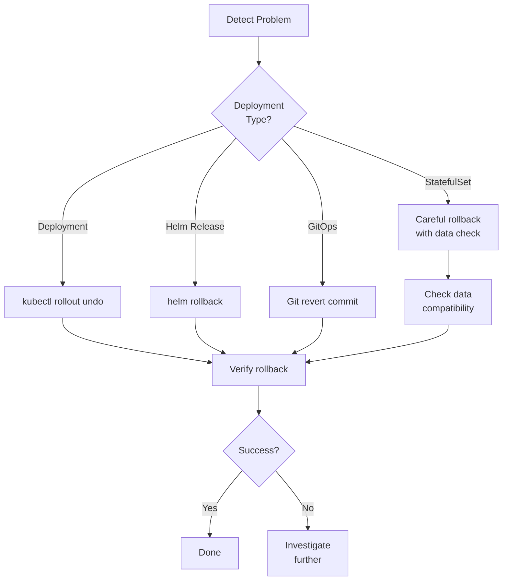

# How to Roll Back Failed Kubernetes Deployments Safely

Author: [nawazdhandala](https://www.github.com/nawazdhandala)

Tags: Kubernetes, Rollback, Deployments, StatefulSets, Helm, GitOps, Disaster Recovery

Description: Learn comprehensive rollback strategies for Kubernetes deployments including kubectl rollout undo, Helm rollbacks, stateful application recovery, and GitOps-based reversions.

---

Failed deployments happen. Maybe a new version has a critical bug, a configuration error causes crashes, or performance degrades under load. Having a reliable rollback strategy is essential for maintaining service availability. This guide covers rollback techniques from simple kubectl commands to complex stateful application recovery.

## Rollback Decision Tree



## Kubernetes Deployment Rollback

### Check Deployment History

```bash
# View rollout history
kubectl rollout history deployment/myapp -n production

# Output:
# REVISION  CHANGE-CAUSE
# 1         Initial deployment
# 2         Update to v1.1.0
# 3         Update to v1.2.0 (current)

# View specific revision details
kubectl rollout history deployment/myapp -n production --revision=2

# Compare revisions
kubectl get deployment myapp -n production -o yaml > current.yaml
kubectl rollout history deployment/myapp -n production --revision=2 -o yaml > previous.yaml
diff current.yaml previous.yaml
```

### Basic Rollback

```bash
# Rollback to previous revision
kubectl rollout undo deployment/myapp -n production

# Rollback to specific revision
kubectl rollout undo deployment/myapp -n production --to-revision=2

# Watch rollback progress
kubectl rollout status deployment/myapp -n production

# Verify the rollback
kubectl get pods -n production -l app=myapp
kubectl describe deployment myapp -n production
```

### Annotate Deployments for Better History

```yaml
# deployment-with-annotations.yaml
apiVersion: apps/v1
kind: Deployment
metadata:
  name: myapp
  namespace: production
  annotations:
    kubernetes.io/change-cause: "Update to v1.2.0 - added feature X"
spec:
  revisionHistoryLimit: 10  # Keep 10 revisions for rollback
  selector:
    matchLabels:
      app: myapp
  template:
    metadata:
      labels:
        app: myapp
        version: v1.2.0
    spec:
      containers:
        - name: myapp
          image: myregistry/myapp:v1.2.0
```

```bash
# Record change cause during update
kubectl set image deployment/myapp myapp=myregistry/myapp:v1.3.0 -n production \
  --record  # Deprecated but still works

# Or annotate after the fact
kubectl annotate deployment/myapp -n production \
  kubernetes.io/change-cause="Update to v1.3.0 - performance improvements"
```

## Helm Rollback

### View Release History

```bash
# List all releases
helm list -n production

# View release history
helm history myapp -n production

# Output:
# REVISION    UPDATED                     STATUS      CHART           APP VERSION    DESCRIPTION
# 1           Mon Jan 15 10:00:00 2024    superseded  myapp-1.0.0     1.0.0          Install complete
# 2           Tue Jan 16 14:30:00 2024    superseded  myapp-1.1.0     1.1.0          Upgrade complete
# 3           Wed Jan 17 09:15:00 2024    deployed    myapp-1.2.0     1.2.0          Upgrade complete

# View specific revision values
helm get values myapp -n production --revision 2
helm get manifest myapp -n production --revision 2
```

### Perform Helm Rollback

```bash
# Rollback to previous revision
helm rollback myapp -n production

# Rollback to specific revision
helm rollback myapp 2 -n production

# Rollback with options
helm rollback myapp 2 -n production \
  --wait \
  --timeout 5m \
  --cleanup-on-fail

# Dry run rollback
helm rollback myapp 2 -n production --dry-run
```

### Helm Rollback with Hooks

```yaml
# templates/rollback-hook.yaml
apiVersion: batch/v1
kind: Job
metadata:
  name: {{ .Release.Name }}-rollback-notification
  annotations:
    "helm.sh/hook": post-rollback
    "helm.sh/hook-weight": "0"
    "helm.sh/hook-delete-policy": hook-succeeded
spec:
  template:
    spec:
      containers:
        - name: notify
          image: curlimages/curl:latest
          command:
            - /bin/sh
            - -c
            - |
              curl -X POST -H 'Content-type: application/json' \
                --data '{"text":"Helm rollback completed for {{ .Release.Name }}"}' \
                $SLACK_WEBHOOK
          env:
            - name: SLACK_WEBHOOK
              valueFrom:
                secretKeyRef:
                  name: slack-webhook
                  key: url
      restartPolicy: Never
```

## GitOps Rollback

### ArgoCD Rollback

```bash
# List application history
argocd app history myapp

# Rollback to previous version
argocd app rollback myapp

# Rollback to specific revision
argocd app rollback myapp <revision-id>

# Sync to specific Git commit
argocd app sync myapp --revision <git-commit-sha>
```

### Git Revert Approach

```bash
# Find the commit that caused the issue
git log --oneline -10

# Revert the problematic commit
git revert <commit-sha>

# Or revert multiple commits
git revert <oldest-commit>..<newest-commit>

# Push the revert
git push origin main

# ArgoCD will automatically sync the reverted state
```

### Flux CD Rollback

```bash
# Suspend automatic reconciliation
flux suspend kustomization myapp

# Revert the Git commit
git revert <commit-sha>
git push

# Resume reconciliation
flux resume kustomization myapp

# Force sync
flux reconcile kustomization myapp --with-source
```

## StatefulSet Rollback

StatefulSet rollbacks require extra care due to persistent data.

### Rolling Back StatefulSet

```bash
# Check rollout history
kubectl rollout history statefulset/mysql -n database

# Pause the rollout first (if in progress)
kubectl rollout pause statefulset/mysql -n database

# Rollback
kubectl rollout undo statefulset/mysql -n database

# Resume (if paused)
kubectl rollout resume statefulset/mysql -n database
```

### Handling Data Compatibility

```yaml
# statefulset-with-init-check.yaml
apiVersion: apps/v1
kind: StatefulSet
metadata:
  name: mysql
  namespace: database
spec:
  serviceName: mysql
  replicas: 3
  template:
    spec:
      initContainers:
        # Check data compatibility before starting
        - name: version-check
          image: mysql:8.0
          command:
            - /bin/sh
            - -c
            - |
              # Check if data directory exists and is compatible
              if [ -f /var/lib/mysql/mysql_upgrade_info ]; then
                STORED_VERSION=$(cat /var/lib/mysql/mysql_upgrade_info)
                CURRENT_VERSION=$(mysql --version | awk '{print $3}')
                
                # Compare major versions
                STORED_MAJOR=$(echo $STORED_VERSION | cut -d. -f1)
                CURRENT_MAJOR=$(echo $CURRENT_VERSION | cut -d. -f1)
                
                if [ "$CURRENT_MAJOR" -lt "$STORED_MAJOR" ]; then
                  echo "ERROR: Cannot downgrade MySQL from $STORED_VERSION to $CURRENT_VERSION"
                  exit 1
                fi
              fi
              echo "Version check passed"
          volumeMounts:
            - name: data
              mountPath: /var/lib/mysql
      containers:
        - name: mysql
          image: mysql:8.0
          volumeMounts:
            - name: data
              mountPath: /var/lib/mysql
  volumeClaimTemplates:
    - metadata:
        name: data
      spec:
        accessModes: ["ReadWriteOnce"]
        resources:
          requests:
            storage: 100Gi
```

### Manual StatefulSet Rollback

```bash
#!/bin/bash
# statefulset-rollback.sh

NAMESPACE="database"
STATEFULSET="mysql"
OLD_IMAGE="mysql:8.0.32"

# 1. Scale down to 0
kubectl scale statefulset $STATEFULSET -n $NAMESPACE --replicas=0
kubectl wait --for=delete pod/${STATEFULSET}-0 -n $NAMESPACE --timeout=300s

# 2. Backup data (if needed)
# This depends on your backup strategy

# 3. Update the image
kubectl set image statefulset/$STATEFULSET mysql=$OLD_IMAGE -n $NAMESPACE

# 4. Scale back up one at a time
for i in 0 1 2; do
  kubectl scale statefulset $STATEFULSET -n $NAMESPACE --replicas=$((i+1))
  kubectl wait --for=condition=Ready pod/${STATEFULSET}-$i -n $NAMESPACE --timeout=300s
  
  # Verify data integrity
  kubectl exec ${STATEFULSET}-$i -n $NAMESPACE -- mysql -e "SELECT 1" || {
    echo "Pod $i failed verification"
    exit 1
  }
done

echo "Rollback complete"
```

## Canary Rollback

### Immediate Canary Abort

```yaml
# Using Flagger for canary rollback
apiVersion: flagger.app/v1beta1
kind: Canary
metadata:
  name: myapp
  namespace: production
spec:
  targetRef:
    apiVersion: apps/v1
    kind: Deployment
    name: myapp
  service:
    port: 80
  analysis:
    # Rollback if metrics fail
    interval: 1m
    threshold: 5        # Max failures before rollback
    maxWeight: 50
    stepWeight: 10
    
    metrics:
      - name: request-success-rate
        threshold: 99
        interval: 1m
      - name: request-duration
        threshold: 500
        interval: 30s
    
    # Webhook for manual abort
    webhooks:
      - name: abort-check
        type: rollback
        url: http://flagger-loadtester/gate/halt
```

```bash
# Manual abort of Flagger canary
kubectl patch canary myapp -n production --type=merge \
  -p '{"spec":{"suspend":true}}'

# Or via Flagger CLI
# Set the canary status to failed
kubectl annotate canary myapp -n production \
  flagger.app/halt="Manual rollback triggered"
```

### Istio Traffic Shift Rollback

```bash
# Immediately shift all traffic to stable version
kubectl apply -f - <<EOF
apiVersion: networking.istio.io/v1beta1
kind: VirtualService
metadata:
  name: myapp
  namespace: production
spec:
  hosts:
    - myapp.example.com
  http:
    - route:
        - destination:
            host: myapp-stable
            port:
              number: 80
          weight: 100
        - destination:
            host: myapp-canary
            port:
              number: 80
          weight: 0
EOF
```

## Database Migration Rollback

### Migration with Rollback Script

```yaml
# db-migration-job.yaml
apiVersion: batch/v1
kind: Job
metadata:
  name: db-migration-v1-2-0
  namespace: production
spec:
  template:
    spec:
      containers:
        - name: migrate
          image: myregistry/db-migrations:v1.2.0
          command:
            - /bin/sh
            - -c
            - |
              # Run migration
              if ! /app/migrate up; then
                echo "Migration failed, rolling back..."
                /app/migrate down
                exit 1
              fi
              
              # Verify migration
              if ! /app/verify-schema; then
                echo "Schema verification failed, rolling back..."
                /app/migrate down
                exit 1
              fi
              
              echo "Migration successful"
          env:
            - name: DATABASE_URL
              valueFrom:
                secretKeyRef:
                  name: database-credentials
                  key: url
      restartPolicy: Never
  backoffLimit: 0  # Don't retry, handle failure explicitly
```

### Manual Database Rollback

```bash
#!/bin/bash
# db-rollback.sh

# Check current migration version
CURRENT_VERSION=$(kubectl exec -n database mysql-0 -- \
  mysql -N -e "SELECT version FROM schema_migrations ORDER BY version DESC LIMIT 1")

echo "Current version: $CURRENT_VERSION"

# Rollback to specific version
TARGET_VERSION="20240115120000"

kubectl exec -n database mysql-0 -- \
  /app/migrate goto $TARGET_VERSION

# Verify
kubectl exec -n database mysql-0 -- \
  mysql -e "SELECT * FROM schema_migrations ORDER BY version DESC LIMIT 5"
```

## Automated Rollback with Monitoring

### Prometheus-Based Auto-Rollback

```yaml
# rollback-controller.yaml
apiVersion: apps/v1
kind: Deployment
metadata:
  name: rollback-controller
  namespace: monitoring
spec:
  replicas: 1
  selector:
    matchLabels:
      app: rollback-controller
  template:
    spec:
      serviceAccountName: rollback-controller
      containers:
        - name: controller
          image: myregistry/rollback-controller:latest
          env:
            - name: PROMETHEUS_URL
              value: http://prometheus.monitoring:9090
            - name: ERROR_THRESHOLD
              value: "0.05"  # 5% error rate
            - name: EVALUATION_PERIOD
              value: "5m"
          volumeMounts:
            - name: config
              mountPath: /etc/config
      volumes:
        - name: config
          configMap:
            name: rollback-rules
---
apiVersion: v1
kind: ConfigMap
metadata:
  name: rollback-rules
  namespace: monitoring
data:
  rules.yaml: |
    deployments:
      - namespace: production
        name: myapp
        metrics:
          - query: 'sum(rate(http_requests_total{status=~"5.."}[5m])) / sum(rate(http_requests_total[5m]))'
            threshold: 0.05
            operator: ">"
          - query: 'histogram_quantile(0.99, rate(http_request_duration_seconds_bucket[5m]))'
            threshold: 2.0
            operator: ">"
        action: rollback
        cooldown: 30m
```

### Rollback Script with Metrics Check

```bash
#!/bin/bash
# auto-rollback-check.sh

NAMESPACE="production"
DEPLOYMENT="myapp"
PROMETHEUS="http://prometheus.monitoring:9090"
ERROR_THRESHOLD=0.05
LATENCY_THRESHOLD=2.0

# Query error rate
ERROR_RATE=$(curl -s "$PROMETHEUS/api/v1/query" \
  --data-urlencode "query=sum(rate(http_requests_total{namespace=\"$NAMESPACE\",deployment=\"$DEPLOYMENT\",status=~\"5..\"}[5m])) / sum(rate(http_requests_total{namespace=\"$NAMESPACE\",deployment=\"$DEPLOYMENT\"}[5m]))" \
  | jq -r '.data.result[0].value[1] // 0')

# Query p99 latency
LATENCY=$(curl -s "$PROMETHEUS/api/v1/query" \
  --data-urlencode "query=histogram_quantile(0.99, rate(http_request_duration_seconds_bucket{namespace=\"$NAMESPACE\",deployment=\"$DEPLOYMENT\"}[5m]))" \
  | jq -r '.data.result[0].value[1] // 0')

echo "Error rate: $ERROR_RATE (threshold: $ERROR_THRESHOLD)"
echo "P99 latency: $LATENCY (threshold: $LATENCY_THRESHOLD)"

# Check if rollback needed
ROLLBACK=false
if (( $(echo "$ERROR_RATE > $ERROR_THRESHOLD" | bc -l) )); then
  echo "ERROR: Error rate exceeds threshold"
  ROLLBACK=true
fi

if (( $(echo "$LATENCY > $LATENCY_THRESHOLD" | bc -l) )); then
  echo "ERROR: Latency exceeds threshold"
  ROLLBACK=true
fi

if [ "$ROLLBACK" = true ]; then
  echo "Initiating rollback..."
  kubectl rollout undo deployment/$DEPLOYMENT -n $NAMESPACE
  
  # Notify team
  curl -X POST -H 'Content-type: application/json' \
    --data "{\"text\":\"Auto-rollback triggered for $DEPLOYMENT. Error rate: $ERROR_RATE, Latency: ${LATENCY}s\"}" \
    $SLACK_WEBHOOK
else
  echo "Metrics within acceptable range, no rollback needed"
fi
```

## Rollback Checklist

```markdown
## Pre-Rollback Checklist

- [ ] Confirm the issue is related to the recent deployment
- [ ] Check if data migrations were involved
- [ ] Identify the last known good version
- [ ] Verify rollback won't cause data loss
- [ ] Notify stakeholders of impending rollback

## During Rollback

- [ ] Execute rollback command
- [ ] Monitor rollout progress
- [ ] Watch for pod crashes or errors
- [ ] Verify service endpoints are responding

## Post-Rollback Verification

- [ ] Confirm all pods are running
- [ ] Test critical user journeys
- [ ] Check error rates in monitoring
- [ ] Verify database connectivity
- [ ] Test external integrations

## Documentation

- [ ] Document what caused the issue
- [ ] Record the rollback time and duration
- [ ] Create incident report if needed
- [ ] Update runbooks if applicable
```

## Summary

| Scenario | Method | Command |
|----------|--------|---------|
| Deployment | kubectl rollout | `kubectl rollout undo deployment/myapp` |
| Helm release | helm rollback | `helm rollback myapp <revision>` |
| GitOps | Git revert | `git revert <commit>` |
| StatefulSet | Careful rollback | Scale down, update, scale up |
| Canary | Abort/shift traffic | Update VirtualService weights |
| Database | Migration down | Run down migrations |

## Related Posts

- [How to Implement Blue-Green and Canary Deployments in Kubernetes](https://oneuptime.com/blog/post/2026-01-19-kubernetes-blue-green-canary-deployments/view) - Deployment strategies with built-in rollback
- [How to Back Up and Restore Kubernetes Clusters with Velero](https://oneuptime.com/blog/post/2026-01-19-kubernetes-velero-backup-restore/view) - Full cluster recovery
- [How to Set Up ArgoCD for GitOps in Kubernetes](https://oneuptime.com/blog/post/2026-01-19-kubernetes-argocd-gitops-setup/view) - GitOps-based deployments
