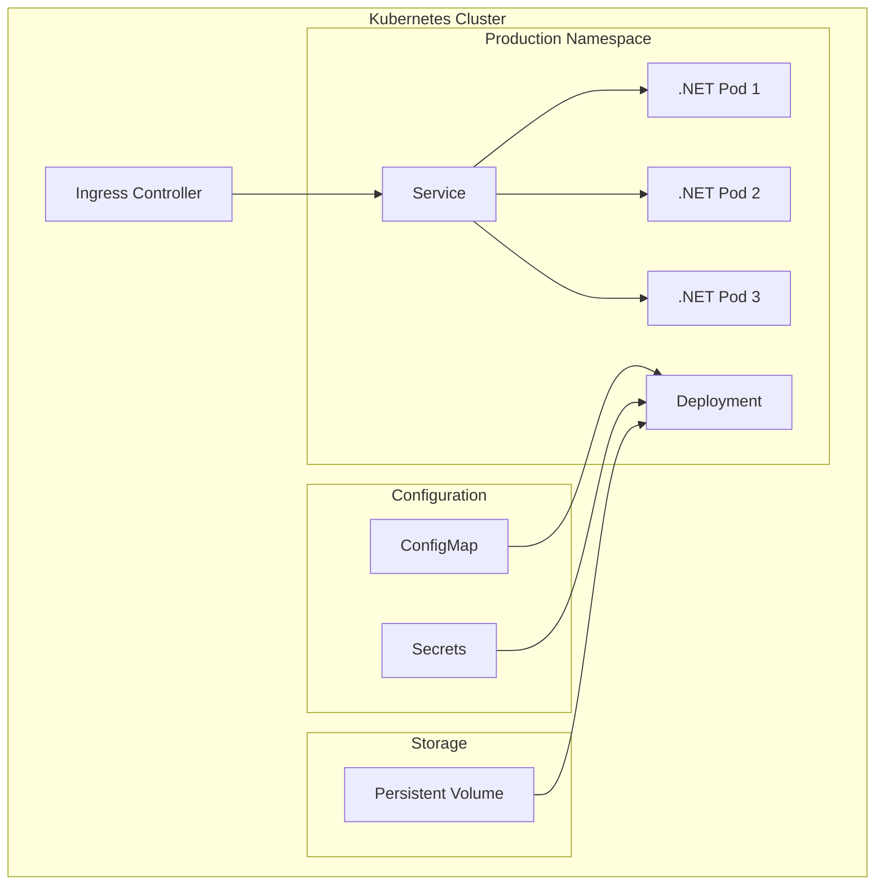

# How to Set Up Kubernetes for .NET Applications

Author: [nawazdhandala](https://www.github.com/nawazdhandala)

Tags: Kubernetes, .NET, ASP.NET Core, C#, Docker, Containerization, DevOps

Description: Learn how to deploy, configure, and optimize .NET applications on Kubernetes including Dockerfiles, health checks, configuration, secrets management, and scaling strategies.

---

Running .NET applications on Kubernetes requires understanding both the .NET runtime characteristics and Kubernetes best practices. This guide covers everything from containerization to production deployment.

## .NET on Kubernetes Architecture



## Dockerfile for .NET Applications

### ASP.NET Core API

```dockerfile
# Dockerfile
FROM mcr.microsoft.com/dotnet/aspnet:8.0 AS base
WORKDIR /app
EXPOSE 8080

FROM mcr.microsoft.com/dotnet/sdk:8.0 AS build
WORKDIR /src

# Copy csproj and restore dependencies
COPY ["MyApi/MyApi.csproj", "MyApi/"]
RUN dotnet restore "MyApi/MyApi.csproj"

# Copy everything else and build
COPY . .
WORKDIR "/src/MyApi"
RUN dotnet build "MyApi.csproj" -c Release -o /app/build

FROM build AS publish
RUN dotnet publish "MyApi.csproj" -c Release -o /app/publish /p:UseAppHost=false

FROM base AS final
WORKDIR /app
COPY --from=publish /app/publish .

# Create non-root user
RUN adduser --disabled-password --gecos '' appuser && chown -R appuser /app
USER appuser

ENTRYPOINT ["dotnet", "MyApi.dll"]
```

### Optimized Multi-Stage Build

```dockerfile
# Dockerfile.optimized
FROM mcr.microsoft.com/dotnet/sdk:8.0-alpine AS build
WORKDIR /src

# Copy only project files first for layer caching
COPY Directory.Build.props ./
COPY Directory.Packages.props ./
COPY *.sln ./
COPY src/MyApi/*.csproj ./src/MyApi/
COPY src/MyApi.Core/*.csproj ./src/MyApi.Core/
COPY tests/MyApi.Tests/*.csproj ./tests/MyApi.Tests/

RUN dotnet restore

# Copy source and build
COPY . .
RUN dotnet build -c Release --no-restore
RUN dotnet test -c Release --no-build --no-restore
RUN dotnet publish src/MyApi/MyApi.csproj -c Release -o /app/publish --no-build

# Runtime image
FROM mcr.microsoft.com/dotnet/aspnet:8.0-alpine AS runtime
WORKDIR /app

# Install required packages for alpine
RUN apk add --no-cache icu-libs

# Environment variables for .NET
ENV DOTNET_SYSTEM_GLOBALIZATION_INVARIANT=false
ENV ASPNETCORE_URLS=http://+:8080
ENV DOTNET_EnableDiagnostics=0

# Copy published app
COPY --from=build /app/publish .

# Create non-root user
RUN adduser -D -u 1000 appuser && chown -R appuser:appuser /app
USER appuser

HEALTHCHECK --interval=30s --timeout=3s --start-period=5s --retries=3 \
    CMD wget --no-verbose --tries=1 --spider http://localhost:8080/health || exit 1

ENTRYPOINT ["dotnet", "MyApi.dll"]
```

## Kubernetes Deployment

### Basic Deployment

```yaml
# deployment.yaml
apiVersion: apps/v1
kind: Deployment
metadata:
  name: dotnet-api
  namespace: production
  labels:
    app: dotnet-api
spec:
  replicas: 3
  selector:
    matchLabels:
      app: dotnet-api
  template:
    metadata:
      labels:
        app: dotnet-api
      annotations:
        prometheus.io/scrape: "true"
        prometheus.io/port: "8080"
        prometheus.io/path: "/metrics"
    spec:
      containers:
        - name: api
          image: myregistry/dotnet-api:v1.0.0
          ports:
            - containerPort: 8080
              name: http
          
          env:
            # ASP.NET Core configuration
            - name: ASPNETCORE_ENVIRONMENT
              value: Production
            - name: ASPNETCORE_URLS
              value: http://+:8080
            - name: DOTNET_EnableDiagnostics
              value: "1"
            
            # Kubernetes-specific
            - name: POD_NAME
              valueFrom:
                fieldRef:
                  fieldPath: metadata.name
            - name: POD_NAMESPACE
              valueFrom:
                fieldRef:
                  fieldPath: metadata.namespace
          
          envFrom:
            - configMapRef:
                name: dotnet-api-config
            - secretRef:
                name: dotnet-api-secrets
          
          resources:
            requests:
              cpu: 100m
              memory: 256Mi
            limits:
              cpu: "1"
              memory: 512Mi
          
          readinessProbe:
            httpGet:
              path: /health/ready
              port: 8080
            initialDelaySeconds: 5
            periodSeconds: 10
            failureThreshold: 3
          
          livenessProbe:
            httpGet:
              path: /health/live
              port: 8080
            initialDelaySeconds: 15
            periodSeconds: 20
            failureThreshold: 3
          
          startupProbe:
            httpGet:
              path: /health/startup
              port: 8080
            initialDelaySeconds: 0
            periodSeconds: 3
            failureThreshold: 30
          
          volumeMounts:
            - name: config
              mountPath: /app/config
              readOnly: true
            - name: tmp
              mountPath: /tmp
      
      volumes:
        - name: config
          configMap:
            name: dotnet-api-appsettings
        - name: tmp
          emptyDir: {}
      
      securityContext:
        runAsNonRoot: true
        runAsUser: 1000
        fsGroup: 1000
      
      topologySpreadConstraints:
        - maxSkew: 1
          topologyKey: kubernetes.io/hostname
          whenUnsatisfiable: ScheduleAnyway
          labelSelector:
            matchLabels:
              app: dotnet-api
---
apiVersion: v1
kind: Service
metadata:
  name: dotnet-api
  namespace: production
spec:
  ports:
    - port: 80
      targetPort: 8080
      protocol: TCP
  selector:
    app: dotnet-api
```

## Configuration Management

### ConfigMap for appsettings

```yaml
# configmap.yaml
apiVersion: v1
kind: ConfigMap
metadata:
  name: dotnet-api-appsettings
  namespace: production
data:
  appsettings.Production.json: |
    {
      "Logging": {
        "LogLevel": {
          "Default": "Information",
          "Microsoft.AspNetCore": "Warning",
          "Microsoft.EntityFrameworkCore": "Warning"
        }
      },
      "AllowedHosts": "*",
      "Features": {
        "EnableSwagger": false,
        "EnableDetailedErrors": false
      },
      "RateLimiting": {
        "PermitLimit": 100,
        "Window": 60
      }
    }
---
apiVersion: v1
kind: ConfigMap
metadata:
  name: dotnet-api-config
  namespace: production
data:
  CACHE_EXPIRATION_MINUTES: "30"
  ENABLE_RESPONSE_COMPRESSION: "true"
  MAX_REQUEST_SIZE: "10485760"
```

### Secrets Management

```yaml
# secrets.yaml
apiVersion: v1
kind: Secret
metadata:
  name: dotnet-api-secrets
  namespace: production
type: Opaque
stringData:
  ConnectionStrings__DefaultConnection: "Server=postgres;Database=mydb;User Id=app;Password=secret"
  JWT__SecretKey: "your-very-long-secret-key-here"
  Redis__Password: "redis-password"
---
# For external secrets operator
apiVersion: external-secrets.io/v1beta1
kind: ExternalSecret
metadata:
  name: dotnet-api-external-secrets
  namespace: production
spec:
  refreshInterval: 1h
  secretStoreRef:
    name: azure-keyvault
    kind: ClusterSecretStore
  target:
    name: dotnet-api-secrets
  data:
    - secretKey: ConnectionStrings__DefaultConnection
      remoteRef:
        key: dotnet-api-connection-string
    - secretKey: JWT__SecretKey
      remoteRef:
        key: dotnet-api-jwt-secret
```

### Using Configuration in .NET

```csharp
// Program.cs
var builder = WebApplication.CreateBuilder(args);

// Load configuration from multiple sources
builder.Configuration
    .AddJsonFile("appsettings.json", optional: false)
    .AddJsonFile($"appsettings.{builder.Environment.EnvironmentName}.json", optional: true)
    .AddJsonFile("/app/config/appsettings.Production.json", optional: true, reloadOnChange: true)
    .AddEnvironmentVariables();

// Configure services
builder.Services.Configure<DatabaseSettings>(builder.Configuration.GetSection("Database"));
builder.Services.Configure<JwtSettings>(builder.Configuration.GetSection("JWT"));

var app = builder.Build();
app.Run();
```

## Health Checks

### Implementing Health Checks

```csharp
// HealthChecks/DatabaseHealthCheck.cs
public class DatabaseHealthCheck : IHealthCheck
{
    private readonly IDbConnection _connection;

    public DatabaseHealthCheck(IDbConnection connection)
    {
        _connection = connection;
    }

    public async Task<HealthCheckResult> CheckHealthAsync(
        HealthCheckContext context,
        CancellationToken cancellationToken = default)
    {
        try
        {
            await _connection.OpenAsync(cancellationToken);
            return HealthCheckResult.Healthy();
        }
        catch (Exception ex)
        {
            return HealthCheckResult.Unhealthy(ex.Message);
        }
        finally
        {
            _connection.Close();
        }
    }
}
```

```csharp
// Program.cs
builder.Services.AddHealthChecks()
    .AddCheck<DatabaseHealthCheck>("database", tags: new[] { "ready" })
    .AddRedis(builder.Configuration.GetConnectionString("Redis")!, 
        name: "redis", 
        tags: new[] { "ready" })
    .AddUrlGroup(new Uri("https://api.external.com/health"), 
        name: "external-api",
        tags: new[] { "ready" });

var app = builder.Build();

// Map health endpoints
app.MapHealthChecks("/health/live", new HealthCheckOptions
{
    Predicate = _ => false // No checks, just respond if app is running
});

app.MapHealthChecks("/health/ready", new HealthCheckOptions
{
    Predicate = check => check.Tags.Contains("ready"),
    ResponseWriter = UIResponseWriter.WriteHealthCheckUIResponse
});

app.MapHealthChecks("/health/startup", new HealthCheckOptions
{
    Predicate = check => check.Tags.Contains("startup")
});
```

## Horizontal Pod Autoscaler

### HPA Configuration

```yaml
# hpa.yaml
apiVersion: autoscaling/v2
kind: HorizontalPodAutoscaler
metadata:
  name: dotnet-api-hpa
  namespace: production
spec:
  scaleTargetRef:
    apiVersion: apps/v1
    kind: Deployment
    name: dotnet-api
  minReplicas: 3
  maxReplicas: 20
  metrics:
    - type: Resource
      resource:
        name: cpu
        target:
          type: Utilization
          averageUtilization: 70
    - type: Resource
      resource:
        name: memory
        target:
          type: Utilization
          averageUtilization: 80
    - type: Pods
      pods:
        metric:
          name: http_requests_per_second
        target:
          type: AverageValue
          averageValue: "1000"
  behavior:
    scaleDown:
      stabilizationWindowSeconds: 300
      policies:
        - type: Percent
          value: 10
          periodSeconds: 60
    scaleUp:
      stabilizationWindowSeconds: 0
      policies:
        - type: Percent
          value: 100
          periodSeconds: 15
        - type: Pods
          value: 4
          periodSeconds: 15
      selectPolicy: Max
```

## Metrics and Observability

### Prometheus Metrics

```csharp
// Program.cs
builder.Services.AddOpenTelemetry()
    .WithMetrics(metrics =>
    {
        metrics
            .AddAspNetCoreInstrumentation()
            .AddHttpClientInstrumentation()
            .AddRuntimeInstrumentation()
            .AddProcessInstrumentation()
            .AddPrometheusExporter();
    });

var app = builder.Build();
app.MapPrometheusScrapingEndpoint();
```

### Distributed Tracing

```csharp
// Program.cs
builder.Services.AddOpenTelemetry()
    .WithTracing(tracing =>
    {
        tracing
            .AddAspNetCoreInstrumentation()
            .AddHttpClientInstrumentation()
            .AddEntityFrameworkCoreInstrumentation()
            .AddSource("MyApi")
            .AddOtlpExporter(options =>
            {
                options.Endpoint = new Uri(builder.Configuration["Otlp:Endpoint"]!);
            });
    });
```

### Structured Logging

```csharp
// Program.cs
builder.Host.UseSerilog((context, services, configuration) =>
{
    configuration
        .ReadFrom.Configuration(context.Configuration)
        .Enrich.FromLogContext()
        .Enrich.WithMachineName()
        .Enrich.WithEnvironmentName()
        .Enrich.WithProperty("Application", "dotnet-api")
        .WriteTo.Console(new JsonFormatter());
});

// Usage in controllers
public class OrdersController : ControllerBase
{
    private readonly ILogger<OrdersController> _logger;

    public async Task<IActionResult> CreateOrder(CreateOrderRequest request)
    {
        using var scope = _logger.BeginScope(new Dictionary<string, object>
        {
            ["CustomerId"] = request.CustomerId,
            ["OrderId"] = request.OrderId
        });

        _logger.LogInformation("Creating order for customer");
        // ...
    }
}
```

## Graceful Shutdown

### Configure Shutdown Timeout

```csharp
// Program.cs
builder.WebHost.ConfigureKestrel(options =>
{
    options.Limits.KeepAliveTimeout = TimeSpan.FromMinutes(2);
    options.Limits.RequestHeadersTimeout = TimeSpan.FromMinutes(1);
});

builder.Services.Configure<HostOptions>(options =>
{
    options.ShutdownTimeout = TimeSpan.FromSeconds(30);
});

var app = builder.Build();

// Handle shutdown signal
var lifetime = app.Services.GetRequiredService<IHostApplicationLifetime>();

lifetime.ApplicationStopping.Register(() =>
{
    // Stop accepting new requests
    // Wait for in-flight requests to complete
    Log.Information("Application is stopping...");
});

lifetime.ApplicationStopped.Register(() =>
{
    Log.Information("Application stopped");
    Log.CloseAndFlush();
});
```

```yaml
# Kubernetes deployment configuration
spec:
  containers:
    - name: api
      lifecycle:
        preStop:
          exec:
            command: ["/bin/sh", "-c", "sleep 10"]
  terminationGracePeriodSeconds: 45
```

## Database Migrations

### Migration Job

```yaml
# migration-job.yaml
apiVersion: batch/v1
kind: Job
metadata:
  name: dotnet-api-migrations
  namespace: production
  annotations:
    "helm.sh/hook": pre-install,pre-upgrade
    "helm.sh/hook-weight": "-1"
    "helm.sh/hook-delete-policy": before-hook-creation,hook-succeeded
spec:
  template:
    spec:
      containers:
        - name: migrations
          image: myregistry/dotnet-api:v1.0.0
          command: ["dotnet", "MyApi.dll", "--migrate"]
          env:
            - name: ASPNETCORE_ENVIRONMENT
              value: Production
          envFrom:
            - secretRef:
                name: dotnet-api-secrets
      restartPolicy: Never
  backoffLimit: 3
```

```csharp
// Program.cs
if (args.Contains("--migrate"))
{
    using var scope = app.Services.CreateScope();
    var db = scope.ServiceProvider.GetRequiredService<ApplicationDbContext>();
    await db.Database.MigrateAsync();
    return;
}
```

## Summary

| Aspect | Recommendation |
|--------|----------------|
| Base Image | Alpine for size, Debian for compatibility |
| Health Checks | Separate live, ready, startup |
| Configuration | ConfigMaps + Secrets + Environment |
| Scaling | HPA with CPU/Memory/Custom metrics |
| Logging | JSON structured logs with Serilog |
| Tracing | OpenTelemetry with OTLP exporter |

## Related Posts

- [How to Build Multi-Stage Docker Images for Python](https://oneuptime.com/blog/post/2025-01-06-python-docker-multi-stage/view) - Docker optimization
- [How to Implement Kubernetes Health Checks for Python Apps](https://oneuptime.com/blog/post/2025-01-06-python-health-checks-kubernetes/view) - Health check patterns
- [How to Set Up Prometheus and Grafana on Kubernetes](https://oneuptime.com/blog/post/2026-01-19-kubernetes-prometheus-grafana-setup/view) - Monitoring setup
