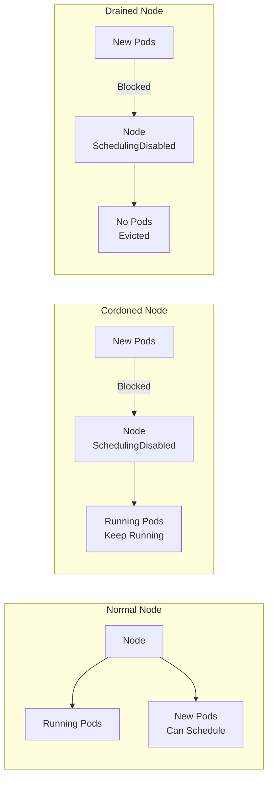

# How to Drain and Cordon Kubernetes Nodes for Maintenance

Author: [nawazdhandala](https://www.github.com/nawazdhandala)

Tags: Kubernetes, Node Maintenance, Drain, Cordon, Operations, Upgrades, DevOps

Description: Learn how to safely perform Kubernetes node maintenance using drain and cordon commands, including handling DaemonSets, PodDisruptionBudgets, and local storage.

---

Regular node maintenance is essential for keeping your Kubernetes cluster healthy—whether you're applying security patches, upgrading the kernel, replacing hardware, or scaling down your cluster. Kubernetes provides `cordon` and `drain` commands to safely evacuate workloads before taking a node offline.

This guide covers the complete workflow for safe node maintenance.

## Understanding Cordon vs Drain



| Command | Effect | Use Case |
|---------|--------|----------|
| `cordon` | Marks node as unschedulable | Prevent new pods during investigation |
| `uncordon` | Marks node as schedulable | Return node to service |
| `drain` | Cordons + evicts all pods | Prepare node for maintenance |

## Basic Commands

### Cordoning a Node

```bash
# Cordon prevents new pods from scheduling on the node
# Existing pods continue running
kubectl cordon worker-node-1

# Check node status
kubectl get nodes

# Output:
# NAME            STATUS                     ROLES    AGE   VERSION
# worker-node-1   Ready,SchedulingDisabled   <none>   30d   v1.28.0
# worker-node-2   Ready                      <none>   30d   v1.28.0

# Uncordon to allow scheduling again
kubectl uncordon worker-node-1
```

### Draining a Node

```bash
# Basic drain - evicts all pods
kubectl drain worker-node-1

# This often fails due to DaemonSets and pods without controllers
# Use these common flags:

# Ignore DaemonSet-managed pods (they'll restart on the node anyway)
kubectl drain worker-node-1 --ignore-daemonsets

# Delete pods with local storage (emptyDir volumes)
kubectl drain worker-node-1 --ignore-daemonsets --delete-emptydir-data

# Force deletion of pods not managed by a controller
kubectl drain worker-node-1 --ignore-daemonsets --force

# Combined: The most common drain command
kubectl drain worker-node-1 \
  --ignore-daemonsets \
  --delete-emptydir-data \
  --force
```

## Safe Drain Workflow

### Step 1: Check What's Running on the Node

```bash
# List all pods on the node
kubectl get pods --all-namespaces -o wide --field-selector spec.nodeName=worker-node-1

# Check for pods with local storage
kubectl get pods --all-namespaces -o wide --field-selector spec.nodeName=worker-node-1 \
  -o jsonpath='{range .items[*]}{.metadata.namespace}/{.metadata.name}: {.spec.volumes[*].emptyDir}{"\n"}{end}'

# Check for pods without controllers (will be deleted permanently)
kubectl get pods --all-namespaces --field-selector spec.nodeName=worker-node-1 \
  -o jsonpath='{range .items[?(!@.metadata.ownerReferences)]}{.metadata.namespace}/{.metadata.name}{"\n"}{end}'
```

### Step 2: Check Pod Disruption Budgets

```bash
# List all PDBs in the cluster
kubectl get pdb --all-namespaces

# Check if drain would violate any PDBs
kubectl get pdb --all-namespaces -o jsonpath='{range .items[*]}{.metadata.namespace}/{.metadata.name}: minAvailable={.spec.minAvailable}, maxUnavailable={.spec.maxUnavailable}, currentHealthy={.status.currentHealthy}{"\n"}{end}'

# Detailed PDB status
kubectl describe pdb my-pdb -n production
```

### Step 3: Drain with Timeout and Grace Period

```bash
# Production-safe drain command
kubectl drain worker-node-1 \
  --ignore-daemonsets \
  --delete-emptydir-data \
  --grace-period=60 \
  --timeout=300s \
  --pod-selector='!critical=true'  # Skip pods with critical=true label

# Watch the drain progress
kubectl get pods --all-namespaces -o wide --field-selector spec.nodeName=worker-node-1 -w
```

### Step 4: Perform Maintenance

```bash
# SSH to the node and perform maintenance
ssh worker-node-1

# Update system packages
sudo apt update && sudo apt upgrade -y

# Reboot if needed
sudo reboot

# Or perform hardware maintenance, etc.
```

### Step 5: Return Node to Service

```bash
# Once maintenance is complete, uncordon the node
kubectl uncordon worker-node-1

# Verify node is ready
kubectl get node worker-node-1

# Pods will gradually be scheduled back (or not, depending on your workload)
kubectl get pods --all-namespaces -o wide --field-selector spec.nodeName=worker-node-1
```

## Handling Common Drain Issues

### Issue 1: DaemonSet-Managed Pods

```bash
# Error: cannot delete DaemonSet-managed Pods
# Solution: Use --ignore-daemonsets flag

kubectl drain worker-node-1 --ignore-daemonsets

# DaemonSet pods (like fluentd, node-exporter) are expected to run on every node
# They'll automatically restart when the node comes back
```

### Issue 2: Pods with Local Storage

```bash
# Error: cannot delete Pods with local storage
# These pods use emptyDir volumes

kubectl drain worker-node-1 --delete-emptydir-data

# WARNING: Data in emptyDir will be lost!
# Make sure the application can handle this
```

### Issue 3: Pod Disruption Budget Prevents Eviction

```bash
# Error: Cannot evict pod as it would violate the pod's disruption budget

# Check the PDB
kubectl get pdb -A

# Options:
# 1. Wait for more replicas to be healthy
# 2. Temporarily relax the PDB (not recommended for production)
# 3. Use --disable-eviction flag (dangerous!)

# Check which pods are blocking
kubectl get pods --all-namespaces --field-selector spec.nodeName=worker-node-1 \
  -o jsonpath='{range .items[*]}{.metadata.namespace}/{.metadata.name}{"\n"}{end}' | \
while read pod; do
  ns=$(echo $pod | cut -d'/' -f1)
  name=$(echo $pod | cut -d'/' -f2)
  kubectl get pdb -n $ns -o jsonpath='{range .items[*]}{.metadata.name}: {.spec.selector.matchLabels}{"\n"}{end}' 2>/dev/null
done
```

### Issue 4: Pods Without Controllers

```bash
# Error: cannot delete Pods not managed by ReplicationController, ReplicaSet, Job, DaemonSet or StatefulSet

# These are "naked" pods that will be permanently deleted
# Use --force to delete them anyway

kubectl drain worker-node-1 --force

# Better: Recreate them with a controller first
kubectl create deployment my-pod --image=my-image --replicas=1
```

### Issue 5: Stuck Terminating Pods

```bash
# Check for stuck pods
kubectl get pods --all-namespaces --field-selector spec.nodeName=worker-node-1 | grep Terminating

# Force delete stuck pods (use with caution!)
kubectl delete pod stuck-pod -n namespace --force --grace-period=0

# If many pods are stuck, find and delete them
kubectl get pods --all-namespaces --field-selector spec.nodeName=worker-node-1 \
  -o jsonpath='{range .items[?(@.metadata.deletionTimestamp)]}{.metadata.namespace} {.metadata.name}{"\n"}{end}' | \
while read ns name; do
  kubectl delete pod $name -n $ns --force --grace-period=0
done
```

## Automated Node Maintenance

### Rolling Node Restart Script

```bash
#!/bin/bash
# rolling-node-restart.sh
# Safely restart all nodes one at a time

NODES=$(kubectl get nodes -l node-role.kubernetes.io/worker -o name)

for NODE in $NODES; do
  NODE_NAME=$(echo $NODE | cut -d'/' -f2)
  echo "=== Processing $NODE_NAME ==="
  
  # Drain the node
  echo "Draining $NODE_NAME..."
  kubectl drain $NODE_NAME \
    --ignore-daemonsets \
    --delete-emptydir-data \
    --grace-period=60 \
    --timeout=300s
  
  if [ $? -ne 0 ]; then
    echo "Failed to drain $NODE_NAME, skipping..."
    kubectl uncordon $NODE_NAME
    continue
  fi
  
  # Perform maintenance (example: reboot via SSH)
  echo "Rebooting $NODE_NAME..."
  ssh -o StrictHostKeyChecking=no $NODE_NAME "sudo reboot" &
  
  # Wait for node to come back
  echo "Waiting for $NODE_NAME to be ready..."
  sleep 60  # Initial wait for reboot
  
  until kubectl get node $NODE_NAME | grep -q "Ready"; do
    echo "Waiting for $NODE_NAME..."
    sleep 10
  done
  
  # Uncordon
  echo "Uncordoning $NODE_NAME..."
  kubectl uncordon $NODE_NAME
  
  # Wait for pods to stabilize
  echo "Waiting for pods to stabilize..."
  sleep 30
  
  echo "=== Completed $NODE_NAME ==="
done

echo "All nodes processed!"
```

### Using Kubernetes Job for Node Maintenance

```yaml
# node-maintenance-job.yaml
apiVersion: batch/v1
kind: Job
metadata:
  name: node-maintenance
  namespace: kube-system
spec:
  template:
    spec:
      serviceAccountName: node-maintenance
      containers:
        - name: maintenance
          image: bitnami/kubectl:latest
          command:
            - /bin/bash
            - -c
            - |
              NODE=$NODE_NAME
              
              # Drain
              kubectl drain $NODE --ignore-daemonsets --delete-emptydir-data --timeout=300s
              
              # Signal external system to perform maintenance
              curl -X POST "https://maintenance-api/nodes/$NODE/start"
              
              # Wait for maintenance to complete
              while [ "$(curl -s https://maintenance-api/nodes/$NODE/status)" != "complete" ]; do
                sleep 30
              done
              
              # Uncordon
              kubectl uncordon $NODE
          env:
            - name: NODE_NAME
              value: "worker-node-1"
      restartPolicy: Never
```

## Pod Disruption Budgets for Safe Draining

```yaml
# pdb-example.yaml
# Ensure at least 2 replicas are always available during draining
apiVersion: policy/v1
kind: PodDisruptionBudget
metadata:
  name: my-app-pdb
  namespace: production
spec:
  # Option 1: Minimum available
  minAvailable: 2
  
  # Option 2: Maximum unavailable (alternative to minAvailable)
  # maxUnavailable: 1
  
  selector:
    matchLabels:
      app: my-app
```

```yaml
# pdb-percentage.yaml
# Use percentages for more flexibility
apiVersion: policy/v1
kind: PodDisruptionBudget
metadata:
  name: my-app-pdb
  namespace: production
spec:
  # At least 80% of pods must remain available
  minAvailable: "80%"
  selector:
    matchLabels:
      app: my-app
```

## Monitoring Node Drains

```bash
# Watch node events
kubectl get events --watch --field-selector involvedObject.kind=Node

# Check drain status
kubectl describe node worker-node-1 | grep -A5 "Conditions:"

# Monitor pods being evicted
kubectl get pods --all-namespaces -w --field-selector spec.nodeName=worker-node-1
```

## Best Practices

### 1. Always Use Pod Disruption Budgets

```yaml
# Every production deployment should have a PDB
apiVersion: policy/v1
kind: PodDisruptionBudget
metadata:
  name: frontend-pdb
spec:
  minAvailable: 1
  selector:
    matchLabels:
      app: frontend
```

### 2. Ensure Sufficient Cluster Capacity

```bash
# Check cluster capacity before draining
kubectl describe nodes | grep -A5 "Allocated resources"

# Ensure other nodes can handle the evicted pods
kubectl top nodes
```

### 3. Use Graceful Termination

```yaml
# Set appropriate termination grace period in your pods
spec:
  terminationGracePeriodSeconds: 60
  containers:
    - name: app
      lifecycle:
        preStop:
          exec:
            command: ["/bin/sh", "-c", "sleep 10"]
```

### 4. Schedule Maintenance During Low Traffic

```bash
# Cordon node in advance of maintenance window
kubectl cordon worker-node-1

# Later, during the maintenance window, drain and perform maintenance
kubectl drain worker-node-1 --ignore-daemonsets --delete-emptydir-data
```

## Conclusion

Safe node maintenance is crucial for cluster reliability. Key takeaways:

1. **Always cordon before draining** to prevent new pods during the process
2. **Use Pod Disruption Budgets** to prevent service disruption
3. **Handle edge cases** like DaemonSets, local storage, and naked pods
4. **Monitor the drain process** and have rollback plans
5. **Automate rolling maintenance** for consistency

For monitoring your node health and maintenance operations, check out [OneUptime's Kubernetes monitoring](https://oneuptime.com/product/metrics).

## Related Resources

- [How to Troubleshoot Pod Evictions](https://oneuptime.com/blog/post/kubernetes-pod-evictions-resource-pressure/view)
- [How to Upgrade Kubernetes with Zero Downtime](https://oneuptime.com/blog/post/kubernetes-upgrade-zero-downtime/view)
- [How to Set Up Resource Quotas and Limit Ranges](https://oneuptime.com/blog/post/kubernetes-resource-quotas-limit-ranges/view)
