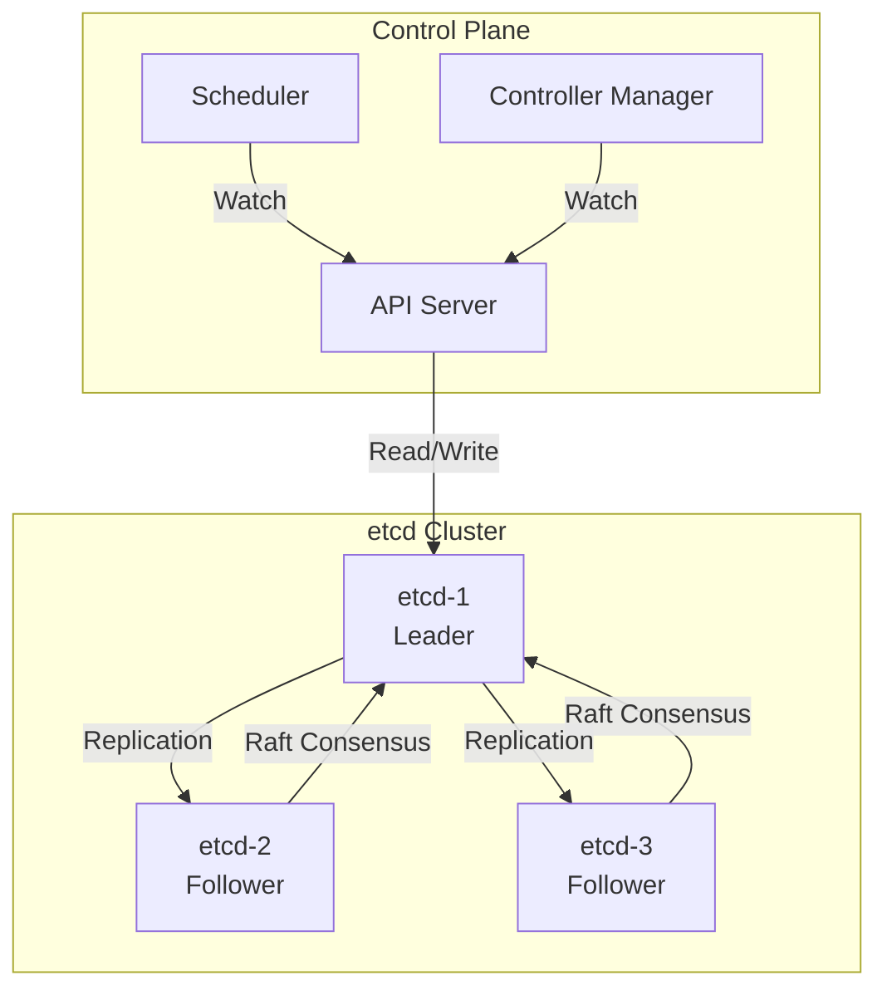

# How to Monitor Kubernetes etcd Health and Performance

Author: [nawazdhandala](https://www.github.com/nawazdhandala)

Tags: Kubernetes, etcd, Monitoring, Prometheus, Performance, Observability, Control Plane

Description: Learn how to monitor etcd cluster health, performance metrics, and set up alerts for the critical Kubernetes data store to ensure cluster reliability.

---

etcd is the heart of Kubernetes-it stores all cluster state including configurations, secrets, and service discovery information. Poor etcd performance can cause API server slowdowns, failed deployments, and cluster instability. This guide covers comprehensive etcd monitoring and alerting.

## etcd Architecture in Kubernetes



## Key etcd Metrics

| Metric Category | Key Metrics | What to Watch |
|-----------------|-------------|---------------|
| **Latency** | etcd_disk_wal_fsync_duration_seconds | Disk write latency |
| **Throughput** | etcd_network_client_grpc_received_bytes_total | Client traffic |
| **Consensus** | etcd_server_leader_changes_seen_total | Leader stability |
| **Storage** | etcd_mvcc_db_total_size_in_bytes | Database size |
| **Health** | etcd_server_has_leader | Cluster has leader |

## Enable etcd Metrics

### For kubeadm Clusters

```yaml
# /etc/kubernetes/manifests/etcd.yaml
apiVersion: v1
kind: Pod
metadata:
  name: etcd
  namespace: kube-system
  labels:
    component: etcd
spec:
  containers:
    - name: etcd
      image: registry.k8s.io/etcd:3.5.10-0
      command:
        - etcd
        - --advertise-client-urls=https://$(NODE_IP):2379
        - --cert-file=/etc/kubernetes/pki/etcd/server.crt
        - --client-cert-auth=true
        - --data-dir=/var/lib/etcd
        - --initial-advertise-peer-urls=https://$(NODE_IP):2380
        - --initial-cluster=master-1=https://192.168.1.10:2380,master-2=https://192.168.1.11:2380,master-3=https://192.168.1.12:2380
        - --key-file=/etc/kubernetes/pki/etcd/server.key
        - --listen-client-urls=https://127.0.0.1:2379,https://$(NODE_IP):2379
        - --listen-metrics-urls=http://0.0.0.0:2381  # Enable metrics
        - --listen-peer-urls=https://$(NODE_IP):2380
        - --name=$(NODE_NAME)
        - --peer-cert-file=/etc/kubernetes/pki/etcd/peer.crt
        - --peer-client-cert-auth=true
        - --peer-key-file=/etc/kubernetes/pki/etcd/peer.key
        - --peer-trusted-ca-file=/etc/kubernetes/pki/etcd/ca.crt
        - --snapshot-count=10000
        - --trusted-ca-file=/etc/kubernetes/pki/etcd/ca.crt
      ports:
        - containerPort: 2379
          name: client
        - containerPort: 2380
          name: peer
        - containerPort: 2381
          name: metrics
```

### For Managed Kubernetes

Most managed Kubernetes services don't expose etcd directly. Use their native monitoring:

**GKE:**
```bash
# etcd metrics available through Cloud Monitoring
gcloud monitoring metrics list --filter="metric.type:starts_with('kubernetes.io/anthos/etcd')"
```

**EKS:**
```bash
# Limited etcd visibility; use CloudWatch Container Insights
# Focus on API server latency as a proxy for etcd health
```

## Prometheus Configuration for etcd

### ServiceMonitor for etcd

```yaml
# etcd-servicemonitor.yaml
apiVersion: monitoring.coreos.com/v1
kind: ServiceMonitor
metadata:
  name: etcd
  namespace: monitoring
  labels:
    app: etcd
spec:
  selector:
    matchLabels:
      component: etcd
  namespaceSelector:
    matchNames:
      - kube-system
  endpoints:
    - port: metrics
      interval: 15s
      scheme: http
      # If etcd requires TLS for metrics:
      # scheme: https
      # tlsConfig:
      #   caFile: /etc/prometheus/secrets/etcd-client-cert/ca.crt
      #   certFile: /etc/prometheus/secrets/etcd-client-cert/tls.crt
      #   keyFile: /etc/prometheus/secrets/etcd-client-cert/tls.key
      #   insecureSkipVerify: false
```

### Create etcd Service for Scraping

```yaml
# etcd-service.yaml
apiVersion: v1
kind: Service
metadata:
  name: etcd
  namespace: kube-system
  labels:
    component: etcd
spec:
  clusterIP: None
  ports:
    - name: metrics
      port: 2381
      targetPort: 2381
  selector:
    component: etcd
---
# Endpoints for static etcd (if not running as pods)
apiVersion: v1
kind: Endpoints
metadata:
  name: etcd
  namespace: kube-system
  labels:
    component: etcd
subsets:
  - addresses:
      - ip: 192.168.1.10
        nodeName: master-1
      - ip: 192.168.1.11
        nodeName: master-2
      - ip: 192.168.1.12
        nodeName: master-3
    ports:
      - name: metrics
        port: 2381
```

### Static Prometheus Config

```yaml
# prometheus-etcd-scrape.yaml
scrape_configs:
  - job_name: 'etcd'
    static_configs:
      - targets:
          - '192.168.1.10:2381'
          - '192.168.1.11:2381'
          - '192.168.1.12:2381'
    
    # For TLS-enabled metrics endpoint
    scheme: https
    tls_config:
      ca_file: /etc/prometheus/etcd/ca.crt
      cert_file: /etc/prometheus/etcd/client.crt
      key_file: /etc/prometheus/etcd/client.key
```

## Essential Alert Rules

```yaml
# etcd-alerts.yaml
apiVersion: monitoring.coreos.com/v1
kind: PrometheusRule
metadata:
  name: etcd-alerts
  namespace: monitoring
spec:
  groups:
    - name: etcd
      rules:
        # Cluster health
        - alert: etcdNoLeader
          expr: etcd_server_has_leader == 0
          for: 1m
          labels:
            severity: critical
          annotations:
            summary: "etcd cluster has no leader"
            description: "etcd cluster {{ $labels.job }} has no leader for more than 1 minute"
        
        - alert: etcdHighNumberOfLeaderChanges
          expr: increase(etcd_server_leader_changes_seen_total[1h]) > 3
          labels:
            severity: warning
          annotations:
            summary: "etcd cluster leader changes frequently"
            description: "etcd cluster {{ $labels.job }} has seen {{ $value }} leader changes in the last hour"
        
        - alert: etcdInsufficientMembers
          expr: count(etcd_server_id) < 3
          for: 3m
          labels:
            severity: critical
          annotations:
            summary: "etcd cluster has insufficient members"
            description: "etcd cluster {{ $labels.job }} has only {{ $value }} members, which is below the minimum of 3"
        
        - alert: etcdMemberCommunicationSlow
          expr: histogram_quantile(0.99, rate(etcd_network_peer_round_trip_time_seconds_bucket[5m])) > 0.15
          for: 10m
          labels:
            severity: warning
          annotations:
            summary: "etcd member communication is slow"
            description: "etcd cluster {{ $labels.job }} member {{ $labels.To }} round-trip time is {{ $value }}s"
        
        # Disk performance
        - alert: etcdHighFsyncDurations
          expr: histogram_quantile(0.99, rate(etcd_disk_wal_fsync_duration_seconds_bucket[5m])) > 0.5
          for: 10m
          labels:
            severity: warning
          annotations:
            summary: "etcd WAL fsync taking too long"
            description: "etcd cluster {{ $labels.job }} WAL fsync 99th percentile is {{ $value }}s"
        
        - alert: etcdHighCommitDurations
          expr: histogram_quantile(0.99, rate(etcd_disk_backend_commit_duration_seconds_bucket[5m])) > 0.25
          for: 10m
          labels:
            severity: warning
          annotations:
            summary: "etcd backend commit taking too long"
            description: "etcd cluster {{ $labels.job }} backend commit 99th percentile is {{ $value }}s"
        
        # Database size
        - alert: etcdDatabaseQuotaLowSpace
          expr: (etcd_mvcc_db_total_size_in_bytes / etcd_server_quota_backend_bytes) * 100 > 80
          for: 5m
          labels:
            severity: warning
          annotations:
            summary: "etcd database running low on space"
            description: "etcd cluster {{ $labels.job }} database size is {{ $value | humanizePercentage }} of quota"
        
        - alert: etcdDatabaseQuotaCritical
          expr: (etcd_mvcc_db_total_size_in_bytes / etcd_server_quota_backend_bytes) * 100 > 95
          for: 1m
          labels:
            severity: critical
          annotations:
            summary: "etcd database critically low on space"
            description: "etcd cluster {{ $labels.job }} database size is {{ $value | humanizePercentage }} of quota. Cluster may become read-only!"
        
        # Request latency
        - alert: etcdGRPCRequestsSlow
          expr: histogram_quantile(0.99, rate(grpc_server_handling_seconds_bucket{grpc_type="unary"}[5m])) > 0.15
          for: 10m
          labels:
            severity: warning
          annotations:
            summary: "etcd gRPC requests are slow"
            description: "etcd cluster {{ $labels.job }} gRPC {{ $labels.grpc_method }} 99th percentile is {{ $value }}s"
        
        # Proposal failures
        - alert: etcdHighNumberOfFailedProposals
          expr: increase(etcd_server_proposals_failed_total[1h]) > 5
          labels:
            severity: warning
          annotations:
            summary: "High number of failed etcd proposals"
            description: "etcd cluster {{ $labels.job }} has {{ $value }} failed proposals in the last hour"
        
        # HTTP requests
        - alert: etcdHighNumberOfFailedHTTPRequests
          expr: |
            sum(rate(etcd_http_failed_total[5m])) by (method)
            /
            sum(rate(etcd_http_received_total[5m])) by (method)
            > 0.01
          for: 10m
          labels:
            severity: warning
          annotations:
            summary: "High rate of failed etcd HTTP requests"
            description: "{{ $value | humanizePercentage }} of {{ $labels.method }} requests are failing"
```

## Grafana Dashboard

### Dashboard JSON

```json
{
  "dashboard": {
    "title": "etcd Cluster Health",
    "panels": [
      {
        "title": "Cluster Health",
        "type": "stat",
        "gridPos": {"h": 4, "w": 6, "x": 0, "y": 0},
        "targets": [
          {
            "expr": "sum(etcd_server_has_leader)",
            "legendFormat": "Members with Leader"
          }
        ],
        "fieldConfig": {
          "defaults": {
            "thresholds": {
              "steps": [
                {"color": "red", "value": null},
                {"color": "yellow", "value": 1},
                {"color": "green", "value": 3}
              ]
            }
          }
        }
      },
      {
        "title": "Leader Changes (24h)",
        "type": "stat",
        "gridPos": {"h": 4, "w": 6, "x": 6, "y": 0},
        "targets": [
          {
            "expr": "sum(increase(etcd_server_leader_changes_seen_total[24h]))",
            "legendFormat": "Leader Changes"
          }
        ],
        "fieldConfig": {
          "defaults": {
            "thresholds": {
              "steps": [
                {"color": "green", "value": null},
                {"color": "yellow", "value": 3},
                {"color": "red", "value": 10}
              ]
            }
          }
        }
      },
      {
        "title": "Database Size",
        "type": "gauge",
        "gridPos": {"h": 4, "w": 6, "x": 12, "y": 0},
        "targets": [
          {
            "expr": "(etcd_mvcc_db_total_size_in_bytes / etcd_server_quota_backend_bytes) * 100",
            "legendFormat": "{{ instance }}"
          }
        ],
        "fieldConfig": {
          "defaults": {
            "unit": "percent",
            "max": 100,
            "thresholds": {
              "steps": [
                {"color": "green", "value": null},
                {"color": "yellow", "value": 70},
                {"color": "red", "value": 90}
              ]
            }
          }
        }
      },
      {
        "title": "Database Size (Bytes)",
        "type": "timeseries",
        "gridPos": {"h": 8, "w": 12, "x": 0, "y": 4},
        "targets": [
          {
            "expr": "etcd_mvcc_db_total_size_in_bytes",
            "legendFormat": "{{ instance }}"
          },
          {
            "expr": "etcd_server_quota_backend_bytes",
            "legendFormat": "Quota"
          }
        ],
        "fieldConfig": {
          "defaults": {"unit": "bytes"}
        }
      },
      {
        "title": "WAL Fsync Duration (p99)",
        "type": "timeseries",
        "gridPos": {"h": 8, "w": 12, "x": 12, "y": 4},
        "targets": [
          {
            "expr": "histogram_quantile(0.99, rate(etcd_disk_wal_fsync_duration_seconds_bucket[5m]))",
            "legendFormat": "{{ instance }}"
          }
        ],
        "fieldConfig": {
          "defaults": {
            "unit": "s",
            "custom": {
              "thresholdsStyle": {"mode": "line"}
            },
            "thresholds": {
              "steps": [
                {"color": "green", "value": null},
                {"color": "red", "value": 0.5}
              ]
            }
          }
        }
      },
      {
        "title": "Backend Commit Duration (p99)",
        "type": "timeseries",
        "gridPos": {"h": 8, "w": 12, "x": 0, "y": 12},
        "targets": [
          {
            "expr": "histogram_quantile(0.99, rate(etcd_disk_backend_commit_duration_seconds_bucket[5m]))",
            "legendFormat": "{{ instance }}"
          }
        ],
        "fieldConfig": {
          "defaults": {"unit": "s"}
        }
      },
      {
        "title": "Peer Round Trip Time (p99)",
        "type": "timeseries",
        "gridPos": {"h": 8, "w": 12, "x": 12, "y": 12},
        "targets": [
          {
            "expr": "histogram_quantile(0.99, rate(etcd_network_peer_round_trip_time_seconds_bucket[5m]))",
            "legendFormat": "{{ To }}"
          }
        ],
        "fieldConfig": {
          "defaults": {"unit": "s"}
        }
      },
      {
        "title": "Client Traffic Received",
        "type": "timeseries",
        "gridPos": {"h": 8, "w": 12, "x": 0, "y": 20},
        "targets": [
          {
            "expr": "rate(etcd_network_client_grpc_received_bytes_total[5m])",
            "legendFormat": "{{ instance }}"
          }
        ],
        "fieldConfig": {
          "defaults": {"unit": "Bps"}
        }
      },
      {
        "title": "gRPC Request Rate",
        "type": "timeseries",
        "gridPos": {"h": 8, "w": 12, "x": 12, "y": 20},
        "targets": [
          {
            "expr": "sum by (grpc_method) (rate(grpc_server_started_total[5m]))",
            "legendFormat": "{{ grpc_method }}"
          }
        ],
        "fieldConfig": {
          "defaults": {"unit": "ops"}
        }
      },
      {
        "title": "Keys in etcd",
        "type": "stat",
        "gridPos": {"h": 4, "w": 6, "x": 18, "y": 0},
        "targets": [
          {
            "expr": "etcd_debugging_mvcc_keys_total",
            "legendFormat": "Keys"
          }
        ]
      },
      {
        "title": "Raft Proposals",
        "type": "timeseries",
        "gridPos": {"h": 8, "w": 24, "x": 0, "y": 28},
        "targets": [
          {
            "expr": "rate(etcd_server_proposals_committed_total[5m])",
            "legendFormat": "Committed"
          },
          {
            "expr": "rate(etcd_server_proposals_applied_total[5m])",
            "legendFormat": "Applied"
          },
          {
            "expr": "rate(etcd_server_proposals_failed_total[5m])",
            "legendFormat": "Failed"
          },
          {
            "expr": "etcd_server_proposals_pending",
            "legendFormat": "Pending"
          }
        ]
      }
    ]
  }
}
```

## CLI Health Checks

### Using etcdctl

```bash
#!/bin/bash
# etcd-health-check.sh

ETCD_ENDPOINTS="https://192.168.1.10:2379,https://192.168.1.11:2379,https://192.168.1.12:2379"
ETCD_CACERT="/etc/kubernetes/pki/etcd/ca.crt"
ETCD_CERT="/etc/kubernetes/pki/etcd/peer.crt"
ETCD_KEY="/etc/kubernetes/pki/etcd/peer.key"

# Check endpoint health
echo "=== Endpoint Health ==="
etcdctl endpoint health \
  --endpoints=$ETCD_ENDPOINTS \
  --cacert=$ETCD_CACERT \
  --cert=$ETCD_CERT \
  --key=$ETCD_KEY

# Check endpoint status
echo -e "\n=== Endpoint Status ==="
etcdctl endpoint status \
  --endpoints=$ETCD_ENDPOINTS \
  --cacert=$ETCD_CACERT \
  --cert=$ETCD_CERT \
  --key=$ETCD_KEY \
  --write-out=table

# Check member list
echo -e "\n=== Member List ==="
etcdctl member list \
  --endpoints=$ETCD_ENDPOINTS \
  --cacert=$ETCD_CACERT \
  --cert=$ETCD_CERT \
  --key=$ETCD_KEY \
  --write-out=table

# Check alarms
echo -e "\n=== Alarms ==="
etcdctl alarm list \
  --endpoints=$ETCD_ENDPOINTS \
  --cacert=$ETCD_CACERT \
  --cert=$ETCD_CERT \
  --key=$ETCD_KEY

# Performance check
echo -e "\n=== Performance Check ==="
etcdctl check perf \
  --endpoints=$ETCD_ENDPOINTS \
  --cacert=$ETCD_CACERT \
  --cert=$ETCD_CERT \
  --key=$ETCD_KEY
```

### Kubernetes CronJob for Health Checks

```yaml
# etcd-health-check-cronjob.yaml
apiVersion: batch/v1
kind: CronJob
metadata:
  name: etcd-health-check
  namespace: kube-system
spec:
  schedule: "*/5 * * * *"
  jobTemplate:
    spec:
      template:
        spec:
          hostNetwork: true
          containers:
            - name: etcdctl
              image: registry.k8s.io/etcd:3.5.10-0
              command:
                - /bin/sh
                - -c
                - |
                  etcdctl endpoint health \
                    --endpoints=https://127.0.0.1:2379 \
                    --cacert=/etc/kubernetes/pki/etcd/ca.crt \
                    --cert=/etc/kubernetes/pki/etcd/peer.crt \
                    --key=/etc/kubernetes/pki/etcd/peer.key
                  
                  if [ $? -ne 0 ]; then
                    echo "etcd health check failed!"
                    # Send alert (webhook, etc.)
                    exit 1
                  fi
              volumeMounts:
                - name: etcd-certs
                  mountPath: /etc/kubernetes/pki/etcd
                  readOnly: true
          volumes:
            - name: etcd-certs
              hostPath:
                path: /etc/kubernetes/pki/etcd
          restartPolicy: OnFailure
          nodeSelector:
            node-role.kubernetes.io/control-plane: ""
          tolerations:
            - key: node-role.kubernetes.io/control-plane
              effect: NoSchedule
```

## Performance Tuning Based on Metrics

### Identify Issues

```promql
# Slow disk writes
histogram_quantile(0.99, rate(etcd_disk_wal_fsync_duration_seconds_bucket[5m])) > 0.1

# High memory usage
process_resident_memory_bytes{job="etcd"} > 2e9

# Large database
etcd_mvcc_db_total_size_in_bytes > 4e9

# Slow peer communication
histogram_quantile(0.99, rate(etcd_network_peer_round_trip_time_seconds_bucket[5m])) > 0.1
```

### Compaction and Defragmentation

```bash
# Get current revision
CURRENT_REV=$(etcdctl endpoint status --write-out="json" | jq -r '.[0].Status.header.revision')

# Compact old revisions
etcdctl compact $CURRENT_REV

# Defragment to reclaim space
etcdctl defrag --endpoints=$ETCD_ENDPOINTS

# Check database size after defrag
etcdctl endpoint status --write-out=table
```

## Summary

| Metric | Warning Threshold | Critical Threshold |
|--------|-------------------|-------------------|
| Leader changes/hour | > 3 | > 10 |
| WAL fsync p99 | > 100ms | > 500ms |
| Backend commit p99 | > 100ms | > 250ms |
| Database usage | > 70% | > 90% |
| Peer RTT p99 | > 100ms | > 200ms |
| Failed proposals/hour | > 5 | > 20 |

## Related Posts

- [How to Set Up Prometheus and Grafana on Kubernetes from Scratch](https://oneuptime.com/blog/post/2026-01-19-kubernetes-prometheus-grafana-setup/view) - Complete monitoring setup
- [How to Back Up and Restore Kubernetes Clusters with Velero](https://oneuptime.com/blog/post/2026-01-19-kubernetes-velero-backup-restore/view) - Include etcd in backups
- [How to Troubleshoot Kubernetes Control Plane Issues](https://oneuptime.com/blog/post/2026-01-19-kubernetes-ingress-troubleshooting/view) - Debug control plane problems
