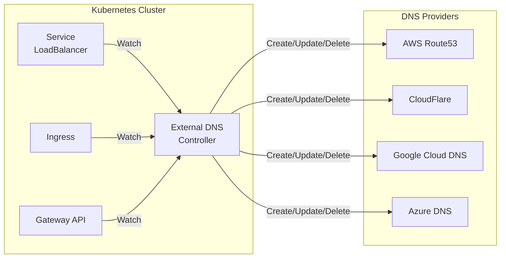

# How to Set Up Kubernetes External DNS for Automatic DNS Records

Author: [nawazdhandala](https://www.github.com/nawazdhandala)

Tags: Kubernetes, External DNS, DNS, Route53, CloudFlare, Azure DNS, GCP Cloud DNS, Automation

Description: Learn how to configure External DNS to automatically create and manage DNS records for Kubernetes Services and Ingresses across multiple DNS providers.

---

Managing DNS records manually for Kubernetes services is tedious and error-prone. External DNS automates this by watching Kubernetes resources (Services, Ingresses, Gateway API routes) and synchronizing DNS records with external providers like Route53, CloudFlare, Google Cloud DNS, and Azure DNS.

## How External DNS Works



## Installation

### Prerequisites

```bash
# Create namespace
kubectl create namespace external-dns

# Verify you have a DNS zone configured in your provider
# AWS: aws route53 list-hosted-zones
# GCP: gcloud dns managed-zones list
# Azure: az network dns zone list
```

### Helm Installation

```bash
# Add Bitnami Helm repo
helm repo add bitnami https://charts.bitnami.com/bitnami
helm repo update

# Install for AWS Route53
helm install external-dns bitnami/external-dns \
  --namespace external-dns \
  --values external-dns-values.yaml
```

## AWS Route53 Configuration

### IAM Policy

```json
{
  "Version": "2012-10-17",
  "Statement": [
    {
      "Effect": "Allow",
      "Action": [
        "route53:ChangeResourceRecordSets"
      ],
      "Resource": [
        "arn:aws:route53:::hostedzone/*"
      ]
    },
    {
      "Effect": "Allow",
      "Action": [
        "route53:ListHostedZones",
        "route53:ListResourceRecordSets"
      ],
      "Resource": [
        "*"
      ]
    }
  ]
}
```

### Helm Values for Route53

```yaml
# external-dns-values-aws.yaml
provider: aws

aws:
  region: us-west-2
  # If using IAM Roles for Service Accounts (IRSA)
  # credentials will be injected automatically
  
  # Or use static credentials (not recommended)
  # credentials:
  #   secretName: external-dns-aws-credentials
  #   accessKey: ""
  #   secretKey: ""

# Domain filters - only manage these domains
domainFilters:
  - example.com

# Zone type filter
zoneType: public  # or private

# Ownership tracking
txtOwnerId: "external-dns"
txtPrefix: "_externaldns."

# Policy: sync, upsert-only, create-only
policy: sync

# Sync interval
interval: 1m

# Source types to watch
sources:
  - service
  - ingress
  - gateway-httproute

# Service Account with IRSA annotation
serviceAccount:
  create: true
  annotations:
    eks.amazonaws.com/role-arn: arn:aws:iam::123456789012:role/external-dns

# Resources
resources:
  requests:
    cpu: 50m
    memory: 64Mi
  limits:
    cpu: 100m
    memory: 128Mi

# Logging
logLevel: info
logFormat: text
```

### Full Deployment for AWS

```yaml
# external-dns-aws.yaml
apiVersion: v1
kind: ServiceAccount
metadata:
  name: external-dns
  namespace: external-dns
  annotations:
    eks.amazonaws.com/role-arn: arn:aws:iam::123456789012:role/external-dns
---
apiVersion: rbac.authorization.k8s.io/v1
kind: ClusterRole
metadata:
  name: external-dns
rules:
  - apiGroups: [""]
    resources: ["services", "endpoints", "pods", "nodes"]
    verbs: ["get", "watch", "list"]
  - apiGroups: ["extensions", "networking.k8s.io"]
    resources: ["ingresses"]
    verbs: ["get", "watch", "list"]
  - apiGroups: ["gateway.networking.k8s.io"]
    resources: ["gateways", "httproutes", "grpcroutes", "tlsroutes", "tcproutes", "udproutes"]
    verbs: ["get", "watch", "list"]
---
apiVersion: rbac.authorization.k8s.io/v1
kind: ClusterRoleBinding
metadata:
  name: external-dns
roleRef:
  apiGroup: rbac.authorization.k8s.io
  kind: ClusterRole
  name: external-dns
subjects:
  - kind: ServiceAccount
    name: external-dns
    namespace: external-dns
---
apiVersion: apps/v1
kind: Deployment
metadata:
  name: external-dns
  namespace: external-dns
spec:
  replicas: 1
  selector:
    matchLabels:
      app: external-dns
  strategy:
    type: Recreate
  template:
    metadata:
      labels:
        app: external-dns
    spec:
      serviceAccountName: external-dns
      containers:
        - name: external-dns
          image: registry.k8s.io/external-dns/external-dns:v0.14.0
          args:
            - --source=service
            - --source=ingress
            - --source=gateway-httproute
            - --provider=aws
            - --registry=txt
            - --txt-owner-id=external-dns
            - --txt-prefix=_externaldns.
            - --domain-filter=example.com
            - --policy=sync
            - --interval=1m
            - --aws-zone-type=public
            - --log-level=info
          env:
            - name: AWS_DEFAULT_REGION
              value: us-west-2
          resources:
            requests:
              cpu: 50m
              memory: 64Mi
            limits:
              cpu: 100m
              memory: 128Mi
```

## Google Cloud DNS Configuration

### GCP Service Account

```bash
# Create service account
gcloud iam service-accounts create external-dns \
  --display-name "External DNS"

# Grant DNS admin role
gcloud projects add-iam-policy-binding my-project \
  --member serviceAccount:external-dns@my-project.iam.gserviceaccount.com \
  --role roles/dns.admin

# Create key and store as secret
gcloud iam service-accounts keys create credentials.json \
  --iam-account external-dns@my-project.iam.gserviceaccount.com

kubectl create secret generic external-dns-gcp-credentials \
  --from-file=credentials.json \
  --namespace external-dns
```

### Helm Values for GCP

```yaml
# external-dns-values-gcp.yaml
provider: google

google:
  project: my-gcp-project
  serviceAccountSecret: external-dns-gcp-credentials
  serviceAccountSecretKey: credentials.json

domainFilters:
  - example.com

policy: sync
txtOwnerId: "external-dns"
txtPrefix: "_externaldns."

sources:
  - service
  - ingress

resources:
  requests:
    cpu: 50m
    memory: 64Mi
```

## Azure DNS Configuration

### Azure Service Principal

```bash
# Create service principal
az ad sp create-for-rbac --name external-dns \
  --role "DNS Zone Contributor" \
  --scopes /subscriptions/<subscription-id>/resourceGroups/<resource-group>/providers/Microsoft.Network/dnszones/<zone-name>

# Create secret
cat <<EOF > azure.json
{
  "tenantId": "<tenant-id>",
  "subscriptionId": "<subscription-id>",
  "resourceGroup": "<resource-group>",
  "aadClientId": "<client-id>",
  "aadClientSecret": "<client-secret>"
}
EOF

kubectl create secret generic external-dns-azure-credentials \
  --from-file=azure.json \
  --namespace external-dns
```

### Helm Values for Azure

```yaml
# external-dns-values-azure.yaml
provider: azure

azure:
  resourceGroup: my-resource-group
  tenantId: <tenant-id>
  subscriptionId: <subscription-id>
  secretName: external-dns-azure-credentials

domainFilters:
  - example.com

policy: sync
txtOwnerId: "external-dns"

sources:
  - service
  - ingress
```

## CloudFlare Configuration

### API Token

```bash
# Create API token with Zone:DNS:Edit permissions
# Store in Kubernetes secret
kubectl create secret generic cloudflare-api-token \
  --from-literal=cloudflare_api_token=<your-api-token> \
  --namespace external-dns
```

### Helm Values for CloudFlare

```yaml
# external-dns-values-cloudflare.yaml
provider: cloudflare

cloudflare:
  apiToken: ""  # Will be read from secret
  proxied: false  # Set to true to enable CloudFlare proxy

env:
  - name: CF_API_TOKEN
    valueFrom:
      secretKeyRef:
        name: cloudflare-api-token
        key: cloudflare_api_token

domainFilters:
  - example.com

policy: sync
txtOwnerId: "external-dns"

sources:
  - service
  - ingress
```

## Using External DNS

### Service with External DNS

```yaml
# service-external-dns.yaml
apiVersion: v1
kind: Service
metadata:
  name: myapp
  namespace: production
  annotations:
    # Create A record for this service
    external-dns.alpha.kubernetes.io/hostname: myapp.example.com
    # Optional: Set TTL
    external-dns.alpha.kubernetes.io/ttl: "300"
spec:
  type: LoadBalancer
  ports:
    - port: 80
      targetPort: 8080
  selector:
    app: myapp
```

### Ingress with External DNS

```yaml
# ingress-external-dns.yaml
apiVersion: networking.k8s.io/v1
kind: Ingress
metadata:
  name: myapp
  namespace: production
  annotations:
    # Optional: External DNS picks up hosts from spec.rules automatically
    # Use annotation to add additional hostnames
    external-dns.alpha.kubernetes.io/hostname: myapp.example.com,api.example.com
    external-dns.alpha.kubernetes.io/ttl: "300"
spec:
  ingressClassName: nginx
  tls:
    - hosts:
        - myapp.example.com
      secretName: myapp-tls
  rules:
    - host: myapp.example.com
      http:
        paths:
          - path: /
            pathType: Prefix
            backend:
              service:
                name: myapp
                port:
                  number: 80
```

### Gateway API with External DNS

```yaml
# gateway-external-dns.yaml
apiVersion: gateway.networking.k8s.io/v1
kind: Gateway
metadata:
  name: main-gateway
  namespace: gateway-system
  annotations:
    external-dns.alpha.kubernetes.io/hostname: "*.example.com"
spec:
  gatewayClassName: nginx
  listeners:
    - name: http
      port: 80
      protocol: HTTP
      hostname: "*.example.com"
---
apiVersion: gateway.networking.k8s.io/v1
kind: HTTPRoute
metadata:
  name: myapp-route
  namespace: production
spec:
  parentRefs:
    - name: main-gateway
      namespace: gateway-system
  hostnames:
    - myapp.example.com  # External DNS creates record for this
  rules:
    - matches:
        - path:
            type: PathPrefix
            value: /
      backendRefs:
        - name: myapp
          port: 80
```

### Multiple Hostnames

```yaml
# multi-hostname-service.yaml
apiVersion: v1
kind: Service
metadata:
  name: myapp
  annotations:
    external-dns.alpha.kubernetes.io/hostname: |
      myapp.example.com,
      www.myapp.example.com,
      api.myapp.example.com
spec:
  type: LoadBalancer
  # ...
```

### Internal DNS Records

```yaml
# internal-dns-service.yaml
apiVersion: v1
kind: Service
metadata:
  name: internal-api
  annotations:
    external-dns.alpha.kubernetes.io/hostname: internal-api.internal.example.com
    # Specify zone for private DNS
    external-dns.alpha.kubernetes.io/aws-zone-type: private
spec:
  type: LoadBalancer
  annotations:
    service.beta.kubernetes.io/aws-load-balancer-internal: "true"
  # ...
```

## Advanced Configuration

### Filtering by Annotation

```yaml
# Only process resources with specific annotation
args:
  - --annotation-filter=external-dns.alpha.kubernetes.io/enabled=true
```

```yaml
# Service with filter annotation
apiVersion: v1
kind: Service
metadata:
  name: myapp
  annotations:
    external-dns.alpha.kubernetes.io/enabled: "true"
    external-dns.alpha.kubernetes.io/hostname: myapp.example.com
```

### Namespace Filtering

```yaml
# Only watch specific namespaces
args:
  - --namespace=production
  - --namespace=staging
```

### Custom TXT Record Prefix

```yaml
# Avoid conflicts with other TXT records
args:
  - --txt-prefix=_k8s-dns.
```

### Registry Types

```yaml
# Use different registry types
args:
  # TXT registry (default) - stores ownership in TXT records
  - --registry=txt
  
  # Noop registry - no ownership tracking (dangerous!)
  # - --registry=noop
  
  # AWS SD registry - for AWS Cloud Map
  # - --registry=aws-sd
```

## Monitoring External DNS

### Prometheus Metrics

```yaml
# Enable metrics
args:
  - --metrics-address=:7979

# ServiceMonitor
apiVersion: monitoring.coreos.com/v1
kind: ServiceMonitor
metadata:
  name: external-dns
  namespace: external-dns
spec:
  selector:
    matchLabels:
      app: external-dns
  endpoints:
    - port: metrics
      interval: 30s
```

### Key Metrics

```promql
# DNS records managed
external_dns_registry_endpoints_total

# Source errors
external_dns_source_errors_total

# Registry errors
external_dns_registry_errors_total

# Last sync timestamp
external_dns_controller_last_sync_timestamp_seconds
```

### Alerts

```yaml
# external-dns-alerts.yaml
apiVersion: monitoring.coreos.com/v1
kind: PrometheusRule
metadata:
  name: external-dns-alerts
  namespace: external-dns
spec:
  groups:
    - name: external-dns
      rules:
        - alert: ExternalDNSSourceErrors
          expr: increase(external_dns_source_errors_total[5m]) > 0
          for: 5m
          labels:
            severity: warning
          annotations:
            summary: "External DNS source errors"
            description: "External DNS is having trouble reading Kubernetes resources"
        
        - alert: ExternalDNSRegistryErrors
          expr: increase(external_dns_registry_errors_total[5m]) > 0
          for: 5m
          labels:
            severity: warning
          annotations:
            summary: "External DNS registry errors"
            description: "External DNS is having trouble updating DNS provider"
        
        - alert: ExternalDNSNotSyncing
          expr: time() - external_dns_controller_last_sync_timestamp_seconds > 300
          for: 5m
          labels:
            severity: warning
          annotations:
            summary: "External DNS not syncing"
            description: "External DNS has not synced in over 5 minutes"
```

## Troubleshooting

### Check External DNS Logs

```bash
# View logs
kubectl logs -n external-dns deployment/external-dns -f

# Enable debug logging
args:
  - --log-level=debug
```

### Verify DNS Records

```bash
# Check TXT ownership records
dig +short TXT _externaldns.myapp.example.com

# Verify A/AAAA records
dig +short A myapp.example.com

# Test DNS propagation
watch -n 5 'dig +short myapp.example.com'
```

### Common Issues

```bash
# Issue: Records not being created
# Check if External DNS can see the resource
kubectl get services -A -o wide
kubectl get ingresses -A

# Issue: Permission denied
# Verify IAM roles/service accounts
kubectl describe sa external-dns -n external-dns

# Issue: Wrong zone
# Check zone filters
kubectl logs -n external-dns deployment/external-dns | grep -i zone
```

## Summary

| Provider | Authentication | Key Configuration |
|----------|---------------|-------------------|
| AWS Route53 | IRSA / IAM User | `--provider=aws` |
| Google Cloud DNS | Service Account | `--provider=google` |
| Azure DNS | Service Principal | `--provider=azure` |
| CloudFlare | API Token | `--provider=cloudflare` |

## Related Posts

- [How to Configure Kubernetes Service Topology for Locality-Aware Routing](https://oneuptime.com/blog/post/2026-01-19-kubernetes-service-topology-locality/view) - Traffic routing optimization
- [How to Implement Kubernetes Gateway API](https://oneuptime.com/blog/post/2026-01-19-kubernetes-gateway-api-ingress-successor/view) - Modern ingress with External DNS
- [How to Set Up TLS Certificates with cert-manager in Kubernetes](https://oneuptime.com/blog/post/2026-01-19-kubernetes-cert-manager-tls-certificates/view) - HTTPS for your services
