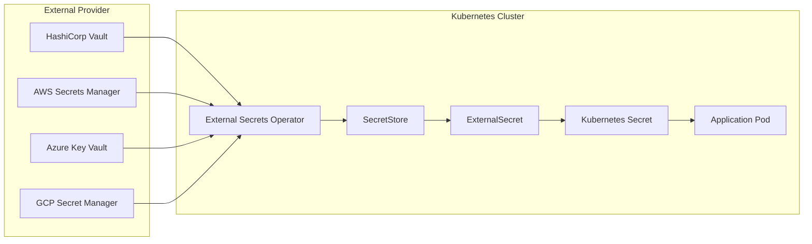

# How to Secure Kubernetes Secrets with External Secrets Operator and HashiCorp Vault

Author: [nawazdhandala](https://www.github.com/nawazdhandala)

Tags: Kubernetes, Security, Secrets Management, HashiCorp Vault, External Secrets Operator, DevOps

Description: Integration patterns for secret management using External Secrets Operator with HashiCorp Vault, AWS Secrets Manager, and other providers.

Kubernetes Secrets have a fundamental problem: they're base64 encoded, not encrypted. Anyone with RBAC access to read secrets can decode them instantly. Worse, secrets in GitOps repositories become security liabilities. External Secrets Operator (ESO) solves this by syncing secrets from external providers like HashiCorp Vault, AWS Secrets Manager, or Azure Key Vault into your cluster automatically. This guide covers the complete setup from provider configuration to production patterns.

---

## Why External Secret Management?

Storing secrets directly in Kubernetes manifests or Git repositories creates several risks:

- **Base64 is not encryption** - `kubectl get secret -o yaml` reveals everything
- **Git history is forever** - a rotated secret in Git still exists in history
- **No audit trail** - Kubernetes doesn't log who read which secret when
- **No central rotation** - updating a secret means touching every cluster

External secret managers solve these problems:

| Feature | Native K8s Secrets | External Secrets Operator |
|---------|-------------------|---------------------------|
| Encryption at rest | Depends on etcd config | Provider-managed (always encrypted) |
| Audit logging | Limited | Full audit trail |
| Central rotation | Manual per cluster | Rotate once, sync everywhere |
| GitOps safe | Secrets in repo | Only references in repo |
| Access control | RBAC only | Provider IAM + RBAC |

## Architecture Overview

External Secrets Operator acts as a bridge between your external secret store and Kubernetes Secrets.

This diagram shows how secrets flow from external providers into Kubernetes:



Key components:

- **SecretStore/ClusterSecretStore**: Configures how to connect to the external provider
- **ExternalSecret**: Declares which secrets to sync and how to map them
- **Kubernetes Secret**: The synced secret that pods actually consume

## Step 1: Install External Secrets Operator

Install ESO using Helm. This works on any Kubernetes distribution.

```bash
# Add the External Secrets Helm repository
helm repo add external-secrets https://charts.external-secrets.io
helm repo update

# Install External Secrets Operator
# The operator watches for ExternalSecret resources and syncs them
helm install external-secrets external-secrets/external-secrets \
  --namespace external-secrets \
  --create-namespace \
  --set installCRDs=true
```

Verify the installation:

```bash
# Check that the operator pods are running
kubectl get pods -n external-secrets

# Verify CRDs are installed
kubectl get crd | grep external-secrets
```

You should see three CRDs: `secretstores`, `clustersecretstores`, and `externalsecrets`.

## Step 2: Configure HashiCorp Vault

Vault is the most popular choice for self-hosted secret management. Let's configure ESO to connect to it.

### Vault Setup (If You Don't Have One)

For testing, deploy Vault in dev mode. For production, use a proper HA setup.

```bash
# Install Vault in dev mode for testing
# WARNING: Dev mode is insecure and stores data in memory
helm repo add hashicorp https://helm.releases.hashicorp.com
helm install vault hashicorp/vault \
  --namespace vault \
  --create-namespace \
  --set "server.dev.enabled=true"
```

### Enable KV Secrets Engine

Configure Vault to store your application secrets:

```bash
# Port-forward to access Vault
kubectl port-forward svc/vault -n vault 8200:8200 &

# Set Vault address and token (dev mode token is "root")
export VAULT_ADDR="http://localhost:8200"
export VAULT_TOKEN="root"

# Enable KV v2 secrets engine at path "secret"
# KV v2 supports versioning of secrets
vault secrets enable -path=secret kv-v2

# Write a test secret
vault kv put secret/myapp/config \
  database_url="postgres://user:pass@db:5432/myapp" \
  api_key="supersecretkey123"
```

### Create Vault Authentication for ESO

ESO needs credentials to authenticate with Vault. Kubernetes Auth is the recommended approach:

```bash
# Enable Kubernetes auth method in Vault
vault auth enable kubernetes

# Configure Kubernetes auth to trust the cluster's service accounts
# This allows pods in your cluster to authenticate with Vault
vault write auth/kubernetes/config \
  kubernetes_host="https://kubernetes.default.svc" \
  kubernetes_ca_cert=@/var/run/secrets/kubernetes.io/serviceaccount/ca.crt
```

Create a Vault policy for ESO:

```bash
# Create policy allowing read access to secrets
vault policy write external-secrets - <<EOF
# Allow reading secrets under secret/data/*
path "secret/data/*" {
  capabilities = ["read"]
}

# Allow listing secrets
path "secret/metadata/*" {
  capabilities = ["list"]
}
EOF

# Create a Vault role that ESO will use
vault write auth/kubernetes/role/external-secrets \
  bound_service_account_names=external-secrets \
  bound_service_account_namespaces=external-secrets \
  policies=external-secrets \
  ttl=1h
```

### Create SecretStore for Vault

Now configure ESO to connect to Vault:

This SecretStore tells ESO how to authenticate with Vault using Kubernetes service account tokens:

```yaml
# ClusterSecretStore for Vault (available to all namespaces)
apiVersion: external-secrets.io/v1beta1
kind: ClusterSecretStore
metadata:
  name: vault-backend
spec:
  provider:
    vault:
      # Vault server address
      server: "http://vault.vault.svc:8200"
      # Path to the KV secrets engine
      path: "secret"
      # KV version (v2 supports versioning)
      version: "v2"
      # Authentication configuration
      auth:
        kubernetes:
          # Mount path for kubernetes auth
          mountPath: "kubernetes"
          # Role created in Vault
          role: "external-secrets"
          # Service account for authentication
          serviceAccountRef:
            name: external-secrets
            namespace: external-secrets
```

Apply and verify:

```bash
kubectl apply -f cluster-secret-store.yaml

# Check the SecretStore status
kubectl get clustersecretstore vault-backend

# Should show "Valid" in the STATUS column
```

## Step 3: Sync Secrets with ExternalSecret

Now create an ExternalSecret that pulls data from Vault into a Kubernetes Secret.

### Basic ExternalSecret

This ExternalSecret syncs the myapp/config secret from Vault into a Kubernetes Secret:

```yaml
apiVersion: external-secrets.io/v1beta1
kind: ExternalSecret
metadata:
  name: myapp-secrets
  namespace: default
spec:
  # How often to refresh the secret from the provider
  refreshInterval: 1h
  
  # Reference to the SecretStore
  secretStoreRef:
    name: vault-backend
    kind: ClusterSecretStore
  
  # Target Kubernetes Secret configuration
  target:
    name: myapp-secrets  # Name of the K8s Secret to create
    creationPolicy: Owner  # ESO owns and manages this secret
    
  # Data to sync from the provider
  data:
    # Map Vault keys to Kubernetes Secret keys
    - secretKey: DATABASE_URL  # Key in K8s Secret
      remoteRef:
        key: secret/data/myapp/config  # Path in Vault
        property: database_url  # Key within the Vault secret
    
    - secretKey: API_KEY
      remoteRef:
        key: secret/data/myapp/config
        property: api_key
```

Apply and verify:

```bash
kubectl apply -f external-secret.yaml

# Check sync status
kubectl get externalsecret myapp-secrets

# Verify the Kubernetes Secret was created
kubectl get secret myapp-secrets -o yaml
```

### Sync All Keys from a Vault Path

If you want all keys from a Vault secret without mapping each one:

This pattern syncs all keys from a Vault secret path, useful when you don't want to enumerate each key:

```yaml
apiVersion: external-secrets.io/v1beta1
kind: ExternalSecret
metadata:
  name: myapp-all-secrets
  namespace: default
spec:
  refreshInterval: 1h
  secretStoreRef:
    name: vault-backend
    kind: ClusterSecretStore
  target:
    name: myapp-all-secrets
  
  # Use dataFrom to sync all keys from a path
  dataFrom:
    - extract:
        key: secret/data/myapp/config
        # All keys from this path become keys in the K8s Secret
```

## Step 4: AWS Secrets Manager Integration

For AWS-native environments, Secrets Manager is often the preferred choice.

### IAM Setup

Create an IAM policy for ESO to read secrets:

```json
{
  "Version": "2012-10-17",
  "Statement": [
    {
      "Effect": "Allow",
      "Action": [
        "secretsmanager:GetSecretValue",
        "secretsmanager:DescribeSecret"
      ],
      "Resource": "arn:aws:secretsmanager:us-east-1:123456789:secret:myapp/*"
    }
  ]
}
```

### SecretStore for AWS

Configure ESO to use AWS Secrets Manager:

This SecretStore authenticates with AWS using IRSA (IAM Roles for Service Accounts) which is the recommended approach for EKS:

```yaml
apiVersion: external-secrets.io/v1beta1
kind: ClusterSecretStore
metadata:
  name: aws-secrets-manager
spec:
  provider:
    aws:
      service: SecretsManager
      region: us-east-1
      # For EKS with IRSA, use service account authentication
      auth:
        jwt:
          serviceAccountRef:
            name: external-secrets-sa
            namespace: external-secrets
```

If using static credentials (not recommended for production):

```yaml
apiVersion: external-secrets.io/v1beta1
kind: SecretStore
metadata:
  name: aws-secrets-manager
  namespace: default
spec:
  provider:
    aws:
      service: SecretsManager
      region: us-east-1
      auth:
        secretRef:
          accessKeyIDSecretRef:
            name: aws-credentials
            key: access-key-id
          secretAccessKeySecretRef:
            name: aws-credentials
            key: secret-access-key
```

### ExternalSecret for AWS

Sync a secret from AWS Secrets Manager:

```yaml
apiVersion: external-secrets.io/v1beta1
kind: ExternalSecret
metadata:
  name: myapp-aws-secrets
  namespace: default
spec:
  refreshInterval: 1h
  secretStoreRef:
    name: aws-secrets-manager
    kind: ClusterSecretStore
  target:
    name: myapp-secrets
  data:
    - secretKey: DATABASE_URL
      remoteRef:
        # AWS secret name
        key: myapp/production/database
        # JSON key if the secret value is JSON
        property: url
```

## Step 5: Production Patterns

### Pattern 1: Namespace-Scoped SecretStores

For multi-tenant clusters, use namespace-scoped SecretStores instead of ClusterSecretStore:

This pattern gives each team their own SecretStore, limiting what secrets they can access:

```yaml
# Team-specific SecretStore
apiVersion: external-secrets.io/v1beta1
kind: SecretStore
metadata:
  name: team-alpha-vault
  namespace: team-alpha
spec:
  provider:
    vault:
      server: "http://vault.vault.svc:8200"
      path: "secret"
      version: "v2"
      auth:
        kubernetes:
          mountPath: "kubernetes"
          # Team-specific role with limited Vault access
          role: "team-alpha"
          serviceAccountRef:
            name: team-alpha-eso-sa
```

### Pattern 2: Template Secrets

ESO can template secrets for complex configurations:

Templates let you combine multiple secret values or add static data:

```yaml
apiVersion: external-secrets.io/v1beta1
kind: ExternalSecret
metadata:
  name: database-connection
  namespace: default
spec:
  refreshInterval: 1h
  secretStoreRef:
    name: vault-backend
    kind: ClusterSecretStore
  target:
    name: database-connection
    template:
      # Template the final secret data
      data:
        # Combine multiple values into a connection string
        connection-string: |
          postgresql://{{ .username }}:{{ .password }}@{{ .host }}:5432/{{ .database }}?sslmode=require
  data:
    - secretKey: username
      remoteRef:
        key: secret/data/database/credentials
        property: username
    - secretKey: password
      remoteRef:
        key: secret/data/database/credentials
        property: password
    - secretKey: host
      remoteRef:
        key: secret/data/database/config
        property: host
    - secretKey: database
      remoteRef:
        key: secret/data/database/config
        property: name
```

### Pattern 3: Push Secrets (Reverse Sync)

ESO can also push Kubernetes Secrets to external providers:

Push Secrets are useful for syncing generated credentials (like TLS certs) to your secret manager:

```yaml
apiVersion: external-secrets.io/v1alpha1
kind: PushSecret
metadata:
  name: push-tls-cert
  namespace: default
spec:
  # Delete the external secret when this resource is deleted
  deletionPolicy: Delete
  # How often to sync
  refreshInterval: 1h
  secretStoreRefs:
    - name: vault-backend
      kind: ClusterSecretStore
  # Which Kubernetes Secret to push
  selector:
    secret:
      name: my-tls-cert
  # Where to push it
  data:
    - match:
        secretKey: tls.crt
        remoteRef:
          remoteKey: secret/data/certs/my-tls-cert
          property: certificate
    - match:
        secretKey: tls.key
        remoteRef:
          remoteKey: secret/data/certs/my-tls-cert
          property: private_key
```

### Pattern 4: Generator for Dynamic Secrets

ESO can generate secrets dynamically:

Use generators for passwords, UUIDs, or other values that should be created on-demand:

```yaml
apiVersion: external-secrets.io/v1beta1
kind: ExternalSecret
metadata:
  name: generated-password
  namespace: default
spec:
  refreshInterval: 0  # Don't refresh generated values
  target:
    name: app-password
  dataFrom:
    - sourceRef:
        generatorRef:
          apiVersion: generators.external-secrets.io/v1alpha1
          kind: Password
          name: my-password-generator
---
apiVersion: generators.external-secrets.io/v1alpha1
kind: Password
metadata:
  name: my-password-generator
  namespace: default
spec:
  length: 32
  digits: 6
  symbols: 4
  noUpper: false
  allowRepeat: true
```

## Step 6: Secret Rotation

External Secrets Operator automatically syncs updated secrets based on the `refreshInterval`. But for zero-downtime rotation, you need to handle application reloads.

### Automatic Pod Restart on Secret Change

Use Reloader or stakater/reloader to restart pods when secrets change:

```bash
# Install Reloader
kubectl apply -f https://raw.githubusercontent.com/stakater/Reloader/master/deployments/kubernetes/reloader.yaml
```

Annotate your deployment to restart on secret changes:

```yaml
apiVersion: apps/v1
kind: Deployment
metadata:
  name: myapp
  annotations:
    # Reloader watches this secret and restarts pods when it changes
    reloader.stakater.com/auto: "true"
spec:
  template:
    spec:
      containers:
        - name: app
          envFrom:
            - secretRef:
                name: myapp-secrets
```

### Signal-Based Reload

For applications that support hot reload, mount secrets as files and watch for changes:

```yaml
apiVersion: apps/v1
kind: Deployment
metadata:
  name: nginx
spec:
  template:
    spec:
      containers:
        - name: nginx
          image: nginx
          volumeMounts:
            - name: secrets
              mountPath: /etc/nginx/secrets
              readOnly: true
          # Nginx reloads config on SIGHUP
          lifecycle:
            postStart:
              exec:
                command: ["/bin/sh", "-c", "nginx -s reload"]
      volumes:
        - name: secrets
          secret:
            secretName: nginx-certs
```

## Troubleshooting

### ExternalSecret Stuck in "SecretSyncedError"

Check the ExternalSecret status for error details:

```bash
# Get detailed status including error messages
kubectl describe externalsecret myapp-secrets

# Check ESO operator logs for detailed errors
kubectl logs -n external-secrets -l app.kubernetes.io/name=external-secrets
```

Common causes:
- **Authentication failure**: Verify SecretStore credentials
- **Permission denied**: Check Vault policies or IAM permissions
- **Wrong path**: Verify the secret path exists in the provider

### SecretStore Shows "Invalid"

Debug SecretStore connectivity:

```bash
# Check SecretStore status
kubectl describe clustersecretstore vault-backend

# Verify network connectivity to Vault
kubectl run debug --rm -it --image=curlimages/curl -- \
  curl -v http://vault.vault.svc:8200/v1/sys/health
```

### Secrets Not Updating

If secrets don't refresh:

```bash
# Force a refresh by adding an annotation
kubectl annotate externalsecret myapp-secrets \
  force-sync=$(date +%s) --overwrite

# Check the refreshInterval isn't set to 0
kubectl get externalsecret myapp-secrets -o yaml | grep refreshInterval
```

## Security Best Practices

1. **Use namespace-scoped SecretStores** for multi-tenant clusters
2. **Limit Vault policies** to specific paths per application
3. **Enable audit logging** in your secret provider
4. **Rotate provider credentials** used by ESO regularly
5. **Use IRSA/Workload Identity** instead of static credentials
6. **Set appropriate refreshIntervals** - too frequent wastes resources, too infrequent delays rotation
7. **Monitor sync failures** - alert when ExternalSecrets fail to sync

## Monitoring ESO

External Secrets Operator exposes Prometheus metrics:

```yaml
# ServiceMonitor for ESO metrics
apiVersion: monitoring.coreos.com/v1
kind: ServiceMonitor
metadata:
  name: external-secrets
  namespace: external-secrets
spec:
  selector:
    matchLabels:
      app.kubernetes.io/name: external-secrets
  endpoints:
    - port: metrics
```

Key metrics to monitor:

```promql
# Alert on sync failures
sum(rate(externalsecret_sync_calls_error_total[5m])) by (name, namespace) > 0

# Alert on provider authentication failures
sum(rate(externalsecret_provider_api_calls_error_total[5m])) by (provider) > 0
```

## Related Resources

- [How to Implement Kubernetes RBAC Best Practices](https://oneuptime.com/blog/post/2026-01-19-kubernetes-rbac-multi-tenant-best-practices/view) - Secure access to synced secrets
- [How to Set Up Pod Security Standards (PSS)](https://oneuptime.com/blog/post/2026-01-19-kubernetes-pod-security-standards-pss/view) - Harden workloads that consume secrets
- [Keep PII Out of Your Telemetry](https://oneuptime.com/blog/post/2025-11-13-keep-pii-out-of-observability-telemetry/view) - Prevent secrets from leaking to logs

External Secrets Operator transforms secret management from a liability into a strength. Your GitOps repositories stay clean, your secrets rotate automatically, and your audit trail becomes comprehensive. The initial setup investment pays off immediately in security posture and operational simplicity.
