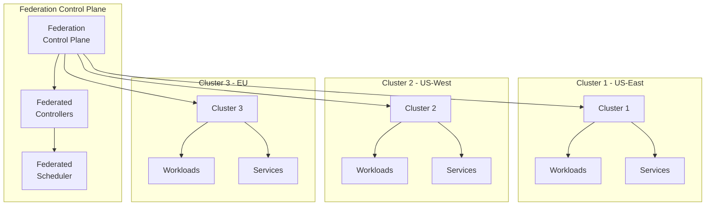

# How to Set Up Kubernetes Federation Across Clusters

Author: [nawazdhandala](https://www.github.com/nawazdhandala)

Tags: Kubernetes, Federation, Multi-Cluster, KubeFed, High Availability, Disaster Recovery

Description: Learn how to federate multiple Kubernetes clusters for unified management, cross-cluster service discovery, and disaster recovery.

---

Kubernetes Federation allows you to manage multiple clusters as a single entity, enabling workload distribution across regions, hybrid cloud deployments, and disaster recovery scenarios.

This guide covers setting up and managing federated Kubernetes clusters.

## Understanding Kubernetes Federation



## Federation Options

| Solution | Use Case | Complexity |
|----------|----------|------------|
| KubeFed (v2) | Full federation | High |
| Liqo | Multi-cluster networking | Medium |
| Admiralty | Scheduling across clusters | Medium |
| Skupper | Service connectivity | Low |
| Submariner | Network connectivity | Medium |

## Setting Up KubeFed

### Install KubeFed

```bash
# Install kubefedctl CLI
VERSION=0.10.0
curl -LO "https://github.com/kubernetes-sigs/kubefed/releases/download/v${VERSION}/kubefedctl-${VERSION}-linux-amd64.tgz"
tar -xzf kubefedctl-${VERSION}-linux-amd64.tgz
sudo mv kubefedctl /usr/local/bin/

# Or on macOS
brew install kubefedctl

# Install KubeFed on the host cluster
helm repo add kubefed-charts https://raw.githubusercontent.com/kubernetes-sigs/kubefed/master/charts
helm install kubefed kubefed-charts/kubefed \
  --namespace kube-federation-system \
  --create-namespace

# Verify installation
kubectl get pods -n kube-federation-system
```

### Join Clusters

```bash
# Set up kubeconfig for all clusters
export KUBECONFIG=~/.kube/config

# Host cluster context
kubectl config use-context host-cluster

# Join member clusters
kubefedctl join cluster1 \
  --cluster-context=cluster1-context \
  --host-cluster-context=host-cluster \
  --v=2

kubefedctl join cluster2 \
  --cluster-context=cluster2-context \
  --host-cluster-context=host-cluster \
  --v=2

kubefedctl join cluster3 \
  --cluster-context=cluster3-context \
  --host-cluster-context=host-cluster \
  --v=2

# Verify joined clusters
kubectl get kubefedclusters -n kube-federation-system
```

### Enable Federation for Resource Types

```bash
# Enable federation for common resource types
kubefedctl enable namespaces
kubefedctl enable deployments.apps
kubefedctl enable services
kubefedctl enable configmaps
kubefedctl enable secrets
kubefedctl enable ingresses.networking.k8s.io

# Check enabled types
kubectl get federatedtypeconfigs -n kube-federation-system
```

## Federated Resources

### Federated Namespace

```yaml
# federated-namespace.yaml
apiVersion: types.kubefed.io/v1beta1
kind: FederatedNamespace
metadata:
  name: my-app
  namespace: my-app
spec:
  placement:
    clusters:
      - name: cluster1
      - name: cluster2
      - name: cluster3
```

### Federated Deployment

```yaml
# federated-deployment.yaml
apiVersion: types.kubefed.io/v1beta1
kind: FederatedDeployment
metadata:
  name: my-app
  namespace: my-app
spec:
  template:
    metadata:
      labels:
        app: my-app
    spec:
      replicas: 3
      selector:
        matchLabels:
          app: my-app
      template:
        metadata:
          labels:
            app: my-app
        spec:
          containers:
            - name: my-app
              image: myregistry/my-app:v1.0.0
              ports:
                - containerPort: 8080
              resources:
                requests:
                  cpu: 100m
                  memory: 128Mi
  placement:
    clusters:
      - name: cluster1
      - name: cluster2
      - name: cluster3
  overrides:
    - clusterName: cluster1
      clusterOverrides:
        - path: "/spec/replicas"
          value: 5            # More replicas in cluster1
    - clusterName: cluster3
      clusterOverrides:
        - path: "/spec/template/spec/containers/0/image"
          value: myregistry/my-app:v1.0.0-eu  # EU-specific image
```

### Federated Service

```yaml
# federated-service.yaml
apiVersion: types.kubefed.io/v1beta1
kind: FederatedService
metadata:
  name: my-app
  namespace: my-app
spec:
  template:
    spec:
      selector:
        app: my-app
      ports:
        - port: 80
          targetPort: 8080
      type: ClusterIP
  placement:
    clusters:
      - name: cluster1
      - name: cluster2
      - name: cluster3
```

### Federated ConfigMap

```yaml
# federated-configmap.yaml
apiVersion: types.kubefed.io/v1beta1
kind: FederatedConfigMap
metadata:
  name: my-app-config
  namespace: my-app
spec:
  template:
    data:
      LOG_LEVEL: "info"
      MAX_CONNECTIONS: "100"
  placement:
    clusters:
      - name: cluster1
      - name: cluster2
      - name: cluster3
  overrides:
    - clusterName: cluster1
      clusterOverrides:
        - path: "/data/REGION"
          value: "us-east"
    - clusterName: cluster2
      clusterOverrides:
        - path: "/data/REGION"
          value: "us-west"
    - clusterName: cluster3
      clusterOverrides:
        - path: "/data/REGION"
          value: "eu-west"
```

## Replica Scheduling Preferences

### Weighted Distribution

```yaml
# Distribute replicas based on weights
apiVersion: scheduling.kubefed.io/v1alpha1
kind: ReplicaSchedulingPreference
metadata:
  name: my-app
  namespace: my-app
spec:
  targetKind: FederatedDeployment
  totalReplicas: 9
  clusters:
    cluster1:
      weight: 2           # 2/4 of replicas = 4-5 pods
    cluster2:
      weight: 1           # 1/4 of replicas = 2-3 pods
    cluster3:
      weight: 1           # 1/4 of replicas = 2-3 pods
```

### Min/Max Replicas per Cluster

```yaml
# Set bounds on replica distribution
apiVersion: scheduling.kubefed.io/v1alpha1
kind: ReplicaSchedulingPreference
metadata:
  name: my-app
  namespace: my-app
spec:
  targetKind: FederatedDeployment
  totalReplicas: 12
  clusters:
    cluster1:
      minReplicas: 2
      maxReplicas: 6
      weight: 1
    cluster2:
      minReplicas: 2
      maxReplicas: 4
      weight: 1
    cluster3:
      minReplicas: 2
      maxReplicas: 4
      weight: 1
```

## Cross-Cluster Service Discovery with Submariner

### Install Submariner

```bash
# Install subctl CLI
curl -Ls https://get.submariner.io | bash
export PATH=$PATH:~/.local/bin

# Deploy broker on host cluster
subctl deploy-broker --kubeconfig kubeconfig-host

# Join clusters to broker
subctl join --kubeconfig kubeconfig-cluster1 broker-info.subm \
  --clusterid cluster1 \
  --natt=false

subctl join --kubeconfig kubeconfig-cluster2 broker-info.subm \
  --clusterid cluster2 \
  --natt=false

# Verify connectivity
subctl show all
```

### Export Services

```yaml
# Make service discoverable across clusters
apiVersion: multicluster.x-k8s.io/v1alpha1
kind: ServiceExport
metadata:
  name: my-app
  namespace: my-app
---
# Service is now accessible as:
# my-app.my-app.svc.clusterset.local
```

### Service Import

```yaml
# Import service from other clusters
apiVersion: multicluster.x-k8s.io/v1alpha1
kind: ServiceImport
metadata:
  name: my-app
  namespace: my-app
spec:
  type: ClusterSetIP
  ports:
    - port: 80
      protocol: TCP
```

## Multi-Cluster Ingress

### Global Load Balancing with External DNS

```yaml
# Federated Ingress with DNS
apiVersion: types.kubefed.io/v1beta1
kind: FederatedIngress
metadata:
  name: my-app
  namespace: my-app
spec:
  template:
    metadata:
      annotations:
        external-dns.alpha.kubernetes.io/hostname: my-app.example.com
        external-dns.alpha.kubernetes.io/ttl: "60"
    spec:
      ingressClassName: nginx
      rules:
        - host: my-app.example.com
          http:
            paths:
              - path: /
                pathType: Prefix
                backend:
                  service:
                    name: my-app
                    port:
                      number: 80
  placement:
    clusters:
      - name: cluster1
      - name: cluster2
      - name: cluster3
```

### Geo-Based Routing

```yaml
# Route53 geo-routing example
apiVersion: externaldns.k8s.io/v1alpha1
kind: DNSEndpoint
metadata:
  name: my-app-geo
  namespace: my-app
spec:
  endpoints:
    - dnsName: my-app.example.com
      recordTTL: 60
      recordType: A
      targets:
        - 1.2.3.4              # cluster1 IP
      setIdentifier: us-east-1
      providerSpecific:
        - name: aws/geolocation-country-code
          value: US
    - dnsName: my-app.example.com
      recordTTL: 60
      recordType: A
      targets:
        - 5.6.7.8              # cluster3 IP
      setIdentifier: eu-west-1
      providerSpecific:
        - name: aws/geolocation-country-code
          value: "*"           # Default for other regions
```

## Disaster Recovery Patterns

### Active-Passive Federation

```yaml
# Primary cluster gets all traffic
apiVersion: types.kubefed.io/v1beta1
kind: FederatedDeployment
metadata:
  name: my-app
  namespace: my-app
spec:
  template:
    spec:
      replicas: 5
      # ... deployment spec
  placement:
    clusters:
      - name: primary-cluster
      - name: dr-cluster        # Standby
  overrides:
    - clusterName: dr-cluster
      clusterOverrides:
        - path: "/spec/replicas"
          value: 0              # No replicas until failover
```

### Failover Script

```bash
#!/bin/bash
# failover.sh - Switch traffic to DR cluster

PRIMARY="primary-cluster"
DR="dr-cluster"

echo "Initiating failover from $PRIMARY to $DR..."

# Scale up DR cluster
kubectl patch federateddeployment my-app -n my-app --type='json' \
  -p='[{"op": "replace", "path": "/spec/overrides/0/clusterOverrides/0/value", "value": 0}]'

kubectl patch federateddeployment my-app -n my-app --type='json' \
  -p='[{"op": "replace", "path": "/spec/overrides/1/clusterOverrides/0/value", "value": 5}]'

# Update DNS (example with Route53)
aws route53 change-resource-record-sets \
  --hosted-zone-id $ZONE_ID \
  --change-batch file://failover-dns.json

echo "Failover complete. Traffic now routing to $DR"
```

## Monitoring Multi-Cluster

### Prometheus Federation

```yaml
# Prometheus configuration to scrape from multiple clusters
# prometheus.yaml
global:
  scrape_interval: 15s

scrape_configs:
  - job_name: 'federate-cluster1'
    honor_labels: true
    metrics_path: '/federate'
    params:
      'match[]':
        - '{job="kubernetes-pods"}'
        - '{job="kubernetes-nodes"}'
    static_configs:
      - targets:
          - 'prometheus-cluster1.example.com:9090'
        labels:
          cluster: 'cluster1'
          
  - job_name: 'federate-cluster2'
    honor_labels: true
    metrics_path: '/federate'
    params:
      'match[]':
        - '{job="kubernetes-pods"}'
        - '{job="kubernetes-nodes"}'
    static_configs:
      - targets:
          - 'prometheus-cluster2.example.com:9090'
        labels:
          cluster: 'cluster2'
```

### Centralized Logging

```yaml
# Fluent Bit config to forward to central logging
apiVersion: v1
kind: ConfigMap
metadata:
  name: fluent-bit-config
  namespace: logging
data:
  fluent-bit.conf: |
    [SERVICE]
        Flush         1
        Log_Level     info
        
    [INPUT]
        Name              tail
        Path              /var/log/containers/*.log
        Tag               kube.*
        
    [FILTER]
        Name              record_modifier
        Match             *
        Record            cluster ${CLUSTER_NAME}
        
    [OUTPUT]
        Name              forward
        Match             *
        Host              central-fluentd.example.com
        Port              24224
```

## Multi-Cluster Best Practices

### 1. Consistent Naming

```yaml
# Use consistent labels across clusters
metadata:
  labels:
    app: my-app
    environment: production
    team: platform
    federation.kubernetes.io/cluster: cluster1
```

### 2. Health Checks

```bash
#!/bin/bash
# Check federation health
for cluster in cluster1 cluster2 cluster3; do
  echo "Checking $cluster..."
  kubectl get kubefedcluster $cluster -n kube-federation-system -o jsonpath='{.status.conditions[?(@.type=="Ready")].status}'
  echo ""
done
```

### 3. Resource Quotas per Cluster

```yaml
apiVersion: types.kubefed.io/v1beta1
kind: FederatedResourceQuota
metadata:
  name: team-quota
  namespace: my-app
spec:
  template:
    spec:
      hard:
        requests.cpu: "10"
        requests.memory: "20Gi"
  placement:
    clusters:
      - name: cluster1
      - name: cluster2
```

## Conclusion

Kubernetes Federation enables powerful multi-cluster management. Key takeaways:

1. **Choose the right tool** - KubeFed for full federation, Submariner for networking
2. **Plan your topology** - Active-active vs active-passive
3. **Handle networking** - Cross-cluster service discovery is crucial
4. **Implement DR** - Failover procedures and testing
5. **Centralize observability** - Unified monitoring and logging

For monitoring federated clusters, check out [OneUptime's multi-cluster monitoring](https://oneuptime.com/product/metrics).

## Related Resources

- [How to Set Up Cross-Cluster Service Discovery](https://oneuptime.com/blog/post/2026-01-19-kubernetes-cross-cluster-service-discovery/view)
- [How to Set Up ArgoCD for GitOps](https://oneuptime.com/blog/post/2026-01-06-kubernetes-gitops-argocd/view)
- [How to Implement Blue-Green Deployments](https://oneuptime.com/blog/post/2025-11-28-what-are-blue-green-deployments/view)
