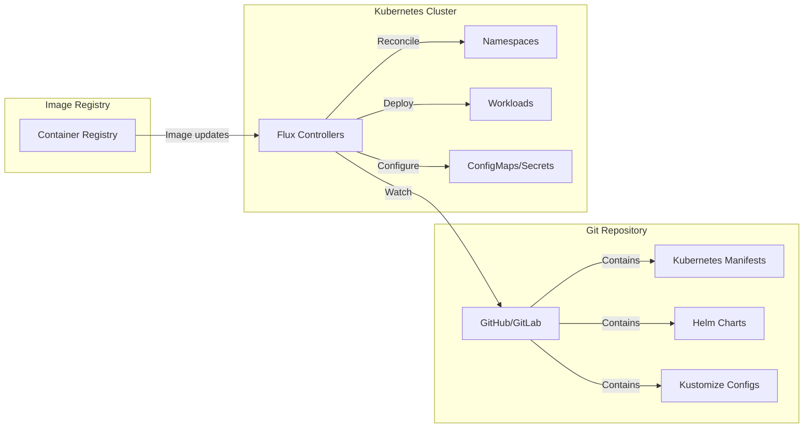

# How to Set Up Flux CD for GitOps in Kubernetes

Author: [nawazdhandala](https://www.github.com/nawazdhandala)

Tags: Kubernetes, Flux CD, GitOps, CI/CD, Continuous Deployment, DevOps

Description: Learn how to implement GitOps workflows using Flux CD to automatically synchronize your Kubernetes cluster state with Git repositories.

---

Flux CD is a popular GitOps tool that keeps your Kubernetes clusters in sync with configuration stored in Git repositories. When you update your Git repo, Flux automatically applies those changes to your cluster.

This guide covers setting up Flux CD for production GitOps workflows.

## GitOps Architecture with Flux



## Installing Flux CD

### Prerequisites

```bash
# Install Flux CLI
# macOS
brew install fluxcd/tap/flux

# Linux
curl -s https://fluxcd.io/install.sh | sudo bash

# Verify installation
flux --version

# Check prerequisites
flux check --pre
```

### Bootstrap Flux with GitHub

```bash
# Export GitHub credentials
export GITHUB_TOKEN=<your-github-token>
export GITHUB_USER=<your-github-username>

# Bootstrap Flux - this creates the flux-system namespace
# and connects to your GitHub repository
flux bootstrap github \
  --owner=$GITHUB_USER \
  --repository=fleet-infra \
  --branch=main \
  --path=./clusters/production \
  --personal

# For organization repositories
flux bootstrap github \
  --owner=my-org \
  --repository=fleet-infra \
  --branch=main \
  --path=./clusters/production \
  --team=platform-team
```

### Bootstrap with GitLab

```bash
export GITLAB_TOKEN=<your-gitlab-token>

flux bootstrap gitlab \
  --owner=my-group \
  --repository=fleet-infra \
  --branch=main \
  --path=./clusters/production \
  --token-auth
```

## Repository Structure

```plaintext
fleet-infra/
├── clusters/
│   ├── production/
│   │   ├── flux-system/           # Auto-generated by bootstrap
│   │   │   ├── gotk-components.yaml
│   │   │   ├── gotk-sync.yaml
│   │   │   └── kustomization.yaml
│   │   ├── infrastructure.yaml    # Infrastructure sources
│   │   └── apps.yaml              # Application sources
│   └── staging/
│       ├── flux-system/
│       ├── infrastructure.yaml
│       └── apps.yaml
├── infrastructure/
│   ├── controllers/               # Ingress, cert-manager, etc.
│   │   ├── ingress-nginx/
│   │   └── cert-manager/
│   ├── configs/                   # Cluster-wide configs
│   │   ├── cluster-issuers/
│   │   └── network-policies/
│   └── sources/                   # Helm repositories
│       └── helm-repositories.yaml
└── apps/
    ├── base/                      # Base configurations
    │   ├── frontend/
    │   └── backend/
    ├── production/                # Production overlays
    │   ├── frontend/
    │   └── backend/
    └── staging/                   # Staging overlays
        ├── frontend/
        └── backend/
```

## Flux Resources

### GitRepository Source

```yaml
# clusters/production/sources/git-sources.yaml
apiVersion: source.toolkit.fluxcd.io/v1
kind: GitRepository
metadata:
  name: fleet-infra
  namespace: flux-system
spec:
  interval: 1m                    # How often to check for changes
  url: https://github.com/my-org/fleet-infra
  ref:
    branch: main
  secretRef:
    name: flux-system             # Git credentials
---
# Application repository
apiVersion: source.toolkit.fluxcd.io/v1
kind: GitRepository
metadata:
  name: myapp
  namespace: flux-system
spec:
  interval: 5m
  url: https://github.com/my-org/myapp
  ref:
    branch: main
    # Or use a tag
    # tag: v1.2.3
    # Or semver range
    # semver: ">=1.0.0 <2.0.0"
```

### HelmRepository Source

```yaml
# infrastructure/sources/helm-repositories.yaml
apiVersion: source.toolkit.fluxcd.io/v1beta2
kind: HelmRepository
metadata:
  name: bitnami
  namespace: flux-system
spec:
  interval: 1h
  url: https://charts.bitnami.com/bitnami
---
apiVersion: source.toolkit.fluxcd.io/v1beta2
kind: HelmRepository
metadata:
  name: ingress-nginx
  namespace: flux-system
spec:
  interval: 1h
  url: https://kubernetes.github.io/ingress-nginx
---
apiVersion: source.toolkit.fluxcd.io/v1beta2
kind: HelmRepository
metadata:
  name: jetstack
  namespace: flux-system
spec:
  interval: 1h
  url: https://charts.jetstack.io
```

### Kustomization Resource

```yaml
# clusters/production/infrastructure.yaml
apiVersion: kustomize.toolkit.fluxcd.io/v1
kind: Kustomization
metadata:
  name: infrastructure-controllers
  namespace: flux-system
spec:
  interval: 10m
  retryInterval: 1m
  timeout: 5m
  sourceRef:
    kind: GitRepository
    name: fleet-infra
  path: ./infrastructure/controllers
  prune: true                     # Delete resources removed from Git
  wait: true                      # Wait for resources to be ready
  healthChecks:
    - apiVersion: apps/v1
      kind: Deployment
      name: ingress-nginx-controller
      namespace: ingress-nginx
---
apiVersion: kustomize.toolkit.fluxcd.io/v1
kind: Kustomization
metadata:
  name: infrastructure-configs
  namespace: flux-system
spec:
  dependsOn:
    - name: infrastructure-controllers
  interval: 10m
  sourceRef:
    kind: GitRepository
    name: fleet-infra
  path: ./infrastructure/configs
  prune: true
```

### HelmRelease Resource

```yaml
# infrastructure/controllers/ingress-nginx/release.yaml
apiVersion: helm.toolkit.fluxcd.io/v2beta1
kind: HelmRelease
metadata:
  name: ingress-nginx
  namespace: ingress-nginx
spec:
  interval: 30m
  chart:
    spec:
      chart: ingress-nginx
      version: "4.x"              # Semver constraint
      sourceRef:
        kind: HelmRepository
        name: ingress-nginx
        namespace: flux-system
      interval: 12h
  values:
    controller:
      replicaCount: 2
      resources:
        requests:
          cpu: 100m
          memory: 128Mi
      metrics:
        enabled: true
  # Upgrade settings
  upgrade:
    remediation:
      retries: 3
  # Rollback on failure
  rollback:
    cleanupOnFail: true
```

## Application Deployment

### Base Application

```yaml
# apps/base/frontend/deployment.yaml
apiVersion: apps/v1
kind: Deployment
metadata:
  name: frontend
spec:
  replicas: 2
  selector:
    matchLabels:
      app: frontend
  template:
    metadata:
      labels:
        app: frontend
    spec:
      containers:
        - name: frontend
          image: myregistry/frontend:latest
          ports:
            - containerPort: 80
          resources:
            requests:
              cpu: 100m
              memory: 128Mi
---
# apps/base/frontend/service.yaml
apiVersion: v1
kind: Service
metadata:
  name: frontend
spec:
  selector:
    app: frontend
  ports:
    - port: 80
      targetPort: 80
---
# apps/base/frontend/kustomization.yaml
apiVersion: kustomize.config.k8s.io/v1beta1
kind: Kustomization
resources:
  - deployment.yaml
  - service.yaml
```

### Production Overlay

```yaml
# apps/production/frontend/kustomization.yaml
apiVersion: kustomize.config.k8s.io/v1beta1
kind: Kustomization
namespace: production
resources:
  - ../../base/frontend
patches:
  - patch: |
      - op: replace
        path: /spec/replicas
        value: 5
    target:
      kind: Deployment
      name: frontend
images:
  - name: myregistry/frontend
    newTag: v1.2.3
```

### Deploy Applications

```yaml
# clusters/production/apps.yaml
apiVersion: kustomize.toolkit.fluxcd.io/v1
kind: Kustomization
metadata:
  name: apps
  namespace: flux-system
spec:
  dependsOn:
    - name: infrastructure-controllers
  interval: 10m
  sourceRef:
    kind: GitRepository
    name: fleet-infra
  path: ./apps/production
  prune: true
  wait: true
  timeout: 5m
```

## Image Automation

### Enable Image Automation Controllers

```bash
# Bootstrap with image automation
flux bootstrap github \
  --owner=$GITHUB_USER \
  --repository=fleet-infra \
  --branch=main \
  --path=./clusters/production \
  --components-extra=image-reflector-controller,image-automation-controller
```

### Image Repository

```yaml
# apps/production/frontend/image-repository.yaml
apiVersion: image.toolkit.fluxcd.io/v1beta2
kind: ImageRepository
metadata:
  name: frontend
  namespace: flux-system
spec:
  image: myregistry/frontend
  interval: 5m
  secretRef:
    name: registry-credentials     # For private registries
```

### Image Policy

```yaml
# apps/production/frontend/image-policy.yaml
apiVersion: image.toolkit.fluxcd.io/v1beta2
kind: ImagePolicy
metadata:
  name: frontend
  namespace: flux-system
spec:
  imageRepositoryRef:
    name: frontend
  policy:
    # Semver policy - use latest semver tag
    semver:
      range: ">=1.0.0"
    # Or alphabetical
    # alphabetical:
    #   order: asc
    # Or numerical (for build numbers)
    # numerical:
    #   order: asc
```

### Image Update Automation

```yaml
# apps/production/image-update.yaml
apiVersion: image.toolkit.fluxcd.io/v1beta1
kind: ImageUpdateAutomation
metadata:
  name: flux-system
  namespace: flux-system
spec:
  interval: 30m
  sourceRef:
    kind: GitRepository
    name: fleet-infra
  git:
    checkout:
      ref:
        branch: main
    commit:
      author:
        email: flux@company.com
        name: Flux
      messageTemplate: |
        Automated image update
        
        Automation: {{ .AutomationObject }}
        
        Files:
        {{ range $filename, $_ := .Updated.Files -}}
        - {{ $filename }}
        {{ end -}}
        
        Objects:
        {{ range $resource, $_ := .Updated.Objects -}}
        - {{ $resource.Kind }} {{ $resource.Name }}
        {{ end -}}
    push:
      branch: main
  update:
    path: ./apps/production
    strategy: Setters
```

### Mark Images for Update

```yaml
# apps/production/frontend/deployment.yaml
apiVersion: apps/v1
kind: Deployment
metadata:
  name: frontend
spec:
  template:
    spec:
      containers:
        - name: frontend
          # {"$imagepolicy": "flux-system:frontend"}
          image: myregistry/frontend:v1.2.3
```

## Secrets Management

### Using SOPS with Flux

```bash
# Install SOPS
brew install sops

# Create age key
age-keygen -o age.agekey

# Export public key
cat age.agekey | grep "public key" | cut -d: -f2 | tr -d ' '

# Create .sops.yaml in repo root
```

```yaml
# .sops.yaml
creation_rules:
  - path_regex: .*.yaml
    encrypted_regex: ^(data|stringData)$
    age: age1xxxxx...  # Your public key
```

```yaml
# Configure Flux to use SOPS
# clusters/production/flux-system/gotk-sync.yaml
apiVersion: kustomize.toolkit.fluxcd.io/v1
kind: Kustomization
metadata:
  name: flux-system
  namespace: flux-system
spec:
  decryption:
    provider: sops
    secretRef:
      name: sops-age
```

```bash
# Create the decryption secret
cat age.agekey | kubectl create secret generic sops-age \
  --namespace=flux-system \
  --from-file=age.agekey=/dev/stdin

# Encrypt a secret
sops --encrypt --in-place secret.yaml
```

### Using Sealed Secrets

```yaml
# infrastructure/controllers/sealed-secrets/release.yaml
apiVersion: helm.toolkit.fluxcd.io/v2beta1
kind: HelmRelease
metadata:
  name: sealed-secrets
  namespace: kube-system
spec:
  interval: 1h
  chart:
    spec:
      chart: sealed-secrets
      version: "2.x"
      sourceRef:
        kind: HelmRepository
        name: sealed-secrets
        namespace: flux-system
```

## Monitoring Flux

### Flux Metrics

```yaml
# Monitor Flux with Prometheus
apiVersion: monitoring.coreos.com/v1
kind: ServiceMonitor
metadata:
  name: flux-system
  namespace: flux-system
spec:
  endpoints:
    - port: http-prom
  selector:
    matchLabels:
      app.kubernetes.io/part-of: flux
```

### Flux Notifications

```yaml
# Set up Slack notifications
apiVersion: notification.toolkit.fluxcd.io/v1beta2
kind: Provider
metadata:
  name: slack
  namespace: flux-system
spec:
  type: slack
  channel: flux-notifications
  secretRef:
    name: slack-webhook
---
apiVersion: notification.toolkit.fluxcd.io/v1beta2
kind: Alert
metadata:
  name: on-call
  namespace: flux-system
spec:
  providerRef:
    name: slack
  eventSeverity: error
  eventSources:
    - kind: GitRepository
      name: '*'
    - kind: Kustomization
      name: '*'
    - kind: HelmRelease
      name: '*'
```

## Flux CLI Commands

```bash
# Check Flux status
flux check

# Get all Flux resources
flux get all

# Get sources
flux get sources git
flux get sources helm

# Get kustomizations
flux get kustomizations

# Get helm releases
flux get helmreleases -A

# Reconcile immediately
flux reconcile kustomization flux-system
flux reconcile helmrelease ingress-nginx -n ingress-nginx

# Suspend/resume
flux suspend kustomization apps
flux resume kustomization apps

# View logs
flux logs --follow

# Export resources
flux export source git fleet-infra > git-source.yaml

# Create resources via CLI
flux create source git myapp \
  --url=https://github.com/my-org/myapp \
  --branch=main \
  --interval=1m

# Uninstall Flux
flux uninstall
```

## Multi-Cluster Setup

```yaml
# Manage multiple clusters from one repo
# clusters/cluster-1/flux-system/kustomization.yaml
apiVersion: kustomize.config.k8s.io/v1beta1
kind: Kustomization
resources:
  - gotk-components.yaml
  - gotk-sync.yaml
patches:
  - patch: |
      - op: add
        path: /spec/template/spec/containers/0/args/-
        value: --events-addr=http://notification-controller.flux-system.svc.cluster.local
    target:
      kind: Deployment
      name: "(kustomize-controller|helm-controller|source-controller)"
```

## Best Practices

1. **Use branch protection** - Require PRs for main branch
2. **Enable drift detection** - Prune resources removed from Git
3. **Set timeouts** - Prevent infinite reconciliation loops
4. **Use health checks** - Wait for resources to be ready
5. **Encrypt secrets** - Use SOPS or Sealed Secrets
6. **Monitor reconciliation** - Set up alerts for failures

## Conclusion

Flux CD provides a powerful GitOps platform for Kubernetes. Key takeaways:

1. **Git is the source of truth** - All changes go through Git
2. **Automated sync** - Flux continuously reconciles cluster state
3. **Image automation** - Auto-update images when new versions are released
4. **Multi-cluster support** - Manage multiple clusters from one repo
5. **Extensible** - Notifications, webhooks, and custom controllers

For monitoring your Flux deployments, check out [OneUptime's Kubernetes monitoring](https://oneuptime.com/product/metrics).

## Related Resources

- [How to Set Up ArgoCD for GitOps](https://oneuptime.com/blog/post/kubernetes-argocd-gitops/view)
- [How to Build Helm Charts from Scratch](https://oneuptime.com/blog/post/kubernetes-helm-charts-from-scratch/view)
- [How to Implement Blue-Green Deployments](https://oneuptime.com/blog/post/kubernetes-blue-green-deployments/view)
