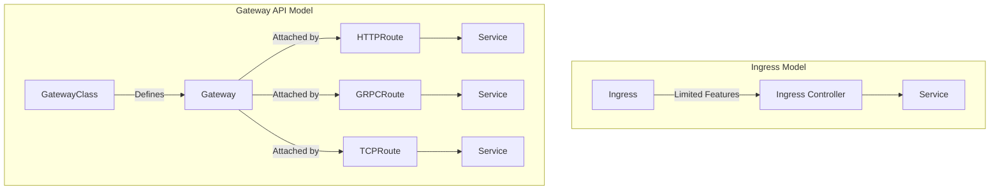

# How to Implement Kubernetes Gateway API

Author: [nawazdhandala](https://www.github.com/nawazdhandala)

Tags: Kubernetes, Gateway API, Ingress, Traffic Management, HTTPRoute, Load Balancing, Networking

Description: Learn how to implement the Kubernetes Gateway API, the modern successor to Ingress, with support for advanced routing, traffic splitting, and cross-namespace references.

---

The Gateway API is the next generation of Kubernetes Ingress, offering a more expressive, extensible, and role-oriented approach to managing cluster traffic. It addresses limitations of the Ingress API while maintaining simplicity for basic use cases.

## Gateway API vs Ingress



| Feature | Ingress | Gateway API |
|---------|---------|-------------|
| Multi-tenancy | Limited | Built-in |
| Protocol support | HTTP/HTTPS only | HTTP, HTTPS, gRPC, TCP, UDP |
| Traffic splitting | Annotations | Native |
| Header manipulation | Annotations | Native |
| Cross-namespace | Not supported | Supported |
| Extensibility | Annotations | CRDs |
| Role separation | None | Clear roles |

## Install Gateway API CRDs

```bash
# Install standard Gateway API CRDs
kubectl apply -f https://github.com/kubernetes-sigs/gateway-api/releases/download/v1.0.0/standard-install.yaml

# For experimental features (GRPCRoute, TCPRoute, etc.)
kubectl apply -f https://github.com/kubernetes-sigs/gateway-api/releases/download/v1.0.0/experimental-install.yaml

# Verify installation
kubectl get crds | grep gateway
```

## Choose a Gateway Controller

### Option 1: Envoy Gateway

```bash
# Install Envoy Gateway
helm install eg oci://docker.io/envoyproxy/gateway-helm \
  --version v1.0.0 \
  --namespace envoy-gateway-system \
  --create-namespace

# Verify
kubectl get pods -n envoy-gateway-system
```

### Option 2: NGINX Gateway Fabric

```bash
# Install NGINX Gateway Fabric
kubectl apply -f https://github.com/nginxinc/nginx-gateway-fabric/releases/download/v1.1.0/crds.yaml
kubectl apply -f https://github.com/nginxinc/nginx-gateway-fabric/releases/download/v1.1.0/nginx-gateway.yaml

# Verify
kubectl get pods -n nginx-gateway
```

### Option 3: Istio Gateway

```bash
# Istio already supports Gateway API
# Just enable it in your Istio installation
istioctl install --set profile=default --set values.pilot.env.PILOT_ENABLE_GATEWAY_API=true
```

## Core Concepts

### GatewayClass

```yaml
# gateway-class.yaml
apiVersion: gateway.networking.k8s.io/v1
kind: GatewayClass
metadata:
  name: envoy-gateway
spec:
  controllerName: gateway.envoyproxy.io/gatewayclass-controller
  description: "Envoy Gateway controller"
  parametersRef:
    group: gateway.envoyproxy.io
    kind: EnvoyProxy
    name: custom-proxy-config
    namespace: envoy-gateway-system
```

### Gateway

```yaml
# gateway.yaml
apiVersion: gateway.networking.k8s.io/v1
kind: Gateway
metadata:
  name: main-gateway
  namespace: gateway-system
spec:
  gatewayClassName: envoy-gateway
  
  listeners:
    # HTTP listener
    - name: http
      port: 80
      protocol: HTTP
      hostname: "*.example.com"
      allowedRoutes:
        namespaces:
          from: All  # Allow routes from all namespaces
    
    # HTTPS listener
    - name: https
      port: 443
      protocol: HTTPS
      hostname: "*.example.com"
      tls:
        mode: Terminate
        certificateRefs:
          - name: wildcard-tls
            namespace: gateway-system
      allowedRoutes:
        namespaces:
          from: Selector
          selector:
            matchLabels:
              gateway-access: "true"
    
    # Specific host listener
    - name: api
      port: 443
      protocol: HTTPS
      hostname: api.example.com
      tls:
        mode: Terminate
        certificateRefs:
          - name: api-tls
      allowedRoutes:
        namespaces:
          from: Same
```

### HTTPRoute

```yaml
# httproute-basic.yaml
apiVersion: gateway.networking.k8s.io/v1
kind: HTTPRoute
metadata:
  name: myapp-route
  namespace: production
spec:
  parentRefs:
    - name: main-gateway
      namespace: gateway-system
      sectionName: https  # Attach to specific listener
  
  hostnames:
    - myapp.example.com
  
  rules:
    # Simple path routing
    - matches:
        - path:
            type: PathPrefix
            value: /api
      backendRefs:
        - name: api-service
          port: 80
    
    # Default route
    - matches:
        - path:
            type: PathPrefix
            value: /
      backendRefs:
        - name: frontend-service
          port: 80
```

## Advanced HTTPRoute Features

### Header-Based Routing

```yaml
# httproute-headers.yaml
apiVersion: gateway.networking.k8s.io/v1
kind: HTTPRoute
metadata:
  name: header-routing
  namespace: production
spec:
  parentRefs:
    - name: main-gateway
      namespace: gateway-system
  
  hostnames:
    - api.example.com
  
  rules:
    # Route based on header value
    - matches:
        - headers:
            - name: X-Version
              value: v2
      backendRefs:
        - name: api-v2
          port: 80
    
    # Route based on header presence
    - matches:
        - headers:
            - name: X-Beta-User
              type: Exact
              value: "true"
      backendRefs:
        - name: api-beta
          port: 80
    
    # Default route
    - backendRefs:
        - name: api-v1
          port: 80
```

### Query Parameter Routing

```yaml
# httproute-query.yaml
apiVersion: gateway.networking.k8s.io/v1
kind: HTTPRoute
metadata:
  name: query-routing
  namespace: production
spec:
  parentRefs:
    - name: main-gateway
      namespace: gateway-system
  
  hostnames:
    - api.example.com
  
  rules:
    - matches:
        - queryParams:
            - name: version
              value: "2"
      backendRefs:
        - name: api-v2
          port: 80
    
    - backendRefs:
        - name: api-v1
          port: 80
```

### Traffic Splitting (Canary)

```yaml
# httproute-canary.yaml
apiVersion: gateway.networking.k8s.io/v1
kind: HTTPRoute
metadata:
  name: canary-release
  namespace: production
spec:
  parentRefs:
    - name: main-gateway
      namespace: gateway-system
  
  hostnames:
    - api.example.com
  
  rules:
    - backendRefs:
        # 90% to stable
        - name: api-stable
          port: 80
          weight: 90
        # 10% to canary
        - name: api-canary
          port: 80
          weight: 10
```

### Request/Response Modification

```yaml
# httproute-filters.yaml
apiVersion: gateway.networking.k8s.io/v1
kind: HTTPRoute
metadata:
  name: filter-example
  namespace: production
spec:
  parentRefs:
    - name: main-gateway
      namespace: gateway-system
  
  hostnames:
    - api.example.com
  
  rules:
    - matches:
        - path:
            type: PathPrefix
            value: /api
      filters:
        # Add request headers
        - type: RequestHeaderModifier
          requestHeaderModifier:
            add:
              - name: X-Request-ID
                value: "generated-id"
              - name: X-Forwarded-Service
                value: api-gateway
            set:
              - name: Host
                value: internal-api.example.com
            remove:
              - X-Internal-Header
        
        # Add response headers
        - type: ResponseHeaderModifier
          responseHeaderModifier:
            add:
              - name: X-Response-Time
                value: "from-gateway"
            set:
              - name: Cache-Control
                value: "no-cache"
        
        # URL rewrite
        - type: URLRewrite
          urlRewrite:
            hostname: internal-api.svc.cluster.local
            path:
              type: ReplacePrefixMatch
              replacePrefixMatch: /v1
      
      backendRefs:
        - name: api-service
          port: 80
```

### Redirect

```yaml
# httproute-redirect.yaml
apiVersion: gateway.networking.k8s.io/v1
kind: HTTPRoute
metadata:
  name: redirect-example
  namespace: production
spec:
  parentRefs:
    - name: main-gateway
      namespace: gateway-system
  
  hostnames:
    - old.example.com
  
  rules:
    # Redirect to new domain
    - filters:
        - type: RequestRedirect
          requestRedirect:
            hostname: new.example.com
            statusCode: 301
    
    # Redirect HTTP to HTTPS
    - matches:
        - path:
            type: PathPrefix
            value: /
      filters:
        - type: RequestRedirect
          requestRedirect:
            scheme: https
            statusCode: 301
```

## GRPCRoute

```yaml
# grpcroute.yaml
apiVersion: gateway.networking.k8s.io/v1alpha2
kind: GRPCRoute
metadata:
  name: grpc-api
  namespace: production
spec:
  parentRefs:
    - name: main-gateway
      namespace: gateway-system
  
  hostnames:
    - grpc.example.com
  
  rules:
    # Route by service name
    - matches:
        - method:
            service: mypackage.UserService
      backendRefs:
        - name: user-service
          port: 50051
    
    # Route by specific method
    - matches:
        - method:
            service: mypackage.OrderService
            method: CreateOrder
      backendRefs:
        - name: order-service
          port: 50051
    
    # Default route
    - backendRefs:
        - name: grpc-default
          port: 50051
```

## TCPRoute and UDPRoute

```yaml
# tcproute.yaml
apiVersion: gateway.networking.k8s.io/v1alpha2
kind: TCPRoute
metadata:
  name: database-route
  namespace: database
spec:
  parentRefs:
    - name: tcp-gateway
      namespace: gateway-system
      sectionName: postgres
  
  rules:
    - backendRefs:
        - name: postgres
          port: 5432
---
# udproute.yaml
apiVersion: gateway.networking.k8s.io/v1alpha2
kind: UDPRoute
metadata:
  name: dns-route
  namespace: dns
spec:
  parentRefs:
    - name: udp-gateway
      namespace: gateway-system
  
  rules:
    - backendRefs:
        - name: coredns
          port: 53
```

## TLSRoute (Passthrough)

```yaml
# tlsroute.yaml
apiVersion: gateway.networking.k8s.io/v1alpha2
kind: TLSRoute
metadata:
  name: tls-passthrough
  namespace: production
spec:
  parentRefs:
    - name: main-gateway
      namespace: gateway-system
      sectionName: tls-passthrough
  
  hostnames:
    - secure.example.com
  
  rules:
    - backendRefs:
        - name: tls-backend
          port: 443
```

## Cross-Namespace References

### Allow References from Other Namespaces

```yaml
# reference-grant.yaml
apiVersion: gateway.networking.k8s.io/v1beta1
kind: ReferenceGrant
metadata:
  name: allow-production-routes
  namespace: gateway-system
spec:
  from:
    - group: gateway.networking.k8s.io
      kind: HTTPRoute
      namespace: production
    - group: gateway.networking.k8s.io
      kind: HTTPRoute
      namespace: staging
  to:
    - group: ""
      kind: Secret
      name: wildcard-tls
---
# Allow backend references
apiVersion: gateway.networking.k8s.io/v1beta1
kind: ReferenceGrant
metadata:
  name: allow-gateway-to-backends
  namespace: production
spec:
  from:
    - group: gateway.networking.k8s.io
      kind: HTTPRoute
      namespace: gateway-system
  to:
    - group: ""
      kind: Service
```

## Backend Policies

### Backend TLS Policy

```yaml
# backend-tls-policy.yaml
apiVersion: gateway.networking.k8s.io/v1alpha2
kind: BackendTLSPolicy
metadata:
  name: backend-tls
  namespace: production
spec:
  targetRef:
    group: ""
    kind: Service
    name: secure-backend
  tls:
    caCertRefs:
      - name: backend-ca
        group: ""
        kind: Secret
    hostname: secure-backend.production.svc.cluster.local
```

## Complete Example

```yaml
# complete-gateway-setup.yaml
---
# Gateway
apiVersion: gateway.networking.k8s.io/v1
kind: Gateway
metadata:
  name: production-gateway
  namespace: gateway-system
  annotations:
    cert-manager.io/cluster-issuer: letsencrypt-prod
spec:
  gatewayClassName: envoy-gateway
  listeners:
    - name: http
      port: 80
      protocol: HTTP
      hostname: "*.example.com"
      allowedRoutes:
        namespaces:
          from: All
    - name: https
      port: 443
      protocol: HTTPS
      hostname: "*.example.com"
      tls:
        mode: Terminate
        certificateRefs:
          - name: wildcard-example-com
      allowedRoutes:
        namespaces:
          from: All
---
# Frontend HTTPRoute
apiVersion: gateway.networking.k8s.io/v1
kind: HTTPRoute
metadata:
  name: frontend
  namespace: production
spec:
  parentRefs:
    - name: production-gateway
      namespace: gateway-system
  hostnames:
    - www.example.com
    - example.com
  rules:
    - matches:
        - path:
            type: PathPrefix
            value: /
      backendRefs:
        - name: frontend
          port: 80
---
# API HTTPRoute with versioning
apiVersion: gateway.networking.k8s.io/v1
kind: HTTPRoute
metadata:
  name: api
  namespace: production
spec:
  parentRefs:
    - name: production-gateway
      namespace: gateway-system
  hostnames:
    - api.example.com
  rules:
    # v2 API (canary)
    - matches:
        - path:
            type: PathPrefix
            value: /v2
      backendRefs:
        - name: api-v2
          port: 80
    
    # v1 API with traffic split
    - matches:
        - path:
            type: PathPrefix
            value: /v1
      backendRefs:
        - name: api-v1-stable
          port: 80
          weight: 95
        - name: api-v1-canary
          port: 80
          weight: 5
    
    # Default to v1
    - matches:
        - path:
            type: PathPrefix
            value: /
      filters:
        - type: URLRewrite
          urlRewrite:
            path:
              type: ReplacePrefixMatch
              replacePrefixMatch: /v1
      backendRefs:
        - name: api-v1-stable
          port: 80
---
# Health check endpoint
apiVersion: gateway.networking.k8s.io/v1
kind: HTTPRoute
metadata:
  name: health
  namespace: gateway-system
spec:
  parentRefs:
    - name: production-gateway
  hostnames:
    - "*.example.com"
  rules:
    - matches:
        - path:
            type: Exact
            value: /healthz
      backendRefs:
        - name: health-service
          port: 80
```

## Monitoring Gateway API

```yaml
# gateway-metrics-service.yaml
apiVersion: monitoring.coreos.com/v1
kind: ServiceMonitor
metadata:
  name: gateway-metrics
  namespace: monitoring
spec:
  selector:
    matchLabels:
      app: envoy-gateway
  endpoints:
    - port: metrics
      interval: 30s
```

### Key Metrics

```promql
# Request rate by route
sum by (route_name) (rate(envoy_http_downstream_rq_total[5m]))

# Error rate
sum(rate(envoy_http_downstream_rq_xx{envoy_response_code_class="5"}[5m]))
/ sum(rate(envoy_http_downstream_rq_total[5m]))

# Latency
histogram_quantile(0.99, sum(rate(envoy_http_downstream_rq_time_bucket[5m])) by (le))
```

## Summary

| Resource | Purpose | Stable |
|----------|---------|--------|
| GatewayClass | Define controller type | ✅ v1 |
| Gateway | Configure listeners | ✅ v1 |
| HTTPRoute | HTTP/HTTPS routing | ✅ v1 |
| GRPCRoute | gRPC routing | ⚠️ v1alpha2 |
| TCPRoute | TCP routing | ⚠️ v1alpha2 |
| TLSRoute | TLS passthrough | ⚠️ v1alpha2 |
| ReferenceGrant | Cross-namespace refs | ✅ v1beta1 |

## Related Posts

- [How to Set Up gRPC Load Balancing in Kubernetes](https://oneuptime.com/blog/post/2026-01-19-kubernetes-grpc-load-balancing/view) - gRPC with Gateway API
- [How to Set Up Kubernetes External DNS for Automatic DNS Records](https://oneuptime.com/blog/post/2026-01-19-kubernetes-external-dns-automatic-records/view) - DNS automation with Gateway
- [How to Set Up TLS Certificates with cert-manager in Kubernetes](https://oneuptime.com/blog/post/2026-01-19-kubernetes-cert-manager-tls-certificates/view) - TLS for Gateway
