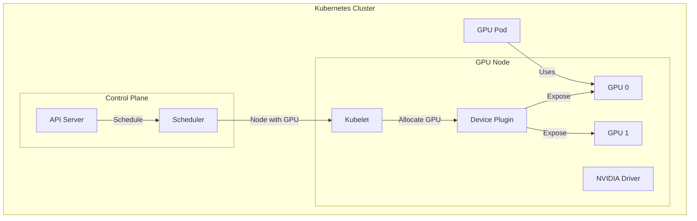

# How to Schedule GPU Workloads in Kubernetes

Author: [nawazdhandala](https://www.github.com/nawazdhandala)

Tags: Kubernetes, GPU, NVIDIA, Machine Learning, Deep Learning, Scheduling, DevOps

Description: Learn how to configure Kubernetes for GPU workloads including NVIDIA device plugin setup, resource requests, time-slicing, MIG, and best practices for ML/AI applications.

---

GPU workloads in Kubernetes require special configuration—device plugins, resource requests, and scheduling considerations. This guide covers everything from basic GPU scheduling to advanced features like GPU sharing and Multi-Instance GPU (MIG).

## GPU Architecture in Kubernetes



| Component | Purpose |
|-----------|---------|
| NVIDIA Driver | Hardware interface |
| Device Plugin | Advertise GPUs to Kubernetes |
| Container Runtime | GPU passthrough |
| Scheduler | Allocate GPUs to pods |

## Prerequisites

### Node Setup

```bash
# Check NVIDIA driver installation
nvidia-smi

# Verify driver version
cat /proc/driver/nvidia/version

# Check CUDA version
nvcc --version
```

### Install NVIDIA Container Toolkit

```bash
# Add repository
distribution=$(. /etc/os-release;echo $ID$VERSION_ID)
curl -s -L https://nvidia.github.io/libnvidia-container/gpgkey | sudo apt-key add -
curl -s -L https://nvidia.github.io/libnvidia-container/$distribution/libnvidia-container.list | \
  sudo tee /etc/apt/sources.list.d/nvidia-container-toolkit.list

# Install toolkit
sudo apt-get update
sudo apt-get install -y nvidia-container-toolkit

# Configure containerd
sudo nvidia-ctk runtime configure --runtime=containerd
sudo systemctl restart containerd
```

## Deploy NVIDIA Device Plugin

### Using Helm

```bash
# Add NVIDIA Helm repository
helm repo add nvdp https://nvidia.github.io/k8s-device-plugin
helm repo update

# Install device plugin
helm install nvidia-device-plugin nvdp/nvidia-device-plugin \
  --namespace nvidia-device-plugin \
  --create-namespace \
  --set gfd.enabled=true
```

### Using DaemonSet

```yaml
# nvidia-device-plugin.yaml
apiVersion: apps/v1
kind: DaemonSet
metadata:
  name: nvidia-device-plugin-daemonset
  namespace: kube-system
spec:
  selector:
    matchLabels:
      name: nvidia-device-plugin-ds
  updateStrategy:
    type: RollingUpdate
  template:
    metadata:
      labels:
        name: nvidia-device-plugin-ds
    spec:
      tolerations:
        - key: nvidia.com/gpu
          operator: Exists
          effect: NoSchedule
      priorityClassName: system-node-critical
      containers:
        - name: nvidia-device-plugin-ctr
          image: nvcr.io/nvidia/k8s-device-plugin:v0.14.3
          securityContext:
            allowPrivilegeEscalation: false
            capabilities:
              drop: ["ALL"]
          volumeMounts:
            - name: device-plugin
              mountPath: /var/lib/kubelet/device-plugins
      volumes:
        - name: device-plugin
          hostPath:
            path: /var/lib/kubelet/device-plugins
      nodeSelector:
        accelerator: nvidia-gpu
```

### Verify Installation

```bash
# Check device plugin pods
kubectl get pods -n kube-system -l name=nvidia-device-plugin-ds

# Verify GPUs are advertised
kubectl get nodes -o json | jq '.items[].status.capacity["nvidia.com/gpu"]'

# Detailed node capacity
kubectl describe node <gpu-node-name> | grep -A 10 "Capacity:"
```

## Basic GPU Pod

### Request Single GPU

```yaml
# single-gpu-pod.yaml
apiVersion: v1
kind: Pod
metadata:
  name: gpu-pod
spec:
  containers:
    - name: cuda-container
      image: nvcr.io/nvidia/cuda:12.2.0-base-ubuntu22.04
      command: ["nvidia-smi", "-L"]
      resources:
        limits:
          nvidia.com/gpu: 1
  restartPolicy: Never
```

### Request Multiple GPUs

```yaml
# multi-gpu-pod.yaml
apiVersion: v1
kind: Pod
metadata:
  name: multi-gpu-pod
spec:
  containers:
    - name: cuda-container
      image: nvcr.io/nvidia/cuda:12.2.0-base-ubuntu22.04
      command: ["sleep", "infinity"]
      resources:
        limits:
          nvidia.com/gpu: 4  # Request 4 GPUs
```

## GPU Deployment Patterns

### Machine Learning Training

```yaml
# ml-training-job.yaml
apiVersion: batch/v1
kind: Job
metadata:
  name: pytorch-training
spec:
  parallelism: 1
  completions: 1
  template:
    metadata:
      labels:
        app: pytorch-training
    spec:
      containers:
        - name: pytorch
          image: pytorch/pytorch:2.1.0-cuda12.1-cudnn8-runtime
          command:
            - python
            - -c
            - |
              import torch
              print(f"CUDA available: {torch.cuda.is_available()}")
              print(f"GPU count: {torch.cuda.device_count()}")
              for i in range(torch.cuda.device_count()):
                  print(f"GPU {i}: {torch.cuda.get_device_name(i)}")
              # Your training code here
          resources:
            limits:
              nvidia.com/gpu: 1
              memory: 32Gi
              cpu: "8"
            requests:
              memory: 16Gi
              cpu: "4"
          volumeMounts:
            - name: data
              mountPath: /data
            - name: models
              mountPath: /models
            - name: shm
              mountPath: /dev/shm
      volumes:
        - name: data
          persistentVolumeClaim:
            claimName: training-data
        - name: models
          persistentVolumeClaim:
            claimName: model-storage
        # Shared memory for PyTorch DataLoader
        - name: shm
          emptyDir:
            medium: Memory
            sizeLimit: 16Gi
      restartPolicy: Never
  backoffLimit: 3
```

### Inference Deployment

```yaml
# inference-deployment.yaml
apiVersion: apps/v1
kind: Deployment
metadata:
  name: ml-inference
spec:
  replicas: 3
  selector:
    matchLabels:
      app: ml-inference
  template:
    metadata:
      labels:
        app: ml-inference
    spec:
      containers:
        - name: inference
          image: myregistry/ml-inference:v1.0.0
          ports:
            - containerPort: 8080
          resources:
            limits:
              nvidia.com/gpu: 1
              memory: 16Gi
            requests:
              memory: 8Gi
              cpu: "2"
          env:
            - name: CUDA_VISIBLE_DEVICES
              value: "0"
            - name: MODEL_PATH
              value: /models/latest
          volumeMounts:
            - name: models
              mountPath: /models
              readOnly: true
          readinessProbe:
            httpGet:
              path: /health
              port: 8080
            initialDelaySeconds: 30
            periodSeconds: 10
          livenessProbe:
            httpGet:
              path: /health
              port: 8080
            initialDelaySeconds: 60
            periodSeconds: 30
      volumes:
        - name: models
          persistentVolumeClaim:
            claimName: model-storage
            readOnly: true
      # Spread inference pods across GPU nodes
      topologySpreadConstraints:
        - maxSkew: 1
          topologyKey: kubernetes.io/hostname
          whenUnsatisfiable: ScheduleAnyway
          labelSelector:
            matchLabels:
              app: ml-inference
---
apiVersion: v1
kind: Service
metadata:
  name: ml-inference
spec:
  ports:
    - port: 80
      targetPort: 8080
  selector:
    app: ml-inference
```

## GPU Time-Slicing

### Configure Time-Slicing

```yaml
# time-slicing-config.yaml
apiVersion: v1
kind: ConfigMap
metadata:
  name: time-slicing-config
  namespace: nvidia-device-plugin
data:
  any: |-
    version: v1
    sharing:
      timeSlicing:
        renameByDefault: false
        resources:
        - name: nvidia.com/gpu
          replicas: 4  # Allow 4 pods to share each GPU
```

### Deploy with Time-Slicing

```bash
# Upgrade device plugin with time-slicing
helm upgrade nvidia-device-plugin nvdp/nvidia-device-plugin \
  --namespace nvidia-device-plugin \
  --set config.name=time-slicing-config \
  --set gfd.enabled=true
```

### Use Time-Sliced GPU

```yaml
# time-sliced-pod.yaml
apiVersion: v1
kind: Pod
metadata:
  name: time-sliced-gpu-pod
spec:
  containers:
    - name: cuda-container
      image: nvcr.io/nvidia/cuda:12.2.0-base-ubuntu22.04
      command: ["sleep", "infinity"]
      resources:
        limits:
          # Request a time-sliced GPU (1/4 of a GPU)
          nvidia.com/gpu: 1
```

## Multi-Instance GPU (MIG)

### Enable MIG Mode

```bash
# On the GPU node (requires driver reload)
sudo nvidia-smi -i 0 -mig 1
sudo reboot

# Create MIG instances (A100 example)
# 7 x 1g.5gb instances
sudo nvidia-smi mig -i 0 -cgi 19,19,19,19,19,19,19 -C

# Or 2 x 3g.20gb + 1 x 1g.5gb
sudo nvidia-smi mig -i 0 -cgi 9,9,19 -C
```

### MIG Device Plugin Config

```yaml
# mig-config.yaml
apiVersion: v1
kind: ConfigMap
metadata:
  name: mig-config
  namespace: nvidia-device-plugin
data:
  config.yaml: |
    version: v1
    flags:
      migStrategy: single  # or "mixed" for multiple profiles
    sharing:
      mig:
        resources:
        - name: nvidia.com/mig-1g.5gb
          rename: nvidia.com/gpu-1g5gb
        - name: nvidia.com/mig-3g.20gb
          rename: nvidia.com/gpu-3g20gb
```

### Request MIG Instance

```yaml
# mig-pod.yaml
apiVersion: v1
kind: Pod
metadata:
  name: mig-pod
spec:
  containers:
    - name: cuda-container
      image: nvcr.io/nvidia/cuda:12.2.0-base-ubuntu22.04
      command: ["nvidia-smi"]
      resources:
        limits:
          # Request specific MIG profile
          nvidia.com/mig-1g.5gb: 1
```

## Node Selection

### Select Specific GPU Type

```yaml
# specific-gpu-pod.yaml
apiVersion: v1
kind: Pod
metadata:
  name: a100-pod
spec:
  nodeSelector:
    nvidia.com/gpu.product: NVIDIA-A100-SXM4-40GB
  containers:
    - name: cuda
      image: nvcr.io/nvidia/cuda:12.2.0-base-ubuntu22.04
      resources:
        limits:
          nvidia.com/gpu: 1
```

### Use Node Affinity

```yaml
# gpu-affinity-pod.yaml
apiVersion: v1
kind: Pod
metadata:
  name: gpu-affinity-pod
spec:
  affinity:
    nodeAffinity:
      requiredDuringSchedulingIgnoredDuringExecution:
        nodeSelectorTerms:
          - matchExpressions:
              # NVIDIA GPU Feature Discovery labels
              - key: nvidia.com/gpu.memory
                operator: Gt
                values: ["16000"]  # >16GB VRAM
              - key: nvidia.com/gpu.compute.major
                operator: Gt
                values: ["7"]  # Compute capability 8.0+
  containers:
    - name: cuda
      image: nvcr.io/nvidia/cuda:12.2.0-base-ubuntu22.04
      resources:
        limits:
          nvidia.com/gpu: 1
```

### GPU Feature Discovery Labels

```bash
# Common GFD labels
nvidia.com/cuda.driver.major
nvidia.com/cuda.driver.minor
nvidia.com/cuda.runtime.major
nvidia.com/cuda.runtime.minor
nvidia.com/gpu.compute.major
nvidia.com/gpu.compute.minor
nvidia.com/gpu.count
nvidia.com/gpu.family
nvidia.com/gpu.machine
nvidia.com/gpu.memory
nvidia.com/gpu.product
```

## Monitoring GPU Usage

### Deploy DCGM Exporter

```yaml
# dcgm-exporter.yaml
apiVersion: apps/v1
kind: DaemonSet
metadata:
  name: dcgm-exporter
  namespace: monitoring
spec:
  selector:
    matchLabels:
      app: dcgm-exporter
  template:
    metadata:
      labels:
        app: dcgm-exporter
    spec:
      containers:
        - name: dcgm-exporter
          image: nvcr.io/nvidia/k8s/dcgm-exporter:3.3.0-3.2.0-ubuntu22.04
          ports:
            - containerPort: 9400
              name: metrics
          securityContext:
            runAsNonRoot: false
            runAsUser: 0
          volumeMounts:
            - name: pod-resources
              mountPath: /var/lib/kubelet/pod-resources
              readOnly: true
      volumes:
        - name: pod-resources
          hostPath:
            path: /var/lib/kubelet/pod-resources
      nodeSelector:
        nvidia.com/gpu: "true"
---
apiVersion: v1
kind: Service
metadata:
  name: dcgm-exporter
  namespace: monitoring
  labels:
    app: dcgm-exporter
spec:
  ports:
    - port: 9400
      name: metrics
  selector:
    app: dcgm-exporter
```

### Prometheus ServiceMonitor

```yaml
# gpu-servicemonitor.yaml
apiVersion: monitoring.coreos.com/v1
kind: ServiceMonitor
metadata:
  name: dcgm-exporter
  namespace: monitoring
spec:
  selector:
    matchLabels:
      app: dcgm-exporter
  endpoints:
    - port: metrics
      interval: 15s
```

### GPU Metrics and Alerts

```yaml
# gpu-alerts.yaml
apiVersion: monitoring.coreos.com/v1
kind: PrometheusRule
metadata:
  name: gpu-alerts
  namespace: monitoring
spec:
  groups:
    - name: gpu
      rules:
        - alert: GPUHighMemoryUsage
          expr: DCGM_FI_DEV_FB_USED / DCGM_FI_DEV_FB_FREE > 0.9
          for: 5m
          labels:
            severity: warning
          annotations:
            summary: "GPU memory usage is high"
        
        - alert: GPUHighTemperature
          expr: DCGM_FI_DEV_GPU_TEMP > 85
          for: 5m
          labels:
            severity: critical
          annotations:
            summary: "GPU temperature is critical"
        
        - alert: GPUXidErrors
          expr: increase(DCGM_FI_DEV_XID_ERRORS[5m]) > 0
          labels:
            severity: warning
          annotations:
            summary: "GPU XID errors detected"
```

## Best Practices

### 1. Resource Management

```yaml
# Always set memory limits alongside GPU
resources:
  limits:
    nvidia.com/gpu: 1
    memory: 32Gi
  requests:
    memory: 16Gi
    cpu: "4"
```

### 2. Shared Memory for Deep Learning

```yaml
# DataLoader workers need shared memory
volumes:
  - name: shm
    emptyDir:
      medium: Memory
      sizeLimit: 16Gi
volumeMounts:
  - name: shm
    mountPath: /dev/shm
```

### 3. Taints and Tolerations

```bash
# Taint GPU nodes
kubectl taint nodes gpu-node-1 nvidia.com/gpu=true:NoSchedule
```

```yaml
# Only GPU pods can schedule
tolerations:
  - key: nvidia.com/gpu
    operator: Exists
    effect: NoSchedule
```

## Summary

| Feature | Use Case | Complexity |
|---------|----------|------------|
| Single GPU | Basic ML workloads | Low |
| Multi-GPU | Distributed training | Medium |
| Time-Slicing | GPU sharing for inference | Medium |
| MIG | Memory isolation | High |

## Related Posts

- [How to Set Up Kubernetes Topology Spread Constraints](https://oneuptime.com/blog/post/2026-01-19-kubernetes-topology-spread-constraints/view) - Pod distribution
- [How to Set Up Prometheus and Grafana on Kubernetes](https://oneuptime.com/blog/post/2026-01-19-kubernetes-prometheus-grafana-setup/view) - Monitoring setup
- [How to Configure Kubernetes Resource Requests and Limits](https://oneuptime.com/blog/post/2026-01-19-kubernetes-resource-requests-limits-rightsizing/view) - Resource management
