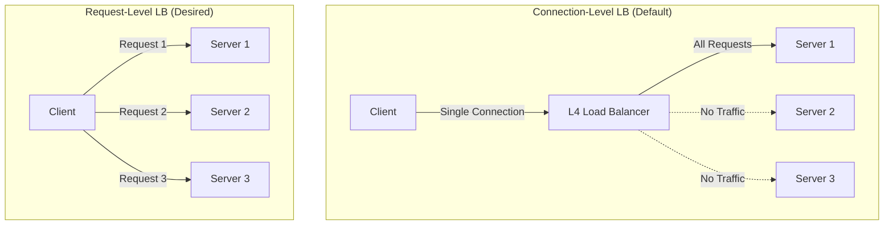

# How to Set Up gRPC Load Balancing in Kubernetes

Author: [nawazdhandala](https://www.github.com/nawazdhandala)

Tags: Kubernetes, gRPC, Load Balancing, Service Mesh, Ingress, Performance, Microservices

Description: Learn how to properly configure gRPC load balancing in Kubernetes using headless services, client-side balancing, service mesh, and ingress controllers.

---

gRPC uses HTTP/2 with persistent connections, which creates a challenge for traditional load balancing. A single HTTP/2 connection multiplexes many requests, so connection-level load balancing (default in Kubernetes) results in uneven traffic distribution. This guide covers proper gRPC load balancing strategies.

## The gRPC Load Balancing Problem



| Load Balancing Type | Level | gRPC Compatibility |
|--------------------|-------|-------------------|
| L4 (TCP/Connection) | Connection | ❌ Poor distribution |
| L7 (HTTP/2 aware) | Request | ✅ Even distribution |
| Client-side | Request | ✅ Even distribution |

## Solution 1: Headless Service with Client-Side LB

### Headless Service Configuration

```yaml
# grpc-headless-service.yaml
apiVersion: v1
kind: Service
metadata:
  name: grpc-server
  namespace: production
spec:
  clusterIP: None  # Headless service
  selector:
    app: grpc-server
  ports:
    - name: grpc
      port: 50051
      targetPort: 50051
---
apiVersion: apps/v1
kind: Deployment
metadata:
  name: grpc-server
  namespace: production
spec:
  replicas: 3
  selector:
    matchLabels:
      app: grpc-server
  template:
    metadata:
      labels:
        app: grpc-server
    spec:
      containers:
        - name: grpc-server
          image: myregistry/grpc-server:v1.0.0
          ports:
            - containerPort: 50051
          readinessProbe:
            grpc:
              port: 50051
            initialDelaySeconds: 5
            periodSeconds: 10
          livenessProbe:
            grpc:
              port: 50051
            initialDelaySeconds: 10
            periodSeconds: 20
```

### Go Client with Round-Robin Load Balancing

```go
// grpc-client/main.go
package main

import (
    "context"
    "log"
    "time"

    "google.golang.org/grpc"
    "google.golang.org/grpc/balancer/roundrobin"
    "google.golang.org/grpc/credentials/insecure"
    "google.golang.org/grpc/resolver"
    
    pb "myapp/proto"
)

func main() {
    // Use dns resolver with round-robin load balancer
    // Format: dns:///service-name.namespace.svc.cluster.local:port
    target := "dns:///grpc-server.production.svc.cluster.local:50051"
    
    conn, err := grpc.Dial(
        target,
        grpc.WithTransportCredentials(insecure.NewCredentials()),
        // Enable round-robin load balancing
        grpc.WithDefaultServiceConfig(`{"loadBalancingConfig": [{"round_robin":{}}]}`),
    )
    if err != nil {
        log.Fatalf("Failed to connect: %v", err)
    }
    defer conn.Close()
    
    client := pb.NewMyServiceClient(conn)
    
    // Make requests - will be distributed across servers
    for i := 0; i < 10; i++ {
        ctx, cancel := context.WithTimeout(context.Background(), time.Second)
        resp, err := client.SayHello(ctx, &pb.HelloRequest{Name: "World"})
        cancel()
        
        if err != nil {
            log.Printf("Request %d failed: %v", i, err)
            continue
        }
        log.Printf("Request %d: %s", i, resp.Message)
    }
}
```

### Python Client with Load Balancing

```python
# grpc_client.py
import grpc
from grpc import experimental

import myservice_pb2
import myservice_pb2_grpc

def main():
    # Enable round-robin load balancing
    options = [
        ('grpc.lb_policy_name', 'round_robin'),
        ('grpc.enable_retries', 1),
        ('grpc.service_config', '{"loadBalancingConfig": [{"round_robin":{}}]}'),
    ]
    
    # Use dns resolver
    target = 'dns:///grpc-server.production.svc.cluster.local:50051'
    
    channel = grpc.insecure_channel(target, options=options)
    stub = myservice_pb2_grpc.MyServiceStub(channel)
    
    # Make requests
    for i in range(10):
        response = stub.SayHello(myservice_pb2.HelloRequest(name='World'))
        print(f"Request {i}: {response.message}")
    
    channel.close()

if __name__ == '__main__':
    main()
```

## Solution 2: Service Mesh (Istio)

### Istio DestinationRule for gRPC

```yaml
# istio-grpc-destination-rule.yaml
apiVersion: networking.istio.io/v1beta1
kind: DestinationRule
metadata:
  name: grpc-server
  namespace: production
spec:
  host: grpc-server.production.svc.cluster.local
  trafficPolicy:
    connectionPool:
      tcp:
        maxConnections: 100
      http:
        h2UpgradePolicy: UPGRADE
        http2MaxRequests: 1000
        maxRequestsPerConnection: 100
    
    loadBalancer:
      simple: ROUND_ROBIN
      # Or use LEAST_REQUEST for better distribution
      # simple: LEAST_REQUEST
    
    outlierDetection:
      consecutive5xxErrors: 5
      interval: 30s
      baseEjectionTime: 30s
      maxEjectionPercent: 50
```

### Istio VirtualService for gRPC

```yaml
# istio-grpc-virtualservice.yaml
apiVersion: networking.istio.io/v1beta1
kind: VirtualService
metadata:
  name: grpc-server
  namespace: production
spec:
  hosts:
    - grpc-server.production.svc.cluster.local
  http:
    - match:
        - port: 50051
      route:
        - destination:
            host: grpc-server.production.svc.cluster.local
            port:
              number: 50051
      retries:
        attempts: 3
        perTryTimeout: 2s
        retryOn: "unavailable,resource-exhausted,internal"
      timeout: 10s
```

### Regular Service for Istio

```yaml
# grpc-service-istio.yaml
apiVersion: v1
kind: Service
metadata:
  name: grpc-server
  namespace: production
spec:
  # Use regular ClusterIP service with Istio
  type: ClusterIP
  selector:
    app: grpc-server
  ports:
    - name: grpc  # Important: name must indicate protocol
      port: 50051
      targetPort: 50051
      # Or use appProtocol
      appProtocol: grpc
```

## Solution 3: Linkerd Service Mesh

### Linkerd Configuration

```yaml
# linkerd-grpc-service.yaml
apiVersion: v1
kind: Service
metadata:
  name: grpc-server
  namespace: production
spec:
  type: ClusterIP
  selector:
    app: grpc-server
  ports:
    - name: grpc
      port: 50051
      targetPort: 50051
---
# Linkerd automatically handles gRPC load balancing
# Just inject the proxy
apiVersion: apps/v1
kind: Deployment
metadata:
  name: grpc-server
  namespace: production
  annotations:
    linkerd.io/inject: enabled
spec:
  replicas: 3
  selector:
    matchLabels:
      app: grpc-server
  template:
    metadata:
      labels:
        app: grpc-server
    spec:
      containers:
        - name: grpc-server
          image: myregistry/grpc-server:v1.0.0
          ports:
            - containerPort: 50051
```

### Linkerd Service Profile for gRPC

```yaml
# linkerd-service-profile.yaml
apiVersion: linkerd.io/v1alpha2
kind: ServiceProfile
metadata:
  name: grpc-server.production.svc.cluster.local
  namespace: production
spec:
  routes:
    - name: SayHello
      condition:
        method: POST
        pathRegex: /mypackage\.MyService/SayHello
      responseClasses:
        - condition:
            status:
              min: 200
              max: 299
          isFailure: false
    - name: GetUser
      condition:
        method: POST
        pathRegex: /mypackage\.MyService/GetUser
      responseClasses:
        - condition:
            status:
              min: 200
              max: 299
          isFailure: false
  retryBudget:
    retryRatio: 0.2
    minRetriesPerSecond: 10
    ttl: 10s
```

## Solution 4: Ingress Controller with gRPC Support

### NGINX Ingress for gRPC

```yaml
# nginx-grpc-ingress.yaml
apiVersion: networking.k8s.io/v1
kind: Ingress
metadata:
  name: grpc-server
  namespace: production
  annotations:
    nginx.ingress.kubernetes.io/backend-protocol: "GRPC"
    nginx.ingress.kubernetes.io/ssl-redirect: "true"
    # Enable gRPC-specific settings
    nginx.ingress.kubernetes.io/proxy-body-size: "0"
    nginx.ingress.kubernetes.io/proxy-read-timeout: "3600"
    nginx.ingress.kubernetes.io/proxy-send-timeout: "3600"
spec:
  ingressClassName: nginx
  tls:
    - hosts:
        - grpc.example.com
      secretName: grpc-tls
  rules:
    - host: grpc.example.com
      http:
        paths:
          - path: /
            pathType: Prefix
            backend:
              service:
                name: grpc-server
                port:
                  number: 50051
```

### Traefik IngressRoute for gRPC

```yaml
# traefik-grpc-ingressroute.yaml
apiVersion: traefik.containo.us/v1alpha1
kind: IngressRoute
metadata:
  name: grpc-server
  namespace: production
spec:
  entryPoints:
    - websecure
  routes:
    - match: Host(`grpc.example.com`)
      kind: Rule
      services:
        - name: grpc-server
          port: 50051
          scheme: h2c  # HTTP/2 cleartext
  tls:
    secretName: grpc-tls
---
# ServersTransport for gRPC backend
apiVersion: traefik.containo.us/v1alpha1
kind: ServersTransport
metadata:
  name: grpc-transport
  namespace: production
spec:
  serverName: grpc-server
  insecureSkipVerify: false
```

### Envoy Gateway for gRPC

```yaml
# envoy-gateway-grpc.yaml
apiVersion: gateway.networking.k8s.io/v1
kind: Gateway
metadata:
  name: grpc-gateway
  namespace: production
spec:
  gatewayClassName: envoy
  listeners:
    - name: grpc
      port: 443
      protocol: HTTPS
      hostname: grpc.example.com
      tls:
        mode: Terminate
        certificateRefs:
          - name: grpc-tls
---
apiVersion: gateway.networking.k8s.io/v1
kind: GRPCRoute
metadata:
  name: grpc-server-route
  namespace: production
spec:
  parentRefs:
    - name: grpc-gateway
  hostnames:
    - grpc.example.com
  rules:
    - matches:
        - method:
            service: mypackage.MyService
            method: SayHello
      backendRefs:
        - name: grpc-server
          port: 50051
    - matches:
        - method:
            service: mypackage.MyService
      backendRefs:
        - name: grpc-server
          port: 50051
```

## Solution 5: Custom gRPC-LB with xDS

### xDS-Based Load Balancing

```go
// xds-client/main.go
package main

import (
    "context"
    "log"
    "time"

    "google.golang.org/grpc"
    "google.golang.org/grpc/credentials/insecure"
    _ "google.golang.org/grpc/xds" // Import xDS resolver
    
    pb "myapp/proto"
)

func main() {
    // Use xDS resolver
    // Requires GRPC_XDS_BOOTSTRAP environment variable
    target := "xds:///grpc-server.production.svc.cluster.local:50051"
    
    conn, err := grpc.Dial(
        target,
        grpc.WithTransportCredentials(insecure.NewCredentials()),
    )
    if err != nil {
        log.Fatalf("Failed to connect: %v", err)
    }
    defer conn.Close()
    
    client := pb.NewMyServiceClient(conn)
    
    // xDS provides advanced load balancing, health checking, etc.
    for i := 0; i < 10; i++ {
        ctx, cancel := context.WithTimeout(context.Background(), time.Second)
        resp, err := client.SayHello(ctx, &pb.HelloRequest{Name: "World"})
        cancel()
        
        if err != nil {
            log.Printf("Request %d failed: %v", i, err)
            continue
        }
        log.Printf("Request %d: %s", i, resp.Message)
    }
}
```

### xDS Bootstrap Configuration

```json
{
  "xds_servers": [
    {
      "server_uri": "xds-server.production.svc.cluster.local:18000",
      "channel_creds": [
        {
          "type": "insecure"
        }
      ],
      "server_features": ["xds_v3"]
    }
  ],
  "node": {
    "id": "grpc-client-1",
    "cluster": "grpc-clients",
    "locality": {
      "region": "us-west-2",
      "zone": "us-west-2a"
    }
  }
}
```

## Health Checking for gRPC

### gRPC Health Checking Protocol

```go
// server/health.go
package main

import (
    "google.golang.org/grpc/health"
    "google.golang.org/grpc/health/grpc_health_v1"
)

func setupHealthCheck(server *grpc.Server) {
    healthServer := health.NewServer()
    grpc_health_v1.RegisterHealthServer(server, healthServer)
    
    // Set service health status
    healthServer.SetServingStatus("mypackage.MyService", grpc_health_v1.HealthCheckResponse_SERVING)
}
```

### Kubernetes gRPC Probe

```yaml
# grpc-deployment-health.yaml
apiVersion: apps/v1
kind: Deployment
metadata:
  name: grpc-server
spec:
  template:
    spec:
      containers:
        - name: grpc-server
          image: myregistry/grpc-server:v1.0.0
          ports:
            - containerPort: 50051
          
          # Native gRPC health check (Kubernetes 1.24+)
          readinessProbe:
            grpc:
              port: 50051
              service: mypackage.MyService  # Optional: specific service
            initialDelaySeconds: 5
            periodSeconds: 10
          
          livenessProbe:
            grpc:
              port: 50051
            initialDelaySeconds: 10
            periodSeconds: 20
          
          startupProbe:
            grpc:
              port: 50051
            failureThreshold: 30
            periodSeconds: 10
```

## Monitoring gRPC Load Balancing

### Prometheus Metrics

```go
// Enable gRPC Prometheus metrics
import (
    grpc_prometheus "github.com/grpc-ecosystem/go-grpc-prometheus"
)

func main() {
    // Server side
    grpcServer := grpc.NewServer(
        grpc.StreamInterceptor(grpc_prometheus.StreamServerInterceptor),
        grpc.UnaryInterceptor(grpc_prometheus.UnaryServerInterceptor),
    )
    grpc_prometheus.Register(grpcServer)
    
    // Client side
    conn, _ := grpc.Dial(
        target,
        grpc.WithUnaryInterceptor(grpc_prometheus.UnaryClientInterceptor),
        grpc.WithStreamInterceptor(grpc_prometheus.StreamClientInterceptor),
    )
}
```

### Key Metrics to Watch

```promql
# Request rate by server
sum by (grpc_server_method, instance) (rate(grpc_server_handled_total[5m]))

# Request distribution (should be even with proper LB)
stddev by (grpc_server_method) (rate(grpc_server_handled_total[5m]))
/ 
avg by (grpc_server_method) (rate(grpc_server_handled_total[5m]))

# Latency percentiles
histogram_quantile(0.99, sum(rate(grpc_server_handling_seconds_bucket[5m])) by (le, grpc_method))

# Error rate
sum(rate(grpc_server_handled_total{grpc_code!="OK"}[5m])) 
/ 
sum(rate(grpc_server_handled_total[5m]))
```

## Best Practices

### 1. Always Use Named Ports

```yaml
ports:
  - name: grpc  # Required for protocol detection
    port: 50051
    appProtocol: grpc  # Alternative for newer K8s
```

### 2. Implement Proper Health Checks

```yaml
# Use gRPC health check protocol
readinessProbe:
  grpc:
    port: 50051
```

### 3. Configure Retries

```yaml
# Istio retry config
retries:
  attempts: 3
  perTryTimeout: 2s
  retryOn: "unavailable,resource-exhausted"
```

### 4. Set Connection Limits

```yaml
# Prevent connection exhaustion
connectionPool:
  http:
    http2MaxRequests: 1000
    maxRequestsPerConnection: 100
```

## Summary

| Solution | Complexity | Features | Best For |
|----------|------------|----------|----------|
| Headless + Client LB | Low | Basic round-robin | Simple setups |
| Istio | Medium | Full L7 features | Production clusters |
| Linkerd | Medium | Automatic, simple | Ease of use |
| Ingress | Low | External access | Edge traffic |
| xDS | High | Advanced features | Complex requirements |

## Related Posts

- [How to Configure Kubernetes Service Topology for Locality-Aware Routing](https://oneuptime.com/blog/post/2026-01-19-kubernetes-service-topology-locality/view) - Local gRPC routing
- [How to Implement Kubernetes Gateway API](https://oneuptime.com/blog/post/2026-01-19-kubernetes-gateway-api-ingress-successor/view) - Modern gRPC routing
- [How to Set Up Istio Service Mesh on Kubernetes](https://oneuptime.com/blog/post/2026-01-19-kubernetes-istio-service-mesh-setup/view) - Full service mesh setup
