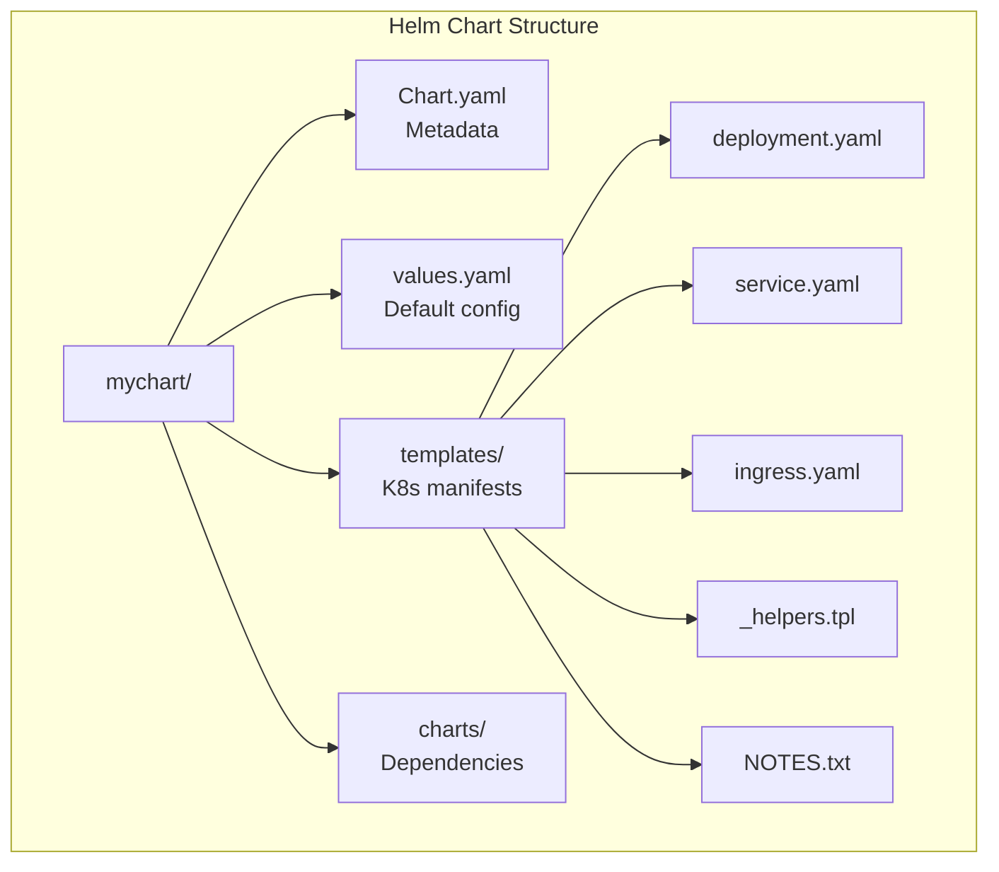

# How to Build Helm Charts from Scratch

Author: [nawazdhandala](https://www.github.com/nawazdhandala)

Tags: Kubernetes, Helm, Charts, Package Management, Templates, DevOps

Description: Learn how to create Helm charts from scratch with proper structure, templates, values, dependencies, and best practices for Kubernetes application deployment.

---

Helm is the package manager for Kubernetes, and creating custom Helm charts enables you to package, version, and deploy your applications consistently. This guide walks you through building production-ready Helm charts from the ground up.

## Helm Chart Structure



## Creating Your First Chart

### Initialize a New Chart

```bash
# Create a new chart
helm create myapp

# This creates the following structure:
# myapp/
# ├── Chart.yaml          # Chart metadata
# ├── values.yaml         # Default configuration
# ├── charts/             # Dependencies
# ├── templates/          # Template files
# │   ├── deployment.yaml
# │   ├── service.yaml
# │   ├── ingress.yaml
# │   ├── serviceaccount.yaml
# │   ├── hpa.yaml
# │   ├── _helpers.tpl    # Template helpers
# │   ├── NOTES.txt       # Post-install notes
# │   └── tests/
# │       └── test-connection.yaml
# └── .helmignore         # Files to ignore when packaging
```

### Chart.yaml - Chart Metadata

```yaml
# Chart.yaml
apiVersion: v2                    # Helm 3 uses v2
name: myapp
description: A Helm chart for MyApp - a sample web application
type: application                 # or 'library' for shared templates

# Version of the chart itself
version: 1.0.0

# Version of the application being deployed
appVersion: "2.1.0"

# Minimum Kubernetes version required
kubeVersion: ">=1.23.0"

# Chart dependencies
dependencies:
  - name: postgresql
    version: "12.x.x"
    repository: "https://charts.bitnami.com/bitnami"
    condition: postgresql.enabled

# Keywords for searching
keywords:
  - web
  - api
  - microservice

# Maintainer information
maintainers:
  - name: Platform Team
    email: platform@company.com
    url: https://company.com

# Source and documentation
home: https://github.com/company/myapp
sources:
  - https://github.com/company/myapp
icon: https://company.com/myapp-icon.png

# Annotations for additional metadata
annotations:
  artifacthub.io/changes: |
    - Added HPA support
    - Fixed ingress configuration
  artifacthub.io/license: Apache-2.0
```

### values.yaml - Default Configuration

```yaml
# values.yaml
# Replica configuration
replicaCount: 2

# Container image settings
image:
  repository: mycompany/myapp
  tag: ""                          # Defaults to appVersion
  pullPolicy: IfNotPresent

# Image pull secrets for private registries
imagePullSecrets: []
  # - name: my-registry-secret

# Override chart name
nameOverride: ""
fullnameOverride: ""

# Service account configuration
serviceAccount:
  create: true
  annotations: {}
  name: ""

# Pod annotations and labels
podAnnotations: {}
podLabels: {}

# Pod security context
podSecurityContext:
  fsGroup: 1000

# Container security context
securityContext:
  runAsNonRoot: true
  runAsUser: 1000
  readOnlyRootFilesystem: true
  allowPrivilegeEscalation: false
  capabilities:
    drop:
      - ALL

# Service configuration
service:
  type: ClusterIP
  port: 80
  targetPort: 8080
  annotations: {}

# Ingress configuration
ingress:
  enabled: false
  className: nginx
  annotations: {}
    # kubernetes.io/tls-acme: "true"
  hosts:
    - host: myapp.example.com
      paths:
        - path: /
          pathType: Prefix
  tls: []
    # - secretName: myapp-tls
    #   hosts:
    #     - myapp.example.com

# Resource limits and requests
resources:
  limits:
    cpu: 500m
    memory: 512Mi
  requests:
    cpu: 100m
    memory: 128Mi

# Liveness and readiness probes
livenessProbe:
  httpGet:
    path: /health
    port: http
  initialDelaySeconds: 30
  periodSeconds: 10
  timeoutSeconds: 5
  failureThreshold: 3

readinessProbe:
  httpGet:
    path: /ready
    port: http
  initialDelaySeconds: 5
  periodSeconds: 5
  timeoutSeconds: 3
  failureThreshold: 3

# Horizontal Pod Autoscaler
autoscaling:
  enabled: false
  minReplicas: 2
  maxReplicas: 10
  targetCPUUtilizationPercentage: 80
  targetMemoryUtilizationPercentage: 80

# Node selector
nodeSelector: {}

# Tolerations
tolerations: []

# Affinity rules
affinity: {}

# Environment variables
env: []
  # - name: LOG_LEVEL
  #   value: "info"

# Environment variables from secrets/configmaps
envFrom: []
  # - secretRef:
  #     name: myapp-secrets
  # - configMapRef:
  #     name: myapp-config

# ConfigMap data
config:
  LOG_LEVEL: "info"
  MAX_CONNECTIONS: "100"

# Secret data (will be base64 encoded)
secrets: {}
  # DATABASE_PASSWORD: "secret"

# Persistence configuration
persistence:
  enabled: false
  storageClass: ""
  accessMode: ReadWriteOnce
  size: 10Gi

# PostgreSQL dependency settings
postgresql:
  enabled: false
  auth:
    postgresPassword: ""
    database: myapp
```

## Template Files

### _helpers.tpl - Template Helpers

```yaml
# templates/_helpers.tpl
{{/*
Expand the name of the chart.
*/}}
{{- define "myapp.name" -}}
{{- default .Chart.Name .Values.nameOverride | trunc 63 | trimSuffix "-" }}
{{- end }}

{{/*
Create a default fully qualified app name.
We truncate at 63 chars because some Kubernetes name fields are limited to this.
*/}}
{{- define "myapp.fullname" -}}
{{- if .Values.fullnameOverride }}
{{- .Values.fullnameOverride | trunc 63 | trimSuffix "-" }}
{{- else }}
{{- $name := default .Chart.Name .Values.nameOverride }}
{{- if contains $name .Release.Name }}
{{- .Release.Name | trunc 63 | trimSuffix "-" }}
{{- else }}
{{- printf "%s-%s" .Release.Name $name | trunc 63 | trimSuffix "-" }}
{{- end }}
{{- end }}
{{- end }}

{{/*
Create chart name and version as used by the chart label.
*/}}
{{- define "myapp.chart" -}}
{{- printf "%s-%s" .Chart.Name .Chart.Version | replace "+" "_" | trunc 63 | trimSuffix "-" }}
{{- end }}

{{/*
Common labels
*/}}
{{- define "myapp.labels" -}}
helm.sh/chart: {{ include "myapp.chart" . }}
{{ include "myapp.selectorLabels" . }}
{{- if .Chart.AppVersion }}
app.kubernetes.io/version: {{ .Chart.AppVersion | quote }}
{{- end }}
app.kubernetes.io/managed-by: {{ .Release.Service }}
{{- end }}

{{/*
Selector labels
*/}}
{{- define "myapp.selectorLabels" -}}
app.kubernetes.io/name: {{ include "myapp.name" . }}
app.kubernetes.io/instance: {{ .Release.Name }}
{{- end }}

{{/*
Create the name of the service account to use
*/}}
{{- define "myapp.serviceAccountName" -}}
{{- if .Values.serviceAccount.create }}
{{- default (include "myapp.fullname" .) .Values.serviceAccount.name }}
{{- else }}
{{- default "default" .Values.serviceAccount.name }}
{{- end }}
{{- end }}

{{/*
Return the image name
*/}}
{{- define "myapp.image" -}}
{{- $tag := .Values.image.tag | default .Chart.AppVersion }}
{{- printf "%s:%s" .Values.image.repository $tag }}
{{- end }}
```

### deployment.yaml

```yaml
# templates/deployment.yaml
apiVersion: apps/v1
kind: Deployment
metadata:
  name: {{ include "myapp.fullname" . }}
  labels:
    {{- include "myapp.labels" . | nindent 4 }}
spec:
  {{- if not .Values.autoscaling.enabled }}
  replicas: {{ .Values.replicaCount }}
  {{- end }}
  selector:
    matchLabels:
      {{- include "myapp.selectorLabels" . | nindent 6 }}
  template:
    metadata:
      annotations:
        # Force rollout when configmap changes
        checksum/config: {{ include (print $.Template.BasePath "/configmap.yaml") . | sha256sum }}
        {{- with .Values.podAnnotations }}
        {{- toYaml . | nindent 8 }}
        {{- end }}
      labels:
        {{- include "myapp.labels" . | nindent 8 }}
        {{- with .Values.podLabels }}
        {{- toYaml . | nindent 8 }}
        {{- end }}
    spec:
      {{- with .Values.imagePullSecrets }}
      imagePullSecrets:
        {{- toYaml . | nindent 8 }}
      {{- end }}
      serviceAccountName: {{ include "myapp.serviceAccountName" . }}
      securityContext:
        {{- toYaml .Values.podSecurityContext | nindent 8 }}
      containers:
        - name: {{ .Chart.Name }}
          securityContext:
            {{- toYaml .Values.securityContext | nindent 12 }}
          image: {{ include "myapp.image" . }}
          imagePullPolicy: {{ .Values.image.pullPolicy }}
          ports:
            - name: http
              containerPort: {{ .Values.service.targetPort }}
              protocol: TCP
          {{- with .Values.livenessProbe }}
          livenessProbe:
            {{- toYaml . | nindent 12 }}
          {{- end }}
          {{- with .Values.readinessProbe }}
          readinessProbe:
            {{- toYaml . | nindent 12 }}
          {{- end }}
          resources:
            {{- toYaml .Values.resources | nindent 12 }}
          {{- with .Values.env }}
          env:
            {{- toYaml . | nindent 12 }}
          {{- end }}
          envFrom:
            - configMapRef:
                name: {{ include "myapp.fullname" . }}
            {{- if .Values.secrets }}
            - secretRef:
                name: {{ include "myapp.fullname" . }}
            {{- end }}
            {{- with .Values.envFrom }}
            {{- toYaml . | nindent 12 }}
            {{- end }}
          {{- if .Values.persistence.enabled }}
          volumeMounts:
            - name: data
              mountPath: /data
          {{- end }}
      {{- if .Values.persistence.enabled }}
      volumes:
        - name: data
          persistentVolumeClaim:
            claimName: {{ include "myapp.fullname" . }}
      {{- end }}
      {{- with .Values.nodeSelector }}
      nodeSelector:
        {{- toYaml . | nindent 8 }}
      {{- end }}
      {{- with .Values.affinity }}
      affinity:
        {{- toYaml . | nindent 8 }}
      {{- end }}
      {{- with .Values.tolerations }}
      tolerations:
        {{- toYaml . | nindent 8 }}
      {{- end }}
```

### service.yaml

```yaml
# templates/service.yaml
apiVersion: v1
kind: Service
metadata:
  name: {{ include "myapp.fullname" . }}
  labels:
    {{- include "myapp.labels" . | nindent 4 }}
  {{- with .Values.service.annotations }}
  annotations:
    {{- toYaml . | nindent 4 }}
  {{- end }}
spec:
  type: {{ .Values.service.type }}
  ports:
    - port: {{ .Values.service.port }}
      targetPort: http
      protocol: TCP
      name: http
  selector:
    {{- include "myapp.selectorLabels" . | nindent 4 }}
```

### ingress.yaml

```yaml
# templates/ingress.yaml
{{- if .Values.ingress.enabled -}}
apiVersion: networking.k8s.io/v1
kind: Ingress
metadata:
  name: {{ include "myapp.fullname" . }}
  labels:
    {{- include "myapp.labels" . | nindent 4 }}
  {{- with .Values.ingress.annotations }}
  annotations:
    {{- toYaml . | nindent 4 }}
  {{- end }}
spec:
  {{- if .Values.ingress.className }}
  ingressClassName: {{ .Values.ingress.className }}
  {{- end }}
  {{- if .Values.ingress.tls }}
  tls:
    {{- range .Values.ingress.tls }}
    - hosts:
        {{- range .hosts }}
        - {{ . | quote }}
        {{- end }}
      secretName: {{ .secretName }}
    {{- end }}
  {{- end }}
  rules:
    {{- range .Values.ingress.hosts }}
    - host: {{ .host | quote }}
      http:
        paths:
          {{- range .paths }}
          - path: {{ .path }}
            pathType: {{ .pathType }}
            backend:
              service:
                name: {{ include "myapp.fullname" $ }}
                port:
                  number: {{ $.Values.service.port }}
          {{- end }}
    {{- end }}
{{- end }}
```

### configmap.yaml

```yaml
# templates/configmap.yaml
apiVersion: v1
kind: ConfigMap
metadata:
  name: {{ include "myapp.fullname" . }}
  labels:
    {{- include "myapp.labels" . | nindent 4 }}
data:
  {{- range $key, $value := .Values.config }}
  {{ $key }}: {{ $value | quote }}
  {{- end }}
```

### secret.yaml

```yaml
# templates/secret.yaml
{{- if .Values.secrets }}
apiVersion: v1
kind: Secret
metadata:
  name: {{ include "myapp.fullname" . }}
  labels:
    {{- include "myapp.labels" . | nindent 4 }}
type: Opaque
data:
  {{- range $key, $value := .Values.secrets }}
  {{ $key }}: {{ $value | b64enc | quote }}
  {{- end }}
{{- end }}
```

### hpa.yaml

```yaml
# templates/hpa.yaml
{{- if .Values.autoscaling.enabled }}
apiVersion: autoscaling/v2
kind: HorizontalPodAutoscaler
metadata:
  name: {{ include "myapp.fullname" . }}
  labels:
    {{- include "myapp.labels" . | nindent 4 }}
spec:
  scaleTargetRef:
    apiVersion: apps/v1
    kind: Deployment
    name: {{ include "myapp.fullname" . }}
  minReplicas: {{ .Values.autoscaling.minReplicas }}
  maxReplicas: {{ .Values.autoscaling.maxReplicas }}
  metrics:
    {{- if .Values.autoscaling.targetCPUUtilizationPercentage }}
    - type: Resource
      resource:
        name: cpu
        target:
          type: Utilization
          averageUtilization: {{ .Values.autoscaling.targetCPUUtilizationPercentage }}
    {{- end }}
    {{- if .Values.autoscaling.targetMemoryUtilizationPercentage }}
    - type: Resource
      resource:
        name: memory
        target:
          type: Utilization
          averageUtilization: {{ .Values.autoscaling.targetMemoryUtilizationPercentage }}
    {{- end }}
{{- end }}
```

### NOTES.txt

```yaml
# templates/NOTES.txt
1. Get the application URL by running these commands:
{{- if .Values.ingress.enabled }}
{{- range $host := .Values.ingress.hosts }}
  http{{ if $.Values.ingress.tls }}s{{ end }}://{{ $host.host }}
{{- end }}
{{- else if contains "NodePort" .Values.service.type }}
  export NODE_PORT=$(kubectl get --namespace {{ .Release.Namespace }} -o jsonpath="{.spec.ports[0].nodePort}" services {{ include "myapp.fullname" . }})
  export NODE_IP=$(kubectl get nodes --namespace {{ .Release.Namespace }} -o jsonpath="{.items[0].status.addresses[0].address}")
  echo http://$NODE_IP:$NODE_PORT
{{- else if contains "LoadBalancer" .Values.service.type }}
  NOTE: It may take a few minutes for the LoadBalancer IP to be available.
  You can watch the status by running:
    kubectl get --namespace {{ .Release.Namespace }} svc -w {{ include "myapp.fullname" . }}
  export SERVICE_IP=$(kubectl get svc --namespace {{ .Release.Namespace }} {{ include "myapp.fullname" . }} -o jsonpath='{.status.loadBalancer.ingress[0].ip}')
  echo http://$SERVICE_IP:{{ .Values.service.port }}
{{- else if contains "ClusterIP" .Values.service.type }}
  export POD_NAME=$(kubectl get pods --namespace {{ .Release.Namespace }} -l "app.kubernetes.io/name={{ include "myapp.name" . }},app.kubernetes.io/instance={{ .Release.Name }}" -o jsonpath="{.items[0].metadata.name}")
  echo "Visit http://127.0.0.1:8080 to use your application"
  kubectl --namespace {{ .Release.Namespace }} port-forward $POD_NAME 8080:{{ .Values.service.targetPort }}
{{- end }}

2. Check deployment status:
  kubectl get pods -n {{ .Release.Namespace }} -l "app.kubernetes.io/instance={{ .Release.Name }}"
```

## Testing Charts

### Test Connection

```yaml
# templates/tests/test-connection.yaml
apiVersion: v1
kind: Pod
metadata:
  name: "{{ include "myapp.fullname" . }}-test-connection"
  labels:
    {{- include "myapp.labels" . | nindent 4 }}
  annotations:
    "helm.sh/hook": test
    "helm.sh/hook-delete-policy": hook-succeeded
spec:
  containers:
    - name: wget
      image: busybox
      command: ['wget']
      args: ['{{ include "myapp.fullname" . }}:{{ .Values.service.port }}']
  restartPolicy: Never
```

### Run Tests

```bash
# Install chart
helm install myapp ./myapp

# Run tests
helm test myapp

# Run tests with output
helm test myapp --logs
```

## Chart Development Commands

```bash
# Lint chart for errors
helm lint ./myapp

# Template locally (see generated YAML)
helm template myapp ./myapp

# Template with custom values
helm template myapp ./myapp -f custom-values.yaml

# Dry run install
helm install myapp ./myapp --dry-run --debug

# Package chart
helm package ./myapp

# Output: myapp-1.0.0.tgz

# Install from package
helm install myapp ./myapp-1.0.0.tgz
```

## Managing Dependencies

```bash
# Update dependencies (downloads to charts/ folder)
helm dependency update ./myapp

# List dependencies
helm dependency list ./myapp

# Build dependencies
helm dependency build ./myapp
```

## Publishing Charts

### Create a Chart Repository

```bash
# Package your chart
helm package ./myapp

# Generate index.yaml
helm repo index . --url https://charts.example.com

# Upload myapp-1.0.0.tgz and index.yaml to your web server/S3/GCS
```

### Using GitHub Pages

```bash
# Create gh-pages branch
git checkout --orphan gh-pages
rm -rf *

# Add packaged chart
helm package ../myapp
helm repo index . --url https://username.github.io/helm-charts

git add .
git commit -m "Add myapp chart"
git push origin gh-pages
```

## Best Practices

### 1. Use Schema Validation

```json
// values.schema.json
{
  "$schema": "https://json-schema.org/draft-07/schema#",
  "type": "object",
  "required": ["replicaCount", "image"],
  "properties": {
    "replicaCount": {
      "type": "integer",
      "minimum": 1,
      "maximum": 100
    },
    "image": {
      "type": "object",
      "required": ["repository"],
      "properties": {
        "repository": {
          "type": "string"
        },
        "tag": {
          "type": "string"
        }
      }
    }
  }
}
```

### 2. Document Values

```yaml
# values.yaml with comments
# -- Number of pod replicas
replicaCount: 2

image:
  # -- Container image repository
  repository: mycompany/myapp
  # -- Container image tag (defaults to .Chart.AppVersion)
  tag: ""
  # -- Image pull policy
  pullPolicy: IfNotPresent
```

### 3. Use Semantic Versioning

```yaml
# Chart.yaml
version: 1.2.3  # MAJOR.MINOR.PATCH
# MAJOR: Breaking changes
# MINOR: New features, backward compatible
# PATCH: Bug fixes
```

## Conclusion

Building Helm charts from scratch gives you complete control over Kubernetes deployments. Key takeaways:

1. **Follow the standard structure** - Chart.yaml, values.yaml, templates/
2. **Use helper templates** - DRY principle with _helpers.tpl
3. **Make everything configurable** - Use values.yaml extensively
4. **Test thoroughly** - Lint, template, dry-run before deploying
5. **Document your chart** - Comments, schema, NOTES.txt

For monitoring your Helm deployments, check out [OneUptime's Kubernetes monitoring](https://oneuptime.com/product/metrics).

## Related Resources

- [How to Set Up Flux CD for GitOps](https://oneuptime.com/blog/post/2026-01-19-kubernetes-flux-cd-gitops/view)
- [How to Set Up ArgoCD for GitOps](https://oneuptime.com/blog/post/2026-01-06-kubernetes-gitops-argocd/view)
- [How to Implement Blue-Green Deployments](https://oneuptime.com/blog/post/2025-11-28-what-are-blue-green-deployments/view)
