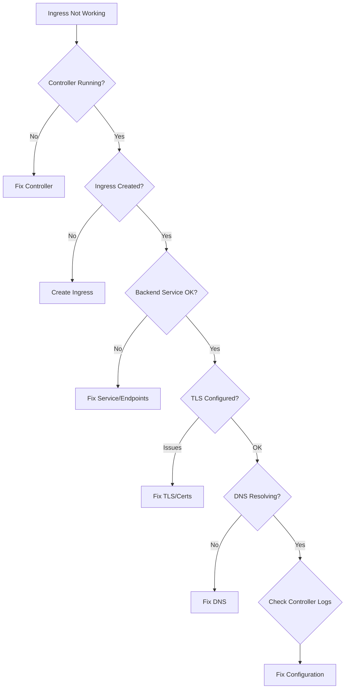

# How to Troubleshoot Kubernetes Ingress Not Working

Author: [nawazdhandala](https://www.github.com/nawazdhandala)

Tags: Kubernetes, Ingress, Troubleshooting, NGINX, Networking, TLS, DevOps

Description: Learn how to diagnose and fix Kubernetes Ingress issues including 404 errors, TLS problems, routing failures, and ingress controller configuration problems.

---

Kubernetes Ingress issues can stem from multiple sources: the ingress controller, ingress resources, backend services, TLS configuration, or DNS. This systematic guide helps you identify and fix the root cause.

## Troubleshooting Flow



## Step 1: Verify Ingress Controller

```bash
# Check if ingress controller is running
kubectl get pods -n ingress-nginx
# or for Traefik
kubectl get pods -n traefik

# Check controller logs
kubectl logs -n ingress-nginx -l app.kubernetes.io/component=controller --tail=100

# Check controller service
kubectl get svc -n ingress-nginx

# Output:
# NAME                       TYPE           CLUSTER-IP     EXTERNAL-IP     PORT(S)
# ingress-nginx-controller   LoadBalancer   10.96.100.1    203.0.113.10    80:30080/TCP,443:30443/TCP
```

### Fix: Install Ingress Controller

```bash
# Install NGINX Ingress Controller
kubectl apply -f https://raw.githubusercontent.com/kubernetes/ingress-nginx/controller-v1.9.4/deploy/static/provider/cloud/deploy.yaml

# Wait for controller to be ready
kubectl wait --namespace ingress-nginx \
  --for=condition=ready pod \
  --selector=app.kubernetes.io/component=controller \
  --timeout=120s
```

## Step 2: Check Ingress Resource

```bash
# List all ingresses
kubectl get ingress -A

# Check specific ingress
kubectl describe ingress myapp-ingress

# Look for:
# - Rules configuration
# - Backend service references
# - TLS configuration
# - Events showing errors

# Example output to examine:
# Rules:
#   Host        Path  Backends
#   ----        ----  --------
#   myapp.com   
#               /api    api-service:80 (10.244.1.5:8080,10.244.2.3:8080)
#               /       frontend-service:80 (10.244.1.6:3000)
```

### Common Ingress Issues

```yaml
# ingress.yaml - with common fixes annotated
apiVersion: networking.k8s.io/v1
kind: Ingress
metadata:
  name: myapp-ingress
  annotations:
    # Specify ingress class if multiple controllers exist
    kubernetes.io/ingress.class: nginx
    # Or use ingressClassName in spec (preferred)
    
    # Rewrite paths if needed
    nginx.ingress.kubernetes.io/rewrite-target: /$1
    
    # SSL redirect
    nginx.ingress.kubernetes.io/ssl-redirect: "true"
spec:
  ingressClassName: nginx  # Required in newer versions!
  
  tls:
    - hosts:
        - myapp.example.com
      secretName: myapp-tls  # Must exist!
  
  rules:
    - host: myapp.example.com  # Must match DNS
      http:
        paths:
          - path: /api(/|$)(.*)
            pathType: ImplementationSpecific  # or Prefix, Exact
            backend:
              service:
                name: api-service  # Must exist!
                port:
                  number: 80       # Must match service port!
```

## Step 3: Verify Backend Service

```bash
# Check service exists
kubectl get svc api-service

# Verify endpoints exist (critical!)
kubectl get endpoints api-service

# If endpoints empty, check:
# 1. Service selector matches pod labels
# 2. Pods are ready

kubectl describe svc api-service
kubectl get pods -l app=api --show-labels
```

### Test Backend Directly

```bash
# Port forward to service
kubectl port-forward svc/api-service 8080:80

# Test locally
curl http://localhost:8080/health

# Or from a debug pod
kubectl run debug --rm -it --image=busybox -- wget -O- http://api-service/health
```

## Step 4: Debug TLS Issues

```bash
# Check TLS secret exists
kubectl get secret myapp-tls

# Verify secret has correct keys
kubectl describe secret myapp-tls
# Should show:
# Data
# ====
# tls.crt:  1234 bytes
# tls.key:  1234 bytes

# Check certificate validity
kubectl get secret myapp-tls -o jsonpath='{.data.tls\.crt}' | base64 -d | openssl x509 -noout -dates

# Verify certificate matches hostname
kubectl get secret myapp-tls -o jsonpath='{.data.tls\.crt}' | base64 -d | openssl x509 -noout -subject -ext subjectAltName
```

### Fix: Create Valid TLS Secret

```bash
# Using cert-manager (recommended)
kubectl apply -f - <<EOF
apiVersion: cert-manager.io/v1
kind: Certificate
metadata:
  name: myapp-tls
spec:
  secretName: myapp-tls
  dnsNames:
    - myapp.example.com
  issuerRef:
    name: letsencrypt-prod
    kind: ClusterIssuer
EOF

# Or create manually
kubectl create secret tls myapp-tls \
  --cert=tls.crt \
  --key=tls.key
```

## Step 5: Check DNS Resolution

```bash
# Check external DNS
nslookup myapp.example.com
dig myapp.example.com

# Verify it resolves to ingress controller external IP
kubectl get svc -n ingress-nginx ingress-nginx-controller -o jsonpath='{.status.loadBalancer.ingress[0].ip}'

# For NodePort, check node IP
kubectl get nodes -o wide
```

## Step 6: Debug 404 Errors

```bash
# Check ingress controller logs
kubectl logs -n ingress-nginx -l app.kubernetes.io/component=controller | grep "404\|myapp"

# Verify path matching
# Test with different paths
curl -v http://myapp.example.com/api
curl -v http://myapp.example.com/api/
curl -v http://myapp.example.com/api/users

# Check nginx configuration
kubectl exec -n ingress-nginx deploy/ingress-nginx-controller -- cat /etc/nginx/nginx.conf | grep -A 20 "server_name myapp"
```

### Fix Path Issues

```yaml
# Path type matters!
spec:
  rules:
    - host: myapp.example.com
      http:
        paths:
          # Exact: only matches /api exactly
          - path: /api
            pathType: Exact
            backend: ...
          
          # Prefix: matches /api, /api/, /api/anything
          - path: /api
            pathType: Prefix
            backend: ...
          
          # ImplementationSpecific: uses controller's native matching
          - path: /api(/|$)(.*)
            pathType: ImplementationSpecific
            backend: ...
```

## Step 7: Debug 502/503 Errors

```bash
# 502 = backend returned invalid response
# 503 = no backend available

# Check if pods are ready
kubectl get pods -l app=api

# Check pod logs
kubectl logs -l app=api --tail=50

# Verify pod is listening on expected port
kubectl exec <pod-name> -- netstat -tlnp

# Check readiness probe
kubectl describe pod <pod-name> | grep -A 5 Readiness
```

### Fix: Adjust Timeouts and Buffers

```yaml
# ingress.yaml
metadata:
  annotations:
    # Increase timeouts for slow backends
    nginx.ingress.kubernetes.io/proxy-connect-timeout: "60"
    nginx.ingress.kubernetes.io/proxy-read-timeout: "60"
    nginx.ingress.kubernetes.io/proxy-send-timeout: "60"
    
    # Increase buffer sizes
    nginx.ingress.kubernetes.io/proxy-buffer-size: "128k"
    nginx.ingress.kubernetes.io/proxy-buffers-number: "4"
```

## Step 8: Debug Rate Limiting

```bash
# Check for 429 errors in logs
kubectl logs -n ingress-nginx -l app.kubernetes.io/component=controller | grep "429"

# Check rate limit annotations
kubectl get ingress myapp-ingress -o yaml | grep -i rate
```

### Fix: Adjust Rate Limits

```yaml
# ingress.yaml
metadata:
  annotations:
    # Rate limiting
    nginx.ingress.kubernetes.io/limit-connections: "10"
    nginx.ingress.kubernetes.io/limit-rps: "100"
    nginx.ingress.kubernetes.io/limit-rpm: "1000"
```

## Step 9: Check Ingress Class

```bash
# List ingress classes
kubectl get ingressclass

# Check default ingress class
kubectl get ingressclass -o jsonpath='{.items[?(@.metadata.annotations.ingressclass\.kubernetes\.io/is-default-class=="true")].metadata.name}'

# Verify ingress uses correct class
kubectl get ingress myapp-ingress -o jsonpath='{.spec.ingressClassName}'
```

### Fix: Set Ingress Class

```yaml
# ingress.yaml
spec:
  ingressClassName: nginx  # Must match your controller
```

## Step 10: Validate Full Path

```bash
# Complete connectivity test
# 1. Test DNS
host myapp.example.com

# 2. Test ingress controller directly
curl -v -H "Host: myapp.example.com" http://<ingress-controller-ip>/api

# 3. Test with TLS
curl -v https://myapp.example.com/api

# 4. Check response headers
curl -I https://myapp.example.com/api
```

## Quick Diagnosis Script

```bash
#!/bin/bash
# diagnose-ingress.sh

INGRESS=$1
NAMESPACE=${2:-default}

echo "=== Ingress Details ==="
kubectl get ingress $INGRESS -n $NAMESPACE -o yaml

echo -e "\n=== Ingress Events ==="
kubectl describe ingress $INGRESS -n $NAMESPACE | grep -A 20 "Events:"

echo -e "\n=== Backend Services ==="
for svc in $(kubectl get ingress $INGRESS -n $NAMESPACE -o jsonpath='{.spec.rules[*].http.paths[*].backend.service.name}'); do
    echo "--- Service: $svc ---"
    kubectl get svc $svc -n $NAMESPACE
    kubectl get endpoints $svc -n $NAMESPACE
done

echo -e "\n=== Ingress Controller ==="
kubectl get pods -n ingress-nginx -l app.kubernetes.io/component=controller
kubectl get svc -n ingress-nginx

echo -e "\n=== TLS Secrets ==="
for secret in $(kubectl get ingress $INGRESS -n $NAMESPACE -o jsonpath='{.spec.tls[*].secretName}'); do
    echo "--- Secret: $secret ---"
    kubectl get secret $secret -n $NAMESPACE
done

echo -e "\n=== Controller Logs (last 50 lines) ==="
kubectl logs -n ingress-nginx -l app.kubernetes.io/component=controller --tail=50 | grep -i "error\|warn\|$INGRESS"
```

## Common Issues Summary

| Symptom | Cause | Solution |
|---------|-------|----------|
| 404 Not Found | Path mismatch | Fix path/pathType |
| 502 Bad Gateway | Backend error | Check pod logs |
| 503 Service Unavailable | No endpoints | Fix service selector |
| TLS handshake failure | Invalid cert | Fix TLS secret |
| Connection refused | Controller not running | Install/restart controller |
| No address assigned | LoadBalancer pending | Check cloud provider |

## Related Posts

- [How to Debug Kubernetes Service Not Reaching Pods](https://oneuptime.com/blog/post/2026-01-19-kubernetes-service-not-reaching-pods/view) - Service debugging
- [How to Set Up Kubernetes Gateway API as Ingress Successor](https://oneuptime.com/blog/post/2026-01-19-kubernetes-gateway-api-ingress-successor/view) - Gateway API
- [How to Rotate Kubernetes Cluster Certificates Before Expiry](https://oneuptime.com/blog/post/2026-01-19-kubernetes-certificate-rotation-expiry/view) - Certificate management
