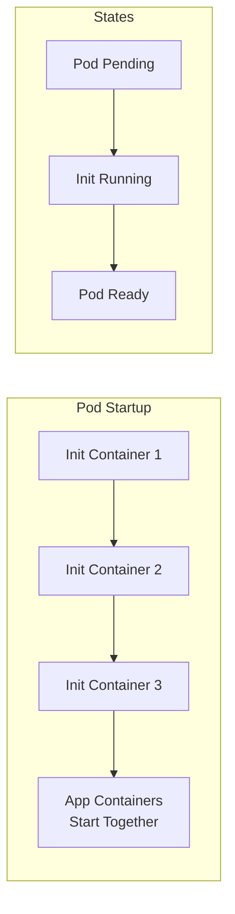

# How to Set Up Init Containers for Pre-Flight Checks in Kubernetes

Author: [nawazdhandala](https://www.github.com/nawazdhandala)

Tags: Kubernetes, Init Containers, Pre-Flight Checks, Pod Lifecycle, Dependencies, DevOps

Description: Learn how to use Kubernetes init containers for dependency checks, database migrations, configuration loading, and ensuring prerequisites before your main application starts.

---

Init containers run before the main application containers and are perfect for pre-flight checks-ensuring dependencies are available, running migrations, downloading configurations, or setting up the environment. They run to completion sequentially before any app container starts.

## Init Container Lifecycle



| Feature | Init Container | Regular Container |
|---------|---------------|-------------------|
| Runs | Sequentially, to completion | Concurrently |
| Restarts | Pod restarts on failure | Depends on restartPolicy |
| Probes | Not supported | Supported |
| Resources | Independent limits | Shared resources |
| Image | Can be different | App image |

## Common Use Cases

### 1. Wait for Dependencies

```yaml
# wait-for-dependencies.yaml
apiVersion: apps/v1
kind: Deployment
metadata:
  name: myapp
  namespace: production
spec:
  replicas: 3
  selector:
    matchLabels:
      app: myapp
  template:
    metadata:
      labels:
        app: myapp
    spec:
      initContainers:
        # Wait for database to be ready
        - name: wait-for-postgres
          image: busybox:1.36
          command:
            - sh
            - -c
            - |
              echo "Waiting for PostgreSQL..."
              until nc -z postgres.database.svc.cluster.local 5432; do
                echo "PostgreSQL not ready, sleeping..."
                sleep 2
              done
              echo "PostgreSQL is ready!"
          resources:
            requests:
              cpu: 10m
              memory: 16Mi
            limits:
              cpu: 50m
              memory: 32Mi
        
        # Wait for Redis to be ready
        - name: wait-for-redis
          image: busybox:1.36
          command:
            - sh
            - -c
            - |
              echo "Waiting for Redis..."
              until nc -z redis.cache.svc.cluster.local 6379; do
                echo "Redis not ready, sleeping..."
                sleep 2
              done
              echo "Redis is ready!"
          resources:
            requests:
              cpu: 10m
              memory: 16Mi
        
        # Wait for Kafka to be ready
        - name: wait-for-kafka
          image: busybox:1.36
          command:
            - sh
            - -c
            - |
              echo "Waiting for Kafka..."
              until nc -z kafka.messaging.svc.cluster.local 9092; do
                echo "Kafka not ready, sleeping..."
                sleep 2
              done
              echo "Kafka is ready!"
          resources:
            requests:
              cpu: 10m
              memory: 16Mi
      
      containers:
        - name: myapp
          image: myregistry/myapp:v1.2.0
          ports:
            - containerPort: 8080
```

### 2. Database Migration

```yaml
# database-migration.yaml
apiVersion: apps/v1
kind: Deployment
metadata:
  name: api-server
  namespace: production
spec:
  replicas: 1
  selector:
    matchLabels:
      app: api-server
  template:
    metadata:
      labels:
        app: api-server
    spec:
      initContainers:
        # Run database migrations
        - name: run-migrations
          image: myregistry/api-server:v1.2.0
          command:
            - /bin/sh
            - -c
            - |
              echo "Running database migrations..."
              /app/migrate up
              echo "Migrations complete!"
          env:
            - name: DATABASE_URL
              valueFrom:
                secretKeyRef:
                  name: database-credentials
                  key: url
          resources:
            requests:
              cpu: 100m
              memory: 256Mi
            limits:
              cpu: 500m
              memory: 512Mi
      
      containers:
        - name: api-server
          image: myregistry/api-server:v1.2.0
          ports:
            - containerPort: 8080
          env:
            - name: DATABASE_URL
              valueFrom:
                secretKeyRef:
                  name: database-credentials
                  key: url
```

### 3. Download Configuration

```yaml
# download-config.yaml
apiVersion: apps/v1
kind: Deployment
metadata:
  name: app-with-config
  namespace: production
spec:
  selector:
    matchLabels:
      app: app-with-config
  template:
    metadata:
      labels:
        app: app-with-config
    spec:
      initContainers:
        # Download configuration from remote source
        - name: download-config
          image: curlimages/curl:8.5.0
          command:
            - sh
            - -c
            - |
              echo "Downloading configuration..."
              curl -s -o /config/app.yaml \
                -H "Authorization: Bearer ${CONFIG_TOKEN}" \
                https://config-server.internal/v1/config/myapp
              
              # Validate configuration
              if [ ! -s /config/app.yaml ]; then
                echo "ERROR: Configuration download failed!"
                exit 1
              fi
              
              echo "Configuration downloaded successfully"
          env:
            - name: CONFIG_TOKEN
              valueFrom:
                secretKeyRef:
                  name: config-server-token
                  key: token
          volumeMounts:
            - name: config-volume
              mountPath: /config
          resources:
            requests:
              cpu: 10m
              memory: 32Mi
        
        # Clone configuration from Git
        - name: git-clone-config
          image: alpine/git:2.43.0
          command:
            - sh
            - -c
            - |
              git clone --depth 1 --branch main \
                https://github.com/myorg/app-config.git \
                /config/git
          volumeMounts:
            - name: config-volume
              mountPath: /config
          resources:
            requests:
              cpu: 10m
              memory: 64Mi
      
      containers:
        - name: app
          image: myregistry/app:v1.0.0
          volumeMounts:
            - name: config-volume
              mountPath: /app/config
      
      volumes:
        - name: config-volume
          emptyDir: {}
```

### 4. Set Permissions

```yaml
# set-permissions.yaml
apiVersion: apps/v1
kind: Deployment
metadata:
  name: secure-app
  namespace: production
spec:
  selector:
    matchLabels:
      app: secure-app
  template:
    metadata:
      labels:
        app: secure-app
    spec:
      initContainers:
        # Fix volume permissions
        - name: fix-permissions
          image: busybox:1.36
          command:
            - sh
            - -c
            - |
              # Change ownership to app user (UID 1000)
              chown -R 1000:1000 /data
              # Set appropriate permissions
              chmod -R 750 /data
              echo "Permissions set successfully"
          securityContext:
            runAsUser: 0  # Need root to change permissions
          volumeMounts:
            - name: data-volume
              mountPath: /data
          resources:
            requests:
              cpu: 10m
              memory: 16Mi
      
      containers:
        - name: app
          image: myregistry/secure-app:v1.0.0
          securityContext:
            runAsUser: 1000
            runAsGroup: 1000
          volumeMounts:
            - name: data-volume
              mountPath: /data
      
      volumes:
        - name: data-volume
          persistentVolumeClaim:
            claimName: app-data-pvc
```

### 5. Generate Certificates

```yaml
# generate-certs.yaml
apiVersion: apps/v1
kind: Deployment
metadata:
  name: tls-app
  namespace: production
spec:
  selector:
    matchLabels:
      app: tls-app
  template:
    metadata:
      labels:
        app: tls-app
    spec:
      initContainers:
        # Generate self-signed certificates
        - name: generate-certs
          image: alpine/openssl:latest
          command:
            - sh
            - -c
            - |
              # Generate private key
              openssl genrsa -out /certs/server.key 4096
              
              # Generate self-signed certificate
              openssl req -new -x509 \
                -key /certs/server.key \
                -out /certs/server.crt \
                -days 365 \
                -subj "/CN=tls-app.production.svc.cluster.local" \
                -addext "subjectAltName=DNS:tls-app,DNS:tls-app.production,DNS:tls-app.production.svc.cluster.local"
              
              # Set permissions
              chmod 600 /certs/server.key
              chmod 644 /certs/server.crt
              
              echo "Certificates generated successfully"
          volumeMounts:
            - name: certs
              mountPath: /certs
          resources:
            requests:
              cpu: 50m
              memory: 64Mi
      
      containers:
        - name: tls-app
          image: myregistry/tls-app:v1.0.0
          volumeMounts:
            - name: certs
              mountPath: /etc/certs
              readOnly: true
          env:
            - name: TLS_CERT_FILE
              value: /etc/certs/server.crt
            - name: TLS_KEY_FILE
              value: /etc/certs/server.key
      
      volumes:
        - name: certs
          emptyDir:
            medium: Memory  # Use tmpfs for security
```

### 6. Seed Data

```yaml
# seed-data.yaml
apiVersion: apps/v1
kind: Deployment
metadata:
  name: app-with-seed
  namespace: production
spec:
  selector:
    matchLabels:
      app: app-with-seed
  template:
    metadata:
      labels:
        app: app-with-seed
    spec:
      initContainers:
        # Check if seeding is needed
        - name: check-seed
          image: postgres:15-alpine
          command:
            - sh
            - -c
            - |
              # Check if seed data exists
              COUNT=$(psql -t -c "SELECT COUNT(*) FROM seed_status WHERE completed = true" | xargs)
              
              if [ "$COUNT" -gt 0 ]; then
                echo "Data already seeded, skipping..."
                exit 0
              fi
              
              echo "needs-seed" > /shared/status
          env:
            - name: PGHOST
              value: postgres.database.svc.cluster.local
            - name: PGDATABASE
              value: myapp
            - name: PGUSER
              valueFrom:
                secretKeyRef:
                  name: postgres-credentials
                  key: username
            - name: PGPASSWORD
              valueFrom:
                secretKeyRef:
                  name: postgres-credentials
                  key: password
          volumeMounts:
            - name: shared
              mountPath: /shared
        
        # Seed data if needed
        - name: seed-data
          image: myregistry/seed-job:v1.0.0
          command:
            - sh
            - -c
            - |
              if [ -f /shared/status ]; then
                echo "Running seed job..."
                /app/seed --data-file=/seed/data.json
                
                # Mark as completed
                psql -c "INSERT INTO seed_status (completed, timestamp) VALUES (true, NOW())"
                echo "Seeding complete!"
              else
                echo "Seeding not needed, skipping..."
              fi
          env:
            - name: DATABASE_URL
              valueFrom:
                secretKeyRef:
                  name: database-credentials
                  key: url
          volumeMounts:
            - name: shared
              mountPath: /shared
            - name: seed-data
              mountPath: /seed
      
      containers:
        - name: app
          image: myregistry/app:v1.0.0
      
      volumes:
        - name: shared
          emptyDir: {}
        - name: seed-data
          configMap:
            name: seed-data
```

## Advanced Patterns

### Retry Logic

```yaml
# init-with-retry.yaml
initContainers:
  - name: wait-with-retry
    image: busybox:1.36
    command:
      - sh
      - -c
      - |
        MAX_RETRIES=30
        RETRY_INTERVAL=5
        
        for i in $(seq 1 $MAX_RETRIES); do
          echo "Attempt $i of $MAX_RETRIES..."
          
          if nc -z service.namespace.svc.cluster.local 8080; then
            echo "Service is ready!"
            exit 0
          fi
          
          echo "Service not ready, waiting ${RETRY_INTERVAL}s..."
          sleep $RETRY_INTERVAL
        done
        
        echo "ERROR: Service did not become ready after $MAX_RETRIES attempts"
        exit 1
```

### Using kubectl in Init Container

```yaml
# init-with-kubectl.yaml
apiVersion: apps/v1
kind: Deployment
metadata:
  name: app-with-kubectl-init
spec:
  template:
    spec:
      serviceAccountName: kubectl-access
      initContainers:
        - name: wait-for-deployment
          image: bitnami/kubectl:latest
          command:
            - sh
            - -c
            - |
              echo "Waiting for dependency deployment to be ready..."
              kubectl rollout status deployment/dependency-app -n production --timeout=300s
              echo "Dependency is ready!"
```

### Shared Process Namespace

```yaml
# shared-process-init.yaml
apiVersion: apps/v1
kind: Deployment
metadata:
  name: app-with-shared-process
spec:
  template:
    spec:
      shareProcessNamespace: true
      initContainers:
        - name: setup-shared
          image: busybox:1.36
          command:
            - sh
            - -c
            - |
              # Write PID file that app container can read
              echo $$ > /shared/init-pid
              # Setup complete
```

## Debugging Init Containers

### Check Init Container Status

```bash
# View init container status
kubectl get pod myapp-xxx -n production -o jsonpath='{.status.initContainerStatuses[*]}' | jq

# View init container logs
kubectl logs myapp-xxx -n production -c wait-for-postgres

# Watch init container logs
kubectl logs -f myapp-xxx -n production -c run-migrations

# Get previous init container logs (if restarted)
kubectl logs myapp-xxx -n production -c wait-for-postgres --previous

# Describe pod to see init container events
kubectl describe pod myapp-xxx -n production
```

### Debug Stuck Init Container

```bash
# If init container is stuck, exec into it (while running)
kubectl exec -it myapp-xxx -n production -c wait-for-postgres -- sh

# Check what's happening
kubectl get events -n production --field-selector involvedObject.name=myapp-xxx
```

## Best Practices

### 1. Set Resource Limits

```yaml
initContainers:
  - name: init
    resources:
      requests:
        cpu: 50m
        memory: 64Mi
      limits:
        cpu: 200m
        memory: 256Mi
```

### 2. Use Timeouts

```yaml
command:
  - sh
  - -c
  - |
    timeout 300 sh -c 'until nc -z service 8080; do sleep 2; done'
```

### 3. Fail Fast with Clear Messages

```yaml
command:
  - sh
  - -c
  - |
    if ! /app/migrate up; then
      echo "ERROR: Migration failed!"
      exit 1
    fi
```

### 4. Share Data via Volumes

```yaml
volumes:
  - name: shared-data
    emptyDir: {}
```

## Summary

| Use Case | Init Container Image | Typical Duration |
|----------|---------------------|------------------|
| Wait for service | busybox | 5-30 seconds |
| Database migration | App image | 10-120 seconds |
| Download config | curl/wget | 5-30 seconds |
| Fix permissions | busybox | <5 seconds |
| Generate certs | openssl | <10 seconds |
| Seed data | App/custom image | 30-300 seconds |

## Related Posts

- [How to Handle Kubernetes Pod Lifecycle Hooks](https://oneuptime.com/blog/post/2026-01-25-pod-lifecycle-hooks-prestop-poststart/view) - PostStart and PreStop hooks
- [How to Run Kubernetes DaemonSets for Node-Level Services](https://oneuptime.com/blog/post/2026-01-19-kubernetes-daemonsets-node-services/view) - DaemonSet patterns
- [How to Set Up Kubernetes Jobs and CronJobs](https://oneuptime.com/blog/post/2026-01-19-kubernetes-jobs-cronjobs-batch-processing/view) - Batch processing
