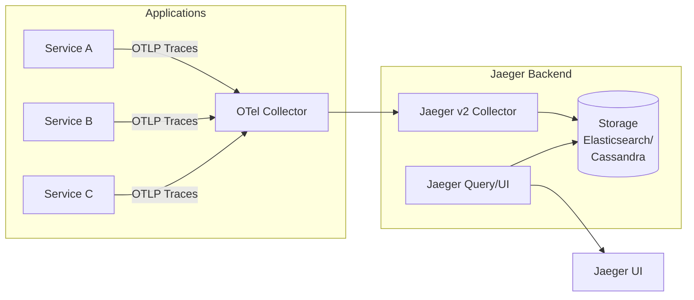

# How to Implement Distributed Tracing with Jaeger in Kubernetes

Author: [nawazdhandala](https://www.github.com/nawazdhandala)

Tags: Kubernetes, Jaeger, Distributed Tracing, OpenTelemetry, Observability, Microservice

Description: Learn how to deploy Jaeger for distributed tracing in Kubernetes and instrument your applications to trace requests across microservices.

---

Distributed tracing is essential for understanding request flow through microservices architectures. Jaeger is a popular open-source tracing platform that helps you monitor and troubleshoot complex distributed systems.

This guide covers deploying Jaeger in Kubernetes and instrumenting applications for tracing.

## Distributed Tracing Architecture



## Deploying Jaeger

### Using OpenTelemetry Operator

```bash
# Install cert-manager (required for OpenTelemetry Operator webhooks)

kubectl apply -f https://github.com/cert-manager/cert-manager/releases/download/v1.16.1/cert-manager.yaml

# Wait for cert-manager
kubectl wait --for=condition=Available deployment --all -n cert-manager --timeout=300s

# Install OpenTelemetry Operator for Jaeger v2
kubectl create namespace observability
kubectl apply -f https://github.com/open-telemetry/opentelemetry-operator/releases/latest/download/opentelemetry-operator.yaml

# Verify operator
kubectl get deployment -n opentelemetry-operator-system
```

### All-in-One Deployment (Development)

```yaml
# jaeger-allinone.yaml
apiVersion: opentelemetry.io/v1beta1
kind: OpenTelemetryCollector
metadata:
  name: jaeger-inmemory-instance
  namespace: observability
spec:
  image: cr.jaegertracing.io/jaegertracing/jaeger:2.19.0
  ports:
    - name: jaeger
      port: 16686
  config:
    service:
      extensions: [jaeger_storage, jaeger_query]
      pipelines:
        traces:
          receivers: [otlp]
          exporters: [jaeger_storage_exporter]
    extensions:
      jaeger_query:
        storage:
          traces: memstore
      jaeger_storage:
        backends:
          memstore:
            memory:
              max_traces: 100000
    receivers:
      otlp:
        protocols:
          grpc:
            endpoint: 0.0.0.0:4317
          http:
            endpoint: 0.0.0.0:4318
    exporters:
      jaeger_storage_exporter:
        trace_storage: memstore
```

```bash
kubectl apply -f jaeger-allinone.yaml
```

### Production Deployment with Elasticsearch

```yaml
# jaeger-production.yaml
apiVersion: opentelemetry.io/v1beta1
kind: OpenTelemetryCollector
metadata:
  name: jaeger-storage-instance
  namespace: observability
spec:
  mode: deployment
  replicas: 2
  image: cr.jaegertracing.io/jaegertracing/jaeger:2.19.0
  ports:
    - name: jaeger
      port: 16686
  env:
    - name: ES_USERNAME
      valueFrom:
        secretKeyRef:
          name: jaeger-es-secret
          key: ES_USERNAME
    - name: ES_PASSWORD
      valueFrom:
        secretKeyRef:
          name: jaeger-es-secret
          key: ES_PASSWORD
  resources:
    limits:
      cpu: 1
      memory: 1Gi
    requests:
      cpu: 200m
      memory: 256Mi
  config:
    service:
      extensions: [jaeger_storage, jaeger_query]
      pipelines:
        traces:
          receivers: [otlp]
          processors: [batch]
          exporters: [jaeger_storage_exporter]
    extensions:
      jaeger_query:
        storage:
          traces: es_storage
      jaeger_storage:
        backends:
          es_storage:
            elasticsearch:
              server_urls:
                - https://elasticsearch-es-http.observability.svc:9200
              auth:
                basic:
                  username: ${env:ES_USERNAME}
                  password: ${env:ES_PASSWORD}
              tls:
                ca: /es/certificates/ca.crt
              indices:
                index_prefix: jaeger
                spans:
                  shards: 5
                  replicas: 1
                services:
                  shards: 5
                  replicas: 1
                dependencies:
                  shards: 5
                  replicas: 1
                sampling:
                  shards: 5
                  replicas: 1
    receivers:
      otlp:
        protocols:
          grpc:
            endpoint: 0.0.0.0:4317
          http:
            endpoint: 0.0.0.0:4318
    processors:
      batch:
    exporters:
      jaeger_storage_exporter:
        trace_storage: es_storage
  podAnnotations:
    prometheus.io/scrape: "true"
    prometheus.io/port: "8888"
  volumeMounts:
    - name: es-ca
      mountPath: /es/certificates
      readOnly: true
  volumes:
    - name: es-ca
      secret:
        secretName: elasticsearch-es-http-certs-public
---
apiVersion: networking.k8s.io/v1
kind: Ingress
metadata:
  name: jaeger
  namespace: observability
  annotations:
    kubernetes.io/ingress.class: nginx
spec:
  rules:
    - host: jaeger.example.com
      http:
        paths:
          - path: /
            pathType: Prefix
            backend:
              service:
                name: jaeger-storage-instance-collector
                port:
                  number: 16686
---
apiVersion: autoscaling/v2
kind: HorizontalPodAutoscaler
metadata:
  name: jaeger-storage-instance
  namespace: observability
spec:
  scaleTargetRef:
    apiVersion: apps/v1
    kind: Deployment
    name: jaeger-storage-instance-collector
  minReplicas: 2
  maxReplicas: 5
  metrics:
    - type: Resource
      resource:
        name: cpu
        target:
          type: Utilization
          averageUtilization: 70
---
apiVersion: v1
kind: Secret
metadata:
  name: jaeger-es-secret
  namespace: observability
type: Opaque
stringData:
  ES_PASSWORD: "your-es-password"
  ES_USERNAME: "elastic"
```

### Deploy Elasticsearch for Storage

```yaml
# elasticsearch.yaml
apiVersion: elasticsearch.k8s.elastic.co/v1
kind: Elasticsearch
metadata:
  name: elasticsearch
  namespace: observability
spec:
  version: 8.11.0
  nodeSets:
    - name: default
      count: 3
      config:
        node.store.allow_mmap: false
      podTemplate:
        spec:
          containers:
            - name: elasticsearch
              resources:
                limits:
                  memory: 4Gi
                  cpu: 2
                requests:
                  memory: 2Gi
                  cpu: 500m
      volumeClaimTemplates:
        - metadata:
            name: elasticsearch-data
          spec:
            accessModes:
              - ReadWriteOnce
            resources:
              requests:
                storage: 100Gi
            storageClassName: fast-ssd
```

## OpenTelemetry Collector Configuration

### Deploy OTel Collector

```yaml
# otel-collector.yaml
apiVersion: v1
kind: ConfigMap
metadata:
  name: otel-collector-config
  namespace: observability
data:
  config.yaml: |
    receivers:
      otlp:
        protocols:
          grpc:
            endpoint: 0.0.0.0:4317
          http:
            endpoint: 0.0.0.0:4318
      
      jaeger:
        protocols:
          grpc:
            endpoint: 0.0.0.0:14250
          thrift_http:
            endpoint: 0.0.0.0:14268
          thrift_compact:
            endpoint: 0.0.0.0:6831
    
    processors:
      batch:
        timeout: 1s
        send_batch_size: 1024
      
      memory_limiter:
        check_interval: 1s
        limit_mib: 1000
        spike_limit_mib: 200
    
    exporters:
      otlp/jaeger:
        endpoint: jaeger-inmemory-instance-collector.observability.svc:4317
        tls:
          insecure: true
      
      debug:
        verbosity: detailed
    
    service:
      pipelines:
        traces:
          receivers: [otlp, jaeger]
          processors: [memory_limiter, batch]
          exporters: [otlp/jaeger]
---
apiVersion: apps/v1
kind: Deployment
metadata:
  name: otel-collector
  namespace: observability
spec:
  replicas: 2
  selector:
    matchLabels:
      app: otel-collector
  template:
    metadata:
      labels:
        app: otel-collector
    spec:
      containers:
        - name: collector
          image: otel/opentelemetry-collector-contrib:latest
          args:
            - --config=/etc/otel/config.yaml
          ports:
            - containerPort: 4317   # OTLP gRPC
            - containerPort: 4318   # OTLP HTTP
            - containerPort: 14250  # Jaeger gRPC
            - containerPort: 14268  # Jaeger HTTP
            - containerPort: 6831   # Jaeger compact
              protocol: UDP
          resources:
            limits:
              cpu: 1
              memory: 2Gi
            requests:
              cpu: 200m
              memory: 400Mi
          volumeMounts:
            - name: config
              mountPath: /etc/otel
      volumes:
        - name: config
          configMap:
            name: otel-collector-config
---
apiVersion: v1
kind: Service
metadata:
  name: otel-collector
  namespace: observability
spec:
  selector:
    app: otel-collector
  ports:
    - name: otlp-grpc
      port: 4317
    - name: otlp-http
      port: 4318
    - name: jaeger-grpc
      port: 14250
    - name: jaeger-http
      port: 14268
    - name: jaeger-compact
      port: 6831
      protocol: UDP
```

## Instrumenting Applications

### Go Application

```go
// main.go
package main

import (
    "context"
    "log"
    "net/http"
    
    "go.opentelemetry.io/otel"
    "go.opentelemetry.io/otel/attribute"
    "go.opentelemetry.io/otel/exporters/otlp/otlptrace/otlptracegrpc"
    "go.opentelemetry.io/otel/sdk/resource"
    sdktrace "go.opentelemetry.io/otel/sdk/trace"
    "go.opentelemetry.io/contrib/instrumentation/net/http/otelhttp"
)

func initTracer() (*sdktrace.TracerProvider, error) {
    ctx := context.Background()
    
    // Create OTLP exporter
    exporter, err := otlptracegrpc.New(ctx,
        otlptracegrpc.WithEndpoint("otel-collector.observability:4317"),
        otlptracegrpc.WithInsecure(),
    )
    if err != nil {
        return nil, err
    }
    
    // Create resource with service info
    res, err := resource.New(ctx,
        resource.WithAttributes(
            attribute.String("service.name", "my-go-service"),
            attribute.String("service.version", "1.0.0"),
            attribute.String("deployment.environment.name", "production"),
        ),
    )
    if err != nil {
        return nil, err
    }
    
    // Create tracer provider
    tp := sdktrace.NewTracerProvider(
        sdktrace.WithBatcher(exporter),
        sdktrace.WithResource(res),
        sdktrace.WithSampler(sdktrace.AlwaysSample()),
    )
    
    otel.SetTracerProvider(tp)
    return tp, nil
}

func main() {
    tp, err := initTracer()
    if err != nil {
        log.Fatal(err)
    }
    defer tp.Shutdown(context.Background())
    
    // Wrap HTTP handler with tracing
    handler := http.HandlerFunc(func(w http.ResponseWriter, r *http.Request) {
        ctx := r.Context()
        tracer := otel.Tracer("my-go-service")
        
        _, span := tracer.Start(ctx, "handleRequest")
        defer span.End()
        
        // Your logic here
        w.Write([]byte("Hello, World!"))
    })
    
    http.Handle("/", otelhttp.NewHandler(handler, "root"))
    log.Fatal(http.ListenAndServe(":8080", nil))
}
```

### Python Application

```python
# app.py
from flask import Flask
from opentelemetry import trace
from opentelemetry.exporter.otlp.proto.grpc.trace_exporter import OTLPSpanExporter
from opentelemetry.instrumentation.flask import FlaskInstrumentor
from opentelemetry.instrumentation.requests import RequestsInstrumentor
from opentelemetry.sdk.resources import Resource
from opentelemetry.sdk.trace import TracerProvider
from opentelemetry.sdk.trace.export import BatchSpanProcessor

# Configure tracer
resource = Resource.create({
    "service.name": "my-python-service",
    "service.version": "1.0.0",
    "deployment.environment.name": "production"
})

provider = TracerProvider(resource=resource)
processor = BatchSpanProcessor(OTLPSpanExporter(
    endpoint="otel-collector.observability:4317",
    insecure=True
))
provider.add_span_processor(processor)
trace.set_tracer_provider(provider)

# Create Flask app
app = Flask(__name__)

# Auto-instrument Flask
FlaskInstrumentor().instrument_app(app)
RequestsInstrumentor().instrument()

tracer = trace.get_tracer(__name__)

@app.route('/')
def hello():
    with tracer.start_as_current_span("process_request") as span:
        span.set_attribute("custom.attribute", "value")
        return "Hello, World!"

@app.route('/api/data')
def get_data():
    with tracer.start_as_current_span("fetch_data"):
        # Simulated database call
        with tracer.start_as_current_span("database_query"):
            data = {"key": "value"}
        return data

if __name__ == '__main__':
    app.run(host='0.0.0.0', port=8080)
```

### Java/Spring Boot Application

```java
// Application.java
package com.example.demo;

import io.opentelemetry.api.OpenTelemetry;
import io.opentelemetry.api.trace.Span;
import io.opentelemetry.api.trace.Tracer;
import io.opentelemetry.context.Scope;
import org.springframework.boot.SpringApplication;
import org.springframework.boot.autoconfigure.SpringBootApplication;
import org.springframework.web.bind.annotation.GetMapping;
import org.springframework.web.bind.annotation.RestController;

@SpringBootApplication
@RestController
public class Application {
    
    private final Tracer tracer;
    
    public Application(OpenTelemetry openTelemetry) {
        this.tracer = openTelemetry.getTracer("my-java-service");
    }
    
    @GetMapping("/")
    public String hello() {
        Span span = tracer.spanBuilder("handleRequest").startSpan();
        try (Scope scope = span.makeCurrent()) {
            span.setAttribute("custom.attribute", "value");
            return "Hello, World!";
        } finally {
            span.end();
        }
    }
    
    public static void main(String[] args) {
        SpringApplication.run(Application.class, args);
    }
}
```

```yaml
# application.yaml
otel:
  exporter:
    otlp:
      endpoint: http://otel-collector.observability:4317
  resource:
    attributes:
      service.name: my-java-service
      service.version: 1.0.0
```

### Node.js Application

```javascript
// tracing.js
const { NodeSDK } = require('@opentelemetry/sdk-node');
const { getNodeAutoInstrumentations } = require('@opentelemetry/auto-instrumentations-node');
const { OTLPTraceExporter } = require('@opentelemetry/exporter-trace-otlp-grpc');
const { resourceFromAttributes } = require('@opentelemetry/resources');

const sdk = new NodeSDK({
  resource: resourceFromAttributes({
    'service.name': 'my-node-service',
    'service.version': '1.0.0',
  }),
  traceExporter: new OTLPTraceExporter({
    url: 'http://otel-collector.observability:4317',
  }),
  instrumentations: [getNodeAutoInstrumentations()],
});

sdk.start();

process.on('SIGTERM', () => {
  sdk.shutdown()
    .then(() => console.log('Tracing terminated'))
    .catch((error) => console.log('Error terminating tracing', error))
    .finally(() => process.exit(0));
});
```

```javascript
// app.js
require('./tracing'); // Initialize tracing first

const express = require('express');
const { trace } = require('@opentelemetry/api');

const app = express();
const tracer = trace.getTracer('my-node-service');

app.get('/', (req, res) => {
  const span = tracer.startSpan('handleRequest');
  span.setAttribute('custom.attribute', 'value');
  
  res.send('Hello, World!');
  span.end();
});

app.listen(8080, () => {
  console.log('Server running on port 8080');
});
```

## Kubernetes Deployment with Tracing

```yaml
# deployment.yaml
apiVersion: apps/v1
kind: Deployment
metadata:
  name: my-service
  namespace: production
spec:
  replicas: 3
  selector:
    matchLabels:
      app: my-service
  template:
    metadata:
      labels:
        app: my-service
    spec:
      containers:
        - name: app
          image: my-service:v1.0.0
          ports:
            - containerPort: 8080
          env:
            - name: OTEL_EXPORTER_OTLP_ENDPOINT
              value: "http://otel-collector.observability:4317"
            - name: OTEL_EXPORTER_OTLP_PROTOCOL
              value: "grpc"
            - name: OTEL_SERVICE_NAME
              value: "my-service"
            - name: OTEL_RESOURCE_ATTRIBUTES
              value: "deployment.environment.name=production,service.version=1.0.0"
```

## Sampling Strategies

```yaml
# jaeger-with-sampling.yaml
apiVersion: v1
kind: ConfigMap
metadata:
  name: otel-collector-config
  namespace: observability
data:
  config.yaml: |
    receivers:
      otlp:
        protocols:
          grpc:
            endpoint: 0.0.0.0:4317
          http:
            endpoint: 0.0.0.0:4318

    processors:
      tail_sampling:
        decision_wait: 10s
        num_traces: 100000
        policies:
          - name: errors
            type: status_code
            status_code:
              status_codes: [ERROR]
          - name: probabilistic-10-percent
            type: probabilistic
            probabilistic:
              sampling_percentage: 10

    exporters:
      otlp/jaeger:
        endpoint: jaeger-inmemory-instance-collector.observability.svc:4317
        tls:
          insecure: true

    service:
      pipelines:
        traces:
          receivers: [otlp]
          processors: [tail_sampling]
          exporters: [otlp/jaeger]
```

For SDK-level sampling, configure the OpenTelemetry SDK in each application:

```yaml
env:
  - name: OTEL_TRACES_SAMPLER
    value: "traceidratio"
  - name: OTEL_TRACES_SAMPLER_ARG
    value: "0.1"
```

## Querying Traces

### Using Jaeger UI

```bash
# Port forward Jaeger UI
kubectl port-forward svc/jaeger-inmemory-instance-collector 16686:16686 -n observability

# Access at http://localhost:16686
```

### Using Jaeger API

```bash
# Find traces by service
curl "http://localhost:16686/api/traces?service=my-service&limit=20"

# Find traces by tags
curl "http://localhost:16686/api/traces?service=my-service&tags=%7B%22error%22%3A%22true%22%7D"

# Get specific trace
curl "http://localhost:16686/api/traces/<trace-id>"
```

## Alerting on Traces

These Prometheus rules assume you have enabled Jaeger Service Performance Monitoring or an OpenTelemetry span metrics connector that exports `calls_total` and `duration_seconds_bucket`.

```yaml
# PrometheusRule for trace-based alerts
apiVersion: monitoring.coreos.com/v1
kind: PrometheusRule
metadata:
  name: tracing-alerts
  namespace: observability
spec:
  groups:
    - name: jaeger.rules
      rules:
        - alert: HighTraceErrorRate
          expr: |
            sum(rate(calls_total{status_code="Error"}[5m])) by (service_name) /
            sum(rate(calls_total[5m])) by (service_name) > 0.05
          for: 5m
          labels:
            severity: warning
          annotations:
            summary: "High error rate in traces for {{ $labels.service_name }}"
        
        - alert: SlowTraces
          expr: |
            histogram_quantile(0.99, 
              sum(rate(duration_seconds_bucket[5m])) by (service_name, le)
            ) > 5
          for: 5m
          labels:
            severity: warning
          annotations:
            summary: "P99 latency above 5s for {{ $labels.service_name }}"
```

## Best Practices

### 1. Meaningful Span Names

```go
// Good
_, span := tracer.Start(ctx, "processOrder")
span.End()
_, span = tracer.Start(ctx, "fetchUserFromDB")
span.End()

// Bad
_, span = tracer.Start(ctx, "handler")
span.End()
_, span = tracer.Start(ctx, "function1")
span.End()
```

### 2. Add Useful Attributes

```python
span.set_attribute("user.id", user_id)
span.set_attribute("order.id", order_id)
span.set_attribute("http.status_code", 200)
span.set_attribute("db.operation", "SELECT")
```

### 3. Propagate Context

```go
// Pass context between services
client := &http.Client{Transport: otelhttp.NewTransport(http.DefaultTransport)}
req, _ := http.NewRequestWithContext(ctx, "GET", "http://other-service/api", nil)
```

## Conclusion

Distributed tracing with Jaeger provides crucial visibility into microservices. Key takeaways:

1. **Deploy Jaeger v2 with the OpenTelemetry Operator** for easy management
2. **Use OpenTelemetry** for vendor-neutral instrumentation  
3. **Configure sampling** to manage volume
4. **Add meaningful attributes** to spans
5. **Propagate context** across service boundaries

For comprehensive observability including tracing, check out [OneUptime's APM solution](https://oneuptime.com/product/apm).

## Related Resources

- [How to Set Up Prometheus ServiceMonitor](https://oneuptime.com/blog/post/2026-01-19-kubernetes-prometheus-servicemonitor/view)
- [How to Set Up Centralized Logging](https://oneuptime.com/blog/post/2026-01-19-kubernetes-logging-fluentd-fluent-bit/view)
- [How to Instrument Python with OpenTelemetry](https://oneuptime.com/blog/post/2025-01-06-instrument-python-opentelemetry/view)
