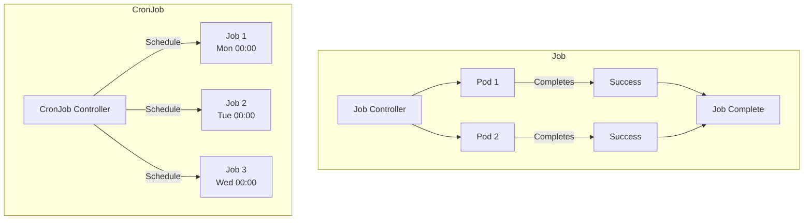

# How to Run Batch Jobs and CronJobs in Kubernetes

Author: [nawazdhandala](https://www.github.com/nawazdhandala)

Tags: Kubernetes, Jobs, CronJobs, Batch Processing, Scheduling, Automation

Description: Learn how to configure and manage Kubernetes Jobs and CronJobs for batch processing, scheduled tasks, and one-time operations.

---

Kubernetes Jobs and CronJobs are workload resources designed for batch processing and scheduled tasks. Unlike Deployments that run continuously, Jobs run to completion and CronJobs run on a schedule.

This guide covers creating, managing, and monitoring Jobs and CronJobs effectively.

## Jobs vs CronJobs



## Basic Job

### Simple Job

```yaml
# simple-job.yaml
apiVersion: batch/v1
kind: Job
metadata:
  name: pi-calculator
spec:
  template:
    spec:
      containers:
        - name: pi
          image: perl:5.34
          command: ["perl", "-Mbignum=bpi", "-wle", "print bpi(2000)"]
      restartPolicy: Never
  backoffLimit: 4
```

```bash
# Create the job
kubectl apply -f simple-job.yaml

# Watch job progress
kubectl get jobs -w

# Check job status
kubectl describe job pi-calculator

# View pod logs
kubectl logs job/pi-calculator
```

### Job with Multiple Completions

```yaml
# parallel-job.yaml
apiVersion: batch/v1
kind: Job
metadata:
  name: process-items
spec:
  # Number of successful pod completions required
  completions: 5
  # Maximum pods running in parallel
  parallelism: 2
  template:
    spec:
      containers:
        - name: processor
          image: myapp/processor:latest
          command: ["./process", "--item-id=$(JOB_COMPLETION_INDEX)"]
          env:
            - name: JOB_COMPLETION_INDEX
              valueFrom:
                fieldRef:
                  fieldPath: metadata.annotations['batch.kubernetes.io/job-completion-index']
      restartPolicy: Never
  backoffLimit: 6
```

### Indexed Job (Work Queue Pattern)

```yaml
# indexed-job.yaml
apiVersion: batch/v1
kind: Job
metadata:
  name: indexed-job
spec:
  completions: 10
  parallelism: 3
  completionMode: Indexed  # Each pod gets a unique index
  template:
    spec:
      containers:
        - name: worker
          image: python:3.11-slim
          command:
            - python
            - -c
            - |
              import os
              index = os.environ.get('JOB_COMPLETION_INDEX', '0')
              print(f"Processing item {index}")
              # Process item at index
          env:
            - name: JOB_COMPLETION_INDEX
              valueFrom:
                fieldRef:
                  fieldPath: metadata.annotations['batch.kubernetes.io/job-completion-index']
      restartPolicy: Never
```

## Advanced Job Configuration

### Job with Deadline and TTL

```yaml
# job-with-limits.yaml
apiVersion: batch/v1
kind: Job
metadata:
  name: deadline-job
spec:
  # Maximum time for job to complete
  activeDeadlineSeconds: 600  # 10 minutes
  
  # Clean up completed job after this time
  ttlSecondsAfterFinished: 3600  # 1 hour
  
  # Number of retries before marking as failed
  backoffLimit: 3
  
  template:
    spec:
      containers:
        - name: worker
          image: myapp/worker:latest
          resources:
            requests:
              cpu: 100m
              memory: 128Mi
            limits:
              cpu: 500m
              memory: 512Mi
      restartPolicy: Never
```

### Job with Init Containers

```yaml
# job-with-init.yaml
apiVersion: batch/v1
kind: Job
metadata:
  name: job-with-init
spec:
  template:
    spec:
      initContainers:
        - name: wait-for-db
          image: busybox
          command: ['sh', '-c', 'until nc -z database 5432; do sleep 2; done']
        - name: download-data
          image: curlimages/curl
          command: ['curl', '-o', '/data/input.json', 'http://api/data']
          volumeMounts:
            - name: data
              mountPath: /data
      containers:
        - name: processor
          image: myapp/processor:latest
          volumeMounts:
            - name: data
              mountPath: /data
      restartPolicy: Never
      volumes:
        - name: data
          emptyDir: {}
```

### Job with Pod Failure Policy

```yaml
# job-failure-policy.yaml
apiVersion: batch/v1
kind: Job
metadata:
  name: job-with-failure-policy
spec:
  backoffLimit: 6
  podFailurePolicy:
    rules:
      # Fail immediately on non-retryable errors
      - action: FailJob
        onExitCodes:
          containerName: worker
          operator: In
          values: [1, 2, 3]  # Known non-retryable exit codes
      
      # Ignore transient failures
      - action: Ignore
        onPodConditions:
          - type: DisruptionTarget
      
      # Count other failures normally
      - action: Count
        onExitCodes:
          containerName: worker
          operator: NotIn
          values: [0, 1, 2, 3]
  
  template:
    spec:
      containers:
        - name: worker
          image: myapp/worker:latest
      restartPolicy: Never
```

## CronJob Configuration

### Basic CronJob

```yaml
# basic-cronjob.yaml
apiVersion: batch/v1
kind: CronJob
metadata:
  name: daily-backup
spec:
  # Cron expression: minute hour day-of-month month day-of-week
  schedule: "0 2 * * *"  # Daily at 2 AM
  
  jobTemplate:
    spec:
      template:
        spec:
          containers:
            - name: backup
              image: myapp/backup:latest
              command:
                - /bin/sh
                - -c
                - |
                  echo "Starting backup at $(date)"
                  ./backup.sh
                  echo "Backup completed at $(date)"
          restartPolicy: OnFailure
```

### CronJob with Concurrency Policy

```yaml
# cronjob-concurrency.yaml
apiVersion: batch/v1
kind: CronJob
metadata:
  name: report-generator
spec:
  schedule: "*/15 * * * *"  # Every 15 minutes
  
  # Concurrency policy: Allow, Forbid, or Replace
  concurrencyPolicy: Forbid  # Don't start new job if previous is still running
  
  # Maximum time to wait to start if missed
  startingDeadlineSeconds: 300
  
  # Number of successful jobs to keep
  successfulJobsHistoryLimit: 3
  
  # Number of failed jobs to keep
  failedJobsHistoryLimit: 3
  
  # Suspend future executions (useful for maintenance)
  suspend: false
  
  jobTemplate:
    spec:
      activeDeadlineSeconds: 600  # Job timeout
      template:
        spec:
          containers:
            - name: report
              image: myapp/report:latest
          restartPolicy: OnFailure
```

### CronJob with Timezone

```yaml
# cronjob-timezone.yaml
apiVersion: batch/v1
kind: CronJob
metadata:
  name: timezone-job
spec:
  schedule: "0 9 * * 1-5"  # 9 AM Mon-Fri
  timeZone: "America/New_York"  # Requires K8s 1.27+
  
  jobTemplate:
    spec:
      template:
        spec:
          containers:
            - name: daily-task
              image: myapp/task:latest
          restartPolicy: OnFailure
```

## Common Job Patterns

### Database Migration Job

```yaml
# migration-job.yaml
apiVersion: batch/v1
kind: Job
metadata:
  name: db-migration
  annotations:
    helm.sh/hook: pre-upgrade
    helm.sh/hook-weight: "-1"
    helm.sh/hook-delete-policy: hook-succeeded
spec:
  template:
    spec:
      containers:
        - name: migrate
          image: myapp/migrator:latest
          command: ["./migrate", "up"]
          env:
            - name: DATABASE_URL
              valueFrom:
                secretKeyRef:
                  name: db-credentials
                  key: url
      restartPolicy: Never
  backoffLimit: 3
```

### Cleanup CronJob

```yaml
# cleanup-cronjob.yaml
apiVersion: batch/v1
kind: CronJob
metadata:
  name: cleanup-old-data
spec:
  schedule: "0 3 * * 0"  # Every Sunday at 3 AM
  jobTemplate:
    spec:
      template:
        spec:
          containers:
            - name: cleanup
              image: myapp/cleanup:latest
              command:
                - /bin/sh
                - -c
                - |
                  echo "Cleaning up data older than 30 days"
                  ./cleanup --older-than 30d
                  echo "Cleaning temporary files"
                  ./cleanup --temp-files
          restartPolicy: OnFailure
```

### Data Processing Pipeline

```yaml
# processing-job.yaml
apiVersion: batch/v1
kind: Job
metadata:
  name: data-pipeline
  labels:
    pipeline: daily-etl
spec:
  completions: 1
  template:
    metadata:
      labels:
        pipeline: daily-etl
    spec:
      initContainers:
        # Extract
        - name: extract
          image: myapp/extractor:latest
          command: ["./extract", "--date", "$(date +%Y-%m-%d)"]
          volumeMounts:
            - name: data
              mountPath: /data
        # Transform
        - name: transform
          image: myapp/transformer:latest
          command: ["./transform", "/data/raw", "/data/processed"]
          volumeMounts:
            - name: data
              mountPath: /data
      containers:
        # Load
        - name: load
          image: myapp/loader:latest
          command: ["./load", "/data/processed"]
          volumeMounts:
            - name: data
              mountPath: /data
          env:
            - name: TARGET_DB
              valueFrom:
                configMapKeyRef:
                  name: pipeline-config
                  key: target-db
      restartPolicy: Never
      volumes:
        - name: data
          emptyDir:
            sizeLimit: 10Gi
```

### Report Generation CronJob

```yaml
# report-cronjob.yaml
apiVersion: batch/v1
kind: CronJob
metadata:
  name: weekly-report
spec:
  schedule: "0 6 * * 1"  # Monday 6 AM
  jobTemplate:
    spec:
      template:
        spec:
          containers:
            - name: report
              image: myapp/reporter:latest
              command:
                - python
                - /app/generate_report.py
              env:
                - name: REPORT_TYPE
                  value: "weekly"
                - name: EMAIL_RECIPIENTS
                  valueFrom:
                    configMapKeyRef:
                      name: report-config
                      key: recipients
                - name: SMTP_PASSWORD
                  valueFrom:
                    secretKeyRef:
                      name: smtp-credentials
                      key: password
              resources:
                requests:
                  cpu: 500m
                  memory: 1Gi
                limits:
                  cpu: 2
                  memory: 4Gi
          restartPolicy: OnFailure
```

## Job Management

### Manually Trigger CronJob

```bash
# Create a Job from a CronJob manually
kubectl create job --from=cronjob/daily-backup manual-backup-$(date +%Y%m%d)

# With custom name
kubectl create job manual-run --from=cronjob/my-cronjob
```

### Suspend/Resume CronJob

```bash
# Suspend CronJob
kubectl patch cronjob daily-backup -p '{"spec":{"suspend":true}}'

# Resume CronJob
kubectl patch cronjob daily-backup -p '{"spec":{"suspend":false}}'
```

### Delete Completed Jobs

```bash
# Delete all completed jobs
kubectl delete jobs --field-selector status.successful=1

# Delete failed jobs
kubectl delete jobs --field-selector status.successful=0

# Delete jobs older than 1 hour using TTL (automatic)
# Or manually:
kubectl get jobs -o json | jq -r '.items[] | select(.status.completionTime) | select(now - (.status.completionTime | fromdateiso8601) > 3600) | .metadata.name' | xargs -r kubectl delete job
```

## Monitoring Jobs

### Prometheus Metrics

```yaml
# PrometheusRule for job monitoring
apiVersion: monitoring.coreos.com/v1
kind: PrometheusRule
metadata:
  name: job-alerts
spec:
  groups:
    - name: job.rules
      rules:
        # Job failed
        - alert: JobFailed
          expr: |
            kube_job_status_failed{job_name!~".*-manual.*"} > 0
          for: 1m
          labels:
            severity: warning
          annotations:
            summary: "Job {{ $labels.job_name }} failed"
        
        # Job running too long
        - alert: JobRunningTooLong
          expr: |
            time() - kube_job_status_start_time{job_name!=""} > 3600
            and
            kube_job_status_active{job_name!=""} > 0
          for: 5m
          labels:
            severity: warning
          annotations:
            summary: "Job {{ $labels.job_name }} running for more than 1 hour"
        
        # CronJob not running
        - alert: CronJobNotScheduled
          expr: |
            time() - kube_cronjob_status_last_schedule_time > kube_cronjob_spec_schedule_delay_seconds * 2
          for: 10m
          labels:
            severity: warning
```

### Useful kubectl Commands

```bash
# List all jobs with status
kubectl get jobs -o wide

# List cronjobs with last schedule
kubectl get cronjobs

# Describe job for events
kubectl describe job my-job

# Get job logs
kubectl logs job/my-job

# Get logs from specific pod of a job
kubectl logs my-job-xxxxx

# Watch job pods
kubectl get pods -l job-name=my-job -w

# Get job completion status
kubectl get job my-job -o jsonpath='{.status.conditions[?(@.type=="Complete")].status}'
```

## Best Practices

### 1. Set Resource Limits

```yaml
resources:
  requests:
    cpu: 100m
    memory: 128Mi
  limits:
    cpu: 1
    memory: 1Gi
```

### 2. Use Appropriate Restart Policy

```yaml
# For Jobs
restartPolicy: Never  # Create new pod on failure
# or
restartPolicy: OnFailure  # Restart container in same pod
```

### 3. Configure Cleanup

```yaml
spec:
  ttlSecondsAfterFinished: 86400  # 24 hours
  successfulJobsHistoryLimit: 3
  failedJobsHistoryLimit: 5
```

### 4. Add Observability

```yaml
metadata:
  labels:
    app: my-job
    team: data-engineering
  annotations:
    description: "Daily data processing job"
```

## Conclusion

Jobs and CronJobs are essential for batch processing in Kubernetes. Key takeaways:

1. **Use Jobs for one-time tasks** - Migrations, processing, cleanup
2. **Use CronJobs for scheduled tasks** - Reports, backups, maintenance
3. **Configure failure handling** - backoffLimit, activeDeadlineSeconds
4. **Clean up completed jobs** - ttlSecondsAfterFinished, history limits
5. **Monitor job health** - Alerts on failures and long-running jobs

For monitoring your batch jobs, check out [OneUptime's Kubernetes monitoring](https://oneuptime.com/product/metrics).

## Related Resources

- [How to Set Up Resource Quotas](https://oneuptime.com/blog/post/kubernetes-resource-quotas-limit-ranges/view)
- [How to Configure Pod Priority and Preemption](https://oneuptime.com/blog/post/kubernetes-pod-priority-preemption/view)
- [How to Handle Pod Evictions](https://oneuptime.com/blog/post/kubernetes-pod-evictions-resource-pressure/view)
