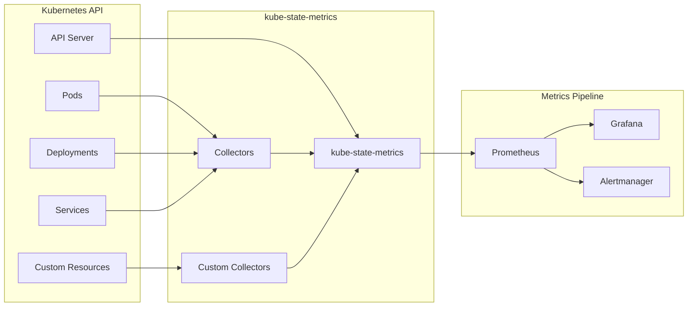

# How to Create Custom Kubernetes Metrics with kube-state-metrics

Author: [nawazdhandala](https://www.github.com/nawazdhandala)

Tags: Kubernetes, Monitoring, kube-state-metrics, Prometheus, Custom Metrics, Observability

Description: Learn how to extend kube-state-metrics with custom collectors, create business-specific metrics from Kubernetes objects, and build comprehensive monitoring dashboards.

---

kube-state-metrics generates Prometheus metrics from Kubernetes API objects. While it provides extensive built-in metrics, you often need custom metrics for business-specific requirements, custom resources, or derived calculations. This guide covers extending and customizing kube-state-metrics.

## Understanding kube-state-metrics



## Deploy kube-state-metrics

### Basic Installation

```bash
# Install via Helm
helm repo add prometheus-community https://prometheus-community.github.io/helm-charts
helm repo update

helm install kube-state-metrics prometheus-community/kube-state-metrics \
  --namespace monitoring \
  --create-namespace \
  --values kube-state-metrics-values.yaml
```

### Configuration Values

```yaml
# kube-state-metrics-values.yaml
image:
  tag: v2.10.1

replicas: 2

resources:
  requests:
    cpu: 100m
    memory: 256Mi
  limits:
    cpu: 500m
    memory: 512Mi

# Collectors to enable
collectors:
  - certificatesigningrequests
  - configmaps
  - cronjobs
  - daemonsets
  - deployments
  - endpoints
  - horizontalpodautoscalers
  - ingresses
  - jobs
  - leases
  - limitranges
  - mutatingwebhookconfigurations
  - namespaces
  - networkpolicies
  - nodes
  - persistentvolumeclaims
  - persistentvolumes
  - poddisruptionbudgets
  - pods
  - replicasets
  - replicationcontrollers
  - resourcequotas
  - secrets
  - services
  - statefulsets
  - storageclasses
  - validatingwebhookconfigurations
  - volumeattachments

# Custom resource state metrics
customResourceState:
  enabled: true
  config:
    spec:
      resources:
        - groupVersionKind:
            group: argoproj.io
            version: v1alpha1
            kind: Application
          labelsFromPath:
            name: [metadata, name]
            namespace: [metadata, namespace]
          metrics:
            - name: argocd_application_info
              help: "ArgoCD Application information"
              each:
                type: Info
                info:
                  labelsFromPath:
                    project: [spec, project]
                    sync_policy: [spec, syncPolicy, automated]
            - name: argocd_application_sync_status
              help: "ArgoCD Application sync status"
              each:
                type: Gauge
                gauge:
                  path: [status, sync, status]
                  valueFrom: [status, sync, status]
                  nilValue: 0
              commonLabels:
                status: synced
              labelFromKey: status

# Metric labels to allow
metricLabelsAllowlist:
  - namespaces=[*]
  - pods=[*]
  - deployments=[*]

# Namespace denylist
namespacesDenylist: []

# Prometheus scraping config
prometheus:
  monitor:
    enabled: true
    interval: 30s
```

## Custom Resource State Metrics

### Define Custom Metrics for CRDs

```yaml
# kube-state-metrics-custom.yaml
apiVersion: v1
kind: ConfigMap
metadata:
  name: kube-state-metrics-custom-resource-config
  namespace: monitoring
data:
  config.yaml: |
    spec:
      resources:
        # ArgoCD Applications
        - groupVersionKind:
            group: argoproj.io
            version: v1alpha1
            kind: Application
          labelsFromPath:
            name: [metadata, name]
            namespace: [metadata, namespace]
          metrics:
            - name: argocd_app_info
              help: "Information about ArgoCD applications"
              each:
                type: Info
                info:
                  labelsFromPath:
                    project: [spec, project]
                    repo_url: [spec, source, repoURL]
                    target_revision: [spec, source, targetRevision]
                    path: [spec, source, path]
            
            - name: argocd_app_sync_status
              help: "Sync status of ArgoCD applications"
              each:
                type: StateSet
                stateSet:
                  labelName: status
                  path: [status, sync, status]
                  list:
                    - Synced
                    - OutOfSync
                    - Unknown
            
            - name: argocd_app_health_status
              help: "Health status of ArgoCD applications"
              each:
                type: StateSet
                stateSet:
                  labelName: status
                  path: [status, health, status]
                  list:
                    - Healthy
                    - Progressing
                    - Degraded
                    - Suspended
                    - Missing
                    - Unknown
        
        # Cert-Manager Certificates
        - groupVersionKind:
            group: cert-manager.io
            version: v1
            kind: Certificate
          labelsFromPath:
            name: [metadata, name]
            namespace: [metadata, namespace]
          metrics:
            - name: certmanager_certificate_ready
              help: "Whether the certificate is ready"
              each:
                type: Gauge
                gauge:
                  nilValue: 0
                  path: [status, conditions]
                  labelsFromPath:
                    condition: ["type"]
                  valueFrom: ["status"]
            
            - name: certmanager_certificate_expiration_timestamp
              help: "Certificate expiration timestamp"
              each:
                type: Gauge
                gauge:
                  path: [status, notAfter]
                  valueFrom: [status, notAfter]
            
            - name: certmanager_certificate_renewal_timestamp
              help: "Certificate renewal timestamp"
              each:
                type: Gauge
                gauge:
                  path: [status, renewalTime]
                  valueFrom: [status, renewalTime]
        
        # Istio VirtualServices
        - groupVersionKind:
            group: networking.istio.io
            version: v1beta1
            kind: VirtualService
          labelsFromPath:
            name: [metadata, name]
            namespace: [metadata, namespace]
          metrics:
            - name: istio_virtualservice_info
              help: "Information about Istio VirtualServices"
              each:
                type: Info
                info:
                  labelsFromPath:
                    hosts: [spec, hosts]
                    gateways: [spec, gateways]
        
        # Knative Services
        - groupVersionKind:
            group: serving.knative.dev
            version: v1
            kind: Service
          labelsFromPath:
            name: [metadata, name]
            namespace: [metadata, namespace]
          metrics:
            - name: knative_service_ready
              help: "Whether the Knative service is ready"
              each:
                type: Gauge
                gauge:
                  path: [status, conditions]
                  labelsFromPath:
                    condition: ["type"]
                  valueFrom: ["status"]
            
            - name: knative_service_traffic_percent
              help: "Traffic percentage for Knative service revisions"
              each:
                type: Gauge
                gauge:
                  path: [status, traffic]
                  labelsFromPath:
                    revision: ["revisionName"]
                    tag: ["tag"]
                  valueFrom: ["percent"]
```

### Deploy with Custom Config

```yaml
# kube-state-metrics-deployment.yaml
apiVersion: apps/v1
kind: Deployment
metadata:
  name: kube-state-metrics
  namespace: monitoring
spec:
  replicas: 2
  selector:
    matchLabels:
      app: kube-state-metrics
  template:
    metadata:
      labels:
        app: kube-state-metrics
    spec:
      serviceAccountName: kube-state-metrics
      containers:
        - name: kube-state-metrics
          image: registry.k8s.io/kube-state-metrics/kube-state-metrics:v2.10.1
          args:
            - --port=8080
            - --telemetry-port=8081
            - --custom-resource-state-config-file=/etc/config/config.yaml
            - --custom-resource-state-only=false
          ports:
            - name: metrics
              containerPort: 8080
            - name: telemetry
              containerPort: 8081
          resources:
            requests:
              cpu: 100m
              memory: 256Mi
            limits:
              cpu: 500m
              memory: 512Mi
          volumeMounts:
            - name: custom-config
              mountPath: /etc/config
          livenessProbe:
            httpGet:
              path: /healthz
              port: 8080
            initialDelaySeconds: 5
            timeoutSeconds: 5
          readinessProbe:
            httpGet:
              path: /
              port: 8080
            initialDelaySeconds: 5
            timeoutSeconds: 5
      volumes:
        - name: custom-config
          configMap:
            name: kube-state-metrics-custom-resource-config
```

## Creating Derived Metrics with Recording Rules

### Prometheus Recording Rules

```yaml
# prometheus-recording-rules.yaml
apiVersion: monitoring.coreos.com/v1
kind: PrometheusRule
metadata:
  name: kube-state-metrics-recording-rules
  namespace: monitoring
spec:
  groups:
    - name: kube-state-metrics.rules
      interval: 30s
      rules:
        # Pod resource utilization
        - record: namespace:container_cpu_usage_seconds_total:sum_rate
          expr: |
            sum by (namespace) (
              rate(container_cpu_usage_seconds_total{container!="", image!=""}[5m])
            )
        
        - record: namespace:container_memory_working_set_bytes:sum
          expr: |
            sum by (namespace) (
              container_memory_working_set_bytes{container!="", image!=""}
            )
        
        # CPU request utilization percentage
        - record: namespace:kube_pod_container_resource_requests_cpu_cores:utilization
          expr: |
            sum by (namespace) (
              rate(container_cpu_usage_seconds_total{container!="", image!=""}[5m])
            )
            /
            sum by (namespace) (
              kube_pod_container_resource_requests{resource="cpu", container!=""}
            ) * 100
        
        # Memory request utilization percentage
        - record: namespace:kube_pod_container_resource_requests_memory_bytes:utilization
          expr: |
            sum by (namespace) (
              container_memory_working_set_bytes{container!="", image!=""}
            )
            /
            sum by (namespace) (
              kube_pod_container_resource_requests{resource="memory", container!=""}
            ) * 100
        
        # Deployment availability
        - record: namespace:deployment_availability:ratio
          expr: |
            sum by (namespace, deployment) (
              kube_deployment_status_replicas_available
            )
            /
            sum by (namespace, deployment) (
              kube_deployment_spec_replicas
            )
        
        # Pod restart rate
        - record: namespace:kube_pod_container_status_restarts:rate5m
          expr: |
            sum by (namespace, pod) (
              rate(kube_pod_container_status_restarts_total[5m])
            )
        
        # Node resource pressure
        - record: node:kube_node_status_condition:pressure
          expr: |
            max by (node, condition) (
              kube_node_status_condition{condition=~"MemoryPressure|DiskPressure|PIDPressure", status="true"}
            )
        
        # PVC usage percentage
        - record: namespace:kubelet_volume_stats_used_bytes:ratio
          expr: |
            sum by (namespace, persistentvolumeclaim) (
              kubelet_volume_stats_used_bytes
            )
            /
            sum by (namespace, persistentvolumeclaim) (
              kubelet_volume_stats_capacity_bytes
            ) * 100
        
        # Workload cost estimate (example)
        - record: namespace:estimated_monthly_cost_usd
          expr: |
            (
              # CPU cost (assuming $0.04 per core-hour)
              sum by (namespace) (
                kube_pod_container_resource_requests{resource="cpu", container!=""}
              ) * 0.04 * 720
            )
            +
            (
              # Memory cost (assuming $0.005 per GB-hour)
              sum by (namespace) (
                kube_pod_container_resource_requests{resource="memory", container!=""}
              ) / 1024 / 1024 / 1024 * 0.005 * 720
            )
```

## Custom Metrics via Sidecar

### Build Custom Metrics Exporter

```go
// custom-metrics-exporter/main.go
package main

import (
    "context"
    "log"
    "net/http"
    "time"

    "github.com/prometheus/client_golang/prometheus"
    "github.com/prometheus/client_golang/prometheus/promhttp"
    metav1 "k8s.io/apimachinery/pkg/apis/meta/v1"
    "k8s.io/client-go/kubernetes"
    "k8s.io/client-go/rest"
)

var (
    // Custom business metrics
    deploymentAge = prometheus.NewGaugeVec(
        prometheus.GaugeOpts{
            Name: "kube_deployment_age_seconds",
            Help: "Age of deployment in seconds",
        },
        []string{"namespace", "deployment"},
    )

    namespaceResourceCost = prometheus.NewGaugeVec(
        prometheus.GaugeOpts{
            Name: "kube_namespace_estimated_cost_hourly_usd",
            Help: "Estimated hourly cost in USD for namespace resources",
        },
        []string{"namespace"},
    )

    podImageAge = prometheus.NewGaugeVec(
        prometheus.GaugeOpts{
            Name: "kube_pod_image_age_days",
            Help: "Age of the container image in days",
        },
        []string{"namespace", "pod", "container", "image"},
    )

    deploymentRolloutDuration = prometheus.NewHistogramVec(
        prometheus.HistogramOpts{
            Name:    "kube_deployment_rollout_duration_seconds",
            Help:    "Duration of deployment rollouts",
            Buckets: prometheus.ExponentialBuckets(10, 2, 10),
        },
        []string{"namespace", "deployment"},
    )
)

func init() {
    prometheus.MustRegister(deploymentAge)
    prometheus.MustRegister(namespaceResourceCost)
    prometheus.MustRegister(podImageAge)
    prometheus.MustRegister(deploymentRolloutDuration)
}

func main() {
    config, err := rest.InClusterConfig()
    if err != nil {
        log.Fatalf("Failed to get in-cluster config: %v", err)
    }

    clientset, err := kubernetes.NewForConfig(config)
    if err != nil {
        log.Fatalf("Failed to create clientset: %v", err)
    }

    // Start metrics collection goroutine
    go collectMetrics(clientset)

    // Expose metrics endpoint
    http.Handle("/metrics", promhttp.Handler())
    http.HandleFunc("/healthz", func(w http.ResponseWriter, r *http.Request) {
        w.WriteHeader(http.StatusOK)
        w.Write([]byte("ok"))
    })

    log.Println("Starting custom metrics exporter on :8080")
    log.Fatal(http.ListenAndServe(":8080", nil))
}

func collectMetrics(clientset *kubernetes.Clientset) {
    ticker := time.NewTicker(30 * time.Second)
    for {
        select {
        case <-ticker.C:
            collectDeploymentMetrics(clientset)
            collectNamespaceCostMetrics(clientset)
        }
    }
}

func collectDeploymentMetrics(clientset *kubernetes.Clientset) {
    ctx := context.Background()
    
    deployments, err := clientset.AppsV1().Deployments("").List(ctx, metav1.ListOptions{})
    if err != nil {
        log.Printf("Failed to list deployments: %v", err)
        return
    }

    for _, deploy := range deployments.Items {
        age := time.Since(deploy.CreationTimestamp.Time).Seconds()
        deploymentAge.WithLabelValues(
            deploy.Namespace,
            deploy.Name,
        ).Set(age)
    }
}

func collectNamespaceCostMetrics(clientset *kubernetes.Clientset) {
    ctx := context.Background()
    
    // Constants for cost calculation
    const cpuCostPerCoreHour = 0.04
    const memoryCostPerGBHour = 0.005

    namespaces, err := clientset.CoreV1().Namespaces().List(ctx, metav1.ListOptions{})
    if err != nil {
        log.Printf("Failed to list namespaces: %v", err)
        return
    }

    for _, ns := range namespaces.Items {
        pods, err := clientset.CoreV1().Pods(ns.Name).List(ctx, metav1.ListOptions{})
        if err != nil {
            continue
        }

        var totalCPU float64
        var totalMemory float64

        for _, pod := range pods.Items {
            for _, container := range pod.Spec.Containers {
                if cpu := container.Resources.Requests.Cpu(); cpu != nil {
                    totalCPU += cpu.AsApproximateFloat64()
                }
                if mem := container.Resources.Requests.Memory(); mem != nil {
                    totalMemory += float64(mem.Value()) / 1024 / 1024 / 1024
                }
            }
        }

        hourlyCost := (totalCPU * cpuCostPerCoreHour) + (totalMemory * memoryCostPerGBHour)
        namespaceResourceCost.WithLabelValues(ns.Name).Set(hourlyCost)
    }
}
```

### Deploy Custom Exporter

```yaml
# custom-metrics-exporter-deployment.yaml
apiVersion: apps/v1
kind: Deployment
metadata:
  name: custom-metrics-exporter
  namespace: monitoring
spec:
  replicas: 1
  selector:
    matchLabels:
      app: custom-metrics-exporter
  template:
    metadata:
      labels:
        app: custom-metrics-exporter
    spec:
      serviceAccountName: custom-metrics-exporter
      containers:
        - name: exporter
          image: myregistry/custom-metrics-exporter:v1.0.0
          ports:
            - name: metrics
              containerPort: 8080
          resources:
            requests:
              cpu: 50m
              memory: 64Mi
            limits:
              cpu: 200m
              memory: 128Mi
          livenessProbe:
            httpGet:
              path: /healthz
              port: 8080
          readinessProbe:
            httpGet:
              path: /healthz
              port: 8080
---
apiVersion: v1
kind: ServiceAccount
metadata:
  name: custom-metrics-exporter
  namespace: monitoring
---
apiVersion: rbac.authorization.k8s.io/v1
kind: ClusterRole
metadata:
  name: custom-metrics-exporter
rules:
  - apiGroups: [""]
    resources: ["namespaces", "pods"]
    verbs: ["get", "list", "watch"]
  - apiGroups: ["apps"]
    resources: ["deployments"]
    verbs: ["get", "list", "watch"]
---
apiVersion: rbac.authorization.k8s.io/v1
kind: ClusterRoleBinding
metadata:
  name: custom-metrics-exporter
roleRef:
  apiGroup: rbac.authorization.k8s.io
  kind: ClusterRole
  name: custom-metrics-exporter
subjects:
  - kind: ServiceAccount
    name: custom-metrics-exporter
    namespace: monitoring
---
apiVersion: v1
kind: Service
metadata:
  name: custom-metrics-exporter
  namespace: monitoring
  labels:
    app: custom-metrics-exporter
spec:
  selector:
    app: custom-metrics-exporter
  ports:
    - name: metrics
      port: 8080
---
apiVersion: monitoring.coreos.com/v1
kind: ServiceMonitor
metadata:
  name: custom-metrics-exporter
  namespace: monitoring
spec:
  selector:
    matchLabels:
      app: custom-metrics-exporter
  endpoints:
    - port: metrics
      interval: 30s
```

## Grafana Dashboards

### Custom kube-state-metrics Dashboard

```json
{
  "dashboard": {
    "title": "Custom Kubernetes Metrics",
    "panels": [
      {
        "title": "Namespace Resource Cost (Hourly USD)",
        "type": "bargauge",
        "targets": [
          {
            "expr": "topk(10, kube_namespace_estimated_cost_hourly_usd)",
            "legendFormat": "{{ namespace }}"
          }
        ]
      },
      {
        "title": "Deployment Availability",
        "type": "stat",
        "targets": [
          {
            "expr": "avg(namespace:deployment_availability:ratio) * 100",
            "legendFormat": "Availability %"
          }
        ]
      },
      {
        "title": "CPU Request Utilization by Namespace",
        "type": "timeseries",
        "targets": [
          {
            "expr": "namespace:kube_pod_container_resource_requests_cpu_cores:utilization",
            "legendFormat": "{{ namespace }}"
          }
        ]
      },
      {
        "title": "Deployments Older Than 30 Days",
        "type": "table",
        "targets": [
          {
            "expr": "kube_deployment_age_seconds > 2592000",
            "legendFormat": "{{ namespace }}/{{ deployment }}"
          }
        ]
      },
      {
        "title": "Certificate Expiration",
        "type": "table",
        "targets": [
          {
            "expr": "certmanager_certificate_expiration_timestamp - time()",
            "legendFormat": "{{ namespace }}/{{ name }}"
          }
        ]
      },
      {
        "title": "ArgoCD Application Health",
        "type": "piechart",
        "targets": [
          {
            "expr": "count by (status) (argocd_app_health_status == 1)",
            "legendFormat": "{{ status }}"
          }
        ]
      }
    ]
  }
}
```

## Alerting on Custom Metrics

```yaml
# custom-metrics-alerts.yaml
apiVersion: monitoring.coreos.com/v1
kind: PrometheusRule
metadata:
  name: custom-metrics-alerts
  namespace: monitoring
spec:
  groups:
    - name: custom.rules
      rules:
        - alert: NamespaceCostExceedsLimit
          expr: kube_namespace_estimated_cost_hourly_usd > 10
          for: 1h
          labels:
            severity: warning
          annotations:
            summary: "Namespace {{ $labels.namespace }} cost exceeds $10/hour"
            description: "Namespace {{ $labels.namespace }} is estimated to cost ${{ $value | printf \"%.2f\" }}/hour"
        
        - alert: DeploymentUnderutilized
          expr: namespace:kube_pod_container_resource_requests_cpu_cores:utilization < 20
          for: 24h
          labels:
            severity: info
          annotations:
            summary: "Namespace {{ $labels.namespace }} CPU utilization below 20%"
            description: "Consider right-sizing resources in namespace {{ $labels.namespace }}"
        
        - alert: CertificateExpiringSoon
          expr: (certmanager_certificate_expiration_timestamp - time()) < 604800
          labels:
            severity: warning
          annotations:
            summary: "Certificate {{ $labels.name }} expiring in less than 7 days"
            description: "Certificate {{ $labels.namespace }}/{{ $labels.name }} expires in {{ $value | humanizeDuration }}"
        
        - alert: ArgoApplicationOutOfSync
          expr: argocd_app_sync_status{status="OutOfSync"} == 1
          for: 30m
          labels:
            severity: warning
          annotations:
            summary: "ArgoCD application {{ $labels.name }} is out of sync"
            description: "Application {{ $labels.namespace }}/{{ $labels.name }} has been out of sync for 30 minutes"
```

## Summary

| Method | Use Case | Complexity |
|--------|----------|------------|
| Built-in collectors | Standard K8s objects | Low |
| Custom Resource State | CRDs (ArgoCD, Istio, etc.) | Medium |
| Recording rules | Derived/aggregated metrics | Medium |
| Custom exporter | Complex business logic | High |

## Related Posts

- [How to Set Up Prometheus and Grafana on Kubernetes from Scratch](https://oneuptime.com/blog/post/2026-01-19-kubernetes-prometheus-grafana-setup/view) - Basic monitoring setup
- [How to Monitor Kubernetes etcd Health and Performance](https://oneuptime.com/blog/post/2026-01-19-kubernetes-etcd-monitoring-health/view) - etcd metrics
- [How to Right-Size Kubernetes Resource Requests and Limits](https://oneuptime.com/blog/post/2026-01-19-kubernetes-resource-requests-limits-rightsizing/view) - Resource optimization
