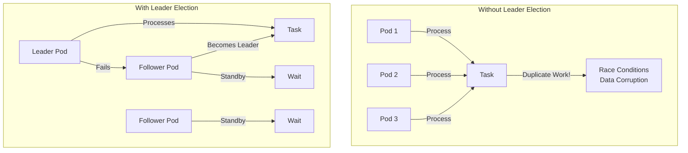

# How to Implement Leader Election in Kubernetes Pods

Author: [nawazdhandala](https://www.github.com/nawazdhandala)

Tags: Kubernetes, Leader Election, High Availability, Distributed Systems, Coordination, DevOps

Description: Learn how to implement leader election in Kubernetes to ensure only one pod handles critical tasks at a time while maintaining high availability with automatic failover.

---

Leader election is essential when you need exactly one instance of a workload to be active at any time-for schedulers, controllers, cron-like jobs, or any singleton pattern. Kubernetes provides primitives that make implementing leader election straightforward.

## Why Leader Election?



| Scenario | Without LE | With LE |
|----------|-----------|---------|
| Scheduler | Multiple conflicting schedules | Single source of truth |
| Cron jobs | Duplicate executions | Single execution |
| Controller | Race conditions | Coordinated updates |
| Singleton | N/A | Guaranteed single active |

## Method 1: Using Lease Objects (Recommended)

### Go Implementation

```go
// leader-election/main.go
package main

import (
    "context"
    "fmt"
    "os"
    "time"

    metav1 "k8s.io/apimachinery/pkg/apis/meta/v1"
    "k8s.io/client-go/kubernetes"
    "k8s.io/client-go/rest"
    "k8s.io/client-go/tools/leaderelection"
    "k8s.io/client-go/tools/leaderelection/resourcelock"
)

func main() {
    // Get in-cluster config
    config, err := rest.InClusterConfig()
    if err != nil {
        panic(err)
    }

    clientset, err := kubernetes.NewForConfig(config)
    if err != nil {
        panic(err)
    }

    // Get pod identity
    podName := os.Getenv("POD_NAME")
    namespace := os.Getenv("POD_NAMESPACE")
    
    if podName == "" || namespace == "" {
        panic("POD_NAME and POD_NAMESPACE must be set")
    }

    // Create lease lock
    lock := &resourcelock.LeaseLock{
        LeaseMeta: metav1.ObjectMeta{
            Name:      "my-controller-leader",
            Namespace: namespace,
        },
        Client: clientset.CoordinationV1(),
        LockConfig: resourcelock.ResourceLockConfig{
            Identity: podName,
        },
    }

    // Leader election config
    ctx, cancel := context.WithCancel(context.Background())
    defer cancel()

    leaderelection.RunOrDie(ctx, leaderelection.LeaderElectionConfig{
        Lock:            lock,
        ReleaseOnCancel: true,
        LeaseDuration:   15 * time.Second,
        RenewDeadline:   10 * time.Second,
        RetryPeriod:     2 * time.Second,
        Callbacks: leaderelection.LeaderCallbacks{
            OnStartedLeading: func(ctx context.Context) {
                // This pod is the leader - do work
                fmt.Println("Started leading")
                runLeader(ctx)
            },
            OnStoppedLeading: func() {
                // This pod lost leadership
                fmt.Println("Stopped leading")
                os.Exit(0)
            },
            OnNewLeader: func(identity string) {
                // New leader elected
                if identity == podName {
                    return // It's us
                }
                fmt.Printf("New leader: %s\n", identity)
            },
        },
    })
}

func runLeader(ctx context.Context) {
    // Your leader-only logic here
    ticker := time.NewTicker(5 * time.Second)
    defer ticker.Stop()

    for {
        select {
        case <-ctx.Done():
            fmt.Println("Leader context cancelled")
            return
        case <-ticker.C:
            fmt.Println("Performing leader tasks...")
            // Do your work
        }
    }
}
```

### Kubernetes Deployment

```yaml
# leader-election-deployment.yaml
apiVersion: apps/v1
kind: Deployment
metadata:
  name: my-controller
  namespace: production
spec:
  replicas: 3  # Multiple replicas for HA
  selector:
    matchLabels:
      app: my-controller
  template:
    metadata:
      labels:
        app: my-controller
    spec:
      serviceAccountName: my-controller
      containers:
        - name: controller
          image: myregistry/my-controller:v1.0.0
          env:
            - name: POD_NAME
              valueFrom:
                fieldRef:
                  fieldPath: metadata.name
            - name: POD_NAMESPACE
              valueFrom:
                fieldRef:
                  fieldPath: metadata.namespace
          resources:
            requests:
              cpu: 100m
              memory: 128Mi
            limits:
              cpu: 500m
              memory: 256Mi
---
apiVersion: v1
kind: ServiceAccount
metadata:
  name: my-controller
  namespace: production
---
apiVersion: rbac.authorization.k8s.io/v1
kind: Role
metadata:
  name: my-controller-leader-election
  namespace: production
rules:
  - apiGroups: ["coordination.k8s.io"]
    resources: ["leases"]
    verbs: ["get", "create", "update"]
---
apiVersion: rbac.authorization.k8s.io/v1
kind: RoleBinding
metadata:
  name: my-controller-leader-election
  namespace: production
roleRef:
  apiGroup: rbac.authorization.k8s.io
  kind: Role
  name: my-controller-leader-election
subjects:
  - kind: ServiceAccount
    name: my-controller
    namespace: production
```

## Method 2: Using ConfigMap Lock

```go
// configmap-leader-election.go
package main

import (
    "context"
    metav1 "k8s.io/apimachinery/pkg/apis/meta/v1"
    "k8s.io/client-go/kubernetes"
    "k8s.io/client-go/tools/leaderelection/resourcelock"
)

func createConfigMapLock(clientset *kubernetes.Clientset, name, namespace, identity string) *resourcelock.ConfigMapLock {
    return &resourcelock.ConfigMapLock{
        ConfigMapMeta: metav1.ObjectMeta{
            Name:      name,
            Namespace: namespace,
        },
        Client: clientset.CoreV1(),
        LockConfig: resourcelock.ResourceLockConfig{
            Identity: identity,
        },
    }
}
```

```yaml
# RBAC for ConfigMap lock
apiVersion: rbac.authorization.k8s.io/v1
kind: Role
metadata:
  name: my-controller-leader-election
  namespace: production
rules:
  - apiGroups: [""]
    resources: ["configmaps"]
    verbs: ["get", "create", "update"]
  - apiGroups: [""]
    resources: ["events"]
    verbs: ["create", "patch"]
```

## Method 3: Sidecar Pattern

### Sidecar Container

```yaml
# sidecar-leader-election.yaml
apiVersion: apps/v1
kind: Deployment
metadata:
  name: my-app-with-sidecar
  namespace: production
spec:
  replicas: 3
  selector:
    matchLabels:
      app: my-app
  template:
    metadata:
      labels:
        app: my-app
    spec:
      serviceAccountName: my-app
      containers:
        # Main application
        - name: my-app
          image: myregistry/my-app:v1.0.0
          ports:
            - containerPort: 8080
          env:
            # Leader election sidecar writes to this file
            - name: LEADER_ELECTION_FILE
              value: /leader-election/is-leader
          volumeMounts:
            - name: leader-election
              mountPath: /leader-election
          # Only process if leader
          lifecycle:
            postStart:
              exec:
                command:
                  - /bin/sh
                  - -c
                  - |
                    while [ ! -f /leader-election/is-leader ]; do
                      echo "Waiting to become leader..."
                      sleep 1
                    done
        
        # Leader election sidecar
        - name: leader-elector
          image: gcr.io/google_containers/leader-elector:0.5
          args:
            - --election=my-app-leader
            - --http=0.0.0.0:4040
            - --election-namespace=$(POD_NAMESPACE)
          env:
            - name: POD_NAMESPACE
              valueFrom:
                fieldRef:
                  fieldPath: metadata.namespace
          ports:
            - containerPort: 4040
          volumeMounts:
            - name: leader-election
              mountPath: /leader-election
          # Write leader status to shared volume
          lifecycle:
            postStart:
              exec:
                command:
                  - /bin/sh
                  - -c
                  - |
                    while true; do
                      if curl -s localhost:4040 | grep -q "$(hostname)"; then
                        touch /leader-election/is-leader
                      else
                        rm -f /leader-election/is-leader
                      fi
                      sleep 1
                    done
      
      volumes:
        - name: leader-election
          emptyDir: {}
```

## Method 4: Python Implementation

```python
# leader_election.py
import os
import time
import signal
import sys
from kubernetes import client, config
from kubernetes.leaderelection import leaderelection
from kubernetes.leaderelection.resourcelock.configmaplock import ConfigMapLock
from kubernetes.leaderelection import electionconfig

class LeaderElector:
    def __init__(self):
        self.is_leader = False
        self.should_stop = False
        
        # Setup signal handlers
        signal.signal(signal.SIGTERM, self.handle_signal)
        signal.signal(signal.SIGINT, self.handle_signal)
        
        # Load Kubernetes config
        try:
            config.load_incluster_config()
        except:
            config.load_kube_config()
        
        self.pod_name = os.environ.get('POD_NAME', 'unknown')
        self.namespace = os.environ.get('POD_NAMESPACE', 'default')
    
    def handle_signal(self, signum, frame):
        print(f"Received signal {signum}, shutting down...")
        self.should_stop = True
        sys.exit(0)
    
    def on_started_leading(self):
        print(f"Pod {self.pod_name} started leading")
        self.is_leader = True
        self.run_leader_tasks()
    
    def on_stopped_leading(self):
        print(f"Pod {self.pod_name} stopped leading")
        self.is_leader = False
    
    def on_new_leader(self, leader_identity):
        print(f"New leader elected: {leader_identity}")
        if leader_identity != self.pod_name:
            self.is_leader = False
    
    def run_leader_tasks(self):
        """Your leader-only logic here"""
        while self.is_leader and not self.should_stop:
            print("Performing leader tasks...")
            # Do your work here
            time.sleep(5)
    
    def run(self):
        lock = ConfigMapLock(
            name="my-app-leader",
            namespace=self.namespace,
            identity=self.pod_name
        )
        
        config = electionconfig.Config(
            lock=lock,
            lease_duration=15,
            renew_deadline=10,
            retry_period=2,
            onstarted_leading=self.on_started_leading,
            onstopped_leading=self.on_stopped_leading,
        )
        
        leaderelection.LeaderElection(config).run()

if __name__ == "__main__":
    elector = LeaderElector()
    elector.run()
```

### Python Deployment

```yaml
# python-leader-election.yaml
apiVersion: apps/v1
kind: Deployment
metadata:
  name: python-leader-app
  namespace: production
spec:
  replicas: 3
  selector:
    matchLabels:
      app: python-leader-app
  template:
    metadata:
      labels:
        app: python-leader-app
    spec:
      serviceAccountName: python-leader-app
      containers:
        - name: app
          image: myregistry/python-leader-app:v1.0.0
          env:
            - name: POD_NAME
              valueFrom:
                fieldRef:
                  fieldPath: metadata.name
            - name: POD_NAMESPACE
              valueFrom:
                fieldRef:
                  fieldPath: metadata.namespace
          resources:
            requests:
              cpu: 100m
              memory: 128Mi
```

## Method 5: Using Controller-Runtime (Kubernetes Operators)

```go
// operator-leader-election.go
package main

import (
    "os"
    ctrl "sigs.k8s.io/controller-runtime"
    "sigs.k8s.io/controller-runtime/pkg/manager"
)

func main() {
    mgr, err := ctrl.NewManager(ctrl.GetConfigOrDie(), manager.Options{
        // Enable leader election
        LeaderElection:          true,
        LeaderElectionID:        "my-operator-leader",
        LeaderElectionNamespace: os.Getenv("POD_NAMESPACE"),
        
        // Leader election config
        LeaseDuration: &[]time.Duration{15 * time.Second}[0],
        RenewDeadline: &[]time.Duration{10 * time.Second}[0],
        RetryPeriod:   &[]time.Duration{2 * time.Second}[0],
    })
    
    if err != nil {
        os.Exit(1)
    }
    
    // Setup controllers
    // ...
    
    if err := mgr.Start(ctrl.SetupSignalHandler()); err != nil {
        os.Exit(1)
    }
}
```

## Verifying Leader Election

### Check Lease Object

```bash
# View lease
kubectl get lease -n production my-controller-leader -o yaml

# Output:
# apiVersion: coordination.k8s.io/v1
# kind: Lease
# metadata:
#   name: my-controller-leader
#   namespace: production
# spec:
#   acquireTime: "2024-01-15T10:00:00Z"
#   holderIdentity: my-controller-5d4c6b7f8-abc12
#   leaseDurationSeconds: 15
#   leaseTransitions: 3
#   renewTime: "2024-01-15T10:05:30Z"
```

### Monitor Leader Changes

```bash
# Watch lease changes
kubectl get lease -n production -w

# Check which pod is leader
kubectl get lease my-controller-leader -n production \
  -o jsonpath='{.spec.holderIdentity}'

# View leader election events
kubectl get events -n production | grep -i leader
```

## High Availability Considerations

### Pod Disruption Budget

```yaml
# leader-election-pdb.yaml
apiVersion: policy/v1
kind: PodDisruptionBudget
metadata:
  name: my-controller-pdb
  namespace: production
spec:
  minAvailable: 1  # Always keep at least one pod
  selector:
    matchLabels:
      app: my-controller
```

### Anti-Affinity for HA

```yaml
# ha-leader-election.yaml
apiVersion: apps/v1
kind: Deployment
metadata:
  name: my-controller
spec:
  replicas: 3
  template:
    spec:
      affinity:
        podAntiAffinity:
          preferredDuringSchedulingIgnoredDuringExecution:
            - weight: 100
              podAffinityTerm:
                labelSelector:
                  matchLabels:
                    app: my-controller
                topologyKey: kubernetes.io/hostname
```

### Topology Spread

```yaml
topologySpreadConstraints:
  - maxSkew: 1
    topologyKey: topology.kubernetes.io/zone
    whenUnsatisfiable: ScheduleAnyway
    labelSelector:
      matchLabels:
        app: my-controller
```

## Monitoring Leader Election

### Prometheus Metrics

```go
// metrics.go
import (
    "github.com/prometheus/client_golang/prometheus"
    "github.com/prometheus/client_golang/prometheus/promauto"
)

var (
    leaderGauge = promauto.NewGauge(prometheus.GaugeOpts{
        Name: "leader_election_is_leader",
        Help: "Whether this pod is the leader (1) or not (0)",
    })

    leaderTransitions = promauto.NewCounter(prometheus.CounterOpts{
        Name: "leader_election_transitions_total",
        Help: "Total number of leader transitions",
    })
)

// In leader callbacks
func OnStartedLeading(ctx context.Context) {
    leaderGauge.Set(1)
    leaderTransitions.Inc()
}

func OnStoppedLeading() {
    leaderGauge.Set(0)
}
```

### Alerts

```yaml
# leader-election-alerts.yaml
apiVersion: monitoring.coreos.com/v1
kind: PrometheusRule
metadata:
  name: leader-election-alerts
  namespace: monitoring
spec:
  groups:
    - name: leader-election
      rules:
        - alert: NoLeaderElected
          expr: sum(leader_election_is_leader) == 0
          for: 2m
          labels:
            severity: critical
          annotations:
            summary: "No leader elected for {{ $labels.app }}"
            description: "No pod has acquired leadership for {{ $labels.app }} in the last 2 minutes"
        
        - alert: FrequentLeaderTransitions
          expr: increase(leader_election_transitions_total[10m]) > 5
          labels:
            severity: warning
          annotations:
            summary: "Frequent leader transitions detected"
            description: "{{ $value }} leader transitions in the last 10 minutes"
```

## Summary

| Method | Complexity | Best For |
|--------|------------|----------|
| Lease Lock | Low | New applications |
| ConfigMap Lock | Low | Legacy compatibility |
| Sidecar | Medium | Language-agnostic |
| Controller-Runtime | Low | Kubernetes operators |

## Related Posts

- [How to Run Kubernetes DaemonSets for Node-Level Services](https://oneuptime.com/blog/post/2026-01-19-kubernetes-daemonsets-node-services/view) - Node-level services
- [How to Set Up Pod Disruption Budgets for High Availability](https://oneuptime.com/blog/post/2026-01-19-kubernetes-pod-disruption-budgets-ha/view) - Maintaining availability
- [How to Handle Kubernetes Pod Lifecycle Hooks](https://oneuptime.com/blog/post/2026-01-25-pod-lifecycle-hooks-prestop-poststart/view) - Graceful transitions
