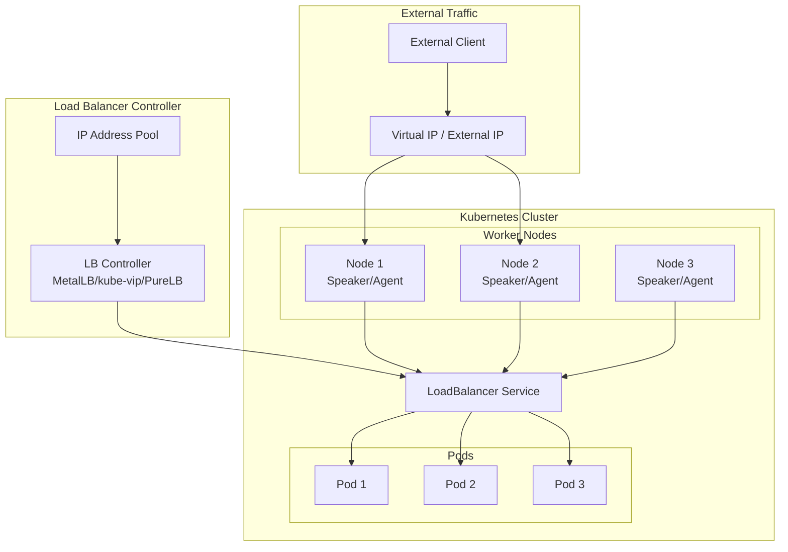
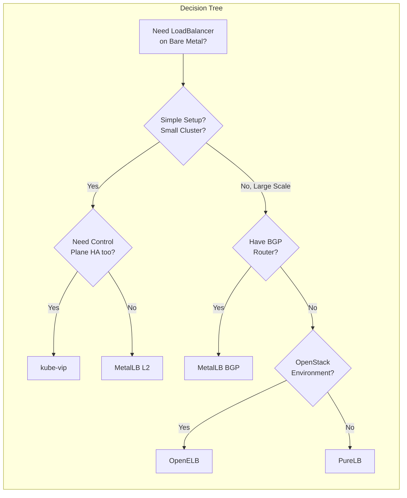

# How to Set Up Kubernetes LoadBalancer Services Without Cloud Provider

Author: [nawazdhandala](https://www.github.com/nawazdhandala)

Tags: Kubernetes, LoadBalancer, MetalLB, Bare Metal, Networking, kube-vip, PureLB, OpenELB

Description: Running Kubernetes on bare metal or on-premises? Learn how to expose services with LoadBalancer type using MetalLB, kube-vip, PureLB, and other alternatives for production-ready load balancing.

---

When you create a Service with `type: LoadBalancer` in a cloud-managed Kubernetes cluster, the cloud provider automatically provisions an external load balancer and assigns it a public IP. But what happens when you're running Kubernetes on bare metal, in a private data center, or in a homelab?

Without a cloud controller manager, your LoadBalancer services remain stuck in `Pending` state forever, waiting for an external IP that never comes.

This guide explores multiple solutions to bring LoadBalancer functionality to non-cloud Kubernetes environments.

## Understanding the Problem

When you create a LoadBalancer service without a cloud provider:

```yaml
# service-loadbalancer.yaml
# This service will remain pending without a load balancer implementation
apiVersion: v1
kind: Service
metadata:
  name: my-app
  namespace: default
spec:
  # LoadBalancer type requests an external IP from the cloud provider
  # On bare metal, this will stay "Pending" indefinitely without a solution
  type: LoadBalancer
  ports:
    - port: 80
      targetPort: 8080
      protocol: TCP
  selector:
    app: my-app
```

Checking the service shows the problem:

```bash
# The EXTERNAL-IP remains <pending> without a load balancer controller
kubectl get svc my-app

# Output:
# NAME     TYPE           CLUSTER-IP     EXTERNAL-IP   PORT(S)        AGE
# my-app   LoadBalancer   10.96.45.123   <pending>     80:31234/TCP   5m
```

## Architecture Overview

Here's how LoadBalancer implementations work in Kubernetes:



## Solution 1: MetalLB (Most Popular)

MetalLB is the most widely adopted solution for bare-metal LoadBalancer services. It supports two modes: Layer 2 (ARP/NDP) and BGP.

### Installing MetalLB

```bash
# Install MetalLB using the official manifests
# This creates the metallb-system namespace and deploys the controller + speakers
kubectl apply -f https://raw.githubusercontent.com/metallb/metallb/v0.14.5/config/manifests/metallb-native.yaml

# Wait for MetalLB pods to be ready
kubectl wait --namespace metallb-system \
  --for=condition=ready pod \
  --selector=app=metallb \
  --timeout=90s
```

### Layer 2 Mode Configuration

Layer 2 mode is the simplest to set up and works in any network environment:

```yaml
# metallb-config-l2.yaml
# Layer 2 mode uses ARP (IPv4) or NDP (IPv6) to announce IPs
# One node becomes the "leader" for each IP and responds to ARP requests
---
apiVersion: metallb.io/v1beta1
kind: IPAddressPool
metadata:
  name: default-pool
  namespace: metallb-system
spec:
  # Define the IP range that MetalLB can assign to LoadBalancer services
  # This range must be:
  # 1. Routable from your network (same subnet as nodes, or routed to nodes)
  # 2. Not used by any other devices (DHCP excluded, static IPs avoided)
  # 3. Reserved exclusively for MetalLB
  addresses:
    - 192.168.1.240-192.168.1.250  # A range of 11 IPs for services
    # You can also specify CIDR notation:
    # - 192.168.1.240/28
    # Or mix ranges and single IPs:
    # - 10.0.0.100-10.0.0.110
    # - 10.0.0.200/32

---
apiVersion: metallb.io/v1beta1
kind: L2Advertisement
metadata:
  name: default-l2-advertisement
  namespace: metallb-system
spec:
  # Reference the IP pool(s) to advertise via Layer 2
  ipAddressPools:
    - default-pool
  # Optionally limit which nodes can advertise IPs
  # nodeSelectors:
  #   - matchLabels:
  #       node-role.kubernetes.io/loadbalancer: "true"
```

```bash
# Apply the configuration
kubectl apply -f metallb-config-l2.yaml
```

### BGP Mode Configuration

For larger deployments, BGP mode provides better load distribution:

```yaml
# metallb-config-bgp.yaml
# BGP mode announces IPs to your network router via BGP protocol
# Requires a BGP-capable router (most enterprise routers, or software like FRR)
---
apiVersion: metallb.io/v1beta1
kind: IPAddressPool
metadata:
  name: bgp-pool
  namespace: metallb-system
spec:
  addresses:
    - 10.100.0.0/24  # Dedicated subnet for LoadBalancer IPs

---
apiVersion: metallb.io/v1beta1
kind: BGPAdvertisement
metadata:
  name: bgp-advertisement
  namespace: metallb-system
spec:
  ipAddressPools:
    - bgp-pool
  # Optional: Aggregate routes to reduce BGP table size
  # aggregationLength: 32
  # Optional: Set BGP communities for traffic engineering
  # communities:
  #   - 65535:65282  # NO_ADVERTISE - keep routes local

---
apiVersion: metallb.io/v1beta1
kind: BGPPeer
metadata:
  name: router-peer
  namespace: metallb-system
spec:
  # Your router's IP address
  peerAddress: 192.168.1.1
  # Your router's AS number (get this from your network team)
  peerASN: 64512
  # AS number for your Kubernetes cluster (choose a private AS: 64512-65534)
  myASN: 64513
  # Optional: Limit which nodes establish BGP sessions
  # nodeSelectors:
  #   - matchLabels:
  #       node-role.kubernetes.io/bgp: "true"
```

### Testing MetalLB

```bash
# Create a test deployment and service
kubectl create deployment nginx --image=nginx --replicas=3

# Expose it as a LoadBalancer service
kubectl expose deployment nginx --port=80 --type=LoadBalancer

# Check that an external IP is assigned
kubectl get svc nginx

# Output should show an IP from your pool:
# NAME    TYPE           CLUSTER-IP     EXTERNAL-IP     PORT(S)        AGE
# nginx   LoadBalancer   10.96.78.234   192.168.1.240   80:32456/TCP   30s

# Test connectivity from outside the cluster
curl http://192.168.1.240
```

For more details on MetalLB configuration, check out our guide on [configuring MetalLB with MicroK8s](https://oneuptime.com/blog/post/configure-metallb-with-kubernetes-microk8s/view).

## Solution 2: kube-vip

kube-vip provides both control plane HA and LoadBalancer services in a single solution. It's particularly popular for kubeadm clusters.

### Installing kube-vip for LoadBalancer Services

```bash
# Install kube-vip as a DaemonSet for LoadBalancer functionality
kubectl apply -f https://kube-vip.io/manifests/rbac.yaml

# Create the kube-vip cloud controller configmap
cat <<EOF | kubectl apply -f -
apiVersion: v1
kind: ConfigMap
metadata:
  name: kubevip
  namespace: kube-system
data:
  # IP range for LoadBalancer services
  range-global: 192.168.1.200-192.168.1.210
EOF
```

```yaml
# kube-vip-cloud-controller.yaml
# The cloud controller watches for LoadBalancer services and assigns IPs
apiVersion: apps/v1
kind: Deployment
metadata:
  name: kube-vip-cloud-provider
  namespace: kube-system
spec:
  replicas: 1
  selector:
    matchLabels:
      app: kube-vip-cloud-provider
  template:
    metadata:
      labels:
        app: kube-vip-cloud-provider
    spec:
      serviceAccountName: kube-vip-cloud-controller
      containers:
        - name: kube-vip-cloud-provider
          image: ghcr.io/kube-vip/kube-vip-cloud-provider:v0.0.7
          # The cloud provider assigns IPs from the configmap range
          imagePullPolicy: IfNotPresent
      tolerations:
        - key: node-role.kubernetes.io/control-plane
          effect: NoSchedule
```

```yaml
# kube-vip-daemonset.yaml
# DaemonSet that handles the actual IP advertisement
apiVersion: apps/v1
kind: DaemonSet
metadata:
  name: kube-vip-ds
  namespace: kube-system
spec:
  selector:
    matchLabels:
      app: kube-vip-ds
  template:
    metadata:
      labels:
        app: kube-vip-ds
    spec:
      serviceAccountName: kube-vip
      hostNetwork: true  # Required for ARP/BGP announcements
      containers:
        - name: kube-vip
          image: ghcr.io/kube-vip/kube-vip:v0.7.2
          args:
            - manager
          env:
            # Enable services mode (LoadBalancer functionality)
            - name: vip_servicesinterface
              value: "eth0"  # Change to your node's interface name
            - name: svc_enable
              value: "true"
            - name: svc_leasename
              value: plndr-svcs-lock
            # Enable ARP mode for Layer 2
            - name: vip_arp
              value: "true"
            # Enable leader election for HA
            - name: vip_leaderelection
              value: "true"
          securityContext:
            capabilities:
              add:
                - NET_ADMIN
                - NET_RAW
```

### kube-vip with BGP

```yaml
# kube-vip-bgp.yaml
# For BGP mode, modify the DaemonSet environment variables
env:
  - name: svc_enable
    value: "true"
  # Disable ARP, enable BGP
  - name: vip_arp
    value: "false"
  - name: bgp_enable
    value: "true"
  # BGP configuration
  - name: bgp_routerid
    valueFrom:
      fieldRef:
        fieldPath: status.podIP
  - name: bgp_as
    value: "64513"  # Your cluster's AS number
  - name: bgp_peeraddress
    value: "192.168.1.1"  # Router IP
  - name: bgp_peeras
    value: "64512"  # Router's AS number
```

## Solution 3: PureLB

PureLB is a newer alternative that focuses on simplicity and native Kubernetes integration:

```bash
# Install PureLB using Helm
helm repo add purelb https://gitlab.com/api/v4/projects/purelb%2Fpurelb/packages/helm/stable
helm repo update

helm install purelb purelb/purelb \
  --namespace purelb \
  --create-namespace
```

```yaml
# purelb-config.yaml
# ServiceGroup defines a pool of IPs for PureLB
apiVersion: purelb.io/v1
kind: ServiceGroup
metadata:
  name: default
  namespace: purelb
spec:
  local:
    # IP range for LoadBalancer services
    # PureLB uses a virtual network interface approach
    v4pool:
      subnet: 192.168.1.224/27
      pool: 192.168.1.230-192.168.1.250
      aggregation: default

---
# LBNodeAgent configures how PureLB operates on nodes
apiVersion: purelb.io/v1
kind: LBNodeAgent
metadata:
  name: default
  namespace: purelb
spec:
  local:
    # Interface to use for virtual IPs
    # PureLB creates virtual interfaces rather than using ARP
    extlbint: kube-lb0
```

## Solution 4: OpenELB (for Kubernetes on OpenStack)

OpenELB (formerly PorterLB) is designed for hybrid environments:

```bash
# Install OpenELB
kubectl apply -f https://raw.githubusercontent.com/openelb/openelb/master/deploy/openelb.yaml
```

```yaml
# openelb-config.yaml
# Eip (External IP) resource defines the IP pool
apiVersion: network.kubesphere.io/v1alpha2
kind: Eip
metadata:
  name: default-pool
spec:
  # IP range for LoadBalancer services
  address: 192.168.1.200-192.168.1.220
  # Protocol: layer2 or bgp
  protocol: layer2
  # Interface for ARP announcements
  interface: eth0
  # Disable IP if not used (optional)
  disable: false

---
# For BGP mode, you need a BgpConf and BgpPeer
apiVersion: network.kubesphere.io/v1alpha2
kind: BgpConf
metadata:
  name: default
spec:
  as: 64513
  routerId: 192.168.1.100
  listenPort: 17900

---
apiVersion: network.kubesphere.io/v1alpha2
kind: BgpPeer
metadata:
  name: router
spec:
  conf:
    neighborAddress: 192.168.1.1
    peerAs: 64512
```

## Comparison: Choosing the Right Solution

Here's how these solutions compare:



| Feature | MetalLB | kube-vip | PureLB | OpenELB |
|---------|---------|----------|--------|---------|
| Layer 2 Mode | ✅ | ✅ | ✅ | ✅ |
| BGP Mode | ✅ | ✅ | ❌ | ✅ |
| Control Plane HA | ❌ | ✅ | ❌ | ❌ |
| Maturity | High | Medium | Medium | Medium |
| Community | Large | Growing | Small | Medium |
| Configuration | CRDs | Env/CRDs | CRDs | CRDs |
| Best For | General use | kubeadm HA | Simple setups | OpenStack |

## Production Best Practices

### 1. Reserve IPs Properly

```yaml
# Ensure your IP pools don't conflict with:
# - DHCP ranges
# - Existing static IPs
# - Other infrastructure (routers, switches, etc.)

# Example: Document your IP allocation
# 192.168.1.1-192.168.1.99: Infrastructure (routers, switches)
# 192.168.1.100-192.168.1.199: DHCP for workstations
# 192.168.1.200-192.168.1.220: Kubernetes nodes
# 192.168.1.240-192.168.1.250: MetalLB pool (LoadBalancer services)
```

### 2. Use Multiple IP Pools

```yaml
# metallb-multi-pool.yaml
# Separate pools for different purposes
apiVersion: metallb.io/v1beta1
kind: IPAddressPool
metadata:
  name: production-pool
  namespace: metallb-system
spec:
  addresses:
    - 10.0.1.0/24
  # Auto-assign prevents manual IP requests
  autoAssign: true

---
apiVersion: metallb.io/v1beta1
kind: IPAddressPool
metadata:
  name: staging-pool
  namespace: metallb-system
spec:
  addresses:
    - 10.0.2.0/24
  autoAssign: true

---
# Request specific pool using annotation
apiVersion: v1
kind: Service
metadata:
  name: my-app
  annotations:
    # Request IP from specific pool
    metallb.universe.tf/address-pool: production-pool
spec:
  type: LoadBalancer
  # ... rest of spec
```

### 3. Request Specific IPs

```yaml
# service-specific-ip.yaml
# Sometimes you need a predictable IP (for DNS, firewall rules, etc.)
apiVersion: v1
kind: Service
metadata:
  name: api-gateway
  annotations:
    # MetalLB annotation for specific IP
    metallb.universe.tf/loadBalancerIPs: 192.168.1.240
spec:
  type: LoadBalancer
  # Alternatively, use the standard field (Kubernetes 1.24+)
  loadBalancerIP: 192.168.1.240
  ports:
    - port: 443
      targetPort: 8443
  selector:
    app: api-gateway
```

### 4. Monitor Your Load Balancer

```yaml
# servicemonitor-metallb.yaml
# Monitor MetalLB with Prometheus
apiVersion: monitoring.coreos.com/v1
kind: ServiceMonitor
metadata:
  name: metallb
  namespace: metallb-system
spec:
  selector:
    matchLabels:
      app.kubernetes.io/name: metallb
  endpoints:
    - port: metrics
      interval: 30s
```

Key metrics to watch:
- `metallb_bgp_session_up` - BGP session health
- `metallb_allocator_addresses_in_use_total` - IP usage
- `metallb_allocator_addresses_total` - Total IPs available

### 5. Handle Failover Properly

```yaml
# For Layer 2 mode, understand failover behavior
# When the leader node fails, another node takes over
# This causes a brief (1-3 second) disruption

# To minimize disruption, use BGP with ECMP:
apiVersion: metallb.io/v1beta1
kind: BGPAdvertisement
metadata:
  name: ecmp-advertisement
  namespace: metallb-system
spec:
  ipAddressPools:
    - default-pool
  # Announce from all nodes for true load balancing
  # Your router must support ECMP (Equal-Cost Multi-Path)
```

## Troubleshooting

### Service Stuck in Pending

```bash
# Check if MetalLB pods are running
kubectl get pods -n metallb-system

# Check MetalLB logs for errors
kubectl logs -n metallb-system -l app=metallb -c controller

# Verify IP pool has available addresses
kubectl get ipaddresspool -n metallb-system -o yaml

# Check for conflicting IP usage (from another device)
arping -c 3 192.168.1.240
```

### Can't Reach LoadBalancer IP

```bash
# Check which node is announcing the IP (Layer 2 mode)
kubectl logs -n metallb-system -l component=speaker | grep "announcing"

# Verify the service has endpoints
kubectl get endpoints my-app

# Check if pods are ready
kubectl get pods -l app=my-app

# Test from the same network segment
# Layer 2 only works within the same broadcast domain
ping 192.168.1.240
```

### BGP Session Not Establishing

```bash
# Check BGP peer status
kubectl get bgppeer -n metallb-system -o yaml

# Check speaker logs for BGP errors
kubectl logs -n metallb-system -l component=speaker | grep -i bgp

# Verify network connectivity to router
kubectl exec -n metallb-system -it $(kubectl get pod -n metallb-system -l component=speaker -o jsonpath='{.items[0].metadata.name}') -- ping 192.168.1.1

# Common issues:
# - Firewall blocking TCP port 179 (BGP)
# - Wrong AS numbers
# - Router not configured to accept BGP connections
```

## Conclusion

Running Kubernetes without a cloud provider doesn't mean you have to give up LoadBalancer services. MetalLB remains the most popular and battle-tested solution for most use cases. For clusters that also need control plane HA, kube-vip offers an integrated solution.

Key takeaways:

1. **Start with MetalLB Layer 2** - It's the simplest to set up and works in any network
2. **Graduate to BGP** - When you need true load distribution or have many services
3. **Plan your IP allocation** - Reserve a dedicated range that won't conflict with other systems
4. **Monitor your load balancer** - IP exhaustion and session failures can cause outages

For monitoring your LoadBalancer services and the applications behind them, check out [OneUptime's Kubernetes monitoring capabilities](https://oneuptime.com/product/metrics).

## Related Resources

- [Configuring MetalLB with MicroK8s](https://oneuptime.com/blog/post/configure-metallb-with-kubernetes-microk8s/view)
- [Moving from AWS to Bare Metal](https://oneuptime.com/blog/post/moving-from-aws-to-bare-metal/view)
- [How to Set Up Health Checks for Kubernetes](https://oneuptime.com/blog/post/python-health-checks-kubernetes/view)
