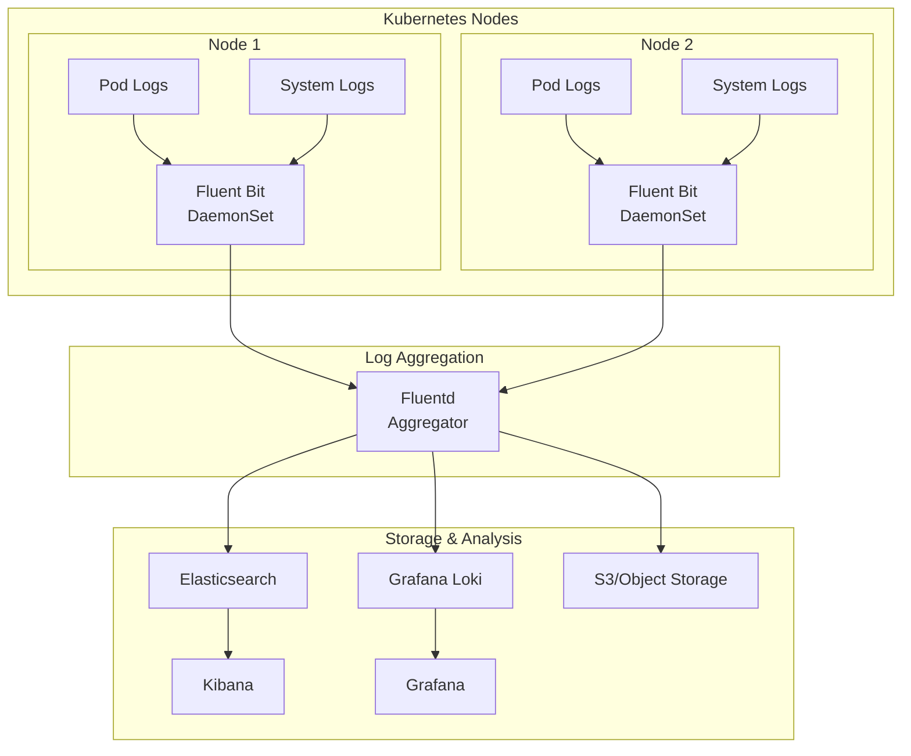

# How to Set Up Kubernetes Cluster Logging with Fluentd and Fluent Bit

Author: [nawazdhandala](https://www.github.com/nawazdhandala)

Tags: Kubernetes, Logging, Fluentd, Fluent Bit, Elasticsearch, Observability, EFK Stack

Description: Learn how to implement centralized logging in Kubernetes using Fluentd or Fluent Bit to collect, process, and ship logs to Elasticsearch, Loki, or other backends.

---

Centralized logging is essential for operating Kubernetes clusters at scale. With containers being ephemeral and distributed across nodes, you need a reliable way to collect, aggregate, and search logs from all your workloads.

This guide covers setting up a production-ready logging pipeline using Fluent Bit (lightweight) or Fluentd (feature-rich).

## Architecture Overview



## Fluent Bit vs Fluentd

| Feature | Fluent Bit | Fluentd |
|---------|------------|---------|
| Memory Footprint | ~450KB | ~40MB |
| Dependencies | None (C) | Ruby runtime |
| Plugins | 70+ built-in | 1000+ available |
| Use Case | Edge/Node collection | Aggregation/Processing |
| Performance | Higher throughput | More flexible |

**Recommendation**: Use Fluent Bit on nodes (DaemonSet) and optionally Fluentd as an aggregator for complex processing.

## Fluent Bit Setup

### Basic Fluent Bit DaemonSet

```yaml
# fluent-bit/namespace.yaml
apiVersion: v1
kind: Namespace
metadata:
  name: logging
```

```yaml
# fluent-bit/serviceaccount.yaml
apiVersion: v1
kind: ServiceAccount
metadata:
  name: fluent-bit
  namespace: logging

---
apiVersion: rbac.authorization.k8s.io/v1
kind: ClusterRole
metadata:
  name: fluent-bit
rules:
  - apiGroups: [""]
    resources:
      - namespaces
      - pods
      - pods/logs
    verbs: ["get", "list", "watch"]

---
apiVersion: rbac.authorization.k8s.io/v1
kind: ClusterRoleBinding
metadata:
  name: fluent-bit
roleRef:
  apiGroup: rbac.authorization.k8s.io
  kind: ClusterRole
  name: fluent-bit
subjects:
  - kind: ServiceAccount
    name: fluent-bit
    namespace: logging
```

```yaml
# fluent-bit/configmap.yaml
apiVersion: v1
kind: ConfigMap
metadata:
  name: fluent-bit-config
  namespace: logging
data:
  fluent-bit.conf: |
    [SERVICE]
        # Flush logs every 5 seconds
        Flush         5
        # Log level for Fluent Bit itself
        Log_Level     info
        # Enable built-in HTTP server for metrics
        HTTP_Server   On
        HTTP_Listen   0.0.0.0
        HTTP_Port     2020
        # Parse configuration
        Parsers_File  parsers.conf

    [INPUT]
        # Tail container logs from all pods
        Name              tail
        Tag               kube.*
        Path              /var/log/containers/*.log
        # Use Docker or CRI parser based on container runtime
        Parser            cri
        # Start from the beginning of the file
        Read_from_Head    true
        # Memory buffer limit
        Mem_Buf_Limit     50MB
        # Skip long lines
        Skip_Long_Lines   On
        # Refresh interval for watching new files
        Refresh_Interval  10
        # Database file for tracking position
        DB                /var/log/fluent-bit-containers.db
        DB.Sync           Normal

    [INPUT]
        # Collect systemd/journal logs
        Name              systemd
        Tag               systemd.*
        # Read from systemd journal
        Read_From_Tail    On
        DB                /var/log/fluent-bit-systemd.db

    [FILTER]
        # Enrich logs with Kubernetes metadata
        Name                kubernetes
        Match               kube.*
        # API server connection
        Kube_URL            https://kubernetes.default.svc:443
        Kube_CA_File        /var/run/secrets/kubernetes.io/serviceaccount/ca.crt
        Kube_Token_File     /var/run/secrets/kubernetes.io/serviceaccount/token
        # Merge log field into record
        Merge_Log           On
        Merge_Log_Key       log_processed
        # Keep original kubernetes metadata
        K8S-Logging.Parser  On
        K8S-Logging.Exclude Off
        # Cache metadata for performance
        Kube_Meta_Cache_TTL 300s

    [FILTER]
        # Remove unnecessary fields to reduce storage
        Name          record_modifier
        Match         kube.*
        Remove_key    stream
        Remove_key    _p

    [OUTPUT]
        # Send to Elasticsearch
        Name            es
        Match           kube.*
        Host            elasticsearch.logging.svc.cluster.local
        Port            9200
        # Use Logstash format for indices
        Logstash_Format On
        Logstash_Prefix kubernetes
        # Retry on failure
        Retry_Limit     5
        # Buffer size
        Buffer_Size     512KB
        # Replace dots in field names (ES doesn't like dots)
        Replace_Dots    On
        # Suppress type name (deprecated in ES 7+)
        Suppress_Type_Name On

    [OUTPUT]
        # Also output to stdout for debugging
        Name            stdout
        Match           kube.*
        Format          json_lines

  parsers.conf: |
    [PARSER]
        # Parser for CRI container runtime (containerd, CRI-O)
        Name        cri
        Format      regex
        Regex       ^(?<time>[^ ]+) (?<stream>stdout|stderr) (?<logtag>[^ ]*) (?<log>.*)$
        Time_Key    time
        Time_Format %Y-%m-%dT%H:%M:%S.%L%z

    [PARSER]
        # Parser for Docker container runtime
        Name        docker
        Format      json
        Time_Key    time
        Time_Format %Y-%m-%dT%H:%M:%S.%L
        Time_Keep   On

    [PARSER]
        # JSON parser for application logs
        Name        json
        Format      json
        Time_Key    timestamp
        Time_Format %Y-%m-%dT%H:%M:%S.%L%z
```

```yaml
# fluent-bit/daemonset.yaml
apiVersion: apps/v1
kind: DaemonSet
metadata:
  name: fluent-bit
  namespace: logging
  labels:
    app: fluent-bit
spec:
  selector:
    matchLabels:
      app: fluent-bit
  template:
    metadata:
      labels:
        app: fluent-bit
      annotations:
        # Prometheus metrics scraping
        prometheus.io/scrape: "true"
        prometheus.io/port: "2020"
        prometheus.io/path: /api/v1/metrics/prometheus
    spec:
      serviceAccountName: fluent-bit
      # Tolerate all taints to run on every node
      tolerations:
        - operator: Exists
      containers:
        - name: fluent-bit
          image: fluent/fluent-bit:2.2
          ports:
            - containerPort: 2020
              name: metrics
          volumeMounts:
            # Mount host log directories
            - name: varlog
              mountPath: /var/log
              readOnly: true
            # Mount container runtime logs (for containerd)
            - name: containers
              mountPath: /var/lib/docker/containers
              readOnly: true
            # Mount configuration
            - name: config
              mountPath: /fluent-bit/etc/
          resources:
            requests:
              cpu: 100m
              memory: 128Mi
            limits:
              cpu: 500m
              memory: 256Mi
          # Liveness probe
          livenessProbe:
            httpGet:
              path: /
              port: 2020
            initialDelaySeconds: 10
            periodSeconds: 10
      volumes:
        - name: varlog
          hostPath:
            path: /var/log
        - name: containers
          hostPath:
            path: /var/lib/docker/containers
        - name: config
          configMap:
            name: fluent-bit-config
```

### Fluent Bit to Grafana Loki

```yaml
# fluent-bit/configmap-loki.yaml
apiVersion: v1
kind: ConfigMap
metadata:
  name: fluent-bit-config
  namespace: logging
data:
  fluent-bit.conf: |
    [SERVICE]
        Flush         5
        Log_Level     info
        HTTP_Server   On
        HTTP_Listen   0.0.0.0
        HTTP_Port     2020
        Parsers_File  parsers.conf

    [INPUT]
        Name              tail
        Tag               kube.*
        Path              /var/log/containers/*.log
        Parser            cri
        Mem_Buf_Limit     50MB
        Skip_Long_Lines   On
        Refresh_Interval  10
        DB                /var/log/fluent-bit.db

    [FILTER]
        Name                kubernetes
        Match               kube.*
        Kube_URL            https://kubernetes.default.svc:443
        Kube_CA_File        /var/run/secrets/kubernetes.io/serviceaccount/ca.crt
        Kube_Token_File     /var/run/secrets/kubernetes.io/serviceaccount/token
        Merge_Log           On
        K8S-Logging.Parser  On
        K8S-Logging.Exclude Off

    [OUTPUT]
        # Send to Grafana Loki
        Name                    loki
        Match                   kube.*
        Host                    loki.logging.svc.cluster.local
        Port                    3100
        # Labels for Loki streams
        Labels                  job=fluent-bit
        # Additional labels from Kubernetes metadata
        Label_Keys              $kubernetes['namespace_name'],$kubernetes['pod_name'],$kubernetes['container_name']
        # Remove label key prefix
        Remove_Keys             kubernetes,stream
        # Auto-create labels from kubernetes metadata
        Auto_Kubernetes_Labels  On
        # Line format
        Line_Format             json
```

## Fluentd Aggregator Setup

For complex log processing, use Fluentd as an aggregator:

```yaml
# fluentd/configmap.yaml
apiVersion: v1
kind: ConfigMap
metadata:
  name: fluentd-config
  namespace: logging
data:
  fluent.conf: |
    # Accept logs from Fluent Bit
    <source>
      @type forward
      port 24224
      bind 0.0.0.0
    </source>

    # Parse JSON logs
    <filter kube.**>
      @type parser
      key_name log
      reserve_data true
      remove_key_name_field true
      <parse>
        @type json
      </parse>
    </filter>

    # Add additional fields
    <filter kube.**>
      @type record_transformer
      <record>
        cluster_name ${ENV['CLUSTER_NAME']}
        hostname ${hostname}
      </record>
    </filter>

    # Route logs based on namespace
    <match kube.production.**>
      @type elasticsearch
      host elasticsearch.logging.svc.cluster.local
      port 9200
      logstash_format true
      logstash_prefix production
      <buffer>
        @type file
        path /var/log/fluentd-buffers/production
        flush_mode interval
        flush_interval 5s
        retry_type exponential_backoff
        retry_forever true
        chunk_limit_size 8MB
        queue_limit_length 512
      </buffer>
    </match>

    <match kube.staging.**>
      @type elasticsearch
      host elasticsearch.logging.svc.cluster.local
      port 9200
      logstash_format true
      logstash_prefix staging
      <buffer>
        @type file
        path /var/log/fluentd-buffers/staging
        flush_mode interval
        flush_interval 10s
      </buffer>
    </match>

    # Default: all other logs
    <match **>
      @type elasticsearch
      host elasticsearch.logging.svc.cluster.local
      port 9200
      logstash_format true
      logstash_prefix kubernetes
      <buffer>
        @type file
        path /var/log/fluentd-buffers/default
        flush_mode interval
        flush_interval 5s
      </buffer>
    </match>
```

```yaml
# fluentd/deployment.yaml
apiVersion: apps/v1
kind: Deployment
metadata:
  name: fluentd
  namespace: logging
spec:
  replicas: 2
  selector:
    matchLabels:
      app: fluentd
  template:
    metadata:
      labels:
        app: fluentd
    spec:
      containers:
        - name: fluentd
          image: fluent/fluentd-kubernetes-daemonset:v1.16-debian-elasticsearch8
          env:
            - name: CLUSTER_NAME
              value: "production"
          ports:
            - containerPort: 24224
              name: forward
          volumeMounts:
            - name: config
              mountPath: /fluentd/etc/
            - name: buffer
              mountPath: /var/log/fluentd-buffers
          resources:
            requests:
              cpu: 500m
              memory: 512Mi
            limits:
              cpu: 1000m
              memory: 1Gi
      volumes:
        - name: config
          configMap:
            name: fluentd-config
        - name: buffer
          emptyDir: {}

---
apiVersion: v1
kind: Service
metadata:
  name: fluentd
  namespace: logging
spec:
  selector:
    app: fluentd
  ports:
    - port: 24224
      targetPort: 24224
      name: forward
```

## Elasticsearch Deployment

```yaml
# elasticsearch/statefulset.yaml
apiVersion: apps/v1
kind: StatefulSet
metadata:
  name: elasticsearch
  namespace: logging
spec:
  serviceName: elasticsearch
  replicas: 3
  selector:
    matchLabels:
      app: elasticsearch
  template:
    metadata:
      labels:
        app: elasticsearch
    spec:
      initContainers:
        # Increase vm.max_map_count
        - name: sysctl
          image: busybox
          command: ["sysctl", "-w", "vm.max_map_count=262144"]
          securityContext:
            privileged: true
      containers:
        - name: elasticsearch
          image: docker.elastic.co/elasticsearch/elasticsearch:8.11.0
          ports:
            - containerPort: 9200
              name: http
            - containerPort: 9300
              name: transport
          env:
            - name: cluster.name
              value: kubernetes-logs
            - name: node.name
              valueFrom:
                fieldRef:
                  fieldPath: metadata.name
            - name: discovery.seed_hosts
              value: "elasticsearch-0.elasticsearch,elasticsearch-1.elasticsearch,elasticsearch-2.elasticsearch"
            - name: cluster.initial_master_nodes
              value: "elasticsearch-0,elasticsearch-1,elasticsearch-2"
            - name: ES_JAVA_OPTS
              value: "-Xms2g -Xmx2g"
            - name: xpack.security.enabled
              value: "false"
          volumeMounts:
            - name: data
              mountPath: /usr/share/elasticsearch/data
          resources:
            requests:
              cpu: 1000m
              memory: 4Gi
            limits:
              cpu: 2000m
              memory: 4Gi
  volumeClaimTemplates:
    - metadata:
        name: data
      spec:
        accessModes: ["ReadWriteOnce"]
        storageClassName: fast-ssd
        resources:
          requests:
            storage: 100Gi

---
apiVersion: v1
kind: Service
metadata:
  name: elasticsearch
  namespace: logging
spec:
  selector:
    app: elasticsearch
  ports:
    - port: 9200
      name: http
    - port: 9300
      name: transport
```

## Application Logging Best Practices

### Structured Logging

```yaml
# example-app/deployment.yaml
apiVersion: apps/v1
kind: Deployment
metadata:
  name: my-app
  annotations:
    # Tell Fluent Bit to use JSON parser for this app
    fluentbit.io/parser: json
spec:
  template:
    spec:
      containers:
        - name: app
          image: my-app:latest
          env:
            # Configure app to output JSON logs
            - name: LOG_FORMAT
              value: "json"
```

Application should output structured JSON:

```json
{
  "timestamp": "2026-01-19T10:30:00.000Z",
  "level": "INFO",
  "message": "User logged in",
  "user_id": "12345",
  "request_id": "abc-123",
  "duration_ms": 45
}
```

### Excluding Logs

```yaml
# Exclude specific pods from log collection
apiVersion: v1
kind: Pod
metadata:
  name: noisy-pod
  annotations:
    # Fluent Bit will skip this pod
    fluentbit.io/exclude: "true"
spec:
  containers:
    - name: app
      image: noisy-app:latest
```

### Multi-line Log Parsing

```yaml
# For Java stack traces and similar multi-line logs
[FILTER]
    Name                    multiline
    Match                   kube.*
    multiline.key_content   log
    multiline.parser        java
```

## Monitoring the Logging Pipeline

```yaml
# servicemonitor.yaml
apiVersion: monitoring.coreos.com/v1
kind: ServiceMonitor
metadata:
  name: fluent-bit
  namespace: logging
spec:
  selector:
    matchLabels:
      app: fluent-bit
  endpoints:
    - port: metrics
      path: /api/v1/metrics/prometheus
      interval: 30s
```

Key metrics to monitor:

```promql
# Fluent Bit input records
fluentbit_input_records_total

# Output retry count (indicates backend issues)
fluentbit_output_retries_total

# Buffer usage
fluentbit_input_bytes_total - fluentbit_output_bytes_total
```

## Conclusion

A robust logging pipeline is essential for Kubernetes operations. Key takeaways:

1. **Use Fluent Bit** as a lightweight log collector on each node
2. **Add Fluentd** as an aggregator for complex processing needs
3. **Structure your logs** as JSON for better parsing and querying
4. **Monitor your logging pipeline** to catch issues before you lose logs
5. **Set retention policies** to manage storage costs

For comprehensive log monitoring and alerting, check out [OneUptime's log management](https://oneuptime.com/product/logs).

## Related Resources

- [How to Send Python Logs to OneUptime](https://oneuptime.com/blog/post/2025-01-06-python-logs-oneuptime/view)
- [How to Set Up Prometheus and Grafana on Kubernetes](https://oneuptime.com/blog/post/2026-01-19-kubernetes-prometheus-grafana-setup/view)
- [How to Implement Structured Logging with OpenTelemetry](https://oneuptime.com/blog/post/2025-01-06-python-structured-logging-opentelemetry/view)
