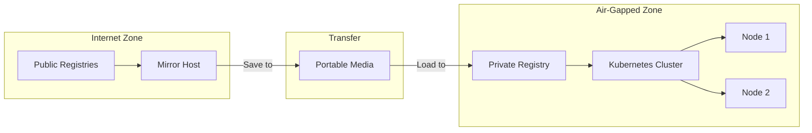

# How to Mirror Container Images for Offline Kubernetes Clusters

Author: [nawazdhandala](https://www.github.com/nawazdhandala)

Tags: Kubernetes, Air-Gapped, Container Registry, Docker, Images, Offline, DevOps

Description: Learn how to mirror container images for air-gapped Kubernetes clusters including registry setup, image synchronization, helm chart images, and maintaining image catalogs.

---

Air-gapped or offline Kubernetes clusters cannot pull images from public registries. This requires mirroring all necessary images to a private registry. This guide covers complete image mirroring workflows for disconnected environments.

## Air-Gapped Architecture



## Set Up Private Registry

### Deploy Registry with Harbor

```yaml
# harbor-values.yaml
expose:
  type: nodePort
  nodePort:
    ports:
      https:
        nodePort: 30443
  tls:
    enabled: true
    certSource: secret
    secret:
      secretName: harbor-tls

externalURL: https://registry.internal.local:30443

persistence:
  enabled: true
  persistentVolumeClaim:
    registry:
      storageClass: local-storage
      size: 500Gi
    chartmuseum:
      storageClass: local-storage
      size: 50Gi

database:
  type: internal

redis:
  type: internal

# Enable image scanning
trivy:
  enabled: true

# Enable content trust
notary:
  enabled: false
```

```bash
# Install Harbor
helm repo add harbor https://helm.goharbor.io
helm install harbor harbor/harbor -f harbor-values.yaml -n harbor --create-namespace
```

### Simple Docker Registry

```yaml
# registry-deployment.yaml
apiVersion: apps/v1
kind: Deployment
metadata:
  name: registry
  namespace: registry
spec:
  replicas: 1
  selector:
    matchLabels:
      app: registry
  template:
    metadata:
      labels:
        app: registry
    spec:
      containers:
        - name: registry
          image: registry:2
          ports:
            - containerPort: 5000
          env:
            - name: REGISTRY_STORAGE_DELETE_ENABLED
              value: "true"
          volumeMounts:
            - name: data
              mountPath: /var/lib/registry
            - name: auth
              mountPath: /auth
          resources:
            requests:
              memory: 256Mi
              cpu: 100m
            limits:
              memory: 1Gi
              cpu: 500m
      volumes:
        - name: data
          persistentVolumeClaim:
            claimName: registry-pvc
        - name: auth
          secret:
            secretName: registry-htpasswd
---
apiVersion: v1
kind: Service
metadata:
  name: registry
  namespace: registry
spec:
  type: NodePort
  ports:
    - port: 5000
      targetPort: 5000
      nodePort: 30500
  selector:
    app: registry
```

## Mirror Images with Skopeo

### Basic Image Mirroring

```bash
#!/bin/bash
# mirror-images.sh

SOURCE_REGISTRY="docker.io"
TARGET_REGISTRY="registry.internal.local:5000"

# List of images to mirror
IMAGES=(
    "nginx:1.25"
    "redis:7-alpine"
    "postgres:15"
    "busybox:1.36"
)

for IMAGE in "${IMAGES[@]}"; do
    echo "Mirroring: $IMAGE"
    skopeo copy \
        --src-tls-verify=true \
        --dest-tls-verify=false \
        docker://${SOURCE_REGISTRY}/${IMAGE} \
        docker://${TARGET_REGISTRY}/${IMAGE}
done
```

### Mirror with Authentication

```bash
#!/bin/bash
# mirror-authenticated.sh

# Login to source registry
skopeo login docker.io -u $DOCKER_USER -p $DOCKER_PASSWORD

# Login to target registry
skopeo login registry.internal.local:5000 -u admin -p $REGISTRY_PASSWORD

# Copy image
skopeo copy \
    --src-creds "${DOCKER_USER}:${DOCKER_PASSWORD}" \
    --dest-creds "admin:${REGISTRY_PASSWORD}" \
    docker://docker.io/library/nginx:1.25 \
    docker://registry.internal.local:5000/library/nginx:1.25
```

### Save Images to Tar Files

```bash
#!/bin/bash
# save-images.sh

IMAGES=(
    "docker.io/nginx:1.25"
    "docker.io/redis:7-alpine"
    "gcr.io/google-containers/pause:3.9"
    "quay.io/prometheus/prometheus:v2.48.0"
)

OUTPUT_DIR="./image-archive"
mkdir -p $OUTPUT_DIR

for IMAGE in "${IMAGES[@]}"; do
    # Convert image name to filename
    FILENAME=$(echo $IMAGE | tr '/:' '_').tar
    echo "Saving: $IMAGE -> $FILENAME"
    
    skopeo copy \
        docker://${IMAGE} \
        docker-archive:${OUTPUT_DIR}/${FILENAME}
done

# Create manifest file
echo "Creating manifest..."
cat > ${OUTPUT_DIR}/manifest.txt << EOF
# Image Manifest
# Generated: $(date)

$(for img in "${IMAGES[@]}"; do echo "$img"; done)
EOF

# Create tarball for transfer
tar -cvzf images-$(date +%Y%m%d).tar.gz -C $OUTPUT_DIR .
```

### Load Images from Tar Files

```bash
#!/bin/bash
# load-images.sh

ARCHIVE_DIR="./image-archive"
TARGET_REGISTRY="registry.internal.local:5000"

for TARFILE in ${ARCHIVE_DIR}/*.tar; do
    # Extract original image name from filename
    BASENAME=$(basename $TARFILE .tar)
    
    # Convert filename back to image reference
    # docker.io_library_nginx_1.25 -> library/nginx:1.25
    IMAGE_PATH=$(echo $BASENAME | sed 's/_/\//g' | sed 's/\/\([^\/]*\)$/:\1/')
    
    echo "Loading: $TARFILE -> ${TARGET_REGISTRY}/${IMAGE_PATH}"
    
    skopeo copy \
        --dest-tls-verify=false \
        docker-archive:${TARFILE} \
        docker://${TARGET_REGISTRY}/${IMAGE_PATH}
done
```

## Mirror Helm Chart Images

### Extract Images from Helm Charts

```bash
#!/bin/bash
# extract-helm-images.sh

CHART=$1  # e.g., prometheus-community/kube-prometheus-stack
VALUES_FILE=${2:-""}

# Download chart
helm pull $CHART --untar

CHART_NAME=$(echo $CHART | cut -d'/' -f2)

# Template and extract images
if [ -n "$VALUES_FILE" ]; then
    IMAGES=$(helm template $CHART_NAME ./$CHART_NAME -f $VALUES_FILE | grep -oP 'image:\s*\K[^\s]+' | sort -u)
else
    IMAGES=$(helm template $CHART_NAME ./$CHART_NAME | grep -oP 'image:\s*\K[^\s]+' | sort -u)
fi

echo "Images found in $CHART:"
echo "$IMAGES"

# Save to file
echo "$IMAGES" > ${CHART_NAME}-images.txt
```

### Complete Helm Chart Mirror Script

```bash
#!/bin/bash
# mirror-helm-chart.sh

CHART_REPO=$1
CHART_NAME=$2
CHART_VERSION=$3
TARGET_REGISTRY=$4

set -e

# Add repo if needed
helm repo add temp-repo $CHART_REPO 2>/dev/null || true
helm repo update

# Download chart
helm pull temp-repo/$CHART_NAME --version $CHART_VERSION --untar

# Extract all images
IMAGES=$(helm template test ./$CHART_NAME 2>/dev/null | \
    grep -E '^\s*image:|^\s*-\s*image:' | \
    sed 's/.*image:\s*//;s/"//g;s/'"'"'//g' | \
    sort -u)

echo "Found $(echo "$IMAGES" | wc -l) images"
echo "$IMAGES"

# Mirror each image
while IFS= read -r IMAGE; do
    [ -z "$IMAGE" ] && continue
    
    # Parse image components
    if [[ $IMAGE == *"/"* ]]; then
        REGISTRY=$(echo $IMAGE | cut -d'/' -f1)
        if [[ $REGISTRY != *"."* ]] && [[ $REGISTRY != *":"* ]]; then
            # No registry specified, assume docker.io
            FULL_IMAGE="docker.io/$IMAGE"
        else
            FULL_IMAGE=$IMAGE
        fi
    else
        # Single name like nginx, assume docker.io/library/
        FULL_IMAGE="docker.io/library/$IMAGE"
    fi
    
    # Construct target path
    TARGET_PATH=$(echo $FULL_IMAGE | sed "s|^[^/]*/||")
    TARGET_IMAGE="${TARGET_REGISTRY}/${TARGET_PATH}"
    
    echo "Mirroring: $FULL_IMAGE -> $TARGET_IMAGE"
    skopeo copy --dest-tls-verify=false \
        docker://$FULL_IMAGE \
        docker://$TARGET_IMAGE
        
done <<< "$IMAGES"

# Clean up
rm -rf ./$CHART_NAME
```

## Image Sync Configuration

### Using image-syncer

```yaml
# image-sync-config.yaml
auth:
  docker.io:
    username: ${DOCKER_USER}
    password: ${DOCKER_PASSWORD}
  registry.internal.local:5000:
    username: admin
    password: ${REGISTRY_PASSWORD}
    insecure: true

images:
  # Kubernetes core images
  registry.k8s.io/kube-apiserver: registry.internal.local:5000/k8s
  registry.k8s.io/kube-controller-manager: registry.internal.local:5000/k8s
  registry.k8s.io/kube-scheduler: registry.internal.local:5000/k8s
  registry.k8s.io/kube-proxy: registry.internal.local:5000/k8s
  registry.k8s.io/pause: registry.internal.local:5000/k8s
  registry.k8s.io/coredns/coredns: registry.internal.local:5000/k8s
  registry.k8s.io/etcd: registry.internal.local:5000/k8s
  
  # Common applications
  docker.io/library/nginx: registry.internal.local:5000/library
  docker.io/library/redis: registry.internal.local:5000/library
  docker.io/library/postgres: registry.internal.local:5000/library
  
  # Monitoring
  quay.io/prometheus/prometheus: registry.internal.local:5000/prometheus
  quay.io/prometheus/alertmanager: registry.internal.local:5000/prometheus
  grafana/grafana: registry.internal.local:5000/grafana
```

```bash
# Run sync
image-syncer --config image-sync-config.yaml --proc 5
```

## Configure Kubernetes for Private Registry

### containerd Configuration

```toml
# /etc/containerd/config.toml
version = 2

[plugins."io.containerd.grpc.v1.cri".registry]
  [plugins."io.containerd.grpc.v1.cri".registry.mirrors]
    [plugins."io.containerd.grpc.v1.cri".registry.mirrors."docker.io"]
      endpoint = ["https://registry.internal.local:5000"]
    [plugins."io.containerd.grpc.v1.cri".registry.mirrors."gcr.io"]
      endpoint = ["https://registry.internal.local:5000"]
    [plugins."io.containerd.grpc.v1.cri".registry.mirrors."quay.io"]
      endpoint = ["https://registry.internal.local:5000"]
  
  [plugins."io.containerd.grpc.v1.cri".registry.configs]
    [plugins."io.containerd.grpc.v1.cri".registry.configs."registry.internal.local:5000".tls]
      insecure_skip_verify = true
    [plugins."io.containerd.grpc.v1.cri".registry.configs."registry.internal.local:5000".auth]
      username = "admin"
      password = "secret"
```

```bash
# Restart containerd
sudo systemctl restart containerd
```

### ImagePullSecrets

```yaml
# registry-secret.yaml
apiVersion: v1
kind: Secret
metadata:
  name: private-registry
  namespace: default
type: kubernetes.io/dockerconfigjson
stringData:
  .dockerconfigjson: |
    {
      "auths": {
        "registry.internal.local:5000": {
          "auth": "YWRtaW46c2VjcmV0"
        }
      }
    }
---
# Patch default service account
apiVersion: v1
kind: ServiceAccount
metadata:
  name: default
  namespace: default
imagePullSecrets:
  - name: private-registry
```

### Rewrite Image References

```yaml
# deployment-original.yaml (won't work in air-gapped)
spec:
  containers:
    - name: app
      image: nginx:1.25  # References docker.io

# deployment-airgapped.yaml (works in air-gapped)
spec:
  containers:
    - name: app
      image: registry.internal.local:5000/library/nginx:1.25
```

## Automated Image Catalog

### Generate Image List from Cluster

```bash
#!/bin/bash
# extract-cluster-images.sh

echo "Extracting images from all namespaces..."

kubectl get pods -A -o jsonpath='{range .items[*]}{range .spec.containers[*]}{.image}{"\n"}{end}{range .spec.initContainers[*]}{.image}{"\n"}{end}{end}' | \
    sort -u | \
    grep -v '^$' > cluster-images.txt

echo "Found $(wc -l < cluster-images.txt) unique images:"
cat cluster-images.txt
```

### Image Catalog Management

```yaml
# image-catalog.yaml
apiVersion: v1
kind: ConfigMap
metadata:
  name: image-catalog
  namespace: kube-system
data:
  catalog.yaml: |
    # Core Kubernetes
    kubernetes:
      version: "1.28.4"
      images:
        - registry.k8s.io/kube-apiserver:v1.28.4
        - registry.k8s.io/kube-controller-manager:v1.28.4
        - registry.k8s.io/kube-scheduler:v1.28.4
        - registry.k8s.io/kube-proxy:v1.28.4
        - registry.k8s.io/pause:3.9
        - registry.k8s.io/coredns/coredns:v1.10.1
        - registry.k8s.io/etcd:3.5.9-0
    
    # CNI
    calico:
      version: "3.26.4"
      images:
        - docker.io/calico/cni:v3.26.4
        - docker.io/calico/node:v3.26.4
        - docker.io/calico/kube-controllers:v3.26.4
    
    # Ingress
    nginx-ingress:
      version: "1.9.4"
      images:
        - registry.k8s.io/ingress-nginx/controller:v1.9.4
        - registry.k8s.io/ingress-nginx/kube-webhook-certgen:v20231011-8b53cabe0
    
    # Monitoring
    prometheus-stack:
      version: "55.0.0"
      images:
        - quay.io/prometheus/prometheus:v2.48.0
        - quay.io/prometheus/alertmanager:v0.26.0
        - grafana/grafana:10.2.2
```

## Summary

| Tool | Use Case |
|------|----------|
| Skopeo | Copy images between registries |
| Crane | Lightweight image operations |
| image-syncer | Bulk image synchronization |
| Harbor | Enterprise private registry |
| Docker save/load | Archive images to tar files |

## Related Posts

- [How to Scan Kubernetes Clusters for CIS Benchmark Compliance](https://oneuptime.com/blog/post/2026-01-19-kubernetes-cis-benchmark-compliance/view) - Security compliance
- [How to Build Multi-Stage Docker Images for Python](https://oneuptime.com/blog/post/2025-01-06-python-docker-multi-stage/view) - Image optimization
- [How to Set Up Kubernetes Gateway API](https://oneuptime.com/blog/post/2026-01-19-kubernetes-gateway-api-ingress-successor/view) - Networking
