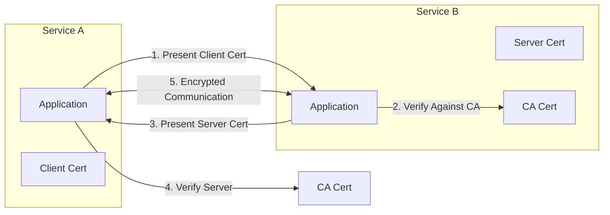

# How to Set Up mTLS Between Kubernetes Services Without Service Mesh

Author: [nawazdhandala](https://www.github.com/nawazdhandala)

Tags: Kubernetes, mTLS, TLS, Security, Certificates, Zero Trust, DevOps

Description: Learn how to implement mutual TLS (mTLS) between Kubernetes services without a service mesh using cert-manager, SPIFFE/SPIRE, or manual certificate management.

---

Mutual TLS (mTLS) ensures both client and server authenticate each other, providing encrypted and authenticated communication. While service meshes automate this, you can implement mTLS without one using cert-manager, SPIFFE/SPIRE, or manual certificate management.

## mTLS Architecture



| Authentication | TLS | mTLS |
|----------------|-----|------|
| Server verified | ✅ | ✅ |
| Client verified | ❌ | ✅ |
| Man-in-middle protection | ✅ | ✅ |
| Zero-trust compliant | ❌ | ✅ |

## Method 1: cert-manager with Self-Signed CA

### Install cert-manager

```bash
# Install cert-manager
kubectl apply -f https://github.com/cert-manager/cert-manager/releases/download/v1.13.3/cert-manager.yaml

# Verify installation
kubectl wait --for=condition=Available deployment/cert-manager -n cert-manager --timeout=300s
```

### Create Certificate Authority

```yaml
# ca-issuer.yaml
apiVersion: cert-manager.io/v1
kind: ClusterIssuer
metadata:
  name: selfsigned-issuer
spec:
  selfSigned: {}
---
apiVersion: cert-manager.io/v1
kind: Certificate
metadata:
  name: mtls-ca
  namespace: cert-manager
spec:
  isCA: true
  commonName: mtls-ca
  secretName: mtls-ca-secret
  privateKey:
    algorithm: ECDSA
    size: 256
  issuerRef:
    name: selfsigned-issuer
    kind: ClusterIssuer
---
apiVersion: cert-manager.io/v1
kind: ClusterIssuer
metadata:
  name: mtls-ca-issuer
spec:
  ca:
    secretName: mtls-ca-secret
```

### Issue Service Certificates

```yaml
# service-certificates.yaml
apiVersion: cert-manager.io/v1
kind: Certificate
metadata:
  name: service-a-mtls
  namespace: production
spec:
  secretName: service-a-mtls-certs
  duration: 720h  # 30 days
  renewBefore: 168h  # 7 days before expiry
  privateKey:
    algorithm: ECDSA
    size: 256
  usages:
    - server auth
    - client auth
  dnsNames:
    - service-a
    - service-a.production
    - service-a.production.svc
    - service-a.production.svc.cluster.local
  issuerRef:
    name: mtls-ca-issuer
    kind: ClusterIssuer
---
apiVersion: cert-manager.io/v1
kind: Certificate
metadata:
  name: service-b-mtls
  namespace: production
spec:
  secretName: service-b-mtls-certs
  duration: 720h
  renewBefore: 168h
  privateKey:
    algorithm: ECDSA
    size: 256
  usages:
    - server auth
    - client auth
  dnsNames:
    - service-b
    - service-b.production
    - service-b.production.svc
    - service-b.production.svc.cluster.local
  issuerRef:
    name: mtls-ca-issuer
    kind: ClusterIssuer
```

### Deploy Services with mTLS

```yaml
# service-a-deployment.yaml
apiVersion: apps/v1
kind: Deployment
metadata:
  name: service-a
  namespace: production
spec:
  replicas: 2
  selector:
    matchLabels:
      app: service-a
  template:
    metadata:
      labels:
        app: service-a
    spec:
      containers:
        - name: service-a
          image: myregistry/service-a:v1.0.0
          ports:
            - containerPort: 8443
          env:
            - name: TLS_CERT_FILE
              value: /certs/tls.crt
            - name: TLS_KEY_FILE
              value: /certs/tls.key
            - name: TLS_CA_FILE
              value: /certs/ca.crt
            - name: MTLS_ENABLED
              value: "true"
          volumeMounts:
            - name: certs
              mountPath: /certs
              readOnly: true
      volumes:
        - name: certs
          projected:
            sources:
              - secret:
                  name: service-a-mtls-certs
                  items:
                    - key: tls.crt
                      path: tls.crt
                    - key: tls.key
                      path: tls.key
                    - key: ca.crt
                      path: ca.crt
```

### Go Server with mTLS

```go
// server/main.go
package main

import (
    "crypto/tls"
    "crypto/x509"
    "io/ioutil"
    "log"
    "net/http"
)

func main() {
    // Load server certificate
    cert, err := tls.LoadX509KeyPair("/certs/tls.crt", "/certs/tls.key")
    if err != nil {
        log.Fatal(err)
    }

    // Load CA certificate for client verification
    caCert, err := ioutil.ReadFile("/certs/ca.crt")
    if err != nil {
        log.Fatal(err)
    }
    caCertPool := x509.NewCertPool()
    caCertPool.AppendCertsFromPEM(caCert)

    // Configure TLS with client certificate requirement
    tlsConfig := &tls.Config{
        Certificates: []tls.Certificate{cert},
        ClientCAs:    caCertPool,
        ClientAuth:   tls.RequireAndVerifyClientCert,
        MinVersion:   tls.VersionTLS12,
    }

    server := &http.Server{
        Addr:      ":8443",
        TLSConfig: tlsConfig,
    }

    http.HandleFunc("/", func(w http.ResponseWriter, r *http.Request) {
        // Access client certificate info
        if len(r.TLS.PeerCertificates) > 0 {
            clientCN := r.TLS.PeerCertificates[0].Subject.CommonName
            log.Printf("Request from client: %s", clientCN)
        }
        w.Write([]byte("Hello from mTLS server!"))
    })

    log.Println("Starting mTLS server on :8443")
    log.Fatal(server.ListenAndServeTLS("", ""))
}
```

### Go Client with mTLS

```go
// client/main.go
package main

import (
    "crypto/tls"
    "crypto/x509"
    "io/ioutil"
    "log"
    "net/http"
)

func createMTLSClient() *http.Client {
    // Load client certificate
    cert, err := tls.LoadX509KeyPair("/certs/tls.crt", "/certs/tls.key")
    if err != nil {
        log.Fatal(err)
    }

    // Load CA certificate for server verification
    caCert, err := ioutil.ReadFile("/certs/ca.crt")
    if err != nil {
        log.Fatal(err)
    }
    caCertPool := x509.NewCertPool()
    caCertPool.AppendCertsFromPEM(caCert)

    tlsConfig := &tls.Config{
        Certificates: []tls.Certificate{cert},
        RootCAs:      caCertPool,
        MinVersion:   tls.VersionTLS12,
    }

    return &http.Client{
        Transport: &http.Transport{
            TLSClientConfig: tlsConfig,
        },
    }
}

func main() {
    client := createMTLSClient()
    
    resp, err := client.Get("https://service-b.production.svc:8443/")
    if err != nil {
        log.Fatal(err)
    }
    defer resp.Body.Close()

    body, _ := ioutil.ReadAll(resp.Body)
    log.Printf("Response: %s", body)
}
```

### Python with mTLS

```python
# server.py
import ssl
from flask import Flask

app = Flask(__name__)

@app.route('/')
def hello():
    return 'Hello from mTLS server!'

if __name__ == '__main__':
    context = ssl.SSLContext(ssl.PROTOCOL_TLS_SERVER)
    context.verify_mode = ssl.CERT_REQUIRED
    context.load_cert_chain('/certs/tls.crt', '/certs/tls.key')
    context.load_verify_locations('/certs/ca.crt')
    
    app.run(host='0.0.0.0', port=8443, ssl_context=context)
```

```python
# client.py
import requests

def make_mtls_request():
    response = requests.get(
        'https://service-b.production.svc:8443/',
        cert=('/certs/tls.crt', '/certs/tls.key'),
        verify='/certs/ca.crt'
    )
    return response.text
```

## Method 2: SPIFFE/SPIRE

### Install SPIRE Server

```yaml
# spire-server.yaml
apiVersion: apps/v1
kind: StatefulSet
metadata:
  name: spire-server
  namespace: spire
spec:
  serviceName: spire-server
  replicas: 1
  selector:
    matchLabels:
      app: spire-server
  template:
    metadata:
      labels:
        app: spire-server
    spec:
      serviceAccountName: spire-server
      containers:
        - name: spire-server
          image: ghcr.io/spiffe/spire-server:1.8.5
          args: ["-config", "/run/spire/config/server.conf"]
          ports:
            - containerPort: 8081
          volumeMounts:
            - name: config
              mountPath: /run/spire/config
            - name: data
              mountPath: /run/spire/data
      volumes:
        - name: config
          configMap:
            name: spire-server-config
  volumeClaimTemplates:
    - metadata:
        name: data
      spec:
        accessModes: ["ReadWriteOnce"]
        resources:
          requests:
            storage: 1Gi
---
apiVersion: v1
kind: ConfigMap
metadata:
  name: spire-server-config
  namespace: spire
data:
  server.conf: |
    server {
        bind_address = "0.0.0.0"
        bind_port = "8081"
        trust_domain = "production.local"
        data_dir = "/run/spire/data"
        log_level = "INFO"
        ca_ttl = "24h"
    }
    plugins {
        DataStore "sql" {
            plugin_data {
                database_type = "sqlite3"
                connection_string = "/run/spire/data/datastore.sqlite3"
            }
        }
        NodeAttestor "k8s_psat" {
            plugin_data {
                clusters = {
                    "production" = {
                        service_account_allow_list = ["spire:spire-agent"]
                    }
                }
            }
        }
        KeyManager "disk" {
            plugin_data {
                keys_path = "/run/spire/data/keys.json"
            }
        }
    }
```

### Install SPIRE Agent

```yaml
# spire-agent.yaml
apiVersion: apps/v1
kind: DaemonSet
metadata:
  name: spire-agent
  namespace: spire
spec:
  selector:
    matchLabels:
      app: spire-agent
  template:
    metadata:
      labels:
        app: spire-agent
    spec:
      serviceAccountName: spire-agent
      hostPID: true
      hostNetwork: true
      containers:
        - name: spire-agent
          image: ghcr.io/spiffe/spire-agent:1.8.5
          args: ["-config", "/run/spire/config/agent.conf"]
          volumeMounts:
            - name: config
              mountPath: /run/spire/config
            - name: spire-agent-socket
              mountPath: /run/spire/sockets
      volumes:
        - name: config
          configMap:
            name: spire-agent-config
        - name: spire-agent-socket
          hostPath:
            path: /run/spire/sockets
            type: DirectoryOrCreate
---
apiVersion: v1
kind: ConfigMap
metadata:
  name: spire-agent-config
  namespace: spire
data:
  agent.conf: |
    agent {
        data_dir = "/run/spire"
        log_level = "INFO"
        server_address = "spire-server"
        server_port = "8081"
        socket_path = "/run/spire/sockets/agent.sock"
        trust_domain = "production.local"
    }
    plugins {
        NodeAttestor "k8s_psat" {
            plugin_data {
                cluster = "production"
            }
        }
        KeyManager "memory" {}
        WorkloadAttestor "k8s" {
            plugin_data {
                skip_kubelet_verification = true
            }
        }
    }
```

### Register Workloads

```bash
# Register service-a
kubectl exec -n spire spire-server-0 -- \
  /opt/spire/bin/spire-server entry create \
  -spiffeID spiffe://production.local/service-a \
  -parentID spiffe://production.local/ns/spire/sa/spire-agent \
  -selector k8s:ns:production \
  -selector k8s:sa:service-a

# Register service-b
kubectl exec -n spire spire-server-0 -- \
  /opt/spire/bin/spire-server entry create \
  -spiffeID spiffe://production.local/service-b \
  -parentID spiffe://production.local/ns/spire/sa/spire-agent \
  -selector k8s:ns:production \
  -selector k8s:sa:service-b
```

### Use SPIFFE Certificates in Application

```go
// spiffe-client.go
package main

import (
    "context"
    "log"
    "net/http"
    "time"

    "github.com/spiffe/go-spiffe/v2/spiffeid"
    "github.com/spiffe/go-spiffe/v2/spiffetls/tlsconfig"
    "github.com/spiffe/go-spiffe/v2/workloadapi"
)

func main() {
    ctx, cancel := context.WithTimeout(context.Background(), 30*time.Second)
    defer cancel()

    // Connect to SPIRE agent
    source, err := workloadapi.NewX509Source(ctx)
    if err != nil {
        log.Fatal(err)
    }
    defer source.Close()

    // Create TLS config that validates SPIFFE IDs
    serverID := spiffeid.RequireFromString("spiffe://production.local/service-b")
    tlsConfig := tlsconfig.MTLSClientConfig(source, source, tlsconfig.AuthorizeID(serverID))

    client := &http.Client{
        Transport: &http.Transport{
            TLSClientConfig: tlsConfig,
        },
    }

    resp, err := client.Get("https://service-b.production.svc:8443/")
    if err != nil {
        log.Fatal(err)
    }
    defer resp.Body.Close()

    log.Println("Successfully connected with mTLS!")
}
```

## Method 3: Manual Certificate Management

### Generate Certificates Script

```bash
#!/bin/bash
# generate-mtls-certs.sh

SERVICE_NAME=$1
NAMESPACE=$2
OUTPUT_DIR=${3:-./certs}

mkdir -p $OUTPUT_DIR

# Generate CA (do once)
if [ ! -f "$OUTPUT_DIR/ca.key" ]; then
    openssl genrsa -out $OUTPUT_DIR/ca.key 4096
    openssl req -new -x509 -sha256 -days 3650 \
        -key $OUTPUT_DIR/ca.key \
        -out $OUTPUT_DIR/ca.crt \
        -subj "/CN=mtls-ca"
fi

# Generate service key
openssl genrsa -out $OUTPUT_DIR/$SERVICE_NAME.key 2048

# Generate CSR
cat > $OUTPUT_DIR/$SERVICE_NAME.conf << EOF
[req]
distinguished_name = req_distinguished_name
req_extensions = v3_req
[req_distinguished_name]
[v3_req]
keyUsage = keyEncipherment, dataEncipherment, digitalSignature
extendedKeyUsage = serverAuth, clientAuth
subjectAltName = @alt_names
[alt_names]
DNS.1 = $SERVICE_NAME
DNS.2 = $SERVICE_NAME.$NAMESPACE
DNS.3 = $SERVICE_NAME.$NAMESPACE.svc
DNS.4 = $SERVICE_NAME.$NAMESPACE.svc.cluster.local
EOF

openssl req -new \
    -key $OUTPUT_DIR/$SERVICE_NAME.key \
    -out $OUTPUT_DIR/$SERVICE_NAME.csr \
    -subj "/CN=$SERVICE_NAME" \
    -config $OUTPUT_DIR/$SERVICE_NAME.conf

# Sign certificate
openssl x509 -req \
    -in $OUTPUT_DIR/$SERVICE_NAME.csr \
    -CA $OUTPUT_DIR/ca.crt \
    -CAkey $OUTPUT_DIR/ca.key \
    -CAcreateserial \
    -out $OUTPUT_DIR/$SERVICE_NAME.crt \
    -days 365 \
    -sha256 \
    -extensions v3_req \
    -extfile $OUTPUT_DIR/$SERVICE_NAME.conf

# Create Kubernetes secret
kubectl create secret generic $SERVICE_NAME-mtls \
    --namespace $NAMESPACE \
    --from-file=tls.crt=$OUTPUT_DIR/$SERVICE_NAME.crt \
    --from-file=tls.key=$OUTPUT_DIR/$SERVICE_NAME.key \
    --from-file=ca.crt=$OUTPUT_DIR/ca.crt \
    --dry-run=client -o yaml
```

### Network Policies for mTLS

```yaml
# mtls-network-policy.yaml
apiVersion: networking.k8s.io/v1
kind: NetworkPolicy
metadata:
  name: require-mtls
  namespace: production
spec:
  podSelector:
    matchLabels:
      mtls: required
  policyTypes:
    - Ingress
    - Egress
  ingress:
    - from:
        - podSelector:
            matchLabels:
              mtls: required
      ports:
        - port: 8443
          protocol: TCP
  egress:
    - to:
        - podSelector:
            matchLabels:
              mtls: required
      ports:
        - port: 8443
          protocol: TCP
```

## Summary

| Method | Complexity | Auto-Rotation | Identity |
|--------|------------|---------------|----------|
| cert-manager | Low | Yes | DNS-based |
| SPIFFE/SPIRE | High | Yes | SPIFFE ID |
| Manual | Medium | No | Custom |

## Related Posts

- [How to Rotate Kubernetes Cluster Certificates Before Expiry](https://oneuptime.com/blog/post/2026-01-19-kubernetes-certificate-rotation-expiry/view) - Cluster certificates
- [How to Write Kubernetes Admission Webhooks from Scratch](https://oneuptime.com/blog/post/2026-01-19-kubernetes-admission-webhooks-scratch/view) - Policy enforcement
- [How to Implement Pod Security Contexts Correctly](https://oneuptime.com/blog/post/2026-01-19-kubernetes-pod-security-contexts/view) - Security best practices
