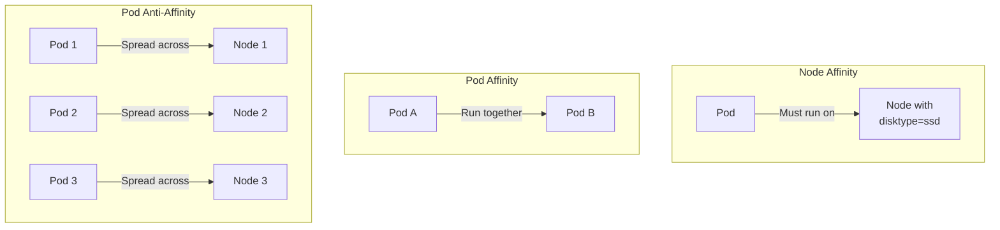

# How to Configure Node Affinity and Anti-Affinity in Kubernetes

Author: [nawazdhandala](https://www.github.com/nawazdhandala)

Tags: Kubernetes, Node Affinity, Anti-Affinity, Scheduling, DevOps, Pod Placement

Description: Learn how to use node affinity, anti-affinity, and pod affinity rules to control where your Kubernetes pods are scheduled for optimal performance and reliability.

---

Node affinity and anti-affinity rules provide fine-grained control over pod scheduling in Kubernetes. This guide covers configuring these rules for optimal workload placement.

## Affinity Overview



| Type | Purpose | Use Case |
|------|---------|----------|
| Node Affinity | Schedule on specific nodes | GPU nodes, SSD storage |
| Node Anti-Affinity | Avoid specific nodes | Exclude maintenance nodes |
| Pod Affinity | Co-locate pods | Cache near app |
| Pod Anti-Affinity | Spread pods | HA across zones |

## Node Labels

### View and Set Labels

```bash
# View node labels
kubectl get nodes --show-labels

# Add label to node
kubectl label nodes node-1 disktype=ssd

# Add multiple labels
kubectl label nodes node-1 \
  disktype=ssd \
  cpu=high-performance \
  environment=production

# Remove label
kubectl label nodes node-1 disktype-

# Show specific label
kubectl get nodes -L disktype,cpu
```

### Common Node Labels

```bash
# Standard Kubernetes labels
kubernetes.io/arch=amd64
kubernetes.io/os=linux
node.kubernetes.io/instance-type=m5.large

# Topology labels
topology.kubernetes.io/zone=us-east-1a
topology.kubernetes.io/region=us-east-1

# Custom labels
disktype=ssd
gpu=nvidia-tesla-v100
environment=production
```

## Node Affinity

### Required Affinity (Hard)

```yaml
# required-node-affinity.yaml
apiVersion: v1
kind: Pod
metadata:
  name: gpu-workload
spec:
  affinity:
    nodeAffinity:
      requiredDuringSchedulingIgnoredDuringExecution:
        nodeSelectorTerms:
          - matchExpressions:
              # Must have GPU
              - key: gpu
                operator: Exists
              # Must be NVIDIA
              - key: nvidia.com/gpu.product
                operator: In
                values:
                  - Tesla-V100
                  - Tesla-A100
  containers:
    - name: ml-training
      image: tensorflow/tensorflow:latest-gpu
      resources:
        limits:
          nvidia.com/gpu: 1
```

### Preferred Affinity (Soft)

```yaml
# preferred-node-affinity.yaml
apiVersion: v1
kind: Pod
metadata:
  name: web-app
spec:
  affinity:
    nodeAffinity:
      preferredDuringSchedulingIgnoredDuringExecution:
        # High priority: prefer SSD nodes
        - weight: 100
          preference:
            matchExpressions:
              - key: disktype
                operator: In
                values:
                  - ssd
        # Medium priority: prefer same zone
        - weight: 50
          preference:
            matchExpressions:
              - key: topology.kubernetes.io/zone
                operator: In
                values:
                  - us-east-1a
        # Lower priority: prefer newer nodes
        - weight: 25
          preference:
            matchExpressions:
              - key: node-generation
                operator: In
                values:
                  - gen3
  containers:
    - name: web
      image: nginx:latest
```

### Combined Required and Preferred

```yaml
# combined-affinity.yaml
apiVersion: apps/v1
kind: Deployment
metadata:
  name: production-app
spec:
  replicas: 3
  selector:
    matchLabels:
      app: production-app
  template:
    metadata:
      labels:
        app: production-app
    spec:
      affinity:
        nodeAffinity:
          # Required: Must be production node
          requiredDuringSchedulingIgnoredDuringExecution:
            nodeSelectorTerms:
              - matchExpressions:
                  - key: environment
                    operator: In
                    values:
                      - production
                  - key: kubernetes.io/os
                    operator: In
                    values:
                      - linux
          # Preferred: SSD and high-memory
          preferredDuringSchedulingIgnoredDuringExecution:
            - weight: 100
              preference:
                matchExpressions:
                  - key: disktype
                    operator: In
                    values:
                      - ssd
            - weight: 80
              preference:
                matchExpressions:
                  - key: memory
                    operator: In
                    values:
                      - high
      containers:
        - name: app
          image: myapp:latest
```

## Pod Affinity

### Co-locate Pods

```yaml
# pod-affinity.yaml
apiVersion: apps/v1
kind: Deployment
metadata:
  name: web-frontend
spec:
  replicas: 3
  selector:
    matchLabels:
      app: web-frontend
  template:
    metadata:
      labels:
        app: web-frontend
    spec:
      affinity:
        podAffinity:
          # Required: Must be on same node as cache
          requiredDuringSchedulingIgnoredDuringExecution:
            - labelSelector:
                matchExpressions:
                  - key: app
                    operator: In
                    values:
                      - redis-cache
              topologyKey: kubernetes.io/hostname
      containers:
        - name: frontend
          image: frontend:latest
---
apiVersion: apps/v1
kind: Deployment
metadata:
  name: redis-cache
spec:
  replicas: 3
  selector:
    matchLabels:
      app: redis-cache
  template:
    metadata:
      labels:
        app: redis-cache
    spec:
      containers:
        - name: redis
          image: redis:alpine
```

### Preferred Pod Affinity

```yaml
# preferred-pod-affinity.yaml
apiVersion: apps/v1
kind: Deployment
metadata:
  name: backend-api
spec:
  replicas: 3
  selector:
    matchLabels:
      app: backend-api
  template:
    metadata:
      labels:
        app: backend-api
    spec:
      affinity:
        podAffinity:
          # Prefer same zone as database
          preferredDuringSchedulingIgnoredDuringExecution:
            - weight: 100
              podAffinityTerm:
                labelSelector:
                  matchExpressions:
                    - key: app
                      operator: In
                      values:
                        - postgresql
                topologyKey: topology.kubernetes.io/zone
      containers:
        - name: api
          image: api:latest
```

## Pod Anti-Affinity

### Spread Across Nodes

```yaml
# pod-anti-affinity-nodes.yaml
apiVersion: apps/v1
kind: Deployment
metadata:
  name: web-server
spec:
  replicas: 5
  selector:
    matchLabels:
      app: web-server
  template:
    metadata:
      labels:
        app: web-server
    spec:
      affinity:
        podAntiAffinity:
          # Required: No two pods on same node
          requiredDuringSchedulingIgnoredDuringExecution:
            - labelSelector:
                matchLabels:
                  app: web-server
              topologyKey: kubernetes.io/hostname
      containers:
        - name: web
          image: nginx:latest
```

### Spread Across Zones

```yaml
# pod-anti-affinity-zones.yaml
apiVersion: apps/v1
kind: Deployment
metadata:
  name: database
spec:
  replicas: 3
  selector:
    matchLabels:
      app: database
  template:
    metadata:
      labels:
        app: database
    spec:
      affinity:
        podAntiAffinity:
          # Required: Spread across zones
          requiredDuringSchedulingIgnoredDuringExecution:
            - labelSelector:
                matchLabels:
                  app: database
              topologyKey: topology.kubernetes.io/zone
          # Preferred: Also spread across nodes
          preferredDuringSchedulingIgnoredDuringExecution:
            - weight: 100
              podAffinityTerm:
                labelSelector:
                  matchLabels:
                    app: database
                topologyKey: kubernetes.io/hostname
      containers:
        - name: db
          image: postgresql:14
```

### Soft Anti-Affinity

```yaml
# soft-anti-affinity.yaml
apiVersion: apps/v1
kind: Deployment
metadata:
  name: cache-server
spec:
  replicas: 10
  selector:
    matchLabels:
      app: cache-server
  template:
    metadata:
      labels:
        app: cache-server
    spec:
      affinity:
        podAntiAffinity:
          # Try to spread, but allow colocation if needed
          preferredDuringSchedulingIgnoredDuringExecution:
            - weight: 100
              podAffinityTerm:
                labelSelector:
                  matchLabels:
                    app: cache-server
                topologyKey: kubernetes.io/hostname
      containers:
        - name: cache
          image: memcached:latest
```

## Topology Spread Constraints

### Even Distribution

```yaml
# topology-spread.yaml
apiVersion: apps/v1
kind: Deployment
metadata:
  name: distributed-app
spec:
  replicas: 6
  selector:
    matchLabels:
      app: distributed-app
  template:
    metadata:
      labels:
        app: distributed-app
    spec:
      topologySpreadConstraints:
        # Spread across zones
        - maxSkew: 1
          topologyKey: topology.kubernetes.io/zone
          whenUnsatisfiable: DoNotSchedule
          labelSelector:
            matchLabels:
              app: distributed-app
        # Also spread across nodes
        - maxSkew: 2
          topologyKey: kubernetes.io/hostname
          whenUnsatisfiable: ScheduleAnyway
          labelSelector:
            matchLabels:
              app: distributed-app
      containers:
        - name: app
          image: myapp:latest
```

### Min Domains

```yaml
# min-domains-spread.yaml
apiVersion: apps/v1
kind: Deployment
metadata:
  name: critical-service
spec:
  replicas: 4
  selector:
    matchLabels:
      app: critical-service
  template:
    metadata:
      labels:
        app: critical-service
    spec:
      topologySpreadConstraints:
        - maxSkew: 1
          topologyKey: topology.kubernetes.io/zone
          whenUnsatisfiable: DoNotSchedule
          labelSelector:
            matchLabels:
              app: critical-service
          # Require at least 3 zones
          minDomains: 3
      containers:
        - name: app
          image: myapp:latest
```

## Complex Scheduling Examples

### Database with HA

```yaml
# database-ha.yaml
apiVersion: apps/v1
kind: StatefulSet
metadata:
  name: postgresql
spec:
  serviceName: postgresql
  replicas: 3
  selector:
    matchLabels:
      app: postgresql
  template:
    metadata:
      labels:
        app: postgresql
    spec:
      affinity:
        # Require SSD nodes
        nodeAffinity:
          requiredDuringSchedulingIgnoredDuringExecution:
            nodeSelectorTerms:
              - matchExpressions:
                  - key: disktype
                    operator: In
                    values:
                      - ssd
                  - key: node-role
                    operator: In
                    values:
                      - database
        # Spread across zones
        podAntiAffinity:
          requiredDuringSchedulingIgnoredDuringExecution:
            - labelSelector:
                matchLabels:
                  app: postgresql
              topologyKey: topology.kubernetes.io/zone
      containers:
        - name: postgresql
          image: postgresql:14
          volumeMounts:
            - name: data
              mountPath: /var/lib/postgresql/data
  volumeClaimTemplates:
    - metadata:
        name: data
      spec:
        accessModes: ["ReadWriteOnce"]
        storageClassName: fast-ssd
        resources:
          requests:
            storage: 100Gi
```

### Web App with Cache Affinity

```yaml
# web-with-cache.yaml
# Redis Cache
apiVersion: apps/v1
kind: Deployment
metadata:
  name: redis
spec:
  replicas: 3
  selector:
    matchLabels:
      app: redis
      tier: cache
  template:
    metadata:
      labels:
        app: redis
        tier: cache
    spec:
      affinity:
        podAntiAffinity:
          requiredDuringSchedulingIgnoredDuringExecution:
            - labelSelector:
                matchLabels:
                  app: redis
              topologyKey: kubernetes.io/hostname
      containers:
        - name: redis
          image: redis:alpine
---
# Web App co-located with Redis
apiVersion: apps/v1
kind: Deployment
metadata:
  name: web-app
spec:
  replicas: 6
  selector:
    matchLabels:
      app: web-app
      tier: frontend
  template:
    metadata:
      labels:
        app: web-app
        tier: frontend
    spec:
      affinity:
        # Co-locate with Redis
        podAffinity:
          preferredDuringSchedulingIgnoredDuringExecution:
            - weight: 100
              podAffinityTerm:
                labelSelector:
                  matchLabels:
                    app: redis
                topologyKey: kubernetes.io/hostname
        # But spread web pods
        podAntiAffinity:
          preferredDuringSchedulingIgnoredDuringExecution:
            - weight: 50
              podAffinityTerm:
                labelSelector:
                  matchLabels:
                    app: web-app
                topologyKey: kubernetes.io/hostname
      containers:
        - name: web
          image: web-app:latest
```

### Multi-Tier Application

```yaml
# multi-tier-affinity.yaml
# Frontend - spread across zones, prefer to be near backend
apiVersion: apps/v1
kind: Deployment
metadata:
  name: frontend
spec:
  replicas: 4
  selector:
    matchLabels:
      app: myapp
      tier: frontend
  template:
    metadata:
      labels:
        app: myapp
        tier: frontend
    spec:
      topologySpreadConstraints:
        - maxSkew: 1
          topologyKey: topology.kubernetes.io/zone
          whenUnsatisfiable: ScheduleAnyway
          labelSelector:
            matchLabels:
              tier: frontend
      affinity:
        podAffinity:
          preferredDuringSchedulingIgnoredDuringExecution:
            - weight: 50
              podAffinityTerm:
                labelSelector:
                  matchLabels:
                    tier: backend
                topologyKey: topology.kubernetes.io/zone
      containers:
        - name: frontend
          image: frontend:latest
---
# Backend - spread across zones, co-locate with database
apiVersion: apps/v1
kind: Deployment
metadata:
  name: backend
spec:
  replicas: 4
  selector:
    matchLabels:
      app: myapp
      tier: backend
  template:
    metadata:
      labels:
        app: myapp
        tier: backend
    spec:
      topologySpreadConstraints:
        - maxSkew: 1
          topologyKey: topology.kubernetes.io/zone
          whenUnsatisfiable: DoNotSchedule
          labelSelector:
            matchLabels:
              tier: backend
      affinity:
        podAffinity:
          requiredDuringSchedulingIgnoredDuringExecution:
            - labelSelector:
                matchLabels:
                  tier: database
              topologyKey: topology.kubernetes.io/zone
        podAntiAffinity:
          preferredDuringSchedulingIgnoredDuringExecution:
            - weight: 100
              podAffinityTerm:
                labelSelector:
                  matchLabels:
                    tier: backend
                topologyKey: kubernetes.io/hostname
      containers:
        - name: backend
          image: backend:latest
```

## Debugging Scheduling

```bash
# Check why pod is pending
kubectl describe pod <pod-name>

# View node affinity on a pod
kubectl get pod <pod-name> -o yaml | grep -A 30 affinity

# Check node labels
kubectl get nodes --show-labels | grep -E "disktype|gpu|zone"

# See which nodes a pod can be scheduled on
kubectl get nodes -l disktype=ssd,environment=production

# Check scheduler events
kubectl get events --field-selector reason=FailedScheduling
```

## Conclusion

Node and pod affinity rules enable sophisticated scheduling strategies:

1. **Node affinity** - Place pods on specific node types
2. **Pod affinity** - Co-locate related pods for performance
3. **Pod anti-affinity** - Spread pods for high availability
4. **Topology spread** - Even distribution across failure domains
5. **Combine rules** - Build complex placement strategies

For monitoring your distributed applications, check out [OneUptime's infrastructure monitoring](https://oneuptime.com/product/metrics).

## Related Resources

- [How to Configure Taints and Tolerations](https://oneuptime.com/blog/post/2026-01-19-kubernetes-taints-tolerations-scheduling/view)
- [How to Set Up Pod Priority and Preemption](https://oneuptime.com/blog/post/2026-01-19-kubernetes-pod-priority-preemption/view)
- [How to Manage Resource Quotas](https://oneuptime.com/blog/post/2026-01-19-kubernetes-resource-quotas-limit-ranges/view)
