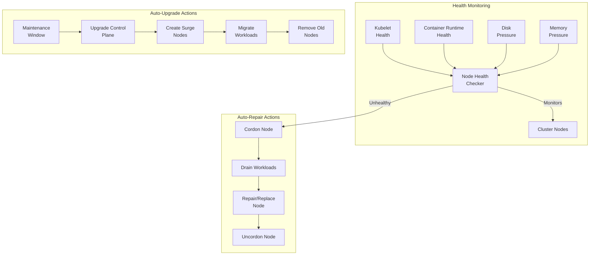

# How to Set Up Kubernetes Node Auto-Repair and Auto-Upgrade

Author: [nawazdhandala](https://www.github.com/nawazdhandala)

Tags: Kubernetes, Node Management, Auto-Repair, Auto-Upgrade, GKE, EKS, AKS, Self-Healing

Description: Learn how to configure automatic node repair and upgrade mechanisms in Kubernetes to maintain cluster health and security with minimal manual intervention.

---

Kubernetes nodes can become unhealthy due to hardware failures, kernel issues, or resource exhaustion. Manual node management doesn't scale and introduces human error. This guide covers implementing self-healing infrastructure through automatic node repair and upgrades.

## Self-Healing Architecture



## GKE Auto-Repair and Auto-Upgrade

### Enable Auto-Repair

```bash
# Enable auto-repair on new node pool
gcloud container node-pools create auto-repair-pool \
  --cluster=my-cluster \
  --zone=us-central1-a \
  --enable-autorepair \
  --num-nodes=3

# Enable on existing node pool
gcloud container node-pools update default-pool \
  --cluster=my-cluster \
  --zone=us-central1-a \
  --enable-autorepair
```

### Enable Auto-Upgrade

```bash
# Enable auto-upgrade on node pool
gcloud container node-pools update default-pool \
  --cluster=my-cluster \
  --zone=us-central1-a \
  --enable-autoupgrade

# Configure maintenance window
gcloud container clusters update my-cluster \
  --zone=us-central1-a \
  --maintenance-window-start=2024-01-01T04:00:00Z \
  --maintenance-window-end=2024-01-01T08:00:00Z \
  --maintenance-window-recurrence='FREQ=WEEKLY;BYDAY=SA,SU'
```

### GKE Release Channels

```bash
# Set release channel for automatic control plane upgrades
gcloud container clusters update my-cluster \
  --zone=us-central1-a \
  --release-channel=regular

# Available channels:
# - rapid: Latest features, more frequent updates
# - regular: Balance of features and stability (recommended)
# - stable: Proven stable versions, less frequent updates
```

### Terraform Configuration for GKE

```hcl
# gke-auto-repair-upgrade.tf
resource "google_container_cluster" "primary" {
  name     = "self-healing-cluster"
  location = "us-central1"
  
  # Enable release channel for automatic control plane upgrades
  release_channel {
    channel = "REGULAR"
  }
  
  # Maintenance policy
  maintenance_policy {
    recurring_window {
      start_time = "2024-01-01T04:00:00Z"
      end_time   = "2024-01-01T08:00:00Z"
      recurrence = "FREQ=WEEKLY;BYDAY=SA,SU"
    }
    
    maintenance_exclusion {
      exclusion_name = "black-friday"
      start_time     = "2024-11-28T00:00:00Z"
      end_time       = "2024-12-01T00:00:00Z"
      exclusion_options {
        scope = "NO_UPGRADES"
      }
    }
  }
  
  # Node pool configuration
  node_pool {
    name       = "default-pool"
    node_count = 3
    
    management {
      auto_repair  = true
      auto_upgrade = true
    }
    
    upgrade_settings {
      max_surge       = 1
      max_unavailable = 0
      strategy        = "SURGE"
    }
  }
}
```

## EKS Managed Node Groups

### Create Self-Healing Node Group

```bash
# Create managed node group with auto-upgrade
eksctl create nodegroup \
  --cluster=my-cluster \
  --name=self-healing-ng \
  --node-type=m5.xlarge \
  --nodes=3 \
  --nodes-min=3 \
  --nodes-max=6 \
  --managed \
  --asg-access

# Node groups automatically handle unhealthy node replacement
```

### Terraform for EKS Managed Nodes

```hcl
# eks-managed-node-group.tf
resource "aws_eks_node_group" "managed" {
  cluster_name    = aws_eks_cluster.main.name
  node_group_name = "self-healing-nodes"
  node_role_arn   = aws_iam_role.node.arn
  subnet_ids      = var.subnet_ids
  
  scaling_config {
    desired_size = 3
    max_size     = 6
    min_size     = 3
  }
  
  update_config {
    max_unavailable = 1
  }
  
  # Force replacement on AMI updates
  force_update_version = true
  
  # Launch template for custom configuration
  launch_template {
    id      = aws_launch_template.nodes.id
    version = aws_launch_template.nodes.latest_version
  }
  
  lifecycle {
    ignore_changes = [scaling_config[0].desired_size]
  }
  
  tags = {
    "k8s.io/cluster-autoscaler/enabled" = "true"
  }
}

# Auto Scaling Group health check configuration
resource "aws_autoscaling_group" "nodes" {
  # ... other configuration
  
  health_check_type         = "EC2"
  health_check_grace_period = 300
  
  # Enable instance refresh for rolling updates
  instance_refresh {
    strategy = "Rolling"
    preferences {
      min_healthy_percentage = 90
      instance_warmup        = 300
    }
  }
}
```

### EKS Add-on Auto-Updates

```hcl
# eks-addon-autoupdate.tf
resource "aws_eks_addon" "vpc_cni" {
  cluster_name = aws_eks_cluster.main.name
  addon_name   = "vpc-cni"
  
  # Automatically resolve conflicts and update
  resolve_conflicts_on_create = "OVERWRITE"
  resolve_conflicts_on_update = "OVERWRITE"
  
  # Use latest compatible version
  addon_version = data.aws_eks_addon_version.vpc_cni.version
}

data "aws_eks_addon_version" "vpc_cni" {
  addon_name         = "vpc-cni"
  kubernetes_version = aws_eks_cluster.main.version
  most_recent        = true
}
```

## AKS Node Auto-Repair and Upgrade

### Enable Auto-Upgrade

```bash
# Enable cluster auto-upgrade
az aks update \
  --resource-group myResourceGroup \
  --name myAKSCluster \
  --auto-upgrade-channel stable

# Available channels:
# - none: Manual upgrades only
# - patch: Automatic patch version upgrades
# - stable: Stable minor version upgrades
# - rapid: Latest supported version
# - node-image: Node image updates only
```

### Configure Maintenance Window

```bash
# Set maintenance window
az aks maintenancewindow add \
  --resource-group myResourceGroup \
  --cluster-name myAKSCluster \
  --name default \
  --schedule-type Weekly \
  --day-of-week Saturday \
  --start-hour 4 \
  --duration 4
```

### Terraform for AKS

```hcl
# aks-auto-upgrade.tf
resource "azurerm_kubernetes_cluster" "main" {
  name                = "self-healing-aks"
  location            = azurerm_resource_group.main.location
  resource_group_name = azurerm_resource_group.main.name
  dns_prefix          = "selfhealing"
  
  # Automatic channel upgrade
  automatic_channel_upgrade = "stable"
  
  # Node OS auto-upgrade
  node_os_channel_upgrade = "NodeImage"
  
  # Maintenance window
  maintenance_window {
    allowed {
      day   = "Saturday"
      hours = [4, 5, 6, 7]
    }
    allowed {
      day   = "Sunday"
      hours = [4, 5, 6, 7]
    }
    not_allowed {
      start = "2024-11-28T00:00:00Z"
      end   = "2024-12-01T00:00:00Z"
    }
  }
  
  default_node_pool {
    name                = "default"
    node_count          = 3
    vm_size             = "Standard_D4s_v3"
    enable_auto_scaling = true
    min_count           = 3
    max_count           = 6
    
    # Auto-repair is always enabled for AKS
    upgrade_settings {
      max_surge = "33%"
    }
  }
}
```

## Self-Managed Clusters: Node Problem Detector

### Deploy Node Problem Detector

```yaml
# node-problem-detector.yaml
apiVersion: apps/v1
kind: DaemonSet
metadata:
  name: node-problem-detector
  namespace: kube-system
spec:
  selector:
    matchLabels:
      app: node-problem-detector
  template:
    metadata:
      labels:
        app: node-problem-detector
    spec:
      hostNetwork: true
      hostPID: true
      containers:
        - name: node-problem-detector
          image: registry.k8s.io/node-problem-detector/node-problem-detector:v0.8.14
          command:
            - /node-problem-detector
            - --logtostderr
            - --config.system-log-monitor=/config/kernel-monitor.json,/config/docker-monitor.json
            - --config.custom-plugin-monitor=/config/health-checker-monitor.json
          securityContext:
            privileged: true
          resources:
            requests:
              cpu: 10m
              memory: 80Mi
            limits:
              cpu: 50m
              memory: 200Mi
          env:
            - name: NODE_NAME
              valueFrom:
                fieldRef:
                  fieldPath: spec.nodeName
          volumeMounts:
            - name: log
              mountPath: /var/log
              readOnly: true
            - name: kmsg
              mountPath: /dev/kmsg
              readOnly: true
            - name: config
              mountPath: /config
              readOnly: true
      volumes:
        - name: log
          hostPath:
            path: /var/log
        - name: kmsg
          hostPath:
            path: /dev/kmsg
        - name: config
          configMap:
            name: node-problem-detector-config
      tolerations:
        - operator: Exists
          effect: NoSchedule
```

### Custom Health Checks

```yaml
# npd-config.yaml
apiVersion: v1
kind: ConfigMap
metadata:
  name: node-problem-detector-config
  namespace: kube-system
data:
  kernel-monitor.json: |
    {
      "plugin": "kmsg",
      "logPath": "/dev/kmsg",
      "lookback": "5m",
      "bufferSize": 10,
      "source": "kernel-monitor",
      "conditions": [
        {
          "type": "KernelDeadlock",
          "reason": "KernelHasNoDeadlock",
          "message": "kernel has no deadlock"
        }
      ],
      "rules": [
        {
          "type": "temporary",
          "reason": "OOMKilling",
          "pattern": "Killed process \\d+ \\((.+)\\) total-vm:\\d+kB, anon-rss:\\d+kB"
        },
        {
          "type": "permanent",
          "condition": "KernelDeadlock",
          "reason": "AUFSUmountHung",
          "pattern": "task umount\\.aufs:\\d+ blocked for more than \\d+ seconds"
        }
      ]
    }
  
  docker-monitor.json: |
    {
      "plugin": "journald",
      "source": "docker-monitor",
      "conditions": [
        {
          "type": "ContainerRuntimeUnhealthy",
          "reason": "ContainerRuntimeIsHealthy",
          "message": "Container runtime is healthy"
        }
      ],
      "rules": [
        {
          "type": "permanent",
          "condition": "ContainerRuntimeUnhealthy",
          "reason": "ContainerdUnhealthy",
          "pattern": ".*containerd.*is not responding.*"
        }
      ]
    }
  
  health-checker-monitor.json: |
    {
      "plugin": "custom",
      "pluginConfig": {
        "invoke_interval": "30s",
        "timeout": "5s",
        "max_output_length": 1024
      },
      "source": "health-checker",
      "conditions": [
        {
          "type": "DiskProblem",
          "reason": "DiskIsHealthy",
          "message": "Disk is healthy"
        }
      ],
      "rules": [
        {
          "type": "permanent",
          "condition": "DiskProblem",
          "reason": "DiskReadonly",
          "path": "/health-checker/plugins/check_disk_readonly.sh"
        }
      ]
    }
```

## Cluster Autoscaler with Node Replacement

### Cluster Autoscaler Configuration

```yaml
# cluster-autoscaler-config.yaml
apiVersion: apps/v1
kind: Deployment
metadata:
  name: cluster-autoscaler
  namespace: kube-system
spec:
  replicas: 1
  selector:
    matchLabels:
      app: cluster-autoscaler
  template:
    metadata:
      labels:
        app: cluster-autoscaler
    spec:
      serviceAccountName: cluster-autoscaler
      containers:
        - name: cluster-autoscaler
          image: registry.k8s.io/autoscaling/cluster-autoscaler:v1.28.0
          command:
            - ./cluster-autoscaler
            - --v=4
            - --cloud-provider=aws
            - --skip-nodes-with-local-storage=false
            - --expander=least-waste
            # Scale down configuration
            - --scale-down-enabled=true
            - --scale-down-delay-after-add=10m
            - --scale-down-delay-after-delete=0s
            - --scale-down-delay-after-failure=3m
            - --scale-down-unneeded-time=10m
            - --scale-down-unready-time=20m
            - --scale-down-utilization-threshold=0.5
            # Node replacement for unhealthy nodes
            - --max-node-provision-time=15m
            - --max-graceful-termination-sec=600
            - --balance-similar-node-groups=true
            # AWS-specific
            - --node-group-auto-discovery=asg:tag=k8s.io/cluster-autoscaler/enabled,k8s.io/cluster-autoscaler/my-cluster
          resources:
            requests:
              cpu: 100m
              memory: 300Mi
```

## Draino: Automatic Node Draining

```bash
# Install Draino for automatic node draining
kubectl apply -f https://raw.githubusercontent.com/planetlabs/draino/master/manifest/draino.yaml
```

```yaml
# draino-config.yaml
apiVersion: apps/v1
kind: Deployment
metadata:
  name: draino
  namespace: kube-system
spec:
  replicas: 1
  selector:
    matchLabels:
      app: draino
  template:
    metadata:
      labels:
        app: draino
    spec:
      serviceAccountName: draino
      containers:
        - name: draino
          image: planetlabs/draino:latest
          command:
            - /draino
            - --dry-run=false
            # Drain nodes with these conditions
            - --node-conditions=KernelDeadlock,ReadonlyFilesystem,DiskPressure
            # Respect PDBs
            - --eviction-headroom=30s
            - --drain-buffer=10m
            # Skip pods with local storage
            - --skip-drain=false
            # Grace period for pod termination
            - --max-grace-period=5m0s
          resources:
            requests:
              cpu: 50m
              memory: 128Mi
```

## Kured: Kubernetes Reboot Daemon

```yaml
# kured-daemonset.yaml
apiVersion: apps/v1
kind: DaemonSet
metadata:
  name: kured
  namespace: kube-system
spec:
  selector:
    matchLabels:
      app: kured
  template:
    metadata:
      labels:
        app: kured
    spec:
      serviceAccountName: kured
      hostPID: true
      restartPolicy: Always
      containers:
        - name: kured
          image: ghcr.io/kubereboot/kured:1.14.0
          command:
            - /usr/bin/kured
            - --reboot-sentinel=/var/run/reboot-required
            # Maintenance window
            - --start-time=4:00
            - --end-time=8:00
            - --time-zone=UTC
            # Reboot on specific days only
            - --reboot-days=sat,sun
            # Slack notification
            - --slack-hook-url=https://hooks.slack.com/services/xxx
            - --slack-channel=#alerts
            # Lock to prevent concurrent reboots
            - --period=1h
            - --ds-namespace=kube-system
            - --ds-name=kured
            - --lock-annotation=kured.io/lock
            # Prometheus metrics
            - --prometheus-url=http://prometheus.monitoring:9090
          securityContext:
            privileged: true
          env:
            - name: KURED_NODE_ID
              valueFrom:
                fieldRef:
                  fieldPath: spec.nodeName
          volumeMounts:
            - name: hostrun
              mountPath: /var/run
      volumes:
        - name: hostrun
          hostPath:
            path: /var/run
      tolerations:
        - key: node-role.kubernetes.io/control-plane
          effect: NoSchedule
        - key: node-role.kubernetes.io/master
          effect: NoSchedule
```

## Monitoring Auto-Repair and Upgrade

### Prometheus Rules

```yaml
# auto-repair-alerts.yaml
apiVersion: monitoring.coreos.com/v1
kind: PrometheusRule
metadata:
  name: node-health-alerts
  namespace: monitoring
spec:
  groups:
    - name: node-health
      rules:
        - alert: NodeNotReady
          expr: kube_node_status_condition{condition="Ready",status="true"} == 0
          for: 5m
          labels:
            severity: warning
          annotations:
            summary: "Node {{ $labels.node }} is not ready"
            description: "Node {{ $labels.node }} has been not ready for 5 minutes"
        
        - alert: NodeAutoRepairTriggered
          expr: increase(node_auto_repair_total[1h]) > 0
          labels:
            severity: info
          annotations:
            summary: "Auto-repair triggered for node"
            description: "Auto-repair was triggered for a node in the last hour"
        
        - alert: NodeUpgradePending
          expr: kube_node_status_condition{condition="Ready"} and on(node) kube_node_labels{label_upgrade_pending="true"}
          for: 24h
          labels:
            severity: warning
          annotations:
            summary: "Node upgrade pending for over 24 hours"
            description: "Node {{ $labels.node }} has a pending upgrade for over 24 hours"
        
        - alert: TooManyNodeReplacements
          expr: increase(node_replacement_total[24h]) > 3
          labels:
            severity: critical
          annotations:
            summary: "High node replacement rate"
            description: "More than 3 nodes have been replaced in the last 24 hours"
```

### Grafana Dashboard Query

```promql
# Node health status
sum by (condition) (kube_node_status_condition{condition=~"Ready|DiskPressure|MemoryPressure|PIDPressure"} == 1)

# Node age distribution
histogram_quantile(0.95, sum(rate(kube_node_created_bucket[24h])) by (le))

# Auto-repair events (from audit logs)
count by (node) (kube_audit_events{verb="delete",resource="nodes"})

# Upgrade progress
count(kube_node_info{kubelet_version=~"v1.28.*"}) / count(kube_node_info)
```

## Best Practices

### 1. Configure PodDisruptionBudgets

```yaml
# pdb-for-auto-repair.yaml
apiVersion: policy/v1
kind: PodDisruptionBudget
metadata:
  name: critical-app-pdb
  namespace: production
spec:
  minAvailable: 2
  selector:
    matchLabels:
      app: critical-app
```

### 2. Use Surge Upgrades

```yaml
# Node pool with surge upgrade
upgrade_settings:
  max_surge: 1        # Create 1 extra node during upgrade
  max_unavailable: 0  # Never have fewer than current nodes
```

### 3. Maintenance Windows

```bash
# Schedule upgrades during low-traffic periods
# Exclude critical business dates
# Test upgrades in staging first
```

## Summary

| Provider | Auto-Repair | Auto-Upgrade | Configuration |
|----------|-------------|--------------|---------------|
| GKE | Built-in | Release channels | `--enable-autorepair` |
| EKS | Managed node groups | Manual or addon updates | Managed node groups |
| AKS | Built-in | Channel-based | `--auto-upgrade-channel` |
| Self-managed | NPD + Draino | Kured | Custom setup |

## Related Posts

- [How to Drain and Cordon Kubernetes Nodes for Maintenance](https://oneuptime.com/blog/post/2026-01-19-kubernetes-drain-cordon-node-maintenance/view) - Manual node maintenance
- [How to Upgrade Kubernetes Clusters with Zero Downtime](https://oneuptime.com/blog/post/2026-01-19-kubernetes-upgrade-zero-downtime/view) - Upgrade strategies
- [How to Handle Kubernetes Pod Evictions and Resource Pressure](https://oneuptime.com/blog/post/2026-01-19-kubernetes-pod-evictions-resource-pressure/view) - Understanding evictions
