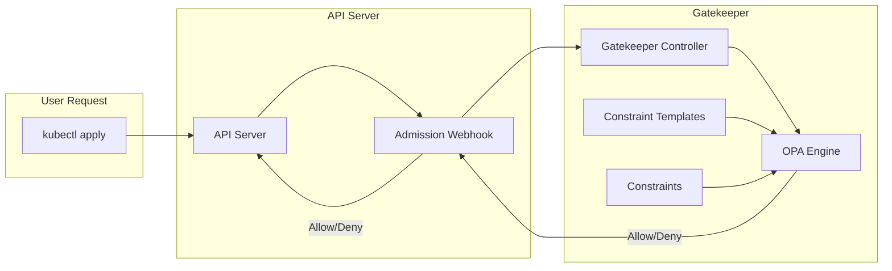
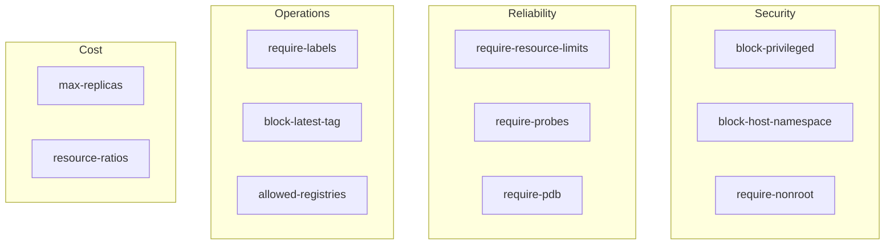

# How to Set Up OPA Gatekeeper for Kubernetes Policy Enforcement

Author: [nawazdhandala](https://www.github.com/nawazdhandala)

Tags: Kubernetes, Security, OPA Gatekeeper, Policy as Code, Admission Control, DevOps

Description: Policy-as-code for Kubernetes admission control using OPA Gatekeeper - from installation to production-ready constraint templates.

Kubernetes gives teams tremendous freedom. That freedom becomes a liability when someone deploys a container with `privileged: true`, uses the `latest` tag, or forgets resource limits. OPA Gatekeeper enforces policies at admission time - before bad configurations ever touch your cluster. This guide walks through setting up Gatekeeper, writing constraint templates, and building a policy library that prevents problems instead of detecting them after the fact.

---

## Why Policy-as-Code?

RBAC controls who can create resources. Gatekeeper controls what resources look like. They complement each other:

| Challenge | RBAC Solution | Gatekeeper Solution |
|-----------|---------------|---------------------|
| Block root containers | ❌ Can't inspect pod spec | ✅ Validates securityContext |
| Require resource limits | ❌ No resource inspection | ✅ Enforces limits exist |
| Enforce image registry | ❌ No image validation | ✅ Regex on image names |
| Require labels | ❌ No metadata validation | ✅ Validates required labels |

Gatekeeper acts as a validating admission webhook. When you `kubectl apply`, Gatekeeper intercepts the request, evaluates it against your policies, and rejects non-compliant resources before they're persisted.

## Architecture Overview

Gatekeeper uses the Open Policy Agent (OPA) engine with Kubernetes-native CRDs.

This diagram shows how Gatekeeper integrates with the Kubernetes API server:



Key components:

- **ConstraintTemplate**: Defines the policy logic in Rego (OPA's policy language)
- **Constraint**: An instance of a template applied to specific resources
- **Audit Controller**: Scans existing resources for violations (not just new ones)

## Step 1: Install Gatekeeper

Install Gatekeeper using kubectl or Helm.

### Using kubectl

```bash
# Install the latest Gatekeeper release
# This creates CRDs, deployments, and webhook configurations
kubectl apply -f https://raw.githubusercontent.com/open-policy-agent/gatekeeper/v3.14.0/deploy/gatekeeper.yaml
```

### Using Helm (Recommended for Production)

Helm provides more configuration options:

```bash
# Add the Gatekeeper Helm repository
helm repo add gatekeeper https://open-policy-agent/gatekeeper/releases/download/helm-charts
helm repo update

# Install with production settings
helm install gatekeeper gatekeeper/gatekeeper \
  --namespace gatekeeper-system \
  --create-namespace \
  --set replicas=3 \
  --set auditInterval=300 \
  --set constraintViolationsLimit=100
```

Verify the installation:

```bash
# Check Gatekeeper pods are running
kubectl get pods -n gatekeeper-system

# Verify webhook is registered
kubectl get validatingwebhookconfigurations | grep gatekeeper
```

## Step 2: Understand ConstraintTemplates

ConstraintTemplates define the policy logic. They're written in Rego, OPA's declarative query language.

### Anatomy of a ConstraintTemplate

A ConstraintTemplate has three parts:

```yaml
apiVersion: templates.gatekeeper.sh/v1
kind: ConstraintTemplate
metadata:
  name: k8srequiredlabels
spec:
  # 1. CRD definition - creates a new Constraint type
  crd:
    spec:
      names:
        kind: K8sRequiredLabels  # Name of the Constraint kind
      validation:
        openAPIV3Schema:
          type: object
          properties:
            # Parameters that can be passed to this template
            labels:
              type: array
              items:
                type: string
  
  # 2. Targets - which admission events to evaluate
  targets:
    - target: admission.k8s.gatekeeper.sh
      # 3. Rego policy code
      rego: |
        package k8srequiredlabels
        
        # Violation is triggered when this rule succeeds
        violation[{"msg": msg}] {
          # Get the required labels from constraint parameters
          required := input.parameters.labels[_]
          # Check if the label exists on the resource
          not input.review.object.metadata.labels[required]
          # Build the error message
          msg := sprintf("Resource must have label: %v", [required])
        }
```

## Step 3: Create Your First Policy

Let's create a policy requiring all deployments to have an `owner` label.

### ConstraintTemplate

This template defines the logic for checking required labels:

```yaml
apiVersion: templates.gatekeeper.sh/v1
kind: ConstraintTemplate
metadata:
  name: k8srequiredlabels
  annotations:
    description: "Requires resources to have specified labels"
spec:
  crd:
    spec:
      names:
        kind: K8sRequiredLabels
      validation:
        openAPIV3Schema:
          type: object
          properties:
            message:
              type: string
              description: "Custom error message"
            labels:
              type: array
              description: "List of required labels"
              items:
                type: string
  targets:
    - target: admission.k8s.gatekeeper.sh
      rego: |
        package k8srequiredlabels
        
        # Check each required label
        violation[{"msg": msg}] {
          # Get required label from parameters
          required_label := input.parameters.labels[_]
          
          # Check if it exists on the resource
          not has_label(required_label)
          
          # Use custom message if provided, otherwise default
          msg := get_message(required_label)
        }
        
        # Helper: check if label exists
        has_label(label) {
          input.review.object.metadata.labels[label]
        }
        
        # Helper: get error message
        get_message(label) = msg {
          input.parameters.message
          msg := sprintf("%s: %s", [input.parameters.message, label])
        }
        
        get_message(label) = msg {
          not input.parameters.message
          msg := sprintf("Resource is missing required label: %s", [label])
        }
```

### Constraint

Now create a Constraint that uses this template:

This Constraint requires all Deployments and Pods to have owner and team labels:

```yaml
apiVersion: constraints.gatekeeper.sh/v1beta1
kind: K8sRequiredLabels
metadata:
  name: require-owner-label
spec:
  # Enforcement action: deny, dryrun, or warn
  enforcementAction: deny
  
  # Which resources to check
  match:
    kinds:
      - apiGroups: ["apps"]
        kinds: ["Deployment"]
      - apiGroups: [""]
        kinds: ["Pod"]
    # Exclude system namespaces
    excludedNamespaces:
      - kube-system
      - gatekeeper-system
  
  # Parameters passed to the template
  parameters:
    message: "All deployments must have ownership labels"
    labels:
      - "owner"
      - "team"
```

Apply and test:

```bash
# Apply the template and constraint
kubectl apply -f constraint-template.yaml
kubectl apply -f constraint.yaml

# Test with a non-compliant deployment
kubectl create deployment nginx --image=nginx

# Should fail with:
# Error: admission webhook denied the request: 
# All deployments must have ownership labels: owner
```

## Step 4: Common Policy Templates

Here's a library of production-ready policies.

### Block Privileged Containers

Prevent containers from running in privileged mode:

```yaml
apiVersion: templates.gatekeeper.sh/v1
kind: ConstraintTemplate
metadata:
  name: k8sblockprivilegedcontainers
  annotations:
    description: "Blocks containers from running in privileged mode"
spec:
  crd:
    spec:
      names:
        kind: K8sBlockPrivilegedContainers
  targets:
    - target: admission.k8s.gatekeeper.sh
      rego: |
        package k8sblockprivilegedcontainers
        
        violation[{"msg": msg}] {
          # Check regular containers
          container := input.review.object.spec.containers[_]
          container.securityContext.privileged == true
          msg := sprintf("Privileged container not allowed: %s", [container.name])
        }
        
        violation[{"msg": msg}] {
          # Check init containers
          container := input.review.object.spec.initContainers[_]
          container.securityContext.privileged == true
          msg := sprintf("Privileged init container not allowed: %s", [container.name])
        }
        
        violation[{"msg": msg}] {
          # Check ephemeral containers
          container := input.review.object.spec.ephemeralContainers[_]
          container.securityContext.privileged == true
          msg := sprintf("Privileged ephemeral container not allowed: %s", [container.name])
        }
```

### Require Resource Limits

Ensure all containers have memory and CPU limits:

```yaml
apiVersion: templates.gatekeeper.sh/v1
kind: ConstraintTemplate
metadata:
  name: k8srequireresourcelimits
  annotations:
    description: "Requires containers to have resource limits"
spec:
  crd:
    spec:
      names:
        kind: K8sRequireResourceLimits
      validation:
        openAPIV3Schema:
          type: object
          properties:
            requireCPU:
              type: boolean
              default: true
            requireMemory:
              type: boolean
              default: true
  targets:
    - target: admission.k8s.gatekeeper.sh
      rego: |
        package k8srequireresourcelimits
        
        # Check memory limits
        violation[{"msg": msg}] {
          input.parameters.requireMemory
          container := input.review.object.spec.containers[_]
          not container.resources.limits.memory
          msg := sprintf("Container %s must have memory limit", [container.name])
        }
        
        # Check CPU limits
        violation[{"msg": msg}] {
          input.parameters.requireCPU
          container := input.review.object.spec.containers[_]
          not container.resources.limits.cpu
          msg := sprintf("Container %s must have CPU limit", [container.name])
        }
        
        # Check init containers too
        violation[{"msg": msg}] {
          input.parameters.requireMemory
          container := input.review.object.spec.initContainers[_]
          not container.resources.limits.memory
          msg := sprintf("Init container %s must have memory limit", [container.name])
        }
```

### Enforce Image Registry

Only allow images from trusted registries:

```yaml
apiVersion: templates.gatekeeper.sh/v1
kind: ConstraintTemplate
metadata:
  name: k8sallowedimageregistries
  annotations:
    description: "Restricts images to allowed registries"
spec:
  crd:
    spec:
      names:
        kind: K8sAllowedImageRegistries
      validation:
        openAPIV3Schema:
          type: object
          properties:
            registries:
              type: array
              items:
                type: string
  targets:
    - target: admission.k8s.gatekeeper.sh
      rego: |
        package k8sallowedimageregistries
        
        violation[{"msg": msg}] {
          container := input.review.object.spec.containers[_]
          not registry_allowed(container.image)
          msg := sprintf("Image %s is not from an allowed registry. Allowed: %v", 
            [container.image, input.parameters.registries])
        }
        
        violation[{"msg": msg}] {
          container := input.review.object.spec.initContainers[_]
          not registry_allowed(container.image)
          msg := sprintf("Init image %s is not from an allowed registry", [container.image])
        }
        
        # Check if image starts with an allowed registry
        registry_allowed(image) {
          allowed := input.parameters.registries[_]
          startswith(image, allowed)
        }
---
# Constraint to allow only internal registry
apiVersion: constraints.gatekeeper.sh/v1beta1
kind: K8sAllowedImageRegistries
metadata:
  name: require-internal-registry
spec:
  enforcementAction: deny
  match:
    kinds:
      - apiGroups: [""]
        kinds: ["Pod"]
      - apiGroups: ["apps"]
        kinds: ["Deployment", "StatefulSet", "DaemonSet"]
    excludedNamespaces:
      - kube-system
  parameters:
    registries:
      - "gcr.io/my-company/"
      - "registry.internal.company.com/"
      - "ghcr.io/my-org/"
```

### Block Latest Tag

Prevent the unstable `:latest` tag:

```yaml
apiVersion: templates.gatekeeper.sh/v1
kind: ConstraintTemplate
metadata:
  name: k8sblocklatestimage
  annotations:
    description: "Blocks images using the latest tag"
spec:
  crd:
    spec:
      names:
        kind: K8sBlockLatestImage
  targets:
    - target: admission.k8s.gatekeeper.sh
      rego: |
        package k8sblocklatestimage
        
        violation[{"msg": msg}] {
          container := input.review.object.spec.containers[_]
          uses_latest(container.image)
          msg := sprintf("Container %s uses :latest tag. Use a specific version.", [container.name])
        }
        
        violation[{"msg": msg}] {
          container := input.review.object.spec.initContainers[_]
          uses_latest(container.image)
          msg := sprintf("Init container %s uses :latest tag", [container.name])
        }
        
        # Check for :latest tag or no tag (which defaults to latest)
        uses_latest(image) {
          endswith(image, ":latest")
        }
        
        uses_latest(image) {
          not contains(image, ":")  # No tag specified
        }
        
        uses_latest(image) {
          # Handle digest references
          contains(image, "@")
          parts := split(image, "@")
          not contains(parts[0], ":")
        }
```

### Require Pod Disruption Budget

Ensure HA deployments have PDBs:

```yaml
apiVersion: templates.gatekeeper.sh/v1
kind: ConstraintTemplate
metadata:
  name: k8srequirepdb
  annotations:
    description: "Requires deployments with multiple replicas to have a PDB"
spec:
  crd:
    spec:
      names:
        kind: K8sRequirePDB
      validation:
        openAPIV3Schema:
          type: object
          properties:
            minReplicas:
              type: integer
              default: 2
  targets:
    - target: admission.k8s.gatekeeper.sh
      rego: |
        package k8srequirepdb
        
        violation[{"msg": msg}] {
          input.review.kind.kind == "Deployment"
          replicas := input.review.object.spec.replicas
          replicas >= input.parameters.minReplicas
          not has_pdb
          msg := sprintf("Deployment %s has %d replicas but no PodDisruptionBudget", 
            [input.review.object.metadata.name, replicas])
        }
        
        has_pdb {
          # Check if a PDB exists with matching selector
          # This requires syncing PDBs to Gatekeeper (see data replication)
          data.inventory.namespace[input.review.object.metadata.namespace]["policy/v1"]["PodDisruptionBudget"][_]
        }
```

## Step 5: Dry-Run and Audit Mode

Don't enforce policies immediately. Use dry-run to test impact first.

### Dry-Run Mode

Set `enforcementAction: dryrun` to log violations without blocking:

```yaml
apiVersion: constraints.gatekeeper.sh/v1beta1
kind: K8sRequiredLabels
metadata:
  name: require-labels-dryrun
spec:
  enforcementAction: dryrun  # Log but don't block
  match:
    kinds:
      - apiGroups: ["apps"]
        kinds: ["Deployment"]
  parameters:
    labels: ["owner"]
```

Check violations in dry-run mode:

```bash
# View violations found by audit
kubectl get k8srequiredlabels require-labels-dryrun -o yaml

# Look for the status.violations section
```

### Warn Mode

Use `enforcementAction: warn` to show warnings without blocking:

```yaml
spec:
  enforcementAction: warn  # Show warning in kubectl output
```

Users see warnings but can still create resources:

```bash
$ kubectl apply -f deployment.yaml
Warning: [require-labels-warn] Resource is missing required label: owner
deployment.apps/my-deployment created
```

### Audit Existing Resources

Gatekeeper's audit controller scans existing resources periodically:

```bash
# Check audit results for all constraints
kubectl get constraints -o json | jq '.items[] | {
  name: .metadata.name,
  violations: .status.totalViolations,
  auditTimestamp: .status.auditTimestamp
}'
```

View detailed violations:

```bash
# Get violations for a specific constraint
kubectl get k8srequiredlabels require-owner-label -o json | \
  jq '.status.violations[]'
```

## Step 6: Policy Organization

For production, organize policies into categories and use namespaces effectively.

### Policy Categories

Create a consistent naming scheme:

This diagram shows a recommended policy organization structure:



### GitOps-Friendly Structure

Organize constraints in your Git repository:

```
policies/
├── templates/
│   ├── security/
│   │   ├── block-privileged.yaml
│   │   └── require-nonroot.yaml
│   ├── reliability/
│   │   ├── require-limits.yaml
│   │   └── require-probes.yaml
│   └── operations/
│       ├── require-labels.yaml
│       └── allowed-registries.yaml
└── constraints/
    ├── production/
    │   └── strict-policies.yaml
    ├── staging/
    │   └── warn-policies.yaml
    └── development/
        └── dryrun-policies.yaml
```

Apply templates first, then constraints:

```bash
# Apply all templates
kubectl apply -f policies/templates/ -R

# Apply environment-specific constraints
kubectl apply -f policies/constraints/production/
```

## Step 7: Exception Handling

Some workloads legitimately need policy exceptions. Handle them gracefully.

### Namespace Exclusions

Exclude system namespaces in the constraint:

```yaml
spec:
  match:
    excludedNamespaces:
      - kube-system
      - gatekeeper-system
      - cert-manager
      - istio-system
```

### Label-Based Exclusions

Skip resources with specific labels:

```yaml
spec:
  match:
    labelSelector:
      matchExpressions:
        - key: "gatekeeper.sh/exempt"
          operator: DoesNotExist
```

Resources with `gatekeeper.sh/exempt: "true"` bypass the policy.

### Config Resource Exclusions

Configure global exclusions for all constraints:

```yaml
apiVersion: config.gatekeeper.sh/v1alpha1
kind: Config
metadata:
  name: config
  namespace: gatekeeper-system
spec:
  match:
    - excludedNamespaces:
        - kube-system
        - gatekeeper-system
      processes:
        - "*"
    # Exclude specific resource types globally
    - excludedNamespaces: ["*"]
      processes:
        - webhook
      kinds:
        - apiGroups: [""]
          kinds: ["Event"]  # Never validate Events
```

## Monitoring and Alerting

### Prometheus Metrics

Gatekeeper exposes metrics for monitoring:

```yaml
# ServiceMonitor for Gatekeeper metrics
apiVersion: monitoring.coreos.com/v1
kind: ServiceMonitor
metadata:
  name: gatekeeper
  namespace: gatekeeper-system
spec:
  selector:
    matchLabels:
      gatekeeper.sh/system: "yes"
  endpoints:
    - port: metrics
```

Key metrics:

```promql
# Constraint violations (from audit)
gatekeeper_violations{constraint_kind="K8sRequiredLabels"}

# Webhook request latency
histogram_quantile(0.99, 
  rate(gatekeeper_webhook_duration_seconds_bucket[5m])
)

# Webhook request errors
rate(gatekeeper_webhook_request_count{status="error"}[5m])
```

### Alerting Rules

Create alerts for policy violations:

```yaml
apiVersion: monitoring.coreos.com/v1
kind: PrometheusRule
metadata:
  name: gatekeeper-alerts
spec:
  groups:
    - name: gatekeeper
      rules:
        - alert: GatekeeperViolationsIncreasing
          expr: |
            sum(increase(gatekeeper_violations[1h])) by (constraint_kind) > 10
          for: 5m
          labels:
            severity: warning
          annotations:
            summary: "Policy violations increasing for {{ $labels.constraint_kind }}"
        
        - alert: GatekeeperWebhookErrors
          expr: |
            rate(gatekeeper_webhook_request_count{status="error"}[5m]) > 0.1
          for: 5m
          labels:
            severity: critical
          annotations:
            summary: "Gatekeeper webhook returning errors"
```

## Troubleshooting

### Constraint Not Enforcing

Check constraint status:

```bash
# Verify constraint is ready
kubectl get constraints

# Check for errors in the constraint
kubectl describe k8srequiredlabels require-owner-label
```

### Webhook Timeout Errors

If deployments timeout, check Gatekeeper pods:

```bash
# Check pod health
kubectl get pods -n gatekeeper-system

# Check logs for errors
kubectl logs -n gatekeeper-system -l control-plane=controller-manager

# Check webhook configuration
kubectl get validatingwebhookconfigurations gatekeeper-validating-webhook-configuration -o yaml
```

### Rego Debugging

Test Rego policies with the `conftest` CLI:

```bash
# Install conftest
brew install conftest

# Test a policy against a manifest
conftest test deployment.yaml -p policy.rego
```

## Related Resources

- [How to Set Up Pod Security Standards (PSS)](https://oneuptime.com/blog/post/2026-01-19-kubernetes-pod-security-standards-pss/view) - Built-in admission control for pod security
- [How to Implement Kubernetes RBAC Best Practices](https://oneuptime.com/blog/post/2026-01-19-kubernetes-rbac-multi-tenant-best-practices/view) - Access control complements policy enforcement
- [Monitor Kubernetes Clusters with OpenTelemetry](https://oneuptime.com/blog/post/2025-11-14-monitor-kubernetes-clusters-with-opentelemetry-and-oneuptime/view) - Observe policy enforcement in action

OPA Gatekeeper transforms cluster governance from reactive (finding problems after deployment) to proactive (preventing problems at admission). Start with warn mode, iterate on your policies based on real violations, and gradually escalate to enforcement. Your future self will thank you when bad configurations never make it to production in the first place.
