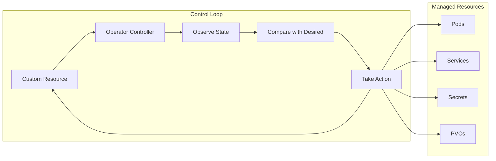

# How to Use Kubernetes Operators from OperatorHub

Author: [nawazdhandala](https://www.github.com/nawazdhandala)

Tags: Kubernetes, Operators, OperatorHub, OLM, CRDs, Automation, DevOps

Description: Learn how to discover, install, and use Kubernetes Operators from OperatorHub to automate complex application lifecycle management with the Operator Lifecycle Manager.

---

Kubernetes Operators extend the platform to manage complex stateful applications automatically. OperatorHub provides a curated catalog of operators, and the Operator Lifecycle Manager (OLM) handles installation and updates. This guide covers the complete workflow.

## What is an Operator?



## Install Operator Lifecycle Manager

```bash
# Install OLM (required for OperatorHub)
curl -sL https://github.com/operator-framework/operator-lifecycle-manager/releases/download/v0.27.0/install.sh | bash -s v0.27.0

# Verify installation
kubectl get pods -n olm

# Expected output:
# NAME                               READY   STATUS    RESTARTS   AGE
# catalog-operator-xxx               1/1     Running   0          1m
# olm-operator-xxx                   1/1     Running   0          1m
# operatorhubio-catalog-xxx          1/1     Running   0          1m
# packageserver-xxx                  2/2     Running   0          1m

# Check OLM components
kubectl get deployments -n olm
kubectl get catalogsources -n olm
```

## Browse Available Operators

```bash
# List all available packages from OperatorHub
kubectl get packagemanifests -n olm

# Filter by name
kubectl get packagemanifests -n olm | grep -i postgres

# Get details about a specific operator
kubectl describe packagemanifest postgresql -n olm

# List available channels
kubectl get packagemanifest postgresql -n olm -o jsonpath='{.status.channels[*].name}'
```

### Popular Operators

```bash
# Database operators
kubectl get packagemanifests -n olm | grep -E "postgres|mysql|mongodb|redis"

# Monitoring operators
kubectl get packagemanifests -n olm | grep -E "prometheus|grafana|elastic"

# Messaging operators
kubectl get packagemanifests -n olm | grep -E "kafka|rabbitmq|pulsar"

# Certificate operators
kubectl get packagemanifests -n olm | grep -E "cert-manager"
```

## Install an Operator

### Step 1: Create Namespace and OperatorGroup

```yaml
# operator-setup.yaml
apiVersion: v1
kind: Namespace
metadata:
  name: postgres-operator
---
apiVersion: operators.coreos.com/v1
kind: OperatorGroup
metadata:
  name: postgres-operatorgroup
  namespace: postgres-operator
spec:
  targetNamespaces:
    - postgres-operator
    - production
    - staging
```

### Step 2: Create Subscription

```yaml
# postgres-subscription.yaml
apiVersion: operators.coreos.com/v1alpha1
kind: Subscription
metadata:
  name: postgresql
  namespace: postgres-operator
spec:
  channel: v5                    # Update channel
  name: postgresql               # Operator package name
  source: operatorhubio-catalog  # Catalog source
  sourceNamespace: olm
  
  # Optional: Pin to specific version
  # startingCSV: postgresql.v5.4.0
  
  # Optional: Approval strategy
  installPlanApproval: Automatic  # or Manual
```

```bash
# Apply the configuration
kubectl apply -f operator-setup.yaml
kubectl apply -f postgres-subscription.yaml

# Watch operator installation
kubectl get csv -n postgres-operator -w

# Check if operator is ready
kubectl get csv -n postgres-operator
# NAME                 DISPLAY              VERSION   PHASE
# postgresql.v5.4.0    PostgreSQL           5.4.0     Succeeded
```

### Step 3: Verify Installation

```bash
# Check operator pod
kubectl get pods -n postgres-operator

# Check installed CRDs
kubectl get crds | grep postgres

# Output:
# postgresclusters.postgres-operator.crunchydata.com
# pgadmins.postgres-operator.crunchydata.com
# pgupgrades.postgres-operator.crunchydata.com
```

## Use the Operator

### Create a PostgreSQL Cluster

```yaml
# postgres-cluster.yaml
apiVersion: postgres-operator.crunchydata.com/v1beta1
kind: PostgresCluster
metadata:
  name: production-db
  namespace: production
spec:
  postgresVersion: 15
  
  instances:
    - name: primary
      replicas: 2
      dataVolumeClaimSpec:
        accessModes:
          - ReadWriteOnce
        resources:
          requests:
            storage: 50Gi
        storageClassName: standard
      
      affinity:
        podAntiAffinity:
          preferredDuringSchedulingIgnoredDuringExecution:
            - weight: 100
              podAffinityTerm:
                topologyKey: kubernetes.io/hostname
                labelSelector:
                  matchLabels:
                    postgres-operator.crunchydata.com/cluster: production-db
  
  backups:
    pgbackrest:
      repos:
        - name: repo1
          schedules:
            full: "0 1 * * 0"     # Weekly full backup
            incremental: "0 1 * * 1-6"  # Daily incremental
          volume:
            volumeClaimSpec:
              accessModes:
                - ReadWriteOnce
              resources:
                requests:
                  storage: 100Gi
  
  users:
    - name: appuser
      databases:
        - myapp
      options: "SUPERUSER"
```

```bash
# Apply the cluster definition
kubectl apply -f postgres-cluster.yaml

# Watch cluster creation
kubectl get postgrescluster -n production -w

# Check cluster status
kubectl describe postgrescluster production-db -n production

# Get connection credentials
kubectl get secret production-db-pguser-appuser -n production -o yaml
```

## Manage Operator Updates

### Manual Approval

```yaml
# subscription with manual approval
apiVersion: operators.coreos.com/v1alpha1
kind: Subscription
metadata:
  name: postgresql
  namespace: postgres-operator
spec:
  channel: v5
  name: postgresql
  source: operatorhubio-catalog
  sourceNamespace: olm
  installPlanApproval: Manual
```

```bash
# Check pending install plans
kubectl get installplan -n postgres-operator

# Output:
# NAME            CSV                  APPROVAL   APPROVED
# install-abc     postgresql.v5.5.0    Manual     false

# Review the install plan
kubectl describe installplan install-abc -n postgres-operator

# Approve the install plan
kubectl patch installplan install-abc -n postgres-operator \
  --type merge --patch '{"spec":{"approved":true}}'
```

### Check Available Updates

```bash
# Check current installed version
kubectl get csv -n postgres-operator

# Check subscription status for available updates
kubectl get subscription postgresql -n postgres-operator -o jsonpath='{.status}'
```

## Uninstall an Operator

```bash
# 1. Delete all custom resources first
kubectl delete postgrescluster --all -n production

# 2. Delete the subscription
kubectl delete subscription postgresql -n postgres-operator

# 3. Delete the CSV (ClusterServiceVersion)
kubectl delete csv postgresql.v5.4.0 -n postgres-operator

# 4. Clean up CRDs (optional, affects all namespaces)
kubectl delete crds postgresclusters.postgres-operator.crunchydata.com

# 5. Delete namespace if no longer needed
kubectl delete namespace postgres-operator
```

## Install from Custom Catalog

### Create Custom CatalogSource

```yaml
# custom-catalog.yaml
apiVersion: operators.coreos.com/v1alpha1
kind: CatalogSource
metadata:
  name: my-operators
  namespace: olm
spec:
  displayName: My Operators
  publisher: My Organization
  sourceType: grpc
  image: myregistry.io/my-operators-catalog:v1
  updateStrategy:
    registryPoll:
      interval: 30m
```

```bash
# Apply custom catalog
kubectl apply -f custom-catalog.yaml

# Verify catalog is available
kubectl get catalogsources -n olm

# List packages from custom catalog
kubectl get packagemanifests -n olm -l catalog=my-operators
```

## Operator SDK: Building Your Own

### Scaffold a New Operator

```bash
# Initialize operator project
mkdir my-operator && cd my-operator
operator-sdk init --domain example.com --repo github.com/example/my-operator

# Create API and controller
operator-sdk create api --group apps --version v1alpha1 --kind MyApp --resource --controller

# Implement controller logic in controllers/myapp_controller.go
# Define CRD spec in api/v1alpha1/myapp_types.go

# Build and push operator image
make docker-build docker-push IMG=myregistry.io/my-operator:v1

# Generate OLM bundle
make bundle IMG=myregistry.io/my-operator:v1
```

## Common Operators Examples

### Prometheus Operator

```yaml
# Install Prometheus Operator
apiVersion: operators.coreos.com/v1alpha1
kind: Subscription
metadata:
  name: prometheus
  namespace: operators
spec:
  channel: beta
  name: prometheus
  source: operatorhubio-catalog
  sourceNamespace: olm
---
# Create Prometheus instance
apiVersion: monitoring.coreos.com/v1
kind: Prometheus
metadata:
  name: prometheus
  namespace: monitoring
spec:
  replicas: 2
  serviceAccountName: prometheus
  serviceMonitorSelector:
    matchLabels:
      monitoring: enabled
  ruleSelector:
    matchLabels:
      prometheus: main
```

### Cert-Manager Operator

```yaml
# Install cert-manager
apiVersion: operators.coreos.com/v1alpha1
kind: Subscription
metadata:
  name: cert-manager
  namespace: cert-manager
spec:
  channel: stable
  name: cert-manager
  source: operatorhubio-catalog
  sourceNamespace: olm
---
# Create ClusterIssuer
apiVersion: cert-manager.io/v1
kind: ClusterIssuer
metadata:
  name: letsencrypt-prod
spec:
  acme:
    server: https://acme-v02.api.letsencrypt.org/directory
    email: admin@example.com
    privateKeySecretRef:
      name: letsencrypt-prod-key
    solvers:
      - http01:
          ingress:
            class: nginx
```

## Troubleshooting

```bash
# Check operator logs
kubectl logs -n postgres-operator deployment/pgo -f

# Check OLM operator logs
kubectl logs -n olm deployment/olm-operator

# Check catalog operator logs
kubectl logs -n olm deployment/catalog-operator

# Debug subscription issues
kubectl describe subscription postgresql -n postgres-operator

# Check install plan status
kubectl describe installplan -n postgres-operator

# Verify CRD is installed
kubectl get crd postgresclusters.postgres-operator.crunchydata.com -o yaml
```

## Summary

| Component | Purpose |
|-----------|---------|
| CatalogSource | Repository of available operators |
| Subscription | Declares intent to install an operator |
| InstallPlan | Details what will be installed |
| CSV | ClusterServiceVersion - installed operator version |
| OperatorGroup | Controls operator's namespace scope |

## Related Posts

- [How to Implement Custom Resource Definitions in Kubernetes](https://oneuptime.com/blog/post/2026-01-19-kubernetes-custom-resource-definitions/view) - Building CRDs
- [How to Set Up Prometheus and Grafana on Kubernetes](https://oneuptime.com/blog/post/2026-01-19-kubernetes-prometheus-grafana-setup/view) - Monitoring setup
- [How to Build Kubernetes Admission Webhooks from Scratch](https://oneuptime.com/blog/post/2026-01-19-kubernetes-admission-webhooks-scratch/view) - Webhook development
