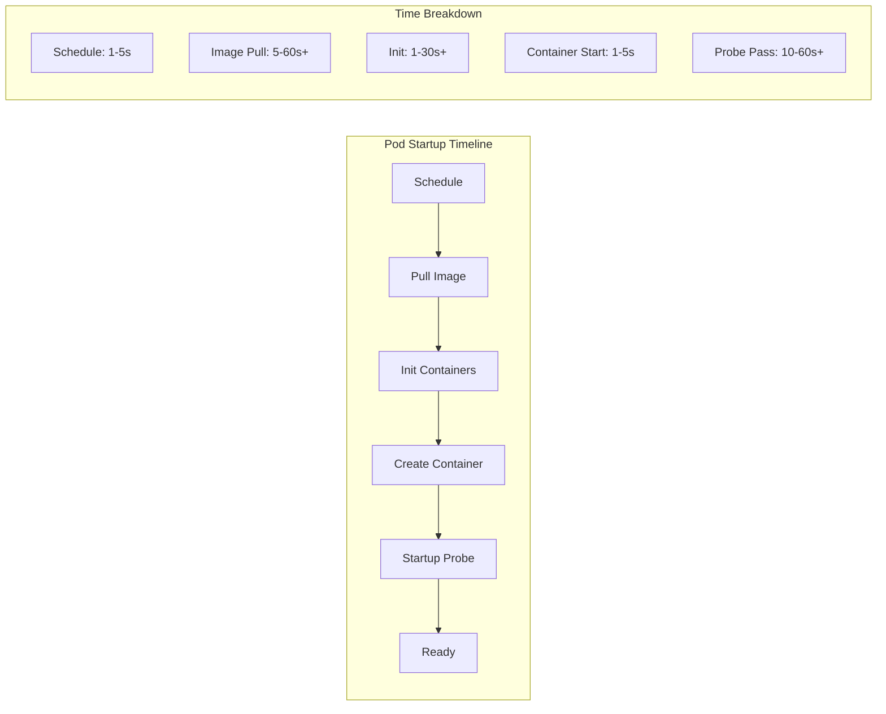

# How to Optimize Kubernetes Pod Startup Time

Author: [nawazdhandala](https://www.github.com/nawazdhandala)

Tags: Kubernetes, Performance, Pod Startup, Container Images, Init Containers, DevOps

Description: Learn techniques to reduce Kubernetes pod startup time including image optimization, startup probes, init container improvements, and preloading strategies.

---

Fast pod startup is crucial for scaling applications, handling traffic spikes, and maintaining responsive auto-scaling. Slow pod startup can lead to cascading failures during high-demand periods.

This guide covers practical techniques to optimize pod startup time in Kubernetes.

## Understanding Pod Startup Phases



## Measuring Startup Time

### Using kubectl

```bash
# Watch pod startup events
kubectl get events --watch --field-selector involvedObject.kind=Pod

# Calculate startup time
kubectl get pod my-pod -o jsonpath='{.status.conditions[?(@.type=="Ready")].lastTransitionTime}'

# Detailed timing
kubectl describe pod my-pod | grep -A5 "Conditions:"
```

### Startup Time Script

```bash
#!/bin/bash
# measure-startup.sh

POD_NAME=$1
NAMESPACE=${2:-default}

# Get creation time
CREATED=$(kubectl get pod $POD_NAME -n $NAMESPACE \
  -o jsonpath='{.metadata.creationTimestamp}')

# Get ready time
READY=$(kubectl get pod $POD_NAME -n $NAMESPACE \
  -o jsonpath='{.status.conditions[?(@.type=="Ready")].lastTransitionTime}')

# Calculate difference (requires dateutils)
CREATED_SEC=$(date -d "$CREATED" +%s)
READY_SEC=$(date -d "$READY" +%s)
STARTUP_TIME=$((READY_SEC - CREATED_SEC))

echo "Pod: $POD_NAME"
echo "Created: $CREATED"
echo "Ready: $READY"
echo "Startup Time: ${STARTUP_TIME}s"
```

### Prometheus Metrics

```promql
# Average pod startup time
avg(
  kube_pod_status_ready_time - kube_pod_created
) by (namespace, pod)

# P99 startup time by deployment
histogram_quantile(0.99,
  sum by (deployment, le) (
    rate(kubelet_pod_start_duration_seconds_bucket[1h])
  )
)
```

## Image Optimization

### 1. Use Smaller Base Images

```dockerfile
# Bad: Large base image (~1GB)
FROM ubuntu:22.04
RUN apt-get update && apt-get install -y python3
COPY app.py /app/
CMD ["python3", "/app/app.py"]

# Good: Minimal base image (~50MB)
FROM python:3.11-slim
COPY app.py /app/
CMD ["python3", "/app/app.py"]

# Best: Distroless image (~20MB)
FROM python:3.11-slim AS builder
COPY requirements.txt .
RUN pip install --no-cache-dir -r requirements.txt

FROM gcr.io/distroless/python3-debian11
COPY --from=builder /usr/local/lib/python3.11/site-packages /usr/local/lib/python3.11/site-packages
COPY app.py /app/
CMD ["/app/app.py"]
```

### 2. Multi-Stage Builds

```dockerfile
# Build stage
FROM golang:1.21 AS builder
WORKDIR /app
COPY go.mod go.sum ./
RUN go mod download
COPY . .
RUN CGO_ENABLED=0 GOOS=linux go build -a -installsuffix cgo -o main .

# Runtime stage - tiny final image
FROM scratch
COPY --from=builder /app/main /main
COPY --from=builder /etc/ssl/certs/ca-certificates.crt /etc/ssl/certs/
ENTRYPOINT ["/main"]
```

### 3. Layer Optimization

```dockerfile
# Bad: Creates many layers, cache invalidation issues
FROM node:18-alpine
COPY . /app
RUN npm install
RUN npm run build

# Good: Optimized layer caching
FROM node:18-alpine
WORKDIR /app

# Copy package files first (cached if unchanged)
COPY package*.json ./
RUN npm ci --only=production

# Copy source code (changes more frequently)
COPY . .
RUN npm run build
```

## Image Pulling Strategies

### Pre-Pull Images with DaemonSet

```yaml
# daemonset-image-puller.yaml
apiVersion: apps/v1
kind: DaemonSet
metadata:
  name: image-prepuller
  namespace: kube-system
spec:
  selector:
    matchLabels:
      app: image-prepuller
  template:
    metadata:
      labels:
        app: image-prepuller
    spec:
      initContainers:
        # Pre-pull commonly used images
        - name: pull-app-image
          image: myregistry/myapp:v1.2.3
          command: ['echo', 'Image pulled']
        - name: pull-sidecar
          image: envoyproxy/envoy:v1.28
          command: ['echo', 'Image pulled']
      containers:
        - name: pause
          image: k8s.gcr.io/pause:3.9
      tolerations:
        - operator: Exists
```

### Use imagePullPolicy Wisely

```yaml
apiVersion: v1
kind: Pod
metadata:
  name: fast-startup-pod
spec:
  containers:
    - name: app
      image: myregistry/myapp:v1.2.3
      # IfNotPresent: Skip pull if image exists locally
      imagePullPolicy: IfNotPresent
      # Always: Always pull (slower, but ensures latest)
      # Never: Never pull (requires pre-pulled image)
```

### Local Image Cache

```yaml
# Use a registry mirror/cache
# containerd config (/etc/containerd/config.toml)
[plugins."io.containerd.grpc.v1.cri".registry.mirrors]
  [plugins."io.containerd.grpc.v1.cri".registry.mirrors."docker.io"]
    endpoint = ["https://registry-mirror.internal:5000"]
  [plugins."io.containerd.grpc.v1.cri".registry.mirrors."gcr.io"]
    endpoint = ["https://registry-mirror.internal:5000"]
```

## Init Container Optimization

### Parallelize Init Containers (K8s 1.28+)

```yaml
apiVersion: v1
kind: Pod
metadata:
  name: parallel-init
spec:
  initContainers:
    # These run in parallel with restartPolicy: Always
    - name: init-db
      image: busybox
      restartPolicy: Always  # Sidecar mode - runs in parallel
      command: ['sh', '-c', 'until nc -z db:5432; do sleep 1; done']
    - name: init-cache
      image: busybox
      restartPolicy: Always
      command: ['sh', '-c', 'until nc -z redis:6379; do sleep 1; done']
  containers:
    - name: app
      image: myapp:latest
```

### Optimize Init Container Logic

```yaml
# Bad: Sequential checks, long timeouts
initContainers:
  - name: wait-for-db
    image: busybox
    command: ['sh', '-c', 'sleep 30 && nc -z db 5432']

# Good: Active polling with short intervals
initContainers:
  - name: wait-for-db
    image: busybox
    command:
      - sh
      - -c
      - |
        until nc -zw 2 db 5432; do
          echo "Waiting for database..."
          sleep 2
        done
        echo "Database is ready!"
```

### Use Lightweight Init Images

```yaml
# Bad: Full curl image
initContainers:
  - name: init
    image: curlimages/curl:latest
    command: ['curl', '-sf', 'http://config-service/config']

# Good: Minimal busybox
initContainers:
  - name: init
    image: busybox:1.36
    command: ['wget', '-qO-', 'http://config-service/config']
```

## Startup Probes Configuration

### Proper Startup Probe

```yaml
apiVersion: v1
kind: Pod
metadata:
  name: app-with-startup-probe
spec:
  containers:
    - name: app
      image: myapp:latest
      ports:
        - containerPort: 8080
      # Startup probe for slow-starting applications
      startupProbe:
        httpGet:
          path: /startup
          port: 8080
        # Total time allowed = failureThreshold * periodSeconds
        # Here: 30 * 10 = 300 seconds (5 minutes) max startup
        failureThreshold: 30
        periodSeconds: 10
        timeoutSeconds: 5
      # Liveness probe only starts after startup probe succeeds
      livenessProbe:
        httpGet:
          path: /health
          port: 8080
        periodSeconds: 10
        failureThreshold: 3
      readinessProbe:
        httpGet:
          path: /ready
          port: 8080
        periodSeconds: 5
        failureThreshold: 3
```

### Fast Health Check Endpoint

```python
# app.py - Implement lightweight health checks
from flask import Flask
app = Flask(__name__)

# Track application state
app_ready = False
app_started = False

@app.route('/startup')
def startup():
    """Lightweight startup check - just verify process is running"""
    if app_started:
        return 'OK', 200
    return 'Starting', 503

@app.route('/ready')
def ready():
    """Full readiness check - verify all dependencies"""
    if app_ready:
        return 'OK', 200
    return 'Not Ready', 503

@app.route('/health')
def health():
    """Lightweight liveness check"""
    return 'OK', 200

def initialize_app():
    global app_started, app_ready
    app_started = True  # Mark as started immediately
    # Do initialization...
    app_ready = True    # Mark ready after init

if __name__ == '__main__':
    initialize_app()
    app.run(host='0.0.0.0', port=8080)
```

## Resource Optimization

### Burst Resources for Startup

```yaml
apiVersion: v1
kind: Pod
metadata:
  name: burst-resources
spec:
  containers:
    - name: app
      image: myapp:latest
      resources:
        requests:
          cpu: 100m       # Low sustained usage
          memory: 256Mi
        limits:
          cpu: "2"        # Allow burst during startup
          memory: 1Gi     # Allow more memory during init
```

### Guaranteed QoS for Critical Apps

```yaml
apiVersion: v1
kind: Pod
metadata:
  name: guaranteed-pod
spec:
  containers:
    - name: app
      image: myapp:latest
      resources:
        requests:
          cpu: 500m
          memory: 512Mi
        limits:
          cpu: 500m       # Same as request = Guaranteed QoS
          memory: 512Mi   # Prioritized scheduling
```

## Application-Level Optimization

### Lazy Initialization

```java
// Java example - lazy loading
@Service
public class AppService {
    
    @Lazy  // Initialize on first use, not at startup
    @Autowired
    private ExpensiveService expensiveService;
    
    @PostConstruct
    public void init() {
        // Only initialize critical components
        initializeCore();
        // Mark as ready before loading optional components
        markAsReady();
        // Load optional components async
        CompletableFuture.runAsync(this::initializeOptional);
    }
}
```

### Connection Pool Warming

```yaml
# Warm up connections before becoming ready
apiVersion: v1
kind: Pod
spec:
  containers:
    - name: app
      image: myapp:latest
      env:
        # Pre-establish connections during startup
        - name: DB_POOL_MIN
          value: "5"
        - name: DB_POOL_WARMUP
          value: "true"
        - name: REDIS_WARMUP
          value: "true"
```

### Pre-compile and Cache

```dockerfile
# Node.js: Generate node_modules before runtime
FROM node:18-alpine AS deps
WORKDIR /app
COPY package*.json ./
RUN npm ci

# Java: Pre-compile and cache
FROM eclipse-temurin:17-jdk AS builder
COPY . /app
WORKDIR /app
RUN ./gradlew build --no-daemon

# Python: Pre-compile bytecode
FROM python:3.11-slim
COPY requirements.txt .
RUN pip install --no-cache-dir -r requirements.txt
COPY . /app
# Pre-compile Python files
RUN python -m compileall /app
```

## Scheduling Optimization

### Pod Topology Spread

```yaml
apiVersion: v1
kind: Pod
metadata:
  name: fast-schedule
spec:
  # Spread across nodes for faster scheduling
  topologySpreadConstraints:
    - maxSkew: 1
      topologyKey: kubernetes.io/hostname
      whenUnsatisfiable: ScheduleAnyway
      labelSelector:
        matchLabels:
          app: myapp
```

### Node Affinity for Warm Caches

```yaml
apiVersion: v1
kind: Pod
metadata:
  name: cache-affinity
spec:
  affinity:
    # Prefer nodes that already have the image
    nodeAffinity:
      preferredDuringSchedulingIgnoredDuringExecution:
        - weight: 100
          preference:
            matchExpressions:
              - key: image-cache/myapp
                operator: Exists
```

## Measuring and Monitoring

### Startup Time Dashboard

```promql
# Average startup time by deployment
avg by (deployment) (
  kube_pod_status_ready_time - kube_pod_created
)

# Pods with slow startup (>60s)
(kube_pod_status_ready_time - kube_pod_created) > 60

# Image pull time
histogram_quantile(0.95,
  sum by (image, le) (
    rate(kubelet_docker_operations_duration_seconds_bucket{
      operation_type="pull_image"
    }[1h])
  )
)
```

### Alert on Slow Startup

```yaml
apiVersion: monitoring.coreos.com/v1
kind: PrometheusRule
metadata:
  name: startup-alerts
spec:
  groups:
    - name: startup.rules
      rules:
        - alert: SlowPodStartup
          expr: |
            (kube_pod_status_ready_time - kube_pod_created) > 120
          for: 5m
          labels:
            severity: warning
          annotations:
            summary: "Pod {{ $labels.pod }} took over 2 minutes to start"
```

## Best Practices Summary

1. **Optimize images** - Use multi-stage builds, minimal base images
2. **Pre-pull images** - Use DaemonSets to cache images on nodes
3. **Tune probes** - Use startup probes for slow apps
4. **Optimize init containers** - Run in parallel where possible
5. **Lazy load** - Initialize only what's needed for readiness
6. **Monitor continuously** - Track startup times in dashboards

## Conclusion

Optimizing pod startup time requires a multi-faceted approach. Key takeaways:

1. **Image size matters** - Smaller images = faster pulls
2. **Cache strategically** - Pre-pull images, use registry mirrors
3. **Parallelize initialization** - Use sidecar init containers
4. **Configure probes properly** - Allow adequate startup time
5. **Measure everything** - You can't optimize what you don't measure

For monitoring pod startup times and application performance, check out [OneUptime's Kubernetes monitoring](https://oneuptime.com/product/metrics).

## Related Resources

- [How to Right-Size Resources with VPA](https://oneuptime.com/blog/post/kubernetes-resource-right-sizing-vpa/view)
- [How to Set Up Horizontal Pod Autoscaler](https://oneuptime.com/blog/post/kubernetes-hpa-autoscaling/view)
- [How to Handle Pod Evictions](https://oneuptime.com/blog/post/kubernetes-pod-evictions-resource-pressure/view)
