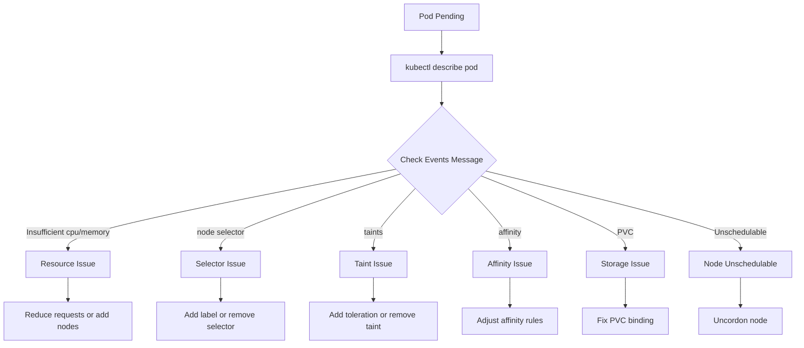

# How to Fix Pending Pods That Never Schedule

Author: [nawazdhandala](https://www.github.com/nawazdhandala)

Tags: Kubernetes, Troubleshooting, Scheduling, Pods, Debugging, DevOps

Description: Learn how to diagnose and fix Kubernetes pods stuck in Pending state due to insufficient resources, node selectors, taints, affinity rules, or PVC issues.

---

Pods stuck in Pending state indicate the scheduler cannot find a suitable node. This happens due to insufficient resources, unsatisfied node constraints, PVC binding issues, or taints without tolerations. Here's how to diagnose and fix each scenario.

## Diagnostic Flow



## Step 1: Get Pod Events

```bash
# Check pod status and events
kubectl describe pod <pod-name>

# Look for the Events section:
# Events:
#   Type     Reason            Age   Message
#   ----     ------            ----  -------
#   Warning  FailedScheduling  1m    0/3 nodes are available: 
#                                    1 node(s) had taint {node.kubernetes.io/not-ready:}, 
#                                    2 Insufficient memory.

# Quick status check
kubectl get pods -o wide --field-selector=status.phase=Pending
```

## Issue 1: Insufficient Resources

### Diagnosis

```bash
# Check node resources
kubectl describe nodes | grep -A 5 "Allocated resources"

# Or use top
kubectl top nodes

# Check specific node capacity
kubectl describe node <node-name> | grep -A 10 "Capacity:\|Allocatable:\|Allocated"

# Output example:
# Capacity:
#   cpu:                4
#   memory:             16Gi
# Allocatable:
#   cpu:                3920m
#   memory:             15Gi
# Allocated resources:
#   cpu:                3500m (89%)
#   memory:             14Gi (93%)
```

### Solution: Reduce Resource Requests

```yaml
# Before - too much requested
spec:
  containers:
    - name: app
      resources:
        requests:
          cpu: "2"
          memory: "8Gi"

# After - more reasonable
spec:
  containers:
    - name: app
      resources:
        requests:
          cpu: "500m"
          memory: "512Mi"
        limits:
          cpu: "1"
          memory: "1Gi"
```

### Solution: Add Cluster Autoscaler

```yaml
# cluster-autoscaler.yaml
apiVersion: apps/v1
kind: Deployment
metadata:
  name: cluster-autoscaler
  namespace: kube-system
spec:
  selector:
    matchLabels:
      app: cluster-autoscaler
  template:
    spec:
      containers:
        - name: cluster-autoscaler
          image: registry.k8s.io/autoscaling/cluster-autoscaler:v1.28.0
          command:
            - ./cluster-autoscaler
            - --cloud-provider=aws
            - --node-group-auto-discovery=asg:tag=k8s.io/cluster-autoscaler/enabled,k8s.io/cluster-autoscaler/my-cluster
            - --scale-down-utilization-threshold=0.5
            - --skip-nodes-with-local-storage=false
```

## Issue 2: Node Selector Not Matching

### Diagnosis

```bash
# Check pod's node selector
kubectl get pod <pod-name> -o jsonpath='{.spec.nodeSelector}'

# Check node labels
kubectl get nodes --show-labels

# Find nodes with specific label
kubectl get nodes -l disktype=ssd
```

### Solution: Add Label or Remove Selector

```bash
# Option 1: Add label to node
kubectl label node <node-name> disktype=ssd

# Option 2: Remove selector from pod/deployment
kubectl patch deployment myapp --type='json' \
  -p='[{"op": "remove", "path": "/spec/template/spec/nodeSelector"}]'
```

```yaml
# Fix in deployment
spec:
  template:
    spec:
      # Remove or fix nodeSelector
      nodeSelector:
        disktype: ssd  # Make sure nodes have this label
```

## Issue 3: Taints Without Tolerations

### Diagnosis

```bash
# Check node taints
kubectl describe nodes | grep Taints

# Or for all nodes
kubectl get nodes -o custom-columns=NAME:.metadata.name,TAINTS:.spec.taints

# Common taints:
# node.kubernetes.io/not-ready:NoSchedule
# node.kubernetes.io/unreachable:NoSchedule
# node.kubernetes.io/disk-pressure:NoSchedule
# node.kubernetes.io/memory-pressure:NoSchedule
# node-role.kubernetes.io/control-plane:NoSchedule
```

### Solution: Add Tolerations

```yaml
# deployment.yaml
spec:
  template:
    spec:
      tolerations:
        # Tolerate specific taint
        - key: "dedicated"
          operator: "Equal"
          value: "gpu"
          effect: "NoSchedule"
        
        # Tolerate any value for a key
        - key: "node-role.kubernetes.io/control-plane"
          operator: "Exists"
          effect: "NoSchedule"
        
        # Tolerate all taints (use carefully!)
        - operator: "Exists"
```

### Solution: Remove Taint from Node

```bash
# Remove specific taint
kubectl taint nodes <node-name> dedicated=gpu:NoSchedule-

# Remove taint by key (any value)
kubectl taint nodes <node-name> dedicated-
```

## Issue 4: Affinity Rules Cannot Be Satisfied

### Diagnosis

```bash
# Check pod affinity rules
kubectl get pod <pod-name> -o yaml | grep -A 20 affinity

# List nodes with specific labels for affinity
kubectl get nodes -l topology.kubernetes.io/zone=us-east-1a
```

### Solution: Relax Affinity Rules

```yaml
# Before - required affinity (hard)
spec:
  affinity:
    nodeAffinity:
      requiredDuringSchedulingIgnoredDuringExecution:
        nodeSelectorTerms:
          - matchExpressions:
              - key: topology.kubernetes.io/zone
                operator: In
                values:
                  - us-east-1a  # Only this zone!

# After - preferred affinity (soft)
spec:
  affinity:
    nodeAffinity:
      preferredDuringSchedulingIgnoredDuringExecution:
        - weight: 100
          preference:
            matchExpressions:
              - key: topology.kubernetes.io/zone
                operator: In
                values:
                  - us-east-1a
                  - us-east-1b
                  - us-east-1c
```

### Fix Anti-Affinity Issues

```yaml
# Before - anti-affinity preventing scheduling
spec:
  affinity:
    podAntiAffinity:
      requiredDuringSchedulingIgnoredDuringExecution:
        - labelSelector:
            matchLabels:
              app: myapp
          topologyKey: kubernetes.io/hostname

# After - soft anti-affinity
spec:
  affinity:
    podAntiAffinity:
      preferredDuringSchedulingIgnoredDuringExecution:
        - weight: 100
          podAffinityTerm:
            labelSelector:
              matchLabels:
                app: myapp
            topologyKey: kubernetes.io/hostname
```

## Issue 5: PVC Binding Problems

### Diagnosis

```bash
# Check PVC status
kubectl get pvc

# Output:
# NAME       STATUS    VOLUME   CAPACITY   STORAGECLASS   AGE
# data-pvc   Pending   -        -          standard       5m

# Describe PVC for events
kubectl describe pvc data-pvc

# Check storage class
kubectl get storageclass
```

### Common PVC Issues

```bash
# 1. No storage class available
kubectl get storageclass
# No resources found

# 2. Wrong storage class name
kubectl get pvc data-pvc -o jsonpath='{.spec.storageClassName}'
# nonexistent-class

# 3. Access mode not supported
kubectl get pvc data-pvc -o jsonpath='{.spec.accessModes}'
# ["ReadWriteMany"] - but storage only supports ReadWriteOnce

# 4. Volume affinity doesn't match pod
kubectl describe pv | grep -A 5 "Node Affinity"
```

### Solution: Fix PVC Configuration

```yaml
# Fix storage class
apiVersion: v1
kind: PersistentVolumeClaim
metadata:
  name: data-pvc
spec:
  storageClassName: standard  # Must exist!
  accessModes:
    - ReadWriteOnce  # Check what storage supports
  resources:
    requests:
      storage: 10Gi

# For WaitForFirstConsumer storage classes,
# PVC won't bind until pod is scheduled
# This is normal, not an error
```

## Issue 6: Node Cordoned/Unschedulable

### Diagnosis

```bash
# Check if nodes are schedulable
kubectl get nodes

# Output:
# NAME      STATUS                     ROLES    AGE   VERSION
# node-1    Ready                      <none>   10d   v1.28.0
# node-2    Ready,SchedulingDisabled   <none>   10d   v1.28.0

# Check why node is cordoned
kubectl describe node node-2 | grep -i unschedulable
```

### Solution: Uncordon Node

```bash
# Uncordon the node
kubectl uncordon node-2

# Verify
kubectl get nodes
```

## Issue 7: Resource Quotas Exceeded

### Diagnosis

```bash
# Check resource quotas
kubectl get resourcequota -n <namespace>

# Describe quota
kubectl describe resourcequota -n <namespace>

# Output:
# Name:       compute-quota
# Namespace:  production
# Resource    Used    Hard
# --------    ----    ----
# cpu         3800m   4000m
# memory      15Gi    16Gi
# pods        18      20
```

### Solution: Increase Quota or Reduce Usage

```yaml
# Increase quota
apiVersion: v1
kind: ResourceQuota
metadata:
  name: compute-quota
  namespace: production
spec:
  hard:
    cpu: "8"
    memory: "32Gi"
    pods: "40"
```

## Issue 8: Pod Priority and Preemption

### Diagnosis

```bash
# Check pod priority
kubectl get pods -o custom-columns=NAME:.metadata.name,PRIORITY:.spec.priorityClassName

# Check priority classes
kubectl get priorityclass
```

### Solution: Use Higher Priority

```yaml
# Create priority class
apiVersion: scheduling.k8s.io/v1
kind: PriorityClass
metadata:
  name: high-priority
value: 1000000
globalDefault: false
description: "High priority for critical workloads"
---
# Use in pod
spec:
  priorityClassName: high-priority
```

## Quick Diagnosis Script

```bash
#!/bin/bash
# diagnose-pending.sh

POD=$1
NAMESPACE=${2:-default}

echo "=== Pod Status ==="
kubectl get pod $POD -n $NAMESPACE -o wide

echo -e "\n=== Pod Events ==="
kubectl describe pod $POD -n $NAMESPACE | grep -A 20 "Events:"

echo -e "\n=== Node Resources ==="
kubectl top nodes 2>/dev/null || echo "Metrics server not installed"

echo -e "\n=== Node Taints ==="
kubectl get nodes -o custom-columns=NAME:.metadata.name,TAINTS:.spec.taints

echo -e "\n=== PVCs ==="
kubectl get pvc -n $NAMESPACE

echo -e "\n=== Resource Quotas ==="
kubectl describe resourcequota -n $NAMESPACE 2>/dev/null || echo "No quotas"

echo -e "\n=== Pod Spec ==="
kubectl get pod $POD -n $NAMESPACE -o yaml | grep -A 30 "spec:" | head -50
```

## Summary

| Event Message | Cause | Solution |
|---------------|-------|----------|
| Insufficient cpu/memory | Not enough resources | Reduce requests or add nodes |
| node(s) didn't match selector | Node selector mismatch | Add labels or remove selector |
| node(s) had taints | Taints without tolerations | Add tolerations or remove taints |
| node(s) didn't match affinity | Affinity rules | Relax affinity rules |
| PersistentVolumeClaim not bound | PVC issues | Fix storage class/access mode |
| node(s) were unschedulable | Cordoned nodes | Uncordon node |

## Related Posts

- [How to Debug Kubernetes Service Not Reaching Pods](https://oneuptime.com/blog/post/2026-01-19-kubernetes-service-not-reaching-pods/view) - Service debugging
- [How to Troubleshoot Kubernetes Ingress Not Working](https://oneuptime.com/blog/post/2026-01-19-kubernetes-ingress-troubleshooting/view) - Ingress issues
- [How to Debug Kubernetes Volume Mount Failures](https://oneuptime.com/blog/post/2026-01-19-kubernetes-volume-mount-failures/view) - Volume problems
