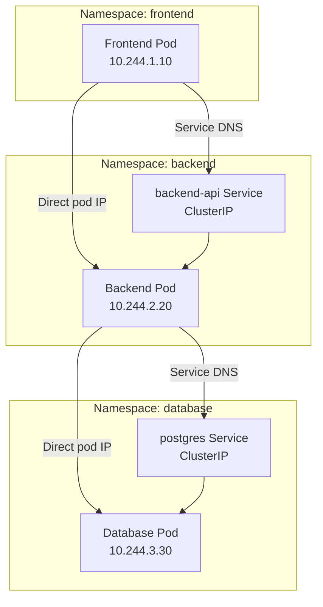
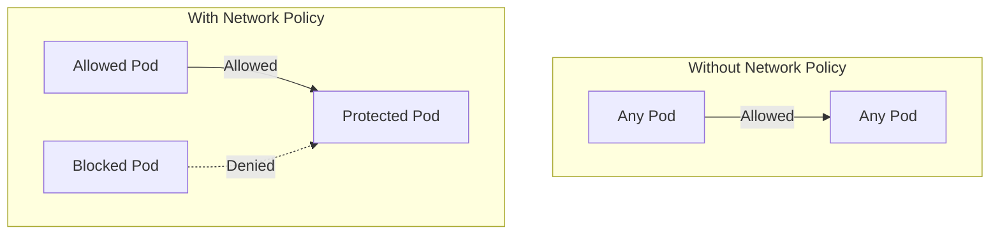
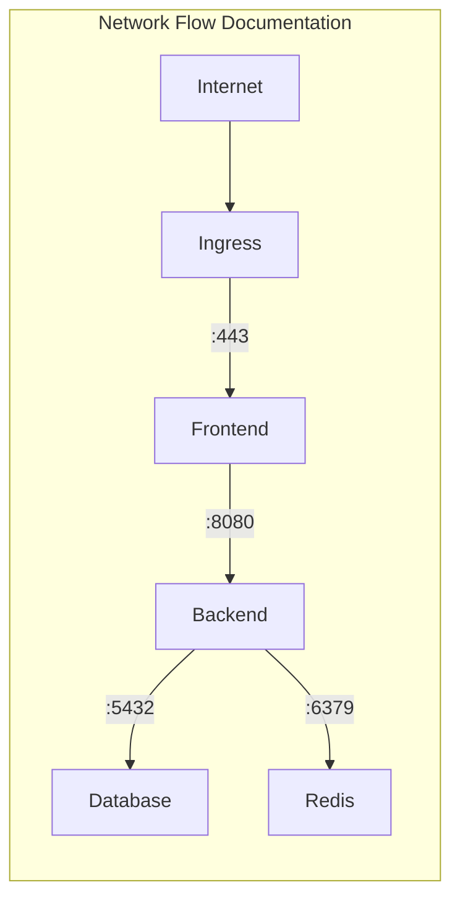

# How to Configure Kubernetes Pod-to-Pod Communication Across Namespaces

Author: [nawazdhandala](https://www.github.com/nawazdhandala)

Tags: Kubernetes, Networking, Namespaces, Network Policies, Service Discovery, DNS

Description: Learn how to configure pod-to-pod communication across Kubernetes namespaces including network isolation, cross-namespace service access, and network policies for secure multi-tenant clusters.

---

Kubernetes namespaces provide logical isolation for resources, but by default, pods in different namespaces can communicate freely. Understanding how to control this communication is essential for multi-tenant clusters, security compliance, and proper service architecture.

This guide covers everything from basic cross-namespace communication to implementing strict network policies.

## Default Behavior: No Isolation

By default, Kubernetes allows unrestricted pod-to-pod communication across all namespaces:



## Cross-Namespace Service Discovery

### DNS-Based Service Discovery

Kubernetes DNS automatically creates records for services. The full DNS name follows this pattern:

```
<service-name>.<namespace>.svc.cluster.local
```

```yaml
# backend/deployment.yaml
# Deploy a backend API in the backend namespace
apiVersion: apps/v1
kind: Deployment
metadata:
  name: backend-api
  namespace: backend
spec:
  replicas: 3
  selector:
    matchLabels:
      app: backend-api
  template:
    metadata:
      labels:
        app: backend-api
    spec:
      containers:
        - name: api
          image: my-backend:latest
          ports:
            - containerPort: 8080

---
apiVersion: v1
kind: Service
metadata:
  name: backend-api
  namespace: backend
spec:
  selector:
    app: backend-api
  ports:
    - port: 80
      targetPort: 8080
```

```yaml
# frontend/deployment.yaml
# Frontend pod accessing backend service across namespaces
apiVersion: apps/v1
kind: Deployment
metadata:
  name: frontend
  namespace: frontend
spec:
  replicas: 2
  selector:
    matchLabels:
      app: frontend
  template:
    metadata:
      labels:
        app: frontend
    spec:
      containers:
        - name: frontend
          image: my-frontend:latest
          env:
            # Access backend using full DNS name
            # Format: <service>.<namespace>.svc.cluster.local
            - name: BACKEND_URL
              value: "http://backend-api.backend.svc.cluster.local"
            # Short form also works (searches through DNS suffixes)
            # - name: BACKEND_URL
            #   value: "http://backend-api.backend"
```

### Testing Cross-Namespace DNS Resolution

```bash
# Create a debug pod in the frontend namespace
kubectl run debug --namespace=frontend --rm -it --image=busybox -- sh

# Inside the pod, test DNS resolution
# Full DNS name (most reliable)
nslookup backend-api.backend.svc.cluster.local

# Short form (relies on DNS search domains)
nslookup backend-api.backend

# Test connectivity
wget -qO- http://backend-api.backend.svc.cluster.local/health
```

### ExternalName Service for Cross-Namespace Access

Create an alias service in your namespace that points to a service in another namespace:

```yaml
# frontend/external-backend.yaml
# Create a local alias to a service in another namespace
apiVersion: v1
kind: Service
metadata:
  name: backend  # Local name in frontend namespace
  namespace: frontend
spec:
  # ExternalName creates a CNAME record
  type: ExternalName
  # Points to the actual service in backend namespace
  externalName: backend-api.backend.svc.cluster.local
```

```bash
# Now frontend pods can use simple name "backend"
# instead of full cross-namespace DNS
curl http://backend/api/users
```

## Implementing Network Isolation

### Network Policies Overview

Network Policies are Kubernetes resources that control pod-to-pod traffic. They require a CNI plugin that supports them (Calico, Cilium, Weave Net).



### Default Deny All Traffic

Start with a deny-all policy as the foundation of your network security:

```yaml
# network-policies/default-deny-all.yaml
# This policy denies all ingress and egress traffic by default
# Apply to each namespace that needs isolation
apiVersion: networking.k8s.io/v1
kind: NetworkPolicy
metadata:
  name: default-deny-all
  namespace: backend
spec:
  # Apply to all pods in this namespace
  podSelector: {}
  # Empty ingress and egress rules = deny all
  policyTypes:
    - Ingress
    - Egress
```

```bash
# Apply default deny to multiple namespaces
for ns in frontend backend database; do
  kubectl apply -f - <<EOF
apiVersion: networking.k8s.io/v1
kind: NetworkPolicy
metadata:
  name: default-deny-all
  namespace: $ns
spec:
  podSelector: {}
  policyTypes:
    - Ingress
    - Egress
EOF
done
```

### Allow Specific Cross-Namespace Traffic

After denying all traffic, explicitly allow what's needed:

```yaml
# network-policies/backend-allow-frontend.yaml
# Allow frontend namespace to access backend pods
apiVersion: networking.k8s.io/v1
kind: NetworkPolicy
metadata:
  name: allow-frontend-to-backend
  namespace: backend
spec:
  # Apply to backend-api pods
  podSelector:
    matchLabels:
      app: backend-api
  policyTypes:
    - Ingress
  ingress:
    # Allow traffic from frontend namespace
    - from:
        - namespaceSelector:
            matchLabels:
              # Namespace must have this label
              kubernetes.io/metadata.name: frontend
        # Optionally restrict to specific pods
        - podSelector:
            matchLabels:
              app: frontend
      ports:
        - protocol: TCP
          port: 8080
```

```yaml
# network-policies/backend-allow-egress-to-database.yaml
# Allow backend pods to connect to database
apiVersion: networking.k8s.io/v1
kind: NetworkPolicy
metadata:
  name: allow-backend-to-database
  namespace: backend
spec:
  podSelector:
    matchLabels:
      app: backend-api
  policyTypes:
    - Egress
  egress:
    # Allow connections to database namespace
    - to:
        - namespaceSelector:
            matchLabels:
              kubernetes.io/metadata.name: database
          podSelector:
            matchLabels:
              app: postgres
      ports:
        - protocol: TCP
          port: 5432
    # Allow DNS resolution (required!)
    - to:
        - namespaceSelector:
            matchLabels:
              kubernetes.io/metadata.name: kube-system
          podSelector:
            matchLabels:
              k8s-app: kube-dns
      ports:
        - protocol: UDP
          port: 53
        - protocol: TCP
          port: 53
```

### Complete Multi-Tier Network Policy Example

```yaml
# network-policies/complete-example.yaml
# Frontend: Can receive external traffic, can talk to backend
---
apiVersion: networking.k8s.io/v1
kind: NetworkPolicy
metadata:
  name: frontend-policy
  namespace: frontend
spec:
  podSelector:
    matchLabels:
      app: frontend
  policyTypes:
    - Ingress
    - Egress
  ingress:
    # Allow from ingress controller
    - from:
        - namespaceSelector:
            matchLabels:
              kubernetes.io/metadata.name: ingress-nginx
      ports:
        - protocol: TCP
          port: 8080
  egress:
    # Allow to backend
    - to:
        - namespaceSelector:
            matchLabels:
              kubernetes.io/metadata.name: backend
          podSelector:
            matchLabels:
              app: backend-api
      ports:
        - protocol: TCP
          port: 8080
    # Allow DNS
    - to:
        - namespaceSelector: {}
          podSelector:
            matchLabels:
              k8s-app: kube-dns
      ports:
        - protocol: UDP
          port: 53

---
# Backend: Can receive from frontend, can talk to database
apiVersion: networking.k8s.io/v1
kind: NetworkPolicy
metadata:
  name: backend-policy
  namespace: backend
spec:
  podSelector:
    matchLabels:
      app: backend-api
  policyTypes:
    - Ingress
    - Egress
  ingress:
    - from:
        - namespaceSelector:
            matchLabels:
              kubernetes.io/metadata.name: frontend
          podSelector:
            matchLabels:
              app: frontend
      ports:
        - protocol: TCP
          port: 8080
  egress:
    # Allow to database
    - to:
        - namespaceSelector:
            matchLabels:
              kubernetes.io/metadata.name: database
          podSelector:
            matchLabels:
              app: postgres
      ports:
        - protocol: TCP
          port: 5432
    # Allow DNS
    - to:
        - namespaceSelector: {}
          podSelector:
            matchLabels:
              k8s-app: kube-dns
      ports:
        - protocol: UDP
          port: 53

---
# Database: Can only receive from backend
apiVersion: networking.k8s.io/v1
kind: NetworkPolicy
metadata:
  name: database-policy
  namespace: database
spec:
  podSelector:
    matchLabels:
      app: postgres
  policyTypes:
    - Ingress
    - Egress
  ingress:
    - from:
        - namespaceSelector:
            matchLabels:
              kubernetes.io/metadata.name: backend
          podSelector:
            matchLabels:
              app: backend-api
      ports:
        - protocol: TCP
          port: 5432
  # Database needs no egress (or limited egress for backups)
  egress: []
```

## Namespace Labels for Network Policies

Network policies use namespace labels to identify allowed sources/destinations:

```bash
# Kubernetes 1.21+ automatically adds this label to all namespaces
kubectl get namespace frontend -o jsonpath='{.metadata.labels}'
# {"kubernetes.io/metadata.name":"frontend"}

# Add custom labels for more flexible policies
kubectl label namespace frontend tier=frontend
kubectl label namespace backend tier=backend
kubectl label namespace database tier=database
kubectl label namespace frontend environment=production
kubectl label namespace backend environment=production
```

```yaml
# Network policy using custom labels
apiVersion: networking.k8s.io/v1
kind: NetworkPolicy
metadata:
  name: allow-same-environment
  namespace: backend
spec:
  podSelector: {}
  policyTypes:
    - Ingress
  ingress:
    # Allow from any namespace with same environment label
    - from:
        - namespaceSelector:
            matchLabels:
              environment: production
```

## Service Accounts for Cross-Namespace Access

When services need to call the Kubernetes API across namespaces:

```yaml
# rbac/cross-namespace-access.yaml
# Allow a service account in frontend to read services in backend
---
apiVersion: v1
kind: ServiceAccount
metadata:
  name: frontend-sa
  namespace: frontend

---
# Role in backend namespace
apiVersion: rbac.authorization.k8s.io/v1
kind: Role
metadata:
  name: service-reader
  namespace: backend
rules:
  - apiGroups: [""]
    resources: ["services", "endpoints"]
    verbs: ["get", "list"]

---
# RoleBinding allowing frontend SA to use the role in backend namespace
apiVersion: rbac.authorization.k8s.io/v1
kind: RoleBinding
metadata:
  name: frontend-can-read-backend-services
  namespace: backend  # This is the target namespace
roleRef:
  apiGroup: rbac.authorization.k8s.io
  kind: Role
  name: service-reader
subjects:
  - kind: ServiceAccount
    name: frontend-sa
    namespace: frontend  # This is the source namespace
```

## Debugging Cross-Namespace Communication

### Test Network Connectivity

```bash
# Deploy a debug pod
kubectl run netshoot --namespace=frontend --rm -it \
  --image=nicolaka/netshoot -- bash

# Test DNS resolution
dig backend-api.backend.svc.cluster.local

# Test TCP connectivity
nc -zv backend-api.backend.svc.cluster.local 80

# Test HTTP
curl -v http://backend-api.backend.svc.cluster.local/health

# Trace network path
traceroute backend-api.backend.svc.cluster.local
```

### Check Network Policy Effects

```bash
# List all network policies
kubectl get networkpolicy -A

# Describe a specific policy
kubectl describe networkpolicy backend-policy -n backend

# Check if CNI supports network policies
kubectl get pods -n kube-system | grep -E "calico|cilium|weave"

# Calico: Check policy is applied
kubectl exec -n kube-system calico-node-xxxxx -- calico-node -felix-live
```

### Common Issues and Solutions

```bash
# Issue 1: DNS not working after applying network policy
# Solution: Ensure DNS egress is allowed
kubectl apply -f - <<EOF
apiVersion: networking.k8s.io/v1
kind: NetworkPolicy
metadata:
  name: allow-dns
  namespace: backend
spec:
  podSelector: {}
  policyTypes:
    - Egress
  egress:
    - to:
        - namespaceSelector: {}
          podSelector:
            matchLabels:
              k8s-app: kube-dns
      ports:
        - protocol: UDP
          port: 53
EOF

# Issue 2: Namespace label not matching
# Check namespace labels
kubectl get namespace backend --show-labels

# Add required label
kubectl label namespace backend kubernetes.io/metadata.name=backend

# Issue 3: Pod selector not matching
# Verify pod labels
kubectl get pods -n backend --show-labels
```

## Best Practices

### 1. Use Explicit Namespace References

```yaml
# Always use fully qualified DNS names in configuration
env:
  # Good: Explicit namespace
  - name: DATABASE_URL
    value: "postgres://postgres.database.svc.cluster.local:5432/mydb"
  
  # Avoid: Relies on DNS search path
  # - name: DATABASE_URL
  #   value: "postgres://postgres:5432/mydb"
```

### 2. Label Namespaces Consistently

```yaml
# namespace-template.yaml
apiVersion: v1
kind: Namespace
metadata:
  name: my-app
  labels:
    # Standard Kubernetes label (auto-added in 1.21+)
    kubernetes.io/metadata.name: my-app
    # Custom labels for network policies
    environment: production
    team: platform
    tier: backend
```

### 3. Start with Deny-All, Whitelist Needed Traffic

```yaml
# Apply to all application namespaces
apiVersion: networking.k8s.io/v1
kind: NetworkPolicy
metadata:
  name: default-deny
spec:
  podSelector: {}
  policyTypes:
    - Ingress
    - Egress
```

### 4. Document Network Flows



## Conclusion

Cross-namespace communication in Kubernetes is straightforward but requires careful planning in multi-tenant or security-conscious environments. Key takeaways:

1. **DNS is your friend** - Use `<service>.<namespace>.svc.cluster.local` for reliable cross-namespace access
2. **Default is open** - Without network policies, all pods can communicate
3. **Start with deny-all** - Then explicitly allow required traffic
4. **Don't forget DNS** - Network policies blocking egress will break DNS resolution
5. **Label namespaces** - Makes network policies more flexible and maintainable

For monitoring your cross-namespace communication and detecting anomalies, check out [OneUptime's Kubernetes monitoring](https://oneuptime.com/product/metrics).

## Related Resources

- [How to Implement Kubernetes RBAC Best Practices](https://oneuptime.com/blog/post/2026-01-19-kubernetes-rbac-multi-tenant-best-practices/view)
- [How to Troubleshoot Kubernetes DNS Issues](https://oneuptime.com/blog/post/2026-01-19-kubernetes-coredns-troubleshooting-guide/view)
- [How to Set Up OPA Gatekeeper for Policy Enforcement](https://oneuptime.com/blog/post/2026-01-19-kubernetes-opa-gatekeeper-policy-enforcement/view)
