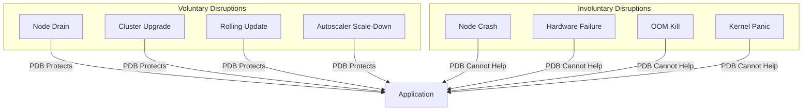

# How to Set Up Pod Disruption Budgets for High Availability

Author: [nawazdhandala](https://www.github.com/nawazdhandala)

Tags: Kubernetes, Pod Disruption Budget, PDB, High Availability, Maintenance, SRE, DevOps

Description: Learn how to configure Pod Disruption Budgets (PDBs) to maintain application availability during voluntary disruptions like node drains, upgrades, and cluster maintenance.

---

Pod Disruption Budgets (PDBs) protect your applications during voluntary disruptions-node drains, cluster upgrades, or autoscaling events. Without PDBs, Kubernetes might evict all your pods simultaneously, causing downtime. PDBs ensure a minimum number of pods remain available.

## Understanding Disruptions



| Disruption Type | PDB Protection | Example |
|-----------------|----------------|---------|
| Voluntary | ✅ Yes | `kubectl drain`, upgrades |
| Involuntary | ❌ No | Node crashes, OOM |

## Basic PDB Configuration

### MinAvailable Strategy

```yaml
# pdb-minavailable.yaml
apiVersion: policy/v1
kind: PodDisruptionBudget
metadata:
  name: myapp-pdb
  namespace: production
spec:
  # At least 2 pods must always be available
  minAvailable: 2
  selector:
    matchLabels:
      app: myapp
```

### MaxUnavailable Strategy

```yaml
# pdb-maxunavailable.yaml
apiVersion: policy/v1
kind: PodDisruptionBudget
metadata:
  name: myapp-pdb
  namespace: production
spec:
  # At most 1 pod can be unavailable at a time
  maxUnavailable: 1
  selector:
    matchLabels:
      app: myapp
```

### Percentage-Based PDB

```yaml
# pdb-percentage.yaml
apiVersion: policy/v1
kind: PodDisruptionBudget
metadata:
  name: myapp-pdb
  namespace: production
spec:
  # At least 50% of pods must be available
  minAvailable: 50%
  selector:
    matchLabels:
      app: myapp
---
# Or limit unavailability to 25%
apiVersion: policy/v1
kind: PodDisruptionBudget
metadata:
  name: myapp-pdb-max
  namespace: production
spec:
  maxUnavailable: 25%
  selector:
    matchLabels:
      app: myapp
```

## Common Patterns

### Web Application (Stateless)

```yaml
# web-app-pdb.yaml
apiVersion: apps/v1
kind: Deployment
metadata:
  name: web-frontend
  namespace: production
spec:
  replicas: 5
  selector:
    matchLabels:
      app: web-frontend
  template:
    metadata:
      labels:
        app: web-frontend
    spec:
      containers:
        - name: web
          image: myregistry/web-frontend:v1.2.0
---
apiVersion: policy/v1
kind: PodDisruptionBudget
metadata:
  name: web-frontend-pdb
  namespace: production
spec:
  # With 5 replicas, allow up to 2 to be unavailable
  maxUnavailable: 2
  selector:
    matchLabels:
      app: web-frontend
```

### API Service (Critical)

```yaml
# api-service-pdb.yaml
apiVersion: apps/v1
kind: Deployment
metadata:
  name: api-service
  namespace: production
spec:
  replicas: 4
  selector:
    matchLabels:
      app: api-service
  template:
    metadata:
      labels:
        app: api-service
    spec:
      # Spread across zones
      topologySpreadConstraints:
        - maxSkew: 1
          topologyKey: topology.kubernetes.io/zone
          whenUnsatisfiable: DoNotSchedule
          labelSelector:
            matchLabels:
              app: api-service
      containers:
        - name: api
          image: myregistry/api-service:v2.1.0
---
apiVersion: policy/v1
kind: PodDisruptionBudget
metadata:
  name: api-service-pdb
  namespace: production
spec:
  # Always keep at least 3 pods running
  minAvailable: 3
  selector:
    matchLabels:
      app: api-service
```

### Database Replicas (Stateful)

```yaml
# database-pdb.yaml
apiVersion: apps/v1
kind: StatefulSet
metadata:
  name: mysql
  namespace: database
spec:
  serviceName: mysql
  replicas: 3
  selector:
    matchLabels:
      app: mysql
  template:
    metadata:
      labels:
        app: mysql
    spec:
      containers:
        - name: mysql
          image: mysql:8.0
          # ... rest of config
---
apiVersion: policy/v1
kind: PodDisruptionBudget
metadata:
  name: mysql-pdb
  namespace: database
spec:
  # For a 3-node MySQL cluster with replication,
  # always keep at least 2 (primary + 1 replica)
  minAvailable: 2
  selector:
    matchLabels:
      app: mysql
```

### Kafka Cluster

```yaml
# kafka-pdb.yaml
apiVersion: policy/v1
kind: PodDisruptionBudget
metadata:
  name: kafka-pdb
  namespace: messaging
spec:
  # With replication factor of 3, can lose 1 broker
  maxUnavailable: 1
  selector:
    matchLabels:
      app: kafka
---
# ZooKeeper needs majority (quorum)
apiVersion: policy/v1
kind: PodDisruptionBudget
metadata:
  name: zookeeper-pdb
  namespace: messaging
spec:
  # 3-node ZK cluster needs 2 for quorum
  minAvailable: 2
  selector:
    matchLabels:
      app: zookeeper
```

### Elasticsearch Cluster

```yaml
# elasticsearch-pdb.yaml
# Master nodes - need majority for quorum
apiVersion: policy/v1
kind: PodDisruptionBudget
metadata:
  name: elasticsearch-master-pdb
  namespace: logging
spec:
  # 3 masters, need 2 for quorum
  minAvailable: 2
  selector:
    matchLabels:
      app: elasticsearch
      role: master
---
# Data nodes - can tolerate more disruption
apiVersion: policy/v1
kind: PodDisruptionBudget
metadata:
  name: elasticsearch-data-pdb
  namespace: logging
spec:
  maxUnavailable: 1
  selector:
    matchLabels:
      app: elasticsearch
      role: data
```

### Redis Cluster

```yaml
# redis-cluster-pdb.yaml
apiVersion: policy/v1
kind: PodDisruptionBudget
metadata:
  name: redis-cluster-pdb
  namespace: cache
spec:
  # Redis Cluster with 6 nodes (3 masters + 3 replicas)
  # Each master has a replica, so we can lose up to 3 
  # (one from each master-replica pair)
  maxUnavailable: 1  # Conservative: one at a time
  selector:
    matchLabels:
      app: redis-cluster
```

## Advanced Configurations

### Multiple PDBs for Different Components

```yaml
# multi-component-pdb.yaml
apiVersion: policy/v1
kind: PodDisruptionBudget
metadata:
  name: app-frontend-pdb
  namespace: production
spec:
  maxUnavailable: 30%
  selector:
    matchLabels:
      app: myapp
      tier: frontend
---
apiVersion: policy/v1
kind: PodDisruptionBudget
metadata:
  name: app-backend-pdb
  namespace: production
spec:
  maxUnavailable: 1  # More conservative for backend
  selector:
    matchLabels:
      app: myapp
      tier: backend
---
apiVersion: policy/v1
kind: PodDisruptionBudget
metadata:
  name: app-cache-pdb
  namespace: production
spec:
  minAvailable: 50%
  selector:
    matchLabels:
      app: myapp
      tier: cache
```

### Unhealthy Pod Eviction Policy (Kubernetes 1.26+)

```yaml
# unhealthy-pod-eviction.yaml
apiVersion: policy/v1
kind: PodDisruptionBudget
metadata:
  name: myapp-pdb
  namespace: production
spec:
  minAvailable: 2
  selector:
    matchLabels:
      app: myapp
  # Allow eviction of unhealthy pods even when at budget limit
  unhealthyPodEvictionPolicy: AlwaysAllow
  # Options:
  # - IfHealthyBudget (default): Only evict unhealthy if healthy pods meet budget
  # - AlwaysAllow: Always allow eviction of unhealthy pods
```

## Calculating PDB Values

### General Formula

```bash
# For high availability:
# minAvailable = ceil(replicas * desired_availability_percentage)

# Examples:
# 5 replicas, 80% availability -> minAvailable = ceil(5 * 0.8) = 4
# 3 replicas, 66% availability -> minAvailable = ceil(3 * 0.66) = 2

# For disruption tolerance:
# maxUnavailable = floor(replicas * acceptable_disruption_percentage)

# Examples:
# 5 replicas, 40% disruption OK -> maxUnavailable = floor(5 * 0.4) = 2
# 10 replicas, 20% disruption OK -> maxUnavailable = floor(10 * 0.2) = 2
```

### Quorum-Based Systems

```yaml
# For systems requiring quorum (ZK, etcd, etc.)
# Quorum = floor(N/2) + 1
# maxUnavailable = N - Quorum

# 3 nodes: Quorum = 2, maxUnavailable = 1
# 5 nodes: Quorum = 3, maxUnavailable = 2
# 7 nodes: Quorum = 4, maxUnavailable = 3

apiVersion: policy/v1
kind: PodDisruptionBudget
metadata:
  name: etcd-pdb
spec:
  maxUnavailable: 1  # For 3-node cluster
  selector:
    matchLabels:
      app: etcd
```

## Verifying PDB Status

### Check PDB Status

```bash
# List all PDBs
kubectl get pdb -A

# Detailed PDB info
kubectl describe pdb myapp-pdb -n production

# Output:
# Name:           myapp-pdb
# Namespace:      production
# Min available:  2
# Selector:       app=myapp
# Status:
#     Allowed disruptions:  2
#     Current:              4
#     Desired:              4
#     Total:                4
```

### Monitor During Drain

```bash
# Watch PDB status during node drain
kubectl get pdb -n production -w

# Check events
kubectl get events -n production --field-selector reason=DisruptionBlocked
```

## Common Issues

### PDB Blocking Drain

```bash
# If drain is blocked
kubectl drain node-1 --ignore-daemonsets --delete-emptydir-data

# Check what's blocking
kubectl get pdb -A

# Force drain (use with caution!)
kubectl drain node-1 --ignore-daemonsets --delete-emptydir-data --force
```

### PDB with Single Replica

```yaml
# AVOID: This blocks all disruptions!
apiVersion: policy/v1
kind: PodDisruptionBudget
metadata:
  name: bad-pdb
spec:
  minAvailable: 1
  selector:
    matchLabels:
      app: single-replica-app

# With only 1 replica and minAvailable=1:
# - No pod can ever be evicted
# - Node drains will hang forever
# - Cluster upgrades will be blocked

# BETTER: Don't use PDB for single replicas
# OR use maxUnavailable if disruption is acceptable
apiVersion: policy/v1
kind: PodDisruptionBudget
metadata:
  name: better-pdb
spec:
  maxUnavailable: 1  # Allows the single pod to be evicted
  selector:
    matchLabels:
      app: single-replica-app
```

### Missing Pods (Selector Mismatch)

```bash
# Check if PDB selector matches pods
kubectl get pods -n production -l app=myapp

# Verify PDB is tracking correct pods
kubectl get pdb myapp-pdb -n production -o yaml
```

## Monitoring PDBs

### Prometheus Metrics

```yaml
# pdb-alerts.yaml
apiVersion: monitoring.coreos.com/v1
kind: PrometheusRule
metadata:
  name: pdb-alerts
  namespace: monitoring
spec:
  groups:
    - name: pdb
      rules:
        - alert: PDBAtLimit
          expr: kube_poddisruptionbudget_status_current_healthy == kube_poddisruptionbudget_status_desired_healthy
          for: 5m
          labels:
            severity: warning
          annotations:
            summary: "PDB {{ $labels.poddisruptionbudget }} is at limit"
            description: "PDB {{ $labels.namespace }}/{{ $labels.poddisruptionbudget }} has no disruption budget remaining"
        
        - alert: PDBBlockingOperations
          expr: kube_poddisruptionbudget_status_pod_disruptions_allowed == 0
          for: 30m
          labels:
            severity: warning
          annotations:
            summary: "PDB {{ $labels.poddisruptionbudget }} is blocking operations"
            description: "PDB {{ $labels.namespace }}/{{ $labels.poddisruptionbudget }} has been blocking disruptions for 30 minutes"
        
        - alert: PDBUnhealthyPods
          expr: |
            kube_poddisruptionbudget_status_current_healthy 
            < 
            kube_poddisruptionbudget_status_desired_healthy
          for: 10m
          labels:
            severity: warning
          annotations:
            summary: "Unhealthy pods in PDB {{ $labels.poddisruptionbudget }}"
```

### Grafana Dashboard Query

```promql
# Allowed disruptions by PDB
kube_poddisruptionbudget_status_pod_disruptions_allowed

# Current vs desired healthy pods
kube_poddisruptionbudget_status_current_healthy
/
kube_poddisruptionbudget_status_desired_healthy

# PDBs at zero budget
count(kube_poddisruptionbudget_status_pod_disruptions_allowed == 0)
```

## Best Practices

### 1. Always Have PDBs for Production Workloads

```yaml
# Every production deployment should have a PDB
apiVersion: apps/v1
kind: Deployment
metadata:
  name: production-app
spec:
  replicas: 3
# ...
---
apiVersion: policy/v1
kind: PodDisruptionBudget
metadata:
  name: production-app-pdb
spec:
  maxUnavailable: 1
  selector:
    matchLabels:
      app: production-app
```

### 2. Consider Update Strategy

```yaml
# Ensure deployment strategy works with PDB
apiVersion: apps/v1
kind: Deployment
spec:
  replicas: 4
  strategy:
    type: RollingUpdate
    rollingUpdate:
      maxSurge: 1
      maxUnavailable: 1  # Should align with PDB
```

### 3. Use Topology Spread with PDB

```yaml
# Spread pods so PDB is effective across zones
topologySpreadConstraints:
  - maxSkew: 1
    topologyKey: topology.kubernetes.io/zone
    whenUnsatisfiable: DoNotSchedule
```

## Summary

| Replicas | Recommended PDB | Rationale |
|----------|-----------------|-----------|
| 1 | maxUnavailable: 1 or none | Can't avoid downtime |
| 2 | maxUnavailable: 1 | Always keep 1 running |
| 3 | minAvailable: 2 | Maintain majority/quorum |
| 4-5 | maxUnavailable: 1-2 | Gradual disruption |
| 6+ | maxUnavailable: 25% | Percentage-based |

## Related Posts

- [How to Drain and Cordon Kubernetes Nodes for Maintenance](https://oneuptime.com/blog/post/2026-01-19-kubernetes-drain-cordon-node-maintenance/view) - Node maintenance procedures
- [How to Upgrade Kubernetes Clusters with Zero Downtime](https://oneuptime.com/blog/post/2026-01-19-kubernetes-upgrade-zero-downtime/view) - Upgrade strategies
- [How to Implement Leader Election in Kubernetes Pods](https://oneuptime.com/blog/post/2026-01-19-kubernetes-leader-election-pods/view) - HA patterns
