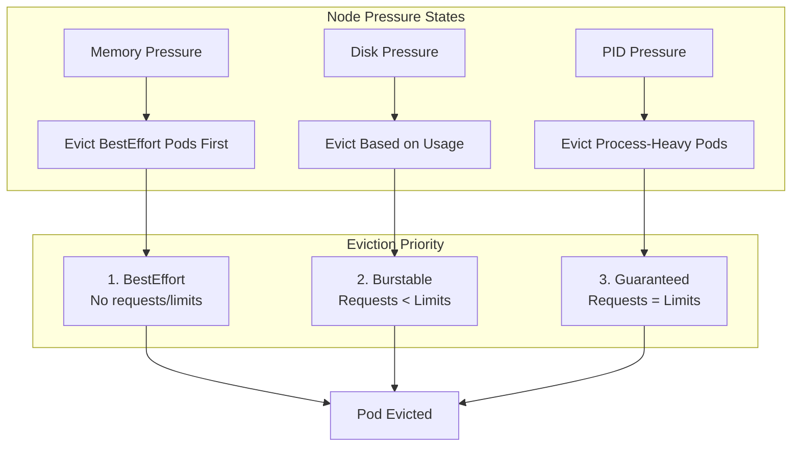

# How to Handle Kubernetes Pod Evictions and Resource Pressure

Author: [nawazdhandala](https://www.github.com/nawazdhandala)

Tags: Kubernetes, Pod Eviction, Resource Pressure, Node Conditions, Memory, Disk, DevOps

Description: Learn how to troubleshoot and prevent Kubernetes pod evictions caused by memory, disk, and PID resource pressure, including configuring eviction thresholds and monitoring strategies.

---

Pod evictions are Kubernetes' way of protecting node stability when resources become scarce. Understanding why evictions happen and how to prevent them is crucial for running reliable production workloads.

This guide covers the causes, troubleshooting, and prevention of resource-based pod evictions.

## Understanding Resource Pressure and Evictions



## Types of Resource Pressure

### Memory Pressure

```bash
# Check for memory pressure on nodes
kubectl describe nodes | grep -A5 "Conditions:"

# Example output:
# Conditions:
#   Type                 Status  Reason
#   ----                 ------  ------
#   MemoryPressure       True    KubeletHasMemoryPressure
#   DiskPressure         False   KubeletHasNoDiskPressure
#   PIDPressure          False   KubeletHasSufficientPID

# Get detailed memory info
kubectl top nodes
kubectl describe node worker-node-1 | grep -A15 "Allocated resources:"
```

### Disk Pressure

```bash
# Check disk pressure
kubectl describe nodes | grep DiskPressure

# Check available disk space on nodes
kubectl get nodes -o custom-columns=\
"NAME:.metadata.name,\
DISK:.status.allocatable.ephemeral-storage"

# SSH to node and check disk
df -h
du -sh /var/lib/docker
du -sh /var/lib/kubelet
du -sh /var/log
```

### PID Pressure

```bash
# Check PID pressure
kubectl describe nodes | grep PIDPressure

# Check PID allocation
kubectl get nodes -o custom-columns=\
"NAME:.metadata.name,\
PIDS:.status.allocatable.pods"

# SSH to node and check processes
ps aux | wc -l
cat /proc/sys/kernel/pid_max
```

## Identifying Evicted Pods

```bash
# Find evicted pods
kubectl get pods --all-namespaces --field-selector 'status.phase=Failed' | grep Evicted

# Get details about evicted pods
kubectl get pods --all-namespaces -o json | \
  jq -r '.items[] | select(.status.phase=="Failed" and .status.reason=="Evicted") | 
  "\(.metadata.namespace)/\(.metadata.name): \(.status.message)"'

# Check events for eviction reasons
kubectl get events --all-namespaces --sort-by='.lastTimestamp' | grep -i evict

# Detailed eviction info
kubectl describe pod evicted-pod-name -n namespace
```

## Eviction Thresholds

### Default Kubelet Eviction Thresholds

```yaml
# Default soft eviction thresholds (can be delayed)
memory.available < 100Mi         # 100Mi free memory
nodefs.available < 10%           # 10% filesystem available
nodefs.inodesFree < 5%           # 5% inodes available
imagefs.available < 15%          # 15% image filesystem available

# Default hard eviction thresholds (immediate eviction)
memory.available < 100Mi         # Same as soft by default
nodefs.available < 10%
nodefs.inodesFree < 5%
imagefs.available < 15%
```

### Configuring Custom Eviction Thresholds

```yaml
# kubelet-config.yaml
apiVersion: kubelet.config.k8s.io/v1beta1
kind: KubeletConfiguration
evictionHard:
  # Hard thresholds - immediate eviction
  memory.available: "200Mi"
  nodefs.available: "10%"
  nodefs.inodesFree: "5%"
  imagefs.available: "10%"
evictionSoft:
  # Soft thresholds - eviction after grace period
  memory.available: "500Mi"
  nodefs.available: "15%"
  nodefs.inodesFree: "10%"
  imagefs.available: "15%"
evictionSoftGracePeriod:
  # How long soft threshold must be exceeded
  memory.available: "1m30s"
  nodefs.available: "2m"
  nodefs.inodesFree: "2m"
  imagefs.available: "2m"
evictionMaxPodGracePeriod: 60
evictionPressureTransitionPeriod: "30s"
```

## QoS Classes and Eviction Order

### Understanding QoS Classes

```yaml
# Guaranteed QoS - Requests = Limits for all containers
# Last to be evicted
apiVersion: v1
kind: Pod
metadata:
  name: guaranteed-pod
spec:
  containers:
    - name: app
      image: myapp:latest
      resources:
        requests:
          memory: "512Mi"
          cpu: "500m"
        limits:
          memory: "512Mi"    # Same as request
          cpu: "500m"        # Same as request
---
# Burstable QoS - Has requests, but limits > requests
# Evicted after BestEffort
apiVersion: v1
kind: Pod
metadata:
  name: burstable-pod
spec:
  containers:
    - name: app
      image: myapp:latest
      resources:
        requests:
          memory: "256Mi"
          cpu: "250m"
        limits:
          memory: "512Mi"    # Higher than request
          cpu: "500m"
---
# BestEffort QoS - No requests or limits
# First to be evicted
apiVersion: v1
kind: Pod
metadata:
  name: besteffort-pod
spec:
  containers:
    - name: app
      image: myapp:latest
      # No resources specified
```

### Checking Pod QoS Class

```bash
# Get QoS class for all pods
kubectl get pods -o custom-columns=\
"NAME:.metadata.name,\
QOS:.status.qosClass,\
REQUESTS_MEM:.spec.containers[*].resources.requests.memory,\
LIMITS_MEM:.spec.containers[*].resources.limits.memory"

# Find BestEffort pods (high eviction risk)
kubectl get pods --all-namespaces -o json | \
  jq -r '.items[] | select(.status.qosClass=="BestEffort") | 
  "\(.metadata.namespace)/\(.metadata.name)"'
```

## Preventing Evictions

### 1. Set Appropriate Resource Requests and Limits

```yaml
# Always set resource requests and limits
apiVersion: apps/v1
kind: Deployment
metadata:
  name: my-app
spec:
  template:
    spec:
      containers:
        - name: app
          image: myapp:latest
          resources:
            requests:
              memory: "256Mi"      # Based on actual usage
              cpu: "100m"
            limits:
              memory: "512Mi"      # Allow some burst room
              cpu: "500m"
```

### 2. Use Pod Priority and Preemption

```yaml
# Create a high-priority class
apiVersion: scheduling.k8s.io/v1
kind: PriorityClass
metadata:
  name: high-priority
value: 1000000
globalDefault: false
description: "High priority for critical workloads"
---
# Use it in pods
apiVersion: v1
kind: Pod
metadata:
  name: critical-pod
spec:
  priorityClassName: high-priority
  containers:
    - name: app
      image: critical-app:latest
```

### 3. Implement Limit Ranges

```yaml
# Enforce resource defaults at namespace level
apiVersion: v1
kind: LimitRange
metadata:
  name: default-limits
  namespace: production
spec:
  limits:
    - default:
        memory: "512Mi"
        cpu: "500m"
      defaultRequest:
        memory: "256Mi"
        cpu: "100m"
      min:
        memory: "64Mi"
        cpu: "50m"
      max:
        memory: "2Gi"
        cpu: "2"
      type: Container
```

### 4. Configure Resource Quotas

```yaml
# Prevent over-commitment at namespace level
apiVersion: v1
kind: ResourceQuota
metadata:
  name: namespace-quota
  namespace: production
spec:
  hard:
    requests.cpu: "10"
    requests.memory: "20Gi"
    limits.cpu: "20"
    limits.memory: "40Gi"
    pods: "50"
```

### 5. Reserve Resources for System

```yaml
# kubelet-config.yaml - Reserve resources for kubelet and system
apiVersion: kubelet.config.k8s.io/v1beta1
kind: KubeletConfiguration
systemReserved:
  cpu: "500m"
  memory: "1Gi"
  ephemeral-storage: "10Gi"
kubeReserved:
  cpu: "500m"
  memory: "1Gi"
  ephemeral-storage: "10Gi"
enforceNodeAllocatable:
  - pods
  - system-reserved
  - kube-reserved
```

## Monitoring Resource Usage

### Prometheus Queries for Eviction Prevention

```yaml
# prometheus-alerts.yaml
apiVersion: monitoring.coreos.com/v1
kind: PrometheusRule
metadata:
  name: eviction-alerts
spec:
  groups:
    - name: eviction.rules
      rules:
        # Memory approaching eviction threshold
        - alert: NodeMemoryPressure
          expr: |
            (node_memory_MemAvailable_bytes / node_memory_MemTotal_bytes) < 0.15
          for: 5m
          labels:
            severity: warning
          annotations:
            summary: "Node {{ $labels.instance }} is under memory pressure"
            
        # Disk approaching eviction threshold
        - alert: NodeDiskPressure
          expr: |
            (node_filesystem_avail_bytes{mountpoint="/"} / 
             node_filesystem_size_bytes{mountpoint="/"}) < 0.15
          for: 5m
          labels:
            severity: warning
            
        # Pod using more memory than requested
        - alert: PodMemoryOvercommit
          expr: |
            container_memory_usage_bytes{container!=""} > 
            container_spec_memory_limit_bytes{container!=""} * 0.9
          for: 5m
          labels:
            severity: warning
```

### Grafana Dashboard Query Examples

```promql
# Memory available percentage
100 - (100 * node_memory_MemAvailable_bytes / node_memory_MemTotal_bytes)

# Disk available percentage
100 - (100 * node_filesystem_avail_bytes{mountpoint="/"} / node_filesystem_size_bytes{mountpoint="/"})

# Pods by QoS class
count(kube_pod_status_qos_class) by (qos_class)

# Eviction events
sum(increase(kubelet_evictions{eviction_signal="allocatableMemory.available"}[1h])) by (node)
```

## Handling Active Memory Pressure

### Emergency Response

```bash
# 1. Check current pressure
kubectl describe nodes | grep -A5 "Conditions:" | grep -E "(Memory|Disk|PID)Pressure"

# 2. Find top memory consumers
kubectl top pods --all-namespaces --sort-by=memory | head -20

# 3. Find pods exceeding their requests
kubectl get pods --all-namespaces -o json | jq -r '
  .items[] | 
  select(.status.phase=="Running") |
  "\(.metadata.namespace)/\(.metadata.name): \(.spec.containers[].resources.requests.memory // "none")"
' | sort

# 4. Scale down non-critical workloads
kubectl scale deployment non-critical-app --replicas=0 -n staging

# 5. Delete evicted pods to free up resources
kubectl delete pods --all-namespaces --field-selector 'status.phase=Failed'
```

### Disk Pressure Response

```bash
# Find and clean up old images
crictl images | sort -k3 -h
crictl rmi --prune

# Clean up old container logs
find /var/log/containers -name "*.log" -mtime +7 -delete

# Clean up unused volumes
kubectl get pv | grep Released
kubectl delete pv released-pv-name

# Clean up completed jobs
kubectl delete jobs --all-namespaces --field-selector status.successful=1
```

## Cleanup Evicted Pods Script

```bash
#!/bin/bash
# cleanup-evicted-pods.sh

echo "Finding evicted pods..."
EVICTED=$(kubectl get pods --all-namespaces --field-selector 'status.phase=Failed' \
  -o json | jq -r '.items[] | select(.status.reason=="Evicted") | 
  "\(.metadata.namespace) \(.metadata.name)"')

if [ -z "$EVICTED" ]; then
  echo "No evicted pods found"
  exit 0
fi

echo "Found evicted pods:"
echo "$EVICTED" | while read ns name; do
  echo "  $ns/$name"
done

echo ""
read -p "Delete all evicted pods? (y/n) " -n 1 -r
echo ""

if [[ $REPLY =~ ^[Yy]$ ]]; then
  echo "$EVICTED" | while read ns name; do
    echo "Deleting $ns/$name"
    kubectl delete pod "$name" -n "$ns"
  done
  echo "Done!"
fi
```

## Best Practices Summary

1. **Always set resource requests** - Prevents BestEffort QoS and unpredictable evictions
2. **Use Guaranteed QoS for critical workloads** - Set requests equal to limits
3. **Monitor node resources** - Alert before hitting eviction thresholds
4. **Configure appropriate eviction thresholds** - Based on your workload patterns
5. **Reserve system resources** - Use systemReserved and kubeReserved
6. **Clean up regularly** - Remove evicted pods, old images, and logs

## Conclusion

Understanding and preventing pod evictions is essential for cluster stability. Key takeaways:

1. **Know your QoS classes** - Guaranteed pods are evicted last
2. **Set proper resource limits** - Based on actual usage patterns
3. **Monitor proactively** - Don't wait for evictions to notice pressure
4. **Configure eviction thresholds** - Tune for your specific workloads
5. **Have emergency playbooks** - Know how to respond quickly

For comprehensive resource monitoring and eviction alerting, check out [OneUptime's infrastructure monitoring](https://oneuptime.com/product/metrics).

## Related Resources

- [How to Drain and Cordon Nodes for Maintenance](https://oneuptime.com/blog/post/kubernetes-drain-cordon-node-maintenance/view)
- [How to Set Resource Quotas and Limit Ranges](https://oneuptime.com/blog/post/kubernetes-resource-quotas-limit-ranges/view)
- [How to Right-Size Resources with VPA](https://oneuptime.com/blog/post/kubernetes-resource-right-sizing-vpa/view)
