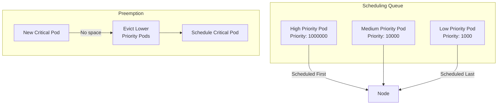

# How to Configure Pod Priority and Preemption in Kubernetes

Author: [nawazdhandala](https://www.github.com/nawazdhandala)

Tags: Kubernetes, Pod Priority, Preemption, Scheduling, Resource Management, DevOps

Description: Learn how to configure pod priority classes and preemption in Kubernetes to ensure critical workloads are scheduled when resources are scarce.

---

Pod priority and preemption ensure critical workloads run even when cluster resources are constrained. This guide covers configuring priority classes, understanding preemption, and best practices for production environments.

## Priority and Preemption Overview



| Concept | Description |
|---------|-------------|
| Priority | Integer value determining scheduling order |
| Preemption | Evicting lower priority pods for higher ones |
| PriorityClass | Kubernetes resource defining priority |
| PreemptionPolicy | Controls if pod can preempt others |

## Priority Classes

### Creating Priority Classes

```yaml
# priority-classes.yaml
# System critical - highest priority
apiVersion: scheduling.k8s.io/v1
kind: PriorityClass
metadata:
  name: system-critical
value: 1000000000
globalDefault: false
preemptionPolicy: PreemptLowerPriority
description: "System critical components - kube-system pods"
---
# Platform critical - essential platform services
apiVersion: scheduling.k8s.io/v1
kind: PriorityClass
metadata:
  name: platform-critical
value: 100000000
globalDefault: false
preemptionPolicy: PreemptLowerPriority
description: "Platform services - monitoring, logging, ingress"
---
# Production high - customer-facing production workloads
apiVersion: scheduling.k8s.io/v1
kind: PriorityClass
metadata:
  name: production-high
value: 10000000
globalDefault: false
preemptionPolicy: PreemptLowerPriority
description: "High priority production workloads"
---
# Production standard - regular production workloads
apiVersion: scheduling.k8s.io/v1
kind: PriorityClass
metadata:
  name: production-standard
value: 1000000
globalDefault: true
preemptionPolicy: PreemptLowerPriority
description: "Standard production workloads - default"
---
# Batch processing - background jobs
apiVersion: scheduling.k8s.io/v1
kind: PriorityClass
metadata:
  name: batch-processing
value: 100000
globalDefault: false
preemptionPolicy: PreemptLowerPriority
description: "Batch processing and background jobs"
---
# Development - lowest priority
apiVersion: scheduling.k8s.io/v1
kind: PriorityClass
metadata:
  name: development
value: 1000
globalDefault: false
preemptionPolicy: Never  # Never preempt other pods
description: "Development and testing workloads"
```

### Built-in Priority Classes

```bash
# View existing priority classes
kubectl get priorityclasses

# Built-in classes:
# system-cluster-critical: 2000000000
# system-node-critical: 2000001000

# These are reserved for kube-system components
```

## Using Priority Classes

### Deployment with Priority

```yaml
# high-priority-deployment.yaml
apiVersion: apps/v1
kind: Deployment
metadata:
  name: payment-service
  labels:
    app: payment-service
spec:
  replicas: 3
  selector:
    matchLabels:
      app: payment-service
  template:
    metadata:
      labels:
        app: payment-service
    spec:
      priorityClassName: production-high
      containers:
        - name: payment
          image: payment-service:latest
          resources:
            requests:
              memory: "512Mi"
              cpu: "500m"
            limits:
              memory: "1Gi"
              cpu: "1000m"
          ports:
            - containerPort: 8080
```

### StatefulSet with Priority

```yaml
# database-priority.yaml
apiVersion: apps/v1
kind: StatefulSet
metadata:
  name: postgresql
spec:
  serviceName: postgresql
  replicas: 3
  selector:
    matchLabels:
      app: postgresql
  template:
    metadata:
      labels:
        app: postgresql
    spec:
      priorityClassName: platform-critical
      terminationGracePeriodSeconds: 60
      containers:
        - name: postgresql
          image: postgresql:14
          resources:
            requests:
              memory: "2Gi"
              cpu: "1000m"
            limits:
              memory: "4Gi"
              cpu: "2000m"
```

### Batch Job with Low Priority

```yaml
# batch-job-priority.yaml
apiVersion: batch/v1
kind: Job
metadata:
  name: data-processing
spec:
  parallelism: 5
  completions: 10
  template:
    spec:
      priorityClassName: batch-processing
      restartPolicy: OnFailure
      containers:
        - name: processor
          image: data-processor:latest
          resources:
            requests:
              memory: "1Gi"
              cpu: "500m"
            limits:
              memory: "2Gi"
              cpu: "1000m"
```

## Preemption Policies

### PreemptLowerPriority (Default)

```yaml
# Can preempt lower priority pods
apiVersion: scheduling.k8s.io/v1
kind: PriorityClass
metadata:
  name: preempting-class
value: 1000000
preemptionPolicy: PreemptLowerPriority
```

### Never Preempt

```yaml
# Never preempt - good for batch jobs
apiVersion: scheduling.k8s.io/v1
kind: PriorityClass
metadata:
  name: non-preempting
value: 1000000
preemptionPolicy: Never
description: "High priority but will not preempt other pods"
```

### Mixed Strategy

```yaml
# production-priorities.yaml
# Critical services can preempt
apiVersion: scheduling.k8s.io/v1
kind: PriorityClass
metadata:
  name: critical-preempting
value: 2000000
preemptionPolicy: PreemptLowerPriority
description: "Critical services that can preempt"
---
# High priority but won't disrupt others
apiVersion: scheduling.k8s.io/v1
kind: PriorityClass
metadata:
  name: high-non-preempting
value: 1500000
preemptionPolicy: Never
description: "High priority but won't evict running pods"
```

## Resource Management with Priority

### Combined with Resource Quotas

```yaml
# namespace-quotas.yaml
apiVersion: v1
kind: Namespace
metadata:
  name: production
---
apiVersion: v1
kind: ResourceQuota
metadata:
  name: production-quota
  namespace: production
spec:
  hard:
    requests.cpu: "100"
    requests.memory: "200Gi"
    limits.cpu: "200"
    limits.memory: "400Gi"
    pods: "100"
  scopeSelector:
    matchExpressions:
      - operator: In
        scopeName: PriorityClass
        values:
          - production-high
          - production-standard
---
# Separate quota for batch
apiVersion: v1
kind: ResourceQuota
metadata:
  name: batch-quota
  namespace: production
spec:
  hard:
    requests.cpu: "20"
    requests.memory: "40Gi"
    pods: "50"
  scopeSelector:
    matchExpressions:
      - operator: In
        scopeName: PriorityClass
        values:
          - batch-processing
```

### Priority-Based Limit Ranges

```yaml
# limit-ranges.yaml
apiVersion: v1
kind: LimitRange
metadata:
  name: production-limits
  namespace: production
spec:
  limits:
    - type: Pod
      max:
        cpu: "8"
        memory: "16Gi"
      min:
        cpu: "100m"
        memory: "64Mi"
    - type: Container
      default:
        cpu: "500m"
        memory: "512Mi"
      defaultRequest:
        cpu: "250m"
        memory: "256Mi"
```

## Monitoring Priority and Preemption

### Check Pod Priority

```bash
# View pod priority
kubectl get pods -o custom-columns='NAME:.metadata.name,PRIORITY:.spec.priority,CLASS:.spec.priorityClassName'

# Detailed view
kubectl describe pod <pod-name> | grep -A 2 Priority

# See preemption events
kubectl get events --field-selector reason=Preempted

# Watch scheduling events
kubectl get events --field-selector reason=Scheduled --watch
```

### Prometheus Metrics

```promql
# Pending pods by priority
kube_pod_status_phase{phase="Pending"} * on(pod) group_left(priority_class) kube_pod_spec_priority_class

# Preemption events
increase(kube_pod_container_status_terminated_reason{reason="Preempted"}[1h])

# Resource usage by priority class
sum(container_memory_usage_bytes) by (priority_class)
```

## Best Practices

### Priority Class Naming Convention

```yaml
# Recommended naming structure
# <tier>-<criticality>

# Tier examples:
# - system (Kubernetes components)
# - platform (shared services)
# - production (customer workloads)
# - staging (pre-production)
# - development (dev/test)

# Priority values:
# system-critical: 1000000000
# platform-critical: 100000000
# production-high: 10000000
# production-standard: 1000000
# staging: 100000
# development: 1000
```

### Deployment Strategy

```yaml
# Multi-tier deployment example
---
# API Gateway - highest priority
apiVersion: apps/v1
kind: Deployment
metadata:
  name: api-gateway
spec:
  replicas: 3
  selector:
    matchLabels:
      app: api-gateway
  template:
    metadata:
      labels:
        app: api-gateway
    spec:
      priorityClassName: production-high
      containers:
        - name: gateway
          image: envoy:latest
          resources:
            requests:
              memory: "256Mi"
              cpu: "250m"
---
# Core API - high priority
apiVersion: apps/v1
kind: Deployment
metadata:
  name: core-api
spec:
  replicas: 5
  selector:
    matchLabels:
      app: core-api
  template:
    metadata:
      labels:
        app: core-api
    spec:
      priorityClassName: production-high
      containers:
        - name: api
          image: core-api:latest
          resources:
            requests:
              memory: "512Mi"
              cpu: "500m"
---
# Background workers - lower priority
apiVersion: apps/v1
kind: Deployment
metadata:
  name: background-worker
spec:
  replicas: 10
  selector:
    matchLabels:
      app: background-worker
  template:
    metadata:
      labels:
        app: background-worker
    spec:
      priorityClassName: batch-processing
      containers:
        - name: worker
          image: worker:latest
          resources:
            requests:
              memory: "256Mi"
              cpu: "250m"
```

### Pod Disruption Budgets with Priority

```yaml
# pdb-with-priority.yaml
# Critical service - always maintain availability
apiVersion: policy/v1
kind: PodDisruptionBudget
metadata:
  name: critical-api-pdb
spec:
  minAvailable: 2
  selector:
    matchLabels:
      app: critical-api
---
# Batch jobs - can be more flexible
apiVersion: policy/v1
kind: PodDisruptionBudget
metadata:
  name: batch-pdb
spec:
  maxUnavailable: "50%"
  selector:
    matchLabels:
      tier: batch
```

## Troubleshooting

### Debug Preemption Issues

```bash
# Check why pod is pending
kubectl describe pod <pending-pod> | grep -A 10 Events

# View scheduler decisions
kubectl logs -n kube-system -l component=kube-scheduler | grep <pod-name>

# Check preemption candidates
kubectl get pods --all-namespaces -o custom-columns=\
'NAMESPACE:.metadata.namespace,NAME:.metadata.name,PRIORITY:.spec.priority,NODE:.spec.nodeName' \
| sort -t',' -k3 -n

# Find pods that can be preempted
kubectl get pods --all-namespaces -o json | jq '.items[] | 
  select(.spec.priority < 1000000) | 
  {namespace: .metadata.namespace, name: .metadata.name, priority: .spec.priority}'
```

### Common Issues

```yaml
# Issue: Pod not being scheduled despite high priority
# Check: Node has enough resources?
# Check: Taints and tolerations match?
# Check: Node affinity satisfied?

# Issue: Lower priority pods being preempted unexpectedly
# Solution: Use PodDisruptionBudget
# Solution: Set preemptionPolicy: Never for stable workloads

# Issue: Too many preemptions causing instability
# Solution: Right-size resource requests
# Solution: Add more cluster capacity
# Solution: Use resource quotas per priority class
```

## Conclusion

Pod priority and preemption ensure critical workloads run during resource contention:

1. **Define clear priority tiers** - System, platform, production, batch, dev
2. **Set appropriate preemption policies** - Not all high-priority pods need to preempt
3. **Combine with resource quotas** - Prevent priority abuse
4. **Use PDBs for stability** - Protect against excessive preemption
5. **Monitor and alert** - Track preemption events and pending pods

For monitoring your Kubernetes scheduling, check out [OneUptime's cluster monitoring](https://oneuptime.com/product/metrics).

## Related Resources

- [How to Configure Node Affinity](https://oneuptime.com/blog/post/2026-01-19-kubernetes-node-affinity-anti-affinity/view)
- [How to Configure Taints and Tolerations](https://oneuptime.com/blog/post/2026-01-19-kubernetes-taints-tolerations-scheduling/view)
- [How to Manage Resource Quotas](https://oneuptime.com/blog/post/2026-01-19-kubernetes-resource-quotas-limit-ranges/view)
