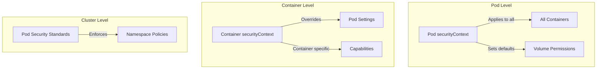

# How to Implement Kubernetes Pod Security Contexts Correctly

Author: [nawazdhandala](https://www.github.com/nawazdhandala)

Tags: Kubernetes, Security, Pod Security, securityContext, RBAC, Containers, DevSecOps

Description: Learn how to properly implement Kubernetes Pod Security Contexts to enforce least privilege, prevent container escapes, and comply with security policies.

---

Pod Security Contexts in Kubernetes define privilege and access control settings for pods and containers. Implementing them correctly is crucial for cluster security. This guide covers security context options, best practices, and common configurations.

## Security Context Hierarchy



## Basic Security Context

### Pod-Level Security Context

```yaml
# secure-pod.yaml
apiVersion: v1
kind: Pod
metadata:
  name: secure-app
spec:
  securityContext:
    # Run as non-root user
    runAsUser: 1000
    runAsGroup: 3000
    fsGroup: 2000
    
    # Prevent privilege escalation
    runAsNonRoot: true
    
    # Seccomp profile (requires Kubernetes 1.19+)
    seccompProfile:
      type: RuntimeDefault
    
    # Set supplemental groups
    supplementalGroups:
      - 4000
    
    # Change volume ownership on mount
    fsGroupChangePolicy: OnRootMismatch
    
    # Sysctls (limited set allowed)
    sysctls:
      - name: net.core.somaxconn
        value: "1024"
  
  containers:
    - name: app
      image: myapp:1.0
      securityContext:
        # Container-specific overrides
        allowPrivilegeEscalation: false
        readOnlyRootFilesystem: true
        capabilities:
          drop:
            - ALL
```

### Container-Level Security Context

```yaml
apiVersion: apps/v1
kind: Deployment
metadata:
  name: secure-deployment
spec:
  replicas: 3
  template:
    spec:
      securityContext:
        runAsNonRoot: true
        runAsUser: 1000
        fsGroup: 1000
        seccompProfile:
          type: RuntimeDefault
      
      containers:
        - name: app
          image: myapp:1.0
          securityContext:
            # Must not run as root
            runAsNonRoot: true
            runAsUser: 1000
            
            # Read-only root filesystem
            readOnlyRootFilesystem: true
            
            # No privilege escalation
            allowPrivilegeEscalation: false
            
            # Drop all capabilities
            capabilities:
              drop:
                - ALL
              # Add only required capabilities
              # add:
              #   - NET_BIND_SERVICE
          
          # Writable directories via volumes
          volumeMounts:
            - name: tmp
              mountPath: /tmp
            - name: cache
              mountPath: /app/cache
      
      volumes:
        - name: tmp
          emptyDir: {}
        - name: cache
          emptyDir: {}
```

## Linux Capabilities

### Understanding Capabilities

```yaml
# capabilities-example.yaml
apiVersion: v1
kind: Pod
metadata:
  name: net-admin-pod
spec:
  containers:
    - name: network-tools
      image: network-tools:1.0
      securityContext:
        capabilities:
          # Drop all capabilities first
          drop:
            - ALL
          # Add only what's needed
          add:
            - NET_ADMIN      # Network administration
            - NET_RAW        # Raw socket access
            # - SYS_TIME     # Modify system time
            # - SYS_PTRACE   # Trace processes
            # - NET_BIND_SERVICE  # Bind to ports < 1024
```

### Common Capability Sets

```yaml
# Minimal capabilities for web server
securityContext:
  capabilities:
    drop:
      - ALL
    add:
      - NET_BIND_SERVICE  # Only if binding to port < 1024

# Capabilities for debugging container
securityContext:
  capabilities:
    drop:
      - ALL
    add:
      - SYS_PTRACE
      - NET_RAW

# Never use (dangerous):
# - SYS_ADMIN
# - ALL
# - CAP_PRIVILEGED
```

## Seccomp Profiles

### Using Runtime Default

```yaml
apiVersion: v1
kind: Pod
metadata:
  name: seccomp-default
spec:
  securityContext:
    seccompProfile:
      type: RuntimeDefault
  containers:
    - name: app
      image: myapp:1.0
```

### Custom Seccomp Profile

```json
// /var/lib/kubelet/seccomp/profiles/custom.json
{
  "defaultAction": "SCMP_ACT_ERRNO",
  "architectures": ["SCMP_ARCH_X86_64"],
  "syscalls": [
    {
      "names": [
        "accept4",
        "bind",
        "close",
        "connect",
        "epoll_create1",
        "epoll_ctl",
        "epoll_wait",
        "exit_group",
        "fcntl",
        "fstat",
        "futex",
        "getpeername",
        "getsockname",
        "getsockopt",
        "listen",
        "mmap",
        "mprotect",
        "nanosleep",
        "openat",
        "read",
        "recvfrom",
        "rt_sigaction",
        "rt_sigprocmask",
        "sendto",
        "setsockopt",
        "socket",
        "write"
      ],
      "action": "SCMP_ACT_ALLOW"
    }
  ]
}
```

```yaml
# Pod using custom profile
apiVersion: v1
kind: Pod
metadata:
  name: seccomp-custom
spec:
  securityContext:
    seccompProfile:
      type: Localhost
      localhostProfile: profiles/custom.json
  containers:
    - name: app
      image: myapp:1.0
```

## AppArmor Profiles

```yaml
# apparmor-pod.yaml
apiVersion: v1
kind: Pod
metadata:
  name: apparmor-pod
  annotations:
    container.apparmor.security.beta.kubernetes.io/app: localhost/custom-profile
spec:
  containers:
    - name: app
      image: myapp:1.0
```

```
# /etc/apparmor.d/custom-profile
#include <tunables/global>

profile custom-profile flags=(attach_disconnected,mediate_deleted) {
  #include <abstractions/base>
  
  # Deny all file writes except specific paths
  deny /** w,
  /tmp/** rw,
  /app/logs/** w,
  
  # Allow network
  network inet stream,
  network inet6 stream,
  
  # Deny raw network access
  deny network raw,
  
  # Deny mount operations
  deny mount,
  deny umount,
}
```

## Pod Security Standards

### Enforce Restricted Profile

```yaml
# namespace-restricted.yaml
apiVersion: v1
kind: Namespace
metadata:
  name: production
  labels:
    # Enforce: Reject pods that don't comply
    pod-security.kubernetes.io/enforce: restricted
    pod-security.kubernetes.io/enforce-version: latest
    
    # Audit: Log violations but allow
    pod-security.kubernetes.io/audit: restricted
    pod-security.kubernetes.io/audit-version: latest
    
    # Warn: Show warnings to users
    pod-security.kubernetes.io/warn: restricted
    pod-security.kubernetes.io/warn-version: latest
```

### Pod Security Standards Levels

```yaml
# Privileged - No restrictions (avoid!)
# pod-security.kubernetes.io/enforce: privileged

# Baseline - Prevents known privilege escalations
# pod-security.kubernetes.io/enforce: baseline

# Restricted - Heavily restricted, security best practices
# pod-security.kubernetes.io/enforce: restricted
```

### Compliant Pod for Restricted

```yaml
# restricted-compliant-pod.yaml
apiVersion: v1
kind: Pod
metadata:
  name: compliant-pod
  namespace: production
spec:
  securityContext:
    runAsNonRoot: true
    runAsUser: 1000
    runAsGroup: 1000
    fsGroup: 1000
    seccompProfile:
      type: RuntimeDefault
  
  containers:
    - name: app
      image: myapp:1.0
      securityContext:
        allowPrivilegeEscalation: false
        readOnlyRootFilesystem: true
        runAsNonRoot: true
        runAsUser: 1000
        capabilities:
          drop:
            - ALL
      
      resources:
        limits:
          cpu: "1"
          memory: "512Mi"
        requests:
          cpu: "100m"
          memory: "128Mi"
      
      volumeMounts:
        - name: tmp
          mountPath: /tmp
  
  volumes:
    - name: tmp
      emptyDir: {}
  
  # No hostNetwork, hostPID, hostIPC
  hostNetwork: false
  hostPID: false
  hostIPC: false
```

## Service Account Security

```yaml
# secure-service-account.yaml
apiVersion: v1
kind: ServiceAccount
metadata:
  name: app-service-account
  namespace: production
automountServiceAccountToken: false  # Disable auto-mount
---
apiVersion: v1
kind: Pod
metadata:
  name: secure-pod
spec:
  serviceAccountName: app-service-account
  automountServiceAccountToken: false  # Also at pod level
  
  # If token IS needed, mount read-only
  # automountServiceAccountToken: true
  
  containers:
    - name: app
      image: myapp:1.0
      # Volume mount with restricted permissions
      volumeMounts:
        - name: token
          mountPath: /var/run/secrets/kubernetes.io/serviceaccount
          readOnly: true
  
  volumes:
    - name: token
      projected:
        sources:
          - serviceAccountToken:
              path: token
              expirationSeconds: 3600  # Short-lived token
```

## Common Security Patterns

### Database Pod

```yaml
apiVersion: v1
kind: Pod
metadata:
  name: postgres
spec:
  securityContext:
    runAsUser: 999       # postgres user
    runAsGroup: 999
    fsGroup: 999
    runAsNonRoot: true
  
  containers:
    - name: postgres
      image: postgres:15
      securityContext:
        allowPrivilegeEscalation: false
        readOnlyRootFilesystem: false  # Postgres needs to write
        capabilities:
          drop:
            - ALL
      
      volumeMounts:
        - name: data
          mountPath: /var/lib/postgresql/data
        - name: run
          mountPath: /var/run/postgresql
  
  volumes:
    - name: data
      persistentVolumeClaim:
        claimName: postgres-data
    - name: run
      emptyDir: {}
```

### Web Application Pod

```yaml
apiVersion: v1
kind: Pod
metadata:
  name: webapp
spec:
  securityContext:
    runAsUser: 1000
    runAsGroup: 1000
    fsGroup: 1000
    runAsNonRoot: true
    seccompProfile:
      type: RuntimeDefault
  
  containers:
    - name: nginx
      image: nginx:alpine
      securityContext:
        allowPrivilegeEscalation: false
        readOnlyRootFilesystem: true
        capabilities:
          drop:
            - ALL
      
      volumeMounts:
        - name: cache
          mountPath: /var/cache/nginx
        - name: run
          mountPath: /var/run
        - name: tmp
          mountPath: /tmp
  
  volumes:
    - name: cache
      emptyDir: {}
    - name: run
      emptyDir: {}
    - name: tmp
      emptyDir: {}
```

## Validation and Testing

### Validate Pod Security

```bash
# Check if pod would be admitted
kubectl label --dry-run=server ns/default \
  pod-security.kubernetes.io/enforce=restricted

# Use kubectl auth to check permissions
kubectl auth can-i create pods --as=system:serviceaccount:default:myapp

# Audit existing pods
kubectl get pods -A -o json | jq '
  .items[] | 
  select(.spec.containers[].securityContext.privileged == true) |
  "\(.metadata.namespace)/\(.metadata.name)"
'
```

### Security Context Checklist

```bash
#!/bin/bash
# security-audit.sh

NAMESPACE=${1:-default}

echo "=== Privileged Containers ==="
kubectl get pods -n $NAMESPACE -o json | jq -r '
  .items[] | 
  .spec.containers[] | 
  select(.securityContext.privileged == true) |
  .name
'

echo -e "\n=== Containers Running as Root ==="
kubectl get pods -n $NAMESPACE -o json | jq -r '
  .items[] | 
  select(.spec.securityContext.runAsNonRoot != true) |
  .metadata.name
'

echo -e "\n=== Containers with All Capabilities ==="
kubectl get pods -n $NAMESPACE -o json | jq -r '
  .items[] |
  .spec.containers[] |
  select(.securityContext.capabilities.add[]? == "ALL") |
  .name
'

echo -e "\n=== Writable Root Filesystems ==="
kubectl get pods -n $NAMESPACE -o json | jq -r '
  .items[] |
  .spec.containers[] |
  select(.securityContext.readOnlyRootFilesystem != true) |
  .name
'
```

## Summary

| Setting | Recommended Value |
|---------|------------------|
| runAsNonRoot | true |
| runAsUser | 1000+ (non-root) |
| readOnlyRootFilesystem | true |
| allowPrivilegeEscalation | false |
| capabilities | drop: ALL |
| seccompProfile | RuntimeDefault |
| privileged | false (never true) |

## Related Posts

- [How to Scan Kubernetes Clusters for CIS Benchmark Compliance](https://oneuptime.com/blog/post/2026-01-19-kubernetes-cis-benchmark-compliance/view) - Security scanning
- [How to Implement mTLS in Kubernetes Without a Service Mesh](https://oneuptime.com/blog/post/2026-01-19-kubernetes-mtls-without-service-mesh/view) - Network security
- [How to Build Kubernetes Admission Webhooks from Scratch](https://oneuptime.com/blog/post/2026-01-19-kubernetes-admission-webhooks-scratch/view) - Policy enforcement
