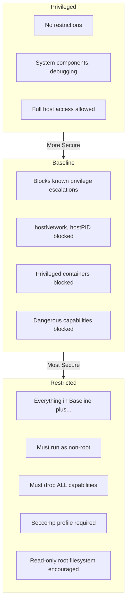
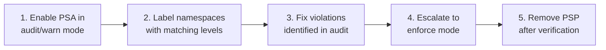

# How to Set Up Pod Security Standards (PSS) in Kubernetes

Author: [nawazdhandala](https://www.github.com/nawazdhandala)

Tags: Kubernetes, Security, Pod Security Standards, PSS, DevOps, Compliance

Description: Replacing deprecated PodSecurityPolicies with the new Pod Security Admission controller - a complete guide to securing your Kubernetes workloads with Pod Security Standards.

Pod Security Policies (PSP) served Kubernetes well for years, but they were deprecated in v1.21 and removed in v1.25. The replacement, Pod Security Standards (PSS) combined with Pod Security Admission (PSA), is simpler to understand, easier to implement, and built into every modern Kubernetes cluster. This guide walks you through migrating to PSS and implementing security controls that actually work.

---

## Why Pod Security Matters

Containers share the host kernel. Without guardrails, a compromised container can:

- **Escape to the host** using privileged mode or excessive capabilities
- **Access sensitive data** via host filesystem mounts
- **Impersonate other services** by manipulating network namespaces
- **Mine cryptocurrency** with your CPU and memory

Pod Security Standards prevent these attack vectors by enforcing security contexts at admission time. If a pod doesn't meet the standard, the API server rejects it before it ever runs.

## The Three Security Levels

PSS defines three progressively restrictive profiles. Think of them as security tiers:

This diagram shows the three Pod Security Standards levels and what each level restricts:



### Privileged (No Restrictions)

Use this only for system-level components that genuinely need host access:
- CNI plugins (Calico, Cilium)
- Storage drivers (CSI plugins)
- Monitoring agents that read `/proc`
- Log collectors that access host paths

### Baseline (Block Known Escalations)

The practical starting point for most workloads. It blocks:
- Privileged containers
- Host namespaces (hostNetwork, hostPID, hostIPC)
- Dangerous capabilities (NET_RAW is allowed, CAP_SYS_ADMIN is not)
- HostPath volumes (except specific safe types)
- Certain seccomp/AppArmor modifications

### Restricted (Hardened Workloads)

For security-conscious production deployments:
- Must run as non-root user
- Must drop ALL capabilities (can add back specific safe ones)
- Must use a seccomp profile (RuntimeDefault or Localhost)
- Cannot write to the root filesystem (strongly encouraged)

## How Pod Security Admission Works

PSA is a built-in admission controller that evaluates pods against your chosen standard. It operates in three modes:

| Mode | Behavior |
|------|----------|
| **enforce** | Blocks pods that violate the policy |
| **audit** | Logs violations but allows pods |
| **warn** | Shows warnings to users but allows pods |

The smart approach: start with `warn` and `audit` to find violations, then escalate to `enforce` once you've fixed them.

## Step 1: Check Your Cluster Version

Pod Security Admission is stable in Kubernetes 1.25+. Verify your version:

```bash
# Check the server version to ensure PSA is available
# PSA is beta in 1.23-1.24 and stable in 1.25+
kubectl version --short
```

If you're on 1.22 or earlier, you're still using PodSecurityPolicies. Plan your upgrade first.

## Step 2: Audit Current Workloads

Before enabling enforcement, discover what would break. This command dry-runs the restricted standard against all namespaces:

```bash
# Audit all namespaces against the restricted standard
# This shows violations without blocking anything
# The output identifies pods that would fail under enforcement
kubectl label --dry-run=server --overwrite ns --all \
  pod-security.kubernetes.io/enforce=restricted
```

For a more detailed report, check each namespace individually:

```bash
# List all namespaces with their current security labels
# Look for namespaces without any pod-security labels
kubectl get namespaces -o custom-columns=\
'NAME:.metadata.name,'\
'ENFORCE:.metadata.labels.pod-security\.kubernetes\.io/enforce,'\
'WARN:.metadata.labels.pod-security\.kubernetes\.io/warn'
```

## Step 3: Label Namespaces

Apply security standards via namespace labels. This is where PSA shines - no CRDs, no webhook configuration, just labels.

### Example: Production Namespace (Restricted)

Create a namespace with strict security controls suitable for production workloads:

```yaml
# Production namespace with restricted security
apiVersion: v1
kind: Namespace
metadata:
  name: production
  labels:
    # Enforce blocks any non-compliant pods
    pod-security.kubernetes.io/enforce: restricted
    pod-security.kubernetes.io/enforce-version: latest
    # Audit logs violations to the API server audit log
    pod-security.kubernetes.io/audit: restricted
    pod-security.kubernetes.io/audit-version: latest
    # Warn shows warnings in kubectl output
    pod-security.kubernetes.io/warn: restricted
    pod-security.kubernetes.io/warn-version: latest
```

### Example: Development Namespace (Baseline with Warning)

Development environments need flexibility but should still warn about violations:

```yaml
# Development namespace with baseline enforcement
apiVersion: v1
kind: Namespace
metadata:
  name: development
  labels:
    # Baseline catches dangerous configurations
    pod-security.kubernetes.io/enforce: baseline
    pod-security.kubernetes.io/enforce-version: latest
    # Warn about restricted violations for future migration
    pod-security.kubernetes.io/warn: restricted
    pod-security.kubernetes.io/warn-version: latest
```

### Example: System Namespace (Privileged)

Some system components genuinely need privileged access:

```yaml
# System namespace for privileged workloads
apiVersion: v1
kind: Namespace
metadata:
  name: kube-system
  labels:
    # Only use privileged where absolutely necessary
    pod-security.kubernetes.io/enforce: privileged
    pod-security.kubernetes.io/enforce-version: latest
    # Still audit against baseline to track security debt
    pod-security.kubernetes.io/audit: baseline
    pod-security.kubernetes.io/audit-version: latest
```

Apply the labels to existing namespaces:

```bash
# Label an existing namespace with baseline enforcement
# This immediately starts enforcing the policy
kubectl label namespace my-app \
  pod-security.kubernetes.io/enforce=baseline \
  pod-security.kubernetes.io/warn=restricted \
  --overwrite
```

## Step 4: Fix Common Violations

Most applications fail the restricted standard for predictable reasons. Here's how to fix each one:

### Running as Root

This is the most common violation. Add a securityContext to your pod spec:

This securityContext ensures the container runs as a non-root user with a specific UID/GID. It's required for the restricted security standard.

```yaml
apiVersion: v1
kind: Pod
metadata:
  name: secure-app
spec:
  # Pod-level security context applies to all containers
  securityContext:
    # Run as non-root user (UID 1000)
    runAsNonRoot: true
    runAsUser: 1000
    runAsGroup: 1000
    # Set filesystem group for volume access
    fsGroup: 1000
  containers:
    - name: app
      image: myapp:latest
      # Container-level security context can override pod settings
      securityContext:
        # Prevent privilege escalation via setuid binaries
        allowPrivilegeEscalation: false
        # Use read-only root filesystem
        readOnlyRootFilesystem: true
        # Drop ALL capabilities, add back only what's needed
        capabilities:
          drop:
            - ALL
```

### Missing Seccomp Profile

The restricted standard requires a seccomp profile. Use the runtime default:

Add a seccomp profile to restrict the syscalls the container can make. RuntimeDefault uses the container runtime's built-in profile which blocks dangerous syscalls.

```yaml
apiVersion: v1
kind: Pod
metadata:
  name: secure-app
spec:
  securityContext:
    # Use the runtime's default seccomp profile
    # This blocks dangerous syscalls while allowing normal operation
    seccompProfile:
      type: RuntimeDefault
  containers:
    - name: app
      image: myapp:latest
```

### Dangerous Capabilities

Drop all capabilities, then add back only what you need:

This configuration drops all Linux capabilities and adds back only the specific ones your application needs. NET_BIND_SERVICE allows binding to ports below 1024.

```yaml
apiVersion: v1
kind: Pod
metadata:
  name: web-server
spec:
  containers:
    - name: nginx
      image: nginx:latest
      securityContext:
        capabilities:
          # Start with no capabilities
          drop:
            - ALL
          # Add back only what the app genuinely needs
          # NET_BIND_SERVICE allows binding to port 80/443
          add:
            - NET_BIND_SERVICE
```

### Complete Restricted-Compliant Pod

Here's a pod that passes the restricted standard:

This is a complete example of a pod that passes all restricted security checks. Use this as a template for your production workloads.

```yaml
apiVersion: v1
kind: Pod
metadata:
  name: fully-secure-app
  namespace: production
spec:
  # Pod-level security settings
  securityContext:
    # Must run as non-root
    runAsNonRoot: true
    runAsUser: 65534  # nobody user
    runAsGroup: 65534
    fsGroup: 65534
    # Required seccomp profile
    seccompProfile:
      type: RuntimeDefault
  
  containers:
    - name: app
      image: myapp:latest
      
      # Container-level security settings
      securityContext:
        # Block privilege escalation
        allowPrivilegeEscalation: false
        # Read-only root filesystem
        readOnlyRootFilesystem: true
        # Drop all capabilities
        capabilities:
          drop:
            - ALL
      
      # Resource limits are not required by PSS but strongly recommended
      resources:
        limits:
          memory: "128Mi"
          cpu: "500m"
        requests:
          memory: "64Mi"
          cpu: "250m"
      
      # Mount a writable volume for temp files since root is read-only
      volumeMounts:
        - name: tmp
          mountPath: /tmp
        - name: cache
          mountPath: /var/cache
  
  # EmptyDir volumes for writable directories
  volumes:
    - name: tmp
      emptyDir: {}
    - name: cache
      emptyDir: {}
```

## Step 5: Handle Exemptions

Some workloads legitimately need elevated privileges. PSA supports exemptions at the cluster level.

### Configure Exemptions via AdmissionConfiguration

Create an admission configuration file for the API server:

This AdmissionConfiguration allows specific users, namespaces, and runtime classes to bypass security checks. Use sparingly and document why each exemption exists.

```yaml
# /etc/kubernetes/admission/pod-security.yaml
apiVersion: apiserver.config.k8s.io/v1
kind: AdmissionConfiguration
plugins:
  - name: PodSecurity
    configuration:
      apiVersion: pod-security.admission.config.k8s.io/v1
      kind: PodSecurityConfiguration
      
      # Default policy for unlabeled namespaces
      defaults:
        enforce: baseline
        enforce-version: latest
        audit: restricted
        audit-version: latest
        warn: restricted
        warn-version: latest
      
      exemptions:
        # Exempt specific usernames (service accounts)
        usernames:
          - system:serviceaccount:kube-system:cilium
          - system:serviceaccount:kube-system:calico-node
        
        # Exempt entire namespaces
        namespaces:
          - kube-system
          - cert-manager
          - istio-system
        
        # Exempt pods using specific runtime classes
        runtimeClasses:
          - gvisor
          - kata
```

Reference this configuration in your API server flags:

```bash
# Add to kube-apiserver arguments
# This tells the API server to use your custom admission configuration
--admission-control-config-file=/etc/kubernetes/admission/pod-security.yaml
```

For managed Kubernetes (EKS, GKE, AKS), you typically can't modify API server flags. Use namespace labels instead, and document which namespaces are privileged and why.

## Step 6: Monitor and Audit

PSA writes violations to the Kubernetes audit log. Configure your logging system to capture these events.

### Enable Audit Logging

Create an audit policy that captures PSS events:

This audit policy captures all pod security violations at the RequestResponse level, providing full details for security investigations.

```yaml
# /etc/kubernetes/audit/policy.yaml
apiVersion: audit.k8s.io/v1
kind: Policy
rules:
  # Log all Pod Security violations
  - level: RequestResponse
    namespaces: ["*"]
    verbs: ["create", "update"]
    resources:
      - group: ""
        resources: ["pods"]
    # Only log when there are annotations about security violations
    omitStages:
      - RequestReceived
```

### Query Violations

Search your audit logs for PSS violations:

```bash
# Search audit logs for pod security warnings
# Adjust the path based on your audit log location
grep "pod-security.kubernetes.io" /var/log/kubernetes/audit/audit.log | \
  jq 'select(.annotations["pod-security.kubernetes.io/audit-violations"])'
```

### Prometheus Metrics

If you use the kube-state-metrics project, it exposes namespace labels as metrics. Create alerts for namespaces without security labels:

This PromQL query finds namespaces that don't have PSS enforcement enabled. Alert on these to catch configuration drift.

```promql
# Alert on namespaces without PSS enforcement
kube_namespace_labels{
  label_pod_security_kubernetes_io_enforce=""
} 
unless on(namespace) 
kube_namespace_labels{
  label_pod_security_kubernetes_io_enforce=~"baseline|restricted"
}
```

## Migration Strategy: PSP to PSS

If you're migrating from PodSecurityPolicies, follow this sequence:

This diagram shows the recommended migration path from PSP to PSS:



### Step-by-Step Migration

1. **Map PSPs to PSS levels**: Review each PSP and determine the closest PSS level
2. **Enable audit mode**: Add audit/warn labels to namespaces without enforcement
3. **Review audit logs**: Find pods that would be blocked
4. **Fix workloads**: Update pod specs to comply with the standard
5. **Enable enforcement**: Change labels to enforce mode
6. **Remove PSPs**: Delete PodSecurityPolicy resources after PSA is stable

### PSP to PSS Mapping

| PSP Field | Baseline Allows | Restricted Requires |
|-----------|----------------|---------------------|
| `privileged: false` | ✓ | ✓ |
| `hostNetwork: false` | ✓ | ✓ |
| `hostPID: false` | ✓ | ✓ |
| `runAsNonRoot: true` | - | ✓ |
| `readOnlyRootFilesystem` | - | Recommended |
| `allowPrivilegeEscalation: false` | - | ✓ |
| Capabilities dropped | Dangerous ones | ALL |

## Real-World Example: Securing a Microservices Application

Let's apply PSS to a typical microservices setup with a web frontend, API backend, and database.

### Namespace Setup

Create namespaces with appropriate security levels for each tier of your application:

```yaml
# Separate namespaces for different security requirements
---
apiVersion: v1
kind: Namespace
metadata:
  name: app-frontend
  labels:
    # Frontend can be fully restricted
    pod-security.kubernetes.io/enforce: restricted
    pod-security.kubernetes.io/enforce-version: latest
---
apiVersion: v1
kind: Namespace
metadata:
  name: app-backend
  labels:
    # Backend might need baseline for some operations
    pod-security.kubernetes.io/enforce: baseline
    pod-security.kubernetes.io/warn: restricted
    pod-security.kubernetes.io/warn-version: latest
---
apiVersion: v1
kind: Namespace
metadata:
  name: app-database
  labels:
    # Database needs baseline for init containers
    pod-security.kubernetes.io/enforce: baseline
    pod-security.kubernetes.io/warn: restricted
```

### Secure Frontend Deployment

This frontend deployment passes the restricted security standard:

```yaml
apiVersion: apps/v1
kind: Deployment
metadata:
  name: web-frontend
  namespace: app-frontend
spec:
  replicas: 3
  selector:
    matchLabels:
      app: web-frontend
  template:
    metadata:
      labels:
        app: web-frontend
    spec:
      # Service account with minimal permissions
      serviceAccountName: frontend-sa
      automountServiceAccountToken: false
      
      securityContext:
        runAsNonRoot: true
        runAsUser: 101  # nginx user
        runAsGroup: 101
        fsGroup: 101
        seccompProfile:
          type: RuntimeDefault
      
      containers:
        - name: nginx
          image: nginxinc/nginx-unprivileged:latest
          ports:
            - containerPort: 8080
          securityContext:
            allowPrivilegeEscalation: false
            readOnlyRootFilesystem: true
            capabilities:
              drop:
                - ALL
          volumeMounts:
            - name: cache
              mountPath: /var/cache/nginx
            - name: run
              mountPath: /var/run
      
      volumes:
        - name: cache
          emptyDir: {}
        - name: run
          emptyDir: {}
```

## Troubleshooting Common Issues

### "Forbidden: violates PodSecurity"

This error means enforcement is working. Check the full message for details:

```bash
# Get detailed error message about what's failing
kubectl describe pod failing-pod -n restricted-namespace

# Check events for specific violations
kubectl get events -n restricted-namespace --field-selector reason=FailedCreate
```

### Pods Stuck in Pending

If pods are pending but no PSS error appears, check other admission controllers:

```bash
# Check if the pod was rejected by another admission controller
kubectl get events -n myns --field-selector reason=FailedScheduling

# Look at the ReplicaSet events for Deployments
kubectl describe replicaset -n myns
```

### Third-Party Charts Failing

Many Helm charts don't follow security best practices. Override values to add security contexts:

```bash
# Install chart with security context overrides
# Check the chart's values.yaml for available security options
helm install myapp bitnami/nginx \
  --set securityContext.runAsNonRoot=true \
  --set securityContext.runAsUser=1001 \
  --set containerSecurityContext.allowPrivilegeEscalation=false
```

## Best Practices Summary

1. **Start with audit/warn mode** - understand what would break before enforcing
2. **Default to baseline** - it catches dangerous configurations without being overly restrictive
3. **Use restricted for production** - it's the gold standard for security-conscious workloads
4. **Document exemptions** - when something needs privileged access, explain why
5. **Monitor violations** - audit logs reveal security drift over time
6. **Test in CI** - validate pod specs against PSS before they reach production

## Related Resources

- [Learn Kubernetes Step by Step](https://oneuptime.com/blog/post/2025-11-27-learn-kubernetes-step-by-step/view) - Master the fundamentals before diving into security
- [Kubernetes RBAC Best Practices](https://oneuptime.com/blog/post/2026-01-06-kubernetes-rbac-best-practices/view) - Complement PSS with proper access control
- [Monitor Kubernetes Clusters with OpenTelemetry and OneUptime](https://oneuptime.com/blog/post/2025-11-14-monitor-kubernetes-clusters-with-opentelemetry-and-oneuptime/view) - Observe your secured clusters

Pod Security Standards replace the complexity of PodSecurityPolicies with a simpler, more maintainable model. Label your namespaces, fix the violations, and your cluster immediately becomes harder to compromise. The restricted standard is achievable for most workloads - it just requires intentional security context configuration that should be part of every production deployment anyway.
