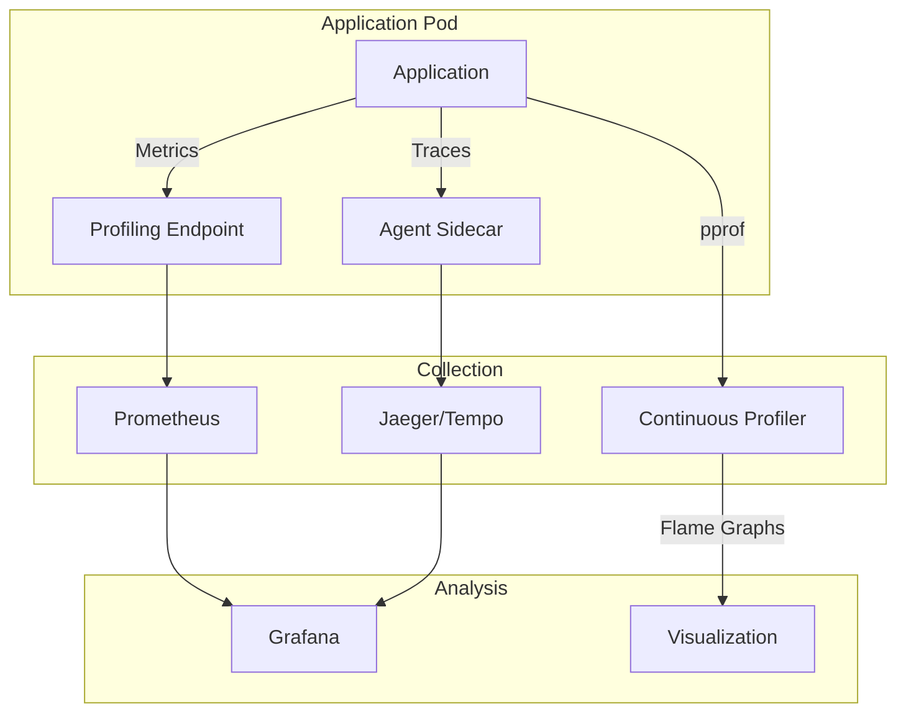

# How to Profile Kubernetes Application CPU and Memory Usage

Author: [nawazdhandala](https://www.github.com/nawazdhandala)

Tags: Kubernetes, Profiling, Performance, CPU, Memory, Optimization, DevOps

Description: Learn how to profile and analyze CPU and memory usage of applications running in Kubernetes to identify performance bottlenecks and optimize resource allocation.

---

Profiling applications in Kubernetes is essential for understanding resource consumption, identifying bottlenecks, and optimizing performance. This guide covers various profiling techniques and tools for containerized applications.

## Profiling Architecture



## Basic Resource Monitoring

### Using kubectl

```bash
# Current resource usage
kubectl top pods -n production
kubectl top pods --containers -n production

# Node-level usage
kubectl top nodes

# Watch resource usage over time
watch -n 2 kubectl top pods -n production

# Sort by memory
kubectl top pods -n production --sort-by=memory

# Sort by CPU
kubectl top pods -n production --sort-by=cpu
```

### Container Resource Metrics

```bash
# Get detailed resource usage from metrics-server
kubectl get --raw /apis/metrics.k8s.io/v1beta1/namespaces/production/pods/my-pod | jq

# cAdvisor metrics (node level)
kubectl get --raw /api/v1/nodes/<node-name>/proxy/metrics/cadvisor

# Detailed container stats
kubectl exec -it my-pod -- cat /sys/fs/cgroup/memory/memory.usage_in_bytes
kubectl exec -it my-pod -- cat /sys/fs/cgroup/cpu/cpuacct.usage
```

## Go Application Profiling (pprof)

### Enable pprof Endpoint

```go
// main.go
package main

import (
    "log"
    "net/http"
    _ "net/http/pprof"  // Import for side effects
)

func main() {
    // Start pprof server on separate port
    go func() {
        log.Println(http.ListenAndServe("localhost:6060", nil))
    }()
    
    // Your application code
    startApp()
}
```

### Kubernetes Deployment with pprof

```yaml
apiVersion: apps/v1
kind: Deployment
metadata:
  name: go-app
spec:
  template:
    spec:
      containers:
        - name: app
          image: myapp:latest
          ports:
            - containerPort: 8080
              name: http
            - containerPort: 6060
              name: pprof
          resources:
            requests:
              cpu: 100m
              memory: 128Mi
---
apiVersion: v1
kind: Service
metadata:
  name: go-app-pprof
spec:
  selector:
    app: go-app
  ports:
    - port: 6060
      name: pprof
  type: ClusterIP
```

### Collecting pprof Data

```bash
# Port forward to pprof
kubectl port-forward svc/go-app-pprof 6060:6060

# CPU profile (30 seconds)
curl -o cpu.prof http://localhost:6060/debug/pprof/profile?seconds=30

# Heap profile
curl -o heap.prof http://localhost:6060/debug/pprof/heap

# Goroutine profile
curl -o goroutine.prof http://localhost:6060/debug/pprof/goroutine

# Block profile
curl -o block.prof http://localhost:6060/debug/pprof/block

# Analyze with go tool
go tool pprof -http=:8081 cpu.prof
go tool pprof -http=:8082 heap.prof
```

## Java Application Profiling

### JVM Metrics Endpoint

```yaml
# deployment.yaml
apiVersion: apps/v1
kind: Deployment
metadata:
  name: java-app
spec:
  template:
    spec:
      containers:
        - name: app
          image: java-app:latest
          ports:
            - containerPort: 8080
            - containerPort: 9090  # JMX port
          env:
            - name: JAVA_TOOL_OPTIONS
              value: >-
                -XX:+UseContainerSupport
                -XX:MaxRAMPercentage=75.0
                -Dcom.sun.management.jmxremote
                -Dcom.sun.management.jmxremote.port=9090
                -Dcom.sun.management.jmxremote.rmi.port=9090
                -Dcom.sun.management.jmxremote.authenticate=false
                -Dcom.sun.management.jmxremote.ssl=false
```

### Using async-profiler

```dockerfile
# Dockerfile with async-profiler
FROM eclipse-temurin:17-jdk

# Install async-profiler
RUN wget -O /tmp/async-profiler.tar.gz \
    https://github.com/jvm-profiling-tools/async-profiler/releases/download/v2.9/async-profiler-2.9-linux-x64.tar.gz && \
    tar -xzf /tmp/async-profiler.tar.gz -C /opt && \
    rm /tmp/async-profiler.tar.gz

ENV ASYNC_PROFILER_PATH=/opt/async-profiler-2.9-linux-x64

COPY target/app.jar /app/app.jar
CMD ["java", "-jar", "/app/app.jar"]
```

### Profile Java Application

```bash
# Get pod name
POD=$(kubectl get pods -l app=java-app -o jsonpath='{.items[0].metadata.name}')

# Profile CPU for 30 seconds
kubectl exec -it $POD -- /opt/async-profiler-2.9-linux-x64/profiler.sh \
  -d 30 -f /tmp/cpu-profile.html -o flamegraph $(pgrep -f java)

# Copy the flame graph
kubectl cp $POD:/tmp/cpu-profile.html ./cpu-profile.html

# Profile memory allocation
kubectl exec -it $POD -- /opt/async-profiler-2.9-linux-x64/profiler.sh \
  -d 30 -e alloc -f /tmp/alloc-profile.html -o flamegraph $(pgrep -f java)
```

## Python Application Profiling

### Enable py-spy Profiling

```dockerfile
# Dockerfile
FROM python:3.11-slim

# Install py-spy
RUN pip install py-spy

COPY requirements.txt .
RUN pip install -r requirements.txt

COPY . /app
WORKDIR /app

CMD ["python", "app.py"]
```

```yaml
# deployment.yaml - Need SYS_PTRACE capability
apiVersion: apps/v1
kind: Deployment
metadata:
  name: python-app
spec:
  template:
    spec:
      containers:
        - name: app
          image: python-app:latest
          securityContext:
            capabilities:
              add:
                - SYS_PTRACE
          ports:
            - containerPort: 8080
```

### Profile Python Application

```bash
# Get pod name
POD=$(kubectl get pods -l app=python-app -o jsonpath='{.items[0].metadata.name}')

# Record CPU profile
kubectl exec -it $POD -- py-spy record -o /tmp/profile.svg --pid 1 --duration 30

# Copy flame graph
kubectl cp $POD:/tmp/profile.svg ./profile.svg

# Real-time top-like view
kubectl exec -it $POD -- py-spy top --pid 1
```

### cProfile Integration

```python
# app.py with profiling endpoint
import cProfile
import pstats
import io
from flask import Flask, Response

app = Flask(__name__)
profiler = cProfile.Profile()

@app.route('/profile/start')
def start_profile():
    profiler.enable()
    return 'Profiling started'

@app.route('/profile/stop')
def stop_profile():
    profiler.disable()
    s = io.StringIO()
    ps = pstats.Stats(profiler, stream=s).sort_stats('cumulative')
    ps.print_stats(50)
    return Response(s.getvalue(), mimetype='text/plain')

@app.route('/profile/reset')
def reset_profile():
    global profiler
    profiler = cProfile.Profile()
    return 'Profiler reset'
```

## Node.js Profiling

### Enable Profiling

```javascript
// app.js with profiling
const http = require('http');
const v8Profiler = require('v8-profiler-next');
const fs = require('fs');

// Enable heap snapshots endpoint
http.createServer((req, res) => {
  if (req.url === '/debug/heap') {
    const snapshot = v8Profiler.takeSnapshot('heap');
    snapshot.export((error, result) => {
      res.writeHead(200, {'Content-Type': 'application/json'});
      res.end(result);
      snapshot.delete();
    });
    return;
  }
  
  if (req.url === '/debug/cpu-profile') {
    v8Profiler.startProfiling('CPU', true);
    setTimeout(() => {
      const profile = v8Profiler.stopProfiling('CPU');
      profile.export((error, result) => {
        res.writeHead(200, {'Content-Type': 'application/json'});
        res.end(result);
        profile.delete();
      });
    }, 30000); // 30 second profile
    return;
  }
  
  // Normal application routes
}).listen(8080);
```

### Node.js Inspector

```yaml
# deployment.yaml
apiVersion: apps/v1
kind: Deployment
metadata:
  name: node-app
spec:
  template:
    spec:
      containers:
        - name: app
          image: node-app:latest
          command: ["node", "--inspect=0.0.0.0:9229", "app.js"]
          ports:
            - containerPort: 8080
            - containerPort: 9229  # Inspector port
```

```bash
# Port forward inspector
kubectl port-forward pod/node-app-xxx 9229:9229

# Connect Chrome DevTools
# Open chrome://inspect and click "inspect" under Remote Target
```

## Continuous Profiling with Pyroscope

### Deploy Pyroscope

```yaml
# pyroscope-deployment.yaml
apiVersion: apps/v1
kind: Deployment
metadata:
  name: pyroscope
  namespace: monitoring
spec:
  replicas: 1
  selector:
    matchLabels:
      app: pyroscope
  template:
    metadata:
      labels:
        app: pyroscope
    spec:
      containers:
        - name: pyroscope
          image: pyroscope/pyroscope:latest
          args:
            - server
          ports:
            - containerPort: 4040
          volumeMounts:
            - name: data
              mountPath: /var/lib/pyroscope
      volumes:
        - name: data
          emptyDir: {}
---
apiVersion: v1
kind: Service
metadata:
  name: pyroscope
  namespace: monitoring
spec:
  selector:
    app: pyroscope
  ports:
    - port: 4040
```

### Instrument Applications

```yaml
# Go application with Pyroscope
apiVersion: apps/v1
kind: Deployment
metadata:
  name: go-app
spec:
  template:
    spec:
      containers:
        - name: app
          image: go-app:latest
          env:
            - name: PYROSCOPE_SERVER_ADDRESS
              value: "http://pyroscope.monitoring:4040"
            - name: PYROSCOPE_APPLICATION_NAME
              value: "go-app"
            - name: PYROSCOPE_LOG_LEVEL
              value: "info"
```

```go
// Go code to initialize Pyroscope
package main

import (
    "github.com/pyroscope-io/client/pyroscope"
)

func main() {
    pyroscope.Start(pyroscope.Config{
        ApplicationName: "go-app",
        ServerAddress:   os.Getenv("PYROSCOPE_SERVER_ADDRESS"),
        ProfileTypes: []pyroscope.ProfileType{
            pyroscope.ProfileCPU,
            pyroscope.ProfileAllocObjects,
            pyroscope.ProfileAllocSpace,
            pyroscope.ProfileInuseObjects,
            pyroscope.ProfileInuseSpace,
        },
    })
    
    // Application code
}
```

## Memory Leak Detection

### Heap Dump Analysis

```bash
# Java heap dump
kubectl exec -it java-pod -- jmap -dump:format=b,file=/tmp/heapdump.hprof 1
kubectl cp java-pod:/tmp/heapdump.hprof ./heapdump.hprof

# Analyze with Eclipse MAT or VisualVM

# Go heap profile
kubectl port-forward go-pod 6060:6060
curl -o heap.prof http://localhost:6060/debug/pprof/heap
go tool pprof -http=:8081 heap.prof
```

### Memory Growth Monitoring

```promql
# Container memory growth over time
rate(container_memory_usage_bytes{pod="my-pod"}[1h])

# Memory vs limit
container_memory_usage_bytes{pod="my-pod"} / 
container_spec_memory_limit_bytes{pod="my-pod"}

# OOM events
increase(container_oom_events_total{pod=~"my-pod.*"}[1h])
```

## CPU Profiling Best Practices

### Capture Production Profiles Safely

```yaml
# Dedicated profiling sidecar
apiVersion: apps/v1
kind: Deployment
metadata:
  name: my-app
spec:
  template:
    spec:
      shareProcessNamespace: true  # Share processes between containers
      containers:
        - name: app
          image: my-app:latest
          ports:
            - containerPort: 8080
        - name: profiler
          image: alpine:latest
          command: ['sleep', 'infinity']
          securityContext:
            capabilities:
              add:
                - SYS_PTRACE
```

### Flame Graph Generation

```bash
# Using perf in Kubernetes
kubectl exec -it profiler-container -- apk add perf

# Record CPU samples
kubectl exec -it profiler-container -- perf record -F 99 -p <PID> -g -- sleep 30

# Generate flame graph
kubectl exec -it profiler-container -- perf script > perf.data
./FlameGraph/stackcollapse-perf.pl perf.data | ./FlameGraph/flamegraph.pl > flamegraph.svg
```

## Prometheus Metrics for Profiling

```yaml
# Application exposing profile metrics
apiVersion: v1
kind: ConfigMap
metadata:
  name: prometheus-config
data:
  prometheus.yml: |
    scrape_configs:
      - job_name: 'go-app'
        static_configs:
          - targets: ['go-app:8080']
        metrics_path: '/metrics'
        # Scrape Go runtime metrics
      
      - job_name: 'java-app'
        static_configs:
          - targets: ['java-app:8080']
        metrics_path: '/actuator/prometheus'
```

### Useful Profiling Metrics

```promql
# Go: Goroutine count
go_goroutines{job="go-app"}

# Go: Heap allocations
rate(go_memstats_alloc_bytes_total{job="go-app"}[5m])

# JVM: Heap usage
jvm_memory_used_bytes{area="heap", job="java-app"}

# JVM: GC time
rate(jvm_gc_pause_seconds_sum{job="java-app"}[5m])

# Python: Thread count
python_info{job="python-app"}
```

## Conclusion

Effective profiling in Kubernetes requires the right tools and techniques for your stack. Key takeaways:

1. **Use language-specific tools** - pprof for Go, async-profiler for Java, py-spy for Python
2. **Enable continuous profiling** - Use Pyroscope or Parca for always-on profiling
3. **Monitor memory trends** - Catch leaks early with metrics
4. **Profile in production carefully** - Use sidecars and limit overhead
5. **Visualize with flame graphs** - Make bottlenecks obvious

For comprehensive application performance monitoring, check out [OneUptime's APM solution](https://oneuptime.com/product/apm).

## Related Resources

- [How to Right-Size Resources with VPA](https://oneuptime.com/blog/post/2026-01-30-resource-right-sizing/view)
- [How to Optimize Pod Startup Time](https://oneuptime.com/blog/post/2026-01-19-kubernetes-optimize-pod-startup-time/view)
- [How to Set Up Resource Quotas](https://oneuptime.com/blog/post/2026-01-19-kubernetes-resource-quotas-limit-ranges/view)
