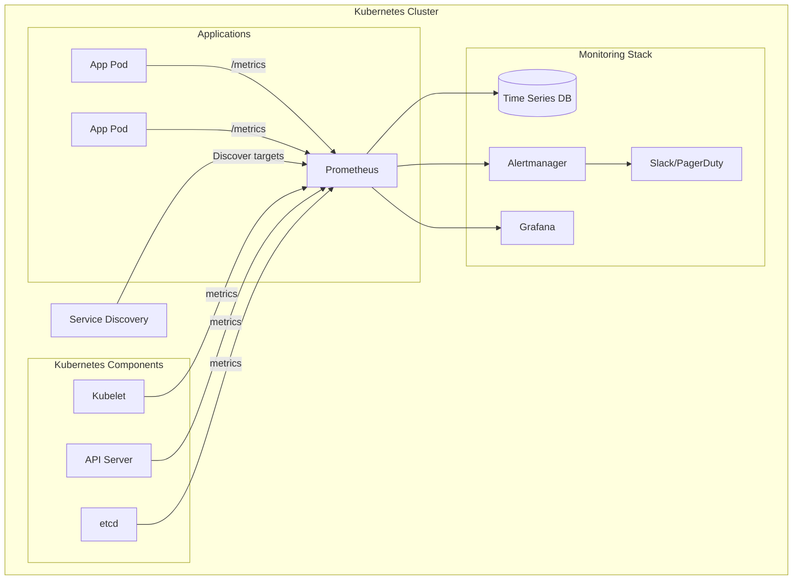

# How to Set Up Prometheus and Grafana on Kubernetes from Scratch

Author: [nawazdhandala](https://www.github.com/nawazdhandala)

Tags: Kubernetes, Prometheus, Grafana, Monitoring, Observability, Metrics, Helm

Description: Learn how to set up a complete monitoring stack with Prometheus and Grafana on Kubernetes, including service discovery, alerting, and custom dashboards.

---

Monitoring is essential for running reliable Kubernetes clusters. Prometheus provides powerful metrics collection and alerting, while Grafana offers rich visualization capabilities. This guide covers setting up a production-ready monitoring stack from scratch.

## Architecture Overview



## Option 1: Prometheus Operator (kube-prometheus-stack)

The recommended approach for production environments.

### Install with Helm

```bash
# Add Prometheus community Helm repo
helm repo add prometheus-community https://prometheus-community.github.io/helm-charts
helm repo update

# Create monitoring namespace
kubectl create namespace monitoring

# Install kube-prometheus-stack
helm install prometheus prometheus-community/kube-prometheus-stack \
  --namespace monitoring \
  --version 55.0.0 \
  --values prometheus-values.yaml
```

### Helm Values Configuration

```yaml
# prometheus-values.yaml
fullnameOverride: prometheus

# Prometheus configuration
prometheus:
  prometheusSpec:
    # Resource limits
    resources:
      requests:
        cpu: 500m
        memory: 2Gi
      limits:
        cpu: 2000m
        memory: 8Gi
    
    # Retention
    retention: 30d
    retentionSize: 50GB
    
    # Storage
    storageSpec:
      volumeClaimTemplate:
        spec:
          storageClassName: standard
          accessModes: ["ReadWriteOnce"]
          resources:
            requests:
              storage: 100Gi
    
    # Service discovery
    serviceMonitorSelector: {}
    serviceMonitorNamespaceSelector: {}
    podMonitorSelector: {}
    podMonitorNamespaceSelector: {}
    
    # Additional scrape configs
    additionalScrapeConfigs:
      - job_name: 'kubernetes-pods'
        kubernetes_sd_configs:
          - role: pod
        relabel_configs:
          - source_labels: [__meta_kubernetes_pod_annotation_prometheus_io_scrape]
            action: keep
            regex: true
          - source_labels: [__meta_kubernetes_pod_annotation_prometheus_io_path]
            action: replace
            target_label: __metrics_path__
            regex: (.+)
          - source_labels: [__address__, __meta_kubernetes_pod_annotation_prometheus_io_port]
            action: replace
            regex: ([^:]+)(?::\d+)?;(\d+)
            replacement: $1:$2
            target_label: __address__

# Alertmanager configuration
alertmanager:
  alertmanagerSpec:
    resources:
      requests:
        cpu: 100m
        memory: 256Mi
    storage:
      volumeClaimTemplate:
        spec:
          storageClassName: standard
          accessModes: ["ReadWriteOnce"]
          resources:
            requests:
              storage: 10Gi
  
  config:
    global:
      resolve_timeout: 5m
      slack_api_url: 'https://hooks.slack.com/services/xxx/yyy/zzz'
    
    route:
      group_by: ['alertname', 'namespace']
      group_wait: 30s
      group_interval: 5m
      repeat_interval: 12h
      receiver: 'slack-notifications'
      routes:
        - match:
            severity: critical
          receiver: 'pagerduty-critical'
        - match:
            severity: warning
          receiver: 'slack-notifications'
    
    receivers:
      - name: 'slack-notifications'
        slack_configs:
          - channel: '#alerts'
            send_resolved: true
            title: '{{ .Status | toUpper }}: {{ .CommonLabels.alertname }}'
            text: '{{ range .Alerts }}*{{ .Annotations.summary }}*\n{{ .Annotations.description }}\n{{ end }}'
      
      - name: 'pagerduty-critical'
        pagerduty_configs:
          - service_key: '<pagerduty-service-key>'
            send_resolved: true

# Grafana configuration
grafana:
  enabled: true
  
  adminPassword: 'your-secure-password'  # Change this!
  
  resources:
    requests:
      cpu: 100m
      memory: 256Mi
    limits:
      cpu: 500m
      memory: 512Mi
  
  persistence:
    enabled: true
    size: 10Gi
    storageClassName: standard
  
  # Pre-configured datasources
  datasources:
    datasources.yaml:
      apiVersion: 1
      datasources:
        - name: Prometheus
          type: prometheus
          url: http://prometheus-prometheus:9090
          access: proxy
          isDefault: true
        - name: Alertmanager
          type: alertmanager
          url: http://prometheus-alertmanager:9093
          access: proxy
  
  # Dashboard providers
  dashboardProviders:
    dashboardproviders.yaml:
      apiVersion: 1
      providers:
        - name: 'default'
          orgId: 1
          folder: 'Kubernetes'
          type: file
          disableDeletion: false
          editable: true
          options:
            path: /var/lib/grafana/dashboards/default
  
  # Pre-configured dashboards
  dashboards:
    default:
      kubernetes-cluster:
        gnetId: 7249
        revision: 1
        datasource: Prometheus
      kubernetes-pods:
        gnetId: 6417
        revision: 1
        datasource: Prometheus
      node-exporter:
        gnetId: 1860
        revision: 27
        datasource: Prometheus

  # Ingress
  ingress:
    enabled: true
    ingressClassName: nginx
    annotations:
      cert-manager.io/cluster-issuer: letsencrypt-prod
    hosts:
      - grafana.example.com
    tls:
      - secretName: grafana-tls
        hosts:
          - grafana.example.com

# Node Exporter
nodeExporter:
  enabled: true

# kube-state-metrics
kubeStateMetrics:
  enabled: true
```

## Option 2: Manual Installation

For environments where you need more control.

### Deploy Prometheus

```yaml
# prometheus-namespace.yaml
apiVersion: v1
kind: Namespace
metadata:
  name: monitoring
---
# prometheus-rbac.yaml
apiVersion: v1
kind: ServiceAccount
metadata:
  name: prometheus
  namespace: monitoring
---
apiVersion: rbac.authorization.k8s.io/v1
kind: ClusterRole
metadata:
  name: prometheus
rules:
  - apiGroups: [""]
    resources:
      - nodes
      - nodes/proxy
      - nodes/metrics
      - services
      - endpoints
      - pods
    verbs: ["get", "list", "watch"]
  - apiGroups: ["extensions", "networking.k8s.io"]
    resources:
      - ingresses
    verbs: ["get", "list", "watch"]
  - nonResourceURLs: ["/metrics", "/metrics/cadvisor"]
    verbs: ["get"]
---
apiVersion: rbac.authorization.k8s.io/v1
kind: ClusterRoleBinding
metadata:
  name: prometheus
roleRef:
  apiGroup: rbac.authorization.k8s.io
  kind: ClusterRole
  name: prometheus
subjects:
  - kind: ServiceAccount
    name: prometheus
    namespace: monitoring
```

```yaml
# prometheus-config.yaml
apiVersion: v1
kind: ConfigMap
metadata:
  name: prometheus-config
  namespace: monitoring
data:
  prometheus.yml: |
    global:
      scrape_interval: 15s
      evaluation_interval: 15s
      external_labels:
        cluster: production
        region: us-west-2
    
    rule_files:
      - /etc/prometheus/rules/*.yaml
    
    alerting:
      alertmanagers:
        - static_configs:
            - targets:
              - alertmanager:9093
    
    scrape_configs:
      # Prometheus itself
      - job_name: 'prometheus'
        static_configs:
          - targets: ['localhost:9090']
      
      # Kubernetes API server
      - job_name: 'kubernetes-apiservers'
        kubernetes_sd_configs:
          - role: endpoints
        scheme: https
        tls_config:
          ca_file: /var/run/secrets/kubernetes.io/serviceaccount/ca.crt
        bearer_token_file: /var/run/secrets/kubernetes.io/serviceaccount/token
        relabel_configs:
          - source_labels: [__meta_kubernetes_namespace, __meta_kubernetes_service_name, __meta_kubernetes_endpoint_port_name]
            action: keep
            regex: default;kubernetes;https
      
      # Kubernetes nodes (kubelet)
      - job_name: 'kubernetes-nodes'
        kubernetes_sd_configs:
          - role: node
        scheme: https
        tls_config:
          ca_file: /var/run/secrets/kubernetes.io/serviceaccount/ca.crt
        bearer_token_file: /var/run/secrets/kubernetes.io/serviceaccount/token
        relabel_configs:
          - action: labelmap
            regex: __meta_kubernetes_node_label_(.+)
      
      # Kubernetes nodes (cadvisor)
      - job_name: 'kubernetes-cadvisor'
        kubernetes_sd_configs:
          - role: node
        scheme: https
        tls_config:
          ca_file: /var/run/secrets/kubernetes.io/serviceaccount/ca.crt
        bearer_token_file: /var/run/secrets/kubernetes.io/serviceaccount/token
        metrics_path: /metrics/cadvisor
        relabel_configs:
          - action: labelmap
            regex: __meta_kubernetes_node_label_(.+)
      
      # Kubernetes service endpoints
      - job_name: 'kubernetes-service-endpoints'
        kubernetes_sd_configs:
          - role: endpoints
        relabel_configs:
          - source_labels: [__meta_kubernetes_service_annotation_prometheus_io_scrape]
            action: keep
            regex: true
          - source_labels: [__meta_kubernetes_service_annotation_prometheus_io_scheme]
            action: replace
            target_label: __scheme__
            regex: (https?)
          - source_labels: [__meta_kubernetes_service_annotation_prometheus_io_path]
            action: replace
            target_label: __metrics_path__
            regex: (.+)
          - source_labels: [__address__, __meta_kubernetes_service_annotation_prometheus_io_port]
            action: replace
            target_label: __address__
            regex: ([^:]+)(?::\d+)?;(\d+)
            replacement: $1:$2
          - action: labelmap
            regex: __meta_kubernetes_service_label_(.+)
          - source_labels: [__meta_kubernetes_namespace]
            action: replace
            target_label: namespace
          - source_labels: [__meta_kubernetes_service_name]
            action: replace
            target_label: service
      
      # Kubernetes pods
      - job_name: 'kubernetes-pods'
        kubernetes_sd_configs:
          - role: pod
        relabel_configs:
          - source_labels: [__meta_kubernetes_pod_annotation_prometheus_io_scrape]
            action: keep
            regex: true
          - source_labels: [__meta_kubernetes_pod_annotation_prometheus_io_path]
            action: replace
            target_label: __metrics_path__
            regex: (.+)
          - source_labels: [__address__, __meta_kubernetes_pod_annotation_prometheus_io_port]
            action: replace
            regex: ([^:]+)(?::\d+)?;(\d+)
            replacement: $1:$2
            target_label: __address__
          - action: labelmap
            regex: __meta_kubernetes_pod_label_(.+)
          - source_labels: [__meta_kubernetes_namespace]
            action: replace
            target_label: namespace
          - source_labels: [__meta_kubernetes_pod_name]
            action: replace
            target_label: pod
```

```yaml
# prometheus-deployment.yaml
apiVersion: apps/v1
kind: Deployment
metadata:
  name: prometheus
  namespace: monitoring
spec:
  replicas: 1
  selector:
    matchLabels:
      app: prometheus
  template:
    metadata:
      labels:
        app: prometheus
    spec:
      serviceAccountName: prometheus
      
      initContainers:
        - name: fix-permissions
          image: busybox
          command: ["sh", "-c", "chown -R 65534:65534 /prometheus"]
          volumeMounts:
            - name: prometheus-storage
              mountPath: /prometheus
      
      containers:
        - name: prometheus
          image: prom/prometheus:v2.48.0
          args:
            - '--config.file=/etc/prometheus/prometheus.yml'
            - '--storage.tsdb.path=/prometheus'
            - '--storage.tsdb.retention.time=30d'
            - '--storage.tsdb.retention.size=50GB'
            - '--web.console.libraries=/usr/share/prometheus/console_libraries'
            - '--web.console.templates=/usr/share/prometheus/consoles'
            - '--web.enable-lifecycle'
            - '--web.enable-admin-api'
          ports:
            - containerPort: 9090
          
          resources:
            requests:
              cpu: 500m
              memory: 2Gi
            limits:
              cpu: 2000m
              memory: 8Gi
          
          volumeMounts:
            - name: prometheus-config
              mountPath: /etc/prometheus
            - name: prometheus-rules
              mountPath: /etc/prometheus/rules
            - name: prometheus-storage
              mountPath: /prometheus
          
          readinessProbe:
            httpGet:
              path: /-/ready
              port: 9090
            initialDelaySeconds: 30
            periodSeconds: 10
          
          livenessProbe:
            httpGet:
              path: /-/healthy
              port: 9090
            initialDelaySeconds: 30
            periodSeconds: 15
      
      volumes:
        - name: prometheus-config
          configMap:
            name: prometheus-config
        - name: prometheus-rules
          configMap:
            name: prometheus-rules
        - name: prometheus-storage
          persistentVolumeClaim:
            claimName: prometheus-pvc
---
apiVersion: v1
kind: PersistentVolumeClaim
metadata:
  name: prometheus-pvc
  namespace: monitoring
spec:
  accessModes:
    - ReadWriteOnce
  resources:
    requests:
      storage: 100Gi
  storageClassName: standard
---
apiVersion: v1
kind: Service
metadata:
  name: prometheus
  namespace: monitoring
spec:
  selector:
    app: prometheus
  ports:
    - port: 9090
      targetPort: 9090
  type: ClusterIP
```

### Deploy Grafana

```yaml
# grafana-deployment.yaml
apiVersion: apps/v1
kind: Deployment
metadata:
  name: grafana
  namespace: monitoring
spec:
  replicas: 1
  selector:
    matchLabels:
      app: grafana
  template:
    metadata:
      labels:
        app: grafana
    spec:
      containers:
        - name: grafana
          image: grafana/grafana:10.2.0
          ports:
            - containerPort: 3000
          
          env:
            - name: GF_SECURITY_ADMIN_PASSWORD
              valueFrom:
                secretKeyRef:
                  name: grafana-secrets
                  key: admin-password
            - name: GF_INSTALL_PLUGINS
              value: "grafana-clock-panel,grafana-simple-json-datasource,grafana-piechart-panel"
          
          resources:
            requests:
              cpu: 100m
              memory: 256Mi
            limits:
              cpu: 500m
              memory: 512Mi
          
          volumeMounts:
            - name: grafana-storage
              mountPath: /var/lib/grafana
            - name: grafana-datasources
              mountPath: /etc/grafana/provisioning/datasources
            - name: grafana-dashboards-provider
              mountPath: /etc/grafana/provisioning/dashboards
            - name: grafana-dashboards
              mountPath: /var/lib/grafana/dashboards
          
          readinessProbe:
            httpGet:
              path: /api/health
              port: 3000
            initialDelaySeconds: 10
            periodSeconds: 10
      
      volumes:
        - name: grafana-storage
          persistentVolumeClaim:
            claimName: grafana-pvc
        - name: grafana-datasources
          configMap:
            name: grafana-datasources
        - name: grafana-dashboards-provider
          configMap:
            name: grafana-dashboards-provider
        - name: grafana-dashboards
          configMap:
            name: grafana-dashboards
---
apiVersion: v1
kind: Secret
metadata:
  name: grafana-secrets
  namespace: monitoring
type: Opaque
stringData:
  admin-password: "your-secure-password"  # Change this!
---
apiVersion: v1
kind: PersistentVolumeClaim
metadata:
  name: grafana-pvc
  namespace: monitoring
spec:
  accessModes:
    - ReadWriteOnce
  resources:
    requests:
      storage: 10Gi
  storageClassName: standard
---
apiVersion: v1
kind: Service
metadata:
  name: grafana
  namespace: monitoring
spec:
  selector:
    app: grafana
  ports:
    - port: 3000
      targetPort: 3000
  type: ClusterIP
```

### Grafana Datasources

```yaml
# grafana-datasources.yaml
apiVersion: v1
kind: ConfigMap
metadata:
  name: grafana-datasources
  namespace: monitoring
data:
  datasources.yaml: |
    apiVersion: 1
    datasources:
      - name: Prometheus
        type: prometheus
        access: proxy
        url: http://prometheus:9090
        isDefault: true
        editable: false
        jsonData:
          timeInterval: "15s"
          httpMethod: POST
      
      - name: Alertmanager
        type: alertmanager
        access: proxy
        url: http://alertmanager:9093
        editable: false
        jsonData:
          implementation: prometheus
```

## Creating ServiceMonitors

### Application ServiceMonitor

```yaml
# servicemonitor-example.yaml
apiVersion: monitoring.coreos.com/v1
kind: ServiceMonitor
metadata:
  name: myapp-monitor
  namespace: monitoring
  labels:
    release: prometheus  # Must match Prometheus operator selector
spec:
  selector:
    matchLabels:
      app: myapp
  namespaceSelector:
    matchNames:
      - production
  endpoints:
    - port: metrics
      interval: 30s
      path: /metrics
      scheme: http
```

### Annotate Pods for Auto-Discovery

```yaml
# annotated-deployment.yaml
apiVersion: apps/v1
kind: Deployment
metadata:
  name: myapp
  namespace: production
spec:
  template:
    metadata:
      annotations:
        prometheus.io/scrape: "true"
        prometheus.io/port: "8080"
        prometheus.io/path: "/metrics"
    spec:
      containers:
        - name: myapp
          image: myregistry/myapp:latest
          ports:
            - name: http
              containerPort: 8080
            - name: metrics
              containerPort: 8080
```

## Alert Rules

```yaml
# prometheus-rules.yaml
apiVersion: v1
kind: ConfigMap
metadata:
  name: prometheus-rules
  namespace: monitoring
data:
  kubernetes-alerts.yaml: |
    groups:
      - name: kubernetes-apps
        rules:
          - alert: KubePodCrashLooping
            expr: |
              max_over_time(kube_pod_container_status_waiting_reason{reason="CrashLoopBackOff"}[5m]) >= 1
            for: 15m
            labels:
              severity: warning
            annotations:
              summary: "Pod {{ $labels.namespace }}/{{ $labels.pod }} is crash looping"
              description: "Pod {{ $labels.namespace }}/{{ $labels.pod }} is in CrashLoopBackOff state"
          
          - alert: KubePodNotReady
            expr: |
              sum by (namespace, pod) (
                max by(namespace, pod) (kube_pod_status_phase{phase=~"Pending|Unknown"}) * on(namespace, pod) group_left(owner_kind) topk by(namespace, pod) (1, max by(namespace, pod, owner_kind) (kube_pod_owner{owner_kind!="Job"}))
              ) > 0
            for: 15m
            labels:
              severity: warning
            annotations:
              summary: "Pod {{ $labels.namespace }}/{{ $labels.pod }} not ready"
              description: "Pod {{ $labels.namespace }}/{{ $labels.pod }} has been in a non-ready state for longer than 15 minutes"
          
          - alert: KubeDeploymentReplicasMismatch
            expr: |
              (
                kube_deployment_spec_replicas
                  !=
                kube_deployment_status_replicas_available
              ) and (
                changes(kube_deployment_status_replicas_updated[10m])
                  ==
                0
              )
            for: 15m
            labels:
              severity: warning
            annotations:
              summary: "Deployment {{ $labels.namespace }}/{{ $labels.deployment }} replicas mismatch"
              description: "Deployment {{ $labels.namespace }}/{{ $labels.deployment }} has {{ $value }} unavailable replicas"
      
      - name: kubernetes-resources
        rules:
          - alert: KubeCPUOvercommit
            expr: |
              sum(namespace_cpu:kube_pod_container_resource_requests:sum{})
                /
              sum(kube_node_status_allocatable{resource="cpu"})
                > 1.5
            for: 10m
            labels:
              severity: warning
            annotations:
              summary: "Cluster CPU overcommitted"
              description: "Cluster has overcommitted CPU resources by {{ $value | humanizePercentage }}"
          
          - alert: KubeMemoryOvercommit
            expr: |
              sum(namespace_memory:kube_pod_container_resource_requests:sum{})
                /
              sum(kube_node_status_allocatable{resource="memory"})
                > 1.5
            for: 10m
            labels:
              severity: warning
            annotations:
              summary: "Cluster memory overcommitted"
              description: "Cluster has overcommitted memory resources by {{ $value | humanizePercentage }}"
          
          - alert: KubeNodeNotReady
            expr: kube_node_status_condition{condition="Ready",status="true"} == 0
            for: 15m
            labels:
              severity: critical
            annotations:
              summary: "Node {{ $labels.node }} not ready"
              description: "Node {{ $labels.node }} has been unready for more than 15 minutes"
```

## Exposing Grafana

```yaml
# grafana-ingress.yaml
apiVersion: networking.k8s.io/v1
kind: Ingress
metadata:
  name: grafana
  namespace: monitoring
  annotations:
    cert-manager.io/cluster-issuer: letsencrypt-prod
    nginx.ingress.kubernetes.io/ssl-redirect: "true"
spec:
  ingressClassName: nginx
  tls:
    - hosts:
        - grafana.example.com
      secretName: grafana-tls
  rules:
    - host: grafana.example.com
      http:
        paths:
          - path: /
            pathType: Prefix
            backend:
              service:
                name: grafana
                port:
                  number: 3000
```

## Verify Installation

```bash
# Check all pods are running
kubectl get pods -n monitoring

# Port-forward to access Prometheus UI
kubectl port-forward -n monitoring svc/prometheus 9090:9090

# Port-forward to access Grafana
kubectl port-forward -n monitoring svc/grafana 3000:3000

# Check Prometheus targets
curl http://localhost:9090/api/v1/targets | jq '.data.activeTargets | length'

# Test a PromQL query
curl 'http://localhost:9090/api/v1/query?query=up' | jq
```

## Summary

| Component | Purpose | Default Port |
|-----------|---------|--------------|
| Prometheus | Metrics collection and storage | 9090 |
| Alertmanager | Alert routing and notification | 9093 |
| Grafana | Visualization and dashboards | 3000 |
| kube-state-metrics | Kubernetes object metrics | 8080 |
| node-exporter | Node-level metrics | 9100 |

## Related Posts

- [How to Create Custom Kubernetes Metrics with kube-state-metrics](https://oneuptime.com/blog/post/2026-01-19-kubernetes-kube-state-metrics-custom/view) - Custom metrics collection
- [How to Set Up Kubernetes Alerts with Alertmanager](https://oneuptime.com/blog/post/2026-01-19-kubernetes-alertmanager-notifications/view) - Alert configuration
- [How to Monitor Kubernetes etcd Health and Performance](https://oneuptime.com/blog/post/2026-01-19-kubernetes-etcd-monitoring-health/view) - etcd monitoring
