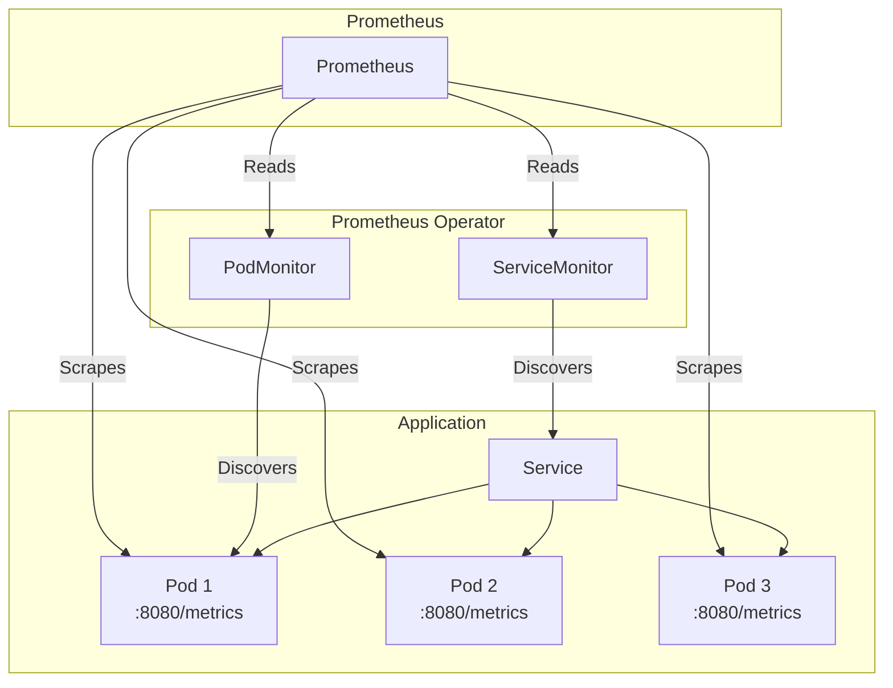

# How to Configure Prometheus ServiceMonitor for Kubernetes

Author: [nawazdhandala](https://www.github.com/nawazdhandala)

Tags: Kubernetes, Prometheus, ServiceMonitor, Monitoring, Observability, Metrics

Description: Learn how to configure Prometheus ServiceMonitor and PodMonitor resources to automatically discover and scrape metrics from your Kubernetes applications.

---

ServiceMonitor and PodMonitor are custom resources that define how Prometheus should discover and scrape metrics from your Kubernetes services. They enable declarative, GitOps-friendly monitoring configuration.

This guide covers setting up and configuring ServiceMonitors for comprehensive application monitoring.

## ServiceMonitor Architecture



## Installing Prometheus Operator

```bash
# Using Helm
helm repo add prometheus-community https://prometheus-community.github.io/helm-charts
helm repo update

# Install kube-prometheus-stack (includes Prometheus Operator)
helm install prometheus prometheus-community/kube-prometheus-stack \
  --namespace monitoring \
  --create-namespace \
  --set prometheus.prometheusSpec.serviceMonitorSelectorNilUsesHelmValues=false \
  --set prometheus.prometheusSpec.podMonitorSelectorNilUsesHelmValues=false

# Verify installation
kubectl get pods -n monitoring
kubectl get servicemonitors -A
```

## Basic ServiceMonitor

### Application with Metrics Endpoint

```yaml
# deployment.yaml
apiVersion: apps/v1
kind: Deployment
metadata:
  name: my-app
  namespace: production
  labels:
    app: my-app
spec:
  replicas: 3
  selector:
    matchLabels:
      app: my-app
  template:
    metadata:
      labels:
        app: my-app
        version: v1.0.0
    spec:
      containers:
        - name: app
          image: my-app:v1.0.0
          ports:
            - name: http
              containerPort: 8080
            - name: metrics
              containerPort: 9090  # Metrics port
---
apiVersion: v1
kind: Service
metadata:
  name: my-app
  namespace: production
  labels:
    app: my-app
    # Labels for ServiceMonitor to select
    prometheus.io/scrape: "true"
spec:
  selector:
    app: my-app
  ports:
    - name: http
      port: 80
      targetPort: http
    - name: metrics
      port: 9090
      targetPort: metrics
```

### ServiceMonitor Configuration

```yaml
# servicemonitor.yaml
apiVersion: monitoring.coreos.com/v1
kind: ServiceMonitor
metadata:
  name: my-app
  namespace: monitoring  # Or same namespace as Prometheus
  labels:
    release: prometheus  # Must match Prometheus serviceMonitorSelector
spec:
  # Namespace(s) to look for Services
  namespaceSelector:
    matchNames:
      - production
  # Select Services with these labels
  selector:
    matchLabels:
      app: my-app
  # Endpoints to scrape
  endpoints:
    - port: metrics           # Must match Service port name
      interval: 30s           # Scrape interval
      scrapeTimeout: 10s      # Timeout for scrape
      path: /metrics          # Metrics endpoint path
```

## Advanced ServiceMonitor Configuration

### Multiple Endpoints

```yaml
apiVersion: monitoring.coreos.com/v1
kind: ServiceMonitor
metadata:
  name: my-app-full
  namespace: monitoring
spec:
  namespaceSelector:
    matchNames:
      - production
  selector:
    matchLabels:
      app: my-app
  endpoints:
    # Main metrics endpoint
    - port: metrics
      interval: 30s
      path: /metrics
    # Additional endpoint for detailed metrics
    - port: metrics
      interval: 60s
      path: /metrics/detailed
    # HTTP endpoint metrics (if different port)
    - port: http
      interval: 15s
      path: /actuator/prometheus
```

### With Authentication

```yaml
apiVersion: monitoring.coreos.com/v1
kind: ServiceMonitor
metadata:
  name: secured-app
  namespace: monitoring
spec:
  namespaceSelector:
    matchNames:
      - production
  selector:
    matchLabels:
      app: secured-app
  endpoints:
    - port: metrics
      interval: 30s
      # Basic Auth
      basicAuth:
        username:
          name: prometheus-auth-secret
          key: username
        password:
          name: prometheus-auth-secret
          key: password
      # Or Bearer Token
      # bearerTokenSecret:
      #   name: prometheus-auth-secret
      #   key: token
---
apiVersion: v1
kind: Secret
metadata:
  name: prometheus-auth-secret
  namespace: monitoring
type: Opaque
stringData:
  username: prometheus
  password: secure-password
```

### With TLS

```yaml
apiVersion: monitoring.coreos.com/v1
kind: ServiceMonitor
metadata:
  name: tls-app
  namespace: monitoring
spec:
  namespaceSelector:
    matchNames:
      - production
  selector:
    matchLabels:
      app: tls-app
  endpoints:
    - port: metrics
      scheme: https
      interval: 30s
      tlsConfig:
        # Skip certificate verification (not recommended for production)
        insecureSkipVerify: true
        # Or use proper CA
        # ca:
        #   secret:
        #     name: prometheus-tls-secret
        #     key: ca.crt
        # cert:
        #   secret:
        #     name: prometheus-tls-secret
        #     key: tls.crt
        # keySecret:
        #   name: prometheus-tls-secret
        #   key: tls.key
```

### With Relabeling

```yaml
apiVersion: monitoring.coreos.com/v1
kind: ServiceMonitor
metadata:
  name: my-app-relabeled
  namespace: monitoring
spec:
  namespaceSelector:
    matchNames:
      - production
  selector:
    matchLabels:
      app: my-app
  endpoints:
    - port: metrics
      interval: 30s
      # Relabel configs modify labels before scraping
      relabelings:
        # Add environment label from namespace
        - sourceLabels: [__meta_kubernetes_namespace]
          targetLabel: environment
        # Add pod name as instance
        - sourceLabels: [__meta_kubernetes_pod_name]
          targetLabel: pod
        # Drop pods with certain annotation
        - sourceLabels: [__meta_kubernetes_pod_annotation_prometheus_io_scrape]
          regex: "false"
          action: drop
      # Metric relabel configs modify metrics after scraping
      metricRelabelings:
        # Drop high-cardinality metrics
        - sourceLabels: [__name__]
          regex: "go_gc_duration_seconds.*"
          action: drop
        # Rename metric
        - sourceLabels: [__name__]
          regex: "http_requests_total"
          targetLabel: __name__
          replacement: "app_http_requests_total"
```

## PodMonitor Configuration

### When to Use PodMonitor

Use PodMonitor when:
- Pods don't have a Service
- You need to scrape specific pods directly
- DaemonSet or Job metrics

```yaml
# podmonitor.yaml
apiVersion: monitoring.coreos.com/v1
kind: PodMonitor
metadata:
  name: my-app-pods
  namespace: monitoring
spec:
  namespaceSelector:
    matchNames:
      - production
  selector:
    matchLabels:
      app: my-app
  podMetricsEndpoints:
    - port: metrics
      interval: 30s
      path: /metrics
```

### DaemonSet Monitoring

```yaml
# Monitor node-level DaemonSet
apiVersion: monitoring.coreos.com/v1
kind: PodMonitor
metadata:
  name: node-exporter-pods
  namespace: monitoring
spec:
  namespaceSelector:
    matchNames:
      - monitoring
  selector:
    matchLabels:
      app: node-exporter
  podMetricsEndpoints:
    - port: metrics
      interval: 15s
      relabelings:
        - sourceLabels: [__meta_kubernetes_pod_node_name]
          targetLabel: node
```

## Monitoring Different Application Types

### Java/Spring Boot

```yaml
apiVersion: monitoring.coreos.com/v1
kind: ServiceMonitor
metadata:
  name: spring-boot-app
  namespace: monitoring
spec:
  namespaceSelector:
    matchNames:
      - production
  selector:
    matchLabels:
      app: spring-boot-app
  endpoints:
    - port: http
      path: /actuator/prometheus
      interval: 30s
      metricRelabelings:
        # Keep only relevant JVM metrics
        - sourceLabels: [__name__]
          regex: "(jvm_.*|http_.*|process_.*|tomcat_.*)"
          action: keep
```

### Node.js/Express

```yaml
apiVersion: monitoring.coreos.com/v1
kind: ServiceMonitor
metadata:
  name: nodejs-app
  namespace: monitoring
spec:
  namespaceSelector:
    matchNames:
      - production
  selector:
    matchLabels:
      app: nodejs-app
  endpoints:
    - port: http
      path: /metrics
      interval: 30s
```

### Go Applications

```yaml
apiVersion: monitoring.coreos.com/v1
kind: ServiceMonitor
metadata:
  name: go-app
  namespace: monitoring
spec:
  namespaceSelector:
    matchNames:
      - production
  selector:
    matchLabels:
      app: go-app
  endpoints:
    - port: metrics
      path: /metrics
      interval: 15s  # Go apps can handle frequent scrapes
```

### NGINX Ingress Controller

```yaml
apiVersion: monitoring.coreos.com/v1
kind: ServiceMonitor
metadata:
  name: nginx-ingress
  namespace: monitoring
spec:
  namespaceSelector:
    matchNames:
      - ingress-nginx
  selector:
    matchLabels:
      app.kubernetes.io/name: ingress-nginx
      app.kubernetes.io/component: controller
  endpoints:
    - port: metrics
      interval: 30s
```

### Redis

```yaml
apiVersion: monitoring.coreos.com/v1
kind: ServiceMonitor
metadata:
  name: redis
  namespace: monitoring
spec:
  namespaceSelector:
    matchNames:
      - redis
  selector:
    matchLabels:
      app: redis
  endpoints:
    - port: metrics
      interval: 30s
      path: /metrics
```

## Namespace Selection Strategies

### All Namespaces

```yaml
spec:
  namespaceSelector:
    any: true  # Monitor all namespaces
```

### Specific Namespaces

```yaml
spec:
  namespaceSelector:
    matchNames:
      - production
      - staging
```

### Label-Based Selection

```yaml
spec:
  namespaceSelector:
    matchLabels:
      monitoring: enabled
```

## Troubleshooting ServiceMonitors

### Check if ServiceMonitor is Discovered

```bash
# Check ServiceMonitors
kubectl get servicemonitors -A

# Check if Prometheus discovered the ServiceMonitor
kubectl port-forward svc/prometheus-kube-prometheus-prometheus 9090:9090 -n monitoring

# Visit http://localhost:9090/targets to see discovered targets

# Check Prometheus config
kubectl get secret prometheus-prometheus-kube-prometheus-prometheus -n monitoring \
  -o jsonpath='{.data.prometheus\.yaml\.gz}' | base64 -d | gunzip
```

### Common Issues

```bash
# 1. ServiceMonitor not in correct namespace or missing label
kubectl get servicemonitor my-app -n monitoring -o yaml | grep -A5 "labels:"

# 2. Service selector doesn't match
kubectl get svc my-app -n production -o yaml | grep -A5 "selector:"

# 3. Port name mismatch
kubectl get svc my-app -n production -o yaml | grep -A10 "ports:"

# 4. Prometheus selector doesn't match ServiceMonitor labels
kubectl get prometheus -n monitoring -o yaml | grep -A10 "serviceMonitorSelector:"
```

### Debug with curl

```bash
# Test metrics endpoint directly
kubectl port-forward svc/my-app 9090:9090 -n production
curl http://localhost:9090/metrics

# Check if service endpoints exist
kubectl get endpoints my-app -n production
```

## Prometheus Rules with ServiceMonitors

```yaml
# prometheus-rules.yaml
apiVersion: monitoring.coreos.com/v1
kind: PrometheusRule
metadata:
  name: my-app-rules
  namespace: monitoring
  labels:
    release: prometheus
spec:
  groups:
    - name: my-app.rules
      rules:
        # Recording rule
        - record: my_app:http_requests:rate5m
          expr: sum(rate(http_requests_total{job="my-app"}[5m])) by (status_code)
        
        # Alerting rule
        - alert: MyAppHighErrorRate
          expr: |
            sum(rate(http_requests_total{job="my-app", status_code=~"5.."}[5m])) /
            sum(rate(http_requests_total{job="my-app"}[5m])) > 0.05
          for: 5m
          labels:
            severity: warning
          annotations:
            summary: "High error rate in my-app"
            description: "Error rate is {{ $value | humanizePercentage }}"
```

## Best Practices

### 1. Use Consistent Labels

```yaml
# All ServiceMonitors should have release label
metadata:
  labels:
    release: prometheus
    app.kubernetes.io/part-of: my-app
```

### 2. Set Appropriate Intervals

```yaml
endpoints:
  - port: metrics
    interval: 30s       # Default for most apps
    scrapeTimeout: 10s  # Should be less than interval
```

### 3. Limit Metric Cardinality

```yaml
metricRelabelings:
  # Drop high-cardinality labels
  - action: labeldrop
    regex: "pod_template_hash"
  # Keep only needed metrics
  - sourceLabels: [__name__]
    regex: "(http_requests_total|http_request_duration_seconds.*)"
    action: keep
```

### 4. Document Your ServiceMonitors

```yaml
metadata:
  annotations:
    description: "Monitors the my-app service for HTTP and application metrics"
    owner: "platform-team@company.com"
```

## Conclusion

ServiceMonitors provide a declarative way to configure Prometheus scraping. Key takeaways:

1. **Match labels carefully** - ServiceMonitor, Service, and Prometheus selectors must align
2. **Use appropriate intervals** - Balance between freshness and load
3. **Leverage relabeling** - Clean up and enrich metrics
4. **Monitor the monitors** - Check that targets are being scraped
5. **Use PodMonitor when needed** - For pods without Services

For comprehensive application monitoring, check out [OneUptime's monitoring platform](https://oneuptime.com/product/metrics).

## Related Resources

- [How to Set Up Custom Metrics with Prometheus](https://oneuptime.com/blog/post/2025-01-06-python-custom-metrics-prometheus/view)
- [How to Set Up Centralized Logging](https://oneuptime.com/blog/post/2026-01-19-kubernetes-logging-fluentd-fluent-bit/view)
- [How to Monitor OpenTelemetry Collector](https://oneuptime.com/blog/post/2025-01-22-how-to-collect-opentelemetry-collector-internal-metrics/view)
