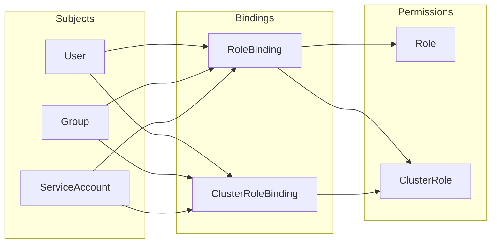

# How to Implement Kubernetes RBAC Best Practices for Multi-Tenant Clusters

Author: [nawazdhandala](https://www.github.com/nawazdhandala)

Tags: Kubernetes, Security, RBAC, Multi-Tenant, Access Control, DevOps

Description: Deep dive into Role, ClusterRole, RoleBinding patterns for securing multi-tenant Kubernetes clusters with least-privilege access control.

Role-Based Access Control (RBAC) is your Kubernetes cluster's bouncer. It decides who can do what to which resources. Get it wrong, and you've either locked out legitimate users or given everyone the keys to production. This guide walks through RBAC patterns that actually work in multi-tenant environments where multiple teams share the same cluster.

---

## Why RBAC Matters in Multi-Tenant Clusters

When multiple teams share a Kubernetes cluster, the attack surface multiplies:

- **Noisy neighbors**: One team's runaway deployment shouldn't affect another's
- **Data isolation**: Team A shouldn't read Team B's secrets
- **Blast radius**: A compromised service account in one namespace shouldn't pivot cluster-wide
- **Audit compliance**: You need to prove who did what and when

RBAC provides the guardrails. Combined with namespaces and network policies, it creates logical walls between tenants.

## RBAC Building Blocks

Before diving into patterns, let's clarify the four RBAC primitives:

This diagram shows how RBAC objects relate to each other. Subjects (users, groups, service accounts) are bound to Roles via Bindings.



### Role vs ClusterRole

| Type | Scope | Use Case |
|------|-------|----------|
| **Role** | Single namespace | Team-specific permissions |
| **ClusterRole** | Cluster-wide | Shared permissions, cluster resources |

### RoleBinding vs ClusterRoleBinding

| Type | Grants Access To | Use Case |
|------|------------------|----------|
| **RoleBinding** | One namespace | Apply ClusterRole to specific namespace |
| **ClusterRoleBinding** | All namespaces | Cluster admins, global readers |

The secret sauce: **ClusterRole + RoleBinding** lets you define permissions once and apply them selectively per namespace.

## Pattern 1: Namespace-Scoped Team Access

The most common pattern. Each team gets a namespace and full control within it.

### Create the Team Namespace

Namespaces provide the logical boundary for team isolation:

```yaml
# Team Alpha's isolated namespace
apiVersion: v1
kind: Namespace
metadata:
  name: team-alpha
  labels:
    # Labels help with policy targeting
    team: alpha
    environment: production
```

### Define Team Permissions with a ClusterRole

Create a reusable ClusterRole that grants typical developer permissions. This can be bound to any namespace without recreating the rules.

```yaml
# Reusable developer permissions
# ClusterRole so it can be referenced by RoleBindings in any namespace
apiVersion: rbac.authorization.k8s.io/v1
kind: ClusterRole
metadata:
  name: namespace-developer
rules:
  # Full control over workloads
  - apiGroups: ["apps"]
    resources: ["deployments", "replicasets", "statefulsets", "daemonsets"]
    verbs: ["get", "list", "watch", "create", "update", "patch", "delete"]
  
  # Pods and their logs
  - apiGroups: [""]
    resources: ["pods", "pods/log", "pods/exec"]
    verbs: ["get", "list", "watch", "create", "delete"]
  
  # Services and networking
  - apiGroups: [""]
    resources: ["services", "endpoints"]
    verbs: ["get", "list", "watch", "create", "update", "patch", "delete"]
  
  - apiGroups: ["networking.k8s.io"]
    resources: ["ingresses"]
    verbs: ["get", "list", "watch", "create", "update", "patch", "delete"]
  
  # ConfigMaps (not Secrets - handled separately)
  - apiGroups: [""]
    resources: ["configmaps"]
    verbs: ["get", "list", "watch", "create", "update", "patch", "delete"]
  
  # Jobs and CronJobs
  - apiGroups: ["batch"]
    resources: ["jobs", "cronjobs"]
    verbs: ["get", "list", "watch", "create", "update", "patch", "delete"]
  
  # HPAs for autoscaling
  - apiGroups: ["autoscaling"]
    resources: ["horizontalpodautoscalers"]
    verbs: ["get", "list", "watch", "create", "update", "patch", "delete"]
  
  # Events for debugging
  - apiGroups: [""]
    resources: ["events"]
    verbs: ["get", "list", "watch"]
```

### Bind the Role to Team Members

RoleBinding connects the ClusterRole to specific users/groups within the namespace boundary:

```yaml
# Grant namespace-developer permissions to Team Alpha
apiVersion: rbac.authorization.k8s.io/v1
kind: RoleBinding
metadata:
  name: team-alpha-developers
  namespace: team-alpha  # Only grants access to this namespace
subjects:
  # Bind to a group from your identity provider
  # Users in this group get the permissions
  - kind: Group
    name: team-alpha-devs  # From OIDC/LDAP group claim
    apiGroup: rbac.authorization.k8s.io
  
  # Or bind to specific users
  - kind: User
    name: alice@company.com
    apiGroup: rbac.authorization.k8s.io
roleRef:
  kind: ClusterRole  # Reference the cluster-wide role
  name: namespace-developer
  apiGroup: rbac.authorization.k8s.io
```

Now Team Alpha can deploy workloads in their namespace but can't touch anything in other namespaces.

## Pattern 2: Separate Read and Write Access

Not everyone needs write access. Create tiered permissions for different access levels.

### Read-Only ClusterRole

This role is perfect for observers, support staff, or CI systems that only need to inspect resources:

```yaml
# Read-only access for observers and debugging
apiVersion: rbac.authorization.k8s.io/v1
kind: ClusterRole
metadata:
  name: namespace-reader
rules:
  # Read all common resources
  - apiGroups: ["", "apps", "batch", "networking.k8s.io", "autoscaling"]
    resources: ["*"]
    verbs: ["get", "list", "watch"]
  
  # Explicitly deny secret content but allow listing
  # This lets users know secrets exist without reading values
  - apiGroups: [""]
    resources: ["secrets"]
    verbs: ["list"]  # No "get" - can see names but not data
```

### Restricted Write Role

For junior developers or automated systems that should only manage specific resource types:

```yaml
# Limited write access - only deployments and configmaps
apiVersion: rbac.authorization.k8s.io/v1
kind: ClusterRole
metadata:
  name: namespace-deployer
rules:
  # Can update deployments (for CI/CD)
  - apiGroups: ["apps"]
    resources: ["deployments"]
    verbs: ["get", "list", "watch", "update", "patch"]
  
  # Can manage configmaps
  - apiGroups: [""]
    resources: ["configmaps"]
    verbs: ["get", "list", "watch", "create", "update", "patch"]
  
  # Read-only for everything else
  - apiGroups: ["", "apps", "batch"]
    resources: ["pods", "services", "replicasets", "jobs"]
    verbs: ["get", "list", "watch"]
```

## Pattern 3: Service Account Per Workload

The default service account has minimal permissions, but shared service accounts across workloads violate least privilege. Create dedicated service accounts for each application.

### Create Application-Specific Service Account

Each application gets its own service account with only the permissions it needs:

```yaml
# Service account for the order-service application
apiVersion: v1
kind: ServiceAccount
metadata:
  name: order-service
  namespace: team-alpha
---
# Role with only the permissions order-service needs
apiVersion: rbac.authorization.k8s.io/v1
kind: Role
metadata:
  name: order-service-role
  namespace: team-alpha
rules:
  # Only needs to read configmaps for configuration
  - apiGroups: [""]
    resources: ["configmaps"]
    resourceNames: ["order-service-config"]  # Only this specific configmap
    verbs: ["get", "watch"]
  
  # Needs to read a specific secret
  - apiGroups: [""]
    resources: ["secrets"]
    resourceNames: ["order-service-db-creds"]  # Only this specific secret
    verbs: ["get"]
---
# Bind the role to the service account
apiVersion: rbac.authorization.k8s.io/v1
kind: RoleBinding
metadata:
  name: order-service-binding
  namespace: team-alpha
subjects:
  - kind: ServiceAccount
    name: order-service
    namespace: team-alpha
roleRef:
  kind: Role
  name: order-service-role
  apiGroup: rbac.authorization.k8s.io
```

### Reference in Deployment

Tell your deployment to use the dedicated service account:

```yaml
apiVersion: apps/v1
kind: Deployment
metadata:
  name: order-service
  namespace: team-alpha
spec:
  template:
    spec:
      # Use the dedicated service account
      serviceAccountName: order-service
      # Don't auto-mount the token unless needed
      automountServiceAccountToken: true  # Set false if app doesn't need k8s API access
      containers:
        - name: app
          image: order-service:latest
```

## Pattern 4: Cluster-Wide Read Access

Platform teams often need visibility across all namespaces without write access.

### Platform Observer Role

This ClusterRoleBinding grants read access to all namespaces:

```yaml
# Cluster-wide read access for platform team
apiVersion: rbac.authorization.k8s.io/v1
kind: ClusterRole
metadata:
  name: platform-observer
rules:
  # Read all resources in all namespaces
  - apiGroups: ["*"]
    resources: ["*"]
    verbs: ["get", "list", "watch"]
  
  # Explicitly exclude sensitive resources
  # Note: Rules are additive, can't subtract, so don't include secrets at all
---
apiVersion: rbac.authorization.k8s.io/v1
kind: ClusterRoleBinding
metadata:
  name: platform-observers
subjects:
  - kind: Group
    name: platform-team
    apiGroup: rbac.authorization.k8s.io
roleRef:
  kind: ClusterRole
  name: platform-observer
  apiGroup: rbac.authorization.k8s.io
```

## Pattern 5: Namespace Admin Delegation

Let team leads manage RBAC within their own namespace without cluster-admin powers.

### Namespace Admin Role

This role allows managing RoleBindings within a namespace but not creating new ClusterRoles:

```yaml
# Allow namespace admins to manage RBAC within their namespace
apiVersion: rbac.authorization.k8s.io/v1
kind: ClusterRole
metadata:
  name: namespace-admin
rules:
  # Full access to namespace resources
  - apiGroups: ["*"]
    resources: ["*"]
    verbs: ["*"]
  
  # Can create RoleBindings (but only reference existing ClusterRoles)
  - apiGroups: ["rbac.authorization.k8s.io"]
    resources: ["rolebindings"]
    verbs: ["get", "list", "watch", "create", "update", "patch", "delete"]
  
  # Can view available ClusterRoles to reference them
  - apiGroups: ["rbac.authorization.k8s.io"]
    resources: ["clusterroles"]
    verbs: ["get", "list", "watch"]
  
  # Cannot create ClusterRoles or ClusterRoleBindings
```

Combine with an aggregation label so you can extend it later:

```yaml
apiVersion: rbac.authorization.k8s.io/v1
kind: ClusterRole
metadata:
  name: namespace-admin
  labels:
    # Aggregation label for extensibility
    rbac.company.io/aggregate-to-namespace-admin: "true"
aggregationRule:
  clusterRoleSelectors:
    - matchLabels:
        rbac.company.io/aggregate-to-namespace-admin: "true"
rules: []  # Rules are automatically filled by aggregation
```

## Pattern 6: CI/CD Service Account

CI/CD pipelines need to deploy but shouldn't have interactive access.

### Scoped CI/CD Permissions

Create a service account for your CI system with deploy-only permissions:

```yaml
# Service account for CI/CD pipeline
apiVersion: v1
kind: ServiceAccount
metadata:
  name: cicd-deployer
  namespace: team-alpha
---
apiVersion: rbac.authorization.k8s.io/v1
kind: Role
metadata:
  name: cicd-deployer-role
  namespace: team-alpha
rules:
  # Can create and update deployments
  - apiGroups: ["apps"]
    resources: ["deployments"]
    verbs: ["get", "list", "create", "update", "patch"]
  
  # Can manage configmaps for config changes
  - apiGroups: [""]
    resources: ["configmaps"]
    verbs: ["get", "list", "create", "update", "patch"]
  
  # Can check rollout status
  - apiGroups: ["apps"]
    resources: ["deployments/status"]
    verbs: ["get"]
  
  # Can read pods to verify deployment
  - apiGroups: [""]
    resources: ["pods"]
    verbs: ["get", "list"]
  
  # Cannot: exec into pods, read secrets, delete resources
---
apiVersion: rbac.authorization.k8s.io/v1
kind: RoleBinding
metadata:
  name: cicd-deployer-binding
  namespace: team-alpha
subjects:
  - kind: ServiceAccount
    name: cicd-deployer
    namespace: team-alpha
roleRef:
  kind: Role
  name: cicd-deployer-role
  apiGroup: rbac.authorization.k8s.io
```

### Generate Token for External CI

For external CI systems (GitHub Actions, GitLab CI), create a long-lived token:

```yaml
# Long-lived token for external CI system
apiVersion: v1
kind: Secret
metadata:
  name: cicd-deployer-token
  namespace: team-alpha
  annotations:
    kubernetes.io/service-account.name: cicd-deployer
type: kubernetes.io/service-account-token
```

Retrieve and use in CI:

```bash
# Get the token for CI configuration
# Store this securely in your CI system's secrets
kubectl get secret cicd-deployer-token -n team-alpha \
  -o jsonpath='{.data.token}' | base64 -d
```

## Auditing RBAC Configuration

### Find Over-Privileged Bindings

Identify ClusterRoleBindings that grant cluster-admin or similarly powerful roles:

```bash
# Find all ClusterRoleBindings to cluster-admin
# These are high-risk and should be minimized
kubectl get clusterrolebindings -o json | jq -r '
  .items[] | 
  select(.roleRef.name == "cluster-admin") |
  "WARNING: \(.metadata.name) grants cluster-admin to \(.subjects[]?.name)"
'
```

### List All Bindings for a User

Check what permissions a specific user has across the cluster:

```bash
# Show all roles bound to a specific user
# Helps audit individual access levels
kubectl get rolebindings,clusterrolebindings -A -o json | jq -r '
  .items[] |
  select(.subjects[]?.name == "alice@company.com") |
  "\(.metadata.namespace // "cluster-wide"): \(.roleRef.name)"
'
```

### Test Permissions with `can-i`

Verify permissions without actually performing the action:

```bash
# Test if current user can create deployments in team-alpha
kubectl auth can-i create deployments -n team-alpha

# Test as a specific service account
kubectl auth can-i create deployments -n team-alpha \
  --as=system:serviceaccount:team-alpha:cicd-deployer

# List all permissions for a service account
kubectl auth can-i --list \
  --as=system:serviceaccount:team-alpha:order-service \
  -n team-alpha
```

## Common RBAC Mistakes

### Mistake 1: Using cluster-admin Everywhere

**Problem**: Giving cluster-admin to users or service accounts.

**Solution**: Create scoped roles. Even admins should use namespace-admin for daily work.

```bash
# Audit: Find non-system cluster-admin bindings
kubectl get clusterrolebindings -o json | jq -r '
  .items[] |
  select(.roleRef.name == "cluster-admin") |
  select(.subjects[]?.name | test("^system:") | not) |
  "REVIEW: \(.metadata.name)"
'
```

### Mistake 2: Wildcard Resources

**Problem**: Using `resources: ["*"]` grants access to everything, including future CRDs.

**Solution**: Explicitly list resources:

```yaml
# Bad: Wildcards include resources you didn't plan for
rules:
  - apiGroups: ["*"]
    resources: ["*"]  # Dangerous!
    verbs: ["*"]

# Good: Explicit resources
rules:
  - apiGroups: ["apps"]
    resources: ["deployments", "replicasets"]
    verbs: ["get", "list", "create", "update"]
```

### Mistake 3: Shared Service Accounts

**Problem**: Multiple workloads using the same service account.

**Solution**: One service account per workload with minimal permissions.

```bash
# Find pods using the default service account
# These should be reviewed for dedicated service accounts
kubectl get pods -A -o json | jq -r '
  .items[] |
  select(.spec.serviceAccountName == "default") |
  "\(.metadata.namespace)/\(.metadata.name) uses default SA"
'
```

### Mistake 4: Not Disabling Auto-Mount

**Problem**: Service account tokens auto-mounted when not needed.

**Solution**: Disable auto-mount for pods that don't call the Kubernetes API:

```yaml
spec:
  # Disable auto-mount if the pod doesn't need k8s API access
  automountServiceAccountToken: false
```

## Integrating RBAC with Identity Providers

### OIDC Integration

Configure your cluster to use external identity providers for user authentication. This example shows common OIDC flags:

```yaml
# kube-apiserver configuration for OIDC
# Add these flags to your API server
# These map claims from your identity provider to Kubernetes identities
apiServer:
  extraArgs:
    oidc-issuer-url: "https://accounts.google.com"
    oidc-client-id: "kubernetes-cluster"
    oidc-username-claim: "email"
    oidc-groups-claim: "groups"
    # Prefix to avoid collision with system accounts
    oidc-username-prefix: "oidc:"
    oidc-groups-prefix: "oidc:"
```

### RoleBinding for OIDC Groups

Reference OIDC groups in your RoleBindings:

```yaml
apiVersion: rbac.authorization.k8s.io/v1
kind: RoleBinding
metadata:
  name: team-alpha-from-oidc
  namespace: team-alpha
subjects:
  # Reference OIDC group with prefix
  - kind: Group
    name: "oidc:team-alpha-developers"  # Group from OIDC claim
    apiGroup: rbac.authorization.k8s.io
roleRef:
  kind: ClusterRole
  name: namespace-developer
  apiGroup: rbac.authorization.k8s.io
```

## Monitoring RBAC with Audit Logs

Enable audit logging to track RBAC-related events:

This audit policy logs all RBAC changes and authorization failures for security monitoring:

```yaml
# Audit policy for RBAC monitoring
apiVersion: audit.k8s.io/v1
kind: Policy
rules:
  # Log all RBAC changes
  - level: RequestResponse
    resources:
      - group: "rbac.authorization.k8s.io"
        resources: ["roles", "rolebindings", "clusterroles", "clusterrolebindings"]
    verbs: ["create", "update", "patch", "delete"]
  
  # Log authorization failures
  - level: Metadata
    omitStages:
      - RequestReceived
    resources:
      - group: ""
        resources: ["*"]
    verbs: ["*"]
```

### Alert on Suspicious RBAC Changes

Create alerts for concerning patterns:

```promql
# PromQL: Alert on new ClusterRoleBindings to cluster-admin
# Integrate with your alerting system
sum(increase(apiserver_audit_event_total{
  verb="create",
  objectRef_resource="clusterrolebindings"
}[5m])) > 0
```

## RBAC Best Practices Summary

1. **Start with zero permissions** - add only what's needed
2. **Use groups over users** - easier to manage at scale  
3. **ClusterRole + RoleBinding** - define once, apply per namespace
4. **One service account per workload** - isolate blast radius
5. **Audit regularly** - permissions drift over time
6. **Test with `can-i`** - verify before and after changes
7. **Disable token auto-mount** - unless the pod needs API access
8. **Document exceptions** - when someone needs extra permissions, explain why

## Related Resources

- [How to Set Up Pod Security Standards (PSS) in Kubernetes](https://oneuptime.com/blog/post/2026-01-19-kubernetes-pod-security-standards-pss/view) - Complement RBAC with workload security
- [Learn Kubernetes Step by Step](https://oneuptime.com/blog/post/2025-11-27-learn-kubernetes-step-by-step/view) - Kubernetes fundamentals
- [Monitor Kubernetes Clusters with OpenTelemetry and OneUptime](https://oneuptime.com/blog/post/2025-11-14-monitor-kubernetes-clusters-with-opentelemetry-and-oneuptime/view) - Observe your secured clusters

RBAC is not a one-time setup. As teams grow and applications evolve, permissions need regular review. Build RBAC auditing into your security practice, and the multi-tenant cluster becomes a reliable platform instead of a shared risk.
