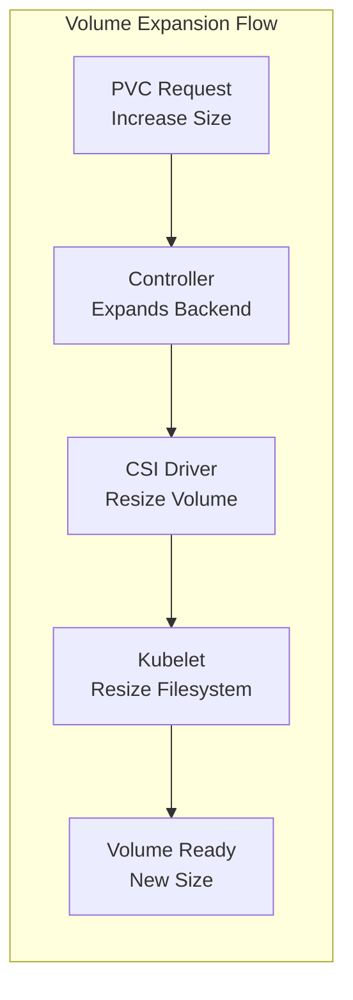
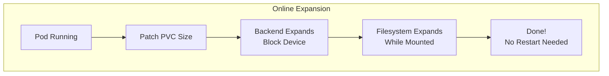

# How to Resize Persistent Volumes in Kubernetes Without Downtime

Author: [nawazdhandala](https://www.github.com/nawazdhandala)

Tags: Kubernetes, Persistent Volumes, PVC, Storage, Volume Expansion, CSI, DevOps

Description: Learn how to expand Kubernetes Persistent Volumes without downtime using volume expansion features, including online resizing, storage class configuration, and handling different CSI drivers.

---

Running out of disk space is one of the most common operational issues in Kubernetes. Fortunately, modern Kubernetes supports online volume expansion, allowing you to resize Persistent Volumes without downtime or pod restarts.

This guide covers everything you need to know about expanding PVs in Kubernetes.

## Prerequisites for Volume Expansion

Volume expansion requires:

1. **Kubernetes 1.24+** (stable feature)
2. **StorageClass with `allowVolumeExpansion: true`**
3. **CSI driver that supports expansion** (most modern drivers do)



## Checking If Your Storage Supports Expansion

```bash
# Check if your storage class allows expansion
kubectl get storageclass

# Example output:
# NAME            PROVISIONER             RECLAIMPOLICY   VOLUMEBINDINGMODE   ALLOWVOLUMEEXPANSION
# gp2 (default)   kubernetes.io/aws-ebs   Delete          WaitForFirstConsumer   true
# fast-ssd        ebs.csi.aws.com         Retain          WaitForFirstConsumer   true

# Check specific storage class
kubectl get storageclass gp2 -o yaml | grep allowVolumeExpansion
```

### Enable Volume Expansion on Existing Storage Class

```yaml
# storage-class-with-expansion.yaml
apiVersion: storage.k8s.io/v1
kind: StorageClass
metadata:
  name: expandable-storage
provisioner: ebs.csi.aws.com  # Your CSI driver
parameters:
  type: gp3
  encrypted: "true"
# This is the key setting!
allowVolumeExpansion: true
reclaimPolicy: Retain
volumeBindingMode: WaitForFirstConsumer
```

```bash
# Patch existing storage class to allow expansion
kubectl patch storageclass gp2 -p '{"allowVolumeExpansion": true}'
```

## Expanding a Persistent Volume Claim

### Step 1: Check Current PVC Size

```bash
# Get current PVC details
kubectl get pvc my-data -n my-namespace

# Output:
# NAME      STATUS   VOLUME          CAPACITY   ACCESS MODES   STORAGECLASS   AGE
# my-data   Bound    pvc-abc123...   10Gi       RWO            gp2            30d

# Get more details
kubectl describe pvc my-data -n my-namespace
```

### Step 2: Edit the PVC to Request More Storage

```bash
# Option 1: Edit directly
kubectl edit pvc my-data -n my-namespace
# Change spec.resources.requests.storage from "10Gi" to "50Gi"

# Option 2: Patch the PVC
kubectl patch pvc my-data -n my-namespace -p '{"spec":{"resources":{"requests":{"storage":"50Gi"}}}}'

# Option 3: Apply updated YAML
kubectl apply -f - <<EOF
apiVersion: v1
kind: PersistentVolumeClaim
metadata:
  name: my-data
  namespace: my-namespace
spec:
  accessModes:
    - ReadWriteOnce
  resources:
    requests:
      storage: 50Gi  # Increased from 10Gi
  storageClassName: gp2
EOF
```

### Step 3: Monitor the Expansion

```bash
# Watch PVC status
kubectl get pvc my-data -n my-namespace -w

# Check events for expansion progress
kubectl describe pvc my-data -n my-namespace | grep -A5 Events

# Example events:
# Events:
#   Type    Reason                      Age   From                         Message
#   ----    ------                      ----  ----                         -------
#   Normal  Resizing                    30s   external-resizer             External resizer is resizing volume
#   Normal  FileSystemResizeRequired    25s   external-resizer             Require file system resize of volume
#   Normal  FileSystemResizeSuccessful  10s   kubelet                      MountVolume.NodeExpandVolume succeeded
```

### Step 4: Verify the New Size

```bash
# Check PVC capacity
kubectl get pvc my-data -n my-namespace

# Check actual filesystem size inside the pod
kubectl exec -n my-namespace deployment/my-app -- df -h /data
```

## Online vs Offline Expansion

### Online Expansion (No Downtime)

Most modern CSI drivers support online expansion, meaning the volume can be resized while the pod is running:



**Supported CSI drivers for online expansion:**
- AWS EBS CSI Driver
- GCP PD CSI Driver
- Azure Disk CSI Driver
- Ceph CSI Driver
- Longhorn
- OpenEBS
- Portworx

### Offline Expansion (Requires Pod Restart)

Some storage backends only support offline expansion:

```yaml
# Check if your PVC needs offline expansion
kubectl describe pvc my-data -n my-namespace | grep -i "FileSystemResizePending"

# If you see this condition, the pod needs to be restarted
# Conditions:
#   Type                      Status
#   FileSystemResizePending   True
```

```bash
# For offline expansion, restart the pod
kubectl rollout restart deployment my-app -n my-namespace

# Or delete the pod (it will be recreated)
kubectl delete pod my-app-xxxxx -n my-namespace
```

## StatefulSet Volume Expansion

StatefulSets use `volumeClaimTemplates`, which requires special handling:

```yaml
# Original StatefulSet
apiVersion: apps/v1
kind: StatefulSet
metadata:
  name: postgres
spec:
  volumeClaimTemplates:
    - metadata:
        name: data
      spec:
        accessModes: ["ReadWriteOnce"]
        resources:
          requests:
            storage: 10Gi  # Original size
```

### Expanding StatefulSet Volumes

```bash
# You cannot directly edit volumeClaimTemplates in an existing StatefulSet
# Instead, expand each PVC individually

# List all PVCs for the StatefulSet
kubectl get pvc -l app=postgres -n database

# Output:
# NAME              STATUS   VOLUME        CAPACITY   STORAGECLASS
# data-postgres-0   Bound    pvc-xxx       10Gi       gp2
# data-postgres-1   Bound    pvc-yyy       10Gi       gp2
# data-postgres-2   Bound    pvc-zzz       10Gi       gp2

# Expand each PVC
for i in 0 1 2; do
  kubectl patch pvc data-postgres-$i -n database \
    -p '{"spec":{"resources":{"requests":{"storage":"50Gi"}}}}'
done

# Monitor expansion
kubectl get pvc -l app=postgres -n database -w
```

### Update StatefulSet for Future Pods

```bash
# Delete StatefulSet without deleting pods (--cascade=orphan)
kubectl delete statefulset postgres -n database --cascade=orphan

# Apply updated StatefulSet with new volume size
kubectl apply -f - <<EOF
apiVersion: apps/v1
kind: StatefulSet
metadata:
  name: postgres
  namespace: database
spec:
  serviceName: postgres-headless
  replicas: 3
  selector:
    matchLabels:
      app: postgres
  template:
    metadata:
      labels:
        app: postgres
    spec:
      containers:
        - name: postgres
          image: postgres:16
          volumeMounts:
            - name: data
              mountPath: /var/lib/postgresql/data
  volumeClaimTemplates:
    - metadata:
        name: data
      spec:
        accessModes: ["ReadWriteOnce"]
        resources:
          requests:
            storage: 50Gi  # New size for future pods
EOF
```

## Automating Volume Expansion

### Volume Expansion with Alert-Based Triggers

```yaml
# prometheus-rules.yaml
# Alert when volume is running low
apiVersion: monitoring.coreos.com/v1
kind: PrometheusRule
metadata:
  name: pvc-alerts
spec:
  groups:
    - name: pvc
      rules:
        - alert: PVCNearlyFull
          expr: |
            (kubelet_volume_stats_used_bytes / kubelet_volume_stats_capacity_bytes) > 0.8
          for: 5m
          labels:
            severity: warning
          annotations:
            summary: "PVC {{ $labels.persistentvolumeclaim }} is nearly full"
            description: "PVC is {{ $value | humanizePercentage }} full"
        
        - alert: PVCCriticallyFull
          expr: |
            (kubelet_volume_stats_used_bytes / kubelet_volume_stats_capacity_bytes) > 0.9
          for: 5m
          labels:
            severity: critical
          annotations:
            summary: "PVC {{ $labels.persistentvolumeclaim }} is critically full"
```

### Kubernetes Volume Autoscaler

```yaml
# volume-autoscaler.yaml
# Using Kubernetes-based autoscaler (example with pvc-autoscaler)
apiVersion: batch/v1
kind: CronJob
metadata:
  name: pvc-autoscaler
  namespace: kube-system
spec:
  schedule: "*/15 * * * *"  # Every 15 minutes
  jobTemplate:
    spec:
      template:
        spec:
          serviceAccountName: pvc-autoscaler
          containers:
            - name: autoscaler
              image: alpine/k8s:1.28.0
              command:
                - /bin/sh
                - -c
                - |
                  # Script to check and expand PVCs above threshold
                  THRESHOLD=80
                  EXPANSION_FACTOR=1.5
                  
                  for pvc in $(kubectl get pvc -A -o jsonpath='{range .items[*]}{.metadata.namespace}/{.metadata.name}{"\n"}{end}'); do
                    NS=$(echo $pvc | cut -d'/' -f1)
                    NAME=$(echo $pvc | cut -d'/' -f2)
                    
                    # Get usage percentage from metrics
                    USAGE=$(kubectl get --raw "/apis/metrics.k8s.io/v1beta1/namespaces/$NS/pods" 2>/dev/null | \
                      jq -r '.items[] | .containers[].usage.storage' | head -1)
                    
                    if [ "$USAGE" -gt "$THRESHOLD" ]; then
                      CURRENT=$(kubectl get pvc $NAME -n $NS -o jsonpath='{.spec.resources.requests.storage}')
                      NEW_SIZE=$(echo "$CURRENT * $EXPANSION_FACTOR" | bc)
                      echo "Expanding $NS/$NAME from $CURRENT to $NEW_SIZE"
                      kubectl patch pvc $NAME -n $NS -p "{\"spec\":{\"resources\":{\"requests\":{\"storage\":\"${NEW_SIZE}Gi\"}}}}"
                    fi
                  done
          restartPolicy: OnFailure
```

## Troubleshooting Volume Expansion

### Common Issues

#### 1. StorageClass Doesn't Allow Expansion

```bash
# Error: persistentvolumeclaims "my-data" is forbidden: 
# only dynamically provisioned pvc can be resized and 
# the storageclass that provisions the pvc must support resize

# Solution: Enable expansion on storage class
kubectl patch storageclass gp2 -p '{"allowVolumeExpansion": true}'
```

#### 2. CSI Driver Doesn't Support Online Expansion

```bash
# Check CSI driver capabilities
kubectl get csidrivers

# Output shows supported features
# NAME                  ATTACHREQUIRED   PODINFOONMOUNT   STORAGECAPACITY   TOKENREQUESTS   MODES
# ebs.csi.aws.com       true             false            false             <unset>         Persistent

kubectl describe csidriver ebs.csi.aws.com | grep -i "Volume Expansion"
```

#### 3. Expansion Stuck in Pending State

```bash
# Check PVC conditions
kubectl get pvc my-data -o jsonpath='{.status.conditions}' | jq

# If FileSystemResizePending is true, restart the pod
kubectl delete pod <pod-name>

# For StatefulSets
kubectl rollout restart statefulset my-statefulset
```

#### 4. Cannot Shrink Volumes

```bash
# Error: spec.resources.requests.storage: Forbidden: 
# field can not be less than previous value

# Solution: You cannot shrink PVCs in Kubernetes
# Options:
# 1. Create a new smaller PVC and migrate data
# 2. Leave it at the current size
```

### Verify Expansion Completed

```bash
# Check PVC status
kubectl get pvc my-data -o yaml | grep -A5 "status:"

# Expected output shows capacity matches request:
# status:
#   accessModes:
#   - ReadWriteOnce
#   capacity:
#     storage: 50Gi  # Should match requested size

# Verify inside the pod
kubectl exec -it my-pod -- df -h /data

# Expected output:
# Filesystem      Size  Used Avail Use% Mounted on
# /dev/nvme1n1    50G   8.2G   42G  16% /data
```

## Best Practices

### 1. Always Use Expandable Storage Classes

```yaml
# Make expansion the default
apiVersion: storage.k8s.io/v1
kind: StorageClass
metadata:
  name: standard
  annotations:
    storageclass.kubernetes.io/is-default-class: "true"
provisioner: ebs.csi.aws.com
allowVolumeExpansion: true  # Always enable this
```

### 2. Set Up Monitoring

```promql
# Prometheus query for PVC usage
kubelet_volume_stats_used_bytes{persistentvolumeclaim="my-data"} 
/ 
kubelet_volume_stats_capacity_bytes{persistentvolumeclaim="my-data"}
```

### 3. Plan for Growth

```yaml
# Instead of expanding frequently, plan capacity
spec:
  resources:
    requests:
      storage: 100Gi  # Start with headroom
```

### 4. Test Expansion in Staging First

```bash
# Always test volume expansion in non-production first
kubectl config use-context staging
kubectl patch pvc test-data -p '{"spec":{"resources":{"requests":{"storage":"20Gi"}}}}'
# Verify it works before doing production
```

## Conclusion

Volume expansion in Kubernetes is now a mature feature that works reliably with most storage backends. Key takeaways:

1. **Enable `allowVolumeExpansion`** on your StorageClasses
2. **Most modern CSI drivers** support online expansion
3. **StatefulSet volumes** need individual PVC patching
4. **Monitor PVC usage** and set up alerts before running out of space
5. **Cannot shrink volumes** - plan accordingly

For comprehensive monitoring of your storage and PVC usage, check out [OneUptime's Kubernetes monitoring](https://oneuptime.com/product/metrics).

## Related Resources

- [How to Set Up StatefulSets for Databases](https://oneuptime.com/blog/post/kubernetes-statefulsets-databases/view)
- [How to Back Up Kubernetes with Velero](https://oneuptime.com/blog/post/kubernetes-velero-backup-restore/view)
- [How to Debug Volume Mount Failures](https://oneuptime.com/blog/post/kubernetes-debug-volume-mount-failures/view)
