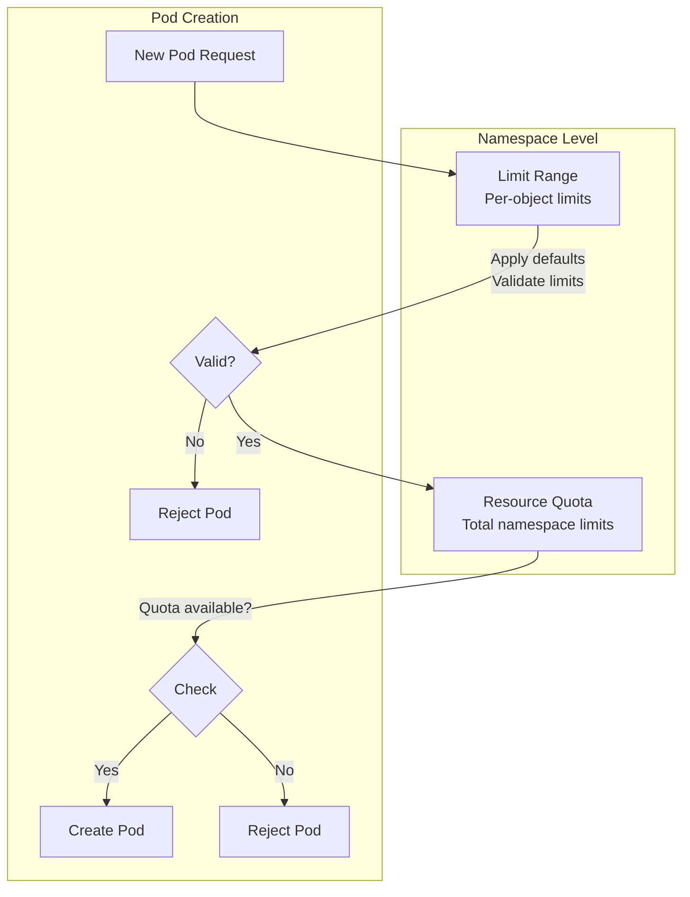

# How to Set Up Kubernetes Resource Quotas and Limit Ranges

Author: [nawazdhandala](https://www.github.com/nawazdhandala)

Tags: Kubernetes, Resource Quotas, Limit Ranges, Multi-Tenancy, Resource Management, DevOps

Description: Learn how to implement Kubernetes resource quotas and limit ranges to manage cluster resources effectively in multi-tenant environments.

---

Resource Quotas and Limit Ranges are essential Kubernetes features for managing cluster resources, preventing resource exhaustion, and enabling fair resource sharing in multi-tenant environments.

This guide covers how to implement both features effectively.

## Understanding Resource Management



| Feature | Scope | Purpose |
|---------|-------|---------|
| Resource Quota | Namespace | Total resource limits for all objects |
| Limit Range | Namespace | Default/min/max limits per object |

## Resource Quotas

### Basic CPU and Memory Quota

```yaml
# resource-quota-basic.yaml
apiVersion: v1
kind: ResourceQuota
metadata:
  name: compute-resources
  namespace: development
spec:
  hard:
    # CPU limits
    requests.cpu: "10"          # Total CPU requests across all pods
    limits.cpu: "20"            # Total CPU limits across all pods
    
    # Memory limits
    requests.memory: "20Gi"     # Total memory requests
    limits.memory: "40Gi"       # Total memory limits
    
    # Pod count
    pods: "50"                  # Maximum number of pods
```

```bash
# Apply the quota
kubectl apply -f resource-quota-basic.yaml

# Check quota status
kubectl describe quota compute-resources -n development

# Output:
# Name:            compute-resources
# Namespace:       development
# Resource         Used   Hard
# --------         ----   ----
# limits.cpu       2      20
# limits.memory    4Gi    40Gi
# pods             5      50
# requests.cpu     1      10
# requests.memory  2Gi    20Gi
```

### Storage Quota

```yaml
# storage-quota.yaml
apiVersion: v1
kind: ResourceQuota
metadata:
  name: storage-resources
  namespace: development
spec:
  hard:
    # Total PVC requests
    requests.storage: "100Gi"
    
    # Number of PVCs
    persistentvolumeclaims: "20"
    
    # Storage class specific quotas
    standard.storageclass.storage.k8s.io/requests.storage: "50Gi"
    premium.storageclass.storage.k8s.io/requests.storage: "50Gi"
    
    # Ephemeral storage
    requests.ephemeral-storage: "50Gi"
    limits.ephemeral-storage: "100Gi"
```

### Object Count Quota

```yaml
# object-count-quota.yaml
apiVersion: v1
kind: ResourceQuota
metadata:
  name: object-counts
  namespace: development
spec:
  hard:
    # Core objects
    pods: "100"
    services: "20"
    secrets: "50"
    configmaps: "50"
    
    # Workload objects
    count/deployments.apps: "20"
    count/replicasets.apps: "40"
    count/statefulsets.apps: "10"
    count/jobs.batch: "30"
    count/cronjobs.batch: "10"
    
    # Networking
    services.loadbalancers: "5"
    services.nodeports: "10"
    count/ingresses.networking.k8s.io: "10"
```

### Quota with Scopes

```yaml
# scoped-quota.yaml
# Different quotas based on pod priority
apiVersion: v1
kind: ResourceQuota
metadata:
  name: high-priority-quota
  namespace: production
spec:
  hard:
    pods: "20"
    requests.cpu: "20"
    requests.memory: "40Gi"
  scopeSelector:
    matchExpressions:
      - operator: In
        scopeName: PriorityClass
        values: ["high"]
---
apiVersion: v1
kind: ResourceQuota
metadata:
  name: low-priority-quota
  namespace: production
spec:
  hard:
    pods: "100"
    requests.cpu: "10"
    requests.memory: "20Gi"
  scopeSelector:
    matchExpressions:
      - operator: In
        scopeName: PriorityClass
        values: ["low", ""]  # Empty string for no priority class
```

```yaml
# terminating-vs-running-quota.yaml
# Different quotas for long-running vs terminating pods
apiVersion: v1
kind: ResourceQuota
metadata:
  name: running-pods-quota
  namespace: development
spec:
  hard:
    pods: "50"
    requests.cpu: "20"
  scopes:
    - NotTerminating  # Pods without activeDeadlineSeconds
---
apiVersion: v1
kind: ResourceQuota
metadata:
  name: terminating-pods-quota
  namespace: development
spec:
  hard:
    pods: "100"
    requests.cpu: "40"
  scopes:
    - Terminating  # Pods with activeDeadlineSeconds (Jobs)
```

## Limit Ranges

### Container-Level Limit Range

```yaml
# limitrange-container.yaml
apiVersion: v1
kind: LimitRange
metadata:
  name: container-limits
  namespace: development
spec:
  limits:
    - type: Container
      # Default values (applied if not specified)
      default:
        cpu: "500m"
        memory: "512Mi"
      # Default requests (applied if not specified)
      defaultRequest:
        cpu: "100m"
        memory: "128Mi"
      # Minimum allowed values
      min:
        cpu: "50m"
        memory: "64Mi"
      # Maximum allowed values
      max:
        cpu: "2"
        memory: "4Gi"
      # Maximum ratio of limits/requests
      maxLimitRequestRatio:
        cpu: "10"
        memory: "4"
```

### Pod-Level Limit Range

```yaml
# limitrange-pod.yaml
apiVersion: v1
kind: LimitRange
metadata:
  name: pod-limits
  namespace: development
spec:
  limits:
    - type: Pod
      # Maximum total resources for all containers in a pod
      max:
        cpu: "4"
        memory: "8Gi"
      min:
        cpu: "100m"
        memory: "128Mi"
```

### PVC Limit Range

```yaml
# limitrange-pvc.yaml
apiVersion: v1
kind: LimitRange
metadata:
  name: storage-limits
  namespace: development
spec:
  limits:
    - type: PersistentVolumeClaim
      min:
        storage: "1Gi"
      max:
        storage: "100Gi"
```

### Combined Limit Range

```yaml
# limitrange-combined.yaml
apiVersion: v1
kind: LimitRange
metadata:
  name: all-limits
  namespace: development
spec:
  limits:
    # Container limits
    - type: Container
      default:
        cpu: "500m"
        memory: "512Mi"
      defaultRequest:
        cpu: "100m"
        memory: "128Mi"
      min:
        cpu: "50m"
        memory: "64Mi"
      max:
        cpu: "2"
        memory: "4Gi"
    
    # Pod limits
    - type: Pod
      max:
        cpu: "4"
        memory: "8Gi"
    
    # PVC limits
    - type: PersistentVolumeClaim
      min:
        storage: "1Gi"
      max:
        storage: "50Gi"
```

## Multi-Tenant Resource Management

### Namespace Template for Teams

```yaml
# team-namespace-template.yaml
---
apiVersion: v1
kind: Namespace
metadata:
  name: team-frontend
  labels:
    team: frontend
    cost-center: eng-001
---
apiVersion: v1
kind: ResourceQuota
metadata:
  name: team-quota
  namespace: team-frontend
spec:
  hard:
    requests.cpu: "20"
    requests.memory: "40Gi"
    limits.cpu: "40"
    limits.memory: "80Gi"
    pods: "100"
    persistentvolumeclaims: "20"
    requests.storage: "200Gi"
    services.loadbalancers: "2"
---
apiVersion: v1
kind: LimitRange
metadata:
  name: team-limits
  namespace: team-frontend
spec:
  limits:
    - type: Container
      default:
        cpu: "500m"
        memory: "512Mi"
      defaultRequest:
        cpu: "100m"
        memory: "128Mi"
      min:
        cpu: "50m"
        memory: "64Mi"
      max:
        cpu: "4"
        memory: "8Gi"
```

### Environment-Based Quotas

```yaml
# dev-quota.yaml
apiVersion: v1
kind: ResourceQuota
metadata:
  name: dev-quota
  namespace: development
spec:
  hard:
    requests.cpu: "10"
    requests.memory: "20Gi"
    limits.cpu: "20"
    limits.memory: "40Gi"
    pods: "50"
---
# staging-quota.yaml
apiVersion: v1
kind: ResourceQuota
metadata:
  name: staging-quota
  namespace: staging
spec:
  hard:
    requests.cpu: "20"
    requests.memory: "40Gi"
    limits.cpu: "40"
    limits.memory: "80Gi"
    pods: "100"
---
# production-quota.yaml
apiVersion: v1
kind: ResourceQuota
metadata:
  name: production-quota
  namespace: production
spec:
  hard:
    requests.cpu: "100"
    requests.memory: "200Gi"
    limits.cpu: "200"
    limits.memory: "400Gi"
    pods: "500"
```

## Monitoring and Alerts

### Checking Quota Usage

```bash
# Get quota usage for a namespace
kubectl describe quota -n development

# Get quota usage across all namespaces
kubectl get quota --all-namespaces

# JSON output for automation
kubectl get quota -n development -o json | jq '.items[].status'

# Calculate usage percentage
kubectl get quota -n development -o json | jq '
  .items[] | 
  .status | 
  to_entries | 
  map({
    resource: .key,
    used: .value.used,
    hard: .value.hard,
    percent: ((.value.used | split(" ")[0] | tonumber) / (.value.hard | split(" ")[0] | tonumber) * 100 | floor)
  })
'
```

### Prometheus Alerts for Quota

```yaml
# quota-alerts.yaml
apiVersion: monitoring.coreos.com/v1
kind: PrometheusRule
metadata:
  name: quota-alerts
spec:
  groups:
    - name: quota.rules
      rules:
        # CPU quota usage above 80%
        - alert: NamespaceCPUQuotaHigh
          expr: |
            kube_resourcequota{type="used", resource="requests.cpu"} / 
            kube_resourcequota{type="hard", resource="requests.cpu"} > 0.8
          for: 5m
          labels:
            severity: warning
          annotations:
            summary: "Namespace {{ $labels.namespace }} CPU quota is above 80%"
            
        # Memory quota usage above 80%
        - alert: NamespaceMemoryQuotaHigh
          expr: |
            kube_resourcequota{type="used", resource="requests.memory"} / 
            kube_resourcequota{type="hard", resource="requests.memory"} > 0.8
          for: 5m
          labels:
            severity: warning
            
        # Pod quota usage above 90%
        - alert: NamespacePodQuotaNearLimit
          expr: |
            kube_resourcequota{type="used", resource="pods"} / 
            kube_resourcequota{type="hard", resource="pods"} > 0.9
          for: 5m
          labels:
            severity: warning
```

### Grafana Dashboard Queries

```promql
# Quota usage by namespace
sum by (namespace, resource) (kube_resourcequota{type="used"}) / 
sum by (namespace, resource) (kube_resourcequota{type="hard"}) * 100

# Namespaces near quota limit
sum by (namespace) (kube_resourcequota{type="used", resource="requests.cpu"}) / 
sum by (namespace) (kube_resourcequota{type="hard", resource="requests.cpu"}) > 0.9

# Trend of quota usage over time
sum by (namespace) (increase(kube_resourcequota{type="used", resource="pods"}[24h]))
```

## Troubleshooting

### Pod Rejected Due to Quota

```bash
# Error: forbidden: exceeded quota
# Check current quota usage
kubectl describe quota -n development

# Check which resources are exhausted
kubectl get quota -n development -o jsonpath='{range .items[*].status}{.used}{"\n"}{.hard}{"\n"}{end}'

# Find largest resource consumers
kubectl top pods -n development --sort-by=memory
kubectl top pods -n development --sort-by=cpu
```

### Pod Rejected Due to Limit Range

```bash
# Error: minimum cpu usage per Container is 50m, but request is 25m
# Check limit range
kubectl describe limitrange -n development

# Adjust your pod spec to meet minimum requirements
kubectl get limitrange -n development -o yaml
```

### Missing Resource Requests

```bash
# Error: must specify requests.cpu, requests.memory
# When quota exists, all pods must specify requests

# Find pods without requests
kubectl get pods -n development -o json | jq -r '
  .items[] | 
  select(.spec.containers[].resources.requests == null) | 
  .metadata.name
'

# Add defaults via LimitRange
kubectl apply -f - <<EOF
apiVersion: v1
kind: LimitRange
metadata:
  name: default-resources
  namespace: development
spec:
  limits:
    - type: Container
      defaultRequest:
        cpu: "100m"
        memory: "128Mi"
EOF
```

## Best Practices

### 1. Always Pair Quotas with Limit Ranges

```yaml
# Quota requires requests, LimitRange provides defaults
apiVersion: v1
kind: ResourceQuota
metadata:
  name: quota
  namespace: myapp
spec:
  hard:
    requests.cpu: "10"
    requests.memory: "20Gi"
---
apiVersion: v1
kind: LimitRange
metadata:
  name: defaults
  namespace: myapp
spec:
  limits:
    - type: Container
      defaultRequest:
        cpu: "100m"
        memory: "128Mi"
```

### 2. Set Reasonable maxLimitRequestRatio

```yaml
# Prevent extreme overcommitment
apiVersion: v1
kind: LimitRange
metadata:
  name: ratio-limits
spec:
  limits:
    - type: Container
      maxLimitRequestRatio:
        cpu: "5"      # Limits can be max 5x requests
        memory: "2"   # Memory limits can be max 2x requests
```

### 3. Create Quotas Before Workloads

```bash
# Always apply quotas first
kubectl create namespace new-team
kubectl apply -f quota.yaml -n new-team
kubectl apply -f limitrange.yaml -n new-team
# Then deploy workloads
kubectl apply -f deployment.yaml -n new-team
```

### 4. Document Quota Decisions

```yaml
apiVersion: v1
kind: ResourceQuota
metadata:
  name: team-quota
  namespace: team-frontend
  annotations:
    description: "Quota for frontend team - 20 cores, 40GB RAM"
    owner: "platform-team@company.com"
    last-reviewed: "2024-01-15"
    review-schedule: "quarterly"
spec:
  hard:
    requests.cpu: "20"
    requests.memory: "40Gi"
```

## Conclusion

Resource Quotas and Limit Ranges are fundamental for cluster governance. Key takeaways:

1. **Use both together** - Quotas limit totals, LimitRanges provide defaults
2. **Set appropriate defaults** - Prevent pods without resource specs
3. **Monitor quota usage** - Alert before hitting limits
4. **Review regularly** - Adjust quotas based on actual usage
5. **Document decisions** - Make quota allocations transparent

For monitoring quota usage and resource consumption, check out [OneUptime's Kubernetes monitoring](https://oneuptime.com/product/metrics).

## Related Resources

- [How to Right-Size Resources with VPA](https://oneuptime.com/blog/post/2026-01-30-resource-right-sizing/view)
- [How to Handle Pod Evictions](https://oneuptime.com/blog/post/2026-01-19-kubernetes-pod-evictions-resource-pressure/view)
- [How to Set Up Namespace Isolation](https://oneuptime.com/blog/post/2026-01-19-kubernetes-pod-communication-across-namespaces/view)
