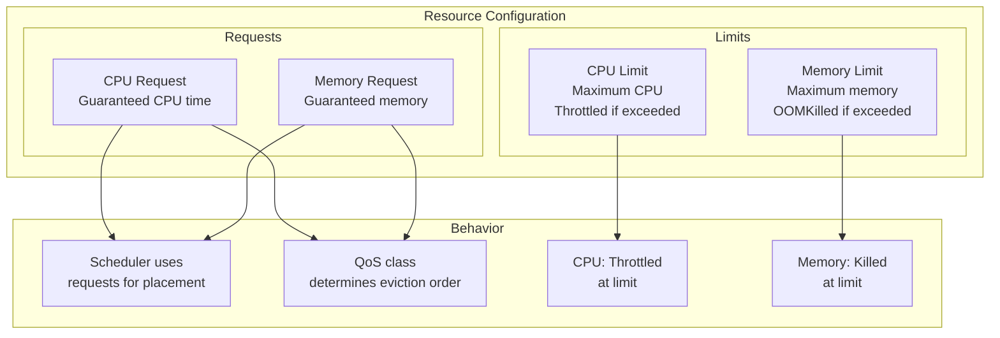
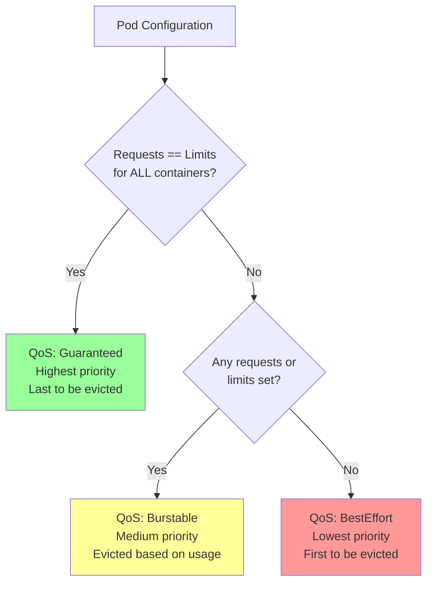
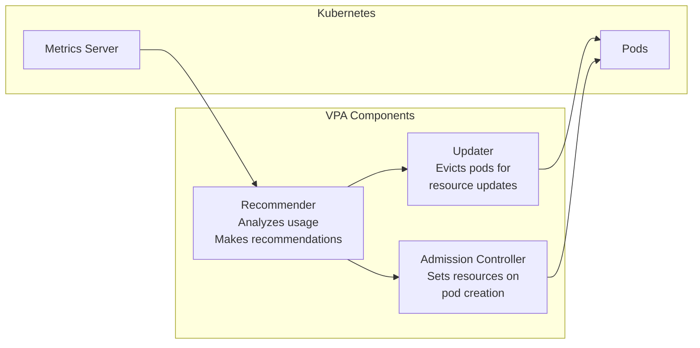

# How to Right-Size Kubernetes Resource Requests and Limits

Author: [nawazdhandala](https://www.github.com/nawazdhandala)

Tags: Kubernetes, Resources, VPA, Vertical Pod Autoscaler, CPU, Memory, Cost Optimization, Performance

Description: Learn how to properly configure CPU and memory requests and limits in Kubernetes using VPA recommendations, profiling techniques, and strategies to balance performance with cost efficiency.

---

Resource configuration is one of the most impactful yet overlooked aspects of running Kubernetes in production. Set requests too low, and your pods get evicted or throttled. Set them too high, and you waste money on unused capacity. Get them just right, and you achieve both reliability and cost efficiency.

This guide walks you through the science and art of right-sizing Kubernetes resources.

## Understanding Resource Requests and Limits



### The Difference Between Requests and Limits

```yaml
# resource-example.yaml
apiVersion: v1
kind: Pod
metadata:
  name: my-app
spec:
  containers:
    - name: app
      image: my-app:latest
      resources:
        # REQUESTS: Guaranteed resources
        # - Used by scheduler for placement decisions
        # - Determines QoS class
        # - Your pod is guaranteed at least this much
        requests:
          cpu: "500m"      # 0.5 CPU cores (500 millicores)
          memory: "256Mi"  # 256 mebibytes
        
        # LIMITS: Maximum resources
        # - CPU: Pod is throttled (not killed) if exceeded
        # - Memory: Pod is OOMKilled if exceeded
        # - Should typically be equal to or higher than requests
        limits:
          cpu: "1000m"     # 1 CPU core
          memory: "512Mi"  # 512 mebibytes
```

### CPU Units Explained

```yaml
# CPU is measured in millicores (m) or cores
resources:
  requests:
    # These are all equivalent:
    cpu: "500m"     # 500 millicores = 0.5 cores
    cpu: "0.5"      # 0.5 cores
    cpu: 0.5        # 0.5 cores (numeric)
    
    # Common values:
    # 100m = 0.1 cores (10% of one core)
    # 250m = 0.25 cores (1/4 of one core)
    # 500m = 0.5 cores (half of one core)
    # 1000m = 1 core
    # 2000m = 2 cores
```

### Memory Units Explained

```yaml
# Memory can be specified in various units
resources:
  requests:
    # Binary units (powers of 2) - RECOMMENDED
    memory: "128Mi"   # 128 mebibytes = 128 * 1024 * 1024 bytes
    memory: "1Gi"     # 1 gibibyte = 1024 * 1024 * 1024 bytes
    
    # Decimal units (powers of 10)
    memory: "128M"    # 128 megabytes = 128 * 1000 * 1000 bytes
    memory: "1G"      # 1 gigabyte = 1000 * 1000 * 1000 bytes
    
    # Common values:
    # 64Mi - Minimal containers (sidecars, simple apps)
    # 128Mi - Small applications
    # 256Mi - Medium applications
    # 512Mi - Larger applications
    # 1Gi - Memory-intensive applications
    # 2Gi+ - JVMs, databases, caches
```

## Quality of Service (QoS) Classes

Kubernetes assigns QoS classes based on your resource configuration:



```yaml
# Guaranteed QoS - Best for production workloads
# Requests MUST equal limits for ALL containers
apiVersion: v1
kind: Pod
metadata:
  name: guaranteed-pod
spec:
  containers:
    - name: app
      resources:
        requests:
          cpu: "500m"
          memory: "256Mi"
        limits:
          cpu: "500m"      # Same as request
          memory: "256Mi"  # Same as request

---
# Burstable QoS - Good for variable workloads
# At least one container has requests != limits
apiVersion: v1
kind: Pod
metadata:
  name: burstable-pod
spec:
  containers:
    - name: app
      resources:
        requests:
          cpu: "250m"
          memory: "128Mi"
        limits:
          cpu: "1000m"     # Higher than request (can burst)
          memory: "512Mi"  # Higher than request

---
# BestEffort QoS - Only for non-critical workloads
# No requests or limits set
apiVersion: v1
kind: Pod
metadata:
  name: besteffort-pod
spec:
  containers:
    - name: app
      # No resources specified - uses whatever is available
```

## Measuring Actual Resource Usage

Before setting resources, measure what your application actually uses.

### Using kubectl top

```bash
# View pod resource usage (requires metrics-server)
kubectl top pods -n <namespace>

# Output example:
# NAME                    CPU(cores)   MEMORY(bytes)
# my-app-5f7b9c4d6-x2k8p  45m          128Mi
# my-app-5f7b9c4d6-y3l9q  52m          132Mi

# View specific pod
kubectl top pod my-app-5f7b9c4d6-x2k8p

# View all pods with their containers
kubectl top pods --containers -n <namespace>

# View node resource usage
kubectl top nodes
```

### Using Prometheus Queries

```promql
# Average CPU usage over 24 hours (in cores)
avg_over_time(
  rate(container_cpu_usage_seconds_total{
    namespace="production",
    container="my-app"
  }[5m])
[24h])

# 95th percentile CPU usage
quantile_over_time(0.95,
  rate(container_cpu_usage_seconds_total{
    namespace="production",
    container="my-app"
  }[5m])
[24h])

# Average memory usage
avg_over_time(
  container_memory_working_set_bytes{
    namespace="production",
    container="my-app"
  }
[24h])

# Maximum memory usage
max_over_time(
  container_memory_working_set_bytes{
    namespace="production",
    container="my-app"
  }
[24h])

# CPU throttling (indicates limits too low)
rate(container_cpu_cfs_throttled_periods_total{
  namespace="production",
  container="my-app"
}[5m])
/
rate(container_cpu_cfs_periods_total{
  namespace="production",
  container="my-app"
}[5m])
```

### Load Testing for Accurate Measurements

```bash
# Run load test while monitoring resources
# Using k6 for load testing
k6 run --vus 100 --duration 10m load-test.js

# In another terminal, watch resource usage
watch -n 1 kubectl top pods -n production

# Or use Prometheus queries to capture peak usage
```

## Vertical Pod Autoscaler (VPA)

VPA automatically recommends or sets resource requests based on actual usage:



### Installing VPA

```bash
# Clone the VPA repository
git clone https://github.com/kubernetes/autoscaler.git
cd autoscaler/vertical-pod-autoscaler

# Install VPA components
./hack/vpa-up.sh

# Or install with Helm
helm repo add fairwinds-stable https://charts.fairwinds.com/stable
helm install vpa fairwinds-stable/vpa --namespace vpa --create-namespace

# Verify installation
kubectl get pods -n kube-system | grep vpa
```

### VPA Modes

```yaml
# vpa-recommendation-only.yaml
# RECOMMENDED: Start with "Off" mode to get recommendations without changes
apiVersion: autoscaling.k8s.io/v1
kind: VerticalPodAutoscaler
metadata:
  name: my-app-vpa
  namespace: production
spec:
  targetRef:
    apiVersion: apps/v1
    kind: Deployment
    name: my-app
  
  # updateMode options:
  # - "Off": Only provides recommendations (safest, start here)
  # - "Initial": Sets resources only when pod is created
  # - "Auto": Updates resources by evicting pods (disruptive)
  updatePolicy:
    updateMode: "Off"
  
  resourcePolicy:
    containerPolicies:
      - containerName: "*"
        # Minimum resources (prevents VPA from setting too low)
        minAllowed:
          cpu: 100m
          memory: 128Mi
        # Maximum resources (prevents VPA from setting too high)
        maxAllowed:
          cpu: 4
          memory: 8Gi
        # Which resources VPA can manage
        controlledResources: ["cpu", "memory"]
```

### Viewing VPA Recommendations

```bash
# Get VPA recommendations
kubectl describe vpa my-app-vpa -n production

# Output includes:
# - Target: Recommended requests
# - Lower Bound: Minimum recommended
# - Upper Bound: Maximum recommended
# - Uncapped Target: Recommendations without policy limits

# Example output:
# Recommendation:
#   Container Recommendations:
#     Container Name: my-app
#     Lower Bound:
#       Cpu:     25m
#       Memory:  128Mi
#     Target:
#       Cpu:     50m        # ← Use this for requests
#       Memory:  256Mi      # ← Use this for requests
#     Upper Bound:
#       Cpu:     200m
#       Memory:  512Mi
```

### Production VPA Configuration

```yaml
# vpa-production.yaml
apiVersion: autoscaling.k8s.io/v1
kind: VerticalPodAutoscaler
metadata:
  name: my-app-vpa
  namespace: production
spec:
  targetRef:
    apiVersion: apps/v1
    kind: Deployment
    name: my-app
  
  # Use "Auto" only after validating recommendations
  updatePolicy:
    updateMode: "Auto"
    # Minimum replicas before VPA will evict pods
    minReplicas: 2
  
  resourcePolicy:
    containerPolicies:
      - containerName: my-app
        minAllowed:
          cpu: 100m
          memory: 128Mi
        maxAllowed:
          cpu: 2
          memory: 4Gi
        controlledResources: ["cpu", "memory"]
        # Avoid setting very small CPU (can cause issues)
        controlledValues: RequestsAndLimits
      
      # Don't manage sidecar containers
      - containerName: istio-proxy
        mode: "Off"
```

## Right-Sizing Strategies

### Strategy 1: Conservative (Reliability First)

```yaml
# Best for: Critical production workloads
# Philosophy: Over-provision slightly to ensure stability
spec:
  containers:
    - name: app
      resources:
        # Set request at 75th percentile usage
        requests:
          cpu: "500m"
          memory: "512Mi"
        # Set limit at 95th percentile + 20% buffer
        limits:
          cpu: "1000m"
          memory: "768Mi"
```

### Strategy 2: Balanced (Performance + Cost)

```yaml
# Best for: Most production workloads
# Philosophy: Right-size based on actual usage with reasonable buffer
spec:
  containers:
    - name: app
      resources:
        # Set request at average usage + 20% buffer
        requests:
          cpu: "250m"
          memory: "256Mi"
        # Set limit at peak usage + 10% buffer
        limits:
          cpu: "500m"
          memory: "512Mi"
```

### Strategy 3: Aggressive (Cost First)

```yaml
# Best for: Non-critical workloads, batch jobs
# Philosophy: Minimize costs, accept occasional issues
spec:
  containers:
    - name: app
      resources:
        # Set request at average usage
        requests:
          cpu: "100m"
          memory: "128Mi"
        # Set limit higher to allow bursting
        limits:
          cpu: "1000m"
          memory: "512Mi"
```

### Strategy 4: Guaranteed Performance

```yaml
# Best for: Latency-sensitive workloads
# Philosophy: Eliminate variability, accept higher cost
spec:
  containers:
    - name: app
      resources:
        # Requests equal limits (Guaranteed QoS)
        requests:
          cpu: "500m"
          memory: "512Mi"
        limits:
          cpu: "500m"      # Same as request
          memory: "512Mi"  # Same as request
```

## Common Anti-Patterns and Fixes

### Anti-Pattern 1: No Resources Specified

```yaml
# BAD: BestEffort QoS, will be evicted first under pressure
spec:
  containers:
    - name: app
      # No resources - very bad for production!

# GOOD: Always specify at least requests
spec:
  containers:
    - name: app
      resources:
        requests:
          cpu: "100m"
          memory: "128Mi"
```

### Anti-Pattern 2: Limits Without Requests

```yaml
# BAD: Requests default to limits, over-provisioning
spec:
  containers:
    - name: app
      resources:
        limits:
          cpu: "2000m"
          memory: "2Gi"
        # Requests will default to 2000m CPU and 2Gi memory!

# GOOD: Always specify both
spec:
  containers:
    - name: app
      resources:
        requests:
          cpu: "500m"
          memory: "512Mi"
        limits:
          cpu: "2000m"
          memory: "2Gi"
```

### Anti-Pattern 3: Memory Limit Lower Than Startup Usage

```yaml
# BAD: App uses 400Mi at startup, limit is 256Mi
# Result: OOMKilled immediately on startup
spec:
  containers:
    - name: java-app
      resources:
        limits:
          memory: "256Mi"  # Too low for JVM startup!

# GOOD: Account for startup memory usage
spec:
  containers:
    - name: java-app
      resources:
        requests:
          memory: "512Mi"
        limits:
          memory: "1Gi"  # JVM needs headroom
```

### Anti-Pattern 4: CPU Limit Too Low

```yaml
# BAD: Very low CPU limit causes throttling
# Result: Slow response times, timeouts
spec:
  containers:
    - name: app
      resources:
        limits:
          cpu: "50m"  # Will be heavily throttled

# GOOD: Set CPU limit to allow bursting, or remove it
spec:
  containers:
    - name: app
      resources:
        requests:
          cpu: "50m"
        limits:
          cpu: "500m"  # Allow bursting up to 500m
```

### Anti-Pattern 5: Identical Resources for All Services

```yaml
# BAD: One-size-fits-all approach
# All pods get 1 CPU and 1Gi regardless of actual needs
resources:
  requests:
    cpu: "1000m"
    memory: "1Gi"
  limits:
    cpu: "1000m"
    memory: "1Gi"

# GOOD: Profile each service individually
# API Gateway (high traffic)
resources:
  requests: {cpu: "500m", memory: "512Mi"}
  limits: {cpu: "2000m", memory: "1Gi"}

# Background Worker (CPU intensive)
resources:
  requests: {cpu: "1000m", memory: "256Mi"}
  limits: {cpu: "2000m", memory: "512Mi"}

# Cache Sidecar (memory intensive)
resources:
  requests: {cpu: "100m", memory: "1Gi"}
  limits: {cpu: "200m", memory: "2Gi"}
```

## LimitRanges and ResourceQuotas

Enforce sane defaults at the namespace level:

```yaml
# limitrange.yaml
# Set defaults and constraints for pods in a namespace
apiVersion: v1
kind: LimitRange
metadata:
  name: resource-limits
  namespace: production
spec:
  limits:
    - type: Container
      # Default values if not specified
      default:
        cpu: "500m"
        memory: "512Mi"
      defaultRequest:
        cpu: "100m"
        memory: "128Mi"
      # Minimum and maximum allowed
      min:
        cpu: "50m"
        memory: "64Mi"
      max:
        cpu: "4"
        memory: "8Gi"
      # Max ratio of limit to request
      maxLimitRequestRatio:
        cpu: "10"
        memory: "4"
```

```yaml
# resourcequota.yaml
# Limit total resources consumed by a namespace
apiVersion: v1
kind: ResourceQuota
metadata:
  name: namespace-quota
  namespace: production
spec:
  hard:
    # Total CPU and memory limits
    requests.cpu: "20"
    requests.memory: "40Gi"
    limits.cpu: "40"
    limits.memory: "80Gi"
    # Pod count limits
    pods: "100"
    # Prevent BestEffort pods
    pods.BestEffort: "0"
```

## Monitoring Resource Efficiency

Create dashboards to track resource efficiency:

```promql
# CPU Request vs Usage Ratio
sum(rate(container_cpu_usage_seconds_total{namespace="production"}[5m])) by (pod)
/
sum(kube_pod_container_resource_requests{namespace="production", resource="cpu"}) by (pod)

# Memory Request vs Usage Ratio
sum(container_memory_working_set_bytes{namespace="production"}) by (pod)
/
sum(kube_pod_container_resource_requests{namespace="production", resource="memory"}) by (pod)

# Wasted CPU (requested but not used)
sum(kube_pod_container_resource_requests{resource="cpu"})
-
sum(rate(container_cpu_usage_seconds_total[5m]))

# Wasted Memory
sum(kube_pod_container_resource_requests{resource="memory"})
-
sum(container_memory_working_set_bytes)
```

```yaml
# Alert on inefficient resource usage
apiVersion: monitoring.coreos.com/v1
kind: PrometheusRule
metadata:
  name: resource-efficiency-alerts
spec:
  groups:
    - name: resources
      rules:
        - alert: HighMemoryRequest
          expr: |
            (
              container_memory_working_set_bytes{container!=""}
              / on(namespace, pod, container)
              kube_pod_container_resource_requests{resource="memory"}
            ) < 0.3
          for: 24h
          labels:
            severity: info
          annotations:
            summary: "Pod using less than 30% of requested memory"
            description: "{{ $labels.pod }} is only using {{ $value | humanizePercentage }} of requested memory"
```

## Conclusion

Right-sizing Kubernetes resources is an ongoing process, not a one-time task. Here's your action plan:

1. **Start with VPA in "Off" mode** - Get recommendations without risk
2. **Profile under realistic load** - Don't right-size based on idle usage
3. **Set appropriate QoS** - Use Guaranteed for critical workloads
4. **Monitor continuously** - Track usage trends and adjust
5. **Use LimitRanges** - Enforce sane defaults namespace-wide

Key takeaways:

- **Requests** = guaranteed resources, used for scheduling
- **Limits** = maximum allowed, triggers throttling (CPU) or OOMKill (memory)
- Set requests at average usage + buffer
- Set limits at peak usage + buffer
- Monitor CPU throttling and OOMKills

For comprehensive resource monitoring and alerting, check out [OneUptime's Kubernetes monitoring](https://oneuptime.com/product/metrics).

## Related Resources

- [How to Debug CrashLoopBackOff Pods](https://oneuptime.com/blog/post/2026-01-19-kubernetes-debug-crashloopbackoff/view)
- [How to Set Up Prometheus and Grafana on Kubernetes](https://oneuptime.com/blog/post/2025-01-06-python-custom-metrics-prometheus/view)
- [How to Profile Python Applications](https://oneuptime.com/blog/post/2025-01-06-profile-python-cprofile-pyspy/view)
